# Deep Learning on Medical Images at Population Scale: On-Demand Webinar and FAQ Now Available!

- Source: https://www.databricks.com/blog/2019/08/13/deep-learning-on-medical-images-at-population-scale-on-demand-webinar-and-faq-now-available.html
- Published: 2019-08-13
- Authors: Michael Ortega
- Categories: engineering, data-science-machine-learning, company, events, customers
- Images: 4 total, 1 extracted as architecture

On June 26th, we hosted a live webinar — [Deep Learning on Medical Images at Population-scale](https://pages.databricks.com/201906-US-WB-HLI-DL-Medical-Imaging_Reg.html)— with members of the data science and engineering teams from Human Longevity Inc (HLI), a leader in medical imaging and genomics.

During the webinar, HLI shared how they use MRI images, whole-genome sequencing data, and other clinical data sets to power Health Nucleus, a personalized health platform for detecting and determining the risk of pre-symptomatic disease such as Dementia. Core to this platform is the use of deep learning pipelines on large cohorts of MRI images to identify biomarkers for their integrated risk reports that allow people to better manage their lifecycles as it relates to degenerative diseases.

#### **Major Obstacles to AI Success**

One of the main challenges HLI faced was creating an agile machine learning environment. Their teams were highly disjointed using a range of siloed data and machine learning tools. This made it very difficult for them to create workflows that were collaborative, efficient, and reproducible — slowing productivity and their ability to innovate.

The other challenge they faced was around the management of their data from aggregation and training to validation of the data at scale. They struggled to not only process terabytes of data and pass it through various disjointed systems, but they had stringent HIPAA regulatory requirements to protect patient health information.

#### How They Leveraged Databricks to Power Integrated Health Screens

After discussing key challenges, HLI shared how they use Databricks and open-source technologies like Apache SparkTM, Tensorflow, and MLflow to build a comprehensive imaging database of 14,000+ de-identified individuals and power an agile environment for model development, training, and deployment.

Databricks is core to their data architecture. The data is stored in S3 which is then fed through an SQS messaging system into Databricks to kick off ETL batch jobs. Imaging data is then de-identified and  prepared for downstream analytics.

**Summary:** The diagram shows an S3, SQS, and Databricks pipeline for de-identifying DICOM images, logging processing activity, and cataloging cleaned data.

**Components:**

- Staging Area S3 bucket with backlog
- Copy DICOMs process
- S3 Raw Data
- SQS message queue
- Add message for new DICOMs process
- Databricks
- Audit log
- S3 Cleaned Data
- SumoLogic
- Data Catalog

**Flows:**

- Staging Area S3 bucket with backlog -> Copy DICOMs: DICOM files
- Copy DICOMs -> S3 Raw Data: copied DICOM files
- S3 Raw Data -> SQS: trigger message
- Add message for new DICOMs -> SQS: new DICOM message
- SQS -> Databricks: picked-up messages
- Databricks -> Audit: log data
- Databricks -> S3 Cleaned Data: de-identified DICOMs
- Databricks -> S3 Cleaned Data: log data
- Databricks -> Data Catalog: metadata
- S3 Cleaned Data -> SumoLogic: retrieve logs

**Numbers:** none

```mermaid
%% Shows the HLI DICOM de-identification data pipeline
flowchart LR
    A[Staging Area S3 bucket with backlog] -->|DICOM files| B[Copy DICOMs]
    B -->|copied DICOM files| C[S3 Raw Data]
    C -->|trigger message| D[SQS]
    E[Add message for new DICOMs] -->|new DICOM message| D
    D -->|picked-up messages| F[Databricks]
    F -->|log data| G[Audit]
    F -->|de-identified DICOMs| H[S3 Cleaned Data]
    F -->|log data| H
    F -->|metadata| I[Data Catalog]
    H -->|retrieve logs| J[SumoLogic]

    classDef client fill:#dbeafe,stroke:#2563eb,stroke-width:2px,color:#111
    classDef service fill:#dcfce7,stroke:#16a34a,stroke-width:2px,color:#111
    classDef store fill:#ede9fe,stroke:#7c3aed,stroke-width:2px,color:#111
    classDef cache fill:#fef3c7,stroke:#d97706,stroke-width:2px,color:#111
    classDef queue fill:#cffafe,stroke:#0891b2,stroke-width:2px,color:#111
    classDef critical fill:#fee2e2,stroke:#dc2626,stroke-width:4px,color:#111
    classDef external fill:#e5e7eb,stroke:#6b7280,stroke-width:2px,color:#111,stroke-dasharray:4 3
    classDef decision fill:#fce7f3,stroke:#db2777,stroke-width:2px,color:#111

    class A,C,H,I store
    class B,E,F service
    class D queue
    class G,J external
```

source image: https://www.databricks.com/wp-content/uploads/2019/07/HLI-Databricks-Architecture.png

The HLI team shared how they developed their core logic in Databricks on an interactive cluster and how the Databricks IDE integration enabled them to easily debug code within their pipelines. Through the use of the workspace CLI, they were able to easily copy/paste code from their IDE into a Databricks notebook for quick and easy troubleshooting and debugging, and then easily export the code back into their IDE.

Next, they showcased how they use their data to train machine learning models for predictive health scoring.  Critical to their machine learning workflow was ensuring a high-level of collaboration across research, data science and engineering and model reproducibility. MLflow, an open source framework for managing the end-to-end ML lifecycle, is core to this process.

Through the use of MLflow, the data science team at HLI was able to log and version their various experiments including results and parameters — allowing them to easily share and train models, and allows team members to then reuse code and models as needed. Another great feature of MLflow is that it’s language and environment agnostic, allowing their data scientists to use their coding environment of choice and execute their code against remote Databricks clusters.

In closing, the HLI team detailed some of the results and impact Databricks had on their ability to deliver on their deep learning projects. Specifically, they realized the following benefits:

- Improved cross-team collaboration on a unified platform
- Accelerated time from idea to product
- Accelerated biomarker identification - reduced the time taken to evaluate models
- Improved workflows unified bioinformatics and data science to fuel productivity
- Faster ETL pipelines and shorter ETL development time
- Streamlined model development - MLflow and prepackaged libraries enabled teams to build deep learning model much faster

#### **Live Demo and Notebooks: Deep Learning for Metastasis Identification**

After HLI’s presentation, we hosted a live demo of a deep learning model for metastasis identification on Databricks. Those notebooks are now available for you to run on your own:

- [Notebook 1: Whole Side Image Dataset](https://databricks-prod-cloudfront.cloud.databricks.com/public/4027ec902e239c93eaaa8714f173bcfc/1839019694868427/63194501763100/1720491171398644/latest.html) -  First, run this notebook which stages data from the GigaDB image repository into cloud storage.
- [Notebook 2: Generate Tumor/Normal Image Patches](https://databricks-prod-cloudfront.cloud.databricks.com/public/4027ec902e239c93eaaa8714f173bcfc/1839019694868427/63194501763115/1720491171398644/latest.html) – This next notebook processes the whole-slide images to create patch files that are used for training a neural network that detects metastases.
- [Notebook 3: Use Deep Learning to Detect Mestatic Sites](https://databricks-prod-cloudfront.cloud.databricks.com/public/4027ec902e239c93eaaa8714f173bcfc/1839019694868427/63194501763138/1720491171398644/latest.html) - This final notebook trains a neural network based on the Xception architecture to detect metastases, and logs the model in the MLFlow model store.

#### **Webinar Q&A**

At the end of the webinar we held a Q&A. Below are the questions and their answers:

**1) The metadata is being stored in a separate datastore than the ETLed images or is just being stored in another bucket?. Which datastore and format are you using?**

The metadata remains with the DICOM images on S3 as it is part of DICOM, but we also store a subset of the metadata information in our data catalog to query for images that are needed for a study. That provides faster performance, a standardized way of querying for metadata, and gives us an additional level of control of who has access to the data. Researchers will use a REST API to query for those images in the data catalog.

Interesting to know perhaps is that we don't store the tags of each individual DICOM file in our data catalog. Rather we store it on a series level, as our researchers care about the image series, rather than an individual image.

Our datastore backend is a non-relational database optimized for big data queries.

**2) What libraries/algorithms were used to de-identify DICOM images?**

We mainly used pydicom. However, we also used GDCM to do some of the decompression, that pydicom couldn't handle.

In terms of algorithms, we used exponential back-off for retry logic and flatMap transformations to distribute the workloads across our worker processes.

**3) Can you share any numbers on the GPU setup and typical training time?**

We distributed the training over four NVIDIA Tesla V100 GPUs using p3.8x.large instances. Since the 3D data requires more memory, we used small batch sizes and split the model over GPUS. On average training took at least 9hours, where patients on the validation dice were used as the early stopping criteria.  To extract the quantitative imaging biomarkers with the trained model for the 15K+ individuals in our reference population, we used 100 nodes of type c4.2x.large.

### Next Steps

 

- Download our Deep Learning for Metastasis Detection notebooks:
  - [Notebook 1: Whole Side Image Dataset](https://databricks-prod-cloudfront.cloud.databricks.com/public/4027ec902e239c93eaaa8714f173bcfc/1839019694868427/63194501763100/1720491171398644/latest.html)
  - [Notebook 2: Generate Tumor/Normal Image Patches](https://databricks-prod-cloudfront.cloud.databricks.com/public/4027ec902e239c93eaaa8714f173bcfc/1839019694868427/63194501763115/1720491171398644/latest.html)
  - [Notebook 3: Use Deep Learning to Detect Mestatic Sites](https://databricks-prod-cloudfront.cloud.databricks.com/public/4027ec902e239c93eaaa8714f173bcfc/1839019694868427/63194501763138/1720491171398644/latest.html)

- Watch the webinar replay: [Deep Learning on Medical Images at Population-scale](https://pages.databricks.com/201906-US-WB-HLI-DL-Medical-Imaging_Reg.html)
