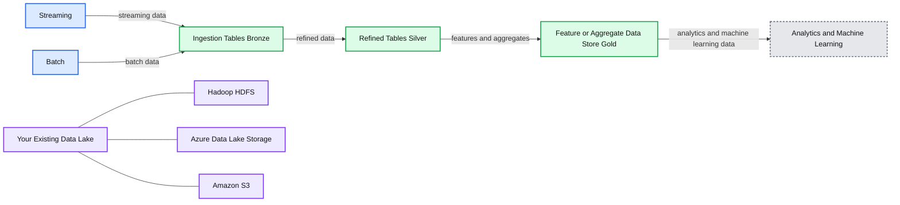
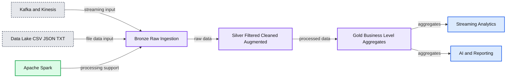
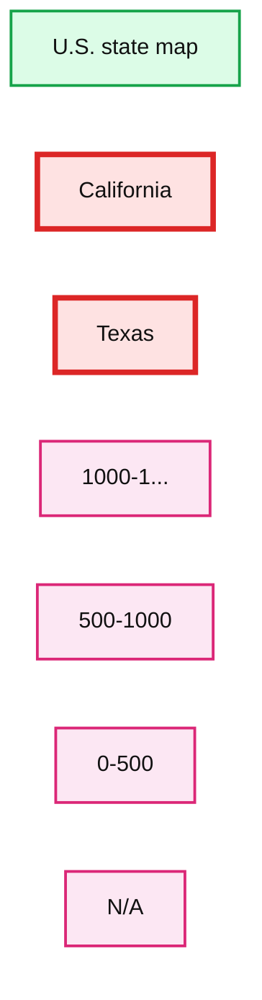
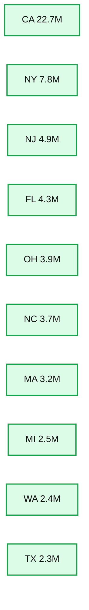

# Productionizing Machine Learning with Delta Lake

- Source: https://www.databricks.com/blog/2019/08/14/productionizing-machine-learning-with-delta-lake.html
- Published: 2019-08-14
- Authors: Brenner Heintz, Denny Lee
- Categories: platform, engineering, data-science-machine-learning
- Images: 11 total, 9 extracted as architecture

Get an early preview of [O'Reilly's new ebook](https://www.databricks.com/resources/ebook/delta-lake-running-oreilly?itm_data=productionizingmldeltalake-blog-oreillyupandrunning )for the step-by-step guidance you need to start using Delta Lake.

*Try out this notebook series in Databricks -* [part 1 (Delta Lake)](https://pages.databricks.com/rs/094-YMS-629/images/01-Delta%20Lake%20Workshop%20-%20Delta%20Lake%20Primer.html), [part 2 (Delta Lake + ML)](https://pages.databricks.com/rs/094-YMS-629/images/02-Delta%20Lake%20Workshop%20-%20Including%20ML.html)

---

For many data scientists, the process of building and tuning machine learning models is only a small portion of the work they do every day. The vast majority of their time is spent doing the less-than-glamorous (but crucial) work of performing ETL, building data pipelines, and putting models into production.

In this article, we’ll walk through the process of building a production data science pipeline step-by-step. Along the way, we’ll demonstrate how Delta Lake is the ideal platform for the machine learning life cycle because it offers tools and features that unify data science, data engineering, and production workflows, including:

- **Tables that can continuously process new data flows** from both historical and real-time streaming sources, greatly simplifying the data science production pipeline.
- **Schema enforcement,** which ensures that tables are kept clean and tidy, free from column contamination, and ready for machine learning.
- **Schema evolution**, which allows new columns to be added to existing data tables, even while those tables are being used in production, without causing breaking changes.
- **Time travel, a.k.a. data versioning**, allowing changes to any Delta Lake table to be audited, reproduced, or even rolled back if needed in the event of unintentional changes made due to user error.
- **Integration with MLflow**, enabling experiments to be tracked and reproduced by automatically logging experimental parameters, results, models and plots.

These features of Delta Lake allow data engineers and scientists to design reliable, resilient, automated data pipelines and machine learning models faster than ever.

## Building a Machine Learning Data Pipeline with Delta Lake

### Multi-Hop Architecture

A common architecture uses tables that correspond to different quality levels in the data engineering pipeline, progressively adding structure to the data: data ingestion (“Bronze” tables), transformation/feature engineering (“Silver” tables), and machine learning training or prediction (“Gold” tables). Combined, we refer to these tables as a “multi-hop” architecture. It allows data engineers to build a pipeline that begins with raw data as a **“single source of truth”** from which everything flows. Subsequent transformations and aggregations can be recalculated and validated to ensure that business-level aggregate tables still reflective the underlying data, even as downstream users refine the data and introduce context-specific structure.

**Summary:** Delta Lake organizes streaming and batch data into Bronze ingestion tables, Silver refined tables, and Gold feature or aggregate data for analytics and machine learning.

**Components:**

- Streaming data source
- Batch data source
- Delta Lake
- Ingestion Tables, Bronze
- Refined Tables, Silver
- Feature or Aggregate Data Store, Gold
- Analytics and Machine Learning
- Existing Data Lake
- Hadoop HDFS
- Azure Data Lake Storage
- Amazon S3

**Flows:**

- Streaming -> Ingestion Tables: streaming data
- Batch -> Ingestion Tables: batch data
- Ingestion Tables -> Refined Tables: refined data
- Refined Tables -> Feature or Aggregate Data Store: features and aggregates
- Feature or Aggregate Data Store -> Analytics and Machine Learning: analytics and machine learning data

**Numbers:** none



<sub>source image: https://www.databricks.com/wp-content/uploads/2019/08/Delta-Lake-Multi-Hop-Architecture-Overview.png</sub>

It’s worth diving a bit deeper into the analogy of data as water to understand how a Delta Lake pipeline works (if you’ll permit us the extended example). Instead of scheduling a series of distinct batch jobs to move the data through the pipeline in stages, Delta Lake allows data to flow through like water: seamlessly and constantly, in real-time.

Bronze tables serve as the prototypical lake, where massive amounts of water (data) trickle in continuously. When it arrives, it’s dirty because it comes from different sources, some of which are not so clean. From there, data flows constantly into Silver tables, like the headwaters of a stream connected to the lake, rapidly moving and constantly flowing. As water (or data, in our case) flows downstream, it is cleaned and filtered by the twists and turns of the river, becoming purer as it moves. By the time it reaches the water processing plant downstream (our Gold tables) it receives some final purification and stringent testing to make it ready for consumption, because consumers (in this case, ML algorithms) are very picky and will not tolerate contaminated water. Finally, from the purification plant, it is piped into the faucets of every downstream consumer (be they ML algorithms, or BI analysts), ready for consumption in its purest form.

The first step in preparing data for machine learning is to create a Bronze table, a place where data can be captured and retained in its rawest form. Let’s take a look at how to do this - but first, let’s talk about why Delta Lake is the obvious choice for your [data lake](https://www.databricks.com/discover/data-lakes/introduction).

### The Data Lake Dilemma

These days, the most common pattern we see is for companies to collect real-time streaming data (such as a customer’s click behavior on a website) using Azure Event Hubs or AWS Kinesis, and save it into inexpensive, plentiful cloud storage like Blob storage or S3 buckets. Companies often want to supplement this real-time streaming data with historical data (like a customer’s past purchase history) to get a complete picture of past and present.

As a result, companies tend to have a lot of raw, unstructured data that they’ve collected from various sources sitting stagnant in data lakes. Without a way to reliably combine historical data with real-time streaming data, and add structure to the data so that it can be fed into machine learning models, these data lakes can quickly become convoluted, unorganized messes that have given rise to the term “data swamps.”

Before a single data point has been transformed or analyzed, data engineers have already run into their first dilemma: how to bring together processing of historical (“batch”) data, and real-time streaming data. Traditionally, one might use a [lambda architecture](https://www.databricks.com/glossary/lambda-architecture) to bridge this gap, but that presents problems of its own stemming from lambda’s complexity, as well as its tendency to cause data loss or corruption.

### The Delta Lake Solution: Combining Past and Present in a Single Table

The solution to the “data lake dilemma” is to utilize [Delta Lake](https://delta.io/). Delta Lake is an open-source storage layer that sits on top of your data lake. It is built for distributed computing and 100% compatible with Apache Spark, so you can easily convert your existing data tables from whatever format they are currently stored in (CSV, Parquet, etc.) and save them as a Bronze table in Delta Lake format using your favorite [Spark APIs](https://www.databricks.com/glossary/spark-api), as shown below.

Once you’ve built a Bronze table for your raw data and converted your existing tables to Delta Lake format, you’ve already solved the data engineer’s first dilemma: combining past and present data. How? Delta Lake tables can handle the continuous flow of data from both historical and real-time streaming sources, seamlessly. And because it uses Spark, it is near-universally compatible with different streaming data input formats and source systems, be it Kafka, Kinesis, Cassandra or otherwise.

**Summary:** The diagram shows a Delta Lake data pipeline progressing from raw Bronze ingestion through Silver processing and Gold aggregation to analytics and reporting.

**Components:**

- Kafka and Kinesis: streaming data sources
- Data Lake: CSV, JSON and TXT data storage
- Apache Spark: processing engine
- Bronze: raw ingestion
- Silver: filtered, cleaned and augmented data
- Gold: business-level aggregates
- Streaming Analytics: analytics output
- AI and Reporting: reporting output

**Flows:**

- Kafka and Kinesis -> Bronze: streaming input
- Data Lake -> Bronze: file data input
- Apache Spark -> Bronze: processing support
- Bronze -> Silver: raw data
- Silver -> Gold: filtered, cleaned and augmented data
- Gold -> Streaming Analytics: business-level aggregates
- Gold -> AI and Reporting: business-level aggregates

**Numbers:** none



<sub>source image: https://www.databricks.com/wp-content/uploads/2019/08/Delta-Lake-Multi-Hop-Architecture-Bronze.png</sub>

To demonstrate how Delta Lake tables can process both batch and streaming data simultaneously, take a look at the following code. After loading our initial data set from the folder `DELTALAKE_FILE_PATH` into a Delta Lake table (as shown in the previous code block), we can use friendly SQL syntax to run a batch query on our current data, prior to streaming new data into the table.

**Summary:** The map shows U.S. loan counts by state, with California and Texas in the highest category.

**Components:**

- U.S. state map
- California
- Texas
- Legend category 1000-1...
- Legend category 500-1000
- Legend category 0-500
- Legend category N/A

**Flows:**

- none

**Numbers:** 1000-1..., 500-1000, 0-500



<sub>source image: https://www.databricks.com/wp-content/uploads/2019/08/USA-Map-1.png</sub>

As you can see above, initially, California and Texas have the highest numbers of loans.

Now that we’ve demonstrated Delta Lake’s ability to run batch queries, our next step is to showcase its ability to run queries on streaming data simultaneously.

We’ll create a streaming data source that continually adds new data to the Delta Lake table, combining with the existing batch data we plotted before. Notice how the `loan_by_state_readStream` reads from the same location, `DELTALAKE_FILE_PATH`, as the batch query did in the previous code block.

Effectively, batch and streaming data can land in the same location (i.e. `DELTALAKE_FILE_PATH`), and Delta Lake can respond to queries on both types of data, simultaneously - thus the maxim that Delta Lake tables provide a “unified batch and streaming source and sink.”

As Delta Lake processes the stream, the visualization updates before our eyes, and we start to see a different pattern emerge.

 

As you can see, Iowa (the state getting darker in the Midwest) has the largest number of loans due to the recent stream of data. The `loan_by_state_delta` table is updated even as new data is streaming into the table concurrently using `loan_by_state_readStream`.

Now that we’ve seen how Delta Lake allows us to reliably analyze batch and streaming sources of data simultaneously, the next step is to do some data cleaning, transformation and feature engineering to ready it for machine learning jobs.

## Creating High-Quality Feature Stores With Delta Lake

### Data Cleaning and Transformation

So far, we’ve successfully converted our data to Delta Lake format, and created a Bronze table that acts as a landing zone for both historical and real-time data to be processed seamlessly. At present, the data is in the right place, but far from useful in its current form: it requires significant cleaning, transformation, and structure before it can be used in machine learning models. ML modeling libraries don’t offer much (if any!) flexibility around data types, null values, and missing data, so the data engineer’s next job is to clean and process the raw data. Since Delta Lake is 100% compatible with Apache Spark, we can perform data munging to our hearts’ content on our Delta Lake tables using Spark’s familiar API, as shown below.

**Summary:** The diagram shows data flowing from Kafka, Kinesis, and a data lake through Bronze, Silver, and Gold Delta Lake stages to streaming analytics and AI and reporting.

**Components:**

- Kafka and Kinesis: streaming ingestion technologies
- Data Lake: source data storage
- Apache Spark: data processing technology
- Bronze: raw ingestion layer
- Silver: filtered, cleaned, and augmented data layer
- Gold: business-level aggregates layer
- Streaming Analytics: analytics consumer
- AI and Reporting: downstream consumer

**Flows:**

- Kafka and Kinesis -> Bronze: raw streaming data
- Data Lake -> Bronze: CSV, JSON, and TXT source data
- Bronze -> Silver: raw data for filtering, cleaning, and augmentation
- Silver -> Gold: processed data for business-level aggregation
- Gold -> Streaming Analytics: aggregated data
- Gold -> AI and Reporting: aggregated data

**Numbers:** none



<sub>source image: https://www.databricks.com/wp-content/uploads/2019/08/Delta-Lake-Multi-Hop-Architecture-Silver.png</sub>

```mermaid
%% Shows data flowing through Bronze, Silver, and Gold processing layers
flowchart LR
    A[Kafka Kinesis Data Lake] -->|Raw source data| B[Bronze Raw Ingestion]
    B -->|Raw data| C[Silver Filtered Cleaned Augmented]
    C -->|Processed data| D[Gold Business Level Aggregates]
    D -->|Aggregated data| E[Streaming Analytics]
    D -->|Aggregated data| F[AI and Reporting]

    classDef client fill:#dbeafe,stroke:#2563eb,stroke-width:2px,color:#111
    classDef service fill:#dcfce7,stroke:#16a34a,stroke-width:2px,color:#111
    classDef store fill:#ede9fe,stroke:#7c3aed,stroke-width:2px,color:#111
    classDef cache fill:#fef3c7,stroke:#d97706,stroke-width:2px,color:#111
    classDef queue fill:#cffafe,stroke:#0891b2,stroke-width:2px,color:#111
    classDef critical fill:#fee2e2,stroke:#dc2626,stroke-width:4px,color:#111
    classDef external fill:#e5e7eb,stroke:#6b7280,stroke-width:2px,color:#111,stroke-dasharray:4 3
    classDef decision fill:#fce7f3,stroke:#db2777,stroke-width:2px,color:#111

    class A queue
    class B,C,D store
    class E,F service
```

After performing ETL we can save the cleaned, processed data to a new Delta Lake Silver table, which allows us to save the result as a new table without modifying our original data.

### The Importance of Intermediate Steps

An intermediate Silver table is important because it might serve as the source for *multiple* downstream Gold tables, controlled by different business units and users. For example, you can imagine a Silver table representing “Product Sales” that flows into several Gold tables with very different uses: updating a supply chain dashboard, calculating payroll bonuses for salespeople, or providing high-level KPIs for Board members, for example.

The reason that we don’t simply connect Gold tables directly to the raw data held in Bronze tables is that it would cause a lot of duplicated effort. That would require each business unit to perform the same ETL on their data. Instead, we can perform it exactly once. As a side benefit, this step avoids confusion due to diverging data, like separate business units calculating the same metric slightly differently.

By following this blueprint, we can rest assured that the data saved or streamed into our final Gold table is clean, conforming, and consistent.

### Schema Enforcement

Now that we’ve transformed our data, the next step is to introduce structure to our Delta Lake Silver table by enforcing our schema. Schema enforcement is an important feature for data scientists and engineers because it ensures that we are able to keep our tables immaculately clean and tidy. Without schema enforcement, it’s possible for data types in a single column to get mixed together, wreaking havoc upon the reliability of our data. For example, if we accidentally introduce `StringType` data into a column of `FloatType` data, we could inadvertently make it impossible for our machine learning model to read the column, breaking our precious data pipeline.

**Summary:** The diagram shows a Delta architecture pipeline flowing from data sources through Bronze, Silver, and Gold stages to streaming analytics and AI reporting.

**Components:**

- Kafka and Kinesis: streaming data sources
- Data Lake: CSV, JSON, and TXT data source
- Apache Spark: data processing technology
- Bronze: raw ingestion storage
- Silver: filtered, cleaned, and augmented storage
- Gold: business-level aggregate storage
- Streaming Analytics: analytics output
- AI and Reporting: reporting output

**Flows:**

- Kafka and Kinesis -> Bronze: streaming data
- Data Lake -> Bronze: raw files
- Apache Spark -> Bronze: processed ingestion
- Bronze -> Silver: raw records
- Silver -> Gold: filtered, cleaned, and augmented data
- Gold -> Streaming Analytics: business-level aggregates
- Gold -> AI and Reporting: business-level aggregates

**Numbers:** none



<sub>source image: https://www.databricks.com/wp-content/uploads/2019/08/Delta-Lake-Multi-Hop-Architecture-Gold.png</sub>

```mermaid
%% Shows data flowing through Bronze Silver and Gold stages to analytics outputs
flowchart LR
    sources[Kafka Kinesis Data Lake Apache Spark] -->|raw streaming and file data| bronze[Bronze Raw Ingestion]
    bronze -->|raw records| silver[Silver Filtered Cleaned Augmented]
    silver -->|refined data| gold[Gold Business Level Aggregates]
    gold -->|aggregates| streaming[Streaming Analytics]
    gold -->|aggregates| reporting[AI and Reporting]

    classDef client   fill:#dbeafe,stroke:#2563eb,stroke-width:2px,color:#111
    classDef service  fill:#dcfce7,stroke:#16a34a,stroke-width:2px,color:#111
    classDef store    fill:#ede9fe,stroke:#7c3aed,stroke-width:2px,color:#111
    classDef cache    fill:#fef3c7,stroke:#d97706,stroke-width:2px,color:#111
    classDef queue    fill:#cffafe,stroke:#0891b2,stroke-width:2px,color:#111
    classDef critical fill:#fee2e2,stroke:#dc2626,stroke-width:4px,color:#111
    classDef external fill:#e5e7eb,stroke:#6b7280,stroke-width:2px,color:#111,stroke-dasharray:4 3
    classDef decision fill:#fce7f3,stroke:#db2777,stroke-width:2px,color:#111

    class sources external
    class bronze,silver,gold store
    class streaming,reporting service
```

Delta Lake offers **schema validation *on write***, which means that as it writes new records to a table, Delta Lake checks to make sure that those records match the table’s predefined schema. If the records do not match the table’s schema, Delta Lake will raise an exception, preventing the mismatched data from tainting the column with conflicting data types. This approach is preferable to schema validation *on read*, because it’s tough to “put the genie back in the bottle” once incorrect data types have already contaminated a column.

Delta Lake makes it easy to define your schema, and enforce it using the following code. Notice how the incoming data is rejected because it does not match the table’s schema.

In the event that the error is not due to a column containing data of the wrong type, but because we’ve (intentionally) added a new column that is not reflected in the current schema, we can add the column and correct the error using schema evolution, as we’ll explain later.

Once data has passed through schema enforcement to reach this stage, we can save it in its final form in a Delta Lake Gold table. It is now thoroughly cleaned, transformed, and ready for consumption by our machine learning models - which are rather picky about how data is structured! By streaming the data from its raw state through the Bronze and Silver tables along the way, we’ve set up a reproducible data science pipeline that can take all new data and get it into this ML-ready state. These streams can be low-latency or manually triggered, eliminating the need to manage schedules and jobs as in a traditional pipeline.

## Running Reproducible Experiments with Delta Lake Time Travel and MLflow

Now that we’ve transformed our data and added structure by using schema enforcement, we are ready to start running experiments and building models with our data. This is where the “science” in data science really kicks in. We get to create null and alternative hypotheses, build and test our models, and measure how well our models are able to predict our dependent variables. Indeed, this stage is where many of us shine!

Data scientists need to be able to run reproducible experiments. Reproducibility is the cornerstone of all scientific inquiry: if observations cannot be tested, retested, and reproduced, it’s impossible to get any closer to the truth. Yet, who among us makes strictly linear progress when there are so many different ways to approach the same problem?

Undoubtedly, many of us believe there’s a little bit of “magic” to the way that we go about things, and we get to our destination by following uncertain and circuitous routes of inquiry and exploration. And that’s alright - as long as we use tools that allow us to show our work, retrace our steps, and leave breadcrumbs behind - adding a little scientific method to the madness, if you will. With Delta Lake’s Time Travel and MLflow, all of the above and more is possible.

### Delta Lake Time Travel

For data scientists, one of Delta Lake’s most useful features is the ability to go back in time using data versioning, a.k.a. “time travel.” Delta Lake maintains an ordered transaction log of every operation that is performed on any Delta Lake table, so if you want to revert back to an earlier version of a table, undo an unintended operation, or even just see what your data looked like at a certain period in time, you can.

It’s easy to use time travel to select data from an earlier version of a table. Users can view the history of a table, and see what the data looked like at that point by using either a version history number (as shown in the code below, when selecting the table `loan_by_state_delta VERSION **AS OF** 0`), or by timestamp.

**Summary:** Databricks SQL displays the Delta Lake transaction history for `loan_by_state_delta`, showing five recent table operations.

**Components:**

- Databricks SQL notebook command
- Delta Lake table `loan_by_state_delta`
- Delta Lake transaction log history
- History columns for version, timestamp, user, operation, parameters, job, and notebook

**Flows:**

- SQL command -> Delta Lake history: requests table transaction history

**Numbers:** Cmd 48; versions 10, 9, 8, 7, 6; userId 100599; timestamps 2019-06-10T14:21:52.000+0000, 2019-06-10T14:21:28.000+0000, 2019-06-10T14:21:07.000+0000, 2019-06-10T14:20:51.000+0000, 2019-06-10T14:07:52.000+0000; predicate value 10851; states WA and IA.

```mermaid
%% Shows a Databricks SQL history query and the displayed Delta Lake transaction log
flowchart LR
    A[Databricks SQL command] -->|requests history| B[Delta Lake transaction log]
    B -->|returns five recent transactions| C[History results table]

    classDef client   fill:#dbeafe,stroke:#2563eb,stroke-width:2px,color:#111
    classDef service  fill:#dcfce7,stroke:#16a34a,stroke-width:2px,color:#111
    classDef store    fill:#ede9fe,stroke:#7c3aed,stroke-width:2px,color:#111
    classDef cache    fill:#fef3c7,stroke:#d97706,stroke-width:2px,color:#111
    classDef queue    fill:#cffafe,stroke:#0891b2,stroke-width:2px,color:#111
    classDef critical fill:#fee2e2,stroke:#dc2626,stroke-width:4px,color:#111
    classDef external fill:#e5e7eb,stroke:#6b7280,stroke-width:2px,color:#111,stroke-dasharray:4 3
    classDef decision fill:#fce7f3,stroke:#db2777,stroke-width:2px,color:#111
    class A client
    class B store
    class C service
```



<sub>source image: https://www.databricks.com/wp-content/uploads/2019/08/Delta-Lake-Time-Travel-DESCRIBE-HISTORY.png</sub>

To select a previous version of the table, you can use familiar SQL syntax, as shown below.

Instead of using table version number, you can also use a timestamp to get a “data snapshot” of what the data looked like at a specific point in time.

Along with MLflow (discussed below), Delta Lake’s time travel ensures that all of the transformations and experiments that you perform on your data are trackable, reproducible, and reversible. It can be used to:

- Recreate the state of a data set or table as it was at a specific point-in-time (creating data “snapshots”).
- Recreate and validate train and test data sets, and reproduce experiments.
- Roll back any unintended changes or transformations to tables.

The ordered transaction log creates a verifiable data lineage, which is especially useful for GRC (governance, risk, and compliance) applications. With regulation such as GDPR and CCPA, companies need the ability to prove that data was properly deleted or anonymized (whether en masse or at the individual level). Updates, merges, deletes, inserts, etc. can all be confirmed and validated for audit purposes.

Finally, data engineers can sleep easier knowing that human errors like unintentionally dropped rows or miscalculated columns are 100% reversible using time travel. Murphy’s Law famously dictates that if anything can go wrong, it will, and data pipelines are no exception - mistakes can and do inevitably occur due to human error. Losing data is more likely to occur because someone accidentally edited a table than because of a hardware failure, and those mistakes can be undone.

Another way the transaction log is helpful is in debugging an error that you’re seeing - you can go back in time, discover how a problem was created, and fix the problem or revert the data set.

### Tracking Experiments and Artifacts in MLflow

 

[MLflow](https://mlflow.org/) is an open-source Python library that works hand-in-hand with Delta Lake, enabling data scientists to effortlessly log and track metrics, parameters, and file and image artifacts. Users can run multiple different experiments, changing variables and parameters at will, knowing that the inputs and outputs have been logged and recorded. You can even save trained models automatically as you experiment with different combinations of hyperparameters, so that model weights are already saved and ready to go once you pick the best performing model.

In Databricks, MLflow is automatically enabled as of MLR 5.5, and you can view your MLflow runs using the [MLflow Runs Sidebar](https://www.databricks.com/blog/2019/04/30/introducing-mlflow-run-sidebar-in-databricks-notebooks.html), as shown below.

https://www.youtube.com/watch?v=o6SBBlhqw2A

## Adapting Data Pipelines To Fit New or Changing Requirements With Schema Evolution

Often, data engineers and scientists find that the initial construction of a data pipeline is easier than maintaining it. Changes to table schema over time are practically inevitable due to changing business requirements, business definitions, product updates, and the nature of time-series data, so it’s important to use tools that make those changes easier to manage. Delta Lake provides tools not only for schema enforcement but for schema evolution using the `mergeSchema` option, as shown below.

**Summary:** Bar chart showing loan amounts distributed across the ten states with the highest values.

**Components:**

- CA state, amount approximately 22.7M, technology not specified
- NY state, amount approximately 7.8M, technology not specified
- NJ state, amount approximately 4.9M, technology not specified
- FL state, amount approximately 4.3M, technology not specified
- OH state, amount approximately 3.9M, technology not specified
- NC state, amount approximately 3.7M, technology not specified
- MA state, amount approximately 3.2M, technology not specified
- MI state, amount approximately 2.5M, technology not specified
- WA state, amount approximately 2.4M, technology not specified
- TX state, amount approximately 2.3M, technology not specified

**Flows:**

- none

**Numbers:** 0.00, 2M, 4M, 6M, 8M, 10M, 12M, 14M, 16M, 18M, 20M, 22M, 24M



<sub>source image: https://www.databricks.com/wp-content/uploads/2019/08/Loan-Count-by-State-Bar-Graph.png</sub>

By adding `.option("mergeSchema","true")` to your query, any columns that are present in the DataFrame but not in the target Delta Lake table are added automatically as part of a write transaction. Data engineers and scientists can use this option to add new columns (perhaps a newly tracked metric, or a column of this month’s sales figures) to their existing machine learning production tables without breaking existing models that rely on the old columns.

## Tying It All Together: Building Machine Learning Models From Delta Lake Tables

With MLflow recording our parameters and results in the background, we’re ready to split our data into training and test sets, and train our machine learning models. We’ve already created the Gold table that we’ll train our model on by taking the transformed data from our Silver data, and enforcing the schema so that we are sure that all of the data that has made it into this final table is conforming and error-free. We’ve now built our pipeline using the “multi-hop” architecture we introduced earlier, enabling new data to flow continuously into our pipeline, which is then processed and saved in intermediate tables along the way.

To complete the machine learning life cycle, we’ll build a grid of GLM models with standardization and cross-validation as shown in the abbreviated code below. Our goal here is to predict whether a borrower defaulted on a given loan or not.  View the full code [here](https://pages.databricks.com/rs/094-YMS-629/images/02-Delta%20Lake%20Workshop%20-%20Including%20ML.html).

The resulting plot of the Receiver Operating Characteristic (ROC) Curve is shown below.

**Summary:** Receiver Operating Characteristic curve showing True Positive Rate versus False Positive Rate for a machine learning model.

**Components:**

- ROC curve
- FPR horizontal axis
- TPR vertical axis

**Flows:**

- none

**Numbers:** 0.00, 100m, 200m, 300m, 400m, 500m, 600m, 700m, 800m, 900m, 1.00

```text
%% mermaid failed to render; kept as text
%% Shows the ROC curve with false positive rate and true positive rate axes
flowchart LR
    F[FPR horizontal axis]
    R[ROC curve]
    T[TPR vertical axis]

    class F client
    class R service
    class T client

    classDef client   fill:#dbeafe,stroke:#2563eb,stroke-width:2px,color:#111
    classDef service  fill:#dcfce7,stroke:#16a34a,stroke-width:2px,color:#111
    classDef store    fill:#ede9fe,stroke:#7c3aed,stroke-width:2px,color:#111
    classDef cache    fill:#fef3c7,stroke:#d97706,stroke-width:2px,color:#111
    classDef queue    fill:#cffafe,stroke:#0891b2,stroke-width:2px,color:#111
    classDef critical fill:#fee2e2,stroke:#dc2626,stroke-width:4px,color:#111
    classDef external fill:#e5e7eb,stroke:#6b7280,stroke-width:2px,color:#111,stroke-dasharray:4 3
    classDef decision fill:#fce7f3,stroke:#db2777,stroke-width:2px,color:#111
    client = clients/edge/gateway/LB, service = stateless compute, store = databases/durable storage,
    cache = Redis/CDN/anything losable, queue = Kafka/streams/async pipes, critical = the bottleneck
    or SPOF use sparingly, external = third-party, decision = a trade-off point.
```

<sub>source image: https://www.databricks.com/wp-content/uploads/2019/08/ROC-Curve.png</sub>

We then go on to compare this model to several other generalized linear models in the full code notebook, found [here](https://pages.databricks.com/rs/094-YMS-629/images/03-Delta%20Lake%20Workshop%20-%20XGBoost%200.81.html). After choosing the best model (an XGBoost model), we use it to predict our test set, and plot the amount of money we either saved or lost based upon each correct or incorrect classification. As data scientists know, couching your analysis in hard dollars and cents like this is always a great idea as it makes your results concrete and easy to understand.

**Summary:** The chart shows net monetary impact for four combinations of actual labels and model predictions.

**Components:**

- label prediction legend with categories 1, 1; 0, 1; 1, 0; and 0, 0
- sum_net vertical axis measuring monetary impact

**Flows:**

- none

**Numbers:** 3.0M, 2.0M, 1.0M, 0.00, -1.0M, -2.0M, -3.0M, -4.0M, -5.0M, -6.0M, -7.0M; legend values 1, 1, 0, 1, 1, 0, 0, 0

```text
%% mermaid failed to render; kept as text
%% Shows net monetary impact by label and prediction category
flowchart LR
    A["1, 1"] -->|sum_net| V["-0.2M"]
    B["0, 1"] -->|sum_net| W["0.0"]
    C["1, 0"] -->|sum_net| X["-6.3M"]
    D["0, 0"] -->|sum_net| Y["2.2M"]

    class A,B,C,D client
    class V,W,X,Y service

    classDef client fill:#dbeafe,stroke:#2563eb,stroke-width:2px,color:#111
    classDef service fill:#dcfce7,stroke:#16a34a,stroke-width:2px,color:#111
    classDef store fill:#ede9fe,stroke:#7c3aed,stroke-width:2px,color:#111
    classDef cache fill:#fef3c7,stroke:#d97706,stroke-width:2px,color:#111
    classDef queue fill:#cffafe,stroke:#0891b2,stroke-width:2px,color:#111
    classDef critical fill:#fee2e2,stroke:#dc2626,stroke-width:4px,color:#111
    classDef external fill:#e5e7eb,stroke:#6b7280,stroke-width:2px,color:#111,stroke-dasharray:4 3
    classDef decision fill:#fce7f3,stroke:#db2777,stroke-width:2px,color:#111
    client = clients/edge/gateway/LB, service = stateless compute, store = databases/durable storage, cache = Redis/CDN/anything losable, queue = Kafka/streams/async pipes, critical = the bottleneck or SPOF, external = third-party, decision = a trade-off point
```

<sub>source image: https://www.databricks.com/wp-content/uploads/2019/08/Confusion-Matrix-Bar-Graph.png</sub>

You can find a blog post going into more depth with this example in Scala [here](https://www.databricks.com/blog/2018/08/09/loan-risk-analysis-with-xgboost-and-databricks-runtime-for-machine-learning.html).

## Summary

Delta Lake is ideal for the machine learning life cycle because it offers features that unify data science, data engineering, and production workflows. It enables the **continuous flow of data from raw to structured form**, allowing new ML models to be trained on fresh, incoming data while existing production models are serving predictions. It offers **schema enforcement**, which ensures data is in the right format to be processed by machine learning models, and **schema evolution**, which prevents schema changes from breaking existing production models. Finally, Delta Lake offers **“time travel”, a.k.a. data versioning** by way of an ordered transaction log, allowing data changes to be audited, reproduced, and even rolled back if needed.

Taken as a whole, these features of Delta Lake represent a step forward for data engineers and scientists, enabling them to design reliable, resilient, automated data pipelines and machine learning models faster than ever.

## Related Content

For more information, watch [Getting Data Ready for Data Science](https://pages.databricks.com/wb-getting-data-ready-for-data-science-reg.html).
