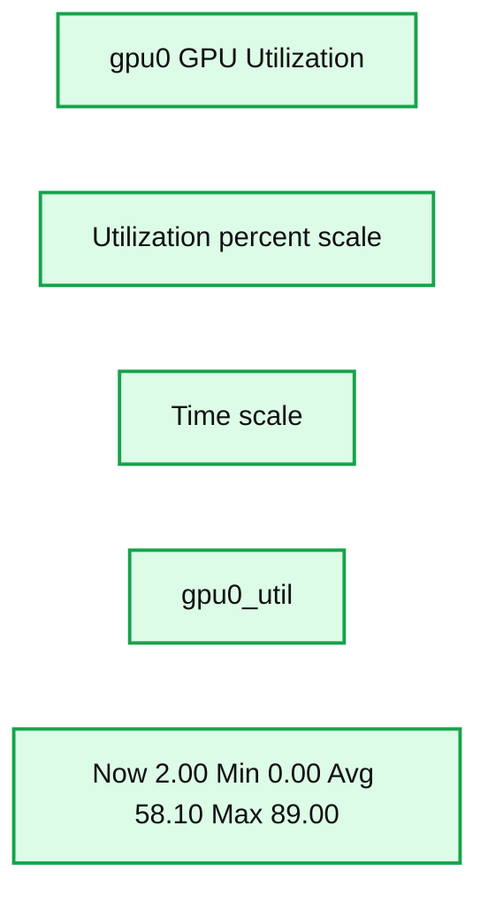
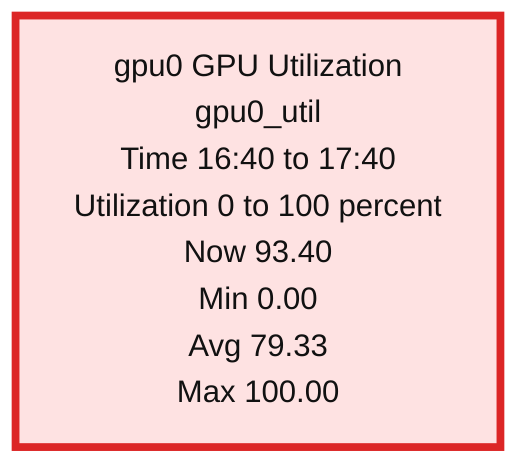
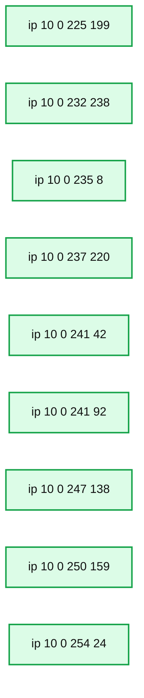

# How (Not) To Scale Deep Learning in 6 Easy Steps

- Source: https://www.databricks.com/blog/2019/08/15/how-not-to-scale-deep-learning-in-6-easy-steps.html
- Published: 2019-08-15
- Authors: Sean Owen
- Categories: engineering, data-science-machine-learning, company
- Images: 3 total, 3 extracted as architecture

[Try this notebook in Databricks](https://www.databricks.com/notebooks/how_not_to_scale_deep_learning.html)

## Introduction: The Problem

Deep learning sometimes seems like sorcery. Its state-of-the-art applications are at times [delightful](https://www.tensorflow.org/tutorials/generative/style_transfer) and at times [disturbing](https://www.forbes.com/sites/bernardmarr/2019/07/22/the-best-and-scariest-examples-of-ai-enabled-deepfakes/). The tools that achieve these results are, amazingly, mostly open source, and can work their magic on powerful hardware available to rent by the hour in the cloud.

It’s no wonder that companies are eager to apply [deep learning](https://www.databricks.com/glossary/deep-learning) for more prosaic business problems like better churn prediction, image curation, chatbots, time series analysis and more. Just because the tools are readily available doesn’t mean they’re easy to use well. Even choosing the right architecture, layers and activations is more art than science.

This blog won’t examine how to tune a deep learning architecture for accuracy. That process does, however, require training lots of models in a process of trial and error. This leads to a more immediate issue: scaling up the *performance* of deep learning training.

Tuning deep learning training doesn’t work like tuning an ETL job. It requires a large amount of compute from specialized hardware, and everyone eventually finds deep learning training ‘too slow’. Too often, users reach for solutions that may be overkill, expensive and not faster, when trying to scale up, while overlooking some basic errors that hurt performance.

This blog will instead walk through basic steps to avoid common performance pitfalls in training, and then the right steps, considered in the right order, to scale up by applying more complex tooling and more hardware. Hopefully, you will find your modeling job can move along much faster without reaching immediately for a cluster of extra GPUs.

## A Simple Classification Task

Because the focus here is not on the learning problem per se, the following examples will develop a simple data set and problem to solve: classifying the Caltech 256 dataset of about 30,000 images each into one of 257 (yes, 257) categories.

The data consists of JPEG files. These need to be resized to common dimensions, 299×299, to match the pre-trained base layer described below. The images are then written to Parquet files with labels to facilitate larger-scale training, described later. This can be accomplished with the ‘binary’ files data source in Apache Spark. See the accompanying notebook for full source code, but these are the highlights:

It’s also possible to use Spark’s built-in ‘image’ data source type to read these as well.

[Keras](https://keras.io/), the popular high-level front end for Tensorflow, can describe a straightforward deep learning model to classify the images. So can [PyTorch](https://pytorch.org/) -- the same ideas below would apply equally there too, though their execution would differ a little. There’s no need to build an image classifier from scratch. Instead, this example reuses the pretrained [Xception](https://keras.io/api/applications/#xception) model built into Keras and adds a dense layer on top to classify. (Note that this example uses Keras as included with Tensorflow 2.5.0, in tensorflow.keras, rather than standalone Keras). The pretrained layers themselves will not be trained further. Take that as step #0: use transfer learning and pretrained models when working with images!

### Step #1: Use a GPU

Almost the only situation where it makes sense to train a deep learning model on a CPU is when there are no GPUs available. When working in the cloud, on a platform like Databricks, it’s trivial to provision a machine with a GPU with all the drivers and libraries ready. While GPUs appear costly, the speed boost usually makes them more cost effective (and Databricks costs are actually discounted for GPU instances). This example will jump straight into training this model on a single NVIDIA Tesla T4 GPU.

This first pass will just load a 10% sample of the data from Delta as a [pandas DataFrame](https://www.databricks.com/glossary/pandas-dataframe), reshape the image data, and train in memory on 90% of that sample. Here, training just runs for 60 epochs on a small batch size. Small side tip: when using a pretrained network, it’s essential to normalize the image values to the range the network expects. Here, that’s [-1,1], and Keras provides a `preprocess_input function` to do this.

(Note: to run this example on Databricks, select the 8.4 ML Runtime or later with GPU support, and choose a Single Node cluster type and instance type with a single GPU.)

(Note: to run this example on Databricks, select the 8.4 ML Runtime or later with GPU support, and choose a Single Node cluster type and instance type with a single GPU.)

The results look good — 100% accuracy after about 20 minutes! However, there’s an important flaw. The final evaluation on the held-out 10% validation data shows that true accuracy is more like 78.5%. Actually, the model has overfit. That’s not good, but worse, it means that most of the time spent training was spent making it a little worse. It should have ended when accuracy on the validation data stopped decreasing. Not only would that have left a better model, it would have completed *faster*.

### Step #2: Use Early Stopping

Keras (and other frameworks like PyTorch Lightning) have built-in support for stopping when further training appears to be making the model worse. In Keras, it’s the [EarlyStopping](https://keras.io/api/callbacks/#earlystopping) callback. Using it means passing the validation data to the training process for evaluation on every epoch. Training will stop after several epochs have passed with no improvement. restore_best_weights=True ensures that the final model’s weights are from its best epoch, not just the last one. This should be your default.

Now, training stops in 11 epochs, not 60, and just 4 minutes. Each epoch took a little longer (21s vs 18s) because of the evaluation of the validation data. Accuracy is similar at 78.5%.

With early stopping, note that the number of epochs passed to fit() only matters as a limit on the maximum number of epochs that will run. It can be set to a large value. This is the first of a couple observations here that suggest the same thing: epochs don’t really matter as a unit of training. They’re just a number of batches of data that constitute the whole input to training. But training means passing over the data in batches repeatedly until the model is trained enough. How many epochs that represents isn’t directly important. An epoch is still useful as a point of comparison for time taken to train per amount of data though.

### Step #3: Max Out GPU with Larger Batch Sizes

In Databricks, cluster metrics are exposed through a Ganglia-based UI. This shows GPU utilization during training. Monitoring utilization is important to tuning as it can suggest bottlenecks. Here, the GPU is pretty well used at about 85%:

**Summary:** GPU utilization for `gpu0` over time, showing mostly 85% to 89% usage with one sharp dip.

**Components:**

- `gpu0 GPU Utilization` - GPU utilization metric
- `gpu0_util` - GPU utilization series
- Time axis - monitoring timeline
- Utilization axis - percentage scale

**Flows:**

- none

**Numbers:** 90, 80, 70, 60, 50, 40, 30, 20, 10, 0; 20:50, 21:00, 21:10, 21:20, 21:30, 21:40; Now 2.00; Min 0.00; Avg 58.10; Max 89.00

source image: https://www.databricks.com/wp-content/uploads/2021/08/How-Not-To-Scale-Deep-Learning-in-6-Easy-Steps-update-blog-img-1.png

 

100% is cooler than 85%. The batch size of 2 is small, and isn’t keeping the GPU busy enough during processing. Increasing the batch size would increase that utilization. The goal isn’t only to make the GPU busier, but to benefit from the extra work. Bigger batches improve how well each batch updates the model (up to a point) with more accurate gradients. That in turn can allow training to use a higher learning rate, and more quickly reach the point where the model stops improving.

Or, with extra capacity, it’s possible to add complexity to the network architecture itself to take advantage of that. This example doesn’t intend to explore tuning the architecture, but will try adding some dropout to decrease this network’s tendency to overfit.

With a larger batch size of 16 instead of 2, and learning rate of 0.004 instead of 0.001, the GPU crunches through epochs in under 18s instead of 21s. The model reaches about the same accuracy (78.1%) in only 8 epochs. Total train time was just 2.6 minutes, much better than 20.

It’s all too easy to increase the learning rate too far, in which case training accuracy will be poor and stay poor. When increasing the batch size by 8x, it’s typically advisable to increase learning rate by *at most* 8x. Some [research](https://arxiv.org/abs/1404.5997) suggests that when the batch size increases by N, the learning rate can scale by about sqrt(N).

Note that there is some randomness inherent in the training process, as inputs are shuffled by Keras. Accuracy fluctuates mostly up but sometimes down over time, and coupled with early stopping, training might terminate earlier or later depending on the order the data is encountered. To even this out, the ‘patience’ of EarlyStopping can be increased at the cost of extra training at the end.

### Step #4: Use Petastorm to Access Large Data

Training above used just a 10% sample of the data, and the tips above helped bring training time down by adopting a few best practices. The next step, of course, is to train on all of the data. This should help achieve higher accuracy, but means more data will have to be processed too. The full data set is many gigabytes, which could still fit in memory, but for purposes here, let’s pretend it wouldn’t. Data needs to be loaded efficiently in chunks into memory during training with a different approach.

Fortunately, the [Petastorm](https://github.com/uber/petastorm) library from Uber is designed to feed Parquet-based data into Tensorflow (or Keras, or PyTorch as well) training in this way. It can be applied by adapting the preprocessing and training code to create [Tensorflow Datasets](https://www.tensorflow.org/datasets), rather than pandas DataFrames, for training. Datasets here act like infinite iterators over the data, which means steps_per_epoch is now defined to specify how many batches make an epoch. This underscores how an ‘epoch’ is somewhat arbitrary.

Under the hood, [Petastorm's Spark integration](https://docs.databricks.com/applications/machine-learning/load-data/petastorm.html) accepts a Spark DataFrame of data (images, here) and serializes them to Parquet files, which are then streamed to the training process as Datasets.

The temporary Parquet files are stored in a path on DBFS (Databricks File System), which is merely a shim that makes distributed storage look like local files, and in some cases makes access faster. It's a fine idea to cache on a /dbfs path; this goes for checkpoint files too (not shown in this example).

The method above reimplements some of the preprocessing from earlier code in terms of Tensorflow’s transformation APIs.

Now run:

Epoch times are over 11x longer (208s vs 18s), but recall that an epoch here is now a full pass over the training data, not a 10% sample. The extra overhead comes from the I/O in reading data from cloud storage. The GPU utilization graph manifests this in “spiky” utilization of the GPU:

**Summary:** GPU utilization over time is shown as a spiky workload, averaging 79.33 percent with a current utilization of 93.40 percent.

**Components:**

- gpu0 GPU Utilization chart
- gpu0_util utilization series
- Time axis from 16:40 to approximately 17:40
- Percentage axis from 0 to 100

**Flows:**

- none

**Numbers:** 16:40, 16:50, 17:00, 17:10, 17:20, 17:30, 100, 90, 80, 70, 60, 50, 40, 30, 20, 10, 0, Now 93.40, Min 0.00, Avg 79.33, Max 100.00

source image: https://www.databricks.com/wp-content/uploads/2021/08/How-Not-To-Scale-Deep-Learning-in-6-Easy-Steps-update-blog-img-2.png

The upside? Accuracy is significantly better at 83.6%. The cost was much longer training time: 42 minutes instead of 4. For many applications, this could be well worth it  for a 7% increase in accuracy.

### Step #5: Use Multiple GPUs

Still want to go faster, and have some budget? At some point, scaling up means multiple GPUs. Instances with, for example, four T4 GPUs are readily available in the cloud. Tensorflow provides a simple utility called MirroredStrategy that can parallelize training across multiple GPUs. (The analog in PyTorch is [DataParallel](https://pytorch.org/tutorials/beginner/former_torchies/parallelism_tutorial.html).) It’s just a two-line code change:

(Note: to run this example, choose a single-node cluster with an instance type with 4 GPUs.)

The modification was easy, but to cut to the chase without repeating the training output: accuracy is similar, and per-epoch time becomes 68s instead of 208s. That’s not 4x faster, not even 3x faster. Each of the 4 GPUs is only processing 1/4th of each batch of 16 inputs, so each is effectively processing just 4 per batch. As above, it’s possible to increase the batch size by 4x to compensate, to 64, and further increase the learning rate to 0.008. (See the accompanying notebook for full code listings.)

It reveals that training is faster, at 61s per epoch. The speedup is better, but still not 4x. Accuracy is steady at around 84.4% (a bit better), so this still progresses towards faster training. The Tensorflow implementation is simple, but not optimal. GPU utilization remains spiky because the GPUs idle while it combines partial gradients in a straightforward but slow way.

[Horovod](https://github.com/horovod/horovod) is another project from Uber that helps scale deep learning training across not just multiple GPUs on one machine, but GPUs across many machines, and with great efficiency. While it’s often associated with training across multiple machines, that’s not actually the next step in scaling up. It can help this current multi-GPU setup. All else equal, it’ll be more efficient to utilize 4 GPUs connected to the same VM than spread across the network.

It requires a different modification to the code, which uses the [HorovodRunner](https://docs.databricks.com/applications/machine-learning/train-model/distributed-training/horovod-runner.html#horovodrunner) utility from Databricks to integrate Horovod with Spark:

Again a few notes:

- Note that make_tf_dataset needs the cur_shard and shard_count arguments to understand which subset of the data to load (e.g. that the current process is 2 of 4)
- Use hvd.callbacks.MetricAverageCallback to correctly average validation metrics
- Set HorovodRunner’s np= argument to minus the number of GPUs to use, when local
- Batch size here is now per GPU, not overall. Note the different computation in steps_per_epoch

The output from the training is, well, noisy and so won’t be copied here in full. Epoch time has come down to about 52s, from 208s, which is satisfyingly close to the maximum possible 4x speedup! Accuracy is still about 84.4%. Total runtime is now only 7.3 minutes, instead of 42.

### Step #6: Use Horovod Across Multiple Machines

Sometimes, 8 or even 16 GPUs just isn’t enough, and that’s the most you can get on one machine today. Or, sometimes it can be cheaper to provision GPUs across many smaller machines to take advantage of varying prices per machine type in the cloud.

The same Horovod example above can run on a cluster of eight 1-GPU machines instead of one 4-GPU machine with just a single line of change.  As it turns out, at the time of this writing in one cloud, these 8 GPUs cost just 6% more per hour than one 4-GPU machine. Although distributing across machines introduces more overhead, the extra throughput may yet make this option cheaper, and faster.

HorovodRunner manages the distributed work of Horovod on the Spark cluster by using Spark’s [barrier mode](https://www.databricks.com/blog/2018/11/08/introducing-apache-spark-2-4.html) support.

(Note: to run this example, provision a cluster with 8 workers, each with 1 GPU.)

The only necessary change is to specify 8, rather than -8, to select 8 GPUs on the cluster rather than on the driver. However with 8 GPUs, the effective batch size has doubled, so it might be useful to increase the learning rate to 0.012 in the snippet above.

GPU utilization is pleasingly full across 8 machines’ GPUs. The idle one is the driver, which does not participate in the training:

**Summary:** GPU utilization charts show near-full utilization across eight worker hosts, with one idle driver host.

**Components:**

- ip-10-0-225-199 host utilization chart
- ip-10-0-232-238 host utilization chart
- ip-10-0-235-8 host utilization chart
- ip-10-0-237-220 host utilization chart
- ip-10-0-241-42 host utilization chart
- ip-10-0-241-92 host utilization chart
- ip-10-0-247-138 host utilization chart
- ip-10-0-250-159 host utilization chart
- ip-10-0-254-24 host utilization chart

**Flows:**

- none

**Numbers:**

- 9 host charts
- 8 hosts’ GPUs active
- 1 idle driver
- 100, 50, 0 percent utilization
- 1.0, 0.5, 0.0 scale on one chart
- Time labels 15:40, 16:00, 16:20
- Host IPs 10.0.225.199, 10.0.232.238, 10.0.235.8, 10.0.237.220, 10.0.241.42, 10.0.241.92, 10.0.247.138, 10.0.250.159, 10.0.254.24
- us-west-2
- compute.internal

source image: https://www.databricks.com/wp-content/uploads/2021/08/How-Not-To-Scale-Deep-Learning-in-6-Easy-Steps-update-blog-img-3.jpg

Accuracy happens to improve a bit more, to 85.6%. Total run time is about 5.7 minutes rather than 7.3, which isn't nearly a 2x speedup. This partly reflects the overhead of coordinating GPUs across machines.

For a problem of this moderate size, it probably won’t be possible to usefully exploit more GPU resources. Keeping them busy would mean larger learning rates and the learning rate may already be about as high as it can go. For this network, a few T4 GPUs may be the right maximum amount of resource to deploy. Of course, there are much larger networks and datasets out there!

## Conclusion

Deep learning is powerful magic, but we always want it to go faster. It scales in different ways though. There are new best practices and pitfalls to know when setting out to train a model. A few of these helped the small image classification problem here achieve the same 78.5% accuracy while reducing runtime over 7x. The first steps in scaling aren’t more resources, but looking for easy optimizations:

1. Use a pre-trained base layer where possible
2. Use a GPU, almost always
3. Use early stopping
4. Max out GPU utilization with larger batch sizes - and learning rates

Scaling to train on an entire large data set in the cloud requires some new tools, but not necessarily more GPUs at first. With careful use of Petastorm, 10x the data helped achieve 83.6% accuracy in about 10x the time on the same hardware.

1. Use Petastorm to handle large data sets efficiently during training

The next step of scaling up means utilizing multiple GPUs with tools like Horovod, but doesn't necessarily mean a cluster of machines, unlike in ETL jobs where a cluster of machines is the norm. A single 4 GPU instance allowed training to finish 4x faster and achieve 84.4% accuracy. Only for the largest problems are multiple GPU instances necessary, but Horovod can help scale there further without much overhead, to improve accuracy even further.

1. Scale to multiple GPUs on one machine with Horovod
2. Scale ot more GPUs spread across a cluster of machines with Horovod

Happy training!
