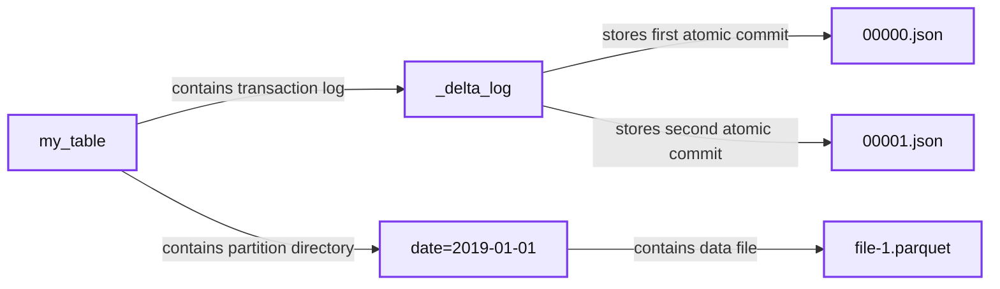
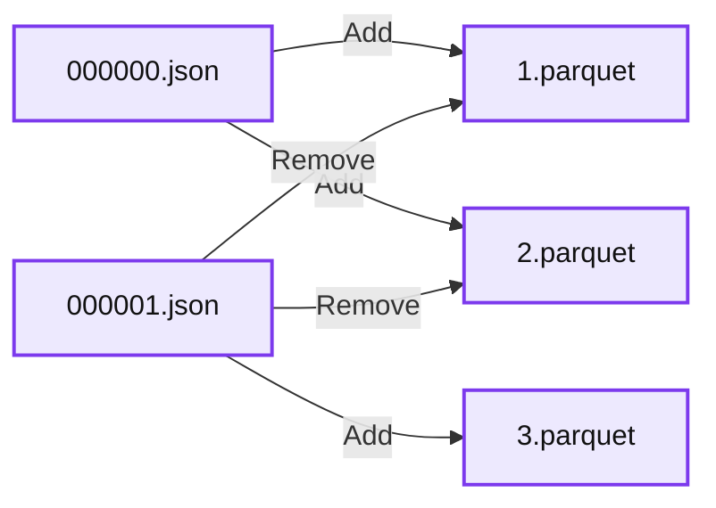
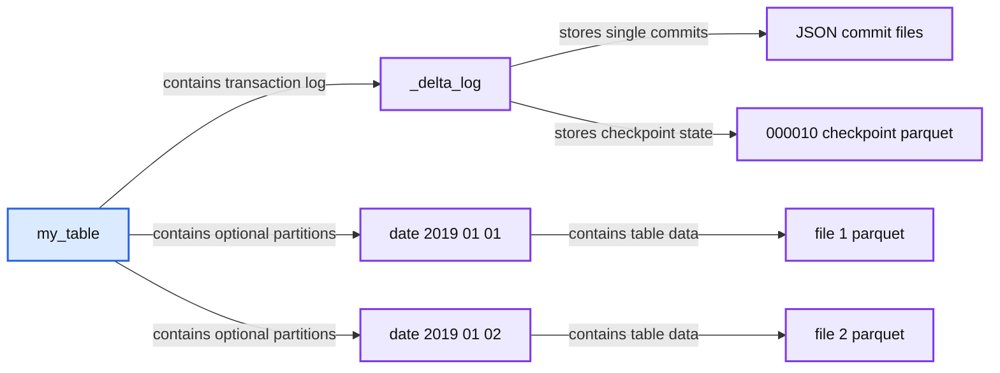
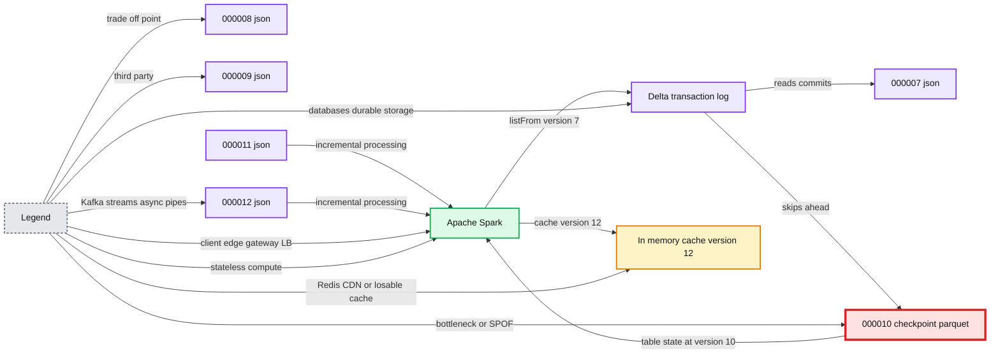

# Diving Into Delta Lake: Unpacking The Transaction Log

- Source: https://www.databricks.com/blog/2019/08/21/diving-into-delta-lake-unpacking-the-transaction-log.html
- Published: 2019-08-21
- Authors: Burak Yavuz, Michael Armbrust, Brenner Heintz
- Categories: platform, product, solutions, engineering, open-source, company, news, customers
- Images: 6 total, 5 extracted as architecture

The transaction log is key to understanding [Delta Lake](https://www.databricks.com/resources/ebook/delta-lake-running-oreilly?itm_data=unpackingtransaction-blog-oreillyupandrunning )because it is the common thread that runs through many of its most important features, including ACID transactions, scalable metadata handling, time travel, and more. In this article, we’ll explore what the Delta Lake transaction log is, how it works at the file level, and how it offers an elegant solution to the problem of multiple concurrent reads and writes.

## What Is the Delta Lake Transaction Log?

The Delta Lake transaction log (also known as the `DeltaLog`) is an ordered record of every transaction that has ever been performed on a Delta Lake table since its inception.

## What Is the Transaction Log Used For?

### Single Source of Truth

Delta Lake is built on top of Apache Spark™ in order to allow multiple readers and writers of a given table to all work on the table at the same time. In order to show users correct views of the data at all times, the Delta Lake transaction log serves as a **single source of truth** - the central repository that tracks all changes that users make to the table.

When a user reads a Delta Lake table for the first time or runs a new query on an open table that has been modified since the last time it was read, **Spark checks the transaction log to see what new transactions have posted to the table, and then updates the end user’s table with those new changes.** This ensures that a user’s version of a table is always synchronized with the master record as of the most recent query, and that users cannot make divergent, conflicting changes to a table.

### The Implementation of Atomicity on Delta Lake

One of the four properties of ACID transactions, **atomicity**, guarantees that operations (like an INSERT or UPDATE) performed on your [data lake](https://www.databricks.com/discover/data-lakes/introduction) either complete fully, or don’t complete at all. Without this property, it’s far too easy for a hardware failure or a software bug to cause data to be only partially written to a table, resulting in messy or corrupted data.

**The transaction log is the mechanism through which Delta Lake is able to offer the guarantee of atomicity. **For all intents and purposes, if it’s not recorded in the transaction log, it never happened. By only recording transactions that execute fully and completely, and using that record as the single source of truth, the Delta Lake transaction log allows users to reason about their data, and have peace of mind about its fundamental trustworthiness, at petabyte scale.

## How Does the Transaction Log Work?

### Breaking Down Transactions Into Atomic Commits

Whenever a user performs an operation to modify a table (such as an INSERT, UPDATE or DELETE), Delta Lake breaks that operation down into a series of discrete steps composed of one or more of the **actions** below.

- **Add file** - adds a data file.
- **Remove file** - removes a data file.
- **Update metadata** - Updates the table’s metadata (e.g., changing the table’s name, schema or partitioning).
- **Set transaction** - Records that a structured streaming job has committed a micro-batch with the given ID.
- **Change protocol** - enables new features by switching the Delta Lake transaction log to the newest software protocol.
- **Commit info** - Contains information around the commit, which operation was made, from where and at what time.

Those actions are then recorded in the transaction log as ordered, atomic units known as **commits.**

For example, suppose a user creates a transaction to add a new column to a table plus add some more data to it. Delta Lake would break that transaction down into its component parts, and once the transaction completes, add them to the transaction log as the following commits:

1. Update metadata - change the schema to include the new column
2. Add file - for each new file added

### The Delta Lake Transaction Log at the File Level

**When a user creates a Delta Lake table, that table’s transaction log is automatically created in the **`**_delta_log**`** subdirectory. As he or she makes changes to that table, those changes are recorded as ordered, atomic commits in the transaction log.** Each commit is written out as a JSON file, starting with `000000.json`. Additional changes to the table generate subsequent JSON files in ascending numerical order so that the next commit is written out as `000001.json`, the following as `000002.json`, and so on.

**Summary:** The diagram shows the storage layout of a Delta Lake table, including its transaction log, atomic commit files, optional partition directory, and Parquet data files.

**Components:**

- Transaction Log: Delta Lake transaction log
- Single Commits: JSON commit files
- Optional Partition Directories: Partitioned table directory
- Data Files: Parquet data files
- my_table: Delta Lake table directory
- _delta_log: Transaction log directory
- 00000.json: First commit file
- 00001.json: Second commit file
- date=2019-01-01: Partition directory
- file-1.parquet: Data file

**Flows:**

- my_table -> _delta_log: Contains transaction log
- _delta_log -> 00000.json: Stores first atomic commit
- _delta_log -> 00001.json: Stores second atomic commit
- my_table -> date partition: Contains optional partition directory
- date partition -> file-1.parquet: Contains data file

**Numbers:**

- 00000
- 00001
- 2019-01-01
- 1

source image: https://www.databricks.com/wp-content/uploads/2019/08/image7.png

So, as an example, perhaps we might add additional records to our table from the data files `1.parquet` and `2.parquet`. That transaction would automatically be added to the transaction log, saved to disk as commit `000000.json`. Then, perhaps we change our minds and decide to remove those files and add a new file instead (`3.parquet`). Those actions would be recorded as the next commit in the transaction log, as `000001.json`, as shown below.

**Summary:** The diagram shows two Delta Lake transaction-log commits recording additions and removals of Parquet files.

**Components:**

- `000000.json` - JSON transaction-log commit
- `000001.json` - JSON transaction-log commit
- `1.parquet` - Parquet data file
- `2.parquet` - Parquet data file
- `3.parquet` - Parquet data file

**Flows:**

- `000000.json -> 1.parquet`: Add operation
- `000000.json -> 2.parquet`: Add operation
- `000001.json -> 1.parquet`: Remove operation
- `000001.json -> 2.parquet`: Remove operation
- `000001.json -> 3.parquet`: Add operation

**Numbers:** `000000`, `000001`, `1`, `2`, `1`, `2`, `3`

source image: https://www.databricks.com/wp-content/uploads/2019/08/image3-6.png

Even though `1.parquet` and `2.parquet` are no longer part of our Delta Lake table, their addition and removal are still recorded in the transaction log because those operations were performed on our table -  despite the fact that they ultimately canceled each other out. **Delta Lake still retains atomic commits like these to ensure that in the event we need to audit our table or use “time travel” to see what our table looked like at a given point in time, we could do so accurately.**

**Also, Spark does not eagerly remove the files from disk, **even though we removed the underlying data files from our table. Users can delete the files that are no longer needed by using [VACUUM](https://docs.delta.io/latest/delta-utility.html#vacuum).

### Quickly Recomputing State With Checkpoint Files

Once we’ve made several commits to the transaction log, Delta Lake saves a checkpoint file in Parquet format in the same `_delta_log` subdirectory. **Delta Lake automatically generates checkpoint as needed to maintain good read performance.**

**Summary:** The diagram shows a Delta Lake table containing transaction log commits, an optional checkpoint file, partition directories, and Parquet data files.

**Components:**

- my_table: Delta Lake table
- _delta_log: Delta transaction log directory
- 000000.json through 000010.json: JSON commit files
- 000010.checkpoint.parquet: Parquet checkpoint file
- date=2019-01-01: partition directory
- date=2019-01-02: partition directory
- file-1.parquet and file-2.parquet: Parquet data files

**Flows:**

- my_table -> _delta_log: contains transaction log
- _delta_log -> JSON commit files: stores single commits
- _delta_log -> checkpoint file: stores checkpoint state
- my_table -> partition directories: contains optional partitions
- partition directories -> Parquet data files: contain table data

**Numbers:** 000000, 000001, 000002, 000010, 2019-01-01, 2019-01-02, 1, 2

source image: https://www.databricks.com/wp-content/uploads/2019/08/image6-1.png

**These checkpoint files save the entire state of the table at a point in time - in native Parquet format that is quick and easy for Spark to read.** In other words, they offer the Spark reader a sort of “shortcut” to fully reproducing a table’s state that allows Spark to avoid reprocessing what could be thousands of tiny, inefficient JSON files.

**To get up to speed, Spark can run a **`**listFrom**`** operation to view all the files in the transaction log, quickly skip to the newest checkpoint file, and only process those JSON commits made since the most recent checkpoint file was saved.**

To demonstrate how this works, imagine that we’ve created commits all the way through `000007.json` as shown in the diagram below. Spark is up to speed through this commit, having automatically cached the most recent version of the table in memory. In the meantime, though, several other writers (perhaps your overly eager teammates) have written new data to the table, adding commits all the way through `0000012.json`.

To incorporate these new transactions and update the state of our table, Spark will then run a `listFrom version 7` operation to see the new changes to the table.

**Summary:** Spark reads from version 7, skips to the version 10 checkpoint, processes versions 11 and 12, and caches table version 12.

**Components:**

- Delta transaction log JSON files
- Delta checkpoint Parquet file
- Apache Spark
- In-memory cache

**Flows:**

- Spark -> Delta transaction log: `listFrom version 7`
- Delta transaction log -> Apache Spark: checkpoint at version 10 plus JSON commits 11 and 12
- Apache Spark -> In-memory cache: caches version 12

**Numbers:** 000007, 000008, 000009, 000010, 000010 checkpoint parquet, 000011, 000012, version 7, version 10, version 12

source image: https://www.databricks.com/wp-content/uploads/2019/08/image2-3.png

Rather than processing all of the intermediate JSON files, Spark can skip ahead to the most recent checkpoint file, since it contains the entire state of the table at commit #10. Now, Spark only has to perform incremental processing of `0000011.json` and `0000012.json` to have the current state of the table. Spark then caches version 12 of the table in memory. By following this workflow, Delta Lake is able to use Spark to keep the state of a table updated at all times in an efficient manner.

### Dealing With Multiple Concurrent Reads and Writes

Now that we understand how the Delta Lake transaction log works at a high level, let’s talk about concurrency. So far, our examples have mostly covered scenarios in which users commit transactions linearly, or at least without conflict. But what happens when Delta Lake is dealing with multiple concurrent reads and writes?

The answer is simple. **Since Delta Lake is powered by Apache Spark, it’s not only possible for multiple users to modify a table at once - it’s expected. To handle these situations, Delta Lake employs *****optimistic concurrency control.***

### What Is Optimistic Concurrency Control?

Optimistic concurrency control is a method of dealing with concurrent transactions that assumes that transactions (changes) made to a table by different users can complete without conflicting with one another. It is incredibly fast because when dealing with petabytes of data, there’s a high likelihood that users will be working on different parts of the data altogether, allowing them to complete non-conflicting transactions simultaneously.

For example, imagine that you and I are working on a jigsaw puzzle together. As long as we’re both working on different parts of it - you on the corners, and me on the edges, for example - there’s no reason why we can’t each work on our part of the bigger puzzle at the same time, and finish the puzzle twice as fast. It’s only when we need the same pieces, at the same time, that there’s a conflict. That’s optimistic concurrency control.

Of course, even with optimistic concurrency control, sometimes users do try to modify the same parts of the data at the same time. Luckily, Delta Lake has a protocol for that.

### Solving Conflicts Optimistically

In order to offer ACID transactions, Delta Lake has a protocol for figuring out how commits should be ordered (known as the concept of **serializability** in databases), and determining what to do in the event that two or more commits are made at the same time. Delta Lake handles these cases by implementing a rule of **mutual exclusion***,* then attempting to solve any conflict optimistically. This protocol allows Delta Lake to deliver on the ACID principle of **isolation*****,*** which ensures that the resulting state of the table after multiple, concurrent writes is the same as if those writes had occurred serially, in isolation from one another.

In general, the process proceeds like this:

1. **Record the starting table version.**
2. **Record reads/writes.**
3. **Attempt a commit.**
4. **If someone else wins, check whether anything you read has changed.**
5. **Repeat.**

To see how this all plays out in real time, let’s take a look at the diagram below to see how Delta Lake manages conflicts when they do crop up. Imagine that two users read from the same table, then each go about attempting to add some data to it.

**Summary:** Two users read schema and append data concurrently, with commits recorded in sequential Delta Lake transaction log files.

**Components:**

- User 1
- User 2
- 000000.json transaction log
- 000001.json transaction log
- 000002.json transaction log

**Flows:**

- 000000.json -> User 1: read schema
- User 1 -> 000001.json: append write
- 000000.json -> User 2: read schema
- User 2 -> 000001.json: conflicting append attempt
- User 2 -> 000002.json: append write

**Numbers:** 1, 2, 000000, 000001, 000002

```mermaid
%% Shows concurrent users reading and appending to Delta Lake transaction log files
flowchart LR
    U1[User 1]
    U2[User 2]
    J0[000000.json]
    J1[000001.json]
    J2[000002.json]

    J0 -->|Read Schema| U1
    U1 -->|Write Append| J1
    J0 -->|Read Schema| U2
    U2 -->|Write Append Conflict| J1
    U2 -->|Write Append| J2

    subgraph Legend
        L1[client clients edge gateway LB]
        L2[service stateless compute]
        L3[store databases durable storage]
        L4[cache Redis CDN losable]
        L5[queue Kafka streams async pipes]
        L6[critical bottleneck or SPOF]
        L7[external third party]
        L8[decision trade off point]
    end

    classDef client fill:#dbeafe,stroke:#2563eb,stroke-width:2px,color:#111
    classDef service fill:#dcfce7,stroke:#16a34a,stroke-width:2px,color:#111
    classDef store fill:#ede9fe,stroke:#7c3aed,stroke-width:2px,color:#111
    classDef cache fill:#fef3c7,stroke:#d97706,stroke-width:2px,color:#111
    classDef queue fill:#cffafe,stroke:#0891b2,stroke-width:2px,color:#111
    classDef critical fill:#fee2e2,stroke:#dc2626,stroke-width:4px,color:#111
    classDef external fill:#e5e7eb,stroke:#6b7280,stroke-width:2px,stroke-dasharray:4 3,color:#111
    classDef decision fill:#fce7f3,stroke:#db2777,stroke-width:2px,color:#111

    class U1,U2 client
    class J0,J1,J2 store
    class L1 client
    class L2 service
    class L3 store
    class L4 cache
    class L5 queue
    class L6 critical
    class L7 external
    class L8 decision
```

source image: https://www.databricks.com/wp-content/uploads/2019/08/image4-1.png

- **Delta Lake records the starting table version of the table (version 0) that is read prior to making any changes.**
- Users 1 and 2 both attempt to append some data to the table at the same time. Here, we’ve run into a conflict because only one commit can come next and be recorded as `000001.json`.
- Delta Lake handles this conflict with the concept of “mutual exclusion,” which means that only one user can successfully make commit `000001.json`. User 1’s commit is accepted, while User 2’s is rejected.
- Rather than throw an error for User 2, Delta Lake prefers to handle this conflict *optimistically*. It checks to see whether any new commits have been made to the table, and updates the table silently to reflect those changes, then simply retries User 2’s commit on the newly updated table (without any data processing), successfully committing `000002.json`.

**In the vast majority of cases, this reconciliation happens silently, seamlessly, and successfully.** However, in the event that there’s an irreconcilable problem that Delta Lake cannot solve optimistically (for example, if User 1 deleted a file that User 2 also deleted), the only option is to throw an error.

As a final note, since all of the transactions made on Delta Lake tables are stored directly to disk, this process satisfies the ACID property of **durability**, meaning it will persist even in the event of system failure.

## Other Use Cases

### Time Travel

Every table is the result of the sum total of all of the commits recorded in the Delta Lake transaction log - no more and no less. The transaction log provides a step-by-step instruction guide, detailing exactly how to get from the table’s original state to its current state.

Therefore, we can recreate the state of a table at any point in time by starting with an original table, and processing only commits made prior to that point. This powerful ability is known as “time travel,” or data versioning, and can be a lifesaver in any number of situations. For more information, read the blog post [Introducing Delta Time Travel for Large Scale Data Lakes](https://www.databricks.com/blog/2019/02/04/introducing-delta-time-travel-for-large-scale-data-lakes.html), or refer to the [Delta Lake time travel documentation](https://docs.databricks.com/delta/delta-batch.html#query-an-older-snapshot-of-a-table-time-travel).

### Data Lineage and Debugging

As the definitive record of every change ever made to a table, the Delta Lake transaction log offers users a verifiable data lineage that is useful for governance, audit and compliance purposes. It can also be used to trace the origin of an inadvertent change or a bug in a pipeline back to the exact action that caused it. Users can run [DESCRIBE HISTORY](https://docs.delta.io/latest/delta-utility.html#history) to see metadata around the changes that were made.

## Delta Lake Transaction Log Summary

In this blog, we dove into the details of how the Delta Lake transaction log works, including:

- What the transaction log is, how it’s structured, and how commits are stored as files on disk.
- How the transaction log serves as a single source of truth, allowing Delta Lake to implement the principle of atomicity.
- How Delta Lake computes the state of each table - including how it uses the transaction log to catch up from the most recent checkpoint.
- Using optimistic concurrency control to allow multiple concurrent reads and writes even as tables change.
- How Delta Lake uses mutual exclusion to ensure that commits are serialized properly, and how they are retried silently in the event of a conflict.

**Interested in the open source Delta Lake?**
[Visit the Delta Lake online hub](https://delta.io?utm_source=delta-blog) to learn more, download the latest code and join the Delta Lake community.

## Related

Articles in this series:
[**Diving Into Delta Lake #1:** Unpacking the Transaction Log](https://www.databricks.com/blog/2019/08/21/diving-into-delta-lake-unpacking-the-transaction-log.html)
[**Diving Into Delta Lake #2:** Schema Enforcement & Evolution](https://www.databricks.com/blog/2019/09/24/diving-into-delta-lake-schema-enforcement-evolution.html)
[**Diving Into Delta Lake #3:** DML Internals (Update, Delete, Merge)](https://www.databricks.com/blog/2020/09/29/diving-into-delta-lake-dml-internals-update-delete-merge.html)

Related articles:
[What Is A Data Lake?](https://www.databricks.com/discover/data-lakes/introduction)
[Productionizing Machine Learning With Delta Lake](https://www.databricks.com/blog/2019/08/14/productionizing-machine-learning-with-delta-lake.html)
