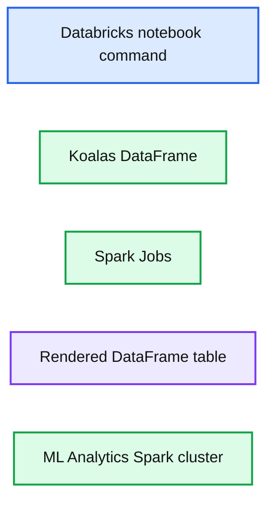
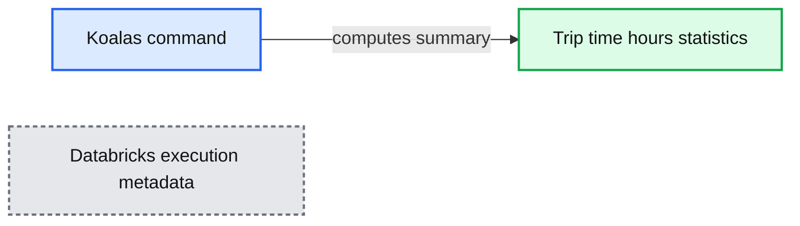
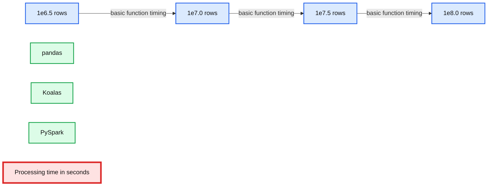
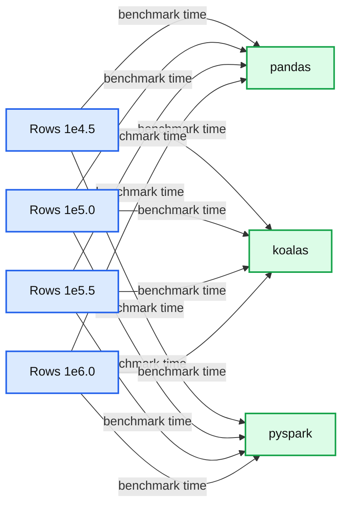

# Guest Blog: How Virgin Hyperloop One Reduced Processing Time from Hours to Minutes with Koalas

- Source: https://www.databricks.com/blog/2019/08/22/guest-blog-how-virgin-hyperloop-one-reduced-processing-time-from-hours-to-minutes-with-koalas.html
- Published: 2019-08-22
- Authors: Patryk Oleniuk, Sandhya Raghavan
- Categories: solutions, engineering, open-source, data-science-machine-learning, company, customers
- Images: 4 total, 4 extracted as architecture

>  Watch the on-demand webinar to learn more: [From pandas to Koalas: reducing Time-to-Insights for Virgin Hyperloop's Data](https://www.databricks.com/p/webinar/from-pandas-to-koalas-reducing-time-to-insight-for-virgin-hyperloops-data)

At Virgin Hyperloop One, we work on making Hyperloop a reality, so we can move passengers and cargo at airline speeds but at a fraction of the cost of air travel. In order to build a commercially viable system, we collect and analyze a large, diverse quantity of data, including [Devloop Test Track](https://virginhyperloop.com/blog/first-look-devloop) runs, numerous test rigs, and various simulation, infrastructure and socio economic data. Most of our scripts handling that data are written using Python libraries with pandas as the main data processing tool that glues everything together. In this blog post, we want to share with you our experiences of scaling our data analytics using Koalas, achieving massive speedups with minor code changes.

As we continue to grow and build [new stuff](https://timesofindia.indiatimes.com/india/indias-hyperloop-dream-takes-shape-in-nevada-desert/articleshow/70495877.cms), so do our data processing needs. Due to the increasing scale and complexity of our data operations, our pandas-based Python scripts were too slow to meet our business needs. This led us to Spark, with the hopes of fast processing times and flexible data storage as well as on-demand scalability. We were, however, struggling with the "Spark switch" - we would have to make a lot of custom changes to migrate our pandas-based codebase to PySpark. We needed a solution that was not only much faster, but also would ideally not require rewriting code. These challenges drove us to research other options and we were very happy to discover that there exists an easy way to skip that tedious step: the Koalas package, recently open-sourced by Databricks.

As described in the [Koalas Readme](https://github.com/databricks/koalas),

>  The Koalas project makes data scientists more productive when interacting with big data, by implementing the [pandas DataFrame](https://www.databricks.com/glossary/pandas-dataframe) API on top of Apache Spark. (...) Be immediately productive with Spark, with no learning curve, if you are already familiar with pandas. Have a single codebase that works both with pandas (tests, smaller datasets) and with Spark (distributed datasets).

In this article I will try to show that this is (mostly) true and why Koalas is worth trying out. By making changes to less than 1% of our pandas lines, we were able to run our code with Koalas and Spark. We were able to reduce the execution times by more than 10x, from a few hours to just a few minutes, and since the environment is able to scale horizontally, we’re prepared for even more data.

## Quick Start

Before installing Koalas, make sure that you have your Spark cluster set up and can use it with PySpark. Then, simply run:

`pip install koalas`

or, for conda users:

`conda install koalas -c conda-forge`

Refer to [Koalas Readme](https://github.com/databricks/koalas) for more details.

A quick sanity check after installation:

**Summary:** A Databricks notebook runs a Koalas DataFrame example on an ML Analytics Spark cluster and displays the resulting table.

**Components:**

- Databricks notebook command using Python
- Koalas technology via `databricks.koalas`
- Koalas DataFrame named `kdf`
- Spark Jobs execution
- ML Analytics Spark cluster
- Rendered DataFrame table

**Flows:**

- none

**Numbers:** Cmd 1; lines 1, 2, 3; 2 Spark Jobs; column values 4.0, 8.0, 1.0, 2.0; row indexes 0, 1; command duration 2.13 seconds; date 8/8/2019; time 12:40:05 PM

source image: https://www.databricks.com/wp-content/uploads/2019/08/koalas-image3.png

As you can see, Koalas can render pandas-like interactive tables. How convenient!

## Example with basic operations

For the sake of this article, we generated some test data consisting of 4 columns and parameterized number of rows.

- Disclaimer: this is a randomly generated test file used for performance evaluation, related to the topic of Hyperloop, but not representing our data. The full test script used for this article can be found here:  [https://gist.github.com/patryk-oleniuk/043f97ae9c405cbd13b6977e7e6d6fbc](https://gist.github.com/patryk-oleniuk/043f97ae9c405cbd13b6977e7e6d6fbc) .

We'd like to assess some key descriptive analytics across all pod-trips, for example: *What is the trip time per pod-trip?*

Operations needed:

1. Group by `['pod_id','trip id']`
2. For every trip, calculate the `trip_time` as last timestamp - first timestamp.
3. Calculate distribution of the pod-trip times (mean, stddev)

### The short & slow ( pandas ) way:

(snippet #1)

### The long & fast ( PySpark ) way:

(snippet #2)

### The short & fast ( Koalas ) way:

(snippet #3)

Note that for the snippets #1 and #3, the code is **exactly the same**, and so the "Spark switch" is seamless! For most of the pandas scripts, you can even try to change the `import pandas databricks.koalas as pd`, and some scripts will run fine with minor adjustments, with some limitations explained below.

### Results

All the snippets have been verified to return the same pod-trip-times results. The `describe` and `summary` methods for pandas and Spark are slightly different, as explained [here](https://www.kdnuggets.com/2016/01/python-data-science-pandas-spark-dataframe-differences.html) but this should not affect performance too much.

Sample results:

**Summary:** Databricks output showing descriptive statistics for the `trip_time_hours` dataset.

**Components:**

- Command cell using Koalas dataframe syntax
- Summary statistics table
- `summary` statistic labels
- `trip_time_hours` metric column
- Databricks execution metadata

**Flows:**

- none

**Numbers:** Cmd 7; row indices 0, 1, 2, 3, 4, 5, 6, 7; count 625; mean 0.5761789650162432; standard deviation 0.004673946270277798; minimum 0.5539411756993352; 25% 0.5739794243951338; 50% 0.5772501165562476; 75% 0.5795291941218781; maximum 0.5831203330956781; 0.02 seconds; 8/8/2019; 1:06:14 PM; ML Analytics Cluster

source image: https://www.databricks.com/wp-content/uploads/2019/08/koalas-image1.png

## Advanced Example: UDFs and complicated operations

We're now going to try to solve a more complex problem with the same dataframe, and see how pandas and Koalas implementations differ.

Goal: Analyze the average speed per pod-trip:

1. Group by `['pod_id','trip id']`
2. For every pod-trip calculate the total distance travelled by finding the area below the velocity (time) chart (method explained [here](https://www.quora.com/How-do-I-find-the-total-distance-covered-from-a-velocity-time-graph)):
3. Sort the grouped df by `timestamp` column.
4. Calculate diffs of timestamps.
5. Multiply the diffs with the speed - this will result in the distance traveled in that time diff.
6. Sum the `distance_travelled` column - this will give us total distance travelled per pod-trip.
7. Calculate the `trip time` as `timestamp.last` - `timestamp.first` (as in the previous paragraph).
8. Calculate the `average_speed` as `distance_travelled` / `trip time`.
9. Calculate distribution of the pod-trip times (mean, stddev).

We decided to implement this task using a custom apply function and UDF (user defined functions).

### The pandas way:

(snippet #4)

### The PySpark way:

(snippet #5)

### The Koalas way:

(snippet #6)

Koalas’ implementation of apply is based on PySpark's `pandas_udf` which requires schema information, and this is why the definition of the function has to also define the type hint. The authors of the package introduced new custom type hints, `ks.DataFrame` and `ks.Series`. Unfortunately, the current implementation of the `apply` method is quite cumbersome, and it took a bit of an effort to arrive at the same result (column names change, groupby keys not returned). However, all the behaviors are appropriately explained in the package [documentation](https://koalas.readthedocs.io/en/latest/reference/api/databricks.koalas.groupby.GroupBy.apply.html#databricks.koalas.groupby.GroupBy.apply).

## Performance

To assess the performance of Koalas, we profiled the code snippets for different number of rows.

The profiling experiment was done on Databricks platform, using the following cluster configurations:

- Spark driver node (also used to execute the pandas scripts): 8 CPU cores, 61GB RAM.
-

15 Spark worker nodes: 4CPU cores, 30.5GB RAM each (sum: 60CPUs / 457.5GB ).

Every experiment was repeated 10 times, and the clips shown below are indicating the min and max times for the executions.

### Basic ops

When the data is small, the initialization operations and data transfer are huge in comparison to the computations, so pandas is much faster (marker a). For larger amounts of data, pandas' processing times exceed distributed solutions (marker b). We can then observe some performance hits for Koalas, but it gets closer to PySpark as data increases (marker c).

**Summary:** Benchmark chart comparing pandas, Koalas, and PySpark processing times for basic functions across increasing row counts.

**Components:**

- pandas: Python dataframe technology
- Koalas: pandas-compatible distributed dataframe API
- PySpark: distributed Spark dataframe technology
- Row scales: 1e6.5, 1e7.0, 1e7.5, and 1e8.0 rows
- Processing time: measured in seconds

**Flows:**

- Row scale -> pandas: basic function execution time
- Row scale -> Koalas: basic function execution time
- Row scale -> PySpark: basic function execution time

**Numbers:** 0, 50, 100, 150, 200, 250; 1e6.5, 1e7.0, 1e7.5, 1e8.0; a, b, c; seconds; rows; lower is better

source image: https://www.databricks.com/wp-content/uploads/2019/08/koalas-image4.png

### UDFs

**Summary:** Benchmark chart comparing pandas, Koalas, and PySpark UDF processing times across increasing row counts, where lower time is better.

**Components:**

- pandas benchmark series
- koalas benchmark series
- pyspark benchmark series
- Row-count categories
- Time axis in seconds

**Flows:**

- none

**Numbers:** 1e4.5, 1e5.0, 1e5.5, 1e6.0, 50, 100, 150

source image: https://www.databricks.com/wp-content/uploads/2019/08/koalas-image2.png

For the UDF profiling, as specified in PySpark and Koalas documentation, the performance decreases dramatically. This is why we needed to decrease the number of rows we tested with by 100x vs the basic ops case. For each test case, Koalas and PySpark show a striking similarity in performance, indicating a consistent underlying implementation. During experimentation, we discovered that there exists a much faster way of executing that set of operations using PySpark windows functionality, however this is not currently implemented in Koalas so we decided to only compare UDF versions.

### Discussion

Koalas seems to be the right choice if you want to make your pandas code immediately scalable and executable on bigger datasets that are not possible to process on a single node. After the quick swap to Koalas, just by scaling your Spark cluster, you can allow bigger datasets and improve the processing times significantly. Your performance should be comparable (but 5 to 50% lower, depending on the dataset size and the cluster) with PySpark’s.

On the other hand, the Koalas API layer does cause a visible performance hit, especially in comparison to the native Spark. At the end of the day, if computational performance is your key priority, you should consider switching from Python to Scala.

## Limitations and differences

During your first few hours with Koalas, you might wonder, "Why is this not implemented?!" Currently, the package is still under development and is missing some pandas API functionality, but much of it should be implemented in the next few months (for example `groupby.diff()` or `kdf.rename()`).

Also from my experience as a contributor to the project, some of the features are either too complicated to implement with [Spark API](https://www.databricks.com/glossary/spark-api) or were skipped due to a significant performance hit. For example, `DataFrame.values` requires materializing the entire working set in a single node’s memory, and so is suboptimal and sometimes not even possible. Instead if you need to retrieve some final results on the driver, you can call `[DataFrame.to_pandas()](https://koalas.readthedocs.io/en/latest/reference/api/databricks.koalas.DataFrame.to_pandas.html)` or [`DataFrame.to_numpy()`](https://koalas.readthedocs.io/en/latest/reference/api/databricks.koalas.DataFrame.to_numpy.html).

Another important thing to mention is that Koalas’ execution chain is different from pandas’: when executing the operations on the dataframe, they are put on a queue of operations but **not** executed. Only when the results are needed, e.g. when calling `kdf.head()` or `kdf.to_pandas()` the operations will be executed. That could be misleading for somebody who never worked with Spark, since pandas does everything line-by-line.

## Conclusions

Koalas helped us to reduce the burden to “Spark-ify” our pandas code. If you're also struggling with scaling your pandas code, you should try it too! If you are desperately missing any behavior or found inconsistencies with pandas, please [open an issue](https://github.com/databricks/koalas/issues) so that as a community we can ensure that the package is actively and continually improved. Also, feel free to contribute!

## Resources

1. Koalas github: [https://github.com/databricks/koalas](https://github.com/databricks/koalas)
2. Koalas documentation: [https://koalas.readthedocs.io](https://koalas.readthedocs.io)
3. Code snippets from this article: [https://gist.github.com/patryk-oleniuk/043f97ae9c405cbd13b6977e7e6d6fbc](https://gist.github.com/patryk-oleniuk/043f97ae9c405cbd13b6977e7e6d6fbc) .
