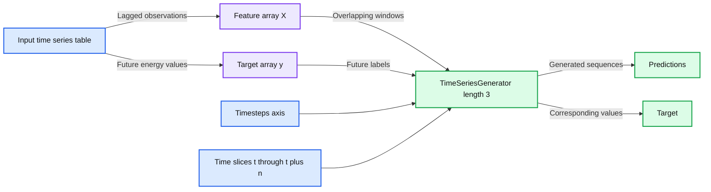

# Doing Multivariate Time Series Forecasting with Recurrent Neural Networks

*Using Keras' implementation of Long-Short Term Memory (LSTM) for Time Series Forecasting*

- Source: https://www.databricks.com/blog/2019/09/10/doing-multivariate-time-series-forecasting-with-recurrent-neural-networks.html
- Published: 2019-09-10
- Authors: Vedant Jain
- Categories: solutions, engineering
- Images: 5 total, 2 extracted as architecture

[Try this notebook in Databricks](https://pages.databricks.com/rs/094-YMS-629/images/Blog_ A Multivariate Time Series Forecasting Appliance Energy Usage.html)

Time Series forecasting is an important area in Machine Learning. It can be difficult to build accurate models because of the nature of the time-series data. With recent developments in Neural Networks aspect of Machine Learning, we can tackle a wide variety of problems which were either out-of-scope or difficult to do with classical time series predictive approaches. In this post, we will demonstrate how to use Keras' implementation of [Long-Short Term Memory (LSTM)](https://en.wikipedia.org/wiki/Long_short-term_memory) for Time Series Forecasting and MLFLow for tracking model runs.

### **What are LSTMs?**

LSTM is a type of Recurrent Neural Network (RNN) that allows the network to retain long-term dependencies at a given time from many timesteps before. RNNs were designed to that effect using a simple feedback approach for neurons where the output sequence of data serves as one of the inputs. However, long term dependencies can make the network untrainable due to the [vanishing gradient problem](https://en.wikipedia.org/wiki/Vanishing_gradient_problem). LSTM is designed precisely to solve that problem.

Sometimes accurate time series predictions depend on a combination of both bits of old and recent data. We have to efficiently learn even what to pay attention to, accepting that there may be a long history of data to learn from. LSTMs combine simple DNN architectures with clever mechanisms to learn what parts of history to 'remember' and what to 'forget' over long periods. The ability of LSTM to learn patterns in data over long sequences makes them suitable for time series forecasting.

For the theoretical foundation of LSTM’s architecture, see here (Chapter 4): [http://www.cs.toronto.edu/~graves/preprint.pdf](http://www.cs.toronto.edu/~graves/preprint.pdf)

### **Choose the Right Problem and Right Dataset**

There are innumerable applications of time series - from creating portfolios based on future fund prices to demand prediction for an electricity supply grid and so on. In order to showcase the value of LSTM, we first need to have the right problem and more importantly, the right dataset. Say we want to learn to predict humidity and temperature in a house ahead of time so a smart sensor can proactively turn on the A/C, or you just want to know the amount of electricity you will consume in the future so you can proactively cut costs. Historical sensor and temperature data ought to be enough to learn the relationship, and LSTMs can help, because it won't just depend on recent sensor values, but more importantly older values, perhaps sensor values from the same time on the previous day. For this purpose,  we will use experimental data about appliances energy use in a low energy building.

### **Experiment**

The [dataset](https://archive.ics.uci.edu/ml/machine-learning-databases/00374/) we chose for this experiment is perfect for building regression models of appliances energy use. The house temperature and humidity conditions were monitored with a ZigBee wireless sensor network. It is at 10 min intervals for about 4.5 months. The energy data was logged with m-bus energy meters. Weather from the nearest airport weather station (Chievres Airport, Belgium) was downloaded from a public data set from Reliable Prognosis (rp5.ru), and merged together with the experimental data sets using the date and time column. The dataset can be downloaded from the [UCI Machine Learning repository](https://archive.ics.uci.edu/ml/machine-learning-databases/00374/).

We’ll use this to train a model that predicts the energy consumed by household appliances for the next day.

### **Data Modeling**

Before we can train a neural network, we need to model the data in a way the network can learn from a sequence of past values. Specifically, LSTM expects the input data in a specific 3D tensor format of test sample size by time steps by the number of input features. As a supervised learning approach, LSTM requires both features and labels in order to learn. In the context of time series forecasting, it is important to provide the past values as features and future values as labels, so LSTM’s can learn how to predict the future. Thus, we explode the time series data into a 2D array of features called ‘X’, where the input data consists of overlapping lagged values at the desired number of timesteps in batches. We generate a 1D array called ‘y’ consisting of only the labels or future values which we are trying to predict for every batch of input features. The input data also should include lagged values of ‘y’ so the network can also learn from past values of the labels. See image below for further explanation:

**Summary:** The diagram shows how overlapping multivariate time-series windows are transformed into feature tensor X and target array y for recurrent neural-network forecasting.

**Components:**

- Time-series input table with time, pressure, temperature, humidity, wind, dewpoint, and energy-used columns
- Feature array X containing overlapping windows of six variables
- Target array y containing future energy-used values
- Keras TimeSeriesGenerator with length 3
- Timesteps axis
- Time slices t through t plus n
- Data windows, predictions, and target legend

**Flows:**

- Input table -> Feature array X: lagged multivariate observations
- Input table -> Target array y: future target values
- Feature array X -> TimeSeriesGenerator: overlapping windows
- Target array y -> TimeSeriesGenerator: future labels
- TimeSeriesGenerator -> Predictions: generated sequences
- TimeSeriesGenerator -> Target: corresponding future values

**Numbers:** 1:00 pm, 1:10 pm, 1:20 pm, 1:30 pm, 2:10 pm, 2:30 pm, 3, 4, 5, 6, 7, 8, 9, 10, 26 features, 64 timesteps, 10 minute samples, length = 3, t, t+1, t+2, t+3, t+4, t+5, t+7, t+8, t+9, t+10, t+n, t+1 through t+n, x1 through x6, y



<sub>source image: https://www.databricks.com/wp-content/uploads/2019/09/keras_tsgenerator-1.png</sub>

Our data set has 10 minute samples. In the image above, we have chosen length = 3 which implies we have 30 mins of data in every sequence (at 10-minute intervals). By that logic, features ‘X’ should be a tensor of values [X(t), X(t+1), X(t+2)], [X(t+2), X(t+3), X(t+4)], [X(t+3), X(t+4), X(t+5)].... And so on. And our target variable ‘y’ should be [y(t+3), y(t+4), y(t+5)…y(t+10)] because the number of timesteps or length is equal to 3, so we will ignore values y(t), y(t+1), y(t+2) Also, in the graph it’s apparent that for every input row, we’re only predicting one value out it in the future i.e. y(t+n+1), however, for more realistic scenarios you can choose to predict further out in the future i.e. y(t+n+L),  as you will see in our example below.

The Keras API has a built-in class called TimeSeriesGenerator that generates batches of overlapping temporal data. This class takes in a sequence of data-points gathered at equal intervals, along with time series parameters such as stride, length of history, etc. to produce batches for training/validation.

So, let's say for our use case, we want to learn to predict from 6 day's worth of past data and predict values some time out in the future, let’s say 1 day. In that case length is equal to 864, which is the number of 10-minute timesteps in 6 days (24x6x6). Similarly, we also want to learn from past values of humidity, temperature, pressure etc. which means that for every label we will have 864 values per feature. Our dataset has a total of 28 features. When generating the temporal sequences, the generator is configured to return batches consisting of 6 days worth of data every time. To make it a more realistic scenario, we choose to predict the usage 1 day out in the future (as opposed to the next 10-min time interval), we prepare the test and train dataset in a manner that the target vector is a set of values 144 timesteps (24x6x1) out in the future. For details, see the notebook, section 2: Normalize and prepare the dataset.

The shape of the input set should be (samples, timesteps, input_dim) [[https://keras.io/api/layers/recurrent_layers/](https://keras.io/api/layers/recurrent_layers/)]. For every batch, we will have all 6 days worth of data, which is 864 rows. The batch size determines the number of samples before a gradient update takes place.

For a full list of tuning parameters, see here:[https://keras.io/api/preprocessing/timeseries/](https://keras.io/api/preprocessing/timeseries/)

### **Model Training**

LSTM’s are able to tackle the long-term dependency problems in neural networks, using a concept known as[Backpropogation-through-time](https://en.wikipedia.org/wiki/Backpropagation_through_time) (BPTT).

Before we train a LSTM network, we need to understand a few key parameters provided in Keras that will determine the quality of the network.

1. Epochs: Number of times the data will be passed to the neural network.
2. Steps per epoch: the number of batch iterations before a training epoch is considered finished.
3. Activations: layer describing which[activation function](https://keras.io/api/layers/activations/) to use.
4. Optimizer: Keras provides built-in[optimizers](https://www.tensorflow.org/api_docs/python/tf/keras/optimizers).

In order to take advantage of the speed and performance of GPUs, we use the [CUDNN implementation of LSTM](https://developer.nvidia.com/cudnn). We have also chosen an arbitrarily high number of epochs. This is because we want to make sure that the data undergoes as many iterations as possible to find the best model fit. As for the number of units, we have 28 features, so we start with 32. After a few iterations, we found that using 128 gave us decent results. For choosing the number of epochs, it’s a good approach to choose a high number to avoid underfitting. In order to circumvent the problem of overfitting, you can use built in[callbacks](https://keras.io/api/callbacks/) in Keras API; specifically EarlyStopping. EarlyStopping stops the model training when the monitored quantity has stopped improving. In our case, we use loss as the monitored quantity and the model will stop training when there’s no decrease of 1e-5 for 50 epochs. Keras has built-in regularizers (weighted, dropout) that penalize the network to ensure a smoother distribution of parameters, so the network does not rely too much on the context passed between the units. See image below for layers in the network.

**Summary:** A sequential neural network passes input data through CuDNNLSTM, LeakyReLU, Dropout, and Dense layers.

**Components:**

- Input tensor with identifier 139845845427368
- cu_dnnlstm_1: CuDNNLSTM
- leaky_re_lu_1: LeakyReLU
- dropout_1: Dropout
- dense_1: Dense

**Flows:**

- Input tensor -> cu_dnnlstm_1: input data
- cu_dnnlstm_1 -> leaky_re_lu_1: layer output
- leaky_re_lu_1 -> dropout_1: activated output
- dropout_1 -> dense_1: regularized output

**Numbers:** 139845845427368; 864; 28; 128; 1; None

```mermaid
%% Shows sequential flow through recurrent neural network layers
flowchart TD
    A[Input tensor 139845845427368] -->|input data| B[cu dnnlstm 1 CuDNNLSTM]
    B -->|layer output| C[leaky re lu 1 LeakyReLU]
    C -->|activated output| D[dropout 1 Dropout]
    D -->|regularized output| E[dense 1 Dense]

    classDef client fill:#dbeafe,stroke:#2563eb,stroke-width:2px,color:#111
    classDef service fill:#dcfce7,stroke:#16a34a,stroke-width:2px,color:#111
    classDef store fill:#ede9fe,stroke:#7c3aed,stroke-width:2px,color:#111
    classDef cache fill:#fef3c7,stroke:#d97706,stroke-width:2px,color:#111
    classDef queue fill:#cffafe,stroke:#0891b2,stroke-width:2px,color:#111
    classDef critical fill:#fee2e2,stroke:#dc2626,stroke-width:4px,color:#111
    classDef external fill:#e5e7eb,stroke:#6b7280,stroke-width:2px,color:#111,stroke-dasharray:4 3
    classDef decision fill:#fce7f3,stroke:#db2777,stroke-width:2px,color:#111
    A,B,C,D,E service
``

<sub>source image: https://www.databricks.com/wp-content/uploads/2019/09/Screen-Shot-2019-08-24-at-7.38.17-PM.png</sub>

In order to send the output of one layer to the other, we need an activation function. In this case, we use [LeakyRelu](https://keras.io/api/layers/activation_layers/) which is a better variant of its predecessor, the Rectifier Linear Unit or Relu for short.

Keras provides with many different optimizers for reducing loss and update weights iteratively over epochs. For a full list of optimizers, see here: [https://keras.io/api/optimizers/](https://keras.io/api/optimizers/). We choose the [Adam version of stochastic gradient descent](https://arxiv.org/abs/1412.6980).

An important parameter of the optimizer is [learning_rate](https://en.wikipedia.org/wiki/Learning_rate) which can determine the quality of the model in a big way. You can read more about the learning rate here. We experimented with various values such as 0.001(default), 0.01, 0.1 etc. and found that 0.00144 gave us the best model performance in terms of speed of training and minimal loss. You can also use the [LearningRateSchedular](https://www.tensorflow.org/api_docs/python/tf/keras/callbacks/LearningRateScheduler) callback in order to tweak the learning rate to the optimal value. We used MlFlow to track and compare results across multiple model runs.

### **Model Evaluation and Logging using MLFlow**

As you can see Keras implementation of LSTMs takes in quite a few hyperparameters. In order to find the best model fit, you will need to experiment with various hyperparameters, namely units, epochs etc. You will also want to compare past model runs and measure model behavior over time and changes in data. MLflow is a great tool with an easy-to-use UI which allows you to do the above and more. Here you can see how easy it is to use MLFlow to develop with Keras and TensorFlow, log an MLflow run and track experiments over time.

Data scientists can use MLflow to keep track of the various model metrics and any additional visualizations and artifacts to help make the decision of which model should be deployed in production. They can compare two or more model runs to understand the impact of various hyperparameters, till they conclude on the most optimal model.

https://www.youtube.com/watch?v=-BwjHwEiSvw

 

The data engineers will then be able to easily retrieve the chosen model along with the library versions used for training to be deployed on new data in production. The final model can be persisted with the [python_function](https://www.mlflow.org/docs/latest/models.html#python-function-python-function) flavor. It can then be used as an Apache Spark UDF, which once uploaded to a Spark cluster, will be used to score future data. You can find the full list of model flavors supported by MLFlow [here](https://www.mlflow.org/docs/latest/models.html#built-in-model-flavors).

 

### **Summary**

- LSTM can be used to learn from past values in order to predict future occurrences. LSTMs for time series don’t make certain assumptions that are made in classical approaches, so it makes it easier to model time series problems and learn non-linear dependencies among multiple inputs.
- When creating sequence of events before feeding into LSTM network, it is important to lag the labels from inputs, so LSTM network can learn from past data. TimeSeriesGenerator class in Keras allows users to prepare and transform the time series dataset with various parameters before feeding the time lagged dataset to the neural network.
- LSTM has a series of tunable hyperparameters such as epochs, batch size etc. which are imperative to determining the quality of the predictions. Learning rate is an important hyperparameter that controls how the model weights get updated and the speed at which the model learns. It is very important to determine an optimal value for the learning rate in order to get the best model performance. Consider using the LearingRateSchedular callback parameter in order to tweak the learning rate to the optimal value.
- Keras provides a choice of different optimizers to use w.r.t the type of problem you’re solving. Generally, Adam tends to do well. Using MlFlow UI, the user can compare model runs side by side to choose the best model.
- For time series, it’s important to maintain temporality in the data so the LSTM network can learn patterns from the correct sequence of events. Therefore, it is important not to shuffle the data when creating test and validation sets and also when fitting the model.
- Like all machine learning approaches, LSTM is not immune to bad fitting, which is why Keras has EarlyStopping callback. With some degree of intuition and the right callback parameters, you can get decent model performance without putting too much effort in tuning hyperparameters.
- RNN’s, specifically LSTM’s work best when given large amounts of data. So, when little data is available, it is preferable to start with a smaller network with a few hidden layers. Smaller data also allows users to provide a larger batch of data to every epoch which can yield better results.

[Try this notebook in Databricks](https://pages.databricks.com/rs/094-YMS-629/images/Blog_ A Multivariate Time Series Forecasting Appliance Energy Usage.html)
