# Using AutoML Toolkit to Automate Loan Default Predictions

- Source: https://www.databricks.com/blog/2019/09/10/using-automl-toolkit-to-automate-loan-default-predictions.html
- Published: 2019-09-10
- Authors: Benjamin Wilson, Amy Wang, Denny Lee
- Categories: engineering, data-science-machine-learning, company, news
- Images: 15 total, 14 extracted as architecture

>  Download the following notebooks and try the [AutoML Toolkit](https://github.com/databrickslabs/automl-toolkit) today: [Evaluating Risk for Loan Approvals using XGBoost (0.90)](https://pages.databricks.com/rs/094-YMS-629/images/loan-risk-analysis-xgb.html) | [Using AutoML Toolkit to Simplify Loan Risk Analysis XGBoost Model Optimization](https://pages.databricks.com/rs/094-YMS-629/images/automl-simplify-loan-risk-analysis-xgb-optimize.html)

*This blog was originally published on September 10th, 2019; it has been updated on October 2nd, 2019.*

In a previous blog and notebook, [Loan Risk Analysis with XGBoost](https://www.databricks.com/blog/2018/08/09/loan-risk-analysis-with-xgboost-and-databricks-runtime-for-machine-learning.html), we explored the different stages of how to build a Machine Learning model to improve the prediction of bad loans.  We reviewed three different linear regression models - GLM, GBT, and XGBoost - performing the time-consuming process of manually optimizing the models at each stage.

**Summary:** Databricks AutoML Toolkit automates the machine learning workflow from feature definition through model training, tuning, execution, and metrics review.

**Components:**

- Databricks Unified Analytics Platform
- Databricks Notebooks
- AutoML Toolkit
- MLflow
- Define Potential Features
- Vectorize Features
- Choose Features
- Build and Train ML Pipeline
- Tune Model
- Execute Model and Review Metrics
- Review Metrics
- Databricks Benefits: Advanced Analytics, Data Democratization, Integrated Workspace, Elastic Scalability, Support

**Flows:**

- Define Potential Features -> Vectorize Features: feature preparation
- Vectorize Features -> Choose Features: candidate features
- Choose Features -> Build and Train ML Pipeline: selected features
- Build and Train ML Pipeline -> Tune Model: trained pipeline
- Tune Model -> Review Metrics: tuned model results
- Review Metrics -> Execute Model and Review Metrics: metrics feedback
- Execute Model and Review Metrics -> Build and Train ML Pipeline: iterative model development
- Databricks Notebooks -> AutoML Toolkit: execute workflow and review metrics
- AutoML Toolkit -> MLflow: experiment and model tracking

**Numbers:** none

```mermaid
%% Shows the Databricks AutoML model development workflow
flowchart LR
    F[Define Potential Features] -->|feature preparation| V[Vectorize Features]
    V -->|candidate features| C[Choose Features]
    C -->|selected features| B[Build and Train ML Pipeline]
    B -->|trained pipeline| T[Tune Model]
    T -->|tuned results| R[Review Metrics]
    R -->|metrics feedback| E[Execute Model and Review Metrics]
    E -->|iterative development| B
    N[Databricks Notebooks] -->|execute workflow| A[AutoML Toolkit]
    A -->|model tracking| M[MLflow]
    E -->|notebook execution| A

    classDef client fill:#dbeafe,stroke:#2563eb,stroke-width:2px,color:#111
    classDef service fill:#dcfce7,stroke:#16a34a,stroke-width:2px,color:#111
    classDef store fill:#ede9fe,stroke:#7c3aed,stroke-width:2px,color:#111
    classDef cache fill:#fef3c7,stroke:#d97706,stroke-width:2px,color:#111
    classDef queue fill:#cffafe,stroke:#0891b2,stroke-width:2px,color:#111
    classDef critical fill:#fee2e2,stroke:#dc2626,stroke-width:4px,color:#111
    classDef external fill:#e5e7eb,stroke:#6b7280,stroke-width:2px,color:#111,stroke-dasharray:4 3
    classDef decision fill:#fce7f3,stroke:#db2777,stroke-width:2px,color:#111

    class N client
    class F,V,C,B,T,R,E,A service
    class M store
```

<sub>source image: https://www.databricks.com/wp-content/uploads/2019/09/AutoML-Toolkit-Databricks.png</sub>

In this blog post, we will show how you can significantly streamline the process to build, evaluate, and optimize Machine Learning models by using the [Databricks Labs AutoML Toolkit](https://github.com/databrickslabs/automl-toolkit).   Using the AutoML Toolkit will also allow you to deliver results significantly faster because it allows you to automate the various Machine Learning pipeline stages.  As you will observe, we will run the same Loan Risk Analysis dataset using XGBoost 0.90 and see a significant improvement in results with an AUC of 0.6732 to 0.72 using the AutoML Toolkit. In terms of business value (amount of money saved by preventing bad loans), the AutoML Toolkit generated model potentially would have saved $68.88M (vs. $23.22M with the original technique).

## What is the problem?

For our current experiment, we will continue to use the public [Lending Club Loan Data](https://www.kaggle.com/wordsforthewise/lending-club).  It includes all funded loans from 2012 to 2017. Each loan includes applicant information provided by the applicant as well as the current loan status (Current, Late, Fully Paid, etc.) and latest payment information.

We utilize the applicant information to determine if we can predict if the loan is bad.  For more information, refer to [Loan Risk Analysis with XGBoost and Databricks Runtime for Machine Learning](https://www.databricks.com/blog/2018/08/09/loan-risk-analysis-with-xgboost-and-databricks-runtime-for-machine-learning.html).

## Let’s start with the end

The [AutoML Toolkit](https://github.com/databrickslabs/automl-toolkit) provides an easy way to automate the various tasks in a Machine Learning Pipeline.  In our example, we will use two components: Feature Importances and Automation Runner that will automate the tasks from vectorizing features to iterating and tuning a Machine Learning model.

**Summary:** The diagram shows an ML pipeline automated by AutoML Toolkit components for feature selection, model training, tuning, and metric review.

**Components:**

- Potential features
- Feature vectorization
- Feature selection
- ML pipeline building and training
- Model tuning
- Model execution and metric review
- Metric review
- AutoML Feature Importances
- AutoML AutomationRunner
- MLflow

**Flows:**

- Potential features -> Feature vectorization: candidate features
- Feature vectorization -> Feature selection: vectorized features
- Feature selection -> ML pipeline building and training: selected features
- ML pipeline building and training -> Model tuning: trained pipeline
- Model tuning -> Model execution and metric review: tuned model
- Model execution and metric review -> Metric review: model metrics
- AutoML Feature Importances -> Feature selection: feature importance guidance
- AutoML AutomationRunner -> ML pipeline building and training: automated pipeline execution
- AutoML AutomationRunner -> Model tuning: automated tuning
- Model execution and metric review -> MLflow: experiment metrics
- Model tuning -> MLflow: tuning metrics
- Metric review -> MLflow: reviewed metrics
- Model execution and metric review -> AutoML AutomationRunner: metrics for iteration
- AutoML AutomationRunner -> ML pipeline building and training: iterative feedback

**Numbers:** none

```mermaid
%% ML pipeline with AutoML Toolkit and MLflow
flowchart LR
    A[Potential features] -->|candidate features| B[Feature vectorization]
    B -->|vectorized features| C[Feature selection]
    C -->|selected features| D[Build and train ML pipeline]
    D -->|trained pipeline| E[Model tuning]
    E -->|tuned model| F[Execute model and review metrics]
    F -->|model metrics| G[Review metrics]
    F -->|experiment metrics| J[MLflow]
    E -->|tuning metrics| J
    G -->|reviewed metrics| J
    H[AutoML Feature Importances] -->|feature importance guidance| C
    I[AutoML AutomationRunner] -->|automated execution| D
    I -->|automated tuning| E
    F -->|metrics for iteration| I
    I -->|iterative feedback| D

    classDef client fill:#dbeafe,stroke:#2563eb,stroke-width:2px,color:#111
    classDef service fill:#dcfce7,stroke:#16a34a,stroke-width:2px,color:#111
    classDef store fill:#ede9fe,stroke:#7c3aed,stroke-width:2px,color:#111
    classDef cache fill:#fef3c7,stroke:#d97706,stroke-width:2px,color:#111
    classDef queue fill:#cffafe,stroke:#0891b2,stroke-width:2px,color:#111
    classDef critical fill:#fee2e2,stroke:#dc2626,stroke-width:4px,color:#111
    classDef external fill:#e5e7eb,stroke:#6b7280,stroke-width:2px,color:#111,stroke-dasharray:4 3
    classDef decision fill:#fce7f3,stroke:#db2777,stroke-width:2px,color:#111

    class A client
    class B,C,D,E,F,G,H,I service
    class J store
```

<sub>source image: https://www.databricks.com/wp-content/uploads/2019/09/ML-Pipeline-with-AutoML-Toolkit.png</sub>

In brief:

- AutoML’s `[FeatureImportances](https://github.com/databrickslabs/automl-toolkit/blob/bf2e876a99972b9d18bb3f068ebdc44a350a4d80/src/main/scala/com/databricks/labs/automl/exploration/FeatureImportances.scala)` automates the discovery of which features (columns from the dataset) are important and should be included when creating a model.
- AutoML’s `[AutomationRunner](https://github.com/databrickslabs/automl-toolkit/blob/5fc644f19d55cbd5ea473b3de4ffb321503da8ee/src/main/scala/com/databricks/labs/automl/AutomationRunner.scala)` automates the building, training, execution, and tuning of a Machine Learning pipeline to create an optimal ML model.

When we had manually created a new ML model per [Loan Risk Analysis with XGBoost and Databricks Runtime for Machine Learning](https://www.databricks.com/blog/2018/08/09/loan-risk-analysis-with-xgboost-and-databricks-runtime-for-machine-learning.html) using XGBoost 0.90, we were able to improve the AUC from 0.6732 to 0.72!

## What Did I Miss?

In a traditional ML pipeline, there are many hand-written components to perform the tasks of featurization and model building and tuning.  The diagram below provides a graphical representation of these stages.

**Summary:** The diagram shows the stages of an ML pipeline from feature definition through model tuning and metric review.

**Components:**

- Define Potential Features
- Vectorize Features
- Choose Features
- Build and Train ML Pipeline
- Execute Model and Review Metrics
- Tune Model using CrossValidator
- Review Metrics

**Flows:**

- Define Potential Features -> Vectorize Features: feature definitions
- Vectorize Features -> Choose Features: vectorized features
- Choose Features -> Build and Train ML Pipeline: selected features
- Build and Train ML Pipeline -> Execute Model and Review Metrics: trained pipeline
- Execute Model and Review Metrics -> Tune Model using CrossValidator: evaluation metrics
- Tune Model using CrossValidator -> Review Metrics: tuned model metrics
- Review Metrics -> Build and Train ML Pipeline: iterative feedback

**Numbers:** none

```mermaid
%% ML pipeline stages and iterative model improvement
flowchart LR
    A[Define Potential Features] -->|feature definitions| B[Vectorize Features]
    B -->|vectorized features| C[Choose Features]
    C -->|selected features| D[Build and Train ML Pipeline]
    D -->|trained pipeline| E[Execute Model and Review Metrics]
    E -->|evaluation metrics| F[Tune Model using CrossValidator]
    F -->|tuned model metrics| G[Review Metrics]
    G -->|iterative feedback| D

    classDef client   fill:#dbeafe,stroke:#2563eb,stroke-width:2px,color:#111
    classDef service  fill:#dcfce7,stroke:#16a34a,stroke-width:2px,color:#111
    classDef store    fill:#ede9fe,stroke:#7c3aed,stroke-width:2px,color:#111
    classDef cache    fill:#fef3c7,stroke:#d97706,stroke-width:2px,color:#111
    classDef queue    fill:#cffafe,stroke:#0891b2,stroke-width:2px,color:#111
    classDef critical fill:#fee2e2,stroke:#dc2626,stroke-width:4px,color:#111
    classDef external fill:#e5e7eb,stroke:#6b7280,stroke-width:2px,color:#111,stroke-dasharray:4 3
    classDef decision fill:#fce7f3,stroke:#db2777,stroke-width:2px,color:#111

    class A,B,C,D,E,F,G service
```

<sub>source image: https://www.databricks.com/wp-content/uploads/2019/09/ML-Pipeline-Stages.png</sub>

These stages consist of:

- *Feature Engineering*: We will first define potential features, vectorize them (different steps are required for numeric and categorical data), and then choose the features we will use.
- *Model Building and Tuning*: These are the highly repetitive stages of building and training our model, executing the model and reviewing the metrics, tuning the model, making changes to the model and repeating this process until finally building our model.

In the next few sections, we will

- Describe with code and visualizations these steps extracted from the [Evaluating Risk for Loan Approvals using XGBoost (0.90)](https://pages.databricks.com/rs/094-YMS-629/images/loan-risk-analysis-xgb.html) notebook
- Show how much simpler this is using the *AutoML Toolkit* as noted in the [Using AutoML Toolkit to Simplify Loan Risk Analysis XGBoost Model Optimization](https://pages.databricks.com/rs/094-YMS-629/images/automl-simplify-loan-risk-analysis-xgb-optimize.html) notebook.

## Our Feature Presentation

After obtaining reliable and clean data, one of the first steps for a data scientist is to identify which columns (i.e. *features*) will be used for their model.

### Identify Important Features: Traditional ML Pipelines

There are typically a number of steps when choosing which features you will want to use for your model.  In our example, we are creating a binary classifier (*is this a bad loan or not?*) where we will need to define the potential features, vectorize numeric and categorical features, and finally choose the features that will be used in the creation of your model.

Expand to view traditional identifying important features details

**Summary:** A sample table of loan risk analysis data containing categorical and numeric features.

**Components:**

- term: loan duration in months, technology not specified
- home_ownership: housing status, technology not specified
- purpose: loan purpose, technology not specified
- addr_state: borrower state, technology not specified
- verification_status: income verification status, technology not specified
- application_type: application category, technology not specified
- loan_amnt: loan amount, technology not specified
- emp_length: employment length, technology not specified
- annual_inc: annual income, technology not specified
- dti: debt-to-income ratio, technology not specified
- delinq_2yrs: delinquencies in 2 years, technology not specified
- revol_util: revolving credit utilization, technology not specified
- total_acc: total accounts, technology not specified
- credit_length_in_years: credit history length, technology not specified
- int_rate: interest rate, technology not specified
- net: net amount, technology not specified
- issue_y: issue year, technology not specified

**Flows:**

- none

**Numbers:** 36, 60, 25,000, 2, 90,000, 10.95, 0, 55, 14, 12, 14.33, 3,002.92, 2015, 2,000, 10, 30,000, 15.44, 68.4, 19, 9, 10.99, -1,609.62, 3,000, 75,000, 15.87, 19.6, 29, 21, 6.24, 219.81, 4, 56,000, 21.45, 1, 53.2, 31, 20, 12.59, 263.71, 35,000, 5, 130,000, 12.63, 84.9, 20, 13.18, 2,717.84. Units visible: months, years.

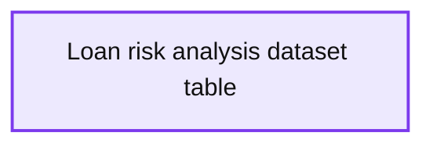

<sub>source image: https://www.databricks.com/wp-content/uploads/2019/09/Display-source-data.png</sub>

As you can see from the above table, the loan risk analysis dataset contains both numeric and categorical columns. This is an important distinction as there will be a different set of steps for numeric and categorical columns to ultimately assemble a vector that will be used as the input to your ML model.

To better understand if there is a correlation between independent variables, we can quickly examine `sourceData` using the `display` command to view this data as a scatterplot.

**Summary:** Scatterplot matrix showing pairwise relationships among loan dataset variables.

**Components:**

- label
- issue_year
- net
- total_acc
- revol_util
- delinquency_2yrs
- int_rate
- credit_length_in_years

**Flows:**

- None

**Numbers:** 0.00, 1.00, 5.00, 10.0k, 15.0, 20.0, 20.0k, 40.0, 50.0, 100

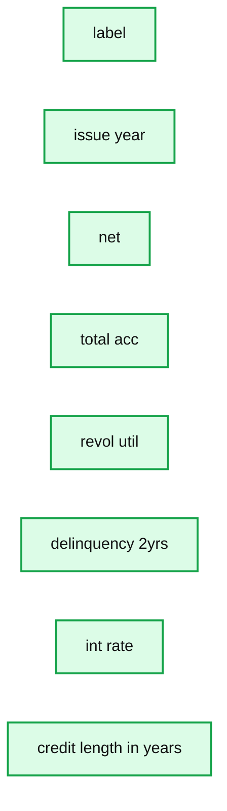

<sub>source image: https://www.databricks.com/wp-content/uploads/2019/09/scatter-plot.png</sub>

You can further analyze this data by calculating the correlation coefficients; a popular method is to use pandas `.corr()`. While our Databricks notebook is written in Scala, we can quickly and easily use Python pandas code as noted below.

**Summary:** Correlation coefficients for `loan_amt` across variables identified by `<id>` 0 through 11.

**Components:**

- `<id> 0` with correlation approximately 1.00
- `<id> 1` with correlation approximately 0.08
- `<id> 2` with correlation approximately 0.34
- `<id> 3` with correlation approximately 0.02
- `<id> 4` with correlation approximately 0.00
- `<id> 5` with correlation approximately 0.10
- `<id> 6` with correlation approximately 0.21
- `<id> 7` with correlation approximately 0.16
- `<id> 8` with correlation approximately 0.15
- `<id> 9` with correlation approximately -0.02
- `<id> 10` with correlation approximately 0.04
- `<id> 11` with correlation approximately 0.06

**Flows:**

- none

**Numbers:** 0, 1, 2, 3, 4, 5, 6, 7, 8, 9, 10, 11, 0.00, 0.20, 0.40, 0.60, 0.80, 1.00

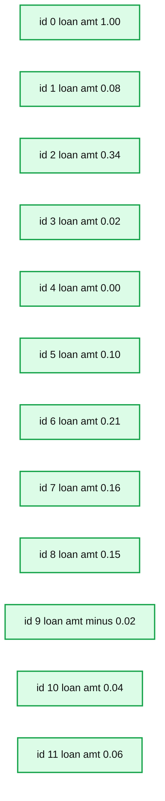

<sub>source image: https://www.databricks.com/wp-content/uploads/2019/09/correlation-coefficients.png</sub>

 

 

As noted in the preceding scatterplots (expand above for those details), there are no obvious highly correlated numeric variables. Based on this assessment, we will keep all of the columns when creating the model.

### Identifying Important Features: AutoML Toolkit

It is important to note that this process of identifying important features can be a highly iterative and time-consuming process.  There are so many different techniques that can be applied, that this process is a book in itself (e.g. [Feature Engineering for Machine Learning: Principles and Techniques for Data Scientists](https://www.oreilly.com/library/view/~/9781491953235/)).

**Summary:** AutoML iteratively selects and vectorizes features, builds and tunes an ML pipeline, reviews metrics, and records results in MLflow.

**Components:**

- Define Potential Features - AutoML Toolkit
- Vectorize Features - ML pipeline
- Choose Features - AutoML feature selection
- Build and Train ML Pipeline - Spark ML pipeline
- Execute Model and Review Metrics - model execution
- Tune Model - CrossValidator
- Review Metrics - evaluation
- AutoML Feature Importances - feature importance analysis
- MLflow - experiment tracking

**Flows:**

- Define Potential Features -> Vectorize Features: candidate features
- Vectorize Features -> Choose Features: vectorized features
- Choose Features -> Build and Train ML Pipeline: selected features
- Build and Train ML Pipeline -> Execute Model and Review Metrics: trained model
- Execute Model and Review Metrics -> Tune Model: model metrics
- Tune Model -> Review Metrics: tuned model results
- Review Metrics -> MLflow: tracked metrics
- Execute Model and Review Metrics -> Define Potential Features: iterative feature refinement
- Review Metrics -> Define Potential Features: iterative review feedback
- AutoML Feature Importances -> Choose Features: feature importance guidance

**Numbers:** none

```mermaid
%% Shows an iterative AutoML pipeline for loan default prediction
flowchart LR
    A[Define Potential Features] -->|candidate features| B[Vectorize Features]
    B -->|vectorized features| C[Choose Features]
    C -->|selected features| D[Build and Train ML Pipeline]
    D -->|trained model| E[Execute Model and Review Metrics]
    E -->|model metrics| F[Tune Model]
    F -->|tuned model results| G[Review Metrics]
    G -->|tracked metrics| H[MLflow]
    E -->|iterative feature refinement| A
    G -->|iterative review feedback| A
    I[AutoML Feature Importances] -->|feature importance guidance| C

    classDef client fill:#dbeafe,stroke:#2563eb,stroke-width:2px,color:#111
    classDef service fill:#dcfce7,stroke:#16a34a,stroke-width:2px,color:#111
    classDef store fill:#ede9fe,stroke:#7c3aed,stroke-width:2px,color:#111
    classDef cache fill:#fef3c7,stroke:#d97706,stroke-width:2px,color:#111
    classDef queue fill:#cffafe,stroke:#0891b2,stroke-width:2px,color:#111
    classDef critical fill:#fee2e2,stroke:#dc2626,stroke-width:4px,color:#111
    classDef external fill:#e5e7eb,stroke:#6b7280,stroke-width:2px,color:#111,stroke-dasharray:4 3
    classDef decision fill:#fce7f3,stroke:#db2777,stroke-width:2px,color:#111

    class A,B,C,D,E,F,G,I service
    class H store
```

<sub>source image: https://www.databricks.com/wp-content/uploads/2019/09/ML-Pipeline-AutoML-Feature-Importances.png</sub>

The AutoML Toolkit includes the class [FeatureImportances](https://github.com/databrickslabs/automl-toolkit/blob/bf2e876a99972b9d18bb3f068ebdc44a350a4d80/src/main/scala/com/databricks/labs/automl/exploration/FeatureImportances.scala) that automatically identifies the most important features; this is *all done* by the following code snippet.

**Summary:** The table ranks five loan-prediction features by their importance.

**Components:**

- Feature column - technology not specified
- Importance column - technology not specified
- int_rate - importance 26
- dti - importance 21
- issue_year - importance 21
- home_ownership - importance 18
- annual_inc - importance 14

**Flows:**

- none

**Numbers:** 26, 21, 21, 18, 14

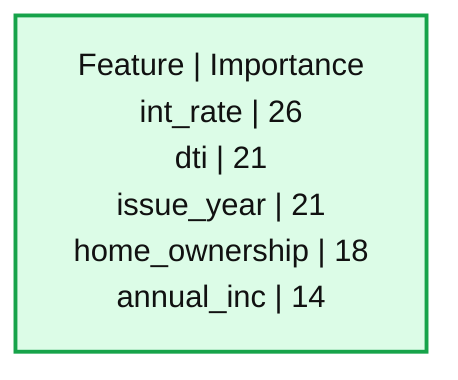

<sub>source image: https://www.databricks.com/wp-content/uploads/2019/09/display-import-features-v2.png</sub>

In this specific example, thirty (30) different Spark jobs were automatically generated and executed to find the most important features that need to be included. Note, the number of Spark jobs kicked off will vary depending on several factors. Instead of the days or weeks to manually explore the data, with four lines of code, we identified these features in minutes.

## Let’s Build it!

Now that we have identified our most important features, let’s build, train, validate, and tune our ML pipeline for our loan risk dataset.

### Traditional Model Building and Tuning

The following steps are an abridged version of [Evaluating Risk for Loan Approvals using XGBoost (0.90)](https://pages.databricks.com/rs/094-YMS-629/images/loan-risk-analysis-xgb.html) notebook code.

Expand to view traditional model building and tuning details

First, we will define our categorical and numeric columns.

Then we will build our ML pipeline as noted by the code snippet below. As noted by the comments in the code, our pipeline has the following steps:

- *VectorAssembler*: Assemble a features vector based on our feature columns that have been processed by the following
  - *Inputer* estimator for completing missing values for our numeric data
  - *StringIndexer* to encode a string value to a numeric value
  - *OneHotEncoding* to map a categorical feature (represented by the StringIndexer numeric value) to a binary vector
- *LabelIndexer*: Specify what our label is (i.e. the true value) vs. our predicted label (i.e. the predicted value of a bad or good loan)
- *StandardScaler*: Normalizes our features vector to minimize the impact of feature values of different scale.

Note, this example is one of our simpler binary classification examples; there are many more methods that can be used to [extract, transform, and select features](https://spark.apache.org/docs/latest/ml-features.html).

With our pipeline and our decision to use the XGBoost model (as noted in [Loan Risk Analysis with XGBoost and Databricks Runtime for Machine Learning](https://www.databricks.com/blog/2018/08/09/loan-risk-analysis-with-xgboost-and-databricks-runtime-for-machine-learning.html)), let’s build, train, and validate our model.

By using the BinaryClassificationEvaluator included in Spark MLlib, we can evaluate the performance of the model.

With an AUC value of 0.6507, let’s see if we can tune this model further by setting a `paramGrid` and using a `CrossValidator()`. It is important to note that you will need to understand the model options (e.g. XGBoost Classifier `maxDepth`) to properly choose the parameters to try.

 

After many iterations of choosing different parameters and testing a laundry list of different values for those parameters (expand above for more details), using traditional model building and tuning we were able to improve the model so it has an AUC = 0.6732 (up from 0.6507).

### AutoML Model Building and Tuning

With all of the traditional model building and tuning steps taking days (or weeks), we were able to manually build a model with a better than random AUC value.   But with AutoML Toolkit, the `[AutomationRunner](https://github.com/databrickslabs/automl-toolkit/blob/5fc644f19d55cbd5ea473b3de4ffb321503da8ee/src/main/scala/com/databricks/labs/automl/AutomationRunner.scala)` allows us to perform all of the above steps with a few lines of code.

**Summary:** The diagram shows an AutoML pipeline that automates feature preparation, model training, execution, metric review, tuning, and experiment tracking.

**Components:**

- Define Potential Features
- Vectorize Features
- Choose Features
- Build and Train ML Pipeline
- Execute Model and Review Metrics
- Tune Model
- Review Metrics
- AutoML AutomationRunner
- MLflow

**Flows:**

- Define Potential Features -> Vectorize Features: potential features
- Vectorize Features -> Choose Features: vectorized features
- Choose Features -> Build and Train ML Pipeline: selected features
- Build and Train ML Pipeline -> Execute Model and Review Metrics: trained pipeline
- Execute Model and Review Metrics -> Tune Model: model metrics
- Tune Model -> Review Metrics: tuned model metrics
- AutoML AutomationRunner -> Build and Train ML Pipeline: automated build and train
- AutoML AutomationRunner -> Review Metrics: automated review and iteration
- Review Metrics -> AutoML AutomationRunner: metrics for repeat cycles
- Execute Model and Review Metrics -> MLflow: experiment results

**Numbers:** none

```mermaid
%% Shows the AutoML pipeline and its automated iteration loop
flowchart LR
    A[Define Potential Features] -->|potential features| B[Vectorize Features]
    B -->|vectorized features| C[Choose Features]
    C -->|selected features| D[Build and Train ML Pipeline]
    D -->|trained pipeline| E[Execute Model and Review Metrics]
    E -->|model metrics| F[Tune Model]
    F -->|tuned model metrics| G[Review Metrics]
    H[AutoML AutomationRunner] -->|automated build and train| D
    H -->|automated review and iteration| G
    G -->|metrics for repeat cycles| H
    E -->|experiment results| I[MLflow]

    classDef client fill:#dbeafe,stroke:#2563eb,stroke-width:2px,color:#111
    classDef service fill:#dcfce7,stroke:#16a34a,stroke-width:2px,color:#111
    classDef store fill:#ede9fe,stroke:#7c3aed,stroke-width:2px,color:#111
    classDef cache fill:#fef3c7,stroke:#d97706,stroke-width:2px,color:#111
    classDef queue fill:#cffafe,stroke:#0891b2,stroke-width:2px,color:#111
    classDef critical fill:#fee2e2,stroke:#dc2626,stroke-width:4px,color:#111
    classDef external fill:#e5e7eb,stroke:#6b7280,stroke-width:2px,color:#111,stroke-dasharray:4 3
    classDef decision fill:#fce7f3,stroke:#db2777,stroke-width:2px,color:#111

    class A,B,C,D,E,F,G service
    class H critical
    class I store
```

<sub>source image: https://www.databricks.com/wp-content/uploads/2019/09/ML-Pipeline-AutoML-Automation-Runner.png</sub>

With the following five lines of code, AutoML Toolkit’s  [`AutomationRunner`](https://github.com/databrickslabs/automl-toolkit/blob/5fc644f19d55cbd5ea473b3de4ffb321503da8ee/src/main/scala/com/databricks/labs/automl/AutomationRunner.scala) performs all of the previously noted steps (build, train, validate, tune, repeat) automatically.

In a few hours (or minutes), AutoML Toolkit finds the best model and stores the model and the inference data as noted in the output of the previous code snippet.

Because the AutoML Toolkit makes use of the [Databricks MLflow integration](https://www.databricks.com/product/managed-mlflow), all of the model metrics are automatically logged.

**Summary:** MLflow displays an AutoML XGBoost classifier run with its parameters, metrics, tags, inference data location, model location, and training payload.

**Components:**

- MLflow experiment tracking UI
- XGBoost classifier model
- Metrics table
- Tags table
- Inference data storage
- Saved model storage
- Training payload

**Flows:**

- none

**Numbers:** 10.0, 24, 0.5897740795340473, 0.7895640338258105, 0.796, 0.401, 0.72, 0.73, 0.754, 0.796, 2013, 2019, 54.80173617848154, 13.584199562965, 54.80173617848154, 0.962236398731845, 0.7895640338258105, 8.630076950365337, 9, 24, 0.7958507453316961, 0.401045683669371, 0.7958507453316962, 0.75423717268083443, 0.71

```text
%% mermaid failed to render; kept as text
%% MLflow run details showing model parameters metrics tags and storage locations
flowchart LR
    A[MLflow] --> B[Model parameters]
    A --> C[Metrics]
    A --> D[Tags]
    D --> E[Inference data storage]
    D --> F[Saved model storage]
    D --> G[Training payload]

    classDef client fill:#dbeafe,stroke:#2563eb,stroke-width:2px,color:#111
    classDef service fill:#dcfce7,stroke:#16a34a,stroke-width:2px,color:#111
    classDef store fill:#ede9fe,stroke:#7c3aed,stroke-width:2px,color:#111
    classDef cache fill:#fef3c7,stroke:#d97706,stroke-width:2px,color:#111
    classDef queue fill:#cffafe,stroke:#0891b2,stroke-width:2px,color:#111
    classDef critical fill:#fee2e2,stroke:#dc2626,stroke-width:4px,color:#111
    classDef external fill:#e5e7eb,stroke:#6b7280,stroke-width:2px,color:#111,stroke-dasharray:4 3
    classDef decision fill:#fce7f3,stroke:#db2777,stroke-width:2px,color:#111
    A client
    B service
    C service
    D service
    E store
    F store
    G service
```

<sub>source image: https://www.databricks.com/wp-content/uploads/2019/09/automl-areUnderROC.png</sub>

As noted in the MLflow details (preceding screenshot), the AUC (`areaUnderROC`) has improved to a value of 0.72!

>  How did the AutoML Toolkit do this? The details behind how the AutoML Toolkit was able to do this will be discussed in a future blog.  From a high level, the AutoML toolkit was able to find much better hyperparameters because it tested and tuned all modifiable hyperparameters in a distributed fashion using a collection of optimization algorithms.  Incorporated within AutoML toolkit is the understanding of how to use the parameters extracted from the algorithm source code (e.g. XGBoost in this case).

## Clearing up the Confusion

With the remarkable improvement in the AUC value, how much better does the AutoML XGBoost model perform in comparison to the hand created one?  Because this is a binary classification problem, we can clear up the confusion using confusion matrices. The confusion matrices from both the hand-made model and AutoML Toolkit notebooks are included below.  To match the analysis of what we did in the past (ala [Loan Risk Analysis with XGBoost and Databricks Runtime for Machine Learning](https://www.databricks.com/blog/2018/08/09/loan-risk-analysis-with-xgboost-and-databricks-runtime-for-machine-learning.html)), we’re evaluating for loans that were issued after 2015.

**Summary:** Comparison of handmade XGBoost and AutoML Toolkit loan classification confusion matrices.

**Components:**

- Handmade Model using XGBoost
- AutoML Model using AutoML Toolkit
- Confusion matrix labels for Bad Loan and Good Loan
- AUC performance metrics

**Flows:**

- none

**Numbers:** AUC 0.6732; AUC 0.72; handmade matrix values 1370, 20640, 1452, 86766; AutoML matrix values 4218, 17792, 5478, 82740; colorbar ticks 10000, 20000, 30000, 40000, 50000, 60000, 70000, 80000

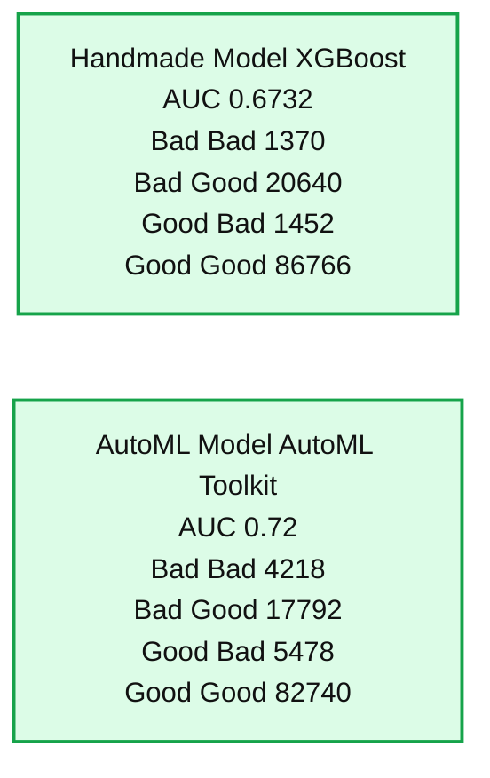

<sub>source image: https://www.databricks.com/wp-content/uploads/2019/09/Confusion-matrices-comparison-v2.png</sub>

In the preceding graphic, the confusion matrix on the left is from the hand-made XGBoost model while the one on the right is from AutoML Toolkit.  While both models do a great job correctly identifying good loans (True: Good, Predicted: Good), the AutoML model performs better on identifying bad loans (True: Bad, Predicted: Bad – 4218  vs. 1370) as well as preventing false positives (True: Bad, Predict: Good – 17792 vs. 20640). In this scenario, this would mean that if we were to have used the machine learning model created by AutoML (as opposed to the handmade model), we could have potentially prevented issuing 2848 more bad loans that would have likely defaulted and cost money.   Just as important, this model potentially would have prevented even more headaches and a bad customer experience by lowering the false positives - incorrectly predicting this was a good loan when in fact it was likely a bad loan.

## Understanding the Business Value

Let’s quantify this confusion matrix to business value; the definition would be:

| Prediction | Label (Is Bad Loan) | Short Description | Long Description |
|---|---|---|---|
| 1 | 1 | Loss Avoided | Correctly found bad loans |
| 1 | 0 | Profit Forfeited | Incorrectly labeled bad loans |
| 0 | 1 | Loss Still Incurred | Incorrectly labeled good loans |
| 0 | 0 | Profit Retained | Correctly found good loans |

To review the dollar value associated with our confusion matrix for our hand-made model, we will use the following code snippet.

**Summary:** The chart shows net business value across four loan prediction outcomes.

**Components:**

- Business value chart using colored bars
- Y axis labeled sum_net_mill
- Prediction legend with four outcome categories
- Green category 1, 0
- Blue category 0, 0
- Orange category 0, 1
- Red category 1, 1

**Flows:**

- none

**Numbers:** 100, 50, 0.00, -50, -100, -150, -200, -250

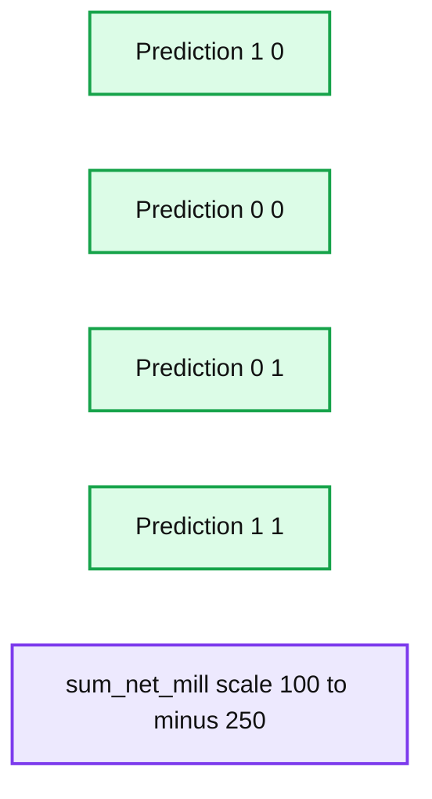

<sub>source image: https://www.databricks.com/wp-content/uploads/2019/09/business_value-xgb-0.90.png</sub>

To review the dollar value associated with our confusion matrix of the AutoML Toolkit model will use the following code snippet.

**Summary:** Bar chart comparing net business value across four prediction outcomes.

**Components:**

- Y-axis: `sum_net_mill`
- Legend: `prediction, label`
- Prediction category `1, 0`
- Prediction category `0, 0`
- Prediction category `0, 1`
- Prediction category `1, 1`

**Flows:**

- none

**Numbers:** 100, 50, 0.00, -50, -100, -150, -200, -250

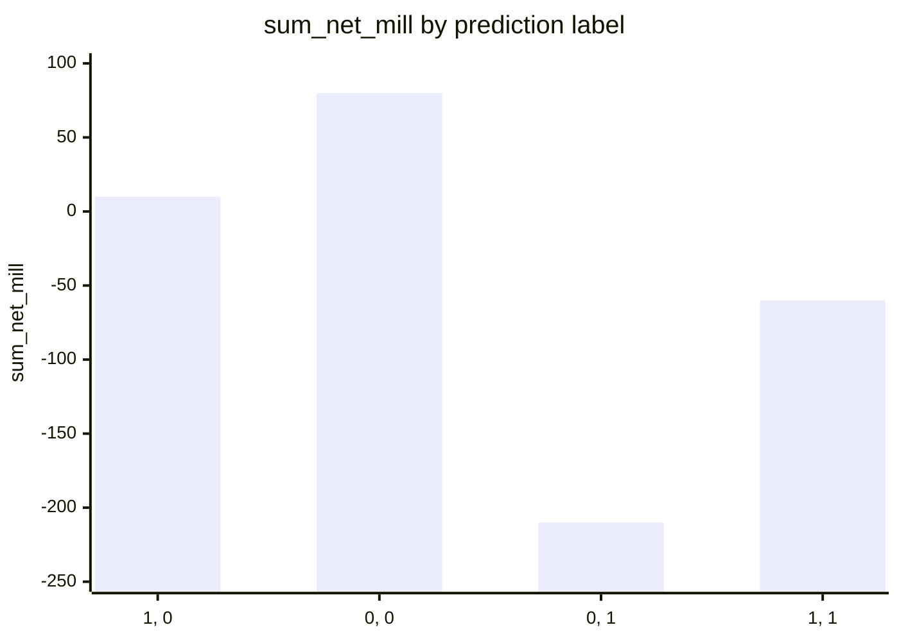

<sub>source image: https://www.databricks.com/wp-content/uploads/2019/09/business-value-automl-v2.png</sub>

Business value is calculated as `value = -(loss avoided - profit forfeited)`

| Model | Loss Avoided | Profit Forfeited | Value |
|---|---|---|---|
| Hand Made | -20.16 | 3.06 | $23.22M |
| AutoML Toolkit | -58.22 | 10.66 | $68.88M |

As you can observe, the potential profits saved by using the AutoML Toolkit is 3x better than our handmade model with savings of $68.88M.

## AutoML Toolkit: Less Code and Faster

**Summary:** The diagram shows an AutoML-assisted machine learning pipeline that iteratively defines, selects, trains, tunes, executes, and reviews models while tracking results in MLflow.

**Components:**

- Define Potential Features
- Vectorize Features
- Choose Features
- Build and Train ML Pipeline
- Tune Model with CrossValidator
- Execute Model and Review Metrics
- Review Metrics
- AutoML Feature Importances
- AutoML AutomationRunner
- MLflow experiment tracking

**Flows:**

- Define Potential Features -> Vectorize Features: potential features
- Vectorize Features -> Choose Features: vectorized features
- Choose Features -> Build and Train ML Pipeline: selected features
- Build and Train ML Pipeline -> Tune Model with CrossValidator: trained pipeline
- Tune Model with CrossValidator -> Execute Model and Review Metrics: tuned model
- Execute Model and Review Metrics -> Review Metrics: model metrics
- Review Metrics -> MLflow: metrics and experiment results
- AutoML Feature Importances -> Define Potential Features: feature importance feedback
- AutoML AutomationRunner -> Build and Train ML Pipeline: automated pipeline execution
- AutoML AutomationRunner -> Execute Model and Review Metrics: automated execution and review

**Numbers:** none

```mermaid
%% AutoML-assisted machine learning pipeline with iterative feedback and MLflow tracking
flowchart LR
    A[Define Potential Features] -->|potential features| B[Vectorize Features]
    B -->|vectorized features| C[Choose Features]
    C -->|selected features| D[Build and Train ML Pipeline]
    D -->|trained pipeline| E[Tune Model with CrossValidator]
    E -->|tuned model| F[Execute Model and Review Metrics]
    F -->|model metrics| G[Review Metrics]
    G -->|metrics and experiment results| H[MLflow]

    I[AutoML Feature Importances] -->|feature importance feedback| A
    J[AutoML AutomationRunner] -->|automated pipeline execution| D
    J -->|automated execution and review| F

    classDef client fill:#dbeafe,stroke:#2563eb,stroke-width:2px,color:#111
    classDef service fill:#dcfce7,stroke:#16a34a,stroke-width:2px,color:#111
    classDef store fill:#ede9fe,stroke:#7c3aed,stroke-width:2px,color:#111
    classDef cache fill:#fef3c7,stroke:#d97706,stroke-width:2px,color:#111
    classDef queue fill:#cffafe,stroke:#0891b2,stroke-width:2px,color:#111
    classDef critical fill:#fee2e2,stroke:#dc2626,stroke-width:4px,color:#111
    classDef external fill:#e5e7eb,stroke:#6b7280,stroke-width:2px,color:#111,stroke-dasharray:4 3
    classDef decision fill:#fce7f3,stroke:#db2777,stroke-width:2px,color:#111

    class A,B,C,D,E,F,G service
    class H store
    class I,J external
```

<sub>source image: https://www.databricks.com/wp-content/uploads/2019/09/ML-Pipeline-with-AutoML-Toolkit.png</sub>

With the [AutoML Toolkit](https://github.com/databrickslabs/automl-toolkit), you can write less code to deliver better results faster.  For this loan risk analysis with XGBoost example, we had seen an improvement in performance of AUC = 0.72 vs. 0.6732 (potential savings of $68.88M vs. $23.22M with the original technique).   The AutoML toolkit was able to find much better hyperparameters because it *automatically* generated, tested, and tuned all of the algorithm’s modifiable hyperparameters in a distributed fashion.

Try out the [AutoML Toolkit](https://github.com/databrickslabs/automl-toolkit) with the [Using AutoML Toolkit to Simplify Loan Risk Analysis XGBoost Model Optimization](https://pages.databricks.com/rs/094-YMS-629/images/automl-simplify-loan-risk-analysis-xgb-optimize.html) notebook on [Databricks](https://www.databricks.com/try-databricks) today!

## Corrections

Previously this blog has stated an AUC value of 0.995 due to mistakenly keeping the `net` column for feature generation (it has an almost 1:1 relationship with loan prediction).  Once this was corrected, the correct AUC is 0.72.  Thanks to Sean Owen, Sanne De Roever, and Carsten Thone who quickly identified this issue.
