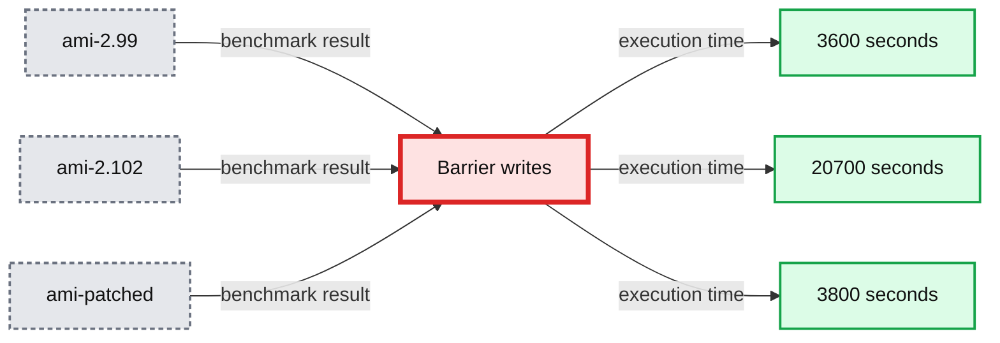
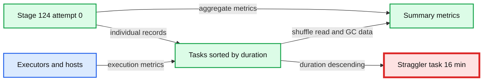
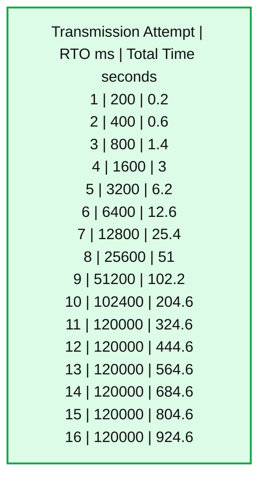
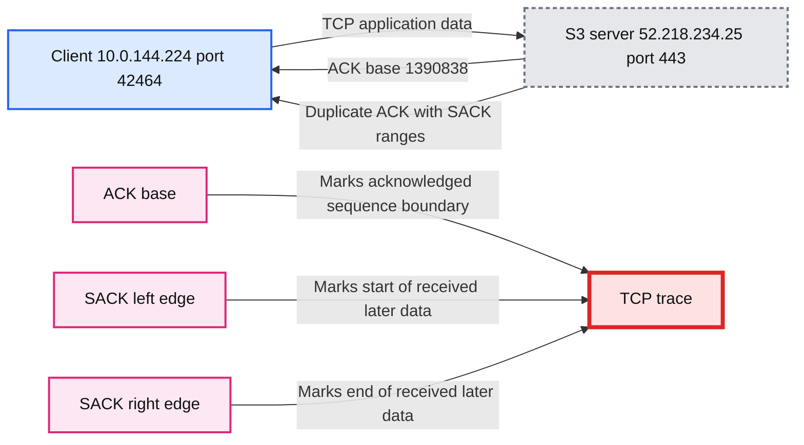
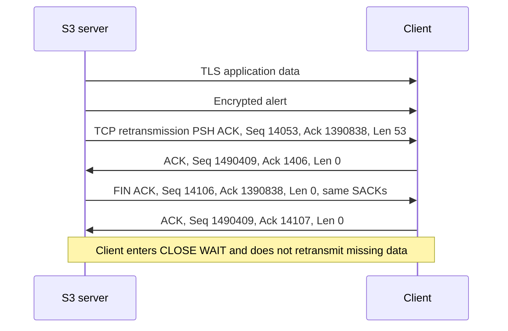

# Adventures in the TCP stack: Uncovering performance regressions in the TCP SACKs vulnerability fixes

- Source: https://www.databricks.com/blog/2019/09/16/adventures-in-the-tcp-stack-performance-regressions-vulnerability-fixes.html
- Published: 2019-09-16
- Authors: Chris Stevens, Michał Switakowski, Ivan Sadikov, Winglung Ngai, Evan Ye
- Categories: platform, engineering
- Images: 9 total, 5 extracted as architecture

Last month,[we announced](https://www.databricks.com/blog/2019/08/01/network-performance-regressions-from-tcp-sack-vulnerability-fixes.html) that the Databricks platform was experiencing network performance regressions due to Linux patches for the[TCP SACKs vulnerabilities](https://access.redhat.com/security/vulnerabilities/tcpsack). The regressions were observed in less than 0.2% of cases when running the Databricks Runtime (DBR) on the Amazon Web Services (AWS) platform. In this post, we will dive deeper into our analysis that determined the TCP stack was the source of the degradation. We will discuss the symptoms we were seeing, walk through how we debugged the TCP connections, and explain the root cause in the Linux source.

As a quick note before we jump in, Canonical is working on an Ubuntu 16.04 image that resolves these performance regressions. We plan to update the Databricks platform once that image is available and has passed our regression tests.

## A failing benchmark

We were first alerted when one of our benchmarks became 6x slower. The regression appeared after upgrading the Amazon Machine Image (AMI) we use to incorporate Ubuntu’s fixes for the TCP SACKs vulnerabilities.

*The Databricks platform’s ami-2.102 image (red) includes the TCP SACKs performance regressions. It is 6x lower with runs averaging ~16 minutes. The above chart shows the cumulative time over 20 runs.*

**Summary:** Benchmark chart comparing cumulative S3 write execution times across three AMI versions over 20 runs.

**Components:**

- S3 write benchmark using Apache Spark
- Barrier writes benchmark
- ami-2.99 Amazon Machine Image
- ami-2.102 Amazon Machine Image
- ami-patched Amazon Machine Image
- Execution time measured in seconds

**Flows:**

- ami-2.99 -> Barrier writes: approximately 3600 seconds
- ami-2.102 -> Barrier writes: approximately 20700 seconds
- ami-patched -> Barrier writes: approximately 3800 seconds

**Numbers:** 10B rows, 1000 partitions, 20 runs, ami-2.99, ami-2.102, 0, 5000, 10000, 15000, 20000, 25000, execution time in seconds

source image: https://www.databricks.com/wp-content/uploads/2019/09/blog-tcp-1-e1568418817845.png

The Databricks platform’s ami-2.102 image (red) includes the TCP SACKs performance regressions. It is 6x lower with runs averaging ~16 minutes. The above chart shows the cumulative time over 20 runs.

The failing benchmark writes a large DataFrame to S3 via the[Databricks File System](https://docs.databricks.com/data/databricks-file-system.html) (DBFS) using Apache Spark’s[save](https://spark.apache.org/docs/latest/sql-data-sources-load-save-functions.html) function.

The Apache Spark stage performing the `save` operation had extreme task skew. One straggler task took about 15 minutes, while the rest completed in less than 1 second.

*The Spark UI allowed us to detect that the Apache Spark stage running the save operation had extreme task skew.*

**Summary:** Spark UI stage metrics show extreme task-duration skew caused by one 16-minute straggler among 1094 completed tasks.

**Components:**

- Spark stage 124, attempt 0
- Summary metrics table
- Task list sorted by duration descending
- Straggler task with 16-minute duration
- Apache Spark executors and hosts
- Shuffle read metrics
- GC time metrics

**Flows:**

- Spark stage 124 -> Summary metrics table: aggregate task statistics
- Spark stage 124 -> Task list: individual task execution records
- Task list -> Straggler task: duration ordering highlights the slow task
- Executors -> Task list: task status, host, duration, GC, and shuffle metrics

**Numbers:**

33 min; 1094 processes; 9.8 GB; 10000000; 1094 completed tasks; Duration minimum 0.5 s; 25th percentile 0.7 s; median 0.8 s; 75th percentile 0.9 s; maximum 16 min; GC minimum 0 ms; 25th percentile 0 ms; median 0 ms; 75th percentile 0 ms; maximum 3 s; Shuffle Read minimum 7.7 MB / 7763; 25th percentile 8.8 MB / 8790; median 9.1 MB / 9140; 75th percentile 9.5 MB / 9467; maximum 10.7 MB / 10729; 1094 tasks; 11 pages; jump to page 1; 100 items; index 105, ID 43088, attempt 0, executor 2, host 10.148.227.144, launch 2019/08/01 00:52:53, duration 16 min, GC 1 s, shuffle 10.0 MB / 9991; index 454, ID 43437, attempt 0, executor 7, host 10.148.236.222, launch 2019/08/01 00:52:56, duration 17 s, GC 0.7 s, shuffle 8.6 MB / 8604; index 578, ID 43561, attempt 0, executor 3, host 10.148.255.72, launch 2019/08/01 00:52:58, duration 15 s, shuffle 9.2 MB / 9192; index 652, ID 43635, attempt 0, executor 6, host 10.148.233.67, launch 2019/08/01 00:52:58, duration 5 s, shuffle 8.8 MB / 8857; index 1058, ID 44041, attempt 0, executor 5, host 10.148.231.186, launch 2019/08/01 00:53:01, duration 5 s, shuffle 8.6 MB / 8610; index 138, ID 43121, attempt 0, executor 4, host 10.148.233.108, launch 2019/08/01 00:52:54, duration 4 s, GC 0.4 s, shuffle 9.0 MB / 9069.

source image: https://www.databricks.com/wp-content/uploads/2019/09/blog-tcp-2.png

The Spark UI allowed us to detect that the Apache Spark stage running the save operation had extreme task skew.

The problem disappeared when rolling back to the insecure AMI without the TCP SACKs vulnerability fixes.

## Debugging TCP connections

In order to figure out why the straggler task took 15 minutes, we needed to catch it in the act. We reran the benchmark while monitoring the Spark UI, knowing that all but one of the tasks for the `save` operation would complete within a few minutes. Sorting the tasks in that stage by the *Status* column, it did not take long for there to be only one task in the RUNNING state. We had found our skewed task and the IP address in the *Host* column pointed us at the executor experiencing the regression.

The Spark UI lead us to the IP address of the executor running the straggler task.

With the IP address in hand, we ssh’d into that executor to see what was going on. Suspecting a networking problem due to the `AmazonS3Exception` errors we’d previously seen in the[cluster logs](https://docs.databricks.com/clusters/clusters-manage.html), we ran[netstat](https://linux.die.net/man/8/netstat) to look at the active network connections.

One TCP connection to an S3 server was stuck in the `CLOSE_WAIT` state. This state indicates that the server is done transmitting data and has closed the connection, but the client still has more data to send. The socket for this connection had 97KB of data waiting to be sent.

While monitoring the state of that socket until the `save` operation completed after 15 minutes, we noticed the size of the send queue never changed. It remained at 97KB. The S3 server was either not acknowledging the data or the executor node was failing to send the data. We used[ss](https://man7.org/linux/man-pages/man8/ss.8.html) to get more details about the socket.

Using `ss` allowed us to look at the socket’s memory usage (`-m`), TCP specific information  (`--info`) and timer information (`-o`). Let’s take a look at the important numbers for this investigation:

- **timer:(on,1min37sec,13) **- The time until the next retransmission (1 min 37 secs) and the completed retransmission attempts (13).
- **tb46080 - **The socket’s current send buffer size in bytes (45KB). This maps to `sk_sndbuf` in the Linux socket structure**.**
- **w103971** - The memory consumed by the socket’s write buffers in bytes (101KB). This maps to `sk_wmem_queued` in the Linux socket structure.
- **mss:1412** - The connection’s maximum segment size in bytes.
- **lastsnd:591672** - The time since the last packet was sent in milliseconds (9 mins 51 secs).

This snapshot of the socket’s state indicated that it had made 13 unsuccessful retransmission attempts and the next attempt would be made in 1 minute and 37 seconds. This was odd, however, given that the maximum time between TCP retransmissions in Linux is 2 minutes and the socket had not sent a packet in the last 9 minutes and 51 seconds. The server wasn’t failing to acknowledge the retransmissions; the client’s retransmissions weren’t even making it out over the wire!

While the socket was stuck in this state, we watched the retransmission counter tick up to 15 (the default setting for `net.ipv4.tcp_retries2`) until the socket was closed. The send queue and write queue sizes never changed and the time since the last packet was sent never decreased, indicating that the socket continued to fail sending the data. Once the socket was closed, the S3 client’s retry mechanism kicked in and the data transfer succeeded.

This behavior matches up nicely with the 15 minutes it was taking our benchmark’s straggler task to complete. With `tcp_retries2` set to 15, `TCP_RTO_MIN` set to 200 milliseconds, `TCP_RTO_MAX` set to 120 seconds, and an exponential backoff in between retries, it takes 924.6 seconds, or just over 15 minutes, for a connection to time out.

*The default TCP retransmission schedule. The retransmission interval starts at 200ms and grows exponentially to the max of 120s, until the socket is closed after 15 minutes of failed retransmissions.*

**Summary:** The table shows TCP retransmission attempts, retransmission timeout intervals, and cumulative connection timeout duration.

**Components:**

- Transmission Attempt: sequential retry count
- RTO: TCP retransmission timeout interval in milliseconds
- Total Time: cumulative timeout duration in seconds

**Flows:**

- none

**Numbers:** 1, 2, 3, 4, 5, 6, 7, 8, 9, 10, 11, 12, 13, 14, 15, 16; 200 ms, 400 ms, 800 ms, 1600 ms, 3200 ms, 6400 ms, 12800 ms, 25600 ms, 51200 ms, 102400 ms, 120000 ms; 0.2 seconds, 0.6 seconds, 1.4 seconds, 3 seconds, 6.2 seconds, 12.6 seconds, 25.4 seconds, 51 seconds, 102.2 seconds, 204.6 seconds, 324.6 seconds, 444.6 seconds, 564.6 seconds, 684.6 seconds, 804.6 seconds, 924.6 seconds

source image: https://www.databricks.com/wp-content/uploads/2019/09/bloc-tcp-4.png

The default TCP retransmission schedule. The retransmission interval starts at 200ms and grows exponentially to the max of 120s, until the socket is closed after 15 minutes of failed retransmissions.

## SACKs in the TCP trace

With the 15 minute task skew explained by the retransmission timeout, we needed to understand why the client was failing to retransmit packets to the S3 server. We had been collecting TCP traces on all executors while debugging the benchmark and looked there for answers.

The[tcpdump](https://linux.die.net/man/8/tcpdump) command above captures all traffic to and from the S3 subnet (52.218.0.0/16). We downloaded the `.pcap` file from the executor with the skewed task and analyzed it using[Wireshark](https://www.wireshark.org/).

For the TCP connection with local port 42464 - the one that had been stuck in the `CLOSE_WAIT` state - the S3 client had attempted to send 1.4MB of data. The first 1.3MB transferred successfully within 600 milliseconds, but then the S3 server missed some segments and sent a SACK. The SACK indicated that 22,138 bytes were missed (the difference between the ACK base and the SACK’s left edge).

*The TCP stack trace shows that the S3 server sent a SACK after missing 21KB of data.*

**Summary:** The trace shows an S3 server sending duplicate TCP ACKs with SACK ranges after missing approximately 22 KB of client data.

**Components:**

- S3 server at 52.218.234.25 using TCP port 443
- S3 client at 10.0.144.224 using local port 42464
- TCP ACK base
- TCP SACK left and right edges

**Flows:**

- 10.0.144.224 -> 52.218.234.25: TCP application data
- 52.218.234.25 -> 10.0.144.224: TCP ACK with ACK base 1390838
- 52.218.234.25 -> 10.0.144.224: Duplicate ACK with SACK ranges identifying missing data

**Numbers:** 932, 933, 94.127765, 94.127762, 94.127765, 94.128231, 94.128288, 94.128290, 94.128975, 94.128985, 94.128990, 94.128994, 10.0.144.224, 52.218.234.25, 42464, 443, 66, 1466, 1412, 1390838, 1436753, 13291, 94720, 97600, 14129176, 1426869, 1428281, 1429693, 932834, 1, 2, 3, 21 KB, 22,138 bytes, 1.4 MB, 1.3 MB, 600 milliseconds, 40 seconds, 7

source image: https://www.databricks.com/wp-content/uploads/2019/09/blog-tcp-5.png

The TCP stack trace shows that the S3 server sent a SACK after missing 21KB of data.

After the client sent its first transmission for all 1.4MB worth of outgoing TCP segments, the connection was silent for 40 seconds. The first 7 retransmission attempts for the missing 21KB should have triggered within that time, lending further proof that the client was failing to send packets over the wire. The server finally sent a `FIN` packet with the same SACK information, indicating that it had not received the missing data. This caused the client to enter the `CLOSE_WAIT` state and even though the client was allowed to transmit data in this state, it did not. The TCP trace showed no more packets for this connection. The unacknowledged 22,138 bytes were never retransmitted.

*The S3 server sent a FIN packet with SACK information indicating it was missing 21KB of data. The TCP trace shows that the client never retransmitted the missing data.*

**Summary:** The TCP trace shows an S3 server sending a retransmission followed by a FIN with repeated SACK information, while the client acknowledges but never retransmits the missing data.

**Components:**

- S3 server at 52.218.234.25 using TCP and TLS
- Client at 10.0.144.224 using TCP
- TCP send queue containing unacknowledged data
- SACK tracking information

**Flows:**

- S3 server -> Client: TLS application data and encrypted alert
- S3 server -> Client: TCP retransmission with PSH and ACK, carrying 53 bytes
- Client -> S3 server: ACK acknowledging sequence 1490409
- S3 server -> Client: FIN and ACK with SACK information
- Client -> S3 server: Final ACK, without retransmitting the missing data

**Numbers:** 933, 94.130629, 52.218.234.25, 10.0.144.224, 66, 443, 42464, 13291, 1390838, 697600, 0, 1412976, 1486173, 143, 134.1616, 407, 487, 119, 134.1915, 14053, 1490409, 106, 100352, 1403, 1406, 134.136, 54, 14106, 1390838, 77,433, 22,138, 99,571, 21KB

source image: https://www.databricks.com/wp-content/uploads/2019/09/blog-tcp-6.png

The S3 server sent a FIN packet with SACK information indicating it was missing 21KB of data. The TCP trace shows that the client never retransmitted the missing data.

Adding these 22,138 bytes to the 77,433 SACKed bytes (subtract right edge from left edge), we get 99,571 bytes. This number should look familiar. It is the size of the socket’s send queue listed in the `netstat` output. This raised a second question. Why wasn’t the 75KB of SACKed data ever removed from the socket’s send queue? The server had confirmed reception; the client didn’t need to keep it.

Unfortunately, the TCP trace didn’t tell us why the retransmissions failed and only added an additional question to be answered. We opened the Ubuntu 16.04 source to learn more.

## Dissecting the TCP stack

One [Linux patch](https://git.launchpad.net/~ubuntu-kernel/ubuntu/+source/linux/+git/xenial/commit/?id=9094a474de513f5f77e94e5e8b4bd12cee83d563) meant to fix the TCP SACKs vulnerability added an if-statement to the `tcp_fragment()` function. It was meant to restrict the conditions under which the TCP stack fragments a socket’s retransmission queue to protect against maliciously crafted SACKs packets. It was the first place we looked because it had already been [fixed](https://git.launchpad.net/~ubuntu-kernel/ubuntu/+source/linux/+git/xenial/commit/?id=92fc18789a3793965588087a1d7860f38f3c65b4) once.

Canonical’s backport of the change to allow fragmentation on socket buffers that include unsent packets.

Even with this fix, we were still seeing problems. At the end of July, [yet another fix](https://git.kernel.org/pub/scm/linux/kernel/git/stable/linux.git/commit/?h=linux-5.2.y&id=18254123b79522e185495ac14c7a33636e8371d8) was published for newer versions of Linux. As our AMIs use Ubuntu 16.04 with Canonical’s 4.4.0 Linux kernel, we backported that patch and built a [custom Ubuntu kernel](https://wiki.ubuntu.com/Kernel/BuildYourOwnKernel). Our performance problem disappeared.

Our backport of the second patch to fix the performance regressions caused by the initial TCP SACKs vulnerability fixes.

Still blind to the root cause, as we didn’t know which of the four conditions in the if-statement fixed our problem, we built multiple custom images, isolating each condition. The image with just the first condition - the modifications to the `sk_wmem_queued` check - proved sufficient to solve our issues.

The if-statement in tcp_fragment() with the limited sent of changes that resolved our performance issues.

The commit message for that change says that a 128KB overhead was added to `sk_sndbuf` to form the limit because “`tcp_sendmsg()` and `tcp_sendpage()` might overshoot `sk_wmem_queued` by about one full TSO skb (64KB size).” This means that `sk_wmem_queued` can legitimately exceed `sk_sndbuf` by as much as 64KB. This is what we were seeing in our socket. If you recall the `ss` output above, the send buffer was 46,080 bytes and the write queue size was 103,971 bytes (a difference of 56KB). As half of our write queue (note the right shift in the condition) was bigger than the send buffer, we were satisfying the original fix’s if-condition. [nstat](https://linux.die.net/man/8/nstat) confirmed this, as we saw the `TCPWQUEUETOOBIG` count recorded as 179.

With confirmation that we were indeed failing in `tcp_fragment()`, we wanted to figure out why this could cause retransmission to fail. Looking up the stack at the [retransmit code path](https://git.launchpad.net/~ubuntu-kernel/ubuntu/+source/linux/+git/xenial/tree/net/ipv4/tcp_output.c?id=9094a474de513f5f77e94e5e8b4bd12cee83d563#n2635), we saw that if a socket buffer’s length is larger than the current MSS (1412 bytes in our case), `tcp_fragment()` is invoked before retransmission. If this fails, retransmission [increments](https://git.launchpad.net/~ubuntu-kernel/ubuntu/+source/linux/+git/xenial/tree/net/ipv4/tcp_output.c?id=9094a474de513f5f77e94e5e8b4bd12cee83d563#n2705) the `TCPRETRANSFAIL` counter (ours was at 143) and [aborts](https://git.launchpad.net/~ubuntu-kernel/ubuntu/+source/linux/+git/xenial/tree/net/ipv4/tcp_output.c?id=9094a474de513f5f77e94e5e8b4bd12cee83d563#n2832) the retransmission attempt for the entire queue of socket buffers. This is the reason why we did not observe any retransmissions of the 21KB of unacknowledged data.

This leaves the 75KB of SACKed data. Why wasn’t the memory from those packets reclaimed? It would have reduced the size of the write queue and allowed the fragmentation attempts during retransmission to succeed. Alas, SACK handling also calls `tcp_fragment()` when a socket buffer is not completely within the SACK boundaries so that it can free the acknowledged portion. When one fragmentation fails, the handler actually [breaks out](https://git.launchpad.net/~ubuntu-kernel/ubuntu/+source/linux/+git/xenial/tree/net/ipv4/tcp_input.c?id=9094a474de513f5f77e94e5e8b4bd12cee83d563#n1546) without checking the rest of the socket buffers. This is likely why the 75KB of acknowledged data was never released. If the unacknowledged 21KB shared a socket buffer with the first portion of the SACKed data, it would have required fragmentation to reclaim. Failing on the same if-condition in `tcp_fragment()`, the SACK handler would have aborted.

## Lessons learned

Reflecting on our journey through discovery, investigation and root cause analysis, a few points stand out:

- **Consider the whole stack. **We take for granted that Ubuntu offers a secure and stable platform for our clusters. When our benchmark initially failed, we naturally started looking for clues in our own recent changes. It was only after discovering the subsequent Linux TCP patches that we started questioning bits lower down the stack.
- **Benchmarks are just numbers; logging is vital. **We already knew this, but it’s worth reiterating. Our benchmark simply told us the platform was 6x slower. It didn’t tell us where to look. The Spark logs reporting S3 socket timeout exceptions gave us our first real hint. A benchmark that alerted on such logging abnormalities would have greatly reduced the initial investigation time.
- **Use the right tools.** The 15 minute socket timeout stumped us for a while. We knew about `netstat`, but only later learned about `ss`. The latter provides far more detail about a socket’s state and made the retransmission failures obvious. It also helped us make better sense of the TCP trace as it too was missing the expected retransmissions.

We also learned a lot about the Linux TCP stack during this deep dive. While Databricks isn’t looking to start submitting Linux patches anytime soon, we owed it to our customers and the Linux community to back up our earlier claim that an OS-level patch would be required to fix our performance regression. The good news is that the latest [4.4.0 patch](https://git.launchpad.net/~ubuntu-kernel/ubuntu/+source/linux/+git/xenial/commit/?h=master-next&id=fe6c6b03b4513230cf7cdf92ff2f3c234de72dba) resolves the issue and an official Ubuntu 16.04 fix is in sight.
