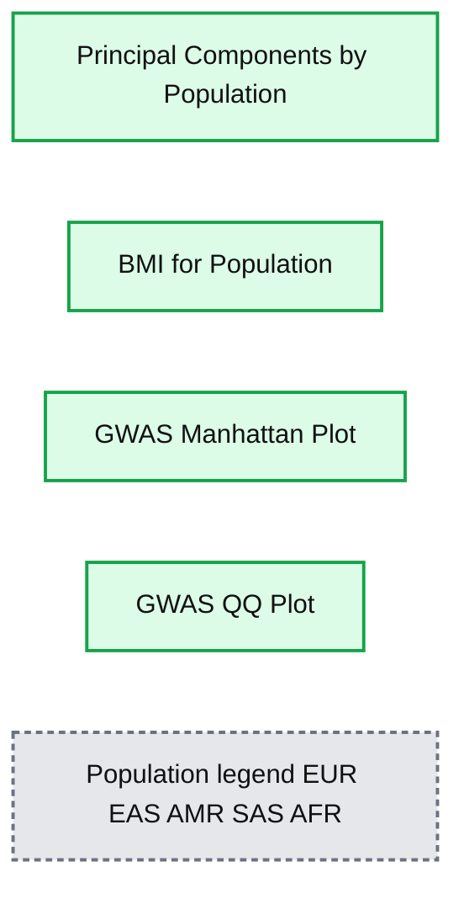
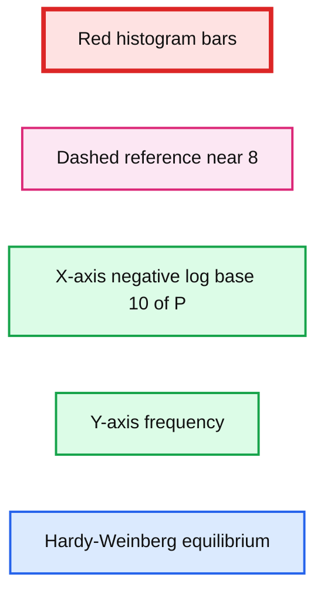
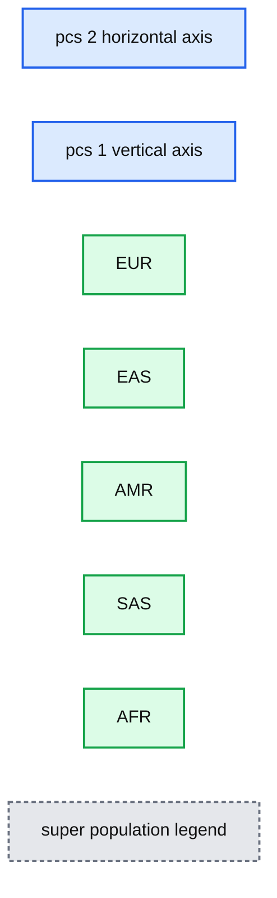
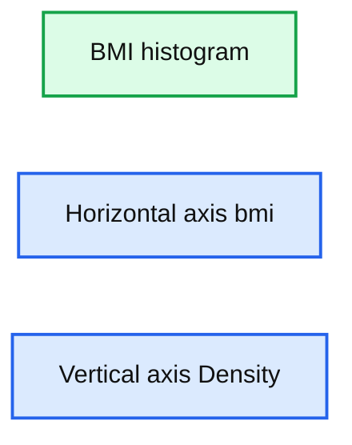
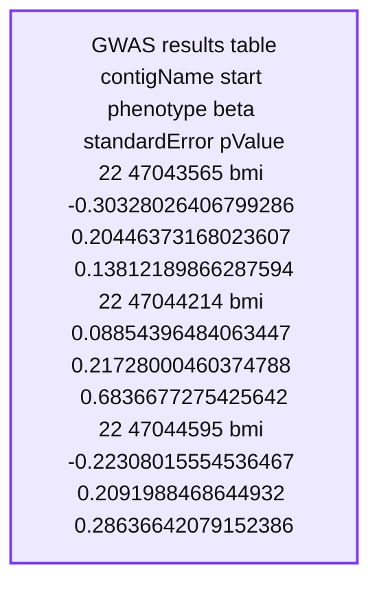

# Engineering population scale Genome-Wide Association Studies with Apache Spark™, Delta Lake, and MLflow

- Source: https://www.databricks.com/blog/2019/09/20/engineering-population-scale-genome-wide-association-studies-with-apache-spark-delta-lake-and-mlflow.html
- Published: 2019-09-20
- Authors: Frank Austin Nothaft, Henry Davidge, William Brandler
- Categories: engineering, open-source, company, news, customers
- Images: 8 total, 5 extracted as architecture

[Get an early preview of O'Reilly's new ebook](https://www.databricks.com/resources/ebook/delta-lake-running-oreilly?itm_data=engineeringpopulationscalegenomewideassociation-blog-oreillydlupandrunning) for the step-by-step guidance you need to start using Delta Lake.

---

[Try this notebook series in Databricks](https://pages.databricks.com/rs/094-YMS-629/images/engineering_population_scale_gwas.html)

The advent of genome-wide association studies (GWAS) in the late 2000s enabled scientists to begin to understand the causes of complex diseases such as diabetes and Crohn’s disease at their most fundamental level. However, academic bioinformatics tools to perform GWAS have not kept pace with the growth of genomic data, which has been doubling globally every seven months.

Given the scale of the challenge and the importance of genomics to the future of healthcare, at Databricks we have dedicated an engineering team to develop extensible Spark-native implementations of workflows such as GWAS, which leverage the high-performance big-data store, *Delta Lake*, and log runs with *MLflow*. Combining these three technologies with a library we have developed in-house to enable customers to work with genomic data solves the challenges that we have seen our customers face when working with population-scale genomic data.

This tooling includes an architecture that allows users to ingest genomics data directly from [flat file formats such as bed, VCF, or BGEN, into Delta Lake](https://www.databricks.com/blog/2019/06/26/scaling-genomic-workflows-with-spark-sql-bgen-and-vcf-readers.html). In this blog, we focus on moving common association testing kernels into Spark SQL, streamlining the running of common tests such as genome-wide linear regression.  In our next blog, we will generalize this process by using the pipe-transformer parallelize any single-node bioinformatics tool with Apache Spark™, [starting with the GWAS tool SAIGE](https://docs.databricks.com/applications/genomics/genomics-libraries/glowgr.html).

Here we showcase how to run and end-to-end GWAS workflow in a single notebook using the publicly available [1,000 genomes dataset](https://www.internationalgenome.org/), producing the results in figure 1. We used associated variants from the GWAS catalog to generate a synthetic body-mass index (BMI) phenotype (since the 1000 Genomes project did not capture phenotypes). This notebook is written in Python, but can also be implemented in R, Scala and SQL.

**Summary:** Databricks dashboard showing simulated GWAS results across population principal components, BMI distribution, Manhattan significance, and QQ comparison plots.

**Components:**

- Principal Components by Population - population-colored PCA scatter plot
- BMI for Population - BMI density histogram
- GWAS Manhattan Plot - chromosome-wide association significance plot
- GWAS QQ Plot - expected versus observed significance plot
- Population legend - EUR, EAS, AMR, SAS, AFR

**Flows:**

- none

**Numbers:** 1,000 rows; PCA axes from -20.0m to 34.0m and -16.0m to 34.0m; BMI axis 10 to 38; BMI density axis 0.00 to 0.20; chromosome labels 1, 2, 3, 4, 5, 6, 7, 8, 9, 10, 11, 13, 15, 18, 21; Manhattan y-axis 0 to 15; Manhattan threshold lines approximately 5 and 7.3; QQ axes 0 to 7 and 0 to 15

source image: https://www.databricks.com/wp-content/uploads/2019/09/dashboard-partial.png

*Figure 1. Databricks dashboard showing key results from a GWAS on simulated data based on the 1000 genomes dataset.*

## Ingest 1,000 Genomes Data into Delta Lake

To start, we will load in the 1,000 Genomes VCF file as a Spark SQL DataFrame and calculate summary statistics. Our schema is an intuitive representation of genomic variants that is consistent across both VCF and BGEN data.

*Figure 2. Databricks’ `display()` command showing VCF file in a Spark DataFrame*

The 1,000 Genomes dataset contains whole genome sequencing data, and thus includes many rare variants. By running a count query on the dataset, we find that there are more than 80 million variants. Let’s go ahead and log this metric to MLflow.

## Perform quality control

In our genomics library, we have added quality control functions that compute common statistics across [the genotypes at a single variant](https://glow.readthedocs.io/en/latest/etl/variant-qc.html), as well as across all of [the samples in a single callset](https://glow.readthedocs.io/en/latest/etl/sample-qc.html). Here we are going to filter variants that are not in Hardy-Weinberg equilibrium (“pValueHwe”), which is a population genetics statistic that can be used to assess if variants have been correctly genotyped. We will exclude rare variants based on allele frequency.

**Summary:** Histogram of Hardy-Weinberg equilibrium p-values, plotted as negative log base 10 of p-values, with a dashed reference line near 8.

**Components:**

- Red histogram bars
- Dashed Hardy-Weinberg equilibrium reference line
- X-axis labeled negative log base 10 of P
- Y-axis showing frequency
- Title Hardy-Weinberg equilibrium

**Flows:**

- none

**Numbers:** 0, 5, 10, 15, 20, 25, 0, 200000, 400000, 600000, 800000, 1000000, approximately 8

source image: https://www.databricks.com/wp-content/uploads/2019/09/hwe-graph.png

*Figure 3. Histogram of Hardy-Weinberg Equilibrium P values *

## Control for ancestry

Population structure can confound genotype-phenotype association analyses. To control for differing ancestry between participants in the study, here we calculate principal components (PCs), which are provided as covariates to the regression kernel. Spark supports [singular value decomposition (SVD) through the Spark MLLib DistributedMatrix API](https://spark.apache.org/docs/latest/mllib-dimensionality-reduction.html#singular-value-decomposition-svd), and SVD can be used to calculate PCs from the transpose of the genotypes matrix. We have introduced an API in Spark that makes it easy to build a DistributedMatrix from a DataFrame, and use this to run SVD and get our PCs.

After running PCA, we get back a dense matrix of PCs per sample, that we will pass as covariates to the regression analysis. The next steps will extract out only the *sampleId* and the *principal components*. This allows us to join against the [1,000 Genomes sample metadata file to label each sample with their super-population](https://www.internationalgenome.org/faq/which-populations-are-part-of-your-study).

With Databricks’ `display()` command, we can view the clusters of our components within the following scatterplot.

**Summary:** Scatterplot showing principal-component clusters for 1,000 Genomes samples labeled by super-population.

**Components:**

- PCA scatterplot using pcs[2] on the horizontal axis and pcs[1] on the vertical axis
- EUR cluster for European samples
- EAS cluster for East Asian samples
- AMR cluster for Admixed American samples
- SAS cluster for South Asian samples
- AFR cluster for African samples
- super_population legend

**Flows:**

- none

**Numbers:** pcs[1], pcs[2], 34.0m, 32.0m, 30.0m, 28.0m, 26.0m, 24.0m, 22.0m, 20.0m, 18.0m, 16.0m, 14.0m, 12.0m, 10.0m, 8.00m, 6.00m, 4.00m, 2.00m, 0.00m, -2.00m, -4.00m, -6.00m, -8.00m, -10.0m, -12.0m, -14.0m, -16.0m, -25.0m, -20.0m, -15.0m, -10.0m, -5.00m, 0.00m, 5.00m, 10.0m, 15.0m, 20.0m, 25.0m, 30.0m, 35.0m

source image: https://www.databricks.com/wp-content/uploads/2019/09/PCA_incl_population.png

*Figure 4. Principal Component Analysis with Super Population Labelling: *

*EUR = European, EAS = East Asian, AMR = Admixed American, SAS = South Asian, AFR = African*

## Ingest Phenotype Data

For this genome-wide association study, we will be using simulated BMI phenotypic data to associate with the genotypes. Similar to the ingestion of our genotype data, we will ingest the BMI data by reading our sample Parquet data.

You can visualize the BMI histogram from the preceding `display()` command.

**Summary:** Histogram showing the density distribution of simulated BMI phenotypic data.

**Components:**

- BMI histogram
- Horizontal axis labeled bmi
- Vertical axis labeled Density

**Flows:**

- none

**Numbers:** Horizontal axis values 9.0 through 38. Vertical axis values 0.00 through 0.20 in increments of 0.02.

source image: https://www.databricks.com/wp-content/uploads/2019/09/bmi-density.png

*Figure 5. BMI histogram*

## Running the Genome-Wide Association Study

Now we have performed the necessary quality control and data extraction, transformation and loading (ETL), the next phase of our solution is to run our GWAS by performing the following tasks:

- Mapping the genotypes, phenotypes, and principal components together (using `crossJoin`).
- Calculate the GWAS statistics by running linear regression.
- Build a new Apache Spark DataFrame (`gwas_df`) that contains the GWAS statistics.

**Summary:** A Spark DataFrame displays GWAS results with genomic positions, phenotype, regression coefficients, standard errors, and p-values.

**Components:**

- contigName column
- start column
- phenotype column
- beta column
- standardError column
- pValue column
- GWAS results table

**Flows:**

- none

**Numbers:**

- contigName: 22 in every visible row
- start: 47043565, 47044214, 47044595, 47045555, 47046204, 47046275, 47046329, 47046511, 47046822, 47047110, 47048123
- phenotype: bmi in every visible row
- beta: -0.30328026406799286, 0.08854396484063447, -0.22308015554536467, -0.1777256002616909, -0.13065985961495713, -0.25969951388976764, -0.27743205501051504, -0.18746476701319287, 0.008047978494075922, 0.18264258859509006, -0.27867919867364904
- standardError: 0.20446373168023607, 0.21728000460374788, 0.2091988468644932, 0.12646865045732833, 0.2469372700488206, 0.20942785015315957, 0.20460255797262245, 0.10869169622848852, 0.249720055422627, 0.23176461041103288, 0.20571978949331682
- pValue: 0.13812189866287594, 0.6836677275425642, 0.28636642079152386, 0.16005830479889416, 0.5967680661659363, 0.2150760043607468, 0.17523574441856593, 0.08469828452681138, 0.9742927999415136, 0.4307410025849725, 0.1756502277353883

source image: https://www.databricks.com/wp-content/uploads/2019/09/gwas-results-path-22.png

*Figure 6. Spark DataFrame of GWAS results*

The `display()` command allows us to sanity check the results. Next we can convert our PySpark DataFrame to R thus allowing us to use the `qqman` package to visualize the results across the genome with a Manhattan plot.

*Figure 7. GWAS Manhattan Plot*

As you can see from our genome-wide association study, for our 1000 genomes simulated data, there are several loci associated with BMI clustered on chromosome 2. In fact, these are the loci whose known associations with BMI were used to simulate our BMI phenotype.

We can also check that we have successfully controlled for ancestry by making a quantile-quantile (QQ) plot. In this case, the deviation from expected represents true associations.

*Figure 8. GWAS QQ Plot*

Finally, we have logged parameters, metrics and plots associated with this GWAS run using MLflow, enabling tracking, monitoring and reproducing of analyses.

## Summarizing the Analysis

In this blog, we have demonstrated an end-to-end GWAS workflow using Apache Spark, Delta Lake, and MLflow. Whether you are [validating the accuracy of a genotyping assay in clinical use like Sanford Health](https://www.databricks.com/customers/sanford-health), or [performing a meta-analysis of GWAS results for target identification like Regeneron](https://www.databricks.com/customers/regeneron), the Databricks platform makes it easy to extend analyses and build downstream exploratory visualizations through our built-in dashboarding functionality or through our optimized connectors to BI tools like [Tableau](https://docs.databricks.com/integrations/bi/tableau.html) and [PowerBI](https://docs.microsoft.com/en-us/azure/databricks/integrations/bi/power-bi) which can enable non-coding bench scientists and clinicians to rapidly explore large datasets.

*Figure 9. MLflow tracking of each run enables reproducibility of experiments*

By robustly engineering an end-to-end GWAS workflow, scientists can move away from ad hoc analysis on flat files, to scalable and reproducible computational frameworks in production. Furthermore by reading VCF data as a Spark DataSource into Delta Lake, data scientists can now integrate tabular phenotypes, Electronic Health Record (EHR) extracts, images, real-world evidence and lab values under a unified framework. Try it yourself today by downloading the Engineering population scale GWAS Databricks notebook.

## Try it!

Run our [scalable GWAS workflow](https://pages.databricks.com/rs/094-YMS-629/images/engineering_population_scale_gwas.html) on the Databricks platform ([Azure](https://docs.microsoft.com/en-us/azure/databricks/applications/genomics/tertiary/azure/databricks/applications/genomics/joint-genotyping/joint-genotyping-pipeline.html#joint-genotyping-pipeline) | [AWS](https://docs.databricks.com/applications/genomics/joint-genotyping/joint-genotyping-pipeline.html#joint-genotyping-pipeline)). Learn more about our genomics solutions in the [Databricks Unified Analytics for Genomics](https://www.databricks.com/product/genomics) and [try out a preview today](https://pages.databricks.com/genomics-preview.html).
