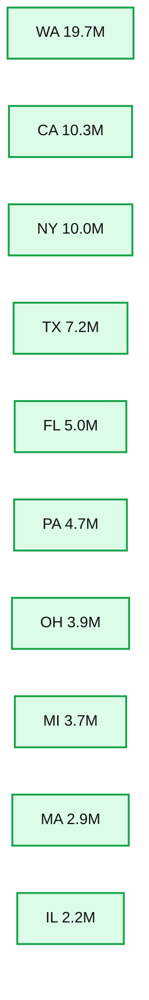

# Diving Into Delta Lake: Schema Enforcement & Evolution

- Source: https://www.databricks.com/blog/2019/09/24/diving-into-delta-lake-schema-enforcement-evolution.html
- Published: 2019-09-24
- Authors: Burak Yavuz, Brenner Heintz, Denny Lee
- Categories: solutions, engineering, open-source, company, news
- Images: 2 total, 1 extracted as architecture

[Try this notebook series in Databricks](https://pages.databricks.com/rs/094-YMS-629/images/01-Delta%20Lake%20Workshop%20-%20Delta%20Lake%20Primer.html)

Data, like our experiences, is always evolving and accumulating. To keep up, our mental models of the world must adapt to new data, some of which contains new dimensions - new ways of seeing things we had no conception of before. These mental models are not unlike a table's schema, defining how we categorize and process new information.

This brings us to schema management. As business problems and requirements evolve over time, so too does the structure of your data. With [Delta Lake](https://www.databricks.com/resources/ebook/delta-lake-running-oreilly)[,](https://www.databricks.com/resources/ebook/delta-lake-running-oreilly?itm_data=deltalakeevolution-blog-oreillyupandrunning ) as the data changes, incorporating new dimensions is easy. Users have access to simple semantics to control the schema of their tables. These tools include **schema enforcement,** which prevents users from accidentally polluting their tables with mistakes or garbage data, as well as **schema evolution,** which enables them to automatically add new columns of rich data when those columns belong. In this blog, we'll dive into the use of these tools.

## Understanding Table Schemas

Every DataFrame in Apache Spark™  contains a schema, a blueprint that defines the shape of the data, such as data types and columns, and metadata. With Delta Lake, the table's schema is saved in JSON format inside the transaction log.

## What Is Schema Enforcement?

Schema enforcement, also known as **schema validation*****,*** is a safeguard in Delta Lake that ensures data quality by rejecting writes to a table that do not match the table's schema. Like the front desk manager at a busy restaurant that only accepts reservations, it checks to see whether each column in data inserted into the table is on its list of expected columns (in other words, whether each one has a "reservation"), and rejects any writes with columns that aren't on the list.

## How Does Schema Enforcement Work?

Delta Lake uses schema validation *on write*, which means that all new writes to a table are checked for compatibility with the target table's schema at write time. If the schema is not compatible, Delta Lake cancels the transaction altogether (no data is written), and raises an exception to let the user know about the mismatch.

To determine whether a write to a table is compatible, Delta Lake uses the following rules. The DataFrame to be written:

- **Cannot contain any additional columns that are not present in the target table's schema.** Conversely, it's OK if the incoming data doesn't contain every column in the table - those columns will simply be assigned null values.
- **Cannot have column data types that differ from the column data types in the target table.** If a target table's column contains StringType data, but the corresponding column in the DataFrame contains IntegerType data, schema enforcement will raise an exception and prevent the write operation from taking place.
- **Can not contain column names that differ only by case.** This means that you cannot have columns such as 'Foo' and  'foo' defined in the same table. While Spark can be used in case sensitive or insensitive (default) mode, Delta Lake is case-preserving but insensitive when storing the schema. Parquet is case sensitive when storing and returning column information. To avoid potential mistakes, data corruption or loss issues (which we've personally experienced at Databricks), we decided to add this restriction.

To illustrate, take a look at what happens in the code below when an attempt to append some newly calculated columns to a Delta Lake table that isn't yet set up to accept them.

Rather than automatically adding the new columns, Delta Lake enforces the schema and stops the write from occurring. To help identify which column(s) caused the mismatch, Spark prints out both schemas in the stack trace for comparison.

## How Is Schema Enforcement Useful?

Because it's such a stringent check, schema enforcement is an excellent tool to use as a gatekeeper of a clean, fully transformed data set that is ready for production or consumption. It's typically enforced on tables that directly feed:

- Machine learning algorithms
- BI dashboards
- Data analytics and visualization tools
- Any production system requiring highly structured, strongly typed, semantic schemas

In order to prepare their data for this final hurdle, many users employ a simple "multi-hop" architecture that progressively adds structure to their tables. To learn more, take a look at the post entitled [Productionizing Machine Learning With Delta Lake](https://www.databricks.com/blog/2019/08/14/productionizing-machine-learning-with-delta-lake.html).

Of course, schema enforcement can be used anywhere in your pipeline, but be aware that it can be a bit frustrating to have your streaming write to a table fail because you forgot that you added a single column to the incoming data, for example.

## Preventing Data Dilution

At this point, you might be asking yourself, what's all the fuss about? After all, sometimes an unexpected "schema mismatch" error can trip you up in your workflow, especially if you're new to Delta Lake. Why not just let the schema change however it needs to so that I can write my DataFrame no matter what?

As the old saying goes, "an ounce of prevention is worth a pound of cure." At some point, if you don't enforce your schema, issues with data type compatibility will rear their ugly heads - seemingly homogenous sources of raw data can contain edge cases, corrupted columns, misformed mappings, or other scary things that go bump in the night. A much better approach is to stop these enemies at the gates - using schema enforcement - and deal with them in the daylight rather than later on, when they'll be lurking in the shadowy recesses of your production code.

Schema enforcement provides peace of mind that your table's schema will not change unless you make the affirmative choice to change it. It prevents data "dilution," which can occur when new columns are appended so frequently that formerly rich, concise tables lose their meaning and usefulness due to the data deluge. By encouraging you to be intentional, set high standards, and expect high quality, schema enforcement is doing exactly what it was designed to do - keeping you honest, and your tables clean.

If, upon further review, you decide that you really *did* mean to add that new column, it's an easy, one line fix, as discussed below. The solution is schema evolution!

## What Is Schema Evolution?

Schema evolution is a feature that allows users to easily change a table's current schema to accommodate data that is changing over time. Most commonly, it's used when performing an append or overwrite operation, to automatically adapt the schema to include one or more new columns.

## How Does Schema Evolution Work?

Following up on the example from the previous section, developers can easily use schema evolution to add the new columns that were previously rejected due to a schema mismatch. Schema evolution is activated by adding ` .option('mergeSchema', 'true')` to your `.write` or `.writeStream` Spark command.

To view the plot, execute the following Spark SQL statement.

**Summary:** Bar chart showing loan counts by state after applying Delta Lake schema enforcement and schema evolution.

**Components:**

- WA - state loan count, technology not specified
- CA - state loan count, technology not specified
- NY - state loan count, technology not specified
- TX - state loan count, technology not specified
- FL - state loan count, technology not specified
- PA - state loan count, technology not specified
- OH - state loan count, technology not specified
- MI - state loan count, technology not specified
- MA - state loan count, technology not specified
- IL - state loan count, technology not specified

**Flows:**

- none

**Numbers:** 0.00, 2M, 4M, 6M, 8M, 10M, 12M, 14M, 16M, 18M, 20M, 22M; WA approximately 19.7M, CA approximately 10.3M, NY approximately 10.0M, TX approximately 7.2M, FL approximately 5.0M, PA approximately 4.7M, OH approximately 3.9M, MI approximately 3.7M, MA approximately 2.9M, IL approximately 2.2M

source image: https://www.databricks.com/sites/default/files/inline-images/delta-lake-schema-evolution.png

>  Alternatively, you can set this option for the entire Spark session by adding spark.databricks.delta.schema.autoMerge = True to your Spark configuration. Use with caution, as schema enforcement will no longer warn you about unintended schema mismatches.

By including the `mergeSchema` option in your query, any columns that are present in the DataFrame but not in the target table are automatically added on to the end of the schema as part of a write transaction. Nested fields can also be added, and these fields will get added to the end of their respective struct columns as well.

Data engineers and scientists can use this option to add new columns (perhaps a newly tracked metric, or a column of this month's sales figures) to their existing machine learning production tables without breaking existing models that rely on the old columns.

The following types of schema changes are eligible for schema evolution during table appends or overwrites:

- Adding new columns (this is the most common scenario)
- Changing of data types from NullType -> any other type, or upcasts from ByteType -> ShortType -> IntegerType

Other changes, which are not eligible for schema evolution, require that the **schema and data** are overwritten by adding `.option("overwriteSchema", "true")`. For example, in the case where the column "Foo" was originally an `integer` data type and the new schema would be a string data type, then all of the Parquet (data) files would need to be re-written.  Those changes include:

- Dropping a column
- Changing an existing column's data type (in place)
- Renaming column names that differ only by case (e.g. "Foo" and "foo")

Finally, with the upcoming release of Spark 3.0, explicit DDL (using `**ALTER TABLE**`) will be fully supported, allowing users to perform the following actions on table schemas:

- Adding  columns
- Changing column comments
- Setting table properties that define the behavior of the table, such as setting the retention duration of the transaction log

## How is Schema Evolution Useful?

Schema evolution can be used anytime you *intend*  to change the schema of your table (as opposed to where you accidentally added columns to your DataFrame that shouldn't be there). It's the easiest way to migrate your schema because it automatically adds the correct column names and data types, without having to declare them explicitly.

## Summary

Schema enforcement rejects any new columns or other schema changes that aren't compatible with your table. By setting and upholding these high standards, analysts and engineers can trust that their data has the highest levels of integrity, and reason about it with clarity, allowing them to make better business decisions.

On the flip side of the coin, schema evolution complements enforcement by making it easy for *intended* schema changes to take place automatically. After all, it shouldn't be hard to add a column.

Schema enforcement is the yin to schema evolution's yang. When used together, these features make it easier than ever to block out the noise, and tune in to the signal.

*We'd also like to thank Mukul Murthy and Pranav Anand for their contributions to this blog.*

**Interested in the open source Delta Lake?**
[Visit the Delta Lake online hub](https://delta.io?utm_source=delta-blog) to learn more, download the latest code and join the Delta Lake community.

## Related

Articles in this series:
[**Diving Into Delta Lake #1:** Unpacking the Transaction Log](https://www.databricks.com/blog/2019/08/21/diving-into-delta-lake-unpacking-the-transaction-log.html)
[**Diving Into Delta Lake #2:** Schema Enforcement & Evolution](https://www.databricks.com/blog/2019/09/24/diving-into-delta-lake-schema-enforcement-evolution.html)
[**Diving Into Delta Lake #3:** DML Internals (Update, Delete, Merge)](https://www.databricks.com/blog/2020/09/29/diving-into-delta-lake-dml-internals-update-delete-merge.html)

[Productionizing Machine Learning With Delta Lake](https://www.databricks.com/blog/2019/08/14/productionizing-machine-learning-with-delta-lake.html)
[What Is A Data Lake?](https://www.databricks.com/discover/data-lakes/introduction)
