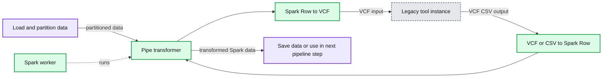
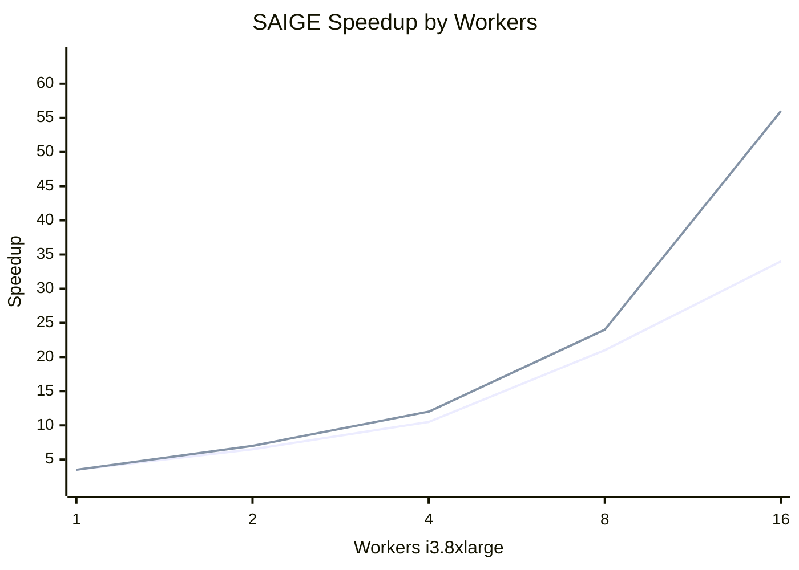

# Parallelizing SAIGE Across Hundreds of Cores

- Source: https://www.databricks.com/blog/2019/10/02/parallelizing-saige-across-hundreds-of-cores.html
- Published: 2019-10-02
- Authors: Karen Feng, Henry Davidge, Frank Austin Nothaft
- Categories: engineering, platform, solutions
- Images: 5 total, 3 extracted as architecture

As population genetics datasets grow exponentially, it is becoming impractical to work with genetic data without leveraging Apache Spark™. There are many ways to use Spark to derive novel insights into the role of genetic variation on disease processes. For example, [Regeneron works directly on Spark SQL DataFrames](https://www.databricks.com/customers/regeneron), and the open-source [Hail](https://hail.is) package can be used to scale common GWAS kernels using Apache Spark™ ([Hail is available pre-installed on Databricks](https://docs.databricks.com/applications/genomics/tertiary-analytics/hail.html)). However, there is a large body of tools outside of Spark that provides novel algorithms that help us understand genetic variants and phenotype associations. A recent list by OmicX identified several hundred bioinformatics tools that can be used in a genome-wide association study (GWAS) workflow. Recent work in GWAS method development has focused on tools like SAIGE and BoltLMM, which provide better statistical methods for dealing with biobank datasets.

While these tools are statistically powerful, they are also computationally intensive and designed for a single node compute architecture. At Databricks, we aim to leverage Spark to build a generic architecture to efficiently parallelize bioinformatics tools. This technique both accelerates these GWAS algorithms while unifying these methods with customers’ existing Spark and Delta-based architectures for storing and processing genomic data.

In this blog, we introduce our new Pipe Transformer, which integrates command-line tools with [Apache Spark™](https://spark.apache.org) and [Delta Lake](http://delta.io). We will walk through the Pipe Transformer architecture before demonstrating how to use this API to parallelize SAIGE as an example of a custom GWAS workflow. This API enables parallelization of a broad range of genomics tools using Spark.

## Architecture of the Pipe Transformer

Bioinformatics tools are written in many different languages, and the [pipe transformer](https://glow.readthedocs.io/en/latest/tertiary/pipe-transformer.html) provides a simple API for Spark to run command-line tools.  For each partition of data in a Spark SQL DataFrame, the pipe transformer converts that data into a genomic-specific file format like VCF, streams this data into a running instance of a command-line tool, then converts the output of that tool back into a Spark SQL Row. To date, we have used this API under the hood for our [Variant Effect Predictor annotation pipeline](https://docs.databricks.com/applications/genomics/secondary/vep-pipeline.html), as VEP is a command-line tool written in Perl that reads a VCF file and creates a new VCF file.

**Summary:** The diagram shows a Spark worker using a pipe transformer to pass partitioned data through a legacy command-line tool and return the results for storage or downstream processing.

**Components:**

- Load and partition data
- Pipe transformer running on a Spark worker
- Spark Row to VCF conversion
- Legacy tool instance
- VCF or CSV to Spark Row conversion
- Saved data or next pipeline step

**Flows:**

- Load and partition data -> Pipe transformer: partitioned data
- Spark Row to VCF -> Legacy tool instance: VCF input
- Legacy tool instance -> VCF or CSV to Spark Row: VCF or CSV output
- Pipe transformer -> Saved data or next pipeline step: transformed Spark data

**Numbers:** none

source image: https://www.databricks.com/wp-content/uploads/2019/09/image3-6.png

With one line of code, we can run a command with the pipe transformer. The command we want to run and the input/output file types are specified via [option keys and values](https://glow.readthedocs.io/en/latest/tertiary/pipe-transformer.html#options). We then pass a reference to the Spark SQL DataFrame and the options to the transformer, which then runs the command in parallel over the partitions of the input DataFrame. This simple abstraction for running commands in parallel is exposed in both [Python](https://glow.readthedocs.io/en/latest/tertiary/pipe-transformer.html#options) and [Scala](https://glow.readthedocs.io/en/latest/tertiary/pipe-transformer.html#scala-usage).

| Python: `dbg.transform(“pipe”, df, key1=value1, key2=value2)`Scala: `DBGenomics.transform(“pipe”, df, argMap)` |
|---|

For those familiar with the Spark ecosystem, this is similar to the RDD pipe() function. However, the pipe transformer has two important distinctions. Our pipe transformer works on DataFrames instead of RDDs. Additionally, the pipe transformer automatically formats input elements as either a text or binary file format, instead of requiring the user to create their own function to transform an RDD element into text. The pipe transformer currently supports text, CSV, and VCF. This makes it easy to run a bioinformatics tool like SAIGE that accepts VCF and outputs CSV.

## Running SAIGE End-to-End

In the rest of this blog, we’ll focus on running the [SAIGE](https://www.nature.com/articles/s41588-018-0184-y?error=cookies_not_supported&code=e581ae07-7bc9-4ef6-a4e1-010afe7213c4) tool in parallel on Apache Spark™. SAIGE is a tool with a very sensitive statistical model that can more accurately identify phenotypes that are correlated with genomic variants when working on biobank-scale datasets. Biobank datasets are generally pulled from a single population (e.g., a single hospital system or people from a single geographic area), may include many related individuals, and often include hundreds or thousands of phenotypes, many of which are present in only a small number of patients (e.g., a condition like epilepsy). The statistical models in tools like SAIGE or BoltLMM do a better job of efficiently incorporating sample relatedness and imbalanced case/control ratios compared to traditional GWAS methods, making these tools uniquely powerful when looking at biobank datasets.

To run SAIGE end-to-end, we built out a [set of notebooks](https://docs.databricks.com/applications/genomics/genomics-libraries/glowgr.html#saige-and-saige-gene). To set up the workflow, we have notebooks that [install SAIGE on a Databricks cluster](https://docs.databricks.com/applications/genomics/genomics-libraries/glowgr.html#create-a-saige-cluster), and prepares the phenotype data and the [prior statistical models](https://docs.databricks.com/applications/genomics/genomics-libraries/glowgr.html#genomics-null-fit) that SAIGE needs. The SAIGE installation notebook needs to be run once. The phenotype preparation and statistical model generation notebooks need to be run once per phenotype. We then have a single notebook that [runs SAIGE in parallel](https://docs.databricks.com/applications/genomics/genomics-libraries/glowgr.html#genomics-saige) on the Spark cluster, which we will focus on in the rest of this blog.

### Running SAIGE through the Pipe Transformer

In this notebook, we will run SAIGE on the chromosome 22 genotypes from the [1,000 Genomes](http://1000genomes.org) project. Since 1,000 Genomes does not have associated phenotype data, we generated a simulated phenotype (Type 2 Diabetes) using known genotype-phenotype associations from the [GWAS Catalog](https://www.ebi.ac.uk/gwas/).  We provide this test phenotype and genotype data built into the Databricks platform.  In this notebook, we define the SAIGE command, configure the pipe transformer, and then run the association test and save the associations as a new Delta Lake table.

As a preliminary, we define a bash script with three primary steps. The script creates a tabix-indexed and bgzipped VCF from the piped stdin of VCF rows from our input DataFrame, runs SAIGE’s R code, and writes the association test results CSV to stdout. The pipe transformer will be run on each partition of our DataFrame.

**Summary:** Bash script pipeline that converts piped VCF rows into an indexed compressed VCF, runs SAIGE, and emits association results.

**Components:**

- Piped VCF input
- Temporary directory created with `mktemp`
- `input.vcf` intermediate file
- `bgzip` compressed VCF
- `tabix` indexed VCF
- SAIGE R script `step2_SPAtests.R`
- SAIGE output file
- Standard output

**Flows:**

- Piped VCF input -> input.vcf: writes VCF rows
- input.vcf -> bgzip: compresses VCF
- input.vcf.gz -> tabix: creates VCF index
- input.vcf.gz and input.vcf.gz.tbi -> SAIGE R script: provides variant input and index
- SAIGE R script -> SAIGE output file: writes association test results
- SAIGE output file -> standard output: emits results
- Temporary directory -> cleanup: removes temporary files

**Numbers:** 1, 2, 4, 6, 7, 8, 9, 11, 12, 14, 16, 17, 18, 19, 20, 21, 22, 23, 24, 26, 28, 30, 1kg, 0.0001, 1, 2, 22, `#!/bin/sh`

```mermaid
%% Shows the VCF preparation and SAIGE association testing pipeline
flowchart LR
    A[Piped VCF input] -->|writes rows| B[input vcf]
    B -->|compresses with bgzip| C[input vcf gz]
    C -->|indexes with tabix| D[input vcf gz tbi]
    C -->|VCF input| E[SAIGE R script]
    D -->|VCF index| E
    E -->|writes results| F[SAIGE output file]
    F -->|prints results| G[Standard output]
    H[Temporary directory] -->|contains files| B
    H -->|cleanup| I[Temporary files removed]

    classDef client fill:#dbeafe,stroke:#2563eb,stroke-width:2px,color:#111
    classDef service fill:#dcfce7,stroke:#16a34a,stroke-width:2px,color:#111
    classDef store fill:#ede9fe,stroke:#7c3aed,stroke-width:2px,color:#111
    classDef cache fill:#fef3c7,stroke:#d97706,stroke-width:2px,color:#111
    classDef queue fill:#cffafe,stroke:#0891b2,stroke-width:2px,color:#111
    classDef critical fill:#fee2e2,stroke:#dc2626,stroke-width:4px,color:#111
    classDef external fill:#e5e7eb,stroke:#6b7280,stroke-width:2px,color:#111,stroke-dasharray:4 3
    classDef decision fill:#fce7f3,stroke:#db2777,stroke-width:2px,color:#111

    class A,G client
    class E service
    class B,C,D,F,H,I store
```

source image: https://www.databricks.com/wp-content/uploads/2019/09/image4-3.png

First, we load in the 1,000 Genomes VCF file using our [VCF data source](https://www.databricks.com/blog/2019/06/26/scaling-genomic-workflows-with-spark-sql-bgen-and-vcf-readers.html). This creates a DataFrame that includes information about the variant (chromosome and position, alleles, INFO fields), and the genotypes called at that site (including all FORMAT fields).

Once we've completed the setup, running SAIGE via the pipe command creates a new DataFrame that contains the association results from running SAIGE with the pipe transformer configured via an argument list. This defines which command to run cmd=cmd, the format of the data passed to the running command input_formatter=‘vcf’, the format of the data coming out of the running command output_formatter=’csv’; and also passes configuration options to the input and output formatters. The schema is automatically determined by looking at the header of the CSV file produced by SAIGE. In this command, we display the GWAS results in a tabular form before saving the results out as a Delta Lake.

This approach is flexible and can be applied to most command line bioinformatics tools. For instance, by adding a step that partitions genomic variants by gene, we can quickly [adapt this workflow to run SAIGE-GENE](https://docs.databricks.com/applications/genomics/genomics-libraries/glowgr.html#region-based-association-test-saige-gene). As we mentioned earlier in this blog, we are already using this workflow in our VEP annotation pipeline.

### Performance and Scaling

To understand the performance of SAIGE via the pipe transformer, we ran the association testing phase of SAIGE on chromosome 22 of the Thousand Genomes Project. For the local run on an r4.xlarge machine, SAIGE took 43.61 minutes starting from a flat tabix-indexed and bgzipped VCF and ending with a flat CSV. For the pipe transformer, we ingested the variant data from a Delta Lake that was repartitioned to have the same number of partitions as there were cores in our cluster. We then ran SAIGE, and uploaded the results to a Delta Lake.

**Summary:** Benchmark chart comparing measured SAIGE speedup with ideal speedup as worker count increases.

**Components:**

- Workers i3.8xlarge: horizontal axis measuring cluster workers.
- Speedup: blue measured performance series.
- Ideal: red ideal scaling series.
- Speedup axis: logarithmic vertical scale from 1 to 64.

**Flows:**

- Workers i3.8xlarge -> Speedup: worker count produces measured speedup.
- Workers i3.8xlarge -> Ideal: worker count produces ideal speedup reference.

**Numbers:** 1, 2, 4, 8, 16, 32, 64; 9.4min, 4.8min, 2.9min, 1.6min, 0.9min.

source image: https://www.databricks.com/wp-content/uploads/2019/09/image1-4.png

During our scale testing, we tested clusters with 1 to 16 r4.xlarge workers (4 to 64 cores), doubling the cluster size each time. The figure above plots the speedup of running SAIGE through the pipe transformer versus running SAIGE on a single node. On a single node, our workflow is 13% faster than naïvely running SAIGE. As we increase the cluster to 16 nodes, our workflow gets 13.5x faster than the naïve run , dropping to under 3 minutes of runtime. The runtime of the pipe transformer has overhead relative to the naïve run due to performing I/O to cloud storage, and converting between DataFrames and flat VCF or CSV files. These additional steps allow for embarrassing parallelism such that the user does not have to shard the input files or merge the output ones, while keeping all the data in a central Delta Lake.

## Summary

With the Pipe Transformer, it is easy to create a reusable and scalable GWAS pipeline. Variant data can be [ingested from VCF or BGEN](https://glow.readthedocs.io/en/latest/etl/variant-data.html), [QC filtering can be performed in Spark SQL](https://glow.readthedocs.io/en/latest/etl/variant-qc.html), and pre-processed data can be saved to a Delta Lake. The association test is then parallelized and the results can then be uploaded to Delta Lake, making it easy to manage multiple runs and [perform fast queries downstream on GWAS summary data](https://pages.databricks.com/201905-WB-CHI-Regeneron_lp-reg.html).

For more detail on how to run SAIGE with the Pipe Transformer, see the [documentation](https://docs.databricks.com/applications/genomics/genomics-libraries/glowgr.html#saige-and-saige-gene).

## Try it!

Using the pipe transformer and Spark SQL, we have been able to develop an easy-to-use, fast, and scalable framework that enables running traditional single-node bioinformatics tools on Databricks ([Azure](https://docs.microsoft.com/en-us/azure/databricks/applications/genomics/tertiary/azure/databricks/applications/genomics/joint-genotyping/joint-genotyping-pipeline.html#joint-genotyping-pipeline) | [AWS](https://docs.databricks.com/applications/genomics/joint-genotyping/joint-genotyping-pipeline.html#joint-genotyping-pipeline)). Learn more about our genomics solutions in the [Databricks Unified Analytics for Genomics](https://www.databricks.com/product/genomics) and [try out a preview today](https://pages.databricks.com/genomics-preview.html).
