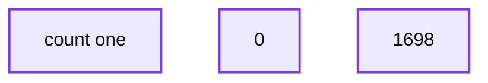
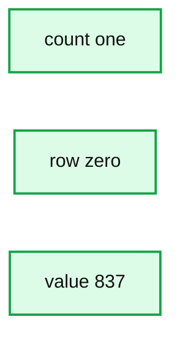
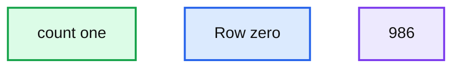
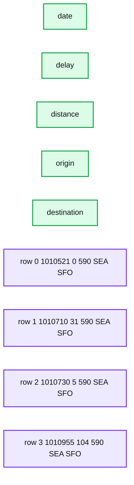
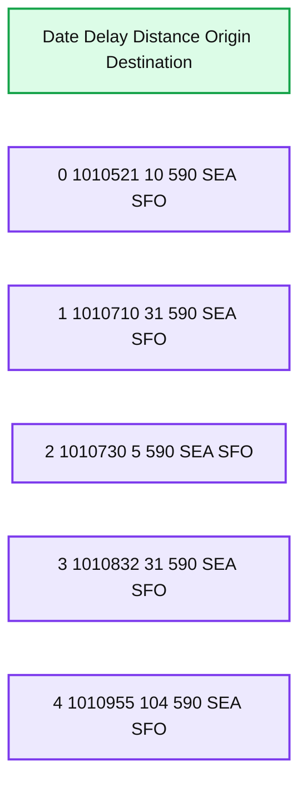

# Simple, Reliable Upserts and Deletes on Delta Lake Tables using Python APIs

*Delta Lake 0.4.0 includes Python APIs and In-place Conversion of Parquet to Delta Lake table*

- Source: https://www.databricks.com/blog/2019/10/03/simple-reliable-upserts-and-deletes-on-delta-lake-tables-using-python-apis.html
- Published: 2019-10-03
- Authors: Tathagata Das, Denny Lee
- Categories: solutions, engineering, open-source
- Images: 6 total, 6 extracted as architecture

We are excited to announce the release of [Delta Lake](http://delta.io) 0.4.0 which introduces Python APIs for manipulating and managing data in Delta tables. The key features in this release are:

- **Python APIs for DML and utility operations** ([#89](https://github.com/delta-io/delta/issues/89)) - You can now use Python APIs to update/delete/merge data in Delta Lake tables and to run utility operations (i.e., vacuum, history) on them. These are great for building complex workloads in Python, e.g., Slowly Changing Dimension (SCD) operations, merging change data for replication, and upserts from streaming queries. See the documentation for more details.
- **Convert-to-Delta** ([#78](https://github.com/delta-io/delta/issues/78)) - You can now convert a Parquet table in place to a Delta Lake table without rewriting any of the data. This is great for converting very large Parquet tables which would be costly to rewrite as a Delta table. Furthermore, this process is reversible - you can convert a Parquet table to Delta Lake table, operate on it (e.g., delete or merge), and easily convert it back to a Parquet table. See the documentation for more details.
- **SQL for utility operations** - You can now use SQL to run utility operations vacuum and history. See the documentation for more details on how to configure Spark to execute these Delta-specific SQL commands.

For more information, please refer to the [Delta Lake 0.4.0 release notes](https://github.com/delta-io/delta/releases/tag/v0.4.0) and Delta Lake Documentation > Table Deletes, Updates, and Merges.

In this blog, we will demonstrate on [Apache Spark™ 2.4.3](https://spark.apache.org/news/spark-2-4-3-released.html) how to use Python and the new Python APIs in Delta Lake 0.4.0 within the context of an on-time flight performance scenario.  We will show how to upsert and delete data, query old versions of data with time travel and vacuum older versions for cleanup.

---

Get an early preview of [O'Reilly's new ebook](https://www.databricks.com/resources/ebook/delta-lake-running-oreilly?itm_data=dltablespythonapis-blog-oreillydlupandrunning) for the step-by-step guidance you need to start using Delta Lake.

## How to start using Delta Lake

The Delta Lake package is available as with the `--packages` option. In our example, we will also demonstrate the ability to VACUUM files and execute Delta Lake SQL commands within Apache Spark.  As this is a short demonstration, we will also enable the following configurations:

- `spark.databricks.delta.retentionDurationCheck.enabled=false` to allow us to vacuum files shorter than the default retention duration of 7 days.  Note, this is only required for the SQL command VACUUM.
- `spark.sql.extensions=io.delta.sql.DeltaSparkSessionExtension` to enable Delta Lake SQL commands within Apache Spark; this is not required for Python or Scala API calls.

## Loading and saving our Delta Lake data

This scenario will be using the On-time flight performance or Departure Delays dataset generated from the RITA BTS Flight Departure Statistics; some examples of this data in action include the 2014 Flight Departure Performance via d3.js Crossfilter and [On-Time Flight Performance with GraphFrames for Apache Spark™](https://www.databricks.com/blog/2016/03/16/on-time-flight-performance-with-graphframes-for-apache-spark.html).  This dataset can be downloaded locally from this [github location](https://github.com/dennyglee/databricks/blob/master/misc/departuredelays.csv.gz).  Within `pyspark`, start by reading the dataset.

Next, let’s save our *departureDelays* dataset to a Delta Lake table.  By saving this table to Delta Lake storage, we will be able to take advantage of its features including ACID transactions, unified batch and streaming, and time travel.

Note, this approach is similar to how you would normally save Parquet data; instead of specifying `format("parquet")`, you will now specify `format("delta")`. If you were to take a look at the underlying file system, you will notice four files created for the *departureDelays* Delta Lake table.

> Note, the _delta_log is the folder that contains the Delta Lake transaction log.  For more information, refer to Diving Into Delta Lake: Unpacking The Transaction Log.

Now, let’s reload the data but this time our DataFrame will be backed by Delta Lake.

**Summary:** Query result showing a count of 1698.

**Components:**

- count one query-result column
- Row index column
- Count value 1698

**Flows:**

- none

**Numbers:** 1, 0, 1698



<sub>source image: https://www.databricks.com/wp-content/uploads/2019/10/delta-lake-0.4.0-initial.png</sub>

Finally, let’s determine the number of flights originating from Seattle to San Francisco; in this dataset, there are 1698 flights.

## In-place Conversion to Delta Lake

If you have existing Parquet tables, you have the ability to perform in-place conversions your tables to Delta Lake thus not needing to rewrite your table. To convert the table, you can run the following commands.

For more information, including how to do this conversion in Scala and SQL, refer to Convert to Delta Lake.

## Delete our Flight Data

To delete data from your traditional Data Lake table, you will need to:

1. Select all of the data from your table not including the rows you want to delete
2. Create a new table based on the previous query
3. Delete the original table
4. Rename the new table to the original table name for downstream dependencies.

Instead of performing all of these steps, with Delta Lake, we can simplify this process by running a DELETE statement.  To show this, let’s delete all of the flights that had arrived early or on-time (i.e. `delay ).`

**Summary:** The query result shows a count of 837 records.

**Components:**

- Count column labeled count(1)
- Row label 0
- Query result value 837

**Flows:**

- none

**Numbers:** 1, 0, 837



<sub>source image: https://www.databricks.com/wp-content/uploads/2019/10/delta-lake-0.4.0-after-delete.png</sub>

After we *delete* (more on this below) all of the on-time and early flights, as you can see from the preceding query there are 837 late flights originating from Seattle to San Francisco.  If you review the file system, you will notice there are more files even though you *deleted* data.

In traditional data lakes, *deletes* are performed by re-writing the entire table excluding the values to be deleted.  With Delta Lake, *deletes* instead are performed by selectively writing new versions of the files containing the data be deleted and only* marks* the previous files as deleted. This is because Delta Lake uses multiversion concurrency control to do atomic operations on the table: for example, while one user is deleting data, another user may be querying the previous version of the table. This multi-version model also enables us to travel back in time (i.e. [time travel](https://www.databricks.com/blog/2019/02/04/introducing-delta-time-travel-for-large-scale-data-lakes.html)) and query previous versions as we will see later.

## Update our Flight Data

To update data from your traditional Data Lake table, you will need to:/p>

1. Select all of the data from your table not including the rows you want to modify
2. Modify the rows that need to be updated/changed
3. Merge these two tables to create a new table
4. Delete the original table
5. Rename the new table to the original table name for downstream dependencies.

Instead of performing all of these steps, with Delta Lake, we can simplify this process by running an UPDATE statement.  To show this, let’s update all of the flights originating from Detroit to Seattle.

**Summary:** The image shows a single-column result table with the count value 986 at row 0.

**Components:**

- count one: result column header
- Row zero: row label
- 986: count value

**Flows:**

- none

**Numbers:** 1, 0, 986



<sub>source image: https://www.databricks.com/wp-content/uploads/2019/10/delta-lake-0.4.0-after-update.png</sub>

With the Detroit flights now tagged as Seattle flights, we now have 986 flights originating from Seattle to San Francisco. If you were to list the file system for your *departureDelays* folder (i.e. `$../departureDelays/ls -l`), you will notice there are now 11 files (instead of the 8 right after deleting the files and the four files after creating the table).

## Merge our Flight Data

A common scenario when working with a data lake is to continuously append data to your table. This often results in duplicate data (rows you do not want inserted into your table again), new rows that need to be inserted, and some rows that need to be updated.  With Delta Lake, all of this can be achieved by using the merge operation (similar to the SQL MERGE statement).

Let’s start with a sample dataset that you will want to be updated, inserted, or deduplicated with the following query.

The output of this query looks like the following table below. Note, the color-coding has been added to this blog to clearly identify which rows are deduplicated (blue), updated (yellow), and inserted (green).

**Summary:** A tabular view of four flight records with date, delay, distance, origin, and destination columns.

**Components:**

- Date column
- Delay column
- Distance column
- Origin column
- Destination column
- Row records 0 through 3

**Flows:**

- None visible

**Numbers:** 0, 1, 2, 3, 1010521, 1010710, 1010730, 1010955, 0, 31, 5, 104, 590



<sub>source image: https://www.databricks.com/wp-content/uploads/2019/10/delta-lake-0.4.0-merge-source-table.png</sub>

Next, let’s generate our own `merge_table` that contains data we will insert, update or de-duplicate with the following code snippet.

**Summary:** A tabular view of flight records with date, delay, distance, origin, and destination fields.

**Components:**

- Date column, technology not specified
- Delay column, technology not specified
- Distance column, technology not specified
- Origin column, technology not specified
- Destination column, technology not specified
- Flight record rows, technology not specified

**Flows:**

- none

**Numbers:** 0, 1, 2, 1010521, 1010710, 1010832, 10, 31, 590

```text
%% mermaid failed to render; kept as text
%% Flight records table with five fields and three rows
flowchart LR
  H1[date] H2[delay] H3[distance] H4[origin] H5[destination]
  R0[0 1010521 10 590 SEA SFO]
  R1[1 1010710 31 590 SEA SFO]
  R2[2 1010832 31 590 SEA SFO]

  classDef client fill:#dbeafe,stroke:#2563eb,stroke-width:2px,color:#111
  classDef service fill:#dcfce7,stroke:#16a34a,stroke-width:2px,color:#111
  classDef store fill:#ede9fe,stroke:#7c3aed,stroke-width:2px,color:#111
  classDef cache fill:#fef3c7,stroke:#d97706,stroke-width:2px,color:#111
  classDef queue fill:#cffafe,stroke:#0891b2,stroke-width:2px,color:#111
  classDef critical fill:#fee2e2,stroke:#dc2626,stroke-width:4px,color:#111
  classDef external fill:#e5e7eb,stroke:#6b7280,stroke-width:2px,color:#111,stroke-dasharray:4 3
  classDef decision fill:#fce7f3,stroke:#db2777,stroke-width:2px,color:#111

  class H1,H2,H3,H4,H5 service
  class R0,R1,R2 store
```

<sub>source image: https://www.databricks.com/wp-content/uploads/2019/10/delta-lake-0.4.0-merge-merge-table.png</sub>

In the preceding table (merge_table), there are three rows that with a unique date value:

1. 1010521: this row needs to *update* the *flights* table with a new delay value (yellow)
2. 1010710: this row is a *duplicate *(blue)
3. 1010822: this is a new row to be *inserted *(green)

With Delta Lake, this can be easily achieved via a *merge* statement as noted in the following code snippet.

All three actions of de-duplication, update, and insert was efficiently completed with one statement.

**Summary:** The image shows a flight records table with five rows and columns for date, delay, distance, origin, and destination.

**Components:**

- Date column
- Delay column
- Distance column
- Origin column
- Destination column
- Flight records table

**Flows:**

- none

**Numbers:** Row indices 0, 1, 2, 3, 4; dates 1010521, 1010710, 1010730, 1010832, 1010955; delays 10, 31, 5, 31, 104; distance 590; origin code SEA; destination code SFO.



<sub>source image: https://www.databricks.com/wp-content/uploads/2019/10/delta-lake-0.4.0-merge-after-merge.png</sub>

## View Table History

As previously noted, after each of our transactions (delete, update), there were more files created within the file system.  This is because for each transaction, there are different versions of the Delta Lake table. This can be seen by using the `DeltaTable.history()` method as noted below.

> Note, you can also perform the same task with SQL:spark.sql("DESCRIBE HISTORY '" + pathToEventsTable + "'").show()

As you can see, there are three rows representing the different versions of the table (below is an abridged version to help make it easier to read) for each of the operations (create table, delete, and update):

| version | timestamp | operation | operationParameters |
|---|---|---|---|
| 2 | 2019-09-29 15:41:22 | UPDATE | [predicate -> (or... |
| 1 | 2019-09-29 15:40:45 | DELETE | [predicate -> ["(... |
| 0 | 2019-09-29 15:40:14 | WRITE | [mode -> Overwrit... |

## Travel Back in Time with Table History

With Time Travel, you can see review the Delta Lake table as of the version or timestamp.   For more information, refer to Delta Lake documentation > [Read older versions of data using Time Travel](https://docs.delta.io/latest/quick-start.html#read-older-versions-of-data-using-time-travel).  To view historical data, specify the `version` or `Timestamp` option; in the code snippet below, we will specify the `version` option

Whether for governance, risk management, and compliance (GRC) or rolling back errors, the Delta Lake table contains both the metadata (e.g. recording the fact that a delete had occurred with these operators) and data (e.g. the actual rows deleted). But how do we remove the data files either for compliance or size reasons?

## Cleanup Old Table Versions with Vacuum

The Delta Lake vacuum method will delete all of the rows (and files) by default that are older than 7 days (reference: Delta Lake Vacuum).   If you were to view the file system, you’ll notice the 11 files for your table.

To delete all of the files so that you only keep the current snapshot of data, you will specify a small value for the vacuum method (instead of the default retention of 7 days).

> Note, you perform the same task via SQL syntax:¸# Remove all files older than 0 hours oldspark.sql("VACUUM '" + pathToEventsTable + "' RETAIN 0 HOURS")

Once the vacuum has completed, when you review the file system you will notice fewer files as the historical data has been removed.

> Note, the ability to time travel back to a version older than the retention period is lost after running vacuum.

## What’s Next

Try out Delta Lake today by trying out the preceding code snippets on your Apache Spark 2.4.3 (or greater) instance. By using Delta Lake, you can make your data lakes more reliable (whether you create a new one or migrate an existing data lake).  To learn more, refer to [https://delta.io/](https://delta.io/) and join the Delta Lake community via [Slack](https://delta-users.slack.com/join/shared_invite/enQtNTY1NDg0ODcxOTI1LWE3YjMxOTM4MmM0YWNhNjE2YmI2OGI4N2Y3MTRhOWQ1YzE3MTMyYTM5YzRiZWZlYzMwYzk0M2JiZmJhY2Q4NWI) and [Google Group](https://groups.google.com/forum/#!forum/delta-users).  You can track all the upcoming releases and planned features in [github milestones](https://github.com/delta-io/delta/milestones).

Coming up, we’re also excited to have [Spark AI Summit Europe](https://www.databricks.com/sparkaisummit/europe) from October 15th to 17th. At the summit, we’ll have a [training session dedicated to Delta Lake](https://www.databricks.com/sparkaisummit/europe#building-data-pipelines).

## Credits

We want to thank the following contributors for updates, doc changes, and contributions in Delta Lake 0.4.0: Andreas Neumann, Burak Yavuz, Jose Torres, Jules Damji, Jungtaek Lim, Liwen Sun, Michael Armbrust, Mukul Murthy, Pranav Anand, Rahul Mahadev, Shixiong Zhu, Tathagata Das, Terry Kim, Wenchen Fan, Wesley Hoffman, Yishuang Lu, Yucai Yu, lys0716.
