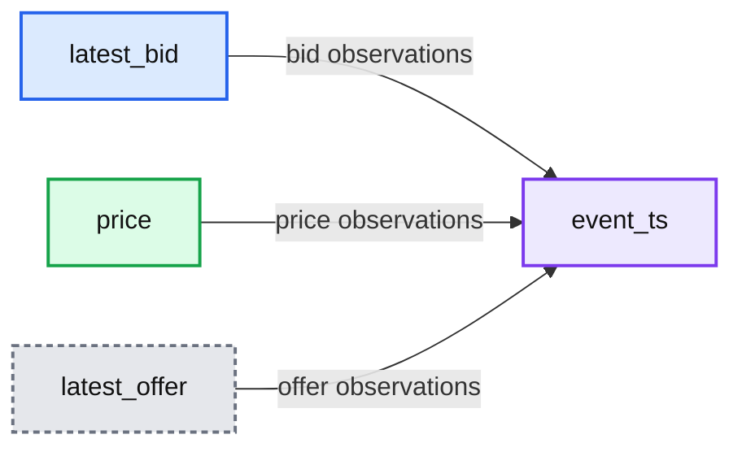
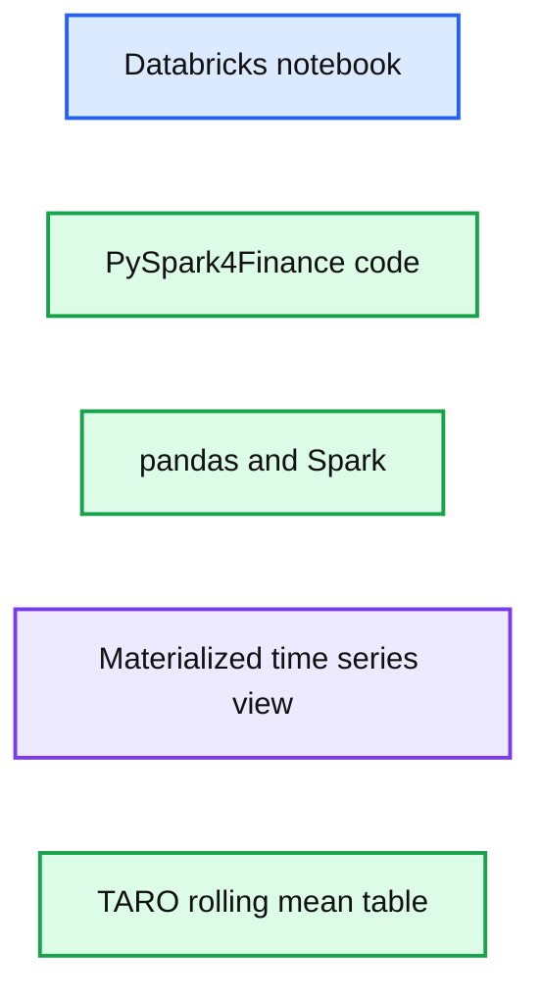
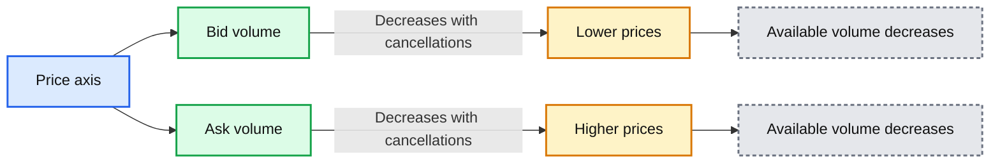
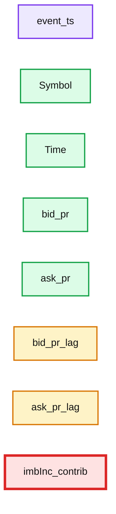
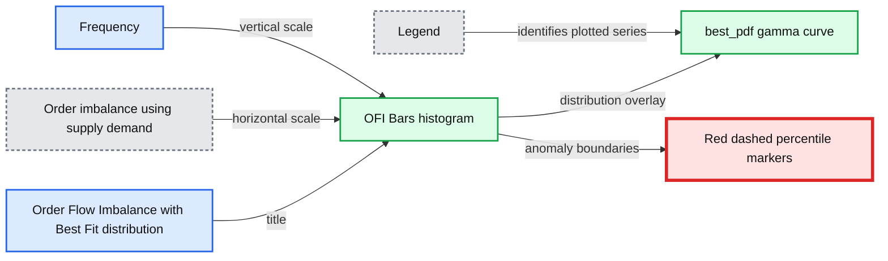
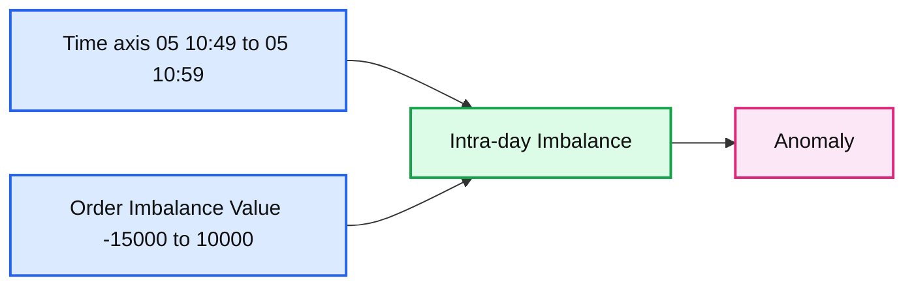
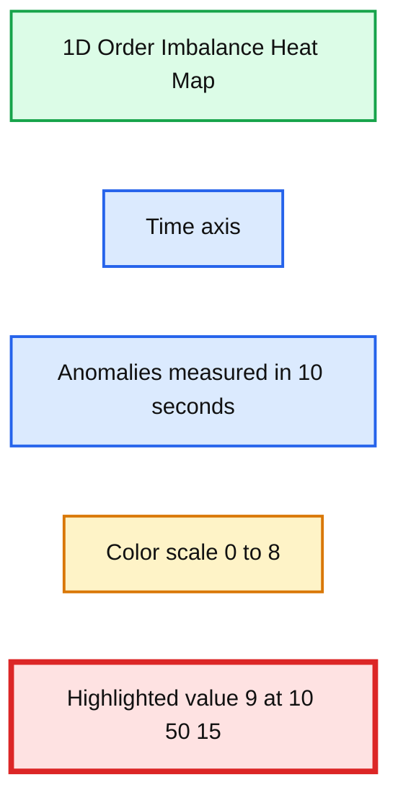

# Democratizing Financial Time Series Analysis with Databricks

- Source: https://www.databricks.com/blog/2019/10/09/democratizing-financial-time-series-analysis-with-databricks.html
- Published: 2019-10-09
- Authors: Ricardo Portilla
- Categories: engineering, open-source, data-science-machine-learning
- Images: 14 total, 10 extracted as architecture

[Try this notebook in Databricks](https://pages.databricks.com/rs/094-YMS-629/images/Democratizing%20Financial%20Time%20Series%20Analysis.html)

## Introduction

The role of data scientists, data engineers, and analysts at financial institutions includes (but is not limited to) protecting *hundreds of* *billions* *of dollars* worth of assets and protecting investors from *trillion-dollar* [impacts](https://en.wikipedia.org/wiki/2010_Flash_Crash), say from a flash crash. One of the biggest technical challenges underlying these problems is scaling time series manipulation.  Tick data, [alternative data](https://www.databricks.com/glossary/alternative-data) sets such as geospatial or transactional data, and fundamental economic data are examples of the rich data sources available to financial institutions, all of which are naturally indexed by timestamp. Solving business problems in finance such as risk, fraud, and compliance ultimately rests on being able to aggregate and analyze thousands of time series in parallel. Older technologies, which are RDBMS-based, do not easily scale when analyzing trading strategies or conducting regulatory analyses over years of historical data. Moreover, many existing time series technologies use specialized languages instead of standard SQL or Python-based APIs.

Fortunately, Apache Spark™ contains plenty of built-in functionality such as windowing which naturally parallelizes time-series operations.  Moreover, Koalas, an open-source project that allows you to execute distributed Machine Learning queries via Apache Spark using the familiar pandas syntax, helps extend this power to data scientists and analysts.

In this blog, we will show how to build time series functions on hundreds of thousands of tickers in parallel. Next, we demonstrate how to modularize functions in a local IDE and create rich time-series feature sets with Databricks Connect. Lastly, if you are a pandas user looking to scale data preparation which feeds into financial anomaly detection or other statistical analyses, we use a market manipulation example to show how Koalas makes scaling transparent to the typical data science workflow.

## Set-Up Time Series Data Sources

Let’s begin by ingesting a couple of traditional financial time series datasets: trades and quotes. We have simulated the datasets for this blog, which are modeled on data received from a trade reporting facility (trades) and the National Best Bid Offer (NBBO) feed (from an exchange such as the NYSE). You can find some example data here: [https://www.tickdata.com/product/nbbo/](https://www.tickdata.com/product/nbbo/).

This article generally assumes basic financial terms; for more extensive references, see Investopedia’s [documentation](https://www.investopedia.com/). What is notable from the datasets below is that we’ve assigned the `TimestampType` to each timestamp, so the trade execution time and quote change time have been renamed to `event_ts` for normalization purposes. In addition, as shown in the full notebook attached in this article, we ultimately convert these datasets to Delta format so that we [ensure data quality](https://www.databricks.com/product/delta-lake-on-databricks) and keep a columnar format, which is most efficient for the type of interactive queries we have below.

## Merging and Aggregating Time Series with Apache Spark™

There are over six hundred thousand publicly traded securities globally today in financial markets. Given our trade and quote datasets span this volume of securities, we’ll need a tool that scales easily.  Because Apache Spark™ offers a simple API for ETL and it is the standard engine for parallelization, it is our go-to tool for merging and aggregating standard metrics which in turn help us understand liquidity, risk, and fraud. We’ll start with the merging of trades and quotes, then aggregate the trades dataset to show simple ways to slice the data. Lastly, we’ll show how to package this code up into classes for faster iterative development with Databricks Connect. The full code used for the metrics below is in the attached notebook.

### AS-OF Joins

An as-of join is a commonly used ‘merge’ technique that returns the latest right value effective at the time of the left timestamp. For most time-series analyses, multiple types of time series are joined together on the symbol to understand the state of one time series (e.g. NBBO) at a particular time present in another time series (e.g. trades). The example below records the state of the NBBO for every trade for all symbols. As seen in the figure below, we have started off with an initial base time series (trades) and merged the NBBO dataset so that each timestamp has the latest bid and offer recorded ‘as of the time of the trade.’ Once we know the latest bid and offer, we can compute the difference (known as the spread) to understand at what points the liquidity may have been lower (indicated by a large spread). This kind of metric impacts how you may organize your trading strategy to boost your *alpha*.

First, let’s use the built-in windowing function **last** to find the last non-null quote value after ordering by time.

Now, we’ll call our custom join to merge our data and attach our quotes. See attached notebook for full code.

 

**Summary:** The chart shows time-series quote data for latest bid, price, and latest offer plotted against event time.

**Components:**

- `latest_bid` series, shown in blue
- `price` series, shown in green
- `latest_offer` series, shown in orange
- `event_ts` time axis

**Flows:**

- `latest_bid` -> `event_ts`: plotted bid observations over time
- `price` -> `event_ts`: plotted price observations over time
- `latest_offer` -> `event_ts`: plotted offer observations over time

**Numbers:** 350; 2017-08-31T06:29:58.000+0000; 2017-08-31T08:38:22.000+0000; 2017-08-31T10:52:36.000+0000; 2017-08-31T13:42:17.000+0000

source image: https://www.databricks.com/wp-content/uploads/2019/10/Pic4-ASOF-Visual.png

### Marking VWAP Against Trade Patterns

We’ve shown a merging technique above, so now let’s focus on a standard aggregation, namely Volume-Weighted Average Price (VWAP), which is the average price weighted by volume. This metric is an indicator of the trend and value of the security throughout the day.  The `vwap` function within our wrapper class (in the attached notebook) shows where the VWAP falls above or below the trading price of the security. In particular, we can now identify the window during which the VWAP (in orange) falls below the trade price, showing that the stock is overbought.

**Summary:** Line chart comparing VWAP and maximum price across seven trading-time groups.

**Components:**

- `time_group` x-axis with seven timestamps
- `vwap` orange series
- `max_price` blue series
- `vwap, max_price` y-axis

**Flows:**

- 10:00 -> 10:52: `max_price` trend
- 10:52 -> 12:47: `max_price` rises
- 12:47 -> 13:17: `vwap` falls and `max_price` slightly falls
- 13:17 -> 13:42: `vwap` rises and `max_price` rises
- 13:42 -> 14:53: `max_price` sharply falls
- 14:53 -> 15:14: `max_price` rises

**Numbers:** 350; 10:00; 10:52; 12:47; 13:17; 13:42; 14:53; 15:14

```mermaid
%% Comparison of VWAP and maximum price across trading-time groups
flowchart LR
    A[10:00] -->|max_price| B[10:52]
    B -->|max_price rises| C[12:47]
    C -->|vwap falls, max_price slightly falls| D[13:17]
    D -->|vwap rises, max_price rises| E[13:42]
    E -->|max_price sharply falls| F[14:53]
    F -->|max_price rises| G[15:14]

    classDef client fill:#dbeafe,stroke:#2563eb,stroke-width:2px,color:#111
    classDef service fill:#dcfce7,stroke:#16a34a,stroke-width:2px,color:#111
    classDef store fill:#ede9fe,stroke:#7c3aed,stroke-width:2px,color:#111
    classDef cache fill:#fef3c7,stroke:#d97706,stroke-width:2px,color:#111
    classDef queue fill:#cffafe,stroke:#0891b2,stroke-width:2px,color:#111
    classDef critical fill:#fee2e2,stroke:#dc2626,stroke-width:4px,color:#111
    classDef external fill:#e5e7eb,stroke:#6b7280,stroke-width:2px,color:#111,stroke-dasharray:4 3
    classDef decision fill:#fce7f3,stroke:#db2777,stroke-width:2px,color:#111

    class A,B,C,D,E,F,G service
```

source image: https://www.databricks.com/wp-content/uploads/2019/10/Pic5-VWAP-Visual.png

### Faster Iterative Development with Databricks Connect

Up to this point, we’ve created some basic wrappers for one-off time-series metrics. However, productionalization of code requires modularization and testing, and this is best accomplished in an IDE. This year, we introduced [Databricks Connect](https://pypi.org/project/databricks-connect/), which gives the ability for local IDE development and enhances the experience with testing against a live Databricks cluster.  The benefits of Databricks Connect for financial analyses include the ability to add time-series features on small test data with the added flexibility to execute interactive Spark queries against years of historical tick data to validate features.

We use [PyCharm](https://www.jetbrains.com/pycharm/) to organize classes needed for wrapping PySpark functionality for generating a rich time series feature set. This IDE gives us code completion, formatting standards, and an environment to quickly test classes and methods before running code.

https://www.youtube.com/watch?v=MkYAbqGDKA0

We can quickly debug classes then run Spark code directly from our laptop using a Jupyter notebook which loads our local classes and executes interactive queries with scalable infrastructure. The console pane shows our jobs being executed against a live cluster.

**Summary:** A Databricks notebook displays a pandas DataFrame containing price data and lagged rolling mean windows for symbol TARO.

**Components:**

- Databricks notebook
- PySpark4Finance code
- pandas
- Spark configuration
- Materialized time-series view
- TARO price DataFrame
- Rolling mean price columns

**Flows:**

- none

**Numbers:** 1, 5, 10, 20, 60, 45, 5, 0, 1, 2, 3, 4, 2017-08-30, 20:00:46, 20:19:48, 20:37:06, 20:42:52, 20:47:12, 31, 346.499931, 1504137646, 348.398047, 1504138788, 347.448989, 346.411332, 1504139826, 347.404689, 349.811785, 1504140172, 348.111559, 347.540960, 1504140432, 348.676373, 347.921359, lag_60, lag_300, lag_600, lag_1200

source image: https://www.databricks.com/wp-content/uploads/2019/10/DBConnect-Pic2.png

Lastly, we get the best of both worlds by using our local IDE and at the same time appending to our materialized time-series view on our largest time-series dataset.

## Leveraging Koalas for Market Manipulation

The pandas API is the standard tool for data manipulation and analysis in Python and is deeply integrated into the Python data science ecosystem, e.g. NumPy, SciPy, matplotlib. One drawback of pandas is that it does not scale easily to large amounts of data.  Financial data always includes years of historical data, which is critical for risk aggregation or compliance analysis. To make this easier, we introduced Koalas as a way to leverage pandas APIs while executing Spark on the backend. Since the Koalas API matches Pandas, we don’t sacrifice ease of use, and migration to scalable code is a **one-line code change** (see import of Koalas in the next section). Before we showcase Koalas’ fit for financial time series problems, let’s start with some context on a specific problem in financial fraud: front running.

Front running occurs when the following sequence occurs:

1. A trading firm is aware of non-public information which may affect the price of a security
2. The firm buys a large bulk order (or large set of orders totaling a large aggregate volume)
3. Due to the removal of liquidity, the security price rises
4. The firm sells the security to investors (which has been driven upward from the previous purchase) and makes a large profit, forcing investors to pay a larger price even though the information upon which the security was traded was non-public

Source: CC0 Public domain images: https://pxhere.com/en/photo/1531985, https://pxhere.com/en/photo/847099

For illustration purposes, a simple example using farmer’s markets and an apple pie business is found [here](https://www.youtube.com/watch?v=BXiFKCjc6Rw). This example shows Freddy, a runner who is aware of the imminent demand for apples needed for apple pie businesses across the country and subsequently purchases apples at all farmer’s markets. This, in effect, allows Freddy to sell his apples at a premium to buyers since Freddy caused a major impact by purchasing before any other buyers (representing investors) had a chance to buy the product.

Detection of front running requires an understanding of order flow imbalances (see diagram below). In particular, anomalies in order flow imbalance will help identify windows during which front running may be occurring.

**Summary:** The diagram shows order flow imbalance, with bid and ask volumes decreasing at price points due to cancellations.

**Components:**

- Bid side: teal bars representing buy-side volume.
- Ask side: red bars representing sell-side volume.
- Price axis: horizontal axis separating bid and ask prices.
- Available volume annotations: explanatory labels for cancellation-driven volume decreases.

**Flows:**

- Bid -> Lower prices: available volume decreases with cancellations.
- Ask -> Higher prices: available volume decreases with cancellations.

**Numbers:** none

source image: https://www.databricks.com/wp-content/uploads/2019/10/Custom-Order-Flow-Imbalance-image.png

Let’s now use the `koalas` package to improve our productivity while solving the market manipulation problem. Namely, we’ll focus on the following to find order flow imbalance anomalies:

- De-duplication of events at the same time
- Lag windows for assessing supply/demand increases
- Merging of data frames to aggregate order flow imbalances

### De-duplication of Time Series

Common time series data cleansing involves imputation and de-duplication. You may find duplicate values in high-frequency data (such as quote data). When there are multiple values per time with no sequence number, we need to deduplicate so subsequent statistical analysis makes sense.  In the case below, multiple bid/ask shares quantities are reported per time, so for computation of order imbalance, we want to rely on one value for maximum depth per time.

 

**Summary:** A tabular view of high frequency ITUB quote data read from Delta, showing bid and ask prices, quantities, and event timestamps.

**Components:**

- Delta data table using financial quote records
- Symbol field containing ITUB
- Date and time fields
- Bid price and ask price fields
- Bid shares quantity and ask shares quantity fields
- Event timestamp field

**Flows:**

- none

**Numbers:**

- Row IDs: 39757, 39758, 39759, 39760, 39761
- Symbol: ITUB
- Dates: 03/05/2014 and 2014-03-05
- Times: 09:30:00.011, 09:30:00.052, 09:30:00.235, 09:30:00.236, 09:30:00.237
- Bid prices: 13.14, 13.15, 13.15, 13.16, 13.16
- Ask prices: 13.23, 13.23, 13.22, 13.22, 13.21
- Bid share quantities: 700.0, 700.0, 700.0, 100.0, 100.0
- Ask share quantities: 200.0, 200.0, 100.0, 100.0, 700.0
- Event timestamps: 2014-03-05 09:30:00.011, 2014-03-05 09:30:00.052, 2014-03-05 09:30:00.235, 2014-03-05 09:30:00.236, 2014-03-05 09:30:00.237

```mermaid
%% This shows a Delta financial quote data table and its visible fields
flowchart LR
    A[Delta quote data table]

    classDef client   fill:#dbeafe,stroke:#2563eb,stroke-width:2px,color:#111
    classDef service  fill:#dcfce7,stroke:#16a34a,stroke-width:2px,color:#111
    classDef store    fill:#ede9fe,stroke:#7c3aed,stroke-width:2px,color:#111
    classDef cache    fill:#fef3c7,stroke:#d97706,stroke-width:2px,color:#111
    classDef queue    fill:#cffafe,stroke:#0891b2,stroke-width:2px,color:#111
    classDef critical fill:#fee2e2,stroke:#dc2626,stroke-width:4px,color:#111
    classDef external fill:#e5e7eb,stroke:#6b7280,stroke-width:2px,color:#111,stroke-dasharray:4 3
    classDef decision fill:#fce7f3,stroke:#db2777,stroke-width:2px,color:#111

    class A store
```

source image: https://www.databricks.com/wp-content/uploads/2019/10/Read-in-Delta-Data.png

### Time Series Windowing with Koalas

We’ve deduplicated our time series, so now we let’s look at windows so we can find supply and demand. Windowing for time series generally refers to looking at slices or intervals of time. Most trend calculations (simple moving average, for example) all use the concept of time windows to perform calculations. Koalas inherits the simple pandas interface for getting lag or lead values within a window using `shift` (analogous to Spark’s lag function), as demonstrated below.

**Summary:** A tabular time-series quote dataset showing event timestamps, identifiers, quote prices, and bid/ask share quantities.

**Components:**

- event_ts: event timestamp index, technology not shown
- Symbol: instrument identifier, technology not shown
- Date: quote date, technology not shown
- Time: quote time, technology not shown
- bid_pr: bid price, technology not shown
- ask_pr: ask price, technology not shown
- bid_shrs_qt: bid share quantity, technology not shown
- ask_shrs_qt: ask share quantity, technology not shown

**Flows:**

- none

**Numbers:** 2014-03-05, 09:30:00.011, 09:30:00.052, 09:30:00.235, 09:30:00.236, 09:30:00.237, 0, 03/05/2014, 13.14, 13.23, 700.0, 200.0, 13.15, 13.22, 100.0, 13.16

```mermaid
%% Shows a time series quote table with prices and share quantities
flowchart LR
  A[event_ts] --> B[Symbol]
  B --> C[Date]
  C --> D[Time]
  D --> E[bid_pr]
  E --> F[ask_pr]
  F --> G[bid_shrs_qt]
  G --> H[ask_shrs_qt]

  classDef client fill:#dbeafe,stroke:#2563eb,stroke-width:2px,color:#111
  classDef service fill:#dcfce7,stroke:#16a34a,stroke-width:2px,color:#111
  classDef store fill:#ede9fe,stroke:#7c3aed,stroke-width:2px,color:#111
  classDef cache fill:#fef3c7,stroke:#d97706,stroke-width:2px,color:#111
  classDef queue fill:#cffafe,stroke:#0891b2,stroke-width:2px,color:#111
  classDef critical fill:#fee2e2,stroke:#dc2626,stroke-width:4px,color:#111
  classDef external fill:#e5e7eb,stroke:#6b7280,stroke-width:2px,color:#111,stroke-dasharray:4 3
  classDef decision fill:#fce7f3,stroke:#db2777,stroke-width:2px,color:#111

  class A,B,C,D,E,F,G,H store
```

source image: https://www.databricks.com/wp-content/uploads/2019/10/Koalas-Pic2-Grouped-Data.png

### Merge on Timestamp and Compute Imbalance with Koalas Column Arithmetic

Now that we have lag values computed, we want to be able to merge this dataset with our original time series of quotes. Below, we employ the Koalas `merge` to accomplish this with our time index. This gives us the consolidated view we need for supply/demand computations which lead to our order imbalance metric.

**Summary:** A tabular time series showing ITUB quote data, lagged bid and ask prices, and imbalance contribution by event timestamp.

**Components:**

- event_ts: event timestamp index
- Symbol: ticker identifier
- Time: quote time
- bid_pr: current bid price
- ask_pr: current ask price
- bid_pr_lag: lagged bid price
- ask_pr_lag: lagged ask price
- imbInc_contrib: imbalance contribution

**Flows:**

- none

**Numbers:**

- Dates: 2014-03-05
- Times: 09:30:00.011, 09:30:00.052, 09:30:00.235, 09:30:00.236, 09:30:00.237
- Symbol: ITUB
- Bid prices: 13.14, 13.15, 13.15, 13.16, 13.16
- Ask prices: 13.23, 13.23, 13.22, 13.22, 13.21
- Lagged bid prices: 0, 13.14, 13.15, 13.15, 13.16
- Lagged ask prices: 0, 13.23, 13.23, 13.22, 13.22
- Imbalance contributions: 500.0, 0.0, 100.0, -600.0, -600.0

source image: https://www.databricks.com/wp-content/uploads/2019/10/Koalas-Pic3-supply-and-demand-compute.png

### Koalas to NumPy for Fitting Distributions

After our initial prep, it’s time to convert our Koalas data frame to a format useful for statistical analysis. For this problem, we might aggregate our imbalances down to the minute or other unit of time before proceeding, but for purposes of illustration, we’ll run against the full dataset for our ticker ‘ITUB’. Below, we convert our Koalas structure to a NumPy dataset so we can use the SciPy library for detecting anomalies in order flow imbalance. Simply use the to_numpy() syntax to bridge this analysis.

Below, we plotted the distribution of our order flow imbalances along with markers for the 5th and 95th percentiles to identify the events during which imbalance anomalies occurred. See the full notebook for the code to fit distributions and create this plot. The time during imbalances we just computed with our koalas/SciPy workflow will correlate with potential instances of front running, the market manipulation scheme we were searching for.

**Summary:** The chart shows an order flow imbalance histogram with a best-fit gamma probability density and red percentile markers.

**Components:**

- OFI Bars histogram
- best_pdf gamma probability density curve
- Red dashed percentile markers
- Order imbalance using supply demand x axis
- Frequency y axis

**Flows:**

- none

**Numbers:**

- Gamma parameter a = 0.68
- loc = -0.00
- scale = 1088.80
- X axis range = -4000 to 4000
- X axis ticks = -4000, -3000, -2000, -1000, 0, 1000, 2000, 3000, 4000
- Y axis ticks = 0.0000, 0.0002, 0.0004, 0.0006, 0.0008, 0.0010, 0.0012, 0.0014
- Two red dashed percentile markers

source image: https://www.databricks.com/wp-content/uploads/2019/10/anomaly-detection-hist.png

The time series visualization below pinpoints the anomalies retrieved as outliers above, highlighted in orange. In our final visualization, we use the `plotly` library to summarize time windows and frequency of anomalies in the form of a heat map. Specifically, we identify the ***10:50:10 - 10:50:20*** timeframe as a potential problem area from the front running perspective.

**Summary:** Time-series plot of intra-day order imbalance values, with anomalous observations highlighted in orange.

**Components:**

- Intra-day Imbalance plotted as a blue time-series line with markers
- Anomaly observations highlighted as orange markers
- Time axis spanning 05 10:49 through 05 10:59
- Order Imbalance Value axis ranging from -15000 to 10000

**Flows:**

- Intra-day Imbalance -> Time axis: values plotted over time
- Intra-day Imbalance -> Anomaly: outlier observations highlighted

**Numbers:** 05 10:49, 05 10:50, 05 10:51, 05 10:52, 05 10:53, 05 10:54, 05 10:55, 05 10:56, 05 10:57, 05 10:58, 05 10:59, -15000, -10000, -5000, 0, 5000, 10000

source image: https://www.databricks.com/wp-content/uploads/2019/10/time-series-anomalies.png

**Summary:** A Plotly heat map highlights one-dimensional order-imbalance anomalies over time, with anomaly intensity encoded by color.

**Components:**

- 1D Order Imbalance Heat Map using Plotly
- Anomalies measured in 10-second intervals
- Time axis from Mar 15, 2014, 10:49:00 through 10:59:00
- Color scale ranging from 0 to 8
- Highlighted anomaly value 9 at 10:50:15

**Flows:**

- none

**Numbers:**

1D, 10s, Mar 15, 2014, 10:49:00, 10:49:15, 10:49:30, 10:49:45, 10:50:00, 10:50:10, 10:50:15, 10:50:20, 10:50:30, 10:50:45, 10:51:00, 10:51:15, 10:51:30, 10:51:45, 10:52:00, 10:52:15, 10:52:30, 10:52:45, 10:53:00, 10:53:15, 10:53:30, 10:53:45, 10:54:00, 10:54:15, 10:54:30, 10:54:45, 10:55:00, 10:55:15, 10:55:30, 10:55:45, 10:56:00, 10:56:15, 10:56:30, 10:56:45, 10:57:00, 10:57:15, 10:57:30, 10:57:45, 10:58:00, 10:58:15, 10:58:30, 10:58:45, 10:59:00, color values 0 through 8, Z value 9

source image: https://www.databricks.com/wp-content/uploads/2019/10/time-series-heat-map.png

## Conclusion

In this article, we’ve shown how Apache Spark and Databricks can be leveraged for time series analysis both directly, by using windowing and wrappers, and indirectly, by using Koalas. Most data scientists rely on the pandas API, so Koalas helps them use pandas functionality while allowing the scale of Apache Spark. The advantages of using Spark and Koalas for time series analyses include:

- Parallelize analyses of your time series for risk, fraud, or compliance use cases with as-of joins and simple aggregations
- Iterate faster and create rich time series features with Databricks Connect
- Arm your data science and quant teams with Koalas to scale out data preparation while not sacrificing pandas ease of use and APIs

Try this [notebook](https://pages.databricks.com/rs/094-YMS-629/images/Democratizing%20Financial%20Time%20Series%20Analysis.html) on Databricks today! Contact us to learn more about how we assist customers with financial time series use cases.
