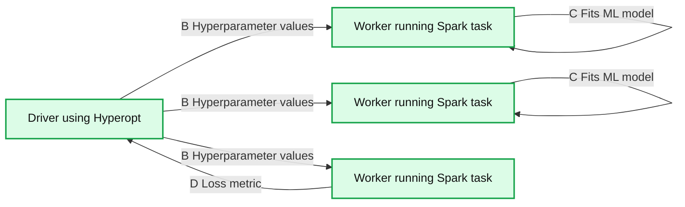
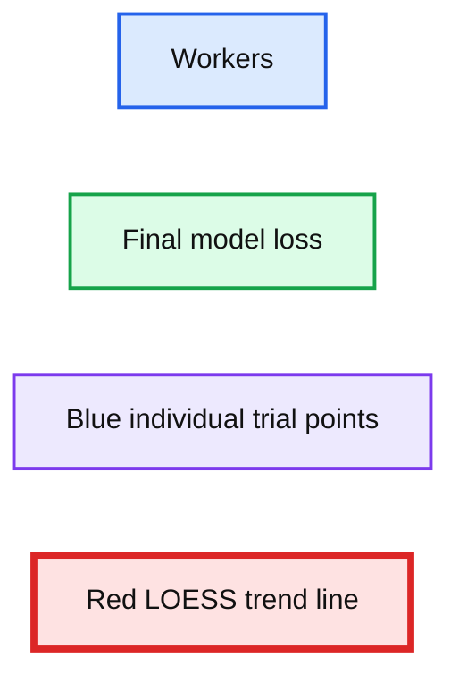

# Scaling Hyperopt to Tune Machine Learning Models in Python

- Source: https://www.databricks.com/blog/2019/10/29/scaling-hyperopt-to-tune-machine-learning-models-in-python.html
- Published: 2019-10-29
- Authors: Joseph Bradley, Max Pumperla
- Categories: solutions, engineering, open-source, data-science-machine-learning
- Images: 4 total, 4 extracted as architecture

>  [Try the Hyperopt notebook](https://docs.microsoft.com/en-us/azure/databricks/applications/machine-learning/automl-hyperparam-tuning/#hyperopt-overview) to reproduce the steps outlined below and [watch our on-demand webinar](https://www.databricks.com/blog/2019/07/18/automated-hyperparameter-tuning-scaling-and-tracking-on-demand-webinar-and-faqs-now-available.html) to learn more.

[Hyperopt](https://github.com/hyperopt/hyperopt)is one of the most popular open-source libraries for tuning Machine Learning models in Python.  We’re excited to announce that Hyperopt 0.2.1 supports distributed tuning via [Apache Spark.](https://www.databricks.com/spark/about)  The new SparkTrials class allows you to scale out hyperparameter tuning across a Spark cluster, leading to faster tuning and better models. SparkTrials was contributed by Joseph Bradley, Hanyu Cui, Lu Wang, Weichen Xu, and Liang Zhang (Databricks), in collaboration with Max Pumperla (Konduit).

## What is Hyperopt?

Hyperopt is an open-source hyperparameter tuning library written for [Python](https://www.python.org/).  With 445,000+ PyPI downloads each month and 3800+ stars on Github as of October 2019, it has strong adoption and community support.  For Data Scientists, Hyperopt provides a general API for searching over hyperparameters and model types. Hyperopt offers two tuning algorithms: Random Search and the Bayesian method Tree of Parzen Estimators.

For developers, Hyperopt provides pluggable APIs for its algorithms and compute backends.  We took advantage of this pluggability to write a new compute backend powered by Apache Spark.

## Scaling out Hyperopt with Spark

With the new class SparkTrials, you can tell Hyperopt to distribute a tuning job across a Spark cluster.  Initially developed within Databricks, this [API for hyperparameter tuning](https://www.databricks.com/blog/2019/07/18/automated-hyperparameter-tuning-scaling-and-tracking-on-demand-webinar-and-faqs-now-available.html) has enabled many Databricks customers to distribute computationally complex tuning jobs, and it has now been contributed to the open-source Hyperopt project, available in the latest release.

Hyperparameter tuning and model selection often involve training hundreds or thousands of models.  SparkTrials runs batches of these training tasks in parallel, one on each Spark executor, allowing massive scale-out for tuning.  To use SparkTrials with Hyperopt, simply pass the SparkTrials object to Hyperopt’s fmin() function:

For a full example with code, check out the [Hyperopt documentation on SparkTrials](http://hyperopt.github.io/hyperopt/scaleout/spark/).

Under the hood, fmin() will generate new hyperparameter settings to test and pass them toSparkTrials.  The diagram below shows how SparkTrials runs these tasks asynchronously on a cluster: (A) Hyperopt’s primary logic runs on the Spark driver, computing new hyperparameter settings.  (B) When a worker is ready for a new task, Hyperopt kicks off a single-task Spark job for that hyperparameter setting. (C) Within that task, which runs on one Spark executor, user code will be executed to train and evaluate a new ML model.  (D) When done, the Spark task will return the results, including the loss, to the driver. These new results are used by Hyperopt to compute better hyperparameter settings for future tasks.

**Summary:** Hyperopt coordinates a driver and Spark workers to test hyperparameters, fit models, and return loss metrics.

**Components:**

- Driver: Hyperopt coordinator
- Worker: Spark executor running model training

**Flows:**

- Driver -> Worker: Hyperparameter values sent to worker
- Worker -> Driver: Loss metric returned to driver
- Worker: Fits the ML model using hyperparameters
- Driver: Computes new hyperparameters to test

**Numbers:** none

source image: https://www.databricks.com/wp-content/uploads/2019/10/hyperopt_parameters_testing_using_spark_trials.png

Since SparkTrials fits and evaluates each model on one Spark worker, it is limited to tuning single-machine ML models and workflows, such as scikit-learn or single-machine TensorFlow.  For distributed ML algorithms such as Apache Spark MLlib or Horovod, you can use Hyperopt’s default Trials class.

## Using SparkTrials in practice

SparkTrials takes 2 key parameters: parallelism (Maximum number of parallel trials to run, defaulting to the number of Spark executors) and timeout (Maximum time in seconds which fmin is allowed to take, defaulting to None).  Timeout provides a budgeting mechanism, allowing a cap on how long tuning can take.

The parallelism parameter can be set in conjunction with the max_evals parameter for fmin() using the guideline described in the following diagram.  Hyperopt will test max_evals total settings for your hyperparameters, in batches of size parallelism. If parallelism = max_evals, then Hyperopt will do Random Search: it will select all hyperparameter settings to test independently and then evaluate them in parallel.  If parallelism = 1, then Hyperopt can make full use of adaptive algorithms like Tree of Parzen Estimators which iteratively explore the hyperparameter space: each new hyperparameter setting tested will be chosen based on previous results. Setting parallelism in between 1 and max_evals allows you to trade off scalability (getting results faster) and adaptiveness (sometimes getting better models).  Good choices tend to be in the middle, such as sqrt(max_evals).

**Summary:** The chart shows the tradeoff in setting parallelism for SparkTrials, from smaller to larger parallelism.

**Components:**

- Smaller parallelism: more adaptive but less scalable
- Parallelism for SparkTrials: the tunable range
- Larger parallelism: more scalable but less adaptive

**Flows:**

- Smaller parallelism -> Larger parallelism: Increasing parallelism trades adaptiveness for scalability

**Numbers:** none

source image: https://www.databricks.com/wp-content/uploads/2019/10/setting_parallelism.png

To illustrate the benefits of tuning, we ran Hyperopt with SparkTrials on the MNIST dataset using the PyTorch workflow from our recent [webinar](https://www.databricks.com/blog/2019/07/18/automated-hyperparameter-tuning-scaling-and-tracking-on-demand-webinar-and-faqs-now-available.html).  Our workflow trained a basic Deep Learning model to predict handwritten digits, and we tuned 3 parameters: batch size, learning rate, and momentum.  This was run on a Databricks cluster on AWS with p2.xlarge workers and Databricks Runtime 5.5 ML.

In the plot below, we fixed max_evals to 128 and varied the number of workers.  As expected, more workers (greater parallelism) allow faster runtimes, with linear scale-out.

**Summary:** The chart shows Hyperopt running time decreasing as the number of workers increases.

**Components:**

- Workers: parallelism levels from 2 to 16 workers
- Running time: execution duration measured in minutes

**Flows:**

- 2 workers -> 4 workers: running time decreases from about 25 to 10 minutes
- 4 workers -> 8 workers: running time decreases to about 5 minutes
- 8 workers -> 16 workers: running time decreases to about 3 minutes

**Numbers:** 2, 4, 6, 8, 10, 12, 14, 16 workers; 10, 20, 30 minutes; approximately 3, 5, 10, 25, and 38 minutes

source image: https://www.databricks.com/wp-content/uploads/2019/10/plotting_greater_parallelism.png

We then fixed the timeout at 4 minutes and varied the number of workers, repeating this experiment for several trials.  The plot below shows the loss (negative log likelihood, where “180m” = “0.180”) vs. the number of workers; the blue points are individual trials, and the red line is a LOESS curve showing the trend.  In general, model performance improves as we use greater parallelism since that allows us to test more hyperparameter settings. Notice that behavior varies across trials since Hyperopt uses randomization in its search.

**Summary:** The chart shows final model loss generally decreasing as the number of workers increases, based on individual trials and a LOESS trend.

**Components:**

- Workers axis
- Final model loss axis
- Blue individual trial points
- Red LOESS trend line

**Flows:**

- none

**Numbers:**

- 180m
- 160m
- 140m
- 120m
- 100m
- 80.0m
- 60.0m
- 40.0m
- 20.0m
- 0.00
- 5.00
- 10.0
- 15.0

source image: https://www.databricks.com/wp-content/uploads/2019/10/improved_model_performance.png

## Getting started with Hyperopt 0.2.1

SparkTrials is available now within Hyperopt 0.2.1 (available on the [PyPi project page](https://pypi.org/project/hyperopt/)) and in the [Databricks Runtime for Machine Learning (5.4 and later)](https://www.databricks.com/product/machine-learning-runtime).

To learn more about Hyperopt and see examples and demos, check out:

- Documentation on the [project Github.io page](http://hyperopt.github.io/hyperopt/scaleout/spark/), including a full code example

- Example notebooks in the Databricks Documentation for [AWS](https://docs.databricks.com/applications/machine-learning/automl-hyperparam-tuning/index.html) and [Azure](https://docs.microsoft.com/en-us/azure/databricks/applications/machine-learning/automl-hyperparam-tuning/#hyperopt-overview)

Hyperopt can also combine with [MLflow for tracking experimentals and models](https://www.databricks.com/product/managed-mlflow).  Learn more about this integration in the [open-source MLflow example](https://github.com/mlflow/mlflow/blob/51aa7165a6dea156b66c9bdfeb6bfda9e6d1e9d2/examples/hyperparam/search_hyperopt.py) and in our [Hyperparameter Tuning blog post](https://www.databricks.com/blog/2019/06/07/hyperparameter-tuning-with-mlflow-apache-spark-mllib-and-hyperopt.html) and [webinar](https://www.databricks.com/blog/2019/07/18/automated-hyperparameter-tuning-scaling-and-tracking-on-demand-webinar-and-faqs-now-available.html).

You can get involved via the Github project page:

- Report open-source issues on the [Github Issues page](https://github.com/hyperopt/hyperopt/issues)
- Contribute to Hyperopt on [Github](https://github.com/hyperopt/hyperopt)

## Related Resources

- [https://pypi.org/project/hyperopt/](https://pypi.org/project/hyperopt/)
- [http://hyperopt.github.io/hyperopt/scaleout/spark/](http://hyperopt.github.io/hyperopt/scaleout/spark/)
- [https://www.databricks.com/product/managed-mlflow](https://www.databricks.com/product/managed-mlflow)
- [https://www.databricks.com/blog/2019/06/07/hyperparameter-tuning-with-mlflow-apache-spark-mllib-and-hyperopt.html](https://www.databricks.com/blog/2019/06/07/hyperparameter-tuning-with-mlflow-apache-spark-mllib-and-hyperopt.html)
