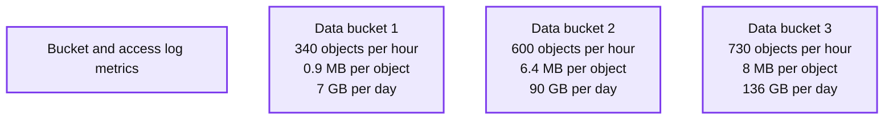
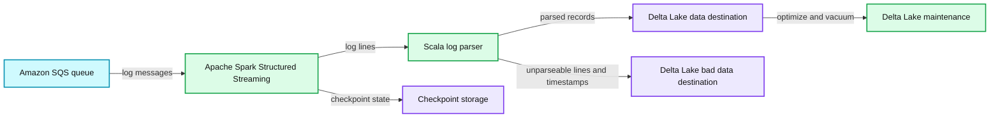
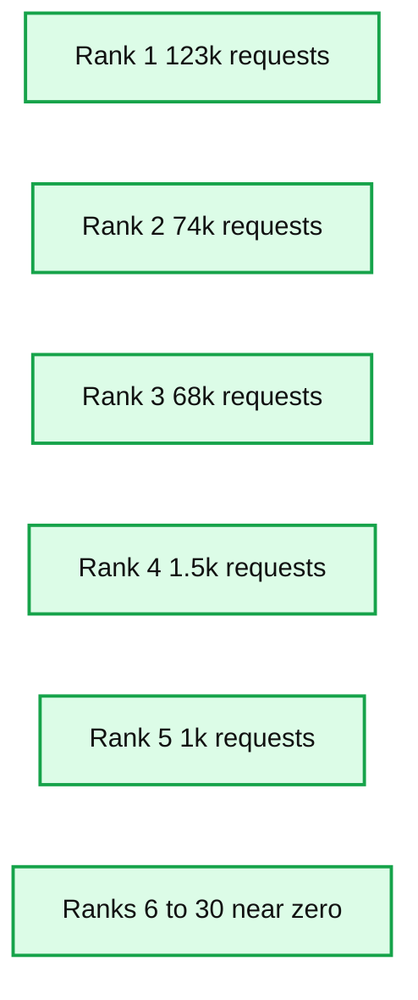

# Scalable Near Real-Time S3 Access Logging Analytics with Apache Spark™ and Delta Lake

- Source: https://www.databricks.com/blog/2019/10/31/scalable-near-real-time-s3-access-logging-analytics-with-apache-spark-and-delta-lake.html
- Published: 2019-10-31
- Authors: Viacheslav Inozemtsev
- Categories: engineering, open-source
- Images: 8 total, 4 extracted as architecture

[Get an early preview of O'Reilly's new ebook](https://www.databricks.com/resources/ebook/delta-lake-running-oreilly?itm_data=scalablerealtimes3apachesparkdeltalake-blog-oreillydlupandrunning) for the step-by-step guidance you need to start using Delta Lake.

---

>  The [original blog](https://www.linkedin.com/pulse/scalable-near-real-time-s3-access-logging-analytics-spark-inozemtsev/) is from Viacheslav Inozemtsev, Senior Data Engineer at Zalando, reproduced with permission.

## Introduction

Many organizations use AWS S3 as their main storage infrastructure for their data. Moreover, by using Apache Spark™ on Databricks they often perform transformations of that data and save the refined results back to S3 for further analysis. When the size of data and the amount of processing reach a certain scale, it often becomes necessary to observe the data access patterns. Common questions that arise include (but are not limited to): Which datasets are used the most? What is the ratio between accessing new and past data? How quickly a dataset can be moved to a cheaper storage class without affecting the performance of the users? Etc.

In [Zalando](https://zalando.com/), we have faced this issue since data and computation became a commodity for us in the last few years. Almost all of our ~200 engineering teams regularly perform analytics, reporting, or machine learning meaning they all read data from the central data lake. The main motivation to enable observability over this data was to reduce the cost of storage and processing by deleting unused data and by shrinking resource usage of the pipelines that produce that data. An additional driver was to understand if our engineering teams needed to query historical data or if they are only interested in the recent state of the data.

To answer these types of questions S3 provides a useful feature - [S3 Server Access Logging](https://docs.aws.amazon.com/AmazonS3/latest/userguide/ServerLogs.html). When enabled, it constantly dumps logs about every read and write access in the observed bucket. The problem that appears almost immediately, and especially at a higher scale, is that these logs are in the form of comparatively small text files, with a format similar to the logs of Apache Web Server.

To query these logs we have leveraged capabilities of Apache Spark™ Structured Streaming on Databricks and built a streaming pipeline that constructs [Delta Lake](https://delta.io/) tables. These tables - for each observed bucket - contain well-structured data of the S3 Access Logs, they are partitioned, can be sorted if needed, and, as a result, enable extended and efficient analysis of the access patterns of the company’s data. This allows us to answer the previously mentioned questions and many more. In this blog post we are going to describe the production architecture we designed in Zalando, and to show in detail how you can deploy such a pipeline yourself.

## Solution

Before we start, let us make two qualifications.

The first note is about why we chose [Delta Lake](https://delta.io/), and not plain Parquet or any other format. As you will see, to solve the problem described we are going to create a continuous application using Spark Structured Streaming. The properties of the Delta Lake, in this case, will give us the following benefits:

- ACID Transactions: No corrupted/inconsistent reads by the consumers of the table in case write operation is still in progress or has failed leaving partial results on S3. More information is also available in [Diving into Delta Lake: Unpacking the Transaction Log](https://www.databricks.com/blog/2019/08/21/diving-into-delta-lake-unpacking-the-transaction-log.html).
- Schema Enforcement: The metadata is controlled by the table; there is no chance that we break the schema if there is a bug in the code of the Spark job or if the format of the logs has changed. More information is available in [Diving Into Delta Lake: Schema Enforcement & Evolution](https://www.databricks.com/blog/2019/09/24/diving-into-delta-lake-schema-enforcement-evolution.html).
- Schema Evolution: On the other hand, if there is a change in the log format - we can purposely extend the schema by adding new fields. More information is available in [Diving Into Delta Lake: Schema Enforcement & Evolution](https://www.databricks.com/blog/2019/09/24/diving-into-delta-lake-schema-enforcement-evolution.html).
- Open Format: All the benefits of the plain Parquet format for readers apply, e.g. predicate push-down, column projection, etc.
- Unified Batch and Streaming Source and Sink: Opportunity to chain downstream Spark Structured Streaming jobs to produce aggregations based on the new content

The second note is about the datasets that are being read by the clients of our data lake. For the most part, the mentioned datasets consist of 2 categories: 1) snapshots of the data warehouse tables from the BI databases, and 2) continuously appended streams of events from the central event bus of the company. This means that there are 2 types of patterns of how data gets written in the first place - full snapshot once per day and continuously appended stream, respectively.

In both cases we have a hypothesis that the data generated in the last day is consumed most often. For the snapshots we also know of infrequent comparisons between the current snapshot and past versions, for example one from a year ago. We are aware of the use case when the whole month or even year of historical data for a certain stream of event data has to be processed. This gives us an idea of what to look for, and this is where the described pipeline should help us to prove or disprove our hypotheses.

Let us now dive into the technical details of the implementation of this pipeline. The only entity we have at the current stage is the S3 bucket. Our goal is to analyze what patterns appear in the read and write access to this bucket.

To give you an idea of what we are going to show, on the diagram below you can see the final architecture, that represents the final state of the pipeline. The flow it depicts is the following:

1. AWS constantly monitors the S3 bucket **data-bucket**
2. It writes raw text logs to the target S3 bucket **raw-logs-bucket**
3. For every created object an Event Notification is sent to the SQS queue **new-log-objects-queue**
4. Once every hour a Spark job gets started by Databricks
5. Spark job reads all the new messages from the queue
6. Spark job reads all the objects (described in the messages from the queue) from raw-logs-bucket
7. Spark job writes the new data in *append* mode to the Delta Lake table in the **delta-logs-bucket** S3 bucket (optionally also executes [OPTIMIZE](https://docs.databricks.com/delta/optimizations/file-mgmt.html#compaction-bin-packing) and [VACUUM](https://docs.databricks.com/delta/optimizations/file-mgmt.html#garbage-collection), or runs in the [Auto-Optimize mode](https://docs.databricks.com/delta/optimizations/auto-optimize.html))
8. This Delta Lake table can be queried for the analysis of the access patterns

**Summary:** The diagram shows a near real-time pipeline that monitors S3 access, ingests raw logs with Spark, stores them in Delta Lake, and queries the results through Databricks.

**Components:**

- data-bucket: Amazon S3 source bucket
- AWS: Amazon Web Services S3 logging
- raw-logs-bucket: Amazon S3 bucket for raw access logs
- new-log-objects-queue: Amazon SQS queue
- Databricks: Databricks scheduled processing
- Apache Spark: Spark processing engine
- Delta Lake: Durable analytical table storage

**Flows:**

- data-bucket -> AWS: 1. Monitor access
- AWS -> raw-logs-bucket: 2. Write logs
- raw-logs-bucket -> new-log-objects-queue: 3. OnObjectCreated event
- Databricks -> Apache Spark: 4. Trigger every 60 minutes
- new-log-objects-queue -> Apache Spark: 5. Read all new messages
- raw-logs-bucket -> Apache Spark: 6. Read new objects
- Apache Spark -> Delta Lake: 7. Append to Delta Lake
- Delta Lake -> Databricks: 8. Query Delta Lake table

**Numbers:** 1, 2, 3, 4, 5, 6, 7, 8, 60 minutes

```mermaid
%% Shows S3 access logging ingestion and Delta Lake analytics
flowchart LR
    data[data bucket]
    aws[AWS]
    raw[raw logs bucket]
    queue[new log objects queue]
    db[Databricks]
    spark[Apache Spark]
    delta[Delta Lake]

    data -.->|1 Monitor access| aws
    aws -->|2 Write logs| raw
    raw -->|3 OnObjectCreated| queue
    db -.->|4 Trigger every 60 minutes| spark
    queue -->|5 Read all new messages| spark
    raw -->|6 Read new objects| spark
    spark -->|7 Append to Delta Lake| delta
    delta -->|8 Query Delta Lake table| db

    classDef client fill:#dbeafe,stroke:#2563eb,stroke-width:2px,color:#111
    classDef service fill:#dcfce7,stroke:#16a34a,stroke-width:2px,color:#111
    classDef store fill:#ede9fe,stroke:#7c3aed,stroke-width:2px,color:#111
    classDef cache fill:#fef3c7,stroke:#d97706,stroke-width:2px,color:#111
    classDef queue fill:#cffafe,stroke:#0891b2,stroke-width:2px,color:#111
    classDef critical fill:#fee2e2,stroke:#dc2626,stroke-width:4px,color:#111
    classDef external fill:#e5e7eb,stroke:#6b7280,stroke-width:2px,color:#111,stroke-dasharray:4 3
    classDef decision fill:#fce7f3,stroke:#db2777,stroke-width:2px,color:#111

    class data,raw,delta store
    class aws external
    class queue queue
    class db,spark service

    %% Legend
    %% client means clients edge gateway or load balancer
    %% service means stateless compute
    %% store means databases or durable storage
    %% cache means losable cache
    %% queue means asynchronous pipes
    %% critical means bottleneck or single point of failure
    %% external means third party
    %% decision means trade off point
```

source image: https://www.databricks.com/wp-content/uploads/2019/10/0.png

 

## Administrative Setup

First we will perform the administrative setup of configuring our S3 Server Access Logging and creating an SQS Queue.

### Configure S3 Server Access Logging

First of all you need to configure S3 Server Access Logging for the data-bucket. To store the raw logs you first need to [create](https://docs.aws.amazon.com/AmazonS3/latest/userguide/creating-bucket.html) an additional bucket - let’s call it raw-logs-bucket. Then you can configure logging [via UI](https://docs.aws.amazon.com/AmazonS3/latest/user-guide/server-access-logging.html) or [using API](https://docs.aws.amazon.com/cli/latest/reference/s3api/put-bucket-logging.html). Let’s assume that we specify target prefix as **data-bucket-logs/**, so that we can use this bucket for S3 access logs of multiple data buckets.

After this is done - raw logs will start appearing in the raw-logs-bucket as soon as someone is doing requests to the data-bucket. The number and the size of the objects with logs will depend on the intensity of requests. We experienced three different patterns for three different buckets as noted in the table below.

**Summary:** The table compares S3 access log volume and object size patterns for three data buckets.

**Components:**

- Logs for data bucket 1
- Logs for data bucket 2
- Logs for data bucket 3
- Average number of objects per hour
- Average size of one object in MB
- Total object size per day in GB

**Flows:**

- none

**Numbers:**

- Data bucket 1: 340 objects per hour, 0.9 MB per object, 7 GB per day
- Data bucket 2: 600 objects per hour, 6.4 MB per object, 90 GB per day
- Data bucket 3: 730 objects per hour, 8 MB per object, 136 GB per day

source image: https://www.databricks.com/wp-content/uploads/2019/10/0-1.png

You can see that the velocity of data can be rather different, which means you have to account for this when processing these disparate sources of data.

### Create an SQS queue

Now, when logs are being created, you can start thinking about how to read them with Spark to produce the desired Delta Lake table. Because S3 logs are written in the append-only mode - only new objects get created, and no object ever gets modified or deleted - this is a perfect case to leverage the [S3-SQS Spark reader](https://docs.databricks.com/spark/latest/structured-streaming/sqs.html) created by Databricks. To use it, you need first of all to [create an SQS queue](https://docs.aws.amazon.com/AWSSimpleQueueService/latest/SQSDeveloperGuide/sqs-create-queue.html). We recommend to set *Message Retention Period* to **7 days**, and *Default Visibility Timeout* to **5 minutes**. From our experience, these are good defaults, that as well match defaults of the Spark S3-SQS reader. Let’s refer to the queue with the name new-log-objects-queue.

Now you need to configure the [policy of the queue](https://docs.aws.amazon.com/AWSSimpleQueueService/latest/SQSDeveloperGuide/sqs-basic-examples-of-sqs-policies.html) to allow sending messages to the queue from the raw-logs-bucket. To achieve this you can edit it directly in the Permissions tab of the queue in the UI, or do it [via API](https://docs.aws.amazon.com/cli/latest/reference/sqs/set-queue-attributes.html). This is how the statement should look like:

### Configure S3 event notification

Now, you are ready to connect raw-logs-bucket and new-log-objects-queue, so that for each new object there is a message sent to the queue. To achieve this you can configure the S3 Event Notification [in the UI](https://docs.aws.amazon.com/AmazonS3/latest/userguide/NotificationHowTo.html) or [via API](https://docs.aws.amazon.com/cli/latest/reference/s3api/put-bucket-notification-configuration.html). We show here how the JSON version of this configuration would look like:

## Operational Setup

In this section, we will perform the necessary cluster configurations including creating IAM roles and prepare the cluster configuration.

### Create IAM roles

To be able to run the Spark job, you need to create two IAM roles - one for the job (cluster role), and one to access S3 (assumed role). The reason you need to additionally assume a separate S3 role is that the cluster and its cluster role are located in the dedicated AWS account for Databricks EC2 instances and roles, whereas the raw-logs-bucket is located in the AWS account where the original source bucket resides. And because every log object is written by the Amazon role - there is an implication that cluster role doesn’t have permission to read any of the logs in accordance to the ACL of the log objects. You can read more about it in [Secure Access to S3 Buckets Across Accounts Using IAM Roles with an AssumeRole Policy](https://docs.databricks.com/administration-guide/cloud-configurations/aws/assume-role.html).

The cluster role, referred here as **cluster-role**, should be created in the AWS account dedicated for Databricks, and should have these 2 policies:

and

You will also need to add the instance profile of this role as usual to the Databricks platform.

The role to access S3, referred here as **s3-access-role-to-assume**, should be created in the same account, where both buckets reside. It should refer to the cluster-role by its ARN in the *assumed_by* parameter, and should have these 2 policies:

and

where delta-logs-bucket is another bucket you need to create, where the resulting Delta Lake tables will be located.

### Prepare cluster configuration

Here we outline the spark_conf [settings that are necessary](https://docs.databricks.com/administration-guide/cloud-configurations/aws/instance-profiles.html) in the cluster configuration so that the job can run correctly:

If you go for more than one bucket, we also recommend these settings to enable FAIR scheduler, external shuffling, and RocksDB for keeping state:

## Generate Delta Lake table with a Continuous Application

In the previous sections you completed the perfunctory administrative and operational setups. Now that this is done, you can write the code that will finally produce the desired Delta Lake table, and run it in a Continuous Application mode.

### The notebook

The code is written in Scala. First we define a record case class:

Then we create a few helper functions for parsing:

And finally we define the Spark job:

**Summary:** Scala Spark Structured Streaming job reads S3 access logs from an SQS queue, parses them, and writes valid and invalid records to Delta Lake.

**Components:**

- Amazon SQS queue
- Apache Spark Structured Streaming
- Scala log parser
- Delta Lake data destination
- Delta Lake bad data destination
- Checkpoint storage
- Delta Lake optimization and vacuum commands

**Flows:**

- Amazon SQS queue -> Apache Spark Structured Streaming: S3 log messages
- Apache Spark Structured Streaming -> Scala log parser: log lines
- Scala log parser -> Delta Lake data destination: parsed records
- Scala log parser -> Delta Lake bad data destination: unparseable log lines with timestamps
- Apache Spark Structured Streaming -> Checkpoint storage: streaming checkpoint state
- Delta Lake data destination -> Delta Lake optimization and vacuum commands: stored Delta data

**Numbers:** 1, 2, 3, 4, 5, 7, 8, 9, 10, 11, 13, 14, 15, 16, 17, 18, 19, 20, 21, 22, 23, 24, 25, 26, 27, 28, 30, 31, 32, 33, 34, 35, 36, 37, 39, 40, 41, 42, 43, 44, 45, 46, 47, 48, 50, 51, 53, 54, 55, 56, 57, 59, 61, 62, 0 HOURS, once

source image: https://www.databricks.com/wp-content/uploads/2019/10/0-4.png

### Create Databricks job

The last step is to make the whole pipeline run. For this you need to create a Databricks job. You can use the “New Automated Cluster” type, add *spark_conf* we defined above, and schedule it to be run, for example, once every hour using “Schedule” section. This is it - as soon as you confirm creation of the job, and when it starts running by scheduler - you should be able to see that messages from the SQS queue are getting consumed, and that the job is writing to the output Delta Lake table.

## Execute Notebook Queries

At this point data is available, and you can create your notebook and execute your queries to answer questions we started with in the beginning of this blog post.

### Create interactive cluster and a notebook to run analytics

As soon as Delta Lake table has the data - you can start querying it. For this you can create a permanent cluster with the role that only needs to be able to read the delta-logs-bucket. This means it doesn’t need to use the *AssumeRole* technique, but only need *ListBucket* and *GetObject* permissions. After that you can attach a notebook to this cluster and execute your first analysis.

### Queries to analyze access patterns

Let’s get back to one of the questions that we asked in the beginning - *which datasets are used the most?* If we assume that in the source bucket every dataset is located under prefix *data/{DATASET_NAME}/*, then to answer it, we could come up with a query like this one:

The outcome of the query can look like this:

**Summary:** Bar chart showing the number of GetObject requests for datasets ranked 1 through 30, with the top three datasets receiving most requests.

**Components:**

- Dataset rank axis
- Number of GetObject requests axis
- Dataset request bars
- Technology: none shown

**Flows:**

- none

**Numbers:** Dataset ranks 1 through 30; request axis values 0.00, 10k, 20k, 30k, 40k, 50k, 60k, 70k, 80k, 90k, 100k, 110k, 120k, 130k; approximate bar values 123k, 74k, 68k, 1.5k, and 1k

source image: https://www.databricks.com/wp-content/uploads/2019/10/0-5.png

This query tells us how many individual *GetObject* requests were made to each dataset during one day, ordered from the top most accessed down to the less intensively accessed. By itself it might not be enough to say, if one dataset is accessed more often. We can normalize each aggregation by the number of objects in each dataset. Also, we can group by dataset and day, so that we also see the correlation in time. There are many further options, but the point is that having at hand this Delta Lake table we can answer any kind of question about what access patterns in the bucket.

### Extensibility

The pipeline we have shown is extensible out of the box. You can fully reuse the same SQS queue and add more buckets with logging into the pipeline, by simply using the same raw-logs-bucket to store S3 Server Access Logs. Because the Spark job already partitions by *date* and *bucket*, it will keep working fine, and your Delta Lake table will contain log data from the new buckets.

One piece of advice we can give is to use AWS CDK to handle infrastructure, i.e. to configure the buckets raw-logs-bucket and delta-logs-bucket, SQS queue, and the role s3-access-role-to-assume. This will simplify operations and make the infrastructure become code as well.

## Conclusion

In this blog post we have described how S3 Server Access Logging can be transformed into Delta Lake in a continuous fashion, so that analysis of the access patterns to the data can be performed. We showed that Spark Structured Streaming together with the S3-SQS reader can be used to read raw logging data. We described what kind of IAM policies and *spark_conf* parameters you will need to make this pipeline work. Overall, this solution is easy to deploy and operate, and it can give you a good benefit by providing observability over the access to the data.

## Related links

[What is a data lake?](https://www.databricks.com/discover/data-lakes/introduction)
