# Using AutoML Toolkit's FamilyRunner Pipeline APIs to Simplify and Automate Loan Default Predictions

- Source: https://www.databricks.com/blog/2019/11/05/using-automl-toolkits-familyrunner-pipeline-apis-to-simplify-and-automate-loan-default-predictions.html
- Published: 2019-11-05
- Authors: Jas Bali, Denny Lee
- Categories: engineering, open-source, data-science-machine-learning
- Images: 5 total, 2 extracted as architecture

[Try this Loan Risk with AutoML Pipeline API Notebook in Databricks](https://pages.databricks.com/rs/094-YMS-629/images/Loan-Risk-With-Pipeline-API.html)

## Introduction

In the post [Using AutoML Toolkit to Automate Loan Default Predictions](https://www.databricks.com/blog/2019/09/10/using-automl-toolkit-to-automate-loan-default-predictions.html), we had shown how the Databricks Labs’ [AutoML Toolkit](https://github.com/databrickslabs/automl-toolkit) simplified Machine Learning model feature engineering and model building optimization (MBO).  It also had improved the area-under-the-curve (AUC) from 0.6732 (handmade XGBoost model) to 0.723 (AutoML XGBoost model).  With AutoML Toolkit’s Release [0.6.1](https://github.com/databrickslabs/automl-toolkit/blob/master/RELEASE_NOTES.md#version-061), we have upgraded to MLflow version [1.3.0](https://github.com/mlflow/mlflow/releases/tag/v1.3.0) and introduced a new Pipeline API that simplifies feature generation and inference.

**Summary:** The diagram shows Databricks Notebooks using the AutoML Toolkit and Pipeline API for feature engineering, model training, tuning, execution, and metrics review.

**Components:**

- Databricks Unified Analytics Platform - Databricks platform
- Databricks Notebooks - notebook environment
- AutoML Toolkit - automated machine learning toolkit
- MLflow - experiment tracking and model metrics
- Pipeline API - pipeline orchestration
- Feature engineering - potential feature definition, vectorization, and selection
- Model pipeline - pipeline building and training
- Model tuning - model parameter tuning
- Metrics review - evaluation metrics

**Flows:**

- Databricks Notebooks -> AutoML Toolkit: define potential features and execute models
- Feature engineering -> Model pipeline: selected and vectorized features
- Model pipeline -> Model tuning: trained machine learning pipeline
- Model tuning -> MLflow: tuned model results
- MLflow -> Metrics review: model metrics
- Pipeline API -> AutoML Toolkit: orchestrates the workflow

**Numbers:** none

```mermaid
%% AutoML workflow across Databricks components
flowchart LR
    N[Databricks Notebooks] -->|define features and execute models| F[Feature Engineering]
    F -->|selected vectorized features| P[Model Pipeline]
    P -->|trained pipeline| T[Model Tuning]
    T -->|model results| M[MLflow]
    M -->|metrics| R[Metrics Review]
    A[Pipeline API] -->|orchestrates workflow| F
    A -->|orchestrates workflow| P
    A -->|orchestrates workflow| T

    classDef client   fill:#dbeafe,stroke:#2563eb,stroke-width:2px,color:#111
    classDef service  fill:#dcfce7,stroke:#16a34a,stroke-width:2px,color:#111
    classDef store    fill:#ede9fe,stroke:#7c3aed,stroke-width:2px,color:#111
    classDef cache    fill:#fef3c7,stroke:#d97706,stroke-width:2px,color:#111
    classDef queue    fill:#cffafe,stroke:#0891b2,stroke-width:2px,color:#111
    classDef critical fill:#fee2e2,stroke:#dc2626,stroke-width:4px,color:#111
    classDef external fill:#e5e7eb,stroke:#6b7280,stroke-width:2px,color:#111,stroke-dasharray:4 3
    classDef decision fill:#fce7f3,stroke:#db2777,stroke-width:2px,color:#111

    class N client
    class F,P,T,A service
    class M store
    class R decision
```

source image: https://www.databricks.com/wp-content/uploads/2019/11/AutoML-Toolkit-Pipeline-API.png

In this post, we will discuss:

- Family Runner API that allows you to easily try different model families to determine the best model
- Simplify Inference with the Pipeline API
- Simplify Feature Engineering with the Pipeline API

## It’s all in the Family...Runner

As noted in the original post [Loan Risk Analysis with XGBoost and Databricks Runtime for Machine Learning](https://www.databricks.com/blog/2018/08/09/loan-risk-analysis-with-xgboost-and-databricks-runtime-for-machine-learning.html), we had tried three different model families: GLM, GBT, and XGBoost.  Without diving into the details, this comprised hundreds of lines of code for each model type.

**Summary:** The diagram shows an XGBoost binary classification pipeline that preprocesses loan data, evaluates validation AUC, and tunes hyperparameters with cross-validation.

**Components:**

- Categorical columns using Spark ML StringIndexer and OneHotEncoder
- Numeric columns using Spark ML Imputer
- VectorAssembler for feature assembly
- StringIndexer for label encoding
- StandardScaler for feature normalization
- XGBoostClassifier with binary logistic objective
- Spark ML Pipeline
- BinaryClassificationEvaluator using probability predictions
- CrossValidator with a parameter grid
- Training, validation, and cross-validation datasets

**Flows:**

- Numeric columns -> Imputer: missing-value completion
- Categorical columns -> StringIndexer: categorical-to-numeric encoding
- Indexed categorical columns -> OneHotEncoder: binary-vector encoding
- Encoded features and imputed numerics -> VectorAssembler: feature vector assembly
- Feature vector -> StandardScaler: normalized feature vector
- Label column -> StringIndexer: indexed label
- Scaled features and indexed label -> XGBoostClassifier: model training
- Pipeline stages -> Spark ML Pipeline: pipeline construction
- Training dataset -> Spark ML Pipeline: model fitting
- Fitted pipeline -> Validation dataset: prediction generation
- Predictions -> BinaryClassificationEvaluator: validation AUC calculation
- Parameter grid and pipeline -> CrossValidator: four-fold parameter search
- Training dataset -> CrossValidator: cross-validated model fitting
- Cross-validated model -> Validation dataset: tuned prediction generation
- Tuned predictions -> BinaryClassificationEvaluator: cross-validated AUC calculation

**Numbers:**

- `num_round`: 5
- `objective`: binary:logistic
- `nworkers`: 16
- `nthreads`: 4
- Validation AUC: 0.6507
- `maxDepth` grid: 4, 7
- `eta` grid: 0.1, 6
- `numRound` grid: 5, 10
- Cross-validator folds: 4
- Cross-validated AUC: 0.6732

```mermaid
%% Shows the loan default XGBoost machine learning pipeline
flowchart LR
    A[Numeric columns] -->|Missing values| B[Imputer]
    C[Categorical columns] -->|Category encoding| D[StringIndexer]
    D -->|Indexed categories| E[OneHotEncoder]
    B -->|Imputed numerics| F[VectorAssembler]
    E -->|Encoded categories| F
    F -->|Feature vector| G[StandardScaler]
    H[Label column] -->|Indexed label| I[Label StringIndexer]
    G -->|Scaled features| J[XGBoostClassifier]
    I -->|Predicted label target| J
    J -->|Pipeline stages| K[Spark ML Pipeline]
    K -->|Fit training data| L[Training dataset]
    K -->|Predict validation data| M[Validation predictions]
    M -->|Probability predictions| N[Binary evaluator]
    K -->|Parameter grid| O[CrossValidator]
    O -->|Tuned predictions| N

    classDef client fill:#dbeafe,stroke:#2563eb,stroke-width:2px,color:#111
    classDef service fill:#dcfce7,stroke:#16a34a,stroke-width:2px,color:#111
    classDef store fill:#ede9fe,stroke:#7c3aed,stroke-width:2px,color:#111
    classDef cache fill:#fef3c7,stroke:#d97706,stroke-width:2px,color:#111
    classDef queue fill:#cffafe,stroke:#0891b2,stroke-width:2px,color:#111
    classDef critical fill:#fee2e2,stroke:#dc2626,stroke-width:4px,color:#111
    classDef external fill:#e5e7eb,stroke:#6b7280,stroke-width:2px,color:#111,stroke-dasharray:4 3
    classDef decision fill:#fce7f3,stroke:#db2777,stroke-width:2px,color:#111

    class A,C,H,L,M store
    class B,D,E,F,G,I,J,K,N,O service
```

source image: https://www.databricks.com/wp-content/uploads/2019/11/Hand-made-model-x3.png

As noted in [Using AutoML Toolkit to Automate Loan Default Predictions](https://www.databricks.com/blog/2019/09/10/using-automl-toolkit-to-automate-loan-default-predictions.html), we had reduced this to a few lines of code for each model type.  With AutoML Toolkit FamilyRunner API, we have simplified this further by allowing you to use it to run multiple model types concurrently distributed across the nodes of your Databricks cluster.   Below are the three lines of code required to run two models (Logistic Regression and XGBoost).

Within the output cell of this code snippet, you can observe the FamilyRunner API execute multiple tasks, each working to find the best hyperparameters for your selection of model types.

With AutoML Toolkit’s Release [0.6.1](https://github.com/databrickslabs/automl-toolkit/blob/master/RELEASE_NOTES.md#version-061), we have upgraded to utilize the latest version of MLflow ([1.3.0](https://github.com/mlflow/mlflow/releases/tag/v1.3.0)).  The following clip shows the results of this AutoML FamilyRunner experiment logged within MLflow allowing you to compare the results of the logistic regression model (AUC=0.716) and XGBoost (AUC=0.72).

https://www.youtube.com/watch?v=3mgLronGsdI

## Simplifying Inference with the Pipeline API

[Pipeline APIs on the FamilyRunner](https://github.com/databrickslabs/automl-toolkit/blob/master/PIPELINE_API_DOCS.md) allow the functionality of running inference using either an MLflow Run ID or [PipelineModel](https://spark.apache.org/docs/latest/api/java/org/apache/spark/ml/PipelineModel.html) object. These pipelines contain a sequence of stages that are directly built from AutoML’s main configuration. By running inference one of these ways, it ensures that the prediction dataset goes through the identical set of feature engineering steps that are used for the training. This makes for fully-contained, portable and serializable pipelines that can be exported and served for standalone requirements, without the need to manually apply feature engineering tasks. The following code provides a snippet of running an inference.

### Using MLflow Run ID

When you are using MLFlow with your AutoML run, you can run inference by simply using MLflow Run ID (and MLflow config) as noted in the code snippet below.

As can be seen in the cell output, the AutoML Pipeline API executes all of the stages originally created against the training data, now applied to the validation dataset. In this example, below is the abridged pipeline API cell output showing the stages it had executed.

As noted in the previous code snippet (*expand to review it*), the inference DataFrame `inferredDf` generated by the Pipeline API contains the validation dataset including the prediction calculated (as noted in the screenshot below).

As can be seen, only MLflow Run ID was required to fetch pipeline and run an inference. This is because Pipeline APIs internally log all artifacts to a run under an experiment in the MLflow project. The notebook on [Using AutoML Toolkit's FamilyRunner Pipeline APIs to Simplify and Automate Loan Default Predictions](https://pages.databricks.com/rs/094-YMS-629/images/Loan-Risk-With-Pipeline-API.html) further demonstrates all the tags added to MLflow Run.

### Use PipelineModel to Manually Save and Load your AutoML Pipelines

Even if MLflow is not enabled, the PipelineModel provides the flexibility to manually save these pipeline models under a custom path.

## Simplifying Feature Engineering with the Pipeline API

In addition to the full inference pipeline, FamilyRunner also exposes an [API](https://github.com/databrickslabs/automl-toolkit/blob/master/PIPELINE_API_DOCS.md#feature-engineering-pipeline-api) to run only feature engineering steps, without executing feature selection or computing feature importances. It takes AutoML’s main configuration object and converts that into a pipeline. This can be useful for doing analysis on feature engineering datasets, without having to manually apply Pearson filters, covariance, outlier filters, cardinality limits, and more. It enables the use of models, which aren’t yet part of the AutoML toolkit, but still leverages AutoML’s advanced feature engineering stages.

## Discussion

With the Family Runner API, you can run multiple model types concurrently to find the best model and its hyperparameters across multiple models.  With AutoML Toolkit’s Release [0.6.1](https://github.com/databrickslabs/automl-toolkit/blob/master/RELEASE_NOTES.md#version-061), we have upgraded to MLflow [1.3.0](https://github.com/mlflow/mlflow/releases/tag/v1.3.0) and introduced a new Pipeline API that significantly simplifies feature generation and inference. Try the [AutoML Toolkit](https://github.com/databrickslabs/automl-toolkit) and the [Using AutoML Toolkit's FamilyRunner Pipeline APIs to Simplify Loan Risk Analysis](https://pages.databricks.com/rs/094-YMS-629/images/Loan-Risk-With-Pipeline-API.html) notebook today!

 

## Contributions

We'd like to thank Sean Owen, Ben Wilson, Brooke Wenig, and Mladen Kovacevic for their contributions to this blog.
