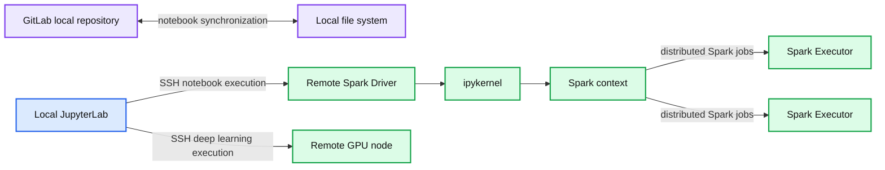

# New Databricks Integration for Jupyter Bridges Local and Remote Workflows

*Integrate your local Jupyter Notebook into Databricks Workspaces*

- Source: https://www.databricks.com/blog/2019/12/03/jupyterlab-databricks-integration-bridge-local-and-remote-workflows.html
- Published: 2019-12-03
- Authors: Bernhard Walter
- Categories: solutions, engineering, data-science-machine-learning
- Images: 4 total, 3 extracted as architecture

## Introduction

For many years now, data scientists have developed specific workflows on premises using local filesystem hierarchies, source code revision systems and CI/CD processes.

On the other side, the available data is growing exponentially and new capabilities for data analysis and modeling are needed, for example, easily scalable storage, distributed computing systems or special hardware for new technologies like GPUs for Deep Learning.

These capabilities are hard to provide on premises in a flexible way. So companies more and more leverage solutions in the cloud and data scientists have the challenge to combine their existing local workflows with these new cloud based capabilities.

The project *[JupyterLab Integration](https://github.com/databrickslabs/Jupyterlab-Integration)*, published in [Databricks Labs](https://github.com/databrickslabs), was built to bridge these two worlds. Data scientists can use their familiar local environments with JupyterLab and work with remote data and remote clusters simply by selecting a kernel.

Example scenarios enabled by JupyterLab Integration from your local JupyterLab:

- Execute single node data science Jupyter notebooks on remote clusters maintained by Databricks with access to the remote Data Lake.
- Run deep learning code on [Databricks GPU clusters](https://docs.databricks.com/clusters/gpu.html).
- Run remote Spark jobs with an integrated user experience (progress bars, DBFS browser, ...).
- Easily follow deep learning tutorials where the setup is based on Jupyter or JupyterLab and run the code on a Databricks cluster.
- Mirror a remote cluster environment locally (python and library versions) and switch seamlessly between local and remote execution by just selecting Jupyter kernels.

This blog post starts with a quick overview how using a remote Databricks cluster from your local JupyterLab would look like. It then provides an end to end example of working with JupyterLab Integration followed by explaining the differences to [Databricks Connect](https://docs.databricks.com/dev-tools/databricks-connect.html). If you want to try it yourself, the last section explains the installation.

## Using a remote cluster from a local Jupyterlab

JupyterLab Integration follows the standard approach of Jupyter/JupyterLab and allows you to create Jupyter kernels for remote Databricks clusters (this is explained in the next section). To work with JupyterLab Integration you start JupyterLab with the standard command:

In the notebook, select the remote kernel from the menu to connect to the remote Databricks cluster and get a Spark session with the following Python code:

The video below shows this process and some of the features of JupyterLab Integration.

https://www.youtube.com/watch?v=VUqA8hp9bnk

## Databricks-JupyterLab Integration — An end to end example

Before configuring a Databricks cluster for JupyterLab Integration, let’s understand how it will be identified: A Databricks clusters runs in cloud in a [Databricks Data Science Workspace](https://www.databricks.com/product/data-lakehouse). These workspaces can be maintained from a local terminal with the [Databricks CLI](https://docs.databricks.com/dev-tools/cli/index.html). The Databricks CLI stores the URL and personal access token for a workspace in a local configuration file under a selectable profile name. JupyterLab Integration uses this profile name to reference Databricks Workspaces, e.g demo for the workspace demo.cloud.databricks.com.

### Configuring a remote kernel for JupyterLab

Let’s assume the JupyterLab Integration is already installed and configured to mirror a remote cluster named bernhard-5.5ml (details about installation at the end of this blog post).

The first step is to create a Jupyter kernel specification for a remote cluster, e.g. in the workspace with profile name demo:

The following wizard lets you select the remote cluster in workspace demo, stores its driver IP address in the local ssh configuration file and installs some necessary runtime libraries on the remote driver:

At the end, a new kernel SSH 1104-182503-trust65 demo:bernhard-6.1ml will be available in JupyterLab (the name is a combination of the remote cluster id 1104-182503-trust65, the Databricks CLI profile name demo, the remote cluster name bernhard-6.1ml and optionally the local conda environment name).

### Starting JupyterLab with the Databricks integration

Now we have two choices to start JupyterLab, first the usual way:

This will work perfectly, when the remote cluster is already up and running and its local configuration is up to date. However, the preferred way to start JupyterLab for JupyterLab Integration is

This command automatically starts the remote cluster (if terminated), installs the runtime libraries “ipykernel” and “ipywidgets” on the driver and saves the remote IP address of the driver locally. As a nice side effect, with flag -c the personal access token is automatically copied to the clipboard. You will need the token in the next step in the notebook to authenticate against the remote cluster. It is important to note that the personal access token will not be stored on the remote cluster.

### Getting a Spark Context in the Jupyter Notebook

To create a Spark session in a Jupyter Notebook that is connected to this remote kernel, enter the following two lines into a notebook cell:

This will request to enter the personal access token (the one that was copied to the clipboard above) and then connect the notebook to the remote Spark Context.

### Running hyperparameter tuning locally and remotely

The following code will run on both a local Python kernel and a remote Databricks kernel. Running locally, it will use GridSearchCV from [scikit-learn](https://scikit-learn.org) with a small hyperparameter space. Running on the remote Databricks kernel, it will leverage [spark-sklearn](https://github.com/databricks/spark-sklearn) to distribute the hyperparameter optimization across Spark executors. For different settings on local and remote environment (e.g. paths to data), the function is_remote() from JupyterLab Integration can be used.

1. Define the data locations both locally and remotely and load GridSearchCV

 

2. Load the data

 

3. Define the different hyperparameter spaces for local and remote execution

 

4. Finally, evaluate the model

 

Below is an video demo for both a local and a remote run:

https://www.youtube.com/watch?v=Dih6RcYS7as

## JupyterLab Integration and Databricks Connect

[Databricks Connect](https://docs.databricks.com/dev-tools/databricks-connect.html) allows you to connect your favorite IDE, notebook server, and other custom applications to Databricks clusters. It provides a special local Spark Context which is basically a proxy to the remote Spark Context. Only Spark code will be executed on the remote cluster. This means, for example, if you start a GPU node in Databricks for some Deep Learning experiments, with Databricks Connect your code will run on the laptop and will not leverage the GPU of the remote machine:

**Summary:** The diagram shows JupyterLab running a local Spark driver that proxies commands to a remote Spark driver and executors on Databricks.

**Components:**

- Jupyter notebook screenshot: JupyterLab
- ipykernel: Jupyter kernel
- Local Spark Driver: local Spark driver
- Spark context proxy: local proxy context
- Remote Spark Driver: Databricks Spark driver
- Spark context: remote Spark context
- Spark Executor: Databricks executor
- Spark Executor: Databricks executor

**Flows:**

- Jupyter notebook -> ipykernel: notebook code
- Spark context proxy -> Spark context: proxied Spark operations
- Spark context -> Spark Executor: Spark tasks
- Spark context -> Spark Executor: Spark tasks

**Numbers:** none

```mermaid
%% Shows a local Jupyter Spark driver proxying operations to Databricks
flowchart LR
    notebook[Jupyter notebook]
    kernel[ipykernel]
    local[Local Spark Driver]
    proxy[Spark context proxy]
    remote[Remote Spark Driver]
    context[Spark context]
    exec1[Spark Executor]
    exec2[Spark Executor]

    notebook -->|notebook code| kernel
    kernel -->|runs locally| local
    local -->|uses| proxy
    proxy -->|proxied Spark operations| context
    context -->|Spark tasks| exec1
    context -->|Spark tasks| exec2

    classDef client   fill:#dbeafe,stroke:#2563eb,stroke-width:2px,color:#111
    classDef service  fill:#dcfce7,stroke:#16a34a,stroke-width:2px,color:#111
    classDef store    fill:#ede9fe,stroke:#7c3aed,stroke-width:2px,color:#111
    classDef cache    fill:#fef3c7,stroke:#d97706,stroke-width:2px,color:#111
    classDef queue    fill:#cffafe,stroke:#0891b2,stroke-width:2px,color:#111
    classDef critical fill:#fee2e2,stroke:#dc2626,stroke-width:4px,color:#111
    classDef external fill:#e5e7eb,stroke:#6b7280,stroke-width:2px,color:#111,stroke-dasharray:4 3
    classDef decision fill:#fce7f3,stroke:#db2777,stroke-width:2px,color:#111

    class notebook client
    class kernel,local,remote,context,exec1,exec2 service
    class proxy queue
```

source image: https://www.databricks.com/wp-content/uploads/2019/11/image4-1.png

 

**Databricks Connect architecture**

 

JupyterLab Integration, on the other hand, keeps notebooks locally but runs all code on the remote cluster if a remote kernel is selected. This enables your local JupyterLab to run single node data science notebooks (using pandas, scikit-learn, etc.) on a remote environment maintained by Databricks or to run your deep learning code on a remote Databricks GPU machine ⓶.

 Your local JupyterLab can also execute distributed Spark jobs on Databricks clusters ⓵ with progress bars providing the status of the Spark job.

**Summary:** The diagram shows JupyterLab on a local laptop connecting through SSH to remote Databricks Spark clusters and GPU nodes, with notebooks stored in GitLab and the local filesystem.

**Components:**

- GitLab local repository
- Local file system containing folders and Jupyter notebooks
- Local JupyterLab interface
- Remote Spark Driver using ipykernel
- Spark context
- Spark Executors
- Remote GPU node
- Databricks clusters

**Flows:**

- GitLab local repository -> Local file system: notebook synchronization
- Local file system -> GitLab local repository: notebook synchronization
- Local JupyterLab -> Remote Spark Driver: SSH notebook execution
- Local JupyterLab -> Remote GPU node: SSH deep learning execution
- Spark context -> Spark Executor: distributed Spark jobs
- Spark context -> Spark Executor: distributed Spark jobs

**Numbers:** 1, 2, 1, 2, 3

source image: https://www.databricks.com/wp-content/uploads/2019/11/image1-1.png

 

**JupyterLab Integration architecture**

 

Furthermore, you can set up a local conda environment that mirrors a remote cluster. You can start building out your experiment locally, where you have full control over your environment, processes and easy access to all log files. When the code is stable, you can use the remote cluster to apply it to the full remote data set or do distributed hyperparameter optimization on a remote cluster without uploading data with every run.

Note: If a notebook is connected to a remote cluster, its Python kernel runs on the remote cluster and neither local config files nor local data can be accessed with Python and Spark. To exchange files between the local laptop and DBFS on the remote cluster, use Databricks CLI to copy data back and forth:

Since e.g. Pandas cannot access files in DBFS via dbfs:/, there is a mount point /dbfs/ that allows to access the data in DBFS (like /dbfs/data/abc.csv) with standard libraries of Python.

## JupyterLab Integration Installation

After we have seen how *JupyterLab Integration* works, let’s have a look at how to install it.

### Prerequisites

*JupyterLab Integration* will run for Databricks on both AWS and Azure Databricks. The setup is based on the Databricks CLI configuration and assumes:

1. [Anaconda](https://www.anaconda.com/products/individual) is installed (the libraries for the JupyterLab Integration will be installed later)
2. Databricks CLI is installed and configured for the workspace you want to use
3. An SSH key pair is created for the cluster you want to use
4. The cluster you want to use is SSH enabled and has the public key from 3 installed

Note: It currently only runs on MacOS and Linux and tested with Databricks Runtime 5.5, 6.0 and 6.1 (Standard and ML).

**Summary:** The diagram shows the setup connecting a local conda environment and Databricks CLI profile to an SSH-enabled Databricks cluster using a matching SSH key pair.

**Components:**

- Local conda environment using remote_ikernel, ipywidgets, sidecar, ssh_config, inquirer, requests, mlflow, sklearn, tensorflow, and pytorch
- Databricks CLI configuration with DEFAULT, demo, and westeu profiles
- SSH key pair named after the Databricks CLI profile
- Databricks cluster with SSH enabled, using driver host 52.178.79.70 and port 2200

**Flows:**

- Databricks CLI westeu profile -> SSH key pair: selects the profile-matching key
- SSH public key -> Databricks cluster: installs the public key for SSH access
- Local conda environment -> Databricks CLI configuration: uses the configured workspace and token
- Local conda environment -> Databricks cluster: connects through SSH

**Numbers:** 1, 2, 3, 4, 52.178.79.70, 2200

```mermaid
%% Local JupyterLab integration connects to an SSH enabled Databricks cluster
flowchart LR
    A[Local conda environment] -->|uses workspace and token configuration| B[Databricks CLI profiles]
    B -->|selects matching westeu key| C[SSH key pair]
    C -->|installs public key| D[Databricks SSH cluster]
    A -->|SSH connection| D

    classDef client   fill:#dbeafe,stroke:#2563eb,stroke-width:2px,color:#111
    classDef service  fill:#dcfce7,stroke:#16a34a,stroke-width:2px,color:#111
    classDef store    fill:#ede9fe,stroke:#7c3aed,stroke-width:2px,color:#111
    classDef cache    fill:#fef3c7,stroke:#d97706,stroke-width:2px,color:#111
    classDef queue    fill:#cffafe,stroke:#0891b2,stroke-width:2px,color:#111
    classDef critical fill:#fee2e2,stroke:#dc2626,stroke-width:4px,color:#111
    classDef external fill:#e5e7eb,stroke:#6b7280,stroke-width:2px,color:#111,stroke-dasharray:4 3
    classDef decision fill:#fce7f3,stroke:#db2777,stroke-width:2px,color:#111

    class A client
    class B service
    class C store
    class D external
```

source image: https://www.databricks.com/wp-content/uploads/2019/11/image5-1.png

The convention is that the SSH key pair is named after the name of the Databricks CLI profile name. For more details on prerequisites, please see the [“prerequisites” section of the documentation](https://github.com/databrickslabs/Jupyterlab-Integration#1-prerequisites).

### Installation

1. Create a local conda environment and install *JupyterLab Integration*:

The prefix (db-jlab)$ for the command examples in this blog post shows that the conda environment db-jlab is activated.

 The terminal command name databrickslabs-jupyterlab is quite long, so let’s create an alias

2. Bootstrap JupyterLab Integration:

 This will Install the necessary libraries and extensions (using the alias from above):

 

3. Optionally, if you want to run the same notebook locally and remotely (mirroring):

 This will ask for the name of a cluster to be mirrored and install all its data science related libraries in a local conda environment matching all versions.

 

## Get started with JupyterLab Integration

In this blog post we have shown how JupyterLab Integration integrates remote Databricks clusters into locally established workflows by running Python kernels on the Databricks clusters via ssh. This allows data scientists to work in their familiar local environments with JupyterLab and access remote data and remote clusters in a consistent way. We have shown that JupyterLab Integration follows a different approach to Databricks Connect by using ssh. Compared to Databricks Data Science Workspaces and Databricks Connect, this enables a set of additional use cases.

[https://github.com/databrickslabs/Jupyterlab-Integration](https://github.com/databrickslabs/Jupyterlab-Integration)

#### Related Resources

- [Databricks Labs](https://github.com/databrickslabs)
- [Databricks Connect](https://docs.databricks.com/dev-tools/databricks-connect.html)
- [Local JupyterLab connecting to Databricks via SSH](https://github.com/databrickslabs/Jupyterlab-Integration#1-prerequisites)
