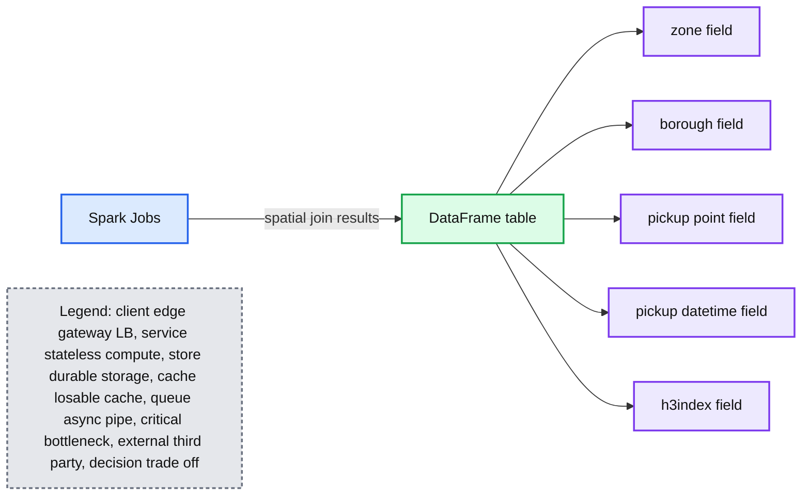
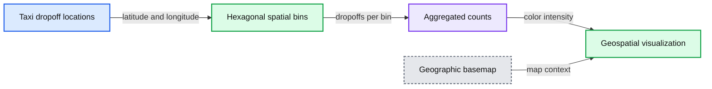
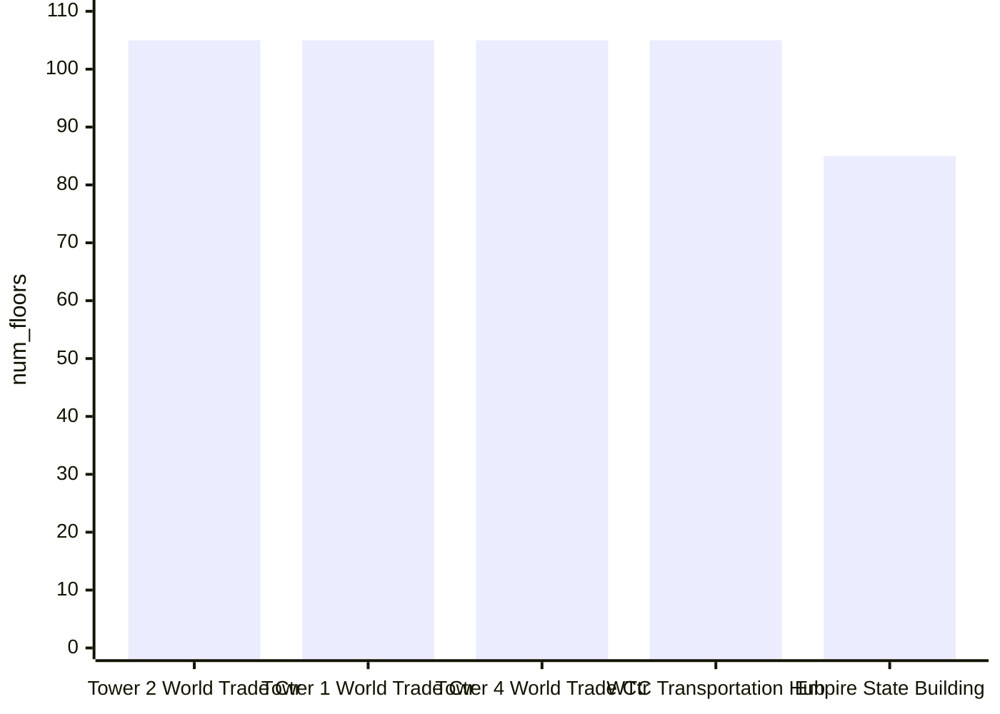
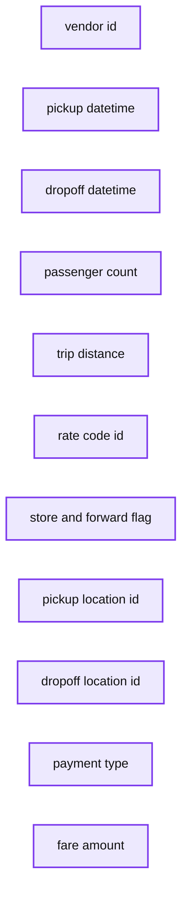

# Processing Geospatial Data at Scale With Databricks

- Source: https://www.databricks.com/blog/2019/12/05/processing-geospatial-data-at-scale-with-databricks.html
- Published: 2019-12-05
- Authors: Nima Razavi, Michael Johns
- Categories: solutions, engineering, open-source, data-science-machine-learning
- Images: 13 total, 4 extracted as architecture

This blog is outdated. Please refer to [this Spatial SQL blog](https://www.databricks.com/blog/introducing-spatial-sql-databricks-80-functions-high-performance-geospatial-analytics) for up-to-date approaches to storing and processing geospatial data within your Databricks Lakehouse.

The evolution and convergence of technology has fueled a vibrant marketplace for timely and accurate geospatial data. Every day billions of handheld and IoT devices along with thousands of airborne and satellite remote sensing platforms generate hundreds of exabytes of location-aware data. This boom of geospatial big data combined with advancements in machine learning is enabling organizations across industry to build new products and capabilities.

For example, numerous companies provide localized drone-based services such as mapping and site inspection (reference [Developing for the Intelligent Cloud and Intelligent Edge](https://www.databricks.com/session/azure-databricks)). Another rapidly growing industry for geospatial data is autonomous vehicles. Startups and established companies alike are amassing large corpuses of highly contextualized geodata from vehicle sensors to deliver the next innovation in self-driving cars (reference [Databricks fuels wejo's ambition to create a mobility data ecosystem](https://www.databricks.com/company/newsroom/press-releases/databricks-fuels-wejos-ambition-to-create-a-mobility-data-ecosystem)). Retailers and government agencies are also looking to make use of their geospatial data. For example, foot-traffic analysis (reference [Building Foot-Traffic Insights Dataset](https://www.databricks.com/blog/2019/08/25/building-foot-traffic-insights-dataset.html)) can help determine the best location to open a new store or, in the Public Sector, improve urban planning. Despite all these investments in geospatial data, a number of challenges exist.

## Challenges Analyzing Geospatial at Scale

The first challenge involves dealing with scale in streaming and batch applications. The sheer proliferation of geospatial data and the SLAs required by applications overwhelms traditional storage and processing systems. Customer data has been spilling out of existing vertically scaled geo databases into data lakes for many years now due to pressures such as data volume, velocity, storage cost, and strict schema-on-write enforcement. While enterprises have invested in geospatial data, few have the proper technology architecture to prepare these large, complex datasets for downstream analytics. Further, given that scaled data is often required for advanced use cases, the majority of AI-driven initiatives are failing to make it from pilot to production.

Compatibility with various spatial formats poses the second challenge. There are many different specialized [geospatial formats](https://en.wikipedia.org/wiki/GIS_file_formats) established over many decades as well as incidental data sources in which location information may be harvested:

- Vector formats such as GeoJSON, KML, Shapefile, and WKT
- Raster formats such as ESRI Grid, GeoTIFF, JPEG 2000, and NITF
- Navigational standards such as used by AIS and GPS devices
- Geodatabases accessible via JDBC / ODBC connections such as PostgreSQL / PostGIS
- Remote sensor formats from Hyperspectral, Multispectral, Lidar, and Radar platforms
- OGC web standards such as WCS, WFS, WMS, and WMTS
- Geotagged logs, pictures, videos, and social media
- Unstructured data with location references

In this blog post, we give an overview of general approaches to deal with the two main challenges listed above using the Databricks Unified Data Analytics Platform. This is the first part of a series of blog posts on working with large volumes of geospatial data.

## Scaling Geospatial Workloads with Databricks

Databricks offers a unified data analytics platform for [big data analytics](https://www.databricks.com/glossary/big-data-analytics) and machine learning used by thousands of customers worldwide. It is powered by Apache Spark™, Delta Lake, and MLflow with a wide ecosystem of third-party and available library integrations. [Databricks UDAP](https://www.databricks.com/product/data-lakehouse) delivers enterprise-grade security, support, reliability, and performance at scale for production workloads. Geospatial workloads are typically complex and there is no one library fitting all use cases. While Apache Spark does not offer geospatial [Data Types](https://spark.apache.org/docs/latest/sql-ref.html) natively, the open source community as well as enterprises have directed much effort to develop spatial libraries, resulting in a sea of options from which to choose.

There are generally three patterns for scaling geospatial operations such as spatial joins or nearest neighbors:

1. Using purpose-built libraries which extend Apache Spark for geospatial analytics. [GeoSpark](https://sedona.apache.org/), [GeoMesa](https://github.com/locationtech/geomesa), [GeoTrellis](https://geotrellis.io/), and [Rasterframes](https://rasterframes.io/) are a few of such libraries used by our customers. These frameworks often offer multiple language bindings, have much better scaling and performance than non-formalized approaches, but can also come with a learning curve.
2. Wrapping single-node libraries such as [GeoPandas](https://geopandas.org/en/stable/), [Geospatial Data Abstraction Library (GDAL)](https://gdal.org/), or [Java Topology Service (JTS)](https://github.com/locationtech/jts) in ad-hoc [user defined functions](https://docs.databricks.com/spark/latest/spark-sql/udf-scala.html) (UDFs) for processing in a distributed fashion with Spark DataFrames. This is the simplest approach for scaling existing workloads without much code rewrite; however it can introduce performance drawbacks as it is more lift-and-shift in nature.
3. Indexing the data with grid systems and leveraging the generated index to perform spatial operations is a common approach for dealing with very large scale or computationally restricted workloads. [S2](https://s2geometry.io/), [GeoHex](http://www.geohex.org) and Uber's H3 are examples of such grid systems. Grids approximate geo features such as polygons or points with a fixed set of identifiable cells thus avoiding expensive geospatial operations altogether and thus offer much better scaling behavior. Implementers can decide between grids fixed to a single accuracy which can be somewhat lossy yet more performant or grids with multiple accuracies which can be less performant but mitigate against lossines.

The examples which follow are generally oriented around a NYC taxi pickup / dropoff dataset found [here](https://www1.nyc.gov/site/tlc/about/tlc-trip-record-data.page). NYC Taxi Zone data with geometries will also be used as the set of polygons. This data contains polygons for the five boroughs of NYC as well the neighborhoods. This [notebook](https://www.databricks.com/notebooks/prep-nyc-taxi-geospatial-data.html) will walk you through preparations and cleanings done to convert the initial CSV files into [Delta Lake Tables](https://docs.databricks.com/delta/index.html#delta-guide) as a reliable and performant data source.

Our base DataFrame is the taxi pickup / dropoff data read from a [Delta Lake Table](https://docs.databricks.com/delta/index.html#delta-guide) using Databricks.

## Geospatial Operations using GeoSpatial Libraries for Apache Spark

Over the last few years, several libraries have been developed to extend the capabilities of Apache Spark for geospatial analysis. These frameworks bear the brunt of registering commonly applied user defined types (UDT) and functions (UDF) in a consistent manner, lifting the burden otherwise placed on users and teams to write ad-hoc spatial logic. Please note that in this blog post we use several different spatial frameworks chosen to highlight various capabilities. We understand that other frameworks exist beyond those highlighted which you might also want to use with Databricks to process your spatial workloads.

Earlier, we loaded our base data into a DataFrame. Now we need to turn the latitude/longitude attributes into point geometries. To accomplish this, we will use UDFs to perform operations on DataFrames in a distributed fashion. Please refer to the provided notebooks at the end of the blog for details on adding these frameworks to a cluster and the initialization calls to register UDFs and UDTs. For starters, we have [added](https://docs.databricks.com/libraries/index.html) GeoMesa to our cluster, a framework especially adept at handling vector data. For ingestion, we are mainly leveraging its integration of JTS with [Spark SQL](https://spark.apache.org/docs/latest/sql-programming-guide.html) which allows us to easily convert to and use registered JTS geometry classes. We will be using the function st_makePoint that given a latitude and longitude create a Point geometry object. Since the function is a UDF, we can apply it to columns directly.

We can also perform distributed spatial joins, in this case using GeoMesa's provided st_contains UDF to produce the resulting join of all polygons against pickup points.

## Wrapping Single-node Libraries in UDFs

In addition to using purpose built distributed spatial frameworks, existing single-node libraries can also be wrapped in ad-hoc UDFs for performing geospatial operations on DataFrames in a distributed fashion. This pattern is available to all Spark language bindings – Scala, Java, Python, R, and SQL – and is a simple approach for leveraging existing workloads with minimal code changes. To demonstrate a single-node example, let's load NYC borough data and define UDF find_borough(...) for [point-in-polygon](https://en.wikipedia.org/wiki/Point_in_polygon) operation to assign each GPS location to a borough using geopandas. This could also have been accomplished with a [vectorized UDF](https://docs.databricks.com/spark/latest/spark-sql/udf-python-pandas.html#pandas-user-defined-functions) for even better performance.

Now we can apply the UDF to add a column to our Spark DataFrame which assigns a borough name to each pickup point.

*The result of a single-node example, where Geopandas is used to assign each GPS location to NYC borough.*

## Grid Systems for Spatial Indexing

Geospatial operations are inherently computationally expensive. Point-in-polygon, spatial joins, nearest neighbor or snapping to routes all involve complex operations. By indexing with [grid](https://en.wikipedia.org/wiki/Grid_(spatial_index)) systems, the aim is to avoid geospatial operations altogether. This approach leads to the most scalable implementations with the caveat of approximate operations. Here is a brief example with H3.

Scaling spatial operations with H3 is essentially a two step process. The first step is to compute an H3 index for each feature (points, polygons, …) defined as UDF geoToH3(...). The second step is to use these indices for spatial operations such as spatial join (point in polygon, k-nearest neighbors, etc), in this case defined as UDF multiPolygonToH3(...).

We can now apply these two UDFs to the NYC taxi data as well as the set of borough polygons to generate the H3 index.

Given a set of a lat/lon points and a set of polygon geometries, it is now possible to perform the spatial join using h3index field as the join condition. These assignments can be used to aggregate the number of points that fall within each polygon for instance. There are usually millions or billions of points that have to be matched to thousands or millions of polygons which necessitates a scalable approach. There are other techniques not covered in this blog which can be used for indexing in support of spatial operations when an approximation is insufficient.

**Summary:** A Databricks DataFrame table shows spatially joined taxi pickup points with zones, boroughs, timestamps, and H3 indexes.

**Components:**

- Spark Jobs
- DataFrame table
- zone field
- borough field
- pickup_point field
- pickup_datetime field
- h3index field

**Flows:**

- Spark Jobs -> DataFrame table: spatial join results

**Numbers:** 1, 1000, 2016-06-09 10:14:34, 2016-06-09 10:04:08, 2016-06-09 10:52:24, 2016-06-09 10:23:52, 2016-06-09 10:25:38, 2016-06-09 10:42:56, 2016-06-09 10:29:28, 2016-06-09 10:53:01, -73.95296478271484, 40.80758285522461, -73.94908905029297, 40.80293655395508, -73.99422546333984, 40.69488525390625, -73.84475708007812, 40.847774505615234, -73.9139633178711, 40.76524353027344, -73.95944213867188, 40.80912399291992, -73.98164367675781, 40.66694641113281, -73.97588348388672, 40.637396898199336, 613229523000885247, 613229523028148223, 613229551411003391, 613229520937287679, 613229524726841343, 613229523000885247, 613229552660905983, 613229552669294591

source image: https://www.databricks.com/wp-content/uploads/2019/11/Processing-Geospatial-Data-at-Scale-With-Databricks-code05.png

*DataFrame table representing the spatial join of a set of lat/lon points and polygon geometries, using a specific field as the join condition.*

Here is a visualization of taxi dropoff locations, with latitude and longitude binned at a resolution of 7 (1.22km edge length) and colored by aggregated counts within each bin.

**Summary:** The visualization shows taxi dropoff locations aggregated into hexagonal geographic bins across the New York metropolitan area.

**Components:**

- Taxi dropoff locations - latitude and longitude points
- Hexagonal spatial bins - resolution 7 geospatial grid
- Aggregated counts - color intensity per bin
- Geographic basemap - regional map labels and boundaries

**Flows:**

- Taxi dropoff locations -> Hexagonal spatial bins: latitude and longitude assigned to bins
- Hexagonal spatial bins -> Aggregated counts: dropoffs counted within each bin
- Aggregated counts -> Visualization: bins colored by count

**Numbers:** 7; 1.22 km edge length

source image: https://www.databricks.com/wp-content/uploads/2019/11/Processing-Geospatial-Data-at-Scale-With-Databricks-02.jpg

*Geospatial visualization of taxi dropoff locations, with latitude and longitude binned at a resolution of 7 (1.22km edge length) and colored by aggregated counts within each bin.*

## Handling Spatial Formats with Databricks

Geospatial data involves reference points, such as latitude and longitude, to physical locations or extents on the earth along with features described by attributes. While there are many file formats to choose from, we have picked out a handful of representative vector and raster formats to demonstrate reading with Databricks.

### Vector Data

Vector data is a representation of the world stored in x (longitude), y (latitude) coordinates in degrees, also z (altitude in meters) if elevation is considered. The three basic symbol types for vector data are points, lines, and polygons. [Well-known-text (WKT)](https://en.wikipedia.org/wiki/Well-known_text_representation_of_geometry), [GeoJSON](https://en.wikipedia.org/wiki/GeoJSON), and [Shapefile](https://en.wikipedia.org/wiki/Shapefile) are some popular formats for storing vector data we highlight below.

Let's read NYC Taxi Zone data with geometries stored as WKT. The data structure we want to get back is a DataFrame which will allow us to standardize with other APIs and available data sources, such as those used elsewhere in the blog. We are able to easily convert the WKT text content found in field the_geom into its corresponding JTS Geometry class through the st_geomFromWKT(...) UDF call.

GeoJSON is used by many open source GIS packages for encoding a variety of geographic data structures, including their features, properties, and spatial extents. For this example, we will read NYC Borough Boundaries with the approach taken depending on the workflow. Since the data is conforming JSON, we could use the Databricks built-in JSON reader with .option("multiline","true") to load the data with the nested schema.

*Example of using the Databricks built-in JSON reader .option("multiline","true") to load the data with the nested schema.*

From there we could choose to hoist any of the fields up to top level columns using Spark's built-in explode function. For example, we might want to bring up geometry, properties, and type and then convert geometry to its corresponding JTS class as was shown with the WKT example.

*Using the Spark's built-in explode function to raise a field to the top level, displayed within a DataFrame table.*

We can also visualize the NYC Taxi Zone data within a notebook using an existing DataFrame or directly rendering the data with a library such as [Folium](https://pypi.org/project/folium/), a Python library for rendering spatial data. [Databricks File System (DBFS)](https://docs.databricks.com/data/databricks-file-system.html#databricks-file-system) runs over a distributed storage layer which allows code to work with data formats using familiar file system standards. DBFS has a [FUSE Mount](https://docs.databricks.com/data/databricks-file-system.html#local-file-apis) to allow local API calls which perform file read and write operations,which makes it very easy to load data with non-distributed APIs for interactive rendering. In the Python open(...) command below, the "/dbfs/..." prefix enables the use of FUSE Mount.

*We can also visualize the NYC Taxi Zone data, for example, within a notebook using an existing DataFrame or directly rendering the data with a library such as Folium, a Python library for rendering geospatial data.*

Shapefile is a popular vector format developed by ESRI which stores the geometric location and attribute information of geographic features. The format consists of a collection of files with a common filename prefix (*.shp, *.shx, and *.dbf are mandatory) stored in the same directory. An alternative to shapefile is [KML](https://en.wikipedia.org/wiki/Keyhole_Markup_Language), also used by our customers but not shown for brevity. For this example, let's use NYC Building shapefiles. While there are many ways to demonstrate reading shapefiles, we will give an example using GeoSpark. The built-in ShapefileReader is used to generate the rawSpatialDf DataFrame.

By registering rawSpatialDf as a temp view, we can easily drop into pure Spark SQL syntax to work with the DataFrame, to include applying a UDF to convert the shapefile WKT into Geometry.

Additionally, we can use Databricks built in visualization for inline analytics such as charting the tallest buildings in NYC.

**Summary:** A Databricks visualization compares the number of floors in five New York City buildings.

**Components:**

- Tower 2 World Trade Ctr - Databricks built-in visualization
- Tower 1 World Trade Ctr - Databricks built-in visualization
- Tower 4 World Trade Ctr - Databricks built-in visualization
- WTC Transportation Hub - Databricks built-in visualization
- Empire State Building - Databricks built-in visualization

**Flows:**

- none

**Numbers:** 0.00, 20, 40, 60, 80, 100, 2, 1, 4, approximately 105, approximately 85

source image: https://www.databricks.com/wp-content/uploads/2019/11/Processing-Geospatial-Data-at-Scale-With-Databricks-code08.png

*A Databricks built-in visualization for inline analytics charting, for example, the tallest buildings in NYC.*

### Raster Data

Raster data stores information of features in a matrix of cells (or pixels) organized into rows and columns (either discrete or continuous). Satellite images, photogrammetry, and scanned maps are all types of raster-based Earth Observation (EO) data.

The following Python example uses RasterFrames, a DataFrame-centric spatial analytics framework, to read [two bands](https://en.wikipedia.org/wiki/Multispectral_image) of GeoTIFF Landsat-8 imagery (red and near-infrared) and combine them into [Normalized Difference Vegetation Index](https://en.wikipedia.org/wiki/Normalized_difference_vegetation_index). We can use this data to assess plant health around NYC. The rf_ipython module is used to manipulate RasterFrame contents into a variety of visually useful forms, such as below where the red, NIR and NDVI tile columns are rendered with color ramps, using the Databricks built-in displayHTML(...) command to show the results within the notebook.

*RasterFrame contents can be filtered, transformed, summarized, resampled, and rasterized through 200+ raster and vector functions.*

Through its custom [Spark DataSource](https://rasterframes.io/raster-read.html), RasterFrames can read various raster formats, including GeoTIFF, JP2000, MRF, and HDF, from an [array of services](https://rasterframes.io/raster-read.html#uri-formats). It also supports reading the vector formats GeoJSON and WKT/WKB. RasterFrame contents can be filtered, transformed, summarized, resampled, and rasterized through [200+ raster and vector functions](https://rasterframes.io/reference.html), such as st_reproject(...) and st_centroid(...) used in the example above. It provides APIs for Python, SQL, and Scala as well as interoperability with Spark ML.

### GeoDatabases

Geo databases can be filebased for smaller scale data or accessible via JDBC / ODBC connections for medium scale data. You can use Databricks to query many SQL databases with the built-in [JDBC / ODBC Data Source](https://docs.databricks.com/data/data-sources/sql-databases.html). Connecting to [PostgreSQL](https://www.postgresql.org/) is shown below which is commonly used for smaller scale workloads by applying [PostGIS](https://postgis.net/) extensions. This pattern of connectivity allows customers to maintain as-is access to existing databases.

**Summary:** The table shows taxi trip records with vendor, timing, passenger, distance, location, payment, and fare fields.

**Components:**

- vendor_id
- tpep_pickup_datetime
- tpep_dropoff_datetime
- passenger_count
- trip_distance
- rate_code_id
- store_and_fwd_flag
- pickup_location_id
- dropoff_location_id
- payment_type
- fare_amount

**Flows:**

- none

**Numbers:** 2, 1, 5, .16, -3, 3, 1.99, 11, 1, 2.10, 13, 1.40, 8, 1.77, 8.5, .67, 5, 1.09, 6.5, 142, 239, 230, 164, 163, 186, 137, 90, 68, 234, 100, 4, 2, 2019-01-06 16:27:40, 2019-01-06 16:29:47, 2019-01-06 16:51:27, 2019-01-06 17:05:55, 2019-01-06 16:38:49, 2019-01-06 16:58:05, 2019-01-06 16:59:54, 2019-01-06 17:09:33, 2019-01-06 16:25:58, 2019-01-06 16:35:36, 2019-01-06 16:42:45, 2019-01-06 16:47:05, 2019-01-06 16:50:21, 2019-01-06 16:57:03

source image: https://www.databricks.com/wp-content/uploads/2019/11/Processing-Geospatial-Data-at-Scale-With-Databricks-code09.png

## Getting Started with Geospatial Analysis on Databricks

Businesses and government agencies seek to use spatially referenced data in conjunction with enterprise data sources to draw actionable insights and deliver on a broad range of innovative use cases. In this blog we demonstrated how the [Databricks Unified Data Analytics Platform](https://www.databricks.com/product/data-lakehouse) can easily scale geospatial workloads, enabling our customers to harness the power of the cloud to capture, store and analyze data of massive size.

In an upcoming blog, we will take a deep dive into more advanced topics for geospatial processing at-scale with Databricks. You will find additional details about the spatial formats and highlighted frameworks by reviewing [Data Prep Notebook](https://www.databricks.com/notebooks/prep-nyc-taxi-geospatial-data.html), [GeoMesa + H3 Notebook](https://www.databricks.com/notebooks/geomesa-h3-notebook.html), [GeoSpark Notebook](https://www.databricks.com/notebooks/geospark-notebook.html), [GeoPandas Notebook](https://www.databricks.com/notebooks/geopandas-notebook.html), and Rasterframes Notebook. Also, stay tuned for a new section in our [documentation](https://docs.databricks.com/) specifically for geospatial topics of interest.

## Next Steps

- Join our upcoming webinar [Geospatial Analytics and AI in the Public Sector](https://pages.databricks.com/201912-WB-PubSec-Geospatial-Analytics_01.On-demandpage.html) to see a live demo covering a number of popular use cases
