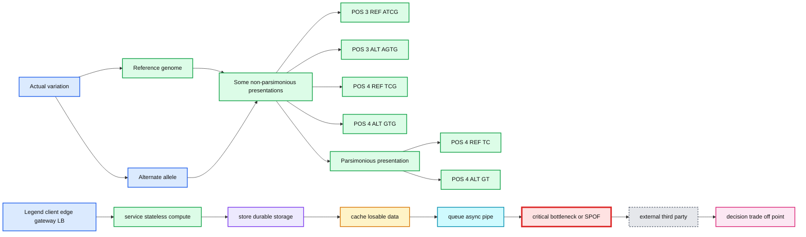
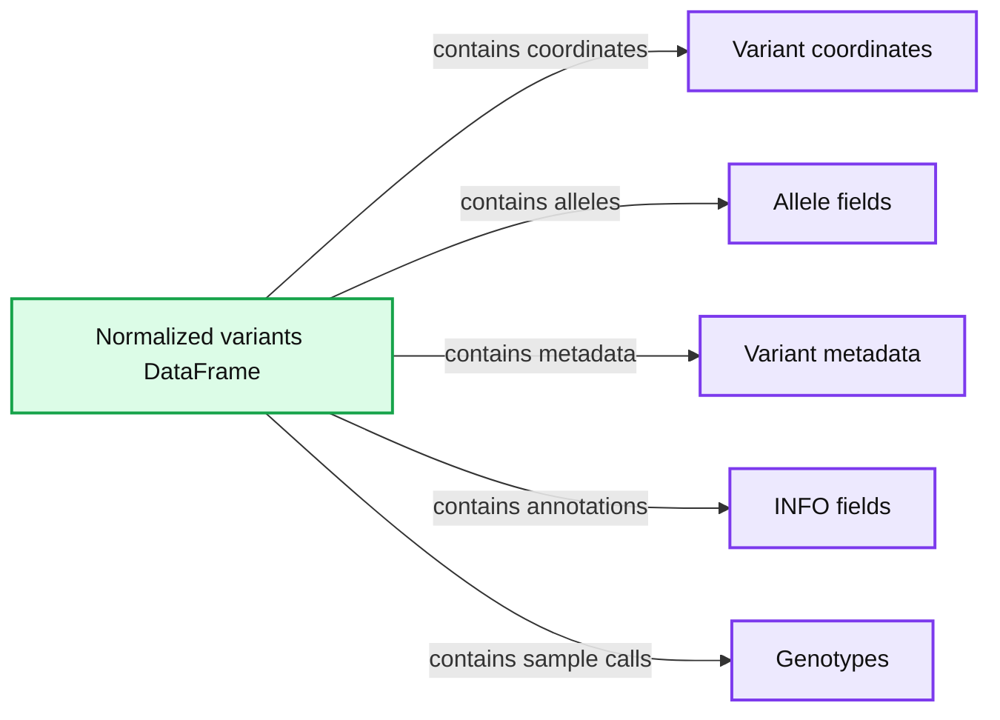
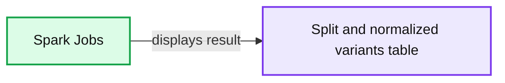

# Streamlining Variant Normalization on Large Genomic Datasets with Glow

- Source: https://www.databricks.com/blog/2019/12/05/streamlining-variant-normalization-on-large-genomic-datasets-with-glow.html
- Published: 2019-12-05
- Authors: Kiavash Kianfar
- Categories: engineering, solutions, open-source
- Images: 6 total, 6 extracted as architecture

Cross posted from the [Glow blog](https://glow.readthedocs.io/en/latest/blogs/variant-normalization-blog/variant-normalization-blog.html).

Many research and drug development projects in the genomics world involve large genomic variant data sets, the volume of which has been growing exponentially over the past decade. However, the tools to extract, transform, load (ETL) and analyze these data sets have not kept pace with this growth. Single-node command line tools or scripts are very inefficient in handling terabytes of genomics data in these projects. In October of this year, [Databricks](https://www.databricks.com/) and the [Regeneron Genetics Center](https://www.regeneron.com/science/genetics-center) partnered to introduce project [Glow](https://projectglow.io/), an open-source toolkit for large-scale genomic analysis based on Apache Spark™, to address this issue. An optimized version of Glow is incorporated into [Databricks Unified Data Analytics Platform (UDAP) for Genomics](https://www.databricks.com/product/genomics), which in addition to several feature optimizations, provides many more secondary and tertiary analysis features on top of a scalable, managed cloud service, making Databricks the best platform to run Glow.

In large cross-team research or drug discovery projects, computational biologists and bioinformaticians usually need to merge very large variant call sets in order to perform downstream analyses. [In a prior post, we showcased the power and simplicity of Glow in ETL](https://www.databricks.com/blog/2019/06/26/scaling-genomic-workflows-with-spark-sql-bgen-and-vcf-readers.html) and merging of variant call sets from different sources using Glow’s VCF and BGEN Data Sources at unprecedented scales. Differently sourced variant call sets impose another major challenge. It is not uncommon for these sets to be generated by different variant calling tools and methods. Consequently, the same genomic variant may be represented differently (in terms of genomic position and alleles) across different call sets. These discrepancies in variant representation must be resolved before any further analysis on the data. This is critical for the following reasons:

1. To avoid incorrect bias in the results of downstream analysis on the merged set of variants or waste of analysis effort on seemingly new variants due to lack of normalization, which are in fact redundant (see Tan et al. for examples of this redundancy in 1000 Genome Project variant calls and dbSNP)
2. To ensure that the merged data set and its post-analysis derivations are compatible and comparable with other public and private variant databases.

This is achieved by what is referred to as variant normalization, a process that ensures the same variant is represented identically across different data sets. Performing variant normalization on terabytes of variant data in large projects using popular single-node tools can become quite a challenge as the acceptable input and output of these tools are the flat file formats that are commonly used to store variant calls (such as VCF and BGEN). To address this issue, we introduced the variant normalization transformation into Glow, which directly acts on a Spark Dataframe of variants to generate a DataFrame of normalized variants, harnessing the power of Spark to normalize variants from hundreds of thousands of samples in a fast and scalable manner with just a single line of Python or Scala code. Before addressing our normalizer, let us have a slightly more technical look at what variant normalization actually does.

## What does variant normalization do?

Variant normalization ensures that the representation of a variant is both “parsimonious” and “left-aligned.” A variant is parsimonious if it is represented in as few nucleotides as possible without reducing the length of any allele to zero. An example is given in Figure 1.

**Summary:** The table shows how one actual variation can have multiple non-parsimonious representations and one parsimonious representation.

**Components:**

- Actual variation
- Reference genome
- Alternate allele
- Non-parsimonious presentations
- Parsimonious presentation
- POS 3 representations
- POS 4 representations
- REF and ALT allele sequences

**Flows:**

- None

**Numbers:** POS 3, POS 4



<sub>source image: https://www.databricks.com/wp-content/uploads/2019/12/Figure-1.png</sub>

Figure 1. Variant Parsimony

A variant is left-aligned if its position cannot be shifted to the left while keeping the length of all its alleles the same. An example is given in Figure 2.

**Summary:** The table shows how one GC deletion can have multiple non-left-aligned representations and one normalized parsimonious representation.

**Components:**

- Actual variation
- Reference genome
- Alternate allele
- Some non-left-aligned presentations
- Normalized left-aligned and parsimonious presentation
- REF and ALT allele rows
- Deletion of one GC

**Flows:**

- Reference genome -> Alternate allele: deletion of one GC
- Non-left-aligned presentations -> Normalized presentation: equivalent representations reduced to a parsimonious left-aligned form

**Numbers:** POS 7, POS 5, POS 4, POS 3, one GC

```mermaid
%% Shows equivalent genomic variant representations and their normalized form
flowchart LR
    R[Reference genome AAAAGCGCGCTT] -->|Deletion of one GC| A[Alternate allele AAAGCGCTT]
    A --> N[Non left aligned presentations]
    N --> P[Normalized presentation]
    P --> X[POS 3 REF AGC ALT A]

    classDef client   fill:#dbeafe,stroke:#2563eb,stroke-width:2px,color:#111
    classDef service  fill:#dcfce7,stroke:#16a34a,stroke-width:2px,color:#111
    classDef store    fill:#ede9fe,stroke:#7c3aed,stroke-width:2px,color:#111
    classDef cache    fill:#fef3c7,stroke:#d97706,stroke-width:2px,color:#111
    classDef queue    fill:#cffafe,stroke:#0891b2,stroke-width:2px,color:#111
    classDef critical fill:#fee2e2,stroke:#dc2626,stroke-width:4px,color:#111
    classDef external fill:#e5e7eb,stroke:#6b7280,stroke-width:2px,color:#111,stroke-dasharray:4 3
    classDef decision fill:#fce7f3,stroke:#db2777,stroke-width:2px,color:#111

    class R,A external
    class N service
    class P,X critical
```



<sub>source image: https://www.databricks.com/wp-content/uploads/2019/12/Figure-2.png</sub>

Figure 2. Left-aligned Variant

**Tan et al.** have proved that normalization results in uniqueness. In other words, two variants have different normalized representations if and only if they are actually different variants.

## Variant normalization in Glow

We have introduced the normalize_variants transformer into Glow (Figure 3). After ingesting variant calls into a Spark DataFrame using the VCF, BGEN or Delta readers, a user can call a single line of Python or Scala code to normalize all variants. This generates another DataFrame in which all variants are presented in their normalized form. The normalized DataFrame can then be used for downstream analyses like a GWAS using [our built-in regression functions](https://www.databricks.com/blog/2019/09/20/engineering-population-scale-genome-wide-association-studies-with-apache-spark-delta-lake-and-mlflow.html) or an [efficiently-parallelized GWAS tool](https://www.databricks.com/blog/2019/10/02/parallelizing-saige-across-hundreds-of-cores.html).

**Summary:** Glow processes VCF and BGEN call sets through Spark DataFrames and the `normalize_variants` transformer for scalable genomic analysis.

**Components:**

- Call sets: VCF and BGEN genomic files
- VCF/BGEN Readers: Glow file readers
- Called Variants DataFrame: integrated Apache Spark DataFrame
- `normalize_variants` transformer: Glow normalization and splitting transformer
- Normalized Variants DataFrame: integrated Apache Spark DataFrame
- Glow Databricks UAP for Genomics: scalable tertiary analytics, GWAS, parallelized legacy tools, genomics data lakes, interactive queries, visualizations, dashboarding, and machine learning

**Flows:**

- Call sets -> VCF/BGEN Readers: VCF and BGEN call data
- VCF/BGEN Readers -> Called Variants DataFrame: parsed called variants
- Called Variants DataFrame -> `normalize_variants` transformer: called variant records
- `normalize_variants` transformer -> Normalized Variants DataFrame: normalized and or split variants
- Normalized Variants DataFrame -> Glow Databricks UAP for Genomics: variants for downstream genomic analyses

**Numbers:** 1, 2, n-1, n


<sub>source image: https://www.databricks.com/wp-content/uploads/2019/12/Figure-3.png</sub>

Figure 3. Scalable Variant Normalization Using Glow

The normalize_variants transformer brings unprecedented scalability and simplicity to this important upstream process, hence is yet another reason why Glow and Databricks UDAP for Genomics are ideal platforms for biobank-scale genomic analyses, e.g., association studies between genetic variations and diseases across cohorts of hundreds of thousands of individuals.

## The underlying normalization algorithm and its accuracy

There are several single-node tools for variant normalization that use different normalization algorithms. Widely used tools for variant normalization include [vt normalize](https://genome.sph.umich.edu/wiki/Vt), [bcftools norm](http://www.htslib.org/doc/bcftools.html#norm), and the GATK’s [LeftAlignAndTrimVariants](https://gatk.broadinstitute.org/hc/en-us).

Based on our own investigation and also as indicated by Bayat et al. and Tan et al., the GATK’s LeftAlignAndTrimVariants algorithm frequently fails to completely left-align some variants. For example, we noticed that on the [test_left_align_hg38.vcf](https://github.com/broadinstitute/gatk/tree/master/src/test/resources/org/broadinstitute/hellbender/tools/walkers/variantutils/LeftAlignAndTrimVariants) test file from GATK itself, applying LeftAlignAndTrimVariants results in an incorrect normalization of 3 of the 16 variants in the file, including the variants at positions chr20:63669973, chr20:64012187, and chr21:13255301. These variants are normalized correctly using vt normalize and bcftools norm.

Consequently, in our normalize_variants transformer, we used an improved version of the bcftools norm or vt normalize algorithms, which are similar in fundamentals. For a given variant, we start by right-trimming all the alleles of the variant as long as their rightmost nucleotides are the same. If the length of any allele reaches zero, we left-append it with a fixed block of nucleotides from the reference genome (the nucleotides are added in blocks as opposed to one-by-one to limit the number of referrals to the reference genome). When right-trimming is terminated, a potential left-trimming is performed to eliminate the leftmost nucleotides common to all alleles (possibly generated by prior left-appendings). The start, end, and alleles of the variants are updated appropriately during this process.

We benchmarked the accuracy of our normalization algorithm against vt normalize and bcftools norm on multiple test files and validated that our results match the results of these tools.

## The optional splitting of multiallelic variants

Our normalize_variants transformer can optionally split multiallelic variants to biallelics. This is controlled by the mode option that can be supplied to this transformer. The possible values for the mode option are as follows: normalize (default), which performs normalization only, split_and_normalize, which splits multiallelic variants to biallelic ones before performing normalization, and split, which only splits multiallelics without doing any normalization.

The splitting logic of our transformer is the same as the splitting logic followed by GATK’s LeftAlignAndTrimVariants [tool](https://gatk.broadinstitute.org/hc/en-us) using --splitMultiallelics option. More precisely, in case of splitting multiallelic variants loaded from VCF files, this transformer recalculates the GT blocks for the resulting biallelic variants if possible, and drops all INFO fields, except for AC, AN, and AF. These three fields are imputed based on the newly calculated GT blocks, if any exists, otherwise, these fields are dropped as well.

## Using the normalize_variant transformer

Here, we briefly demonstrate how using Glow very large variant call sets can be normalized and/or split. First, VCF and/or BGEN files can be read into a Spark DataFrame as demonstrated in a [prior post](https://www.databricks.com/blog/2019/06/26/scaling-genomic-workflows-with-spark-sql-bgen-and-vcf-readers.html). This is shown in Python for the set of VCF files contained in a folder named /databricks-datasets/genomics/call-sets:

An example of the DataFrame original_variants_df is shown in Figure 4.

**Summary:** The image shows the original variants Spark DataFrame with genomic variant fields and sample records before normalization.

**Components:**

- Spark Jobs status indicator
- Original variants DataFrame
- Variant metadata columns
- Genotype data column

**Flows:**

- none

**Numbers:** 1 Spark job; chromosome positions 1259781, 1259782, 1928546, 1928549, 1985340, 1985339, 1983384, 1983388, 1983396, 1983411, 1985710, 63669972, 640212816, 8405578, 1038234, 10388248, 10804283, 13255295, 13255300, 39584005; quality 30.0; INFO values 4, 2, 2, 4, 2, 2, 4, 2, 4, 2, 2, 2, 2, 2, 2, 2, 2, 2, 4; allele frequencies 1.0, 0.25, 0.5, 0.25, 0.5, 0.5, 0.25, 0.5, 0.5, 0.5, 0.25, 0.5, 0.5, 0.5, 0.5, 0.5, 0.75; genotype values 0, 1, 2; chromosome identifiers chr20, chr21, chr22

```text
%% mermaid failed to render; kept as text
%% Shows the original variants Spark DataFrame before normalization
flowchart LR
    A[Spark Jobs] -->|displays| B[Original variants DataFrame]
    B --> C[Variant metadata columns]
    B --> D[Genotype data column]

    classDef client   fill:#dbeafe,stroke:#2563eb,stroke-width:2px,color:#111
    classDef service  fill:#dcfce7,stroke:#16a34a,stroke-width:2px,color:#111
    classDef store    fill:#ede9fe,stroke:#7c3aed,stroke-width:2px,color:#111
    classDef cache    fill:#fef3c7,stroke:#d97706,stroke-width:2px,color:#111
    classDef queue    fill:#cffafe,stroke:#0891b2,stroke-width:2px,color:#111
    classDef critical fill:#fee2e2,stroke:#dc2626,stroke-width:4px,color:#111
    classDef external fill:#e5e7eb,stroke:#6b7280,stroke-width:2px,color:#111,stroke-dasharray:4 3
    classDef decision fill:#fce7f3,stroke:#db2777,stroke-width:2px,color:#111
    A service
    B store
    C service
    D store
```

<sub>source image: https://www.databricks.com/wp-content/uploads/2019/12/Figure-4.png</sub>

Figure 4. The variant DataFrame original_variants_df

The variants can then be normalized using the normalize_variants transformer as follows:

Note that normalization requires the reference genome .fasta or .fa file, which is provided using the reference_genome_path option. The .dict and .fai files must accompany the reference genome file in the same folder (read more about these file formats [here](https://gatk.broadinstitute.org/hc/en-us/articles/360035531652?id=11013)).

Our example Dataframe after normalization can be seen in Figure 5.

**Summary:** The image shows a Spark DataFrame containing normalized genomic variants and their associated alleles, quality scores, filters, INFO fields, and genotypes.

**Components:**

- `normalized_variants_df.show()` using a Spark DataFrame
- Variant coordinate fields: `configName`, `start`, and `end`
- Allele fields: `names`, `referenceAllele`, and `alternateAlleles`
- Variant metadata fields: `qual`, `filters`, and `splitFromMultiallelic`
- INFO fields: `INFO_AN`, `INFO_AF`, and `INFO_AC`
- `genotypes` array field

**Flows:**

- none

**Numbers:** `1` Spark job; chromosomes `chr20` and `chr21`; positions `1259649`, `1259650`, `19285476`, `19285480`, `19285499`, `19285500`, `19883344`, `19883345`, `19883389`, `19883392`, `19883396`, `19883399`, `19883411`, `19883412`, `19885701`, `19885707`, `63669643`, `63669644`, `64011804`, `64012100`, `8405572`, `8405573`, `10382388`, `10382389`, `10388232`, `10388236`, `10804283`, `10804284`, `13255295`, `13255296`, `13255288`, `13255291`, `39583816`, `39583821`; quality `30.0`; INFO values `4`, `2`, `0.25`, `0.5`, `1`, `0.75`, `3`; Boolean values `false` and `true`; genotype values `0` and `1`



<sub>source image: https://www.databricks.com/wp-content/uploads/2019/12/Figure-5.png</sub>

Figure 5. The normalized_variants_df DataFrame obtained after applying normalize_variants transformer on original_variants_df. Notice that several variants are normalized and their start, end, and alleles have changed accordingly.

By default, the transformer normalizes each variant without splitting the multiallelic variants before normalization as seen in Figure 5. By setting the mode option to split_and_normalize, nothing changes for biallelic variants, but the multiallelic variants are first split to the appropriate number of biallelics and the resulting biallelics are normalized. This can be done as follows:

The resulting DataFrame looks like Figure 6.

**Summary:** The screenshot shows a Spark DataFrame containing split and normalized genomic variants.

**Components:**

- Spark Jobs execution indicator
- Variant table with genomic configuration and genotype columns
- Columns for coordinates, alleles, quality, filters, split status, INFO fields, and genotypes

**Flows:**

- none

**Numbers:** 1, 2, 3, 4, 20, 21, 0, 1, 2, 3, 4, 30.0, 0.25, 0.5, 0.75, 1259649, 1259650, 19285476, 19285480, 19285499, 19285500, 19883336, 19883337, 19883344, 19883345, 19883389, 19883392, 19883396, 19883399, 19883411, 19883412, 19883414, 19883417, 19885701, 19885707, 63669643, 63669644, 64011804, 64012100, 8405572, 8405573, 10382388, 10382389, 10388232, 10388236, 10804283, 10804284, 13255295, 13255296, 13255288, 13255291, 39583816, 39583862



<sub>source image: https://www.databricks.com/wp-content/uploads/2019/12/Figure-6.png</sub>

Figure 6. The split_and_normalized_variants_df DataFrame after applying normalize_variants transformer with mode=“split_and_normalize” on original_variants_df. Notice that for example the triallelic variant (chr20, start=19883344, end=19883345, REF=T, ALT=[TT,C]) of original_variants_df has been split into two biallelic variants and then normalized resulting in two normalized biallelic variants (chr20, start=19883336, end=19883337, REF=C, ALT=CT) and (chr20, start=19883344, end=19883345, REF=T, ALT=C).

As mentioned before, the transformer can also be used only for splitting of multiallelics without doing any normalization by setting the mode option to split.

## Summary

Using Glow normalize_variants transformer, computational biologists and bioinformaticians can normalize very large variant datasets of hundreds of thousands of samples in a fast and scalable manner. Differently sourced call sets can be ingested and merged using VCF and/or BGEN readers, normalization can be performed using this transformer in a just a single line of code. The transformer can optionally perform splitting of multiallelic variants to biallelics as well.

## Get started with Glow -- Streamline variant normalization

Our normalize_variants transformer makes it easy to normalize (and split) large variant datasets with a very small amount of code ([Azure](https://glow.readthedocs.io/en/latest/etl/variant-normalization.html) | [AWS](https://glow.readthedocs.io/en/latest/etl/variant-normalization.html)). Learn more about Glow features [here](https://glow.readthedocs.io/en/latest/index.html) and check out [Databricks Unified Data Analytics for Genomics](https://www.databricks.com/product/genomics) or [try out a preview today](https://pages.databricks.com/genomics-preview.html).

## Next Steps

Join our upcoming webinar [Accelerate and Scale Joint Genotyping in the Cloud](https://www.databricks.com/) to see how Databricks and Glow simplify multi-sample variant calling at scale

#### References

*Arash Bayat, Bruno Gaëta, Aleksandar Ignjatovic, Sri Parameswaran, *[*Improved VCF normalization for accurate VCF comparison*](https://academic.oup.com/bioinformatics/article/33/7/964/2623048)*, Bioinformatics, Volume 33, Issue 7, 2017, Pages 964–970*

*Adrian Tan, Gonçalo R. Abecasis, Hyun Min Kang, *[*Unified representation of genetic variants*](https://academic.oup.com/bioinformatics/article/31/13/2202/196142)*, Bioinformatics, Volume 31, Issue 13, 2015, Pages 2202–2204*

#### Additional Resources

- [Docs > Glow](https://glow.readthedocs.io/en/latest/index.html)
- [Scaling Genomic Workflows with Spark SQL BGEN and VCF Readers](https://www.databricks.com/blog/2019/06/26/scaling-genomic-workflows-with-spark-sql-bgen-and-vcf-readers.html)
- [Engineering population scale Genome-Wide Association Studies with Apache Spark™, Delta Lake, and MLflow](https://www.databricks.com/blog/2019/09/20/engineering-population-scale-genome-wide-association-studies-with-apache-spark-delta-lake-and-mlflow.html)
- [Parallelizing SAIGE Across Hundreds of Cores](https://www.databricks.com/blog/2019/10/02/parallelizing-saige-across-hundreds-of-cores.html)
