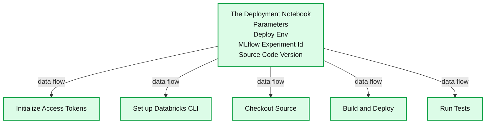

# Automate Deployment and Testing with Databricks Notebook + MLflow

- Source: https://www.databricks.com/blog/2020/01/16/automate-deployment-and-testing-with-databricks-notebook-mlflow.html
- Published: 2020-01-16
- Authors: Li Yu, Jonathan Eng, Yong Sheng Huang, Peter Tamisin
- Categories: engineering, data-science-machine-learning
- Images: 4 total, 2 extracted as architecture

Today many data science (DS) organizations are accelerating the agile analytics development process using Databricks notebooks.  Fully leveraging the distributed computing power of Apache Spark™, these organizations are able to interact easily with data at multi-terabytes scale, from exploration to fast prototype and all the way to productionize sophisticated machine learning (ML) models.  As fast iteration is achieved at high velocity, what has become increasingly evident is that it is non-trivial to manage the DS life cycle for efficiency, reproducibility, and high-quality. The challenge multiplies in large enterprises where data volume grows exponentially, the expectation of ROI is high on getting business value from data, and cross-functional collaborations are common.

In this blog, we introduce a joint work with [Iterable](https://iterable.com/) that hardens the DS process with best practices from software development.  This approach automates building, testing, and deployment of DS workflow from inside Databricks notebooks and integrates fully with MLflow and Databricks CLI. It enables proper version control and comprehensive logging of important metrics, including functional and integration tests, model performance metrics, and data lineage. All of these are achieved without the need to maintain a separate build server.

## Overview

In a typical software development workflow (e.g. Github flow), a feature branch is created based on the master branch for feature development. A notebook can be synced to the feature branch via [Github integration](https://docs.databricks.com/notebooks/github-version-control.html). Or a notebook can be exported from Databrick workspace to your laptop and code changes are committed to the feature branch with git commands. When the development is ready for review, a Pull Request (PR) will be set up and the feature branch will be deployed to a staging environment for integration testing. Once tested and approved, the feature branch will be merged into the master branch. The master branch is always ready to be deployed to production environments.

**Summary:** CI/CD workflow showing code development, testing, pull requests, and promotion through staging and production environments.

**Components:**

- Code Development - source code development
- Tests - software tests
- Pull Request - GitHub pull request
- Staging Env - staging deployment environment
- Deploy and Test Notebook - Databricks notebook for deployment and testing
- Master in GitHub - GitHub master branch
- Prod Env - production deployment environment

**Flows:**

- Code Development -> Tests: code changes for testing
- Tests -> Code Development: test feedback and revisions
- Tests -> Pull Request: tested feature branch
- Pull Request -> Staging Env: feature branch deployment
- Staging Env -> Pull Request: integration test results
- Pull Request -> Master in GitHub: approved merge
- Master in GitHub -> Prod Env: production deployment
- Prod Env -> Master in GitHub: production test results

**Numbers:** none

source image: https://www.databricks.com/wp-content/uploads/2020/01/cicd-workflow.png

```mermaid
%% CI/CD workflow from development through staging and production
flowchart LR
    CD[Code Development] <--> |code and feedback| T[Tests]
    T --> |tested feature branch| PR[Pull Request]
    PR --> |deploy feature branch| S[Staging Env]
    S --> |integration test results| PR
    PR --> |approved merge| M[Master in GitHub]
    M --> |deploy master branch| P[Prod Env]
    P --> |production test results| M

    N1[Deploy and Test Notebook] --> |deploy and test| S
    N2[Deploy and Test Notebook] --> |deploy and test| P

    subgraph Legend
        L1[client]
        L2[service]
        L3[store]
        L4[cache]
        L5[queue]
        L6[critical]
        L7[external]
        L8[decision]
    end

    classDef client   fill:#dbeafe,stroke:#2563eb,stroke-width:2px,color:#111
    classDef service  fill:#dcfce7,stroke:#16a34a,stroke-width:2px,color:#111
    classDef store    fill:#ede9fe,stroke:#7c3aed,stroke-width:2px,color:#111
    classDef cache    fill:#fef3c7,stroke:#d97706,stroke-width:2px,color:#111
    classDef queue    fill:#cffafe,stroke:#0891b2,stroke-width:2px,color:#111
    classDef critical fill:#fee2e2,stroke:#dc2626,stroke-width:4px,color:#111
    classDef external fill:#e5e7eb,stroke:#6b7280,stroke-width:2px,color:#111,stroke-dasharray:4 3
    classDef decision fill:#fce7f3,stroke:#db2777,stroke-width:2px,color:#111

    class CD,T,PR,N1,N2 service
    class S,P service
    class M store
    class L1 client
    class L2 service
    class L3 store
    class L4 cache
    class L5 queue
    class L6 critical
    class L7 external
    class L8 decision
```

In our approach, the driver of the deployment and testing processes is a notebook. The driver notebook can run on its own cluster or a dedicated high-concurrency cluster shared with other deployment notebooks. The notebooks can be triggered manually or they can be integrated with a build server for a full-fledged CI/CD implementation. The input parameters include the deployment environment (testing, staging, prod, etc), an experiment id,  with which MLflow logs messages and artifacts, and source code version.

**Summary:** The deployment notebook accepts deployment parameters and distributes data flow across five deployment and testing stages.

**Components:**

- Deployment Notebook using Databricks Notebook
- Deploy Env parameter
- MLflow Experiment Id parameter using MLflow
- Source Code Version parameter
- Initialize Access Tokens
- Set up Databricks CLI using Databricks CLI
- Checkout Source using a source code repository
- Build and Deploy
- Run Tests

**Flows:**

- Deployment Notebook -> Initialize Access Tokens: data flow
- Deployment Notebook -> Set up Databricks CLI: data flow
- Deployment Notebook -> Checkout Source: data flow
- Deployment Notebook -> Build and Deploy: data flow
- Deployment Notebook -> Run Tests: data flow

**Numbers:** none

source image: https://www.databricks.com/wp-content/uploads/2020/01/dev-notebooks.png

As depicted in the workflow below, the driver notebook starts by initializing the access tokens to both the Databricks workspace and the source code repo (e.g. github). The building and deploying process runs on the driver node of the cluster, and the build artifacts will be deployed to a dbfs directory. The deploy status and messages can be logged as part of the current MLflow run.

After the deployment, functional and integration tests can be triggered by the driver notebook. The test results are logged as part of a run in an MLflow experiment. The test results from different runs can be tracked and compared with MLflow. In this blog, python and scala code are provided as examples of how to utilize MLflow tracking capabilities in your tests.

## Automate Notebooks Deployment Process

First of all, a uuid and a dedicated work directory is created for a deployment so that concurrent deployments are isolated from each other.  The following code snippet shows how the deploy uuid is assigned from the active run id of an MLflow experiment, and how the working directory is created.

To authenticate and access Databricks CLI and Github, you can set up personal access tokens. Details of setting up CLI authentication can be found at: [Databricks CLI > Set up authentication](https://docs.databricks.com/dev-tools/cli/index.html#set-up-authentication).  Access tokens should be treated with care. Explicitly including the tokens in the notebooks can be dangerous. The tokens can accidentally be exposed when the notebook is exported and shared with other users.

One way to protect your tokens is to store the tokens in Databricks secrets. A scope needs to be created first:

`databricks secrets create-scope --scope cicd-test `

To store a token in a scope:

`databricks secrets put --scope cicd-test --key token`

To access the tokens stored in secrets, `dbutils.secrets.get` can be utilized. The fetched tokens are displayed in notebooks as [REDACTED]. The permission to access a token can be defined using Secrets ACL. For more details about the secrets API, please refer to [Databricks Secrets API](https://docs.databricks.com/dev-tools/api/latest/secrets.html).

The following code snippet shows how secrets are retrieved from a scope:

Databricks access can be set up via `.databrickscfg` file as follows. Please note that each working directory has its own `.databrickscfg` file to support concurrent deployments.

The following code snippet shows how to check out the source code from Github given a code version. The building process is not included but can be added after the checkout step. After that, the artifact is deployed to a [dbfs location](https://docs.databricks.com/data/databricks-file-system.html), and notebooks can be imported to Databricks workspace.

### Deploy Tracking

For visibility into the state of our deployment, we normally might store that in a database or use some sort of managed deployment service with a UI. In our case, we can use MLflow for those purposes.

The metadata such as deploy environment, app name, notes can be logged by MLflow tracking API:

## Triggering Notebooks

Now that we have deployed our notebooks into our workspace path, we need to be able to trigger the correct version of the set of notebooks given the environment. We may have notebooks on version A in the prd environment while simultaneously testing version B in our staging environment.

Every deployment system needs a source of truth for the mappings for the “deployed” githash for each environment. For us, we leverage Databricks Delta since it provides us with transactional guarantees.

For us, we simply look up in the deployment delta table the githash for a given environment and run the notebook at that path.

`dbutils.notebook.run(PATH_PREFIX + s“${git_hash}/notebook”, ...)`

 

## In Production

At Iterable, we needed to move quickly and avoid setting up the heavy infrastructure to have a deployment and triggering system if possible. Hence we developed this approach with Li at Databricks such that we could conduct most of our workflow within Databricks itself, leverage Delta as a database, and use MLflow for a view for the state of truth for deployments.

Because our data-scientists work within Databricks and can now deploy their latest changes all within Databricks, leveraging the UI that MLflow and Databricks notebooks provide, we are able to iterate quickly while having a robust deployment and triggering system that has zero downtime between deployments.

## Implement tests

Tests and validation can be added to your notebooks by calling assertion statements. However error messages from assertion scatter across notebooks, and there is no overview of the testing results available. In this section, we are going to show you how to automate tests from notebooks and track the results using MLflow tracking APIs.

In our example, a driver notebook serves as the main entry point for all the tests. The driver notebook is source controlled and can be invoked from the deployment notebook. In the driver notebook, a list of tests/test notebooks is defined and looped through to run and generate test results. The tests can be a set of regression tests and tests specific to the current branch. The driver notebook handles creating the MLflow scope and logs the test results to the proper run of an experiment.

The picture below shows a screenshot of an experiment of MLflow, which contains testing results from different runs. Each run is based on a code version (git commit), which is also logged as a parameter of the run.

The MLflow UI provides powerful capabilities for end-users to explore and analyze the results of their experiments. The result table can be filtered by specific parameters and metrics. Metrics from different runs can be compared and generate a trend of the metric like below:

Unit tests of individual functions are also tracked by MLflow. A common testing fixture can be implemented for logging metadata of tests. Test classes will inherit this common fixture to include MLflow tracking capability to the tests. Our current implementation is based on [ScalaTest](https://www.scalatest.org/), though similar implementation can be done with other testing framework as well.

The code example below shows how a fixture (`testTracker`) can be defined by overriding the `withFixture` method on `TestSuiteMixin`. A test function is passed to `withFixture` and executed inside `withFixture`. This way, `withFixture` servers as a wrapper function of the test. Pre and post-processing code can be implemented inside `withFixture`. In our case, preprocessing is to record the start time of the test, and post-processing is to log metadata of a test function. Any test suite which inherits this fixture will automatically run this fixture before and after each test to log the metadata of the test.

A test suite needs to extend from `TestTracker` to incorporate the logging capability to its own tests. The code example below shows how to inherit the testing metadata logging capability from the fixture defined above:

## Discussion

In this blog, we have reviewed how to build a CI/CD pipeline combining the capability of Databricks CLI and MLflow. The main advantages of this approach are:

- Deploy notebooks to production without having to set up and maintain a build server.
- Log metrics of tests automatically.
- Provide query capability of tests.
- Provide an overview of deployment status and test results.
- ML algorithm performance is tracked and can be analyzed (e.g. detect model drift, performance degradation).

With this approach, you can quickly set up a production pipeline in the Databricks environment. You can also extend the approach by adding more constraints and steps for your own productization process.

## Credits

We want to thank the following contributors: Denny Lee, Ankur Mathur, Christopher Hoshino-Fish, Andre Mesarovic, and Clemens Mewald
