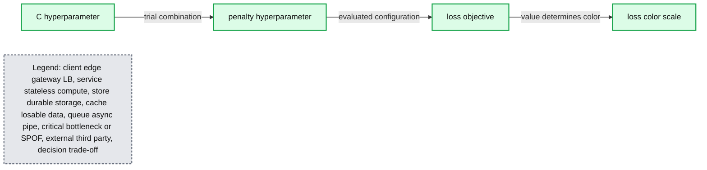
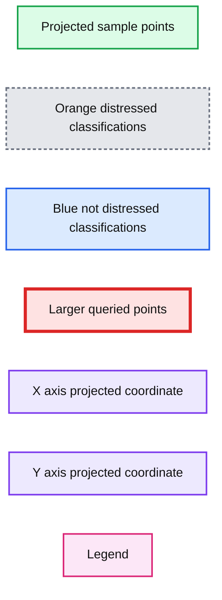

# Better Machine Learning through Active Learning

- Source: https://www.databricks.com/blog/2020/01/16/better-machine-learning-through-active-learning.html
- Published: 2020-01-16
- Authors: Sean Owen
- Categories: company, data-science-machine-learning, open-source
- Images: 6 total, 2 extracted as architecture

> [Try this notebook](https://www.databricks.com/notebooks/active_learning.html) to reproduce the steps outlined below

Machine learning models can seem like magical savants. They can distinguish [hot dogs from not-hot-dogs](https://medium.com/@timanglade/how-hbos-silicon-valley-built-not-hotdog-with-mobile-tensorflow-keras-react-native-ef03260747f3), but that's long since an easy trick. My aunt's parrot can do that too. But machine-learned models power voice-activated assistants that effortlessly understand noisy human speech, and cars that drive themselves more or less safely. It's no wonder we assume these are at some level artificially 'intelligent'.

What they don't tell you is that these supervised models are more parrot than oracle. They learn by example, lots of them, and learn to emulate the connection between input and output that the examples suggest. Herein lies the problem that many companies face when embracing machine learning: the modeling is (relatively) easy. Having the right examples to learn from is not.

Obtaining these examples can be hard. One can't start collecting the last five years of data, today, of course. Where there is data, it may be just 'inputs' without desired 'outputs' to learn. Worse, producing that label is typically a manual process. After all, if there were an automated process for it, there would be no need to relearn it as a model!

Where labels are not readily available, some manual labeling is inevitable. Fortunately, not all data has to be labeled. A class of techniques commonly called ['active learning'](https://en.wikipedia.org/wiki/Active_learning_(machine_learning)) can make the process collaborative, wherein a model trained on some data helps identify data that are most useful to label next.

This example uses a Python library for active learning, [modAL](https://github.com/modAL-python/modAL), to assist a human in labeling data for a simple text classification problem. It will show how [Apache Spark](https://spark.apache.org/) can apply modAL at scale, and how open source tools like [Hyperopt](https://github.com/hyperopt/hyperopt) and [mlflow](https://mlflow.org/), as integrated with Spark in Databricks, can help along the way.

## Real-world Learning Problem: Classifying Consumer Complaints as "Distressed"

The US Consumer Financial Protection Bureau (CFPB) oversees financial institutions' relationship with consumers. It handles complaints from consumers. They have published an [anonymized data set of these complaints](https://catalog.data.gov/dataset/consumer-complaint-database). Most is simple tabular data, but it also contains the free text of a consumer's complaint (if present). Anyone who has handled customer support tickets will not be surprised by what they look like.

Imagine that the CFPB wants to prioritize or pre-emptively escalate handling of complaints that seem distressed: a consumer that is frightened or angry, would be raising voices on a call. It's a straightforward text classification problem -- if these complaints are already labeled accordingly. They are not. With over 440,000 complaints, it's not realistic to hand-label them all.

Accepting that, your author labeled about 230 of the complaints ([dataset](https://accounts.google.com/ServiceLogin?service=cds&passive=1209600&continue=https://storage.cloud.google.com/srowen-blog/labeled.csv&followup=https://storage.cloud.google.com/srowen-blog/labeled.csv)).

## Using Spark ML to Build the Initial Classification Model

Spark ML can construct a basic TF-IDF embedding of the text at scale. At the moment, only the handful of labeled examples need transformation, but the entire data set will need this transformation later.

 There is no value in applying distributed Spark ML at this scale. Instead, [scikit-learn](https://scikit-learn.org/stable/modules/generated/sklearn.linear_model.LogisticRegression.html) can fit the model on this tiny data set in seconds. However, Spark still has a role here. Fitting a model typically means fitting many variants on the model, varying 'hyperparameters' like more or less regularization. These variants can be fit in parallel by Spark. [Hyperopt](https://github.com/hyperopt/hyperopt) is an open-source tool [integrated with Spark in Databricks](https://docs.databricks.com/applications/machine-learning/automl-hyperparam-tuning/index.html) that can drive this search for optimal hyperparameters in a way that learns what combinations work best, rather than just randomly searching.

The attached notebook has a full code listing, but an edit of the key portion of the implementation follows:

 Hyperopt here tries 128 different hyperparameter combinations in its search. Here, it varies L1 vs L2 regularization penalty, and the strength of regularization, C. It returns the best settings it found, from which a final model is refit on train and validation data. Note that the results of these trials are automatically logged to mlflow, if using Databricks. The listing above shows that it's possible to log additional metrics like accuracy, not just 'loss' that Hyperopt records. It's clear, for example, that L1 regularization is better, incidentally:

**Summary:** Parallel-coordinates chart showing Hyperopt trial combinations across C, penalty, and loss, with line color representing loss.

**Components:**

- C: model hyperparameter
- penalty: regularization hyperparameter
- loss: trial objective metric
- Color scale: visual encoding of loss values

**Flows:**

- C -> penalty: trial hyperparameter combination
- penalty -> loss: evaluated model configuration
- loss -> Color scale: loss value determines line color

**Numbers:** 0, 1, 2, 0.8, 1.0, 1.2, 1.4, 1.6

source image: https://www.databricks.com/wp-content/uploads/2020/01/Better-Machine-Learning-through-Active-Learning-03.png

For the run with best loss of about 0.7, accuracy is only 60%. Further tuning and more sophisticated models could improve this, but there is only so far this can get with a small training set. More labeled data is needed.

## Applying modAL for Active Learning

This is where active learning comes in, via the [modAL](https://github.com/modAL-python/modAL) library. It is pleasantly simple to apply. When wrapped around a classifier or regressor that can return a probabilistic estimate of its prediction, it can analyze remaining data and decide which are most useful to label.

"Most useful" generally means labels for inputs that the classifier is currently most uncertain about. Knowing the label is more likely to improve the classifier than that of an input whose prediction is quite certain. modAL supports classifiers like logistic regression, whose output is a probability, via [ActiveLearner](https://modal-python.readthedocs.io/en/latest/content/models/ActiveLearner.html).

 It's necessary to prepare the 'pool' of remaining data for querying. This means featurizing the rest of the data, so it's handy that it was implemented with Spark ML:

 ActiveLearner's [query()](https://modal-python.readthedocs.io/en/latest/content/apireference/models.html#modAL.models.ActiveLearner.query) method returns most-uncertain instances from an unlabeled data set, but it can't directly operate in parallel via Spark. However Spark can apply it in parallel to chunks of the featurized data using a [pandas UDF](https://docs.databricks.com/spark/latest/spark-sql/udf-python-pandas.html), which efficiently presents the data as [pandas](https://pandas.pydata.org/) DataFrames or Series. Each can be independently queried with ActiveLearner then. Your author can only bear labeling a hundred or so more complaints, so this example tries to choose just about 0.02% of 440,000 in the pool:

Note that this isn't quite the same as selecting the best 0.02% to query from the entire pool of 440,000, because this selects the top 0.02% from each chunk of that data as a [pandas DataFrame](https://www.databricks.com/glossary/pandas-dataframe) separately. This won't necessarily give the very best query candidates. The upside is parallelism. This tradeoff is probably useful to make in practical cases, as the results will still be relatively much more useful than most to query.

## Understanding the Active Learner Queries

Indeed, the model returns probabilities between 49.9% and 50.1% for all complaints in the query. It is uncertain about all of them.

The input features can be plotted in two dimensions (via scikit-learn's [PCA](https://scikit-learn.org/stable/modules/generated/sklearn.decomposition.PCA.html)) with [seaborn](https://seaborn.pydata.org/) to visualize not only which complaints are classified as 'distressed', but which the learner has chosen for labeling.

 Here, orange points are 'distressed' and blue are not, according to the model so far. The larger points are some of those selected to query; they are all, as it happens, negative.

### Model Classification of (Projected) Sample, with Queried Points

**Summary:** Scatter plot showing model classifications and actively queried points in a projected sample.

**Components:**

- Projected sample points
- Orange distressed classifications
- Blue not distressed classifications
- Larger queried points
- X axis projected coordinate
- Y axis projected coordinate

**Flows:**

- none

**Numbers:** X axis: -0.6, -0.4, -0.2, 0.0, 0.2, 0.4, 0.6, 0.8, 1.0. Y axis: -1.00, -0.75, -0.50, -0.25, 0.00, 0.25, 0.50, 0.75, 1.00.

source image: https://www.databricks.com/wp-content/uploads/2020/01/Better-Machine-Learning-through-Active-Learning-05.png

Although hard to interpret visually, it does seem to choose points in regions where both classifications appear, not from uniform regions.

## Effects on Machine Learning Accuracy

Your author downloaded the query set from Databricks as CSV and dutifully labeled almost 100 more in a favorite spreadsheet program, then exported and uploaded it back to storage as CSV. A low-tech process like this -- a column in a spreadsheet -- may be just fine for small scale labeling. Of course it is also possible to save the query as a table that an external system uses to manage labeling.

The same process above can be repeated with the new, larger data set. **The result?** Cutting to the chase, it's 68% accuracy. Your mileage may vary. This time Hyperopt's search (see listing above) over hyperparameters found better models from nearly the first few trials and improved from there, rather than plateauing at about 60% accuracy.

## Learning Strategy Variations on modAL Queries

modAL has other [strategies](https://modal-python.readthedocs.io/en/latest/content/models/ActiveLearner.html#query-strategies) for choosing query candidates: max uncertainty sampling, max margin sampling and entropy sampling. These differ in the multi-class case, but are equivalent in a binary classification case such as this.

Also, for example, ActiveLearner's query_strategy can be customized to use "uncertainty batch sampling" to return queries ranked by uncertainty. This may be useful to prepare a longer list of queries to be labeled in order of usefulness as much as time permits before the next model build and query loop.

## Active Learning with Streaming

Above, the entire pool of candidates were available for the query() method. This is useful when choosing the best ones to query in a batch context. However it might be necessary to apply the same ideas to a stream of data, one at a time.

It's already of course possible to score the model against a stream of complaints and flag the ones that are predicted to be 'distressed' with high probability for preemptive escalation. However it might equally be useful, in some cases, to flag highly-uncertain inputs for evaluation by a data science team, before the model and learner are rebuilt.

In the simple binary classification case, this essentially reduces to finding where the model outputs a probability near 0.5. However modAL offers [other possibilities](https://modal-python.readthedocs.io/en/latest/content/query_strategies/uncertainty_sampling.html) for quantifying uncertainty that do differ in the multi-class case.

## Getting Started with Your Active Learning Problem

When we learn from data with supervised machine learning techniques, it's not how much data we have that counts, but how much labeled data. In some cases labels are expensive to acquire, manually. Fortunately active learning techniques, as implemented in open source tools like modAL, can help humans prioritize what to label. The recipe is:

- Label a small amount of data, if not already available
- Train an initial model
- Apply active learning to decide what to label
- Train a new model and repeat until accuracy is sufficient or you run out of labelers' patience

modAL can be applied at scale with Apache Spark, and integrates well with other standard open source tools like scikit-learn, Hyperopt, and mlflow.

Complaints about this blog? Please contact the CFPB.
