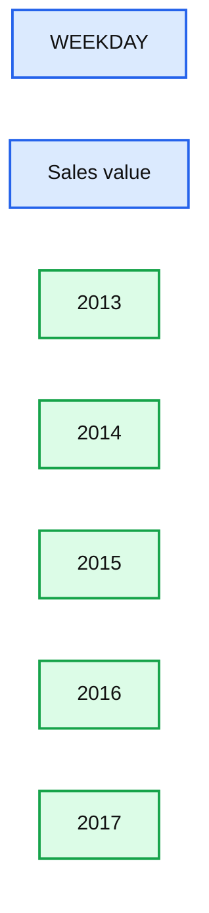
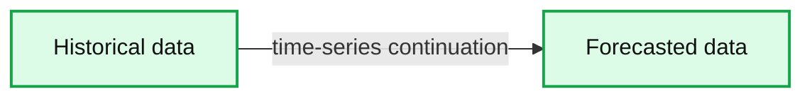

# Fine-Grained Time Series Forecasting At Scale With Facebook Prophet And Apache Spark

- Source: https://www.databricks.com/blog/2020/01/27/time-series-forecasting-prophet-spark.html
- Published: 2020-01-27
- Authors: Bilal Obeidat, Bryan Smith, Brenner Heintz
- Categories: platform, engineering, open-source, data-science-machine-learning, company
- Images: 5 total, 3 extracted as architecture

Try this time series forecasting notebook in our [Solution Accelerator for Demand Forecasting](https://www.databricks.com/solutions/accelerators/demand-forecasting).

Advances in time series forecasting are enabling retailers to generate more reliable demand forecasts. The challenge now is to produce these forecasts in a timely manner and at a level of granularity that allows the business to make precise adjustments to product inventories. Leveraging [Apache Spark™](https://www.databricks.com/spark/about) and [Facebook Prophet](https://facebook.github.io/prophet/), more and more enterprises facing these challenges are finding they can overcome the scalability and accuracy limits of past solutions.

In this post, we'll discuss the importance of time series forecasting, visualize some sample time series data, then build a simple model to show the use of Facebook Prophet. Once you're comfortable building a single model, we'll combine Prophet with the magic of Apache Spark™ to show you how to train hundreds of models at once, allowing us to create precise forecasts for each individual product-store combination at a level of granularity rarely achieved until now.

## Accurate and timely forecasting is now more important than ever

Improving the speed and accuracy of time series analyses in order to better forecast demand for products and services is critical to retailers’ success. If too much product is placed in a store, shelf and storeroom space can be strained, products can expire, and retailers may find their financial resources are tied up in inventory, leaving them unable to take advantage of new opportunities generated by manufacturers or shifts in consumer patterns. If too little product is placed in a store, customers may not be able to purchase the products they need. Not only do these forecast errors result in an immediate loss of revenue to the retailer, but over time consumer frustration may drive customers towards competitors.

### New expectations require more precise time series forecasting methods and models

For some time, enterprise resource planning (ERP) systems and third-party solutions have provided retailers with demand forecasting capabilities based upon simple time series models. But with advances in technology and increased pressure in the sector, many retailers are looking to move beyond the linear models and more traditional algorithms historically available to them.

New capabilities, such as those provided by [Facebook Prophet](https://facebook.github.io/prophet/), are emerging from the data science community, and companies are seeking the flexibility to apply these machine learning models to their time series forecasting needs.

This movement away from traditional forecasting solutions requires retailers and the like to develop in-house expertise not only in the complexities of demand forecasting but also in the efficient distribution of the work required to generate hundreds of thousands or even millions of machine learning models in a timely manner. Luckily, we can use Spark to distribute the training of these models, making it possible to predict not just overall demand for products and services, but the unique demand for each product in each location.

## Visualizing demand seasonality in time series data

To demonstrate the use of Prophet to generate fine-grained demand forecasts for individual stores and products, we will use a publicly available [data set](https://www.kaggle.com/c/demand-forecasting-kernels-only/data) from Kaggle. It consists of 5 years of daily sales data for 50 individual items across 10 different stores.

To get started, let's look at the overall yearly sales trend for all products and stores. As you can see, total product sales are increasing year over year with no clear sign of convergence around a plateau.

**Summary:** The chart shows yearly total sales increasing from 2013 through 2017.

**Components:**

- Year axis
- Sales axis
- 2013 sales at 7.95M
- 2014 sales at 9.15M
- 2015 sales at 9.55M
- 2016 sales at 10.85M
- 2017 sales at 11.25M

**Flows:**

- 2013 sales -> 2014 sales: increasing yearly sales
- 2014 sales -> 2015 sales: increasing yearly sales
- 2015 sales -> 2016 sales: increasing yearly sales
- 2016 sales -> 2017 sales: increasing yearly sales

**Numbers:** 2013, 2014, 2015, 2016, 2017, 8.0M, 8.5M, 9.0M, 9.5M, 10M, 11M, 7.95M, 9.15M, 9.55M, 10.85M, 11.25M

```mermaid
%% Yearly sales trend from 2013 through 2017
flowchart LR
    A[2013 sales 7.95M] -->|sales increase| B[2014 sales 9.15M]
    B -->|sales increase| C[2015 sales 9.55M]
    C -->|sales increase| D[2016 sales 10.85M]
    D -->|sales increase| E[2017 sales 11.25M]

    classDef client fill:#dbeafe,stroke:#2563eb,stroke-width:2px,color:#111
    classDef service fill:#dcfce7,stroke:#16a34a,stroke-width:2px,color:#111
    classDef store fill:#ede9fe,stroke:#7c3aed,stroke-width:2px,color:#111
    classDef cache fill:#fef3c7,stroke:#d97706,stroke-width:2px,color:#111
    classDef queue fill:#cffafe,stroke:#0891b2,stroke-width:2px,color:#111
    classDef critical fill:#fee2e2,stroke:#dc2626,stroke-width:4px,color:#111
    classDef external fill:#e5e7eb,stroke:#6b7280,stroke-width:2px,color:#111,stroke-dasharray:4 3
    classDef decision fill:#fce7f3,stroke:#db2777,stroke-width:2px,color:#111

    class A,B,C,D,E service
```

source image: https://www.databricks.com/wp-content/uploads/2020/01/Yearly-Demand-Forecasting-Chart.jpg

Next, by viewing the same data on a monthly basis, we can see that the year-over-year upward trend doesn't progress steadily each month. Instead, we see a clear seasonal pattern of peaks in the summer months, and troughs in the winter months. Using the built-in data visualization feature of [Databricks Collaborative Notebooks](https://www.databricks.com/product/collaborative-notebooks), we can see the value of our data during each month by mousing over the chart.

At the weekday level, sales peak on Sundays (weekday 0), followed by a hard drop on Mondays (weekday 1), then steadily recover throughout the rest of the week.

**Summary:** Line chart showing weekday sales patterns across years 2013 through 2017, with Sunday peaks, Monday drops, and gradual recovery.

**Components:**

- WEEKDAY axis
- Sales value axis
- Year series for 2013
- Year series for 2014
- Year series for 2015
- Year series for 2016
- Year series for 2017

**Flows:**

- none

**Numbers:** 0, 1, 2, 3, 4, 5, 6, 0.00, 10k, 20k, 30k, 2013, 2014, 2015, 2016, 2017

source image: https://www.databricks.com/wp-content/uploads/2020/01/Demand-forecasting-weekly-sales.jpg

## Getting started with a simple time series forecasting model on Facebook Prophet

As illustrated in the charts above, our data shows a clear year-over-year upward trend in sales, along with both annual and weekly seasonal patterns. It’s these overlapping patterns in the data that Prophet is designed to address.

Facebook Prophet follows the scikit-learn API, so it should be easy to pick up for anyone with experience with sklearn. We need to pass in a 2 column [pandas DataFrame](https://www.databricks.com/glossary/pandas-dataframe) as input: the first column is the date, and the second is the value to predict (in our case, sales). Once our data is in the proper format, building a model is easy:

Now that we have fit our model to the data, let's use it to build a 90 day forecast. In the code below, we define a dataset that includes both historical dates and 90 days beyond, using prophet's `make_future_dataframe` method:

That's it! We can now visualize how our actual and predicted data line up as well as a forecast for the future using Prophet's built-in .plot method. As you can see, the weekly and seasonal demand patterns we illustrated earlier are in fact reflected in the forecasted results.

**Summary:** Time-series sales plot showing historical data and forecasted data separated by a dashed boundary.

**Components:**

- Historical data using black actual-sales points and blue predictions
- Forecasted data using a blue forecast line and uncertainty band
- Sales measured on the vertical axis
- Date measured on the horizontal axis

**Flows:**

- Historical data -> Forecasted data: time-series continuation across the forecast boundary

**Numbers:** 0, 10, 20, 30, 40, 50; 2017-02, 2017-04, 2017-06, 2017-08, 2017-10, 2017-12, 2018-02, 2018-04

source image: https://www.databricks.com/wp-content/uploads/2020/01/time-series-forecasting-prophet-prediction-chart.jpg

This visualization is a bit busy. Bartosz Mikulski provides [an excellent breakdown](https://www.mikulskibartosz.name/prophet-plot-explained/) of it that is well worth checking out. In a nutshell, the black dots represent our actuals with the darker blue line representing our predictions and the lighter blue band representing our (95%) uncertainty interval.

## Training hundreds of time series forecasting models in parallel with Prophet and Spark

Now that we've demonstrated how to build a single time series forecasting model, we can use the power of Apache Spark to multiply our efforts. Our goal is to generate not one forecast for the entire dataset, but hundreds of models and forecasts for each product-store combination, something that would be incredibly time consuming to perform as a sequential operation.

Building models in this way could allow a grocery store chain, for example, to create a precise forecast for the amount of milk they should order for their Sandusky store that differs from the amount needed in their Cleveland store, based upon the differing demand at those locations.

### How to use Spark DataFrames to distribute the processing of time series data

Data scientists frequently tackle the challenge of training large numbers of models using a distributed data processing engine such as [Apache Spark](https://www.databricks.com/spark/about). By leveraging a [Spark cluster](https://docs.databricks.com/clusters/index.html), individual worker nodes in the cluster can train a subset of models in parallel with other worker nodes, greatly reducing the overall time required to train the entire collection of time series models.

Of course, training models on a cluster of worker nodes (computers) requires more cloud infrastructure, and this comes at a price. But with the easy availability of on-demand cloud resources, companies can quickly provision the resources they need, train their models, and release those resources just as quickly, allowing them to achieve massive scalability without long-term commitments to physical assets.

The key mechanism for achieving distributed data processing in Spark is the [DataFrame](https://www.databricks.com/glossary/what-are-dataframes). By loading the data into a Spark DataFrame, the data is distributed across the workers in the cluster. This allows these workers to process subsets of the data in a parallel manner, reducing the overall amount of time required to perform our work.

Of course, each worker needs to have access to the subset of data it requires to do its work. By grouping the data on key values, in this case on combinations of store and item, we bring together all the time series data for those key values onto a specific worker node.

>  We share the groupBy code here to underscore how it enables us to train many models in parallel efficiently, although it will not actually come into play until we set up and apply a UDF to our data in the next section.

### Leveraging the power of pandas user-defined functions (UDFs)

With our time series data properly grouped by store and item, we now need to train a single model for each group. To accomplish this, we can use a pandas User-Defined Function (UDF), which allows us to apply a custom function to each group of data in our DataFrame.

This UDF will not only train a model for each group, but also generate a result set representing the predictions from that model. But while the function will train and predict on each group in the DataFrame independent of the others, the results returned from each group will be conveniently collected into single resulting DataFrame. This will allow us to generate store-item level forecasts but present our results to analysts and managers as a single output dataset.

As you can see in the abbreviated Python code below, building our UDF is relatively straightforward. The UDF is instantiated with the `pandas_udf` method which identifies the schema of the data it will return and the type of data it expects to receive. Immediately following this, we define the function that will perform the work of the UDF.

Within the function definition, we instantiate our model, configure it and fit it to the data it has received. The model makes a prediction, and that data is returned as the output of the function.

Now, to bring it all together, we use the `groupBy` command we discussed earlier to ensure our dataset is properly partitioned into groups representing specific store and item combinations. We then simply `apply` the UDF to our DataFrame, allowing the UDF to fit a model and make predictions on each grouping of data.

The dataset returned by the application of the function to each group is updated to reflect the date on which we generated our predictions. This will help us keep track of data generated during different model runs as we eventually take our functionality into production.

## Next steps

We have now constructed a time series forecasting mdoel for each store-item combination. Using a SQL query, analysts can view the tailored forecasts for each product. In the chart below, we've plotted the projected demand for product #1 across 10 stores. As you can see, the demand forecasts vary from store to store, but the general pattern is consistent across all of the stores, as we would expect.

As new sales data arrives, we can efficiently generate new forecasts and append these to our existing table structures, allowing analysts to update the business’s expectations as conditions evolve.

To learn more, watch the on-demand webinar entitled [How Starbucks Forecasts Demand at Scale with Facebook Prophet and Azure Databricks](https://www.databricks.com/p/webinar/starbucks-forecast-demand-at-scale-facebook-prophet-azure-databricks) and check out our [Solution Accelerator for Demand Forecasting](https://www.databricks.com/solutions/accelerators/demand-forecasting).
