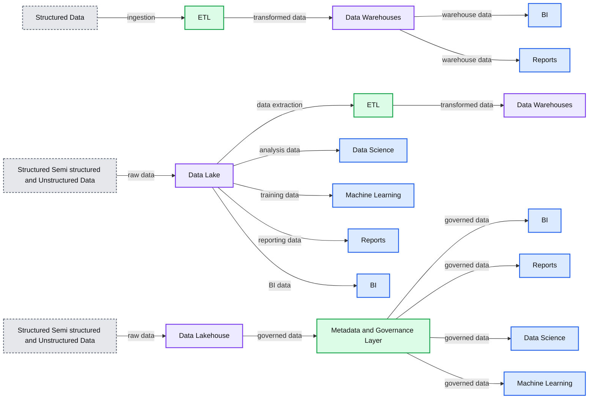

# What Is a Lakehouse?

- Source: https://www.databricks.com/blog/2020/01/30/what-is-a-data-lakehouse.html
- Published: 2020-01-30
- Authors: Ben Lorica, Michael Armbrust, Reynold Xin, Matei Zaharia, Ali Ghodsi
- Categories: platform, engineering
- Images: 1 total, 1 extracted as architecture

Over the past few years at Databricks, we've seen a new data management architecture that emerged independently across many customers and use cases: [the lakehouse](https://www.databricks.com/blog/2021/08/30/frequently-asked-questions-about-the-data-lakehouse.html). In this post we describe this new architecture and its advantages over previous approaches.

Data warehouses have a [long history](https://en.wikipedia.org/wiki/Data_warehouse#History) in decision support and business intelligence applications. Since its inception in the late 1980s, data warehouse technology continued to evolve and MPP architectures led to systems that were able to handle larger data sizes. But while warehouses were great for structured data, a lot of modern enterprises have to deal with unstructured data, semi-structured data, and data with high variety, velocity, and volume. Data warehouses are not suited for many of these use cases, and they are certainly not the most cost efficient.

As companies began to collect large amounts of data from many different sources, architects began envisioning a single system to house data for many different analytic products and workloads. About a decade ago companies began building [data lakes](https://www.databricks.com/discover/data-lakes/introduction) - repositories for raw data in a variety of formats. While suitable for storing data, data lakes lack some critical features: they do not support transactions, they do not enforce data quality, and their lack of consistency / isolation makes it almost impossible to mix appends and reads, and batch and streaming jobs. For these reasons, many of the promises of the data lakes have not materialized, and in many cases leading to a loss of many of the benefits of data warehouses.

The need for a flexible, high-performance system hasn't abated. Companies require systems for diverse data applications including SQL analytics, real-time monitoring, data science, and machine learning. Most of the recent advances in AI have been in better models to process unstructured data (text, images, video, audio), but these are precisely the types of data that a data warehouse is not optimized for. A common approach is to use multiple systems - a data lake, several data warehouses, and other specialized systems such as streaming, time-series, graph, and image databases. Having a multitude of systems introduces complexity and more importantly, introduces delay as data professionals invariably need to move or copy data between different systems.

**Summary:** The diagram compares how structured, semi-structured, and unstructured data flows through data warehouses, data lakes, and a unified data lakehouse.

**Components:**

- Data Warehouse using data warehouses, ETL, structured data, BI, and reports
- Data Lake using data warehouses, ETL, structured, semi-structured, and unstructured data, BI, reports, data science, and machine learning
- Data Lakehouse using a data lake, metadata and governance layer, structured, semi-structured, and unstructured data, BI, reports, data science, and machine learning
- BI
- Reports
- Data Science
- Machine Learning
- ETL
- Data Warehouses
- Data Lake
- Metadata and Governance Layer
- Structured Data
- Structured, Semi-structured and Unstructured Data

**Flows:**

- Structured Data -> ETL: structured data ingestion
- ETL -> Data Warehouses: transformed data
- Data Warehouses -> BI: warehouse data for BI
- Data Warehouses -> Reports: warehouse data for reports
- Structured, Semi-structured and Unstructured Data -> Data Lake: raw data storage
- Data Lake -> ETL: data extraction for transformation
- ETL -> Data Warehouses: transformed data
- Data Lake -> BI: lake data for BI
- Data Lake -> Reports: lake data for reports
- Data Lake -> Data Science: data for analysis
- Data Lake -> Machine Learning: data for machine learning
- Structured, Semi-structured and Unstructured Data -> Data Lakehouse: raw data storage
- Data Lakehouse -> Metadata and Governance Layer: governed lakehouse data
- Metadata and Governance Layer -> BI: governed data for BI
- Data Lakehouse -> Data Science: governed data for data science
- Data Lakehouse -> Reports: governed data for reports
- Data Lakehouse -> Machine Learning: governed data for machine learning

**Numbers:** none

source image: https://www.databricks.com/wp-content/uploads/2020/01/data-lakehouse-new.png

## What is a lakehouse?

New systems are beginning to emerge that address the limitations of data lakes. A lakehouse is a new, open architecture that combines the best elements of data lakes and data warehouses. Lakehouses are enabled by a new system design: implementing similar data structures and data management features to those in a data warehouse directly on top of low cost cloud storage in open formats. They are what you would get if you had to redesign data warehouses in the modern world, now that cheap and highly reliable storage (in the form of object stores) are available.

**A lakehouse has the following key features:**

- **Transaction support:** In an enterprise lakehouse many data pipelines will often be reading and writing data concurrently. Support for ACID transactions ensures consistency as multiple parties concurrently read or write data, typically using SQL.
- **Schema enforcement and governance:** The Lakehouse should have a way to support schema enforcement and evolution, supporting DW schema architectures such as star/snowflake-schemas. The system should be able to [reason about data integrity](https://www.databricks.com/blog/2019/08/21/diving-into-delta-lake-unpacking-the-transaction-log.html), and it should have robust governance and auditing mechanisms.
- **BI support:** Lakehouses enable using BI tools directly on the source data. This reduces staleness and improves recency, reduces latency, and lowers the cost of having to operationalize two copies of the data in both a data lake and a warehouse.
- **Storage is decoupled from compute:** In practice this means storage and compute use separate clusters, thus these systems are able to scale to many more concurrent users and larger data sizes. Some modern data warehouses also have this property.
- **Openness:** The storage formats they use are open and standardized, such as Parquet, and they provide an API so a variety of tools and engines, including machine learning and Python/R libraries, can efficiently access the data **directly**.
- **Support for diverse data types ranging from unstructured to structured data**: The lakehouse can be used to store, refine, analyze, and access data types needed for many new data applications, including images, video, audio, semi-structured data, and text.
- **Support for diverse workloads: **including data science, machine learning, and SQL and analytics. Multiple tools might be needed to support all these workloads but they all rely on the same data repository.
- **End-to-end streaming:** Real-time reports are the norm in many enterprises. Support for streaming eliminates the need for separate systems dedicated to serving real-time data applications.

These are the key attributes of lakehouses. Enterprise grade systems require additional features. Tools for security and access control are basic requirements. Data governance capabilities including auditing, retention, and lineage have become essential particularly in light of recent privacy regulations. Tools that enable data discovery such as data catalogs and data usage metrics are also needed. With a lakehouse, such enterprise features only need to be implemented, tested, and administered for a single system.

Read the full research paper on the [inner workings of the Lakehouse](https://www.databricks.com/research/lakehouse-a-new-generation-of-open-platforms-that-unify-data-warehousing-and-advanced-analytics).

## Some early examples

The [Databricks Lakehouse Platform](https://www.databricks.com/product/data-lakehouse) has the architectural features of a lakehouse. Microsoft's [Azure Synapse Analytics](https://azure.microsoft.com/en-us/blog/simply-unmatched-truly-limitless-announcing-azure-synapse-analytics/) service, which [integrates with Azure Databricks](https://www.databricks.com/blog/2019/11/04/new-microsoft-azure-data-warehouse-service-and-azure-databricks-combine-analytics-bi-and-data-science.html), enables a similar lakehouse pattern. Other managed services such as [BigQuery](https://cloud.google.com/bigquery/) and [Redshift Spectrum](https://docs.aws.amazon.com/redshift/latest/dg/c-using-spectrum.html) have some of the lakehouse features listed above, but they are examples that focus primarily on BI and other SQL applications. Companies who want to build and implement their own systems have access to open source file formats ([Delta Lake](https://delta.io/), [Apache Iceberg](https://iceberg.apache.org/), [Apache Hudi](https://hudi.apache.org/)) that are suitable for building a lakehouse.

Merging data lakes and data warehouses into a single system means that data teams can move faster as they are able use data without needing to access multiple systems. The level of SQL support and integration with BI tools among these early lakehouses are generally sufficient for most enterprise data warehouses. Materialized views and stored procedures are available but users may need to employ other mechanisms that aren't equivalent to those found in traditional data warehouses. The latter is particularly important for "[lift and shift scenarios](https://whatis.techtarget.com/definition/lift-and-shift)", which require systems that achieve semantics that are almost identical to those of older, commercial data warehouses.

What about support for other types of data applications? Users of a lakehouse have access to a variety of standard tools ([Spark](https://www.databricks.com/glossary/apache-spark-as-a-service), Python, R, machine learning libraries) for non BI workloads like data science and machine learning. Data exploration and refinement are standard for many analytic and data science applications. Delta Lake is designed to let users incrementally improve the quality of data in their lakehouse until it is ready for consumption.

A note about technical building blocks. While distributed file systems can be used for the storage layer, objects stores are more commonly used in lakehouses. Object stores provide low cost, highly available storage, that excel at massively parallel reads - an essential requirement for modern data warehouses.

## From BI to AI

The lakehouse is a new data management architecture that radically simplifies enterprise data infrastructure and accelerates innovation in an age when machine learning is poised to disrupt every industry. In the past most of the data that went into a company's products or decision making was structured data from operational systems, whereas today, many products incorporate AI in the form of computer vision and speech models, text mining, and others. Why use a lakehouse instead of a data lake for AI? A lakehouse gives you data versioning, governance, security and ACID properties that are needed even for unstructured data.

Current lakehouses reduce cost but their performance can still lag specialized systems (such as data warehouses) that have years of investments and real-world deployments behind them. Users may favor certain tools (BI tools, IDEs, notebooks) over others so lakehouses will also need to improve their UX and their connectors to popular tools so they can appeal to a variety of personas. These and other issues will be addressed as the technology continues to mature and develop. Over time lakehouses will close these gaps while retaining the core properties of being simpler, more cost efficient, and more capable of serving diverse data applications.

Read the [FAQ on Data Lakehouse](https://www.databricks.com/blog/2021/08/30/frequently-asked-questions-about-the-data-lakehouse.html) for more details.
