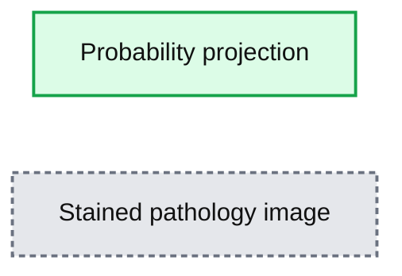

# Automating Digital Pathology Image Analysis with Machine Learning on Databricks

- Source: https://www.databricks.com/blog/2020/01/31/automating-digital-pathology-image-analysis-with-machine-learning-on-databricks.html
- Published: 2020-01-31
- Authors: Amir Kermany, Frank Austin Nothaft
- Categories: engineering, solution-accelerators, open-source, data-science-machine-learning
- Images: 4 total, 2 extracted as architecture

>  Check out our [solution accelerator](https://www.databricks.com/solutions/accelerators/digital-pathology) for automating digital pathology analysis or watch our [on-demand webinar](https://www.databricks.com/p/webinar/automating-the-analysis-of-digital-pathology-images-with-deep-learning?itm_data=blog-promo-digitalpathologyimages) to learn more.

With technological advancements in imaging and the availability of new efficient computational tools, digital pathology has taken center stage in both research and diagnostic settings. Whole Slide Imaging (WSI) has been at the center of this transformation, enabling us to rapidly digitize pathology slides into high resolution images. By making slides instantly shareable and analyzable, WSI has already improved reproducibility and enabled enhanced education and remote pathology services.

Today, digitization of entire slides at very high resolution can occur inexpensively in less than a minute. As a result, more and more healthcare and life sciences organizations have acquired massive catalogues of digitized slides. These large datasets can be used to build automated diagnostics with machine learning, which can classify slides—or segments thereof—as expressing a specific phenotype, or directly extract quantitative biomarkers from slides. With the power of machine learning and deep learning thousands of digital slides can be interpreted in a matter of minutes. This presents a huge opportunity to improve the efficiency and effectiveness of pathology departments, clinicians and researchers to diagnose and treat cancer and infectious diseases.

## 3 Common Challenges Preventing Wider Adoption of Digital Pathology Workflows

While many healthcare and life sciences organizations recognize the potential impact of applying artificial intelligence to whole slide images, implementing an automated slide analysis pipeline remains complex. An operational WSI pipeline must be able to routinely handle a high throughput of digitizer slides at a low cost. We see three common challenges preventing organizations from implementing automated digital pathology workflows with support for data science:

1. **Slow and costly data ingest and engineering pipelines:** WSI images are usually very large (typically 0.5–2 GB per slide) and can require extensive image pre-processing.
2. **Trouble scaling deep learning to terabytes of images:** Training a deep learning model across a modestly sized dataset with hundreds of WSIs can take days to weeks on a single node. These latences prevent rapid experimentation on large datasets. While latency can be reduced by parallelizing deep learning workloads across multiple nodes, this is an advanced technique that is out of the reach of a typical biological data scientist.
3. **Ensuring reproducibility of the WSI workflow:** When it comes to novel insights based on patient data, it is very important to be able to reproduce results. Current solutions are mostly ad-hoc and do not allow efficient ways of keeping track of experiments and versions of the data used during machine learning model training.

In this blog, we discuss how the Databricks Unified Data Analytics Platform can be used to address these challenges and deploy an end-to-end scalable deep learning workflows on WSI image data. We will focus on a workflow that trains an image segmentation model that identifies regions of metastases on a slide. In this example, we will use Apache Spark to parallelize data preparation across our collection of images, use pandas UDF to extract features based on pre-trained models (transfer learning) across many nodes, and [MLflow](https://mlflow.org/) to reproducibly track our model training.

## End-to-end Machine Learning on WSI

To demonstrate how to use the Databricks platform to accelerate a WSI data processing pipeline, we will use the [Camelyon16 Grand Challenge dataset](https://camelyon16.grand-challenge.org/). This is an open-access dataset of 400 whole slide images in [TIFF format](https://en.wikipedia.org/wiki/TIFF) from breast cancer tissues to demonstrate our workflows. A subset of the Camelyon16 dataset can be directly accessed from Databricks under /databricks-datasets/med-images/camelyon16/ ([AWS](https://docs.databricks.com/data/databricks-datasets.html) | [Azure](https://docs.microsoft.com/en-us/azure/databricks/data/databricks-datasets)). To train an image classifier to detect regions in a slide that contain cancer metastases, we will run the following three steps, as shown in Figure 1:

1. **Patch Generation:** Using coordinates annotated by a pathologist, we crop slide images into equally sized patches. Each image can generate thousands of patches, and is labeled as tumor or normal.
2. **Deep Learning:** We use transfer learning to use a pre-trained model to extract features from image patches and then use Apache Spark to train a binary classifier to predict tumor vs. normal patches.
3. **Scoring:** We then use the trained model that is logged using MLflow to project a probability heat-map on a given slide.

Similar to the [workflow Human Longevity used to preprocess radiology images](https://www.databricks.com/blog/2019/08/13/deep-learning-on-medical-images-at-population-scale-on-demand-webinar-and-faq-now-available.html), we will use Apache Spark to manipulate both our slides and their annotations. For model training, we will start by extracting features using a pre-trained [InceptionV3](https://keras.io/api/applications/#inceptionv3) model from Keras. To this end, we leverage [Pandas UDFs](https://www.databricks.com/blog/2017/10/30/introducing-vectorized-udfs-for-pyspark.html) to parallelize feature extraction. For more information on this technique see Featurization for Transfer Learning ([AWS](https://docs.databricks.com/applications/machine-learning/preprocess-data/transfer-learning-tensorflow.html)|[Azure](https://docs.microsoft.com/en-us/azure/databricks/applications/machine-learning/preprocess-data/)). Note that this technique is not specific to InceptionV3 and can be applied to any other pre-trained model.

**Summary:** End-to-end Databricks workflow for annotating whole-slide images, generating labeled patches, distributed deep learning, model storage, and scoring.

**Components:**

- Annotation: pathologist annotation input
- Microscope: slide inspection input
- WSI: whole-slide image storage
- Patch generation 1: Apache Spark preprocessing
- Stored labeled patches: labeled patch storage
- Data QC: quality-control analysis
- Distributed DL: distributed deep learning using Apache Spark, TensorFlow, and MLflow
- Tuning: model tuning loop
- Patch generation 3: Apache Spark scoring patch generation
- Model repo: MLflow model repository with deployment integration
- Scoring: model inference stage
- Output heatmap: scored pathology image
- Databricks: platform hosting the workflow

**Flows:**

- Annotation -> WSI: annotations
- Microscope -> WSI: slide inspection and labeling
- WSI -> Patch generation 1: whole-slide images
- WSI -> Patch generation 3: image input
- Patch generation 1 -> Stored labeled patches: labeled patches
- Stored labeled patches -> Distributed DL: training data
- Data QC -> Stored labeled patches: quality-control feedback
- Distributed DL -> Model repo: trained model
- Distributed DL -> Tuning: tuning feedback
- Tuning -> Distributed DL: tuned training configuration
- Patch generation 3 -> Scoring: generated patches
- Model repo -> Scoring: model
- Scoring -> Output heatmap: scored image

**Numbers:** 1, 2, 3

```mermaid
%% End-to-end digital pathology image analysis workflow
flowchart LR
    Annotation[Annotation]
    Microscope[Microscope]
    WSI[WSI]
    PG1[Patch generation 1 Spark]
    Patches[Stored labeled patches]
    QC[Data QC]
    DL[Distributed DL Spark TensorFlow MLflow]
    Tuning[Tuning]
    PG3[Patch generation 3 Spark]
    Repo[Model repo MLflow]
    Scoring[Scoring]
    Heatmap[Output heatmap]

    Annotation -->|annotations| WSI
    Microscope -->|inspection and labeling| WSI
    WSI -->|whole-slide images| PG1
    WSI -->|image input| PG3
    PG1 -->|labeled patches| Patches
    Patches -->|training data| DL
    QC -->|quality feedback| Patches
    DL -->|trained model| Repo
    DL -->|tuning feedback| Tuning
    Tuning -->|tuned configuration| DL
    PG3 -->|generated patches| Scoring
    Repo -->|model| Scoring
    Scoring -->|scored image| Heatmap

    classDef client fill:#dbeafe,stroke:#2563eb,stroke-width:2px,color:#111
    classDef service fill:#dcfce7,stroke:#16a34a,stroke-width:2px,color:#111
    classDef store fill:#ede9fe,stroke:#7c3aed,stroke-width:2px,color:#111
    classDef cache fill:#fef3c7,stroke:#d97706,stroke-width:2px,color:#111
    classDef queue fill:#cffafe,stroke:#0891b2,stroke-width:2px,color:#111
    classDef critical fill:#fee2e2,stroke:#dc2626,stroke-width:4px,color:#111
    classDef external fill:#e5e7eb,stroke:#6b7280,stroke-width:2px,color:#111,stroke-dasharray:4 3
    classDef decision fill:#fce7f3,stroke:#db2777,stroke-width:2px,color:#111

    class Annotation,Microscope external
    class WSI,Patches,Repo store
    class PG1,DL,PG3,Scoring service
    class QC,Tuning decision
    class Heatmap client
```

source image: https://www.databricks.com/wp-content/uploads/2020/01/blog-digpath-1-1.png

Figure 1: Implementing an end-to-end solution for training and deployment of a DL model based on WSI data

## Image Preprocessing and ETL

Using open source tools such as [Automated Slide Analysis Platform](https://computationalpathologygroup.github.io/ASAP/#home), pathologists can navigate WSI images at very high resolution and annotate the slide to mark sites that are clinically relevant. The annotations can be saved as an XML file, with the coordinates of the edges of the polygons containing the site and other information, such as zoom level. To train a model that uses the annotations on a set of ground truth slides, we need to load the list of annotated regions per image, join these regions with our images, and excise the annotated region. Once we have completed this process, we can use our image patches for machine learning.

Figure 2: Visualizing WSI images in Databricks notebooks

Although this workflow commonly uses annotations stored in an XML file, for simplicity, we are using the pre-processed annotations made by the [Baidu Research team that built the NCRF classifier on the Camelyon16 dataset](https://github.com/baidu-research/NCRF). These annotations are stored as [CSV](https://en.wikipedia.org/wiki/Comma-separated_values) encoded text files, which [Apache Spark will load into a DataFrame](https://docs.databricks.com/data/data-sources/read-csv.html). In the notebook cell below, we load the annotations for both tumor and normal patches, and assign the label 0 to normal slices and 1 to tumor slices. We then union the coordinates and labels into a single DataFrame.

While many SQL-based systems restrict you to built-in operations, [Apache Spark](https://www.databricks.com/spark/about) has rich support for [user defined functions](https://docs.databricks.com/spark/latest/spark-sql/udf-scala.html) (UDFs). UDFs allow you to call a custom Scala, Java, Python, or R function on data in any Apache Spark DataFrame. In our workflow, we will define a Python UDF that uses the [OpenSlide library](https://openslide.org/) to excise a given patch from an image. We define a python function that takes the name of the WSI to be processed, the X and Y coordinates of the patch center, and the label for the patch and creates tile that later will be used for training.

Figure 3. Visualizing patches at different zoom levels

We then use the OpenSlide library to load the images from cloud storage, and to slice out the given coordinate range. While OpenSlide doesn’t natively understand how to read data from [Amazon S3](https://aws.amazon.com/s3/) or [Azure Data Lake Storage](https://azure.microsoft.com/en-us/solutions/data-lake/), the [Databricks File System (DBFS) FUSE layer](https://docs.databricks.com/applications/machine-learning/load-data/index.html) allows OpenSlide to directly access data stored in these blob stores without any complex code changes. Finally, our function writes the patch back using the DBFS FUSE layer.

It takes approximately 10 minutes for this command to generate ~174000 patches from the Camelyon16 dataset on databricks datasets. Once our command has completed, we can load our patches back up and display them directly in-line in our notebook.

## Training a tumor/normal pathology classifier using transfer learning and MLFlow

In the previous step, we generated patches and associated metadata, and stored generated image tiles using cloud storage. Now, we are ready to train a binary classifier to predict whether a segment of a slide contains a tumor metastasis. To do this, we will use transfer learning to extract features from each patch using a pre-trained deep [neural network](https://www.databricks.com/glossary/neural-network) and then use sparkml for the classification task. This technique frequently outperforms training from scratch for many image processing applications. We will start with the InceptionV3 architecture, using pre-trained weights from Keras.

Apache Spark’s DataFrames provide a built-in Image schema and we can directly load all patches into a DataFrame. We then use Pandas UDFs to transform the images into features based on InceptionV3 using Keras. Once we have featurized each image, we use [spark.ml](https://spark.apache.org/docs/latest/ml-guide.html) to fit a logistic regression between the features and the label for each patch. We log the logistic regression model with MLFlow so that we can access the model later for serving.

When running ML workflows on Databricks, users can take advantage of managed MLFlow. With every run of the notebook and every training round, MLFlow automatically logs parameters, metrics and any specified artifact. In addition, it stores the trained model that can later be used for predicting labels on data. We refer interested readers to [these docs](https://docs.databricks.com/applications/mlflow/index.html) for more information on how MLFlow can be leveraged to manage a full-cycle of ML workflow on databricks.

Table 1 shows the time spent on different parts of the workflow. We notice that the model training on ~170K samples takes less than 25 minutes with an accuracy of 87%.

| ** Workflow** | ** Time** |
|---|---|
| Patch generation | 10 min |
| Feature Engineering and Training | 25 min |
| Scoring (per single slide) | 15 sec |

Table 1: Runtime for different steps of the workflow using 2-10 r4.4xlarge workers using Databricks ML Runtime 6.2, on 170,000 patches extracted from slides included in databricks-datasets

Since there can be many more patches in practice, using deep neural networks for classification can significantly improve accuracy. In such cases, we can use distributed training techniques to scale the training process. On the Databricks platform, we have packaged up the [HorovodRunner](https://www.databricks.com/blog/2018/11/19/introducing-horovodrunner-for-distributed-deep-learning-training.html) toolkit which distributes the training task across a large cluster with very minor modifications to your ML code. [This blog post](https://www.databricks.com/blog/2019/08/15/how-not-to-scale-deep-learning-in-6-easy-steps.html) provides a great background on how to scale ML workflows on databricks.

## Inference

Now that we have trained the classifier, we will use the classifier to project a heatmap of probability of metastasis on a slide. To do so, first we apply a grid over the segment of interest on the slide and then we generate patches—similar to the training process—to get the data into a Spark DataFrame that can be used for prediction. We then use MLflow to load the trained model, which can then be applied as a transformation to the DdataFframe which computes predictions.

To reconstruct the image, we use python’s PIL library to modify each tile color according to the probability of containing metastatic sites and patch all tiles together. Figure 4 below shows the result of projecting probabilities on one of the tumor segments. Note that the density of red indicates high probability of metastasis on the slide.

**Summary:** The figure compares a probability-colored tumor segment with the corresponding stained pathology image.

**Components:**

- Left plot: probability projection with red indicating higher metastasis probability.
- Right plot: stained pathology image of the tumor segment.
- Horizontal and vertical coordinate axes.

**Flows:**

- none

**Numbers:** 0, 500, 1000, 1500, 2000, 2500

source image: https://www.databricks.com/wp-content/uploads/2020/01/blog-digpath-4-2.png

Figure 4: Mapping predictions to a given segment of a WSI

## Get Started with Machine Learning on Pathology Images

In this blog, we showed how Databricks along with Spark SQL, SparkML and MLflow, can be used to build a scalable and reproducible framework for machine learning on pathology images. More specifically, we used transfer learning at scale to train a classifier to predict probability that a segment of a slide contains cancer cells, and then used the trained model to detect and map cancerous growths on a given slide.

To get started, sign-up for a [free Databricks trial](https://www.databricks.com/try-databricks) and check out the [solution accelerator](https://www.databricks.com/solutions/accelerators/digital-pathology) to download the notebooks referred throughout this blog. 

Visit our [healthcare](https://www.databricks.com/solutions/industries/healthcare-industry-solutions) and [life sciences](https://www.databricks.com/solutions/industries/life-sciences-industry-solutions) pages to learn about our other solutions.
