# How to Display Model Metrics in Dashboards using the MLflow Search API

- Source: https://www.databricks.com/blog/2020/02/18/how-to-display-model-metrics-in-dashboards-using-the-mlflow-search-api.html
- Published: 2020-02-18
- Authors: Avesh Singh, Jules Damji, Max Allen
- Categories: engineering, data-science-machine-learning
- Images: 7 total, 6 extracted as architecture

Machine learning engineers and data scientists frequently train models to optimize a loss function. With optimization methods like gradient descent, we iteratively improve upon our loss, eventually arriving at a minimum. Have you ever thought: Can I optimize my own productivity as a data scientist? Or can I visually see the progress of my training models’ metrics?

[MLflow](https://mlflow.org/) lets you track training runs and provides out-of-the-box visualizations for common metric comparisons, but sometimes you may want to extract additional insights not covered by MLflow’s standard visualizations. In this post, we’ll show you how to use MLflow to keep track of your or your team’s progress in training machine learning models.

The [MLflow Tracking API](https://www.mlflow.org/docs/latest/tracking.html) makes your runs searchable and returns results as a convenient [Pandas DataFrame](https://www.databricks.com/glossary/pandas-dataframe). We’ll leverage this functionality to generate a dashboard showing improvements on a key metric like mean absolute error (MAE) and will show you how to measure the number of runs launched per experiment and across all members of a team.

## Tracking the best performing training run

Some machine learning engineers and researchers track model accuracy results in a set of spreadsheets, manually annotating results with the hyperparameters and training sets used to produce them. Over time, manual bookkeeping can be cumbersome to manage as your team grows and the number of experiment runs correspondingly increases.

However, when you use the [MLflow Tracking API](https://www.mlflow.org/docs/latest/tracking.html), all your training runs within an experiment are logged. Using this API, you can then generate a [pandas DataFrame](https://pandas.pydata.org/pandas-docs/stable/reference/api/pandas.DataFrame.html#pandas.DataFrame) of runs for any experiment. For example, mlflow.search_runs(...) returns a [pandas.DataFrame](https://pandas.pydata.org/pandas-docs/stable/reference/api/pandas.DataFrame.html#pandas.DataFrame), which you can display in a notebook or can access individual columns as a [pandas.Series](https://pandas.pydata.org/pandas-docs/stable/reference/api/pandas.Series.html).

**Summary:** A pandas DataFrame displays MLflow experiment runs with identifiers, statuses, artifact locations, timestamps, metrics, and user tags.

**Components:**

- MLflow experiment runs
- pandas DataFrame
- experiment_id column
- status column
- artifact_uri column
- start_time column
- end_time column
- metrics.mae column
- tags.mlflow.user column

**Flows:**

- none

**Numbers:**

- experiment_id: 23592153
- status: FINISHED
- artifact paths include run identifiers: 2fe816685d8d4..., a6e5a4f0158b4..., f15c3543b71b4..., 0ae78ce915d34..., 0b030c8030a44..., 3725185876034..., 46e36d3486db4..., 4f1fa3f4805f4..., 93999f3bade94..., ac20e1e8dc654...
- dates: 2020-01-29, 2020-01-30, 2020-02-02
- start time: 00:06:37.536000+00:00
- end times: 00:06:44.455000+00:00, 00:06:44.122000+00:00, 00:06:44.289000+00:00, 00:06:43.651000+00:00, 00:06:42.897000+00:00, 00:06:43.802000+00:00, 00:06:43.487000+00:00, 00:06:42.727000+00:00, 00:06:42.462000+00:00, 00:06:43.966000+00:00
- metrics.mae: 6.516066, 5.655914
- user: jules@databricks.com

```mermaid
%% Shows MLflow runs displayed as a pandas DataFrame
flowchart LR
    A["MLflow experiment runs"] -->|tabular data| B["pandas DataFrame"]
    B -->|display columns| C["Experiment run table"]

    classDef client   fill:#dbeafe,stroke:#2563eb,stroke-width:2px,color:#111
    classDef service  fill:#dcfce7,stroke:#16a34a,stroke-width:2px,color:#111
    classDef store    fill:#ede9fe,stroke:#7c3aed,stroke-width:2px,color:#111
    classDef cache    fill:#fef3c7,stroke:#d97706,stroke-width:2px,color:#111
    classDef queue    fill:#cffafe,stroke:#0891b2,stroke-width:2px,color:#111
    classDef critical fill:#fee2e2,stroke:#dc2626,stroke-width:4px,color:#111
    classDef external fill:#e5e7eb,stroke:#6b7280,stroke-width:2px,color:#111,stroke-dasharray:4 3
    classDef decision fill:#fce7f3,stroke:#db2777,stroke-width:2px,color:#111

    class A service
    class B service
    class C client
```



<sub>source image: https://www.databricks.com/wp-content/uploads/2020/02/How-to-Display-Model-Evaluation-Metrics-Using-MLflow-Search-API-01-MOD1.jpg</sub>

With this programmatic interface, it’s easy to answer questions like "What’s the best performing model to date?"

**Summary:** The image shows a pandas Series containing MLflow run metadata and a model MAE metric.

**Components:**

- `run_id`: MLflow run identifier
- `experiment_id`: MLflow experiment identifier
- `status`: Run completion status
- `artifact_uri`: MLflow artifact storage location
- `start_time`: Run start timestamp
- `end_time`: Run end timestamp
- `metrics.mae`: Mean absolute error metric
- `tags.mlflow.user`: MLflow user tag
- `Name`: pandas Series name and dtype

**Flows:**

- none

**Numbers:**

- Run ID: `3f9cffdd646d4ea886dbe807b6ff3649`
- Experiment ID: `23554648`
- Artifact path: `23554648`
- Start time: `2020-01-26 01:08:38.274000+00:00`
- End time: `2020-01-31 01:08:41.044000+00:00`
- MAE: `5.08939`
- Series name: `12`

```text
%% mermaid failed to render; kept as text
%% Shows MLflow run metadata and model evaluation metric
flowchart LR
    A["run_id 3f9cffdd646d4ea886dbe807b6ff3649"]
    B["experiment_id 23554648"]
    C["status FINISHED"]
    D["artifact_uri dbfs databricks mlflow"]
    E["start_time 2020 01 26 01 08 38"]
    F["end_time 2020 01 31 01 08 41"]
    G["metrics.mae 5.08939"]
    H["tags.mlflow.user avesh.singh@databricks.com"]
    I["Name 12 dtype object"]

    classDef client fill:#dbeafe,stroke:#2563eb,stroke-width:2px,color:#111
    classDef service fill:#dcfce7,stroke:#16a34a,stroke-width:2px,color:#111
    classDef store fill:#ede9fe,stroke:#7c3aed,stroke-width:2px,color:#111
    classDef cache fill:#fef3c7,stroke:#d97706,stroke-width:2px,color:#111
    classDef queue fill:#cffafe,stroke:#0891b2,stroke-width:2px,color:#111
    classDef critical fill:#fee2e2,stroke:#dc2626,stroke-width:4px,color:#111
    classDef external fill:#e5e7eb,stroke:#6b7280,stroke-width:2px,color:#111,stroke-dasharray:4 3
    classDef decision fill:#fce7f3,stroke:#db2777,stroke-width:2px,color:#111
    A,B,C,D,E,F,G,H,I service
```

<sub>source image: https://www.databricks.com/wp-content/uploads/2020/02/How-to-Display-Model-Evaluation-Metrics-Using-MLflow-Search-API-02-MOD1.jpg</sub>

Using pandas DataFrame aggregation and the Databricks notebook’s *display* function, you can visualize improvements in your top-line accuracy metric over time. This example tracks progress towards optimizing MAE over the past two weeks.

**Summary:** Line chart showing `metrics.mae` across model run dates from Jan 17 to Jan 28, 2020.

**Components:**

- `metrics.mae` model metric
- `Run Date` horizontal time axis
- Run-date observations from Jan 17 through Jan 28, 2020
- Vertical metric scale

**Flows:**

- Jan 17 -> Jan 18: metric trend
- Jan 18 -> Jan 19: metric trend
- Jan 19 -> Jan 20: metric trend
- Jan 20 -> Jan 21: metric trend
- Jan 21 -> Jan 22: metric trend
- Jan 22 -> Jan 23: metric trend
- Jan 23 -> Jan 24: metric trend
- Jan 24 -> Jan 25: metric trend
- Jan 25 -> Jan 26: metric trend
- Jan 26 -> Jan 27: metric trend
- Jan 27 -> Jan 28: metric trend

**Numbers:** 6, 8, 10, 12, 14, 16, 18, 20, Jan 17 2020, Jan 18, Jan 19, Jan 20, Jan 21, Jan 22, Jan 23, Jan 24, Jan 25, Jan 26, Jan 27, Jan 28

```text
%% mermaid failed to render; kept as text
%% Shows model metric MAE trends across run dates
flowchart LR
    A[Jan 17 2020] -->|metric trend| B[Jan 18]
    B -->|metric trend| C[Jan 19]
    C -->|metric trend| D[Jan 20]
    D -->|metric trend| E[Jan 21]
    E -->|metric trend| F[Jan 22]
    F -->|metric trend| G[Jan 23]
    G -->|metric trend| H[Jan 24]
    H -->|metric trend| I[Jan 25]
    I -->|metric trend| J[Jan 26]
    J -->|metric trend| K[Jan 27]
    K -->|metric trend| L[Jan 28]

    classDef client fill:#dbeafe,stroke:#2563eb,stroke-width:2px,color:#111
    classDef service fill:#dcfce7,stroke:#16a34a,stroke-width:2px,color:#111
    classDef store fill:#ede9fe,stroke:#7c3aed,stroke-width:2px,color:#111
    classDef cache fill:#fef3c7,stroke:#d97706,stroke-width:2px,color:#111
    classDef queue fill:#cffafe,stroke:#0891b2,stroke-width:2px,color:#111
    classDef critical fill:#fee2e2,stroke:#dc2626,stroke-width:4px,color:#111
    classDef external fill:#e5e7eb,stroke:#6b7280,stroke-width:2px,color:#111,stroke-dasharray:4 3
    classDef decision fill:#fce7f3,stroke:#db2777,stroke-width:2px,color:#111
    A,B,C,D,E,F,G,H,I,J,K,L service
```

<sub>source image: https://www.databricks.com/wp-content/uploads/2020/02/How-to-Display-Model-Evaluation-Metrics-Using-MLflow-Search-API-03-1.png</sub>

If you are running open source MLflow, you can use *matplotlib* instead of the *display* function, which is only available in Databricks notebooks.

**Summary:** The chart shows model performance metric progress over time as a filled blue area plot.

**Components:**

- Blue filled performance metric series
- Black chart plotting area

**Flows:** none

**Numbers:** none


<sub>source image: https://www.databricks.com/wp-content/uploads/2020/02/How-to-Display-Model-Evaluation-Metrics-Using-MLflow-Search-API-04-2.png</sub>

## Measuring the number of experiment runs

In machine learning modeling, top-line metric improvements are not a deterministic result of experimentation. Sometimes weeks of work result in no noticeable improvement, while at other times tweaks in parameters unexpectedly lead to sizable gains. In an environment like this, it is important to measure not just the outcomes but also the process.

One measure of this process is the number of experiment runs launched per day.

<sub>source image: https://www.databricks.com/wp-content/uploads/2020/02/How-to-Display-Model-Evaluation-Metrics-Using-MLflow-Search-API-05-1.png</sub>

Extending this example, you can track the total number of runs started by any user across a longer period of time.

**Summary:** The chart shows the number of MLflow experiment runs recorded for each month from January through December.

**Components:**

- January through December: monthly run-count bars
- Number of Runs: vertical measurement axis
- month: horizontal time axis

**Flows:**

- none

**Numbers:** 0, 50, 100, 150, 200, 250


<sub>source image: https://www.databricks.com/wp-content/uploads/2020/02/How-to-Display-Model-Evaluation-Metrics-Using-MLflow-Search-API-06-1.png</sub>

### Creating a model performance dashboard

Using the above displays, you can build a dashboard showing many aspects of your outcomes. Such dashboards, scheduled to refresh daily, prove useful as a shared display in the lead-up to a deadline or during a team sprint.

### Moving beyond manual training model tracking

Without tracking and measuring runs and results, machine learning modeling and experimentation can become messy and error-prone, especially when results are manually tracked in spreadsheets, on paper, or sometimes not at all. With the MLflow Tracking and Search APIs, you can easily search for past training runs and build dashboards that make you or your team more productive and offer visual progress of your models’ metrics.

Contributions: Max Allen was an engineering intern with the MLflow engineering team.
 During his internship last year, he implemented the MLflow Search API, which we demonstrate in this blog.

## Get started with MLflow Tracking and Search APIs

Ready to get started or try it out for yourself? You can see the examples used in this blog post in a runnable notebook on [AWS](https://docs.databricks.com/applications/mlflow/build-dashboards.html) or [Azure](https://docs.microsoft.com/en-us/azure/databricks/applications/mlflow/build-dashboards).

If you are new to MLflow, read the [MLflow quickstart with the lastest MLflow 1.6](https://mlflow.org/docs/latest/quickstart.html). For production use cases, read about [Managed MLflow on Databricks](https://www.databricks.com/product/managed-mlflow).
