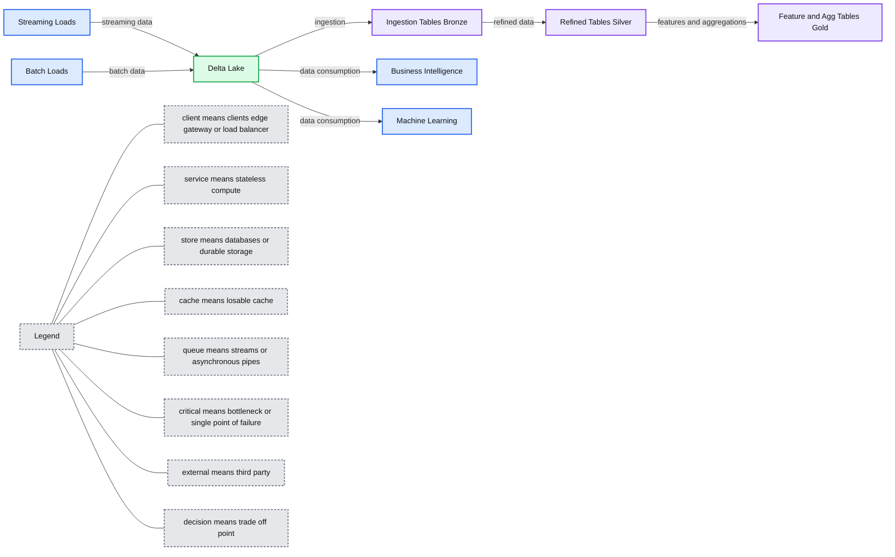
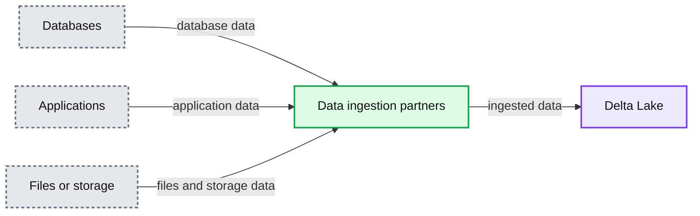
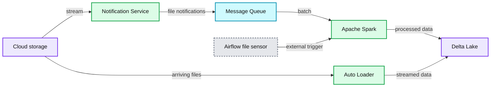

# Introducing Databricks Ingest: Easy and Efficient Data Ingestion from Different Sources into Delta Lake

- Source: https://www.databricks.com/blog/2020/02/24/introducing-databricks-ingest-easy-data-ingestion-into-delta-lake.html
- Published: 2020-02-24
- Authors: Prakash Chockalingam
- Categories: platform, solutions, engineering, data-streaming
- Images: 4 total, 4 extracted as architecture

Get an early preview of [O'Reilly's new ebook](https://www.databricks.com/resources/ebook/delta-lake-running-oreilly?itm_data=easydataingestion-blog-oreillyupandrunning ) for the step-by-step guidance you need to start using Delta Lake

 

We are excited to introduce a new feature - Auto Loader - and a set of partner integrations, in a public preview, that allows Databricks users to incrementally ingest data into [Delta Lake](https://delta.io/) from a variety of data sources. Auto Loader is an optimized cloud file source for [Apache Spark](https://spark.apache.org/) that loads data continuously and efficiently from cloud storage as new data arrives. A data ingestion network of partner integrations allow you to ingest data from hundreds of data sources directly into Delta Lake.

## Bringing all the data together

Organizations have a wealth of information siloed in various data sources. These could vary from databases (for example, Oracle, MySQL, Postgres, etc) to product applications (Salesforce, Marketo, HubSpot, etc). A significant number of analytics use cases need data from these diverse data sources to produce meaningful reports and predictions. For example, a complete funnel analysis report would need information from a gamut of sources ranging from leads information in hubspot to product signup events in Postgres database.

Centralizing all your data only in a [data warehouse](https://www.databricks.com/glossary/data-warehouse) is an anti-pattern, since machine learning frameworks in Python / R libraries will not be able to access data in a warehouse efficiently. Since your analytics use cases range from building simple SQL reports to more advanced machine learning predictions, it is essential that you build a central data lake in an open format with data from all of your data sources and make it accessible for various use cases.

Ever since [we open-sourced Delta Lake last year](https://www.databricks.com/blog/2019/04/24/open-sourcing-delta-lake.html), there are thousands of organizations building this central data lake in an open format much more reliably and efficiently than before. Delta Lake on Databricks provides ACID transactions and efficient indexing that is critical for exposing the data for various access patterns, ranging from ad-hoc SQL queries in BI tools, to scheduled offline training jobs. We call this pattern of building a central, reliable and efficient single source of truth for data in an open format for use cases ranging from BI to ML with decoupled storage and compute as ["The Lakehouse"](https://www.databricks.com/blog/2020/01/30/what-is-a-data-lakehouse.html).

*Figure 1. A common data flow with Delta Lake. Data gets loaded into ingestion tables, refined in successive tables, and then consumed for ML and BI use cases.*

**Summary:** Delta Lake receives streaming and batch loads, refines data through Bronze, Silver, and Gold tables, and serves business intelligence and machine learning.

**Components:**

- Streaming Loads - streaming data source
- Batch Loads - batch data source
- Delta Lake - lakehouse storage platform
- Ingestion Tables - Bronze tables
- Refined Tables - Silver tables
- Feature and Agg Tables - Gold tables
- Business Intelligence - BI consumer
- Machine Learning - ML consumer

**Flows:**

- Streaming Loads -> Delta Lake: streaming data
- Batch Loads -> Delta Lake: batch data
- Delta Lake -> Ingestion Tables: ingestion
- Ingestion Tables -> Refined Tables: refined data
- Refined Tables -> Feature and Agg Tables: features and aggregations
- Delta Lake -> Business Intelligence: data consumption
- Delta Lake -> Machine Learning: data consumption

**Numbers:** none

source image: https://www.databricks.com/sites/default/files/inline-images/dl-workflow.png

Figure 1. A common data flow with Delta Lake. Data gets loaded into ingestion tables, refined in successive tables, and then consumed for ML and BI use cases.

One critical challenge in building a lakehouse is bringing all the data together from various sources. Based on your data journey, there are two common scenarios for data teams:

- Data ingestion from 3rd party sources: You typically have valuable user data in various internal data sources, ranging from Hubspot to Postgres databases. You need to write specialized connectors for each of them to pull the data from the source and store it in Delta Lake.
- Data ingestion from cloud storage: You already have a mechanism to pull data from your source into cloud storage. As new data arrives in cloud storage, you need to identify this new data and load them into Delta Lake for further processing.

## Data Ingestion from 3rd party sources

Ingesting data from internal data sources requires writing specialized connectors for each of them. This could be a huge investment in time and effort to build the connectors using the source APIs and mapping the source schema to Delta Lake's schema functionalities. Furthermore, you also need to maintain these connectors as the APIs and schema of the sources evolve. The maintenance problem compounds with every additional data source you have.

To make it easier for your users to access all your data in Delta Lake, we have now partnered with a set of data ingestion products. This network of data ingestion partners have built native integrations with Databricks to ingest and store data in Delta Lake directly in your cloud storage. This helps your data scientists and analysts to easily start working with data from various sources.

Azure Databricks customers already benefit from [integration with Azure Data Factory](https://docs.microsoft.com/en-us/azure/data-factory/solution-template-databricks-notebook) to ingest data from various sources into cloud storage. We are excited to announce the new set of partners - Fivetran, [Qlik](https://www.qlik.com/us/products/technology/databricks), [Infoworks](https://www.infoworks.io/datafoundry-for-databricks/?utm_source=Databricks&utm_medium=website&utm_campaign=Databricks%20Ingestion%20Network%20Launch&utm_term=ingestion%2C%20onboarding), StreamSets, and [Syncsort](https://www.precisely.com/solution/databricks?utm_medium=Redirect-Syncsort&utm_source=Direct-Traffic) - to help users ingest data from a variety of sources. We are also expanding this data ingestion network of partners with more integrations coming soon from Informatica, Segment and Stitch.

*Figure 2. Ecosystem of data ingestion partners and some of the popular data sources that you can pull data via these partner products into Delta Lake.*

**Summary:** The diagram shows Delta Lake connected to a partner network that ingests data from databases, applications, and files or storage systems.

**Components:**

- Delta Lake: destination data lake
- Data ingestion network of partners: Azure Data Factory, Fivetran, Qlik, Infoworks, StreamSets, and Syncsort
- Databases: SQL Server, Amazon DynamoDB, MySQL, MariaDB, MongoDB, Oracle, Teradata, PostgreSQL, and Kafka
- Applications: Salesforce, Marketo, SAP HANA, Workday, Google Analytics, GitHub, Jira, Splunk, Asana, Mainframe, MailChimp, Mandrill, Intercom, Amplitude, Magento, Facebook Ads, LinkedIn Advertising, AppsFlyer, SendGrid, Oracle, Eloqua, Zendesk, Stripe, and HubSpot
- Files or storage: Azure Data Lake Storage, Amazon S3, Google Cloud Storage, FTP, Dropbox, Google Sheets, email, CSV, JSON, and XML

**Flows:**

- Databases -> Data ingestion network of partners: database data
- Applications -> Data ingestion network of partners: application data
- Files or storage -> Data ingestion network of partners: files and storage data
- Data ingestion network of partners -> Delta Lake: ingested data

**Numbers:** none

source image: https://www.databricks.com/sites/default/files/inline-images/partner-integrations-and-sources.png

Figure 2. Ecosystem of data ingestion partners and some of the popular data sources that you can pull data via these partner products into Delta Lake.

## Data Ingestion from Cloud Storage

Incrementally processing new data as it lands on a cloud blob store and making it ready for analytics is a common workflow in ETL workloads. Nevertheless, loading data continuously from cloud blob stores with exactly-once guarantees at low cost, low latency, and with minimal DevOps work, is difficult to achieve.

Once data is in Delta tables, thanks to Delta Lake's ACID transactions, data can be reliably read. To stream data from a Delta table, you can use the Delta source ([Azure](https://docs.microsoft.com/en-us/azure/databricks/delta/delta-streaming#--delta-table-as-a-stream-source) | [AWS](https://docs.databricks.com/spark/latest/structured-streaming/demo-notebooks.html#structured-streaming-scala)) that leverages the table's [transaction log](https://www.databricks.com/blog/2019/08/21/diving-into-delta-lake-unpacking-the-transaction-log.html) to quickly identify the new files added.

However, the major bottleneck is in loading the raw files that lands in cloud storage into the Delta tables. The naive file-based streaming source ([Azure](https://docs.microsoft.com/en-us/azure/databricks/delta/delta-streaming#--delta-table-as-a-stream-source) | [AWS](https://docs.databricks.com/spark/latest/structured-streaming/demo-notebooks.html#structured-streaming-scala)) identifies new files by repeatedly listing the cloud directory and tracking what files have been seen. Both cost and latency can add up quickly as more and more files get added to a directory due to repeated listing of files. To overcome this problem, data teams typically resolve into one of these workarounds:

- High end-to-end data latencies: Though data is arriving every few minutes, you batch the data together in a directory and then process them in a schedule. Using day or hour based partition directories is a common technique. This lengthens the SLA for making the data available to downstream consumers.
- Manual DevOps Approach: To keep the SLA low, you can alternatively leverage cloud notification service and message queue service to notify when new files arrive to a message queue and then process the new files. This approach not only involves a manual setup process of required cloud services, but can also quickly become complex to manage when there are multiple ETL jobs that need to load data. Furthermore, re-processing existing files in a directory involves manually listing the files and handling them in addition to the cloud notification setup thereby adding more complexity to the setup.

Auto Loader is an optimized file source that overcomes all the above limitations and provides a seamless way for data teams to load the raw data at low cost and latency with minimal DevOps effort. You just need to provide a source directory path and start a streaming job. The new structured streaming source, called "cloudFiles", will automatically set up file notification services that subscribe file events from the input directory and process new files as they arrive, with the option of also processing existing files in that directory.

*Figure 3. Achieving exactly-once data ingestion with low SLAs requires manual setup of multiple cloud services. Auto Loader handles all these complexities out of the box.*

**Summary:** The diagram compares a complex manual data ingestion setup with Auto Loader, which streams cloud storage files into Delta Lake as they arrive.

**Components:**

- Cloud storage
- Notification Service
- Message Queue
- Apache Spark
- Delta Lake
- Delayed schedule
- External Trigger
- Airflow file sensor
- Auto Loader

**Flows:**

- Cloud storage -> Delta Lake: files
- Delta Lake -> Notification Service: stream
- Notification Service -> Message Queue: file notifications
- Message Queue -> Apache Spark: batch messages
- Airflow file sensor -> Apache Spark: external trigger
- Apache Spark -> Delta Lake: processed data
- Cloud storage -> Auto Loader: arriving files
- Auto Loader -> Delta Lake: streamed data

**Numbers:** none

source image: https://www.databricks.com/sites/default/files/inline-images/autoloader.png

Figure 3. Achieving exactly-once data ingestion with low SLAs requires manual setup of multiple cloud services. Auto Loader handles all these complexities out of the box.

### The key benefits of using the auto loader are:

- No file state management: The source incrementally processes new files as they land on cloud storage. You don't need to manage any state information on what files arrived.
- Scalable: The source will efficiently track the new files arriving by leveraging cloud services and RocksDB without having to list all the files in a directory. This approach is scalable even with millions of files in a directory.
- Easy to use: The source will automatically set up notification and message queue services required for incrementally processing the files. No setup needed on your side.

## Streaming loads with Auto Loader

You can get started with minimal code changes to your streaming jobs by leveraging [Apache Spark's](https://www.databricks.com/spark/about) familiar load APIs:

## Scheduled batch loads with Auto Loader

If you have data coming only once every few hours, you can still leverage auto loader in a scheduled job using [Structured Streaming's Trigger.Once mode](https://www.databricks.com/blog/2017/05/22/running-streaming-jobs-day-10x-cost-savings.html).

You can schedule the above code to be run on a hourly or daily schedule to load the new data incrementally using Databricks Jobs Scheduler ([Azure](https://docs.microsoft.com/en-us/azure/databricks/jobs) | [AWS](https://docs.databricks.com/jobs.html)). You won't need to worry about late arriving data scenarios with the above approach.

## Scheduled batch loads with COPY command

Users who prefer using a declarative syntax can use the SQL COPY command to load data into Delta Lake on a scheduled basis. The COPY command is idempotent and hence can safely be rerun in case of failures. The command automatically ignores previously loaded files and guarantees exactly-once semantics. This allows data teams to easily build robust data pipelines.

Syntax for the command is shown below. For more details, see the documentation on COPY command ([Azure](https://docs.microsoft.com/en-us/azure/databricks/spark/latest/spark-sql/language-manual/delta-copy-into) | [AWS](https://docs.databricks.com/spark/latest/spark-sql/language-manual/delta-copy-into.html)).

*Figure 4. Data ingestion into Delta Lake with the new features. Streaming loads with Auto Loader guarantees exactly-once data ingestion. Batch loads with COPY command can be idempotently retried.*

**Summary:** The diagram shows streaming and batch ingestion into Delta Lake, followed by refined and feature or aggregate tables for analytics and machine learning.

**Components:**

- Auto Loader using streaming ingestion
- COPY INTO using batch ingestion
- Ingestion Tables Bronze in Delta Lake
- Refined Tables Silver in Delta Lake
- Feature or Agg Tables Gold in Delta Lake
- Business Intelligence
- Machine Learning

**Flows:**

- Auto Loader -> Ingestion Tables Bronze: streaming loads with exactly-once ingestion
- COPY INTO -> Ingestion Tables Bronze: batch loads with idempotent retries
- Ingestion Tables Bronze -> Refined Tables Silver: data refinement
- Refined Tables Silver -> Feature or Agg Tables Gold: feature and aggregate preparation
- Feature or Agg Tables Gold -> Business Intelligence: analytics data
- Feature or Agg Tables Gold -> Machine Learning: machine learning data

**Numbers:** none

source image: https://www.databricks.com/sites/default/files/inline-images/dl-workflow2.png

```mermaid
%% Shows streaming and batch ingestion into Delta Lake and downstream data consumers
flowchart LR
    AL[Auto Loader]
    CI[COPY INTO]
    subgraph DL[Delta Lake]
        IT[Ingestion Tables Bronze]
        RT[Refined Tables Silver]
        FT[Feature or Agg Tables Gold]
        IT -->|refined data| RT
        RT -->|features and aggregates| FT
    end
    BI[Business Intelligence]
    ML[Machine Learning]

    AL -->|streaming loads with exactly once ingestion| IT
    CI -->|batch loads with idempotent retries| IT
    FT -->|analytics data| BI
    FT -->|machine learning data| ML

    classDef client fill:#dbeafe,stroke:#2563eb,stroke-width:2px,color:#111
    classDef service fill:#dcfce7,stroke:#16a34a,stroke-width:2px,color:#111
    classDef store fill:#ede9fe,stroke:#7c3aed,stroke-width:2px,color:#111
    classDef cache fill:#fef3c7,stroke:#d97706,stroke-width:2px,color:#111
    classDef queue fill:#cffafe,stroke:#0891b2,stroke-width:2px,color:#111
    classDef critical fill:#fee2e2,stroke:#dc2626,stroke-width:4px,color:#111
    classDef external fill:#e5e7eb,stroke:#6b7280,stroke-width:2px,color:#111,stroke-dasharray:4 3
    classDef decision fill:#fce7f3,stroke:#db2777,stroke-width:2px,color:#111

    class AL,CI service
    class IT,RT,FT store
    class BI,ML external
```

Figure 4. Data ingestion into Delta Lake with the new features. Streaming loads with Auto Loader guarantees exactly-once data ingestion. Batch loads with COPY command can be idempotently retried.

## Getting Started with Data Ingestion features

Getting all the data into your data lake is critical for machine learning and business analytics use cases to succeed and is a huge undertaking for every organization. We are excited to introduce Auto Loader and the partner integration capabilities to help our thousands of users in this journey of building an efficient data lake. The features are available as a preview today. Our documentation has more information on how to get started with partner integrations ([Azure](https://docs.microsoft.com/en-us/azure/databricks/integrations/partners) | AWS), Auto Loader ([Azure](https://docs.microsoft.com/en-us/azure/databricks/spark/latest/structured-streaming/auto-loader) | [AWS](https://docs.databricks.com/spark/latest/structured-streaming/auto-loader.html)) and the copy command ([Azure](https://docs.microsoft.com/en-us/azure/databricks/spark/latest/spark-sql/language-manual/delta-copy-into) | [AWS](https://docs.databricks.com/spark/latest/spark-sql/language-manual/delta-copy-into.html)) to start loading your data into Delta Lake.

To learn more about these capabilities, we'll be hosting a webinar on 3/19/2020 @ 10:00am PST to walkthrough the capabilities of Databricks Ingest, [register here](https://www.databricks.com/p/webinar/hassle-free-data-ingestion).
