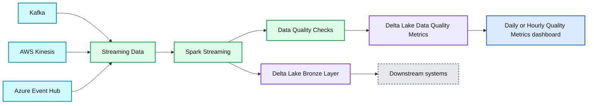
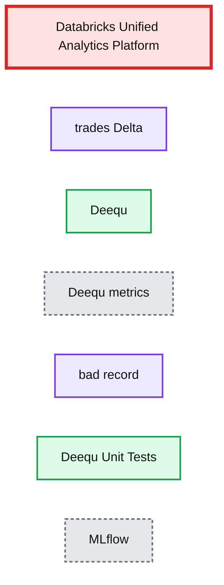

# Data Quality Monitoring on Streaming Data Using Spark Streaming and Delta Lake

- Source: https://www.databricks.com/blog/2020/03/04/how-to-monitor-data-stream-quality-using-spark-streaming-and-delta-lake.html
- Published: 2020-03-04
- Authors: Abraham Pabbathi, Greg Wood
- Categories: platform, solutions, engineering, open-source, data-engineering, data-streaming
- Images: 2 total, 2 extracted as architecture

>  Try this [notebook](https://www.databricks.com/notebooks/streaming-data-quality.html) to reproduce the steps outlined below

In the era of accelerating everything, streaming data is no longer an outlier- instead, it is becoming the norm. We often no longer hear customers ask, "can I stream this data?" so much as "how fast can I stream this data?", and the pervasiveness of technologies such as [Kafka](https://kafka.apache.org/) and [Delta Lake](https://delta.io/) underline this momentum. On one end of this streaming spectrum is what we consider "traditional" streaming workloads- data that arrives with high velocity, usually in semi-structured or unstructured formats such as JSON, and often in small payloads. This type of workload cuts across verticals; one such customer example is a major stock exchange and data provider who was responsible for streaming hundreds of thousands of events per minute- stock ticks, news, quotes, and other financial data. This customer uses Databricks, Delta and [Structured Streaming](https://docs.databricks.com/spark/latest/structured-streaming/index.html) to process and analyze these streams in real-time with high availability. With increasing regularity, however, we see customers on the other end of the spectrum, using streaming for low-frequency, “batch-style” processing. In this architecture, streaming acts as a way to monitor a specific directory, [S3 bucket](https://docs.databricks.com/spark/latest/structured-streaming/sqs.html), or other landing zones, and automatically process data as soon as it lands- such an architecture removes much of the burden of traditional scheduling, particularly in the case of job failures or partial processing. All of this is to say: streaming is no longer just for real-time or near real-time data at the fringes of computing.

While the emergence of streaming in the mainstream is a net positive, there is some baggage that comes along with this architecture. In particular, there has historically been a tradeoff: high-quality data, or high-velocity data? In reality, this is not a valid question; quality must be coupled to velocity for all practical means — to achieve high velocity, we need high quality data. After all, low quality at high velocity will require reprocessing, often in batch; low velocity at high quality, on the other hand, fails to meet the needs of many modern problems. As more companies adopt streaming as a lynchpin for their processing architectures, both velocity and quality must improve.

In this blog post, we’ll dive into one data management architecture that can be used to combat corrupt or bad data in streams by proactively monitoring and analyzing data as it arrives without causing bottlenecks.

 Get an early preview of [O'Reilly's new ebook](https://www.databricks.com/resources/ebook/delta-lake-running-oreilly?itm_data=monitordatastreamblog-textpromo-oreillydlupandrunning) for the step-by-step guidance you need to start using Delta Lake.

## Architecting a Streaming Data Analysis and Monitoring Process

At Databricks, we see many patterns emerge among our customers as they push the envelope of what is possible, and the speed/quality question is no different. To help solve this paradox, we began to think about the correct tooling to provide not only the required velocity of data, but also an acceptable level of data quality. Structured Streaming and Delta Lake were a natural fit for the ingest and storage layers, since together they create a scalable, fault-tolerant and near-real-time system with exactly-once delivery [guarantees](https://docs.databricks.com/delta/delta-streaming.html).

Finding an acceptable tool for enterprise data quality analysis was somewhat more difficult. In particular, this tool would need the ability to perform stateful aggregation of data quality metrics; otherwise, performing checks across an entire dataset, such as “percentage of records with non-null values”, would increase in compute cost as the volume of ingested data increased. This is a non-starter for any streaming system, and eliminated many tools off the bat.

In our initial solution we chose [Deequ](https://github.com/awslabs/deequ), a data quality tool from Amazon, because it provides a simple yet powerful API, the ability to statefully aggregate data quality metrics, and support for Scala. In the future, other Spark-native tools such as forthcoming Delta expectations and pipelines, will provide alternatives.

**Summary:** Streaming data from Kafka, AWS Kinesis, or Azure Event Hub is processed with Spark Streaming, stored in Delta Lake, checked for quality, and reported as periodic metrics.

**Components:**

- Kafka streaming source
- AWS Kinesis streaming source
- Azure Event Hub streaming source
- Spark Streaming
- Delta Lake Bronze Layer
- Data Quality Checks
- Delta Lake Data Quality Metrics
- Daily or Hourly Quality Metrics dashboard
- Downstream systems

**Flows:**

- Streaming Data -> Delta Lake Bronze Layer: streaming records
- Streaming Data -> Data Quality Checks: records for quality validation
- Data Quality Checks -> Delta Lake Data Quality Metrics: quality results
- Delta Lake Bronze Layer -> Downstream systems: processed streaming data
- Delta Lake Data Quality Metrics -> Daily or Hourly Quality Metrics dashboard: quality metrics

**Numbers:** none

source image: https://www.databricks.com/wp-content/uploads/2020/02/dqm-architecture.png

## Implementing Quality Monitoring for Streaming Data

We simulated data flow by running a small Kafka producer on an EC2 instance that feeds simulated transactional stock information into a topic, and using native Databricks connectors to bring this data into a [Delta Lake](https://www.databricks.com/product/delta-lake-on-databricks) table. To show the capabilities of data quality checks in [Spark Streaming](https://www.databricks.com/glossary/what-is-spark-streaming), we chose to utilize different features of Deequ throughout the pipeline:

- Generate constraint suggestions based on historical ingest data
- Run an incremental quality analysis on arriving data using [foreachBatch](https://docs.databricks.com/spark/latest/structured-streaming/foreach.html)
- Run a (small) unit test on arriving data using foreachBatch, and quarantine bad batches into a bad records table
- Write the latest metric state into a delta table for each arriving batch
- Perform a periodic (larger) unit test on the entire dataset and track the results in MLFlow
- Send notifications (i.e., via email or [Slack](https://github.com/slackapi/python-slack-sdk)) based on validation results
- Capture the metrics in MLFlow for visualization and logging

We incorporate [MLFlow](https://www.databricks.com/product/managed-mlflow) to track quality of data performance indicators over time and versions of our Delta table, and a Slack connector for notifications and alerts. Graphically, this pipeline is shown below.

**Summary:** Databricks Unified Analytics Platform combines Delta, Deequ, Deequ unit tests, bad-record handling, and MLflow metrics for streaming data quality monitoring.

**Components:**

- Databricks Unified Analytics Platform
- trades Delta table
- Deequ
- Deequ metrics
- bad record output
- Deequ Unit Tests
- MLflow

**Flows:**

- none visibly indicated

**Numbers:** none

source image: https://www.databricks.com/wp-content/uploads/2020/02/dqm-pipeline.png

Because of the unified batch/streaming interface in Spark, we are able to pull reports, alerts, and metrics at any point in this pipeline, as real-time updates or as batch snapshots. This is especially useful to set triggers or limits, so that if a certain metric crosses a threshold, a data quality improvement action can be performed. Also of note is that we are not impacting the initial landing of our raw data; this data is immediately committed to our Delta table, meaning that we are not limiting our ingest rate. Downstream systems could read directly off of this table, and could be interrupted if any of the aforementioned triggers or quality thresholds is crossed; alternatively, we could easily create a view that excludes bad records to provide a clean table.

At a high level, the code to perform our data quality tracking and validation looks like this:

## Working with the Data Quality Tool Deequ

Working with Deequ is relatively natural inside Databricks- you first define an analyzer, and then run that analyzer on a dataframe. For example, we can track several relevant metrics provided natively by Deequ, including checking that quantity and price are non-negative, originating IP address is not null, and distinctness of the symbol field across all transactions. Of particular usefulness in a streaming setting are Deequ’s StateProvider objects; these allow the user to persist the state of our metrics either in memory or on disk, and aggregate those metrics later on. This means that every batch processed is analyzing only the data records from that batch, instead of the entire table. This keeps performance relatively stable, even as the data size grows, which is important in long-running production use cases that will need to run consistently across arbitrarily large amounts of data.

MLFlow also works quite well to track metric evolution over time; in our [notebook](https://www.databricks.com/notebooks/streaming-data-quality.html), we track all the Deequ constraints that are analyzed in the foreachBatch code as metrics, and use the Delta versionID and timestamp as parameters. In Databricks notebooks, the integrated MLFlow server is especially convenient for metric tracking.

By using Structured Streaming, Delta Lake, and Deequ, we were able to eliminate the traditional tradeoff between quality or speed, and instead focus on achieving an acceptable level of both. Especially important here is flexibility- not only in how to deal with bad records (quarantine, error, message, etc.), but also architecturally (when and where do I perform checks?) and ecosystem (how do I use my data?). Open source technologies, such as Delta, Structured Streaming, and Deequ are the key to this flexibility- as technology evolves, being able to drop in the latest-and-greatest solution becomes a driver of competitive advantage. Most importantly, the speed and quality of your data must not be opposed, but aligned, especially as streaming moves closer to core business operations. Soon, this will not be a choice at all, but rather an expectation and a requirement—we are marching towards this world one microbatch at a time.
