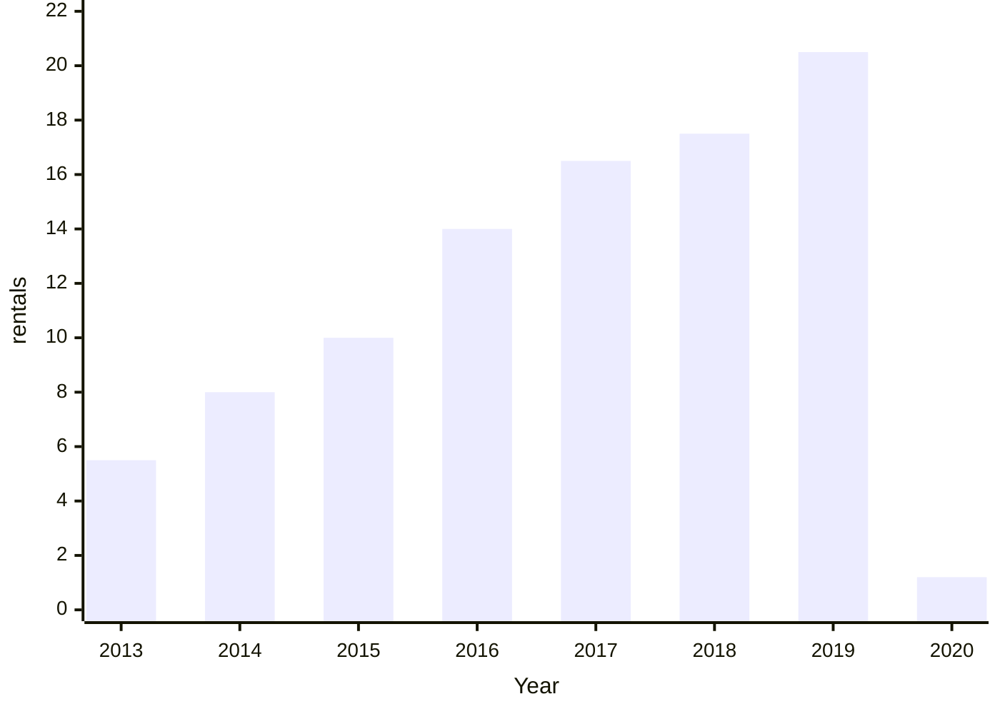
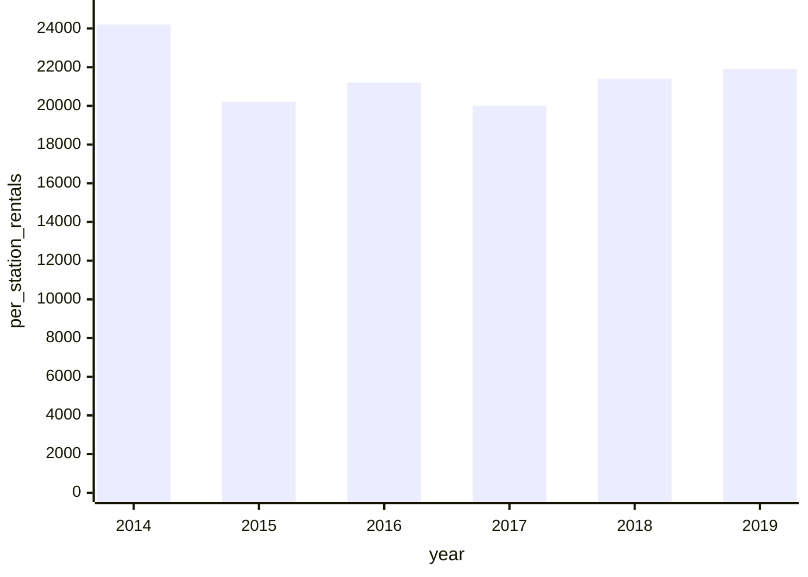
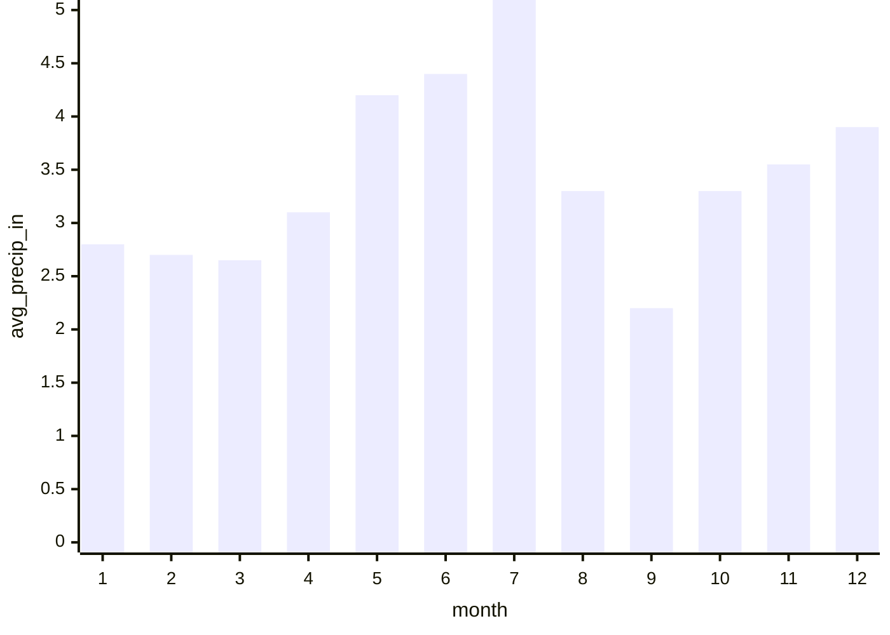
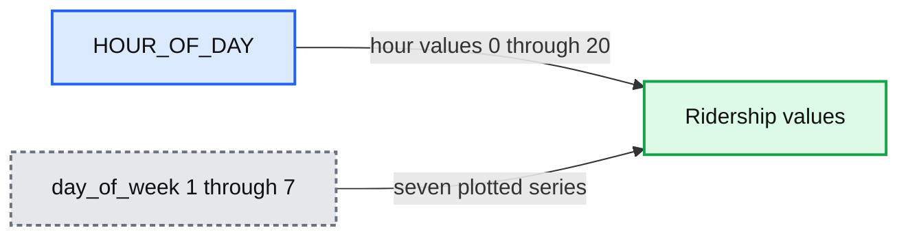
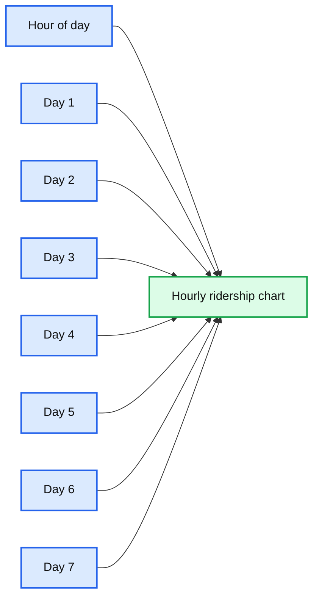

# New Methods for Improving Supply Chain Demand Forecasting

*Fine-Grained Demand Forecasting with Causal Factors*

- Source: https://www.databricks.com/blog/2020/03/26/new-methods-for-improving-supply-chain-demand-forecasting.html
- Published: 2020-03-26
- Authors: Bryan Smith, Rob Saker
- Categories: engineering, data-science-machine-learning
- Images: 15 total, 11 extracted as architecture

Quick link to notebooks referenced through this post.

## Organizations Are Rapidly Embracing Fine-Grained Demand Forecasting

Retailers and Consumer Goods manufacturers are increasingly seeking improvements to their supply chain management in order to reduce costs, free up working capital and create a foundation for omnichannel innovation. Changes in consumer purchasing behavior are placing new strains on the supply chain. Developing a better understanding of consumer demand via a demand forecast is considered a good starting point for most of these efforts as the demand for products and services drives decisions about the labor, inventory management, supply and production planning, freight and logistics and many other areas.

In [*Notes from the AI Frontier*](https://www.mckinsey.com/featured-insights/artificial-intelligence/notes-from-the-ai-frontier-applications-and-value-of-deep-learning), McKinsey & Company highlight that, a 10 to 20% improvement in retail supply chain forecasting accuracy is likely to produce a 5% reduction in inventory costs and a 2 to 3% increase in revenues. Traditional supply chain forecasting tools have failed to deliver the desired results. With claims of [industry-average inaccuracies of 32%](https://www.supplychain247.com/article/does_ai_enabled_demand_forecasting_improve_supply_chain_efficiency)in retailer supply chain demand forecasting, the potential impact of even modest forecasting improvements is immense for most retailers. As a result, many organizations are moving away from pre-packaged forecasting solutions, exploring ways to bring demand forecasting skills in-house and revisiting past practices which compromised forecast accuracy for computational efficiency.

A key focus of these efforts is the generation of forecasts at a finer level of temporal and (location/product) hierarchical granularity. Fine-grain demand forecasts have the potential to capture the patterns that influence demand closer to the level at which that demand must be met. Whereas in the past a retailer might have predicted short-term demand for a class of products at a market level or distribution level, for a month or week period, and then used the forecasted values to allocate units of a specific product in that class should be placed in a given store and day, fine-grain demand forecasting allows forecasters to build more localized models that reflect the dynamics of that specific product in a particular location.

## Fine-grain Demand Forecasting Comes with Challenges

As exciting as fine-grain demand forecasting sounds, it comes with many challenges. First, by moving away from aggregate forecasts, the number of forecasting models and predictions which must be generated explodes. The level of processing required is either unattainable by existing forecasting tools, or it greatly exceeds the service windows for this information to be useful. This limitation leads to companies making tradeoffs in the number of categories being processed, or the level of grain in the analysis.

As examined in a prior [blog post](https://www.databricks.com/blog/2020/01/27/time-series-forecasting-prophet-spark.html), Apache Spark can be employed to overcome this challenge, allowing modelers to parallelize the work for timely, efficient execution. When deployed on cloud-native platforms such as Databricks, computational resources can be quickly allocated and then released, keeping the cost of this work within budget.
 The second and more difficult challenge to overcome is understanding that demand patterns that exist in aggregate may not be present when examining data at a finer level of granularity. To paraphrase Aristotle, the whole may often be greater than the sum of its parts. As we move to lower levels of detail in our analysis, patterns more easily modeled at higher levels of granularity may no longer be reliably present, making the generation of forecasts with techniques applicable at higher levels more challenging. This problem within the context of forecasting is noted by many practitioners going all the way back to [Henri Theil](https://www.worldcat.org/title/linear-aggregation-of-economic-relations/oclc/180231) in the 1950s.

As we move closer to the transaction level of granularity, we also need to consider the external causal factors that influence individual customer demand and purchase decisions. In aggregate, these may be reflected in the averages, trends and seasonality that make up a time series but at finer levels of granularity, we may need to incorporate these directly into our forecasting models.

Finally, moving to a finer level of granularity increases the likelihood the structure of our data will not allow for the use of traditional forecasting techniques. The closer we move to the transaction grain, the higher the likelihood we will need to address periods of inactivity in our data. At this level of granularity, our dependent variables, especially when dealing with count data such as units sold, may take on a skewed distribution that’s not amenable to simple transformations and which may require the use of forecasting techniques outside the comfort zone of many Data Scientists.

## Accessing the Historical Data

[See the Data Preparation notebook for details](https://www.databricks.com/notebooks/recitibikenycdraft/data-preparation.html).

In order to examine these challenges, we will leverage public trip history data from the New York City Bike Share program, also known as [Citi Bike NYC](https://account.citibikenyc.com/access-plans). Citi Bike NYC is a company that promises to help people, “Unlock a Bike. Unlock New York.” Their service allows people to go to any of over 850 various rental locations throughout the NYC area and rent bikes. The company has an inventory of over 13,000 bikes with plans to increase the number to 40,000. Citi Bike has well over 100,000 subscribers who make nearly 14,000 rides per day.

Citi Bike NYC reallocates bikes from where they were left to where they anticipate future demand. Citi Bike NYC has a challenge that is similar to what retailers and consumer goods companies deal with on a daily basis. How do we best predict demand to allocate resources to the right areas? If we underestimate demand, we miss revenue opportunities and potentially hurt customer sentiment. If we overestimate demand, we have excess bike inventory being unused.

This publicly available dataset provides information on each bicycle rental from the end of the prior month all the way back to the inception of the program in mid-2013. The trip history data identifies the exact time a bicycle is rented from a specific rental station and the time that bicycle is returned to another rental station. If we treat stations in the Citi Bike NYC program as store locations and consider the initiation of a rental as a transaction, we have something closely approximating a long and detailed transaction history with which we can produce forecasts.

As part of this exercise, we will need to identify external factors to incorporate into our modeling efforts. We will leverage both holiday events as well as historical (and predicted) weather data as external influencers. For the holiday dataset, we will simply identify standard holidays from 2013 to present using the [holidays library](https://pypi.org/project/holidays/) in Python. For the weather data, we will employ hourly extracts from [Visual Crossing](https://www.visualcrossing.com/), a popular weather data aggregator.

Citi Bike NYC and Visual Crossing data sets have terms and conditions that prohibit our directly sharing of their data. Those wishing to recreate our results should visit the data providers’ websites, review their Terms & Conditions, and download their datasets to their environments in an appropriate manner. We will provide the data preparation logic required to transform these raw data assets into the data objects used in our analysis.

## Examining the Transactional Data

[See the Exploratory Analysis notebook for details](https://www.databricks.com/notebooks/recitibikenycdraft/exploratory-analysis.html).

As of January 2020, the Citi Bike NYC bike share program consists of 864 active stations operating in the New York City metropolitan area, primarily in Manhattan. In 2019 alone, a little over 4-million unique rentals were initiated by customers with as many as nearly 14,000 rentals taking place on peak days.

Since the start of the program, we can see the number of rentals has increased year over year. Some of this growth is likely due to the increased utilization of the bicycles, but much of it seems to be aligned with the expansion of the overall station network.

**Summary:** Annual Citibike NYC rental demand rises from 2013 through 2019, with a sharp decline in 2020.

**Components:**

- 2013 through 2020 annual rental bars
- Rental scale measured in millions

**Flows:**

- none

**Numbers:** 2013, 2014, 2015, 2016, 2017, 2018, 2019, 2020, 0.00, 2.0M, 4.0M, 6.0M, 8.0M, 10M, 12M, 14M, 16M, 18M, 20M, 22M



<sub>source image: https://www.databricks.com/wp-content/uploads/2020/03/cb-nyc-demand-util-chart.png</sub>

**Summary:** Annual active Citibike stations increased from 2013 through 2019 before declining in 2020.

**Components:**

- Year axis
- Active stations bar series
- Active stations scale from 0.00 to 1.0k

**Flows:**

- none

**Numbers:** 0.00, 100, 200, 300, 400, 500, 600, 700, 800, 900, 1.0k, 2013, 2014, 2015, 2016, 2017, 2018, 2019, 2020

```mermaid
%% Shows annual active station counts from 2013 through 2020
flowchart LR
    Y2013["2013"] --> Y2014["2014"]
    Y2014 --> Y2015["2015"]
    Y2015 --> Y2016["2016"]
    Y2016 --> Y2017["2017"]
    Y2017 --> Y2018["2018"]
    Y2018 --> Y2019["2019"]
    Y2019 --> Y2020["2020"]

    classDef client fill:#dbeafe,stroke:#2563eb,stroke-width:2px,color:#111
    classDef service fill:#dcfce7,stroke:#16a34a,stroke-width:2px,color:#111
    classDef store fill:#ede9fe,stroke:#7c3aed,stroke-width:2px,color:#111
    classDef cache fill:#fef3c7,stroke:#d97706,stroke-width:2px,color:#111
    classDef queue fill:#cffafe,stroke:#0891b2,stroke-width:2px,color:#111
    classDef critical fill:#fee2e2,stroke:#dc2626,stroke-width:4px,color:#111
    classDef external fill:#e5e7eb,stroke:#6b7280,stroke-width:2px,color:#111,stroke-dasharray:4 3
    classDef decision fill:#fce7f3,stroke:#db2777,stroke-width:2px,color:#111
    class Y2013,Y2014,Y2015,Y2016,Y2017,Y2018,Y2019,Y2020 service
```



<sub>source image: https://www.databricks.com/wp-content/uploads/2020/03/cb-nyc-demand-grwth-chart.png</sub>

Normalizing rentals by the number of active stations in the network shows that growth in ridership on a per-station basis has been slowly ticking up for the last few years in what we might consider to be a slight linear upward trend.

**Summary:** Bar chart showing per-station rentals by year from 2014 through 2019, with an overall slight upward trend.

**Components:**

- `per_station_rentals` metric
- `year` dimension
- Annual bars for 2014 through 2019

**Flows:**

- none

**Numbers:** 25k, 20k, 15k, 10k, 5.0k, 0.00, 2014, 2015, 2016, 2017, 2018, 2019



<sub>source image: https://www.databricks.com/wp-content/uploads/2020/03/cb-nyc-demand-ridership-chart.png</sub>

Using this normalized value for rentals, ridership seems to follow a distinctly seasonal pattern, rising in the Spring, Summer and Fall and then dropping in Winter as the weather outside becomes less conducive to bike riding

**Summary:** Monthly Citibike rental demand per station rises from spring through early fall before declining in winter.

**Components:**

- Monthly rental demand bars
- Month axis
- Per station rentals axis

**Flows:**

- none

**Numbers:** 0.00, 2.0k, 4.0k, 6.0k, 8.0k, 10k, 12k, months 1 through 12

```text
%% mermaid failed to render; kept as text
%% Shows monthly per station rental demand across months
flowchart LR
    A[Month axis] -->|months 1 through 12| B[Monthly rental demand bars]
    B -->|measured on| C[Per station rentals axis]

    classDef client fill:#dbeafe,stroke:#2563eb,stroke-width:2px,color:#111
    classDef service fill:#dcfce7,stroke:#16a34a,stroke-width:2px,color:#111
    classDef store fill:#ede9fe,stroke:#7c3aed,stroke-width:2px,color:#111
    classDef cache fill:#fef3c7,stroke:#d97706,stroke-width:2px,color:#111
    classDef queue fill:#cffafe,stroke:#0891b2,stroke-width:2px,color:#111
    classDef critical fill:#fee2e2,stroke:#dc2626,stroke-width:4px,color:#111
    classDef external fill:#e5e7eb,stroke:#6b7280,stroke-width:2px,color:#111,stroke-dasharray:4 3
    classDef decision fill:#fce7f3,stroke:#db2777,stroke-width:2px,color:#111
    A,B,C service
```

<sub>source image: https://www.databricks.com/wp-content/uploads/2020/03/cb-nyc-demand-seasonality-chart.png</sub>

his pattern appears to closely follow patterns in the maximum temperatures (in degrees Fahrenheit) for the city.

**Summary:** Bar chart showing average maximum temperature by month, with temperatures generally highest from May through September.

**Components:**

- Y-axis labeled `avg_max_temp_f`
- Monthly bars labeled 1 through 12
- Temperature scale from 0.00 to 100

**Flows:**

- none

**Numbers:** 0.00, 20, 40, 60, 80, 100, 1, 2, 3, 4, 5, 6, 7, 8, 9, 10, 11, 12

```mermaid
%% Shows average maximum temperature by month
flowchart LR
  A[Month 1] --- B[Month 2] --- C[Month 3] --- D[Month 4] --- E[Month 5] --- F[Month 6] --- G[Month 7] --- H[Month 8] --- I[Month 9] --- J[Month 10] --- K[Month 11] --- L[Month 12]

  classDef client   fill:#dbeafe,stroke:#2563eb,stroke-width:2px,color:#111
  classDef service  fill:#dcfce7,stroke:#16a34a,stroke-width:2px,color:#111
  classDef store    fill:#ede9fe,stroke:#7c3aed,stroke-width:2px,color:#111
  classDef cache    fill:#fef3c7,stroke:#d97706,stroke-width:2px,color:#111
  classDef queue    fill:#cffafe,stroke:#0891b2,stroke-width:2px,color:#111
  classDef critical fill:#fee2e2,stroke:#dc2626,stroke-width:4px,color:#111
  classDef external fill:#e5e7eb,stroke:#6b7280,stroke-width:2px,color:#111,stroke-dasharray:4 3
  classDef decision fill:#fce7f3,stroke:#db2777,stroke-width:2px,color:#111
  class A,B,C,D,E,F,G,H,I,J,K,L service
```



<sub>source image: https://www.databricks.com/wp-content/uploads/2020/03/cb-nyc-demand-temp-chart.png</sub>

While it can be hard to separate monthly ridership from patterns in temperatures, rainfall (in average monthly inches) does not mirror these patterns quite so readily

**Summary:** Monthly average rainfall by month, measured in inches.

**Components:**

- Month axis: months 1 through 12
- Average precipitation axis: inches from 0.00 to 5.0
- Twelve monthly precipitation bars

**Flows:**

- none

**Numbers:** 0.00, 1.00, 2.00, 3.00, 4.00, 5.0, months 1, 2, 3, 4, 5, 6, 7, 8, 9, 10, 11, 12



<sub>source image: https://www.databricks.com/wp-content/uploads/2020/03/cb-nyc-demand-rainfall-chart.png</sub>

Examining weekly patterns of ridership with Sunday identified as 1 and Saturday identified as 7, it would appear that New Yorkers are using the bicycles as commuter devices, a pattern seen in many other bike share programs.

**Summary:** Bar chart showing Citibike station rentals by day of week, with highest usage on day 4 and lowest on day 1.

**Components:**

- Day of week axis
- Per station rentals axis
- Seven bars representing days 1 through 7
- Legend mapping colors to days 1 through 7

**Flows:**

- none

**Numbers:** 0.00, 2.0k, 4.0k, 6.0k, 8.0k, 10k, 12k, 14k, 1, 2, 3, 4, 5, 6, 7


<sub>source image: https://www.databricks.com/wp-content/uploads/2020/03/cb-nyc-demand-daysweek-chart.png</sub>

Breaking down these ridership patterns by hour of the day, we see distinct weekday patterns where ridership spikes during standard commute hours. On the weekends, patterns indicate more leisurely utilization of the program, supporting our earlier hypothesis.

**Summary:** Line chart showing Citibike ridership by hour of day for seven day-of-week series.

**Components:**

- `HOUR_OF_DAY` x-axis
- Ridership value y-axis
- `day_of_week` series legend with 1 through 7

**Flows:**

- None visible

**Numbers:** 0, 1, 2, 3, 4, 5, 6, 7, 10, 15, 20, 500, 1.0k



<sub>source image: https://www.databricks.com/wp-content/uploads/2020/03/cb-nyc-demand-hourofday-chart.png</sub>

An interesting pattern is that holidays, regardless of their day of week, show consumption patterns that roughly mimic weekend usage patterns. The infrequent occurrence of holidays may be the cause of erraticism of these trends. Still, the chart seems to support that the identification of holidays is important to producing a reliable forecast.

**Summary:** The chart shows hourly Citibike NYC holiday ridership patterns grouped by day of week.

**Components:**

- Hour of day x-axis, technology unspecified
- Ridership y-axis, technology unspecified
- Seven plotted series labeled day of week 1 through 7

**Flows:**

- none

**Numbers:** 0, 1.00, 2.00, 3.0, 5, 10, 15, 20, 1, 2, 3, 4, 5, 6, 7



<sub>source image: https://www.databricks.com/wp-content/uploads/2020/03/cb-nyc-demand-holidayusage-chart.png</sub>

In aggregate, the hourly data appear to show that New York City is truly the city that never sleeps. In reality, there are many stations for which there are a large proportion of hours during which no bicycles are rented.

**Summary:** Sorted bar chart showing the percentage of hours with one-hour inactivity across individual Citi Bike stations.

**Components:**

- Individual Citi Bike stations
- Percent hours with no rental axis
- Sorted inactivity bars

**Flows:**

- Individual Citi Bike stations -> Sorted inactivity bars: station inactivity percentages

**Numbers:** Y-axis values 0, 10, 20, 30, 40, 50, 60, 70, 80, 90, 100, 110. X-axis contains many numeric station identifiers. Bars range from approximately 8 percent to 100 percent.


<sub>source image: https://www.databricks.com/wp-content/uploads/2020/03/cb-nyc-demand-1-hour-chart.png</sub>

These gaps in activity can be problematic when attempting to generate a forecast. By moving from 1-hour to 4-hour intervals, the number of periods within which individual stations experience no rental activity drops considerably though there are still many stations that are inactive across this timeframe.

**Summary:** The chart shows the percentage of hours with no rental activity across individual Citibike NYC stations, increasing sharply for the least active stations.

**Components:**

- Station inactivity percentages
- Percentage axis
- Station identifiers

**Flows:**

- none

**Numbers:** 0.00, 10, 20, 30, 40, 50, 60, 70, 80, 90; station labels 519, 3686, 509, 417, 167, 361, 3295, 539, 422, 3507, 3129, 302, 3108, 3315, 3331, 3313, 3131, 3074, 3284, 3080, 3154, 376, 1378, 3249, 3121, 3622, 3575, 3543, 3820, 3858, 3834, 3888; 4 hours


<sub>source image: https://www.databricks.com/wp-content/uploads/2020/03/cb-nyc-demand-4-hour-chart.png</sub>

Instead of ducking the problem of inactive periods by moving towards even higher-levels of granularity, we will attempt to make a forecast at the hourly level, exploring how an alternative forecasting technique may help us deal with this dataset. As forecasting for stations that are largely inactive isn’t terribly interesting, we’ll limit our analysis to the top 200 most active stations.

## Forecasting Bike Share Rentals with Facebook Prophet

In an initial attempt to forecast bike rentals at the per-station level, we made use of [Facebook Prophet](https://facebook.github.io/prophet/), a popular Python library for time series forecasting. The model was configured to explore a linear growth pattern with daily, weekly and yearly seasonal patterns. Periods in the dataset associated with holidays were also identified so that anomalous behavior on these dates would not affect the average, trend and seasonal patterns detected by the algorithm.

Using the scale-out pattern documented in the previously referenced blog post, models were trained for most active 200 stations and 36-hour forecasts were generated for each. Collectively, the models had a Root Mean Squared Error (RMSE) of 5.44 with a Mean Average Proportional Error (MAPE) of 0.73. (Zero-value actuals were adjusted to 1 for the MAPE calculation.)

These metrics indicate that the models do a reasonably good job of predicting rentals but are missing when hourly rental rates move higher. Visualizing sales data for individual stations, you can see this graphically such as in this chart for Station 518, E 39 St & 2 Ave, which has an RMSE of 4.58 and a MAPE of 0.69:

[See the Time Series notebook for details.](https://www.databricks.com/notebooks/recitibikenycdraft/time-series.html)

The model was then adjusted to incorporate temperature and precipitation as regressors. Collectively, the resulting forecasts had a RMSE of 5.35 and a MAPE of 0.72. While a very slight improvement, the models are still having difficulty picking up on the large swings in ridership found at the station level, as demonstrated again by Station 518 which had an RMSE of 4.51 and a MAPE of 0.68:

[See the Time Series with Regressors notebook for details.](https://www.databricks.com/notebooks/recitibikenycdraft/time-series-with-regressors.html)

This pattern of difficulty modeling the higher values in both the time series models is [typical](https://github.com/facebook/prophet/issues/797)of working with data having a [Poisson distribution](https://www.youtube.com/watch?v=8px7xuk_7OU). In such a distribution, we will have a large number of values around an average with a long-tail of values above it. On the other side of the average, a floor of zero leaves the data skewed. Today, Facebook Prophet expects data to have a normal (Gaussian) distribution but [plans](https://github.com/facebook/prophet/issues/337) for the incorporation of Poisson regression have been discussed.

## Alternative Approaches to Forecasting Supply Chain Demand

How might we then proceed with generating a forecast for these data? One solution, as the caretakers of Facebook Prophet are considering, is to leverage Poisson regression capabilities in the context of a traditional time series model. While this may be an excellent approach, it is not widely documented so tackling this on our own before considering other techniques may not be the best approach for our needs.

Another potential solution is to model the scale of non-zero values and the frequency of the occurrence of the zero-valued periods. The output of each model can then be combined to assemble a forecast. This method, known as Croston’s method, is supported by the recently released [croston Python library](https://pypi.org/project/croston/)while another data scientist has implemented his own function for it. Still, this is not a widely adopted method (despite the technique dating back to the 1970s) and our preference is to explore something a bit more *out-of-the-box*.

Given this preference, a random forest regressor would seem to make quite a bit of sense. Decision trees, in general, do not impose the same constraints on data distribution as many statistical methods. The range of values for the predicted variable is such that it may make sense to transform rentals using something like a square root transformation before training the model, but even then, we might see how well the algorithm performs without it.

To leverage this model, we’ll need to engineer a few features. It’s clear from the exploratory analysis that there are strong seasonal patterns in the data, both at the annual, weekly and daily levels. This leads us to extract year, month, day of week and hour of the day as features. We may also include a flag for holiday.

Using a random forest regressor and nothing but time-derived features, we arrive at an overall RMSE of 3.4 and MAPE of 0.39. For Station 518, the RMSE and MAPE values are 3.09 and 0.38, respectively:

[See Temporal Notebook for details.](https://www.databricks.com/notebooks/recitibikenycdraft/randomforest-with-time-variables-only.html)

By leveraging precipitation and temperature data in combination with some of these same temporal features, we are able to better (though not perfectly) address some of the higher rental values. The RMSE for Station 518 drops to 2.14 and the MAPE to 0.26. Overall, the RMSE drops to 2.37 and MAPE to 0.26 indicating weather data is valuable in forecasting demand for bicycles.

[See the Random Forest with Temporal & Weather Features notebook for details.](https://www.databricks.com/notebooks/recitibikenycdraft/randomForest-with-time-and-weather.html)

## Implications of the Results

Demand forecasting at finer levels of granularity may require us to think differently about our approach to modeling. External influencers which may be safely considered summarized in high-level time series patterns may need to be more explicitly incorporated into our models. Patterns in data distribution hidden at the aggregate level may become more readily exposed and necessitate changes in modeling approaches. In this dataset, these challenges were best addressed by the inclusion of hourly weather data and a shift away from traditional time series techniques towards an algorithm which makes fewer assumptions about our input data.

There may be many other external influencers and algorithms worth exploring, and as we go down this path, we may find that some of these work better for some subset of our data than for others. We may also find that as new data arrives, techniques that previously worked well may need to be abandoned and new techniques considered.

A common pattern we are seeing with customers exploring fine-grain demand forecasting is the evaluation of multiple techniques with each training and forecasting cycle, something we might describe as an automated model bake-off. In a bake-off round, the model producing the best results for a given subset of the data wins the round with each subset able to decide its own winning model type. In the end, we want to ensure we are performing good Data Science where our data is properly aligned with the algorithms we employ, but as is noted in article after article, there isn’t always just one solution to a problem and some may work better at one time than at others. The power of what we have available today with platforms like Apache Spark and Databricks is that we have access to the computational capacity to explore all these paths and deliver the best solution to our business.

## Additional Retail/CPG and Demand Forecasting Resources

- Sign-up for a [free trial](https://www.databricks.com/try-databricks) and download these notebooks to start experimenting:
  - [Data Preparation notebook](https://www.databricks.com/notebooks/recitibikenycdraft/data-preparation.html)
  - [Exploratory Analysis notebook](https://www.databricks.com/notebooks/recitibikenycdraft/exploratory-analysis.html)
  - [Time Series notebook](https://www.databricks.com/notebooks/recitibikenycdraft/time-series.html)
  - [Time Series with Regressors notebook](https://www.databricks.com/notebooks/recitibikenycdraft/time-series-with-regressors.html)
  - [Temporal Notebook](https://www.databricks.com/notebooks/recitibikenycdraft/randomforest-with-time-variables-only.html)
  - [Random Forest with Temporal & Weather Features notebook](https://www.databricks.com/notebooks/recitibikenycdraft/randomForest-with-time-and-weather.html)
- Download our [Guide to Data Analytics and AI at Scale for Retail and CPG](https://pages.databricks.com/data-science-at-scale-retail.html?_ga=2.10110837.1545315667.1582041023-1748556641.1581715136)
- Visit our [Retail and CPG page](https://www.databricks.com/solutions/industries/retail-industry-solutions) to learn how Dollar Shave Club and Zalando are innovating with Databricks
- Read our recent blog [Fine-Grained Time Series Forecasting At Scale With Facebook Prophet And Apache Spark](https://www.databricks.com/blog/2020/01/27/time-series-forecasting-prophet-spark.html) to learn how [Databricks Unified Data Analytics Platform](https://www.databricks.com/product/data-lakehouse) addresses challenges in a timely manner and at a level of granularity that allows the business to make precise adjustments to product inventories
