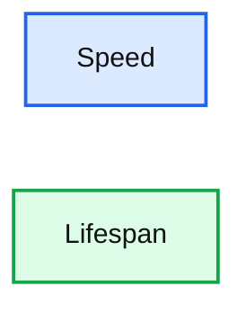
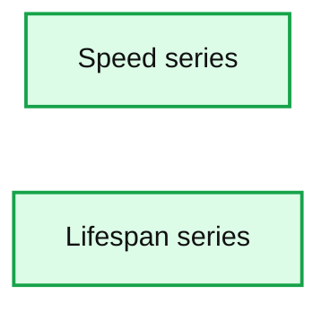
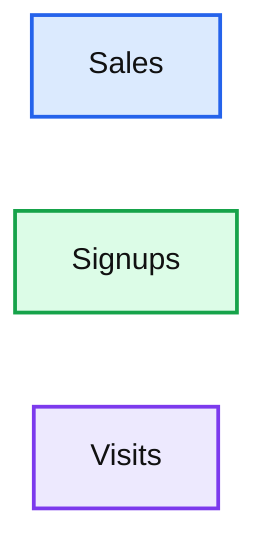
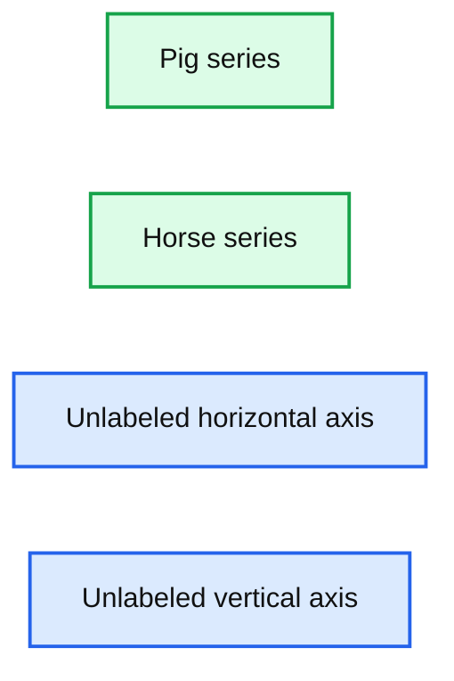

# 10 Minutes from pandas to Koalas on Apache Spark

*With demonstrable Python how-to Koalas code snippets and Koalas best practices*

- Source: https://www.databricks.com/blog/2020/03/31/10-minutes-from-pandas-to-koalas-on-apache-spark.html
- Published: 2020-03-31
- Authors: Haejoon Lee, Yifan Cao, Hyukjin Kwon, Takuya Ueshin
- Categories: solutions, engineering, open-source
- Images: 7 total, 4 extracted as architecture

>  This is a guest community post from Haejoon Lee, a software engineer at Mobigen in South Korea and a Koalas contributor.

[pandas](https://pandas.pydata.org/) is a great tool to analyze small datasets on a single machine. When the need for bigger datasets arises, users often choose [PySpark](https://spark.apache.org). However, the converting code from pandas to PySpark is not easy as [PySpark APIs](https://spark.apache.org/docs/latest/api/python/index.html) are considerably different from pandas APIs. [Koalas](https://github.com/databricks/koalas) makes the learning curve significantly easier by providing pandas-like APIs on the top of PySpark. With Koalas, users can take advantage of the benefits of PySpark with minimal efforts, and thus get to value much faster.

A number of blog posts such as [Koalas: Easy Transition from pandas to Apache Spark](https://www.databricks.com/blog/2019/04/24/koalas-easy-transition-from-pandas-to-apache-spark.html), [How Virgin Hyperloop One reduced processing time from hours to minutes with Koalas](https://www.databricks.com/blog/2019/08/22/guest-blog-how-virgin-hyperloop-one-reduced-processing-time-from-hours-to-minutes-with-koalas.html), and [10 minutes to Koalas](https://koalas.readthedocs.io/en/latest/getting_started/10min.html) in Koalas official docs have demonstrated the ease of conversion between pandas and Koalas. However, despite having the same APIs, there are subtleties when working in a distributed environment that may not be obvious to pandas users. In addition, only about ~70% of pandas APIs are implemented in Koalas. While the open-source community is actively implementing the remaining pandas APIs in Koalas, users would need to use PySpark to work around. Finally, Koalas also offers its own APIs such as [to_spark()](https://koalas.readthedocs.io/en/latest/reference/api/databricks.koalas.DataFrame.to_spark.html), [DataFrame.map_in_pandas()](https://koalas.readthedocs.io/en/latest/reference/api/databricks.koalas.DataFrame.map_in_pandas.html), [ks.sql()](https://koalas.readthedocs.io/en/latest/reference/api/databricks.koalas.sql.html#databricks.koalas.sql), etc. that can significantly improve user productivity.

Therefore, Koalas is not meant to completely replace the needs for learning PySpark. Instead, Koalas makes learning PySpark much easier by offering pandas-like functions. To be proficient in Koalas, users would need to understand the basics of Spark and some PySpark APIs. In fact, we find that users using Koalas and PySpark interchangeably tend to extract the most value from Koalas.

In particular, two types of users benefit the most from Koalas:

- pandas users who want to scale out using PySpark and potentially migrate codebase to PySpark. Koalas is scalable and makes learning PySpark much easier
- Spark users who want to leverage Koalas to become more productive. Koalas offers pandas-like functions so that users don’t have to build these functions themselves in PySpark

This blog post will not only demonstrate how easy it is to convert code written in pandas to Koalas, but also discuss the best practices of using Koalas; when you use Koalas as a drop-in replacement of pandas, how you can use PySpark to work around when the pandas APIs are not available in Koalas, and when you apply Koalas-specific APIs to improve productivity, etc. The example notebook in this blog can be found [here](https://github.com/itholic/pandas_to_koalas_notebook/blob/master/10_min_pandas_to_koalas.ipynb).

## Distributed and Partitioned Koalas DataFrame

Even though you can apply the same APIs in Koalas as in pandas, under the hood a Koalas DataFrame is very different from a [pandas DataFrame](https://www.databricks.com/glossary/pandas-dataframe). A Koalas DataFrame is distributed, which means the data is partitioned and computed across different workers. On the other hand, all the data in a pandas [DataFrame](https://www.databricks.com/glossary/what-are-dataframes) fits in a single machine. As you will see, this difference leads to different behaviors.

## Migration from pandas to Koalas

This section will describe how Koalas supports easy migration from pandas to Koalas with various code examples.

### Object Creation

The packages below are customarily imported in order to use Koalas. Technically those packages like numpy or pandas are not necessary, but allow users to utilize Koalas more flexibly.

A Koalas Series can be created by passing a list of values, the same way as a pandas Series. A Koalas Series can also be created by passing a pandas Series.

**Best Practice:** As shown below, Koalas does not guarantee the order of indices unlike pandas. This is because almost all operations in Koalas run in a distributed manner. You can use Series.sort_index() if you want ordered indices.

A Koalas DataFrame can also be created by passing a NumPy array, the same way as a pandas DataFrame. A Koalas DataFrame has an Index unlike PySpark DataFrame. Therefore, Index of the pandas DataFrame would be preserved in the Koalas DataFrame after creating a Koalas DataFrame by passing a pandas DataFrame.

Likewise, the order of indices can be sorted by DataFrame.sort_index().

### Viewing Data

As with a pandas DataFrame, the top rows of a Koalas DataFrame can be displayed using DataFrame.head(). Generally, a confusion can occur when converting from pandas to PySpark due to the different behavior of the head() between pandas and PySpark, but Koalas supports this in the same way as pandas by using limit() of PySpark under the hood.

A quick statistical summary of a Koalas DataFrame can be displayed using DataFrame.describe().

Sorting a Koalas DataFrame can be done using DataFrame.sort_values().

Transposing a Koalas DataFrame can be done using DataFrame.transpose().

**Best Practice:** DataFrame.transpose() will fail when the number of rows is more than the value of compute.max_rows, which is set to 1000 by default. This is to prevent users from unknowingly executing expensive operations. In Koalas, you can easily reset the default compute.max_rows. See the official docs for [DataFrame.transpose()](https://koalas.readthedocs.io/en/latest/reference/api/databricks.koalas.DataFrame.transpose.html#databricks.koalas.DataFrame.transpose) for more details.

### Selecting or Accessing Data

As with a pandas DataFrame, selecting a single column from a Koalas DataFrame returns a Series.

Selecting multiple columns from a Koalas DataFrame returns a Koalas DataFrame.

Slicing is available for selecting rows from a Koalas DataFrame.

Slicing rows and columns is also available.

**Best Practice:** By default, Koalas disallows adding columns coming from different DataFrames or Series to a Koalas DataFrame as adding columns requires join operations which are generally expensive. This operation can be enabled by setting compute.ops_on_diff_frames to True. See [Available options](https://koalas.readthedocs.io/en/latest/user_guide/options.html#available-options) in the docs for more detail.

### Applying a Python Function to Koalas DataFrame

DataFrame.apply() is a very powerful function favored by many pandas users. Koalas DataFrames also support this function.

DataFrame.apply() also works for axis = 1 or ‘columns’ (0 or ‘index’ is the default).

Also, a Python native function can be applied to a Koalas DataFrame.

**Best Practice:** While it works fine as it is, it is recommended to specify the return type hint for Spark’s return type internally when applying user defined functions to a Koalas DataFrame. If the return type hint is not specified, Koalas runs the function once for a small sample to infer the Spark return type which can be fairly expensive.

Note that DataFrame.apply() in Koalas does not support global aggregations by its design. However, If the size of data is lower than compute.shortcut_limit, it might work because it uses pandas as a shortcut execution.

**Best Practice:** In Koalas, compute.shortcut_limit (default = 1000) computes a specified number of rows in pandas as a shortcut when operating on a small dataset. Koalas uses the pandas API directly in some cases when the size of input data is below this threshold. Therefore, setting this limit too high could slow down the execution or even lead to out-of-memory errors. The following code example sets a higher compute.shortcut_limit, which then allows the previous code to work properly. See the [Available options](https://koalas.readthedocs.io/en/latest/user_guide/options.html#available-options) for more details.

### Grouping Data

Grouping data by columns is one of the common APIs in pandas. DataFrame.groupby() is available in Koalas as well.

See also grouping data by multiple columns below.

### Plotting and Visualizing Data

In pandas, DataFrame.plot is a good solution for visualizing data. It can be used in the same way in Koalas.

Note that Koalas leverages approximation for faster rendering. Therefore, the results could be slightly different when the number of data is larger than plotting.max_rows.

See the example below that plots a Koalas DataFrame as a bar chart with DataFrame.plot.bar().

**Summary:** Bar chart comparing speed and lifespan across six unlabeled categories.

**Components:**

- Speed series, technology not specified
- Lifespan series, technology not specified

**Flows:**

- none

**Numbers:** none

source image: https://www.databricks.com/wp-content/uploads/2020/03/10-minutes-from-pandas-to-koalas-on-apache-spark_01.png

Also, The horizontal bar plot is supported with DataFrame.plot.barh()

**Summary:** Horizontal bar chart comparing the speed and lifespan series across several unlabeled categories.

**Components:**

- Speed series
- Lifespan series

**Flows:**

- none

**Numbers:** none

source image: https://www.databricks.com/wp-content/uploads/2020/03/10-minutes-from-pandas-to-koalas-on-apache-spark_02.png

Make a pie plot using DataFrame.plot.pie().

**Best Practice:** For bar and pie plots, only the top-n-rows are displayed to render more efficiently, which can be set by using option plotting.max_rows.

Make a stacked area plot using DataFrame.plot.area().

**Summary:** Stacked area plot showing three Koalas DataFrame series over an unlabeled horizontal axis.

**Components:**

- Sales series shown in blue
- Signups series shown in orange
- Visits series shown in green

**Flows:**

- none

**Numbers:** none

source image: https://www.databricks.com/wp-content/uploads/2020/03/10-minutes-from-pandas-to-koalas-on-apache-spark_04.png

Make line charts using DataFrame.plot.line().

**Summary:** A two-series line chart comparing pig and horse values across unlabeled categories.

**Components:**

- Pig series
- Horse series
- Unlabeled horizontal axis
- Unlabeled vertical axis

**Flows:**

- none

**Numbers:** none

source image: https://www.databricks.com/wp-content/uploads/2020/03/10-minutes-from-pandas-to-koalas-on-apache-spark_05.png

**Best Practice:** For area and line plots, the proportion of data that will be plotted can be set by plotting.sample_ratio. The default is 1000, or the same as plotting.max_rows. See [Available options](https://koalas.readthedocs.io/en/latest/user_guide/options.html#available-options) for details.

Make a histogram using DataFrame.plot.hist()

Make a scatter plot using DataFrame.plot.scatter()

## Missing Functionalities and Workarounds in Koalas

When working with Koalas, there are a few things to look out for. First, not all pandas APIs are currently available in Koalas. Currently, about ~70% of pandas APIs are available in Koalas. In addition, there are subtle behavioral differences between Koalas and pandas, even if the same APIs are applied. Due to the difference, it would not make sense to implement certain pandas APIs in Koalas. This section discusses common workarounds.

### Using pandas APIs via Conversion

When dealing with missing pandas APIs in Koalas, a common workaround is to convert Koalas DataFrames to pandas or PySpark DataFrames, and then apply either pandas or PySpark APIs. Converting between Koalas DataFrames and pandas/PySpark DataFrames is pretty straightforward: DataFrame.to_pandas() and koalas.from_pandas() for conversion to/from pandas; DataFrame.to_spark() and DataFrame.to_koalas() for conversion to/from PySpark. However, if the Koalas DataFrame is too large to fit in one single machine, converting to pandas can cause an out-of-memory error.

Following code snippets shows a simple usage of DataFrame.to_pandas().

**Best Practice:** Index.to_list() raises PandasNotImplementedError. Koalas does not support this because it requires collecting all data into the client (driver node) side. A simple workaround is to convert to pandas using to_pandas().

### Native Support for pandas Objects

Koalas has also made available the native support for pandas objects. Koalas can directly leverage pandas objects as below.

ks.Timestamp() is not implemented yet, and ks.Series() cannot be used in the creation of Koalas DataFrame. In these cases, the pandas native objects pd.Timestamp() and pd.Series() can be used instead.

### Distributing a pandas Function in Koalas

In addition, Koalas offers Koalas-specific APIs such as DataFrame.map_in_pandas(), which natively support distributing a given pandas function in Koalas.

DataFrame.between_time() is not yet implemented in Koalas. As shown below, a simple workaround is to convert to a pandas DataFrame using to_pandas(), and then applying the function.

However, DataFrame.map_in_pandas() is a better alternative workaround because it does not require moving data into a single client node and potentially causing out-of-memory errors.

**Best Practice:** In this way, DataFrame.between_time(), which is a pandas function, can be performed on a distributed Koalas DataFrame because DataFrame.map_in_pandas() executes the given function across multiple nodes. See [DataFrame.map_in_pandas()](https://koalas.readthedocs.io/en/latest/reference/api/databricks.koalas.DataFrame.map_in_pandas.html#databricks.koalas.DataFrame.map_in_pandas).

### Using SQL in Koalas

Koalas supports standard SQL syntax with ks.sql() which allows executing Spark SQL query and returns the result as a Koalas DataFrame.

Also, mixing Koalas DataFrame and pandas DataFrame is supported in a join operation.

## Working with PySpark

You can also apply several PySpark APIs on Koalas DataFrames. PySpark background can make you more productive when working in Koalas. If you know PySpark, you can use PySpark APIs as workarounds when the pandas-equivalent APIs are not available in Koalas. If you feel comfortable with PySpark, you can use many rich features such as the Spark UI, history server, etc.

### Conversion from and to PySpark DataFrame

A Koalas DataFrame can be easily converted to a PySpark DataFrame using DataFrame.to_spark(), similar to DataFrame.to_pandas(). On the other hand, a PySpark DataFrame can be easily converted to a Koalas DataFrame using DataFrame.to_koalas(), which extends the Spark DataFrame class.

Note that converting from PySpark to Koalas can cause an out-of-memory error when the default index type is sequence. [Default index type](https://koalas.readthedocs.io/en/latest/user_guide/options.html#default-index-type) can be set by compute.default_index_type (default = sequence). If the default index must be the sequence in a large dataset, distributed-sequence should be used.

**Best Practice:** Converting from a PySpark DataFrame to Koalas DataFrame can have some overhead because it requires creating a new default index internally - PySpark DataFrames do not have indices. You can avoid this overhead by specifying the column that can be used as an index column. See the [Default Index type](https://koalas.readthedocs.io/en/latest/user_guide/options.html#default-index-type) for more detail.

### Checking Spark’s Execution Plans

DataFrame.explain() is a useful PySpark API and is also available in Koalas. It can show the Spark execution plans before the actual execution. It helps you understand and predict the actual execution and avoid the critical performance degradation.

The command above simply adds two DataFrames with the same values. The result is shown below.

As shown in the physical plan, the execution will be fairly expensive because it will perform the sort merge join to combine DataFrames. To improve the execution performance, you can reuse the same DataFrame to avoid the merge. See Physical Plans in Spark SQL to learn more.

Now it uses the same DataFrame for the operations and avoids combining different DataFrames and triggering a sort merge join, which is enabled by compute.ops_on_diff_frames.

This operation is much cheaper than the previous one while producing the same output. Examine DataFrame.explain() to help improve your code efficiency.

### Caching DataFrame

DataFrame.cache() is a useful PySpark API and is available in Koalas as well. It is used to cache the output from a Koalas operation so that it would not need to be computed again in the subsequent execution. This would significantly improve the execution speed when the output needs to be accessed repeatedly.

As the physical plan shows below, new_df will be cached once it is executed.

InMemoryTableScan and InMemoryRelation mean the new_df will be cached - it does not need to perform the same (df + df) operation when it is executed the next time.

A cached DataFrame can be uncached by DataFrame.unpersist().

**Best Practice:** A cached DataFrame can be used in a context manager to ensure the cached scope against the DataFrame. It will be cached and uncached back within the with scope.

## Conclusion

The examples in this blog demonstrate how easily you can migrate your pandas codebase to Koalas when working with large datasets. Koalas is built on top of PySpark, and provides the same API interface as pandas. While there are subtle differences between pandas and Koalas, Koalas provides additional Koalas-specific functions to make it easy when working in a distributed setting. Finally, this blog shows common workarounds and best practices when working in Koalas. For pandas users who need to scale out, Koalas fits their needs nicely.

## Get Started with Koalas on [Apache Spark](https://www.databricks.com/glossary/apache-spark-as-a-service)

You can get started with trying examples in this blog in this [notebook](https://github.com/itholic/pandas_to_koalas_notebook/blob/master/10_min_pandas_to_koalas.ipynb), visit the [Koalas documentation](https://koalas.readthedocs.io/en/latest/) and peruse examples, and contribute at [Koalas GitHub](https://github.com/databricks/koalas). Also, join the [koalas-dev mailing](https://groups.google.com/forum/#!forum/koalas-dev) list for discussions and new release announcements.

## References

- ["10 minutes to Koalas" in Koalas documentation](https://koalas.readthedocs.io/en/latest/getting_started/10min.html)
- ["Options and setting" in Koalas documentation](https://koalas.readthedocs.io/en/latest/user_guide/options.html#)
- ["API Reference" in Koalas documentation](https://koalas.readthedocs.io/en/latest/reference/index.html)
- ["10 minutes to pandas" in pandas documentation](https://pandas.pydata.org/pandas-docs/stable/user_guide/10min.html)
- ["API Reference" in pandas documentation](https://pandas.pydata.org/pandas-docs/stable/reference/index.html#api)
- ["Quick Start" in Apache Spark documentation](https://spark.apache.org/docs/latest/quick-start.html#quick-start)
- [Missing common APIs of Koalas in Github repository](https://github.com/databricks/koalas/blob/master/databricks/koalas/missing/common.py)
- [Missing DataFrame APIs of Koalas in Github repository](https://github.com/databricks/koalas/blob/master/databricks/koalas/missing/frame.py)
- [Missing Series APIs of Koalas in Github repository](https://github.com/databricks/koalas/blob/master/databricks/koalas/missing/series.py)
- [Missing Index APIs of Koalas in Github repository](https://github.com/databricks/koalas/blob/master/databricks/koalas/missing/indexes.py)
- [Missing GroupBy APIs of Koalas in Github repository](https://github.com/databricks/koalas/blob/master/databricks/koalas/missing/groupby.py)
- [Missing Window APIs of Koalas in Github repository](https://github.com/databricks/koalas/blob/master/databricks/koalas/missing/window.py)
- [The code snippets written in Jupyter Notebook](https://github.com/itholic/pandas_to_koalas_notebook/blob/master/10_min_pandas_to_koalas.ipynb)
