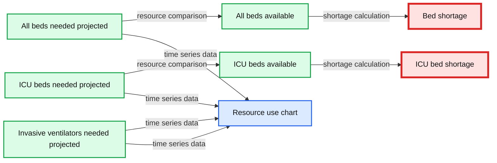
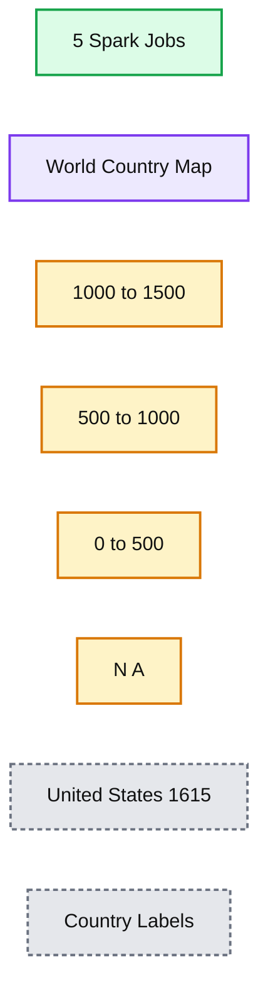
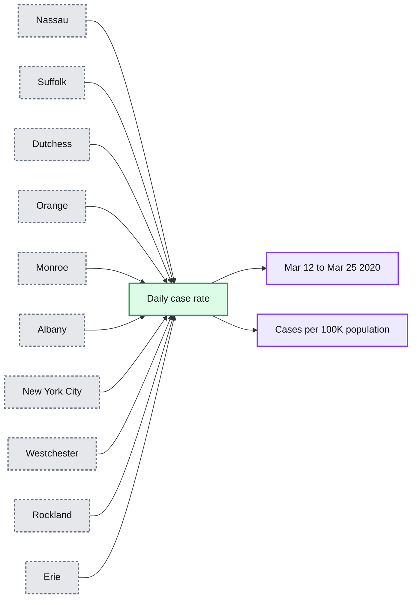
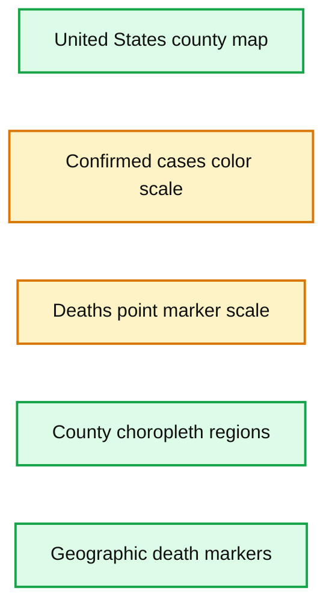
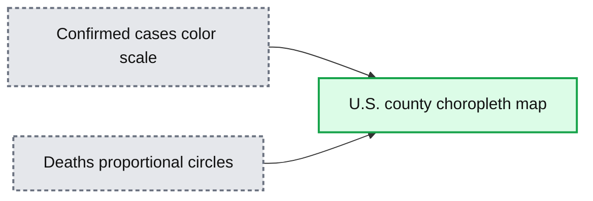

# COVID-19 Datasets Now Available on Databricks: How the Data Community Can Help

- Source: https://www.databricks.com/blog/2020/04/14/covid-19-datasets-now-available-on-databricks.html
- Published: 2020-04-14
- Authors: Denny Lee
- Categories: solutions, engineering, open-source, data-engineering
- Images: 15 total, 6 extracted as architecture

*Free Edition has replaced Community Edition, offering enhanced features at no cost. Start using *[*Free Edition *](https://login.databricks.com/?intent=SIGN_UP&amp;signup_experience_step=EXPRESS&amp;provider=DB_FREE_TIER&amp;dbx_source=www)*today.*
 

*Initially published April 14th, 2020; updated April 21st, 2020*

With the massive disruption of the current COVID-19 pandemic, many data engineers and data scientists are asking themselves “How can the data community help?" The data community is already doing some amazing work in a short amount of time including (but certainly not limited to) one of the most commonly used COVID-19 data sources: [the 2019 Novel Coronavirus COVID-19 (2019-nCoV) Data Repository by Johns Hopkins CSSE](https://github.com/CSSEGISandData/COVID-19). The following animated GIF is a visual representation of the proportional number of confirmed cases (counties) and deaths (circles) spanning from March 22nd to April 14th.

https://www.youtube.com/watch?v=QjFZQyK2i2w

Other examples include [Genomic epidemiology of novel coronavirus](https://nextstrain.org/ncov/2020-04-03) which provides real-time tracking of pathogen evolution (click to [play the transmissions and phylogeny](https://nextstrain.org/ncov/gisaid/global)).

Figure 2: Source: Genomic epidemiology of novel coronavirus (from 2020-04-08)

A powerful example of hospital resource utilization modeling includes the [University of Washington’s Institute of Health and Metrics Evaluation (IHME) COVID-19 projections.](https://covid19.healthdata.org/united-states-of-america) The screenshot below provides the projected hospital resource utilization metrics, highlighting that peak resources were used on March 28th, 2020.

*(from 2020-04-08)*

**Summary:** IHME COVID-19 projections for Italy show hospital resource needs, availability, shortages, and projected resource use over time.

**Components:**

- All beds needed projected
- All beds available
- Bed shortage
- ICU beds needed projected
- ICU beds available
- ICU bed shortage
- Invasive ventilators needed projected
- Date and resource use chart
- Resource category filters
- Uncertainty shaded areas

**Flows:**

- All beds needed -> All beds available: resource comparison
- All beds available -> Bed shortage: shortage calculation
- ICU beds needed -> ICU beds available: resource comparison
- ICU beds available -> ICU bed shortage: shortage calculation
- Projected needs -> Resource use chart: time series visualization

**Numbers:**

- 11 days since peak resource use
- March 28, 2020
- All beds needed: 28,964 beds
- All beds available: 42,521 beds
- Bed shortage: 0 beds
- ICU beds needed: 7,021 beds
- ICU beds available: 2,059 beds
- ICU bed shortage: 4,962 beds
- Invasive ventilators needed: 5,967 ventilators
- All beds needed range: 28,658 to 29,245
- ICU beds needed range: 6,971 to 7,077
- Invasive ventilators needed range: 5,976 to 6,024
- Chart y-axis: 0 to 45k resource count
- Chart dates: Mar 01, Apr 01, May 01, Jun 01, Jul 01, Aug 01
- Caption date: 2020-04-08
- Peak date: March 28, 2020

source image: https://www.databricks.com/wp-content/uploads/2020/04/ihme-italy-min.jpg

 Figure 3: [IHME COVID-19 projections for Italy](https://covid19.healthdata.org/united-states-of-america)

(from 2020-04-08)

## But how can I help?

We believe that overcoming COVID-19 is the world’s toughest problem at the moment, and to help make important decisions, it is important to understand the underlying data. So we’ve taken steps to enable anyone — from first-time data explorers to data professionals — to participate in the effort.

In late March, we began with a data analytics primer of COVID-19 datasets with our tech talk on [Analyzing COVID-19: Can the Data Community Help?](https://www.youtube.com/watch?v=A0uBdY4Crlg) In this session, we performed exploratory data analysis and natural language processing (NLP) with various open source projects, including but not limited to [Apache Spark™](https://www.databricks.com/glossary/what-is-apache-spark), [Python](https://www.python.org/), [pandas](https://pandas.pydata.org/), and [BERT](https://arxiv.org/abs/1810.04805). We have also made these notebooks available for you to download and use in your own environment of choice, whether that is your own local Python virtual environment, cloud computing, or [Databricks Community Edition](https://www.databricks.com/try-databricks).

For example, during this session we analyzed the [COVID-19 Open Research Dataset Challenge (CORD-19)](https://www.kaggle.com/allen-institute-for-ai/CORD-19-research-challenge) dataset and observed:

- There are thousands of JSON files, each containing the research paper text details including their references. The complexity of the JSON schema can make processing this data a complicated task. Fortunately, Apache Spark can quickly and automatically infer the schema of these JSON files and using this notebook, we save the thousands of JSON files into a few Parquet files to make it easier for the subsequent exploratory data analysis.
- As most of this text is unstructured, there are data quality issues including (but not limited to) correctly identifying the primary author’s country. In this notebook, we provide the steps to clean up this data and identify the ISO Alpha 3 country code so we can subsequently map the number of papers by primary author’s country.

**Summary:** Choropleth world map showing the number of COVID-19-related research papers by primary author’s country.

**Components:**

- Spark Jobs, Apache Spark
- World country map, geographic visualization
- Color legend, paper-count ranges
- Country labels, geographic annotations

**Flows:**

- none

**Numbers:** 5; 1000-1500; 500-1000; 0-500; United States 1615

source image: https://www.databricks.com/wp-content/uploads/2020/04/cord-19-paper-source-map-min.jpg

 Figure 4: Number of COVID-19-related research papers by primary author’s country from [Analyzing COVID-19: Can the Data Community Help?](https://www.youtube.com/watch?v=A0uBdY4Crlg)

- Upon cleaning up the data, we can apply various NLP algorithms to it to gain some insight and intuition into this data.  This notebook performs various tasks including generalizing paper abstracts (one paper went from 7800 to 1100 characters) as well as creating the following word cloud based on the titles of these research papers.

 Word cloud based on COVID-19-related research paper titles from [Analyzing COVID-19: Can the Data Community Help?](https://www.youtube.com/watch?v=A0uBdY4Crlg)

## Show me the data!

As most data analysts, engineers, and scientists will attest, the quality of your data has a formidable affect on your exploratory data analysis.  As noted in [A Few Useful Things to Know about Machine Learning (October 2012)](https://dl.acm.org/action/cookieAbsent):

**"A dumb algorithm with lots and lots of data beats a clever one with modest amounts of it.***"*

 

> It is important to note that this quote is to emphasize the importance of having a large amount of high quality data as opposed to trivializing the many other important aspects of machine learning such as (but not limited to) the importance of feature engineering and data alone is not enough.

Many in the data community have been and are continuing to work expediently to provide various SARS-CoV-2 (the cause) and COVID-19 (the disease) datasets on Kaggle and GitHub including.

To make it easier for you to perform your analysis — if you’re using Databricks or [Databricks Community Edition](https://www.databricks.com/try-databricks) — we are periodically refreshing and making available various COVID-19 datasets for research (i.e. non-commercial) purposes.  We are currently refreshing the following datasets and we plan to add more over time:

| **/databricks-datasets/[location]** | **Resource** |
|---|---|
| /../COVID/CORD-19/ | COVID-19 Open Research Dataset Challenge (CORD-19) |
| /../COVID/CSSEGISandData/ | 2019 Novel Coronavirus COVID-19 (2019-nCoV) Data Repository by Johns Hopkins CSSE |
| /../COVID/ESRI_hospital_beds/ | Definitive Healthcare: USA Hospital Beds |
| /../COVID/IHME/ | IHME (UW) COVID-19 Projections |
| /../COVID/USAFacts/ | USA Facts: Confirmed | Deaths |
| /../COVID/coronavirusdataset/ | Data Science for COVID-19 (DS4C) (South Korea) |
| /../COVID/covid-19-data/ | NY Times COVID-19 Datasets |

## Learn more with our exploratory data analysis workshops

Thanks to the positive feedback from our earlier [tech talk](https://www.youtube.com/watch?v=A0uBdY4Crlg), we are happy to announce that we are following up with a workshop series on exploratory data analysis in Python with COVID-19 datasets. The videos will be available on YouTube and the notebooks will be available at [https://github.com/databricks/tech-talks](https://github.com/databricks/tech-talks) for you to use in your environment of choice.

### [Intro to Python on Databricks](https://www.youtube.com/watch?v=HBVQAlv8MRQ)

This workshop shows you the simple steps needed to program in Python using a notebook environment on the free Databricks Community Edition. Python is a popular programming language because of its wide range of applications, including data analysis, machine learning and web development. This workshop covers major foundational concepts to get you started coding in Python, with a focus on data analysis. You will learn about different types of variables, for loops, functions, and conditional statements. No prior programming knowledge is required.

Who should attend this workshop: Anyone and everyone, CS students and even non-technical folks are welcome to join. No prior programming knowledge is required. If you have taken Python courses in the past, this may be too basic for you.

### [Data Analysis with pandas](https://www.youtube.com/watch?v=riSgfbq3jpY)

This workshop focuses on pandas, a powerful open-source Python package for data analysis and manipulation. In this workshop, you learn how to read data, compute summary statistics, check data distributions, conduct basic data cleaning and transformation, and plot simple data visualizations. We will be using the [Johns Hopkins Center for Systems Science and Engineering (CSSE) Novel Coronavirus (COVID-19)](https://github.com/CSSEGISandData/COVID-19) dataset.

**Who should attend this workshop:** Anyone and everyone - CS students and even non-technical folks are welcome to join. Prior basic Python experience is recommended.

**What you need:** Although no prep work is required, we do recommend basic Python knowledge. If you’re new to Python, a great jump start is our [Introduction to Python tutorial](https://www.youtube.com/watch?v=HBVQAlv8MRQ).

### [Machine Learning with scikit-learn](https://www.youtube.com/watch?v=g103iO-izoI)

scikit-learn is one of the most popular open source machine learning libraries for data science practitioners. This workshop walks through the basics of machine learning, the different types of machine learning, and how to build a simple machine learning model. This workshop focuses on the techniques of applying and evaluating machine learning methods, rather than the statistical concepts behind them. We will be using data released by the [Johns Hopkins Center for Systems Science and Engineering (CSSE) Novel Coronavirus (COVID-19)](https://github.com/CSSEGISandData/COVID-19).

**Who should attend this workshop:** Anyone and everyone - CS students and even non-technical folks are welcome to join. Prior basic Python and pandas experience is required. If you’re new to Python and pandas, watch the [Introduction to Python tutorial](https://www.youtube.com/watch?v=HBVQAlv8MRQ) and register for the [Data Analysis with pandas tutorial](https://www.youtube.com/watch?v=riSgfbq3jpY).

### [Introduction to Apache Spark](https://www.youtube.com/watch?v=9U4ED7KQwlE)

This workshop covers the fundamentals of Apache Spark, the most popular big data processing engine. In this workshop, you will learn how to ingest data with Spark, analyze the Spark UI, and gain a better understanding of distributed computing. We will be using data released by the [NY Times](https://github.com/nytimes/covid-19-data). No prior knowledge of Spark is required, but Python experience is highly recommended.

**Who should attend this workshop:** Anyone and everyone - CS students and even non-technical folks are welcome to join. Prior basic Python and pandas experience is required. If you’re new to Python and pandas, watch the [Introduction to Python tutorial](https://www.youtube.com/watch?v=HBVQAlv8MRQ).

## Gaining some insight into COVID-19 datasets

To help you jumpstart your analysis of COVID-19 datasets, we have also included additional notebooks in the[tech-talks/samples](https://github.com/databricks/tech-talks/tree/master/samples) folder for both the [New York Times COVID-19 dataset](https://github.com/nytimes/covid-19-data) and [2019 Novel Coronavirus COVID-19 (2019-nCoV) Data Repository by Johns Hopkins CSSE](https://github.com/CSSEGISandData/COVID-19) (both available and regularly refreshed in /databricks-datasets/COVID).

The [NY Times COVID-19 Analysis notebook](https://github.com/databricks/tech-talks/blob/master/samples/NYT%20COVID-19%20Analysis.html) includes the analysis of COVID-19 cases and deaths by county.

*Figure 6: Proportional COVID-19 cases for Washington State by top 10 counties highlighting when educational facilities were closed (source: New York Times COVID-19 dataset as of April 14th, 2020)*

**Summary:** Line chart showing proportional COVID-19 cases per 100,000 people for Washington State’s top 10 counties from March 7 to March 20, 2020.

**Components:**

- Island county series
- King county series
- Pierce county series
- Snohomish county series
- Kitsap county series
- Spokane county series
- Whatcom county series
- Thurston county series
- Skagit county series
- Yakima county series
- Date axis
- Cases per 100k axis
- New York Times COVID-19 dataset

**Flows:**

- None visible

**Numbers:** 0, 10, 20, 30, 40; March 7, 8, 9, 10, 11, 12, 13, 14, 15, 16, 17, 18, 19, 20; 2020; 16.05677; 14.60416; 3.523567; 2.321892; 2.099494; 1.105082; 1.032574; 0.972161; 0.7651139; 0.4362107; 100k

source image: https://www.databricks.com/wp-content/uploads/2020/04/COVID-19-Cases-Top-10-Washington-Counties.png

Figure 6: Proportional COVID-19 cases for Washington State by top 10 counties highlighting when educational facilities were closed (source: New York Times COVID-19 dataset as of April 14th, 2020)

 

*Figure 7: Proportional COVID-19 cases for New York State by top 10 counties highlighting when educational facilities were closed (source: New York Times COVID-19 dataset as of April 14th, 2020)*

**Summary:** Line chart showing proportional COVID-19 cases per 100,000 population for New York State’s top 10 counties from March 12 to March 25, 2020.

**Components:**

- Nassau county series
- Suffolk county series
- Dutchess county series
- Orange county series
- Monroe county series
- Albany county series
- New York City series
- Westchester county series
- Rockland county series
- Erie county series
- Date axis
- Cases per 100,000 population axis

**Flows:**

- Each county series -> Date axis: daily case-rate trend
- Each county series -> Cases per 100,000 population axis: proportional case values

**Numbers:** 2020; Mar 12, Mar 13, Mar 14, Mar 15, Mar 16, Mar 17, Mar 18, Mar 19, Mar 20, Mar 21, Mar 22, Mar 23, Mar 24, Mar 25; 0, 200, 400, 600, 800, 1000, 1200; Mar 18 values: New York City 82.2125, Westchester 55.50353, Nassau 13.48639, Albany 11.78373, Rockland 9.208414, Orange 8.312984, Suffolk 7.85588, Dutchess 6.797681, Monroe 1.887377, Erie 0.7619446

source image: https://www.databricks.com/wp-content/uploads/2020/04/COVID-19-Cases-Top-10-NY-Counties.png

Figure 7: Proportional COVID-19 cases for New York State by top 10 counties highlighting when educational facilities were closed (source: New York Times COVID-19 dataset as of April 14th, 2020)

Some observations based on the [JHU COVID-19 Analysis](https://github.com/databricks/tech-talks/blob/master/samples/JHU%20COVID-19%20Analysis.html) notebook include:

- As of April 11th, 2020, the schema of the [JHU COVID-19 daily reports](https://github.com/CSSEGISandData/COVID-19/tree/master/csse_covid_19_data/csse_covid_19_daily_reports) has changed three times.  The preceding notebook includes a script that loops through each file, extracts the filename (to obtain the date), and merges the three different schemas together.
- It includes [Altair visualizations](https://altair-viz.github.io/) to visualize the exponential growth of the number of cases and deaths related to COVID-19 in the United States both statically and dynamically via a slider bar.

*COVID-19 Confirmed Cases (counties) and deaths (lat, long) using Altair Choropleth map on 3/22 and 4/11 per Johns Hopkins COVID-19 dataset*

**Summary:** A county-level United States choropleth map shows confirmed COVID-19 cases by color and deaths by geographic point markers on 2020-03-22.

**Components:**

- United States county map
- Confirmed cases color scale
- Deaths point marker scale
- County choropleth regions
- Geographic death markers

**Flows:**

- none

**Numbers:** 2020-03-22; confirmed scale values 1, 10, 100, 1000; deaths scale values 20, 40, 60

source image: https://www.databricks.com/wp-content/uploads/2020/04/covid-19_jhu_8a-sm.png

COVID-19 Confirmed Cases (counties) and deaths (lat, long) using Altair Choropleth map on 3/22 and 4/11 per Johns Hopkins COVID-19 dataset

**Summary:** Altair choropleth map showing U.S. county-level confirmed COVID-19 cases and death locations on 2020-04-11.

**Components:**

- County choropleth map using Altair visualization.
- Confirmed cases color scale using blue shading.
- Death locations using red proportional circles.
- U.S. county geographic boundaries.

**Flows:**

- none

**Numbers:** 2020-04-11; confirmed scale labels 1, 10, 100, 1,000, 10,000; deaths scale labels 2,000, 4,000, 6,000, 8,000, 10,000, 12,000.

source image: https://www.databricks.com/wp-content/uploads/2020/04/covid-19_jhu_8b-sm.png

As well, the [NYT COVID-19 Analysis](https://github.com/databricks/tech-talks/blob/master/samples/NYT%20COVID-19%20Analysis.html) notebook includes county choropleth maps and bar graphs the COVID-19 confirmed cases and deaths (actual and proportional to the population respectively) for a two-week window around when educational facilities were closed for Washington (March 13th, 2020) and New York (March 18th, 2020) states.

Actual and Proportional COVID-19 Confirmed Cases (counties) and Deaths (lat, long) for a two-week window around Educational Facility Closures using Altair Choropleth Map and Bar Graphs per NY Times COVID-19 dataset

## Discussion

The data community can help during this pandemic by providing crucial insight on the patterns behind the data: rate of growth of confirmed cases and deaths in each county, the impact to that growth where states applied social distancing earlier, understanding how we are flattening the curve by social distancing, etc. While at its core, COVID-19 is a medical problem — i.e. how do we save patients' lives — it is also an epidemiological problem where understanding the data will help the medical community make better decisions — e.g. how can we use data to make better public health policies to keep people from becoming patients.

O'Reilly Learning Spark Book

 

Free 2nd Edition includes updates on Spark 3.0, including the new Python type hints for Pandas UDFs, new date/time implementation, etc.

[Free Download](https://www.databricks.com/p/ebook/the-big-book-of-data-engineering?itm_data=blog-link-learningspark)
