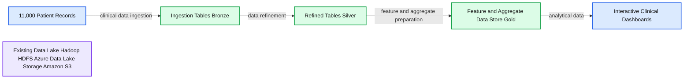
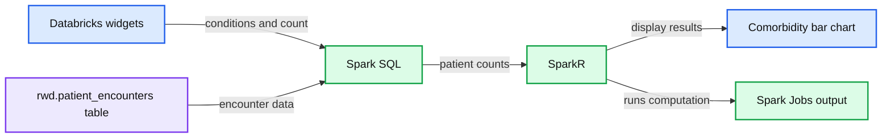

# Building a Modern Clinical Health Data Lake with Delta Lake

- Source: https://www.databricks.com/blog/2020/04/21/building-a-modern-clinical-health-data-lake-with-delta-lake.html
- Published: 2020-04-21
- Authors: Frank Austin Nothaft, Michael Ortega, Amir Kermany
- Categories: platform, engineering, solution-accelerators, data-science-machine-learning
- Images: 10 total, 4 extracted as architecture

The healthcare industry is one of the biggest producers of data. In fact, the average healthcare organization is sitting on [nearly 9 petabytes of medical data](https://hitinfrastructure.com/news/organizations-see-878-health-data-growth-rate-since-2016). The rise of electronic health records (EHR), digital medical imagery, and wearables are contributing to this data explosion. For example, an EHR system at a large provider can catalogue millions of medical tests, clinical interactions, and prescribed treatments. And the potential to learn from this population scale data is massive. By building analytic dashboards and machine learning models on top of these datasets, healthcare organizations can improve the patient experience and drive better health outcomes. Here are few real-world examples:

   

| #### Preventing Neonatal Sepsis Learn more | #### Early Detection of Chronic Disease Learn more | #### Tracking Diseases Across Populations Learn more | #### Preventing Claims Fraud and Abuse Learn more |
|---|---|---|---|

Get an early preview of [O'Reilly's new ebook](https://www.databricks.com/resources/ebook/delta-lake-running-oreilly?itm_data=modernclinicalhealthblog-textpromo-oreillydlupandrunning) for the step-by-step guidance you need to start using Delta Lake.

## Top 3 Big Data Challenges for Healthcare Organizations

Despite the opportunity to improve patient care with analytics and machine learning, healthcare organizations face the classical big data challenges:

- **Variety** - The delivery of care produces a lot of multidimensional data from a variety of data sources. Healthcare teams need to run queries across patients, treatments, facilities and time windows to build a holistic view of the patient experience. This is compute intensive for legacy analytics platforms. On top of that, 80% of healthcare data is unstructured (e.g. clinical notes, medical imaging, genomics, etc). Unfortunately, traditional data warehouses, which serve as the analytics backbone for most healthcare organizations, don’t support unstructured data.
- **Volume** - some organizations have started investing in health data lakes to bring their petabytes of structured and unstructured data together. Unfortunately, traditional query engines struggle with data volumes of this magnitude. A simple ad-hoc analysis can take hours or days. This is too long to wait when adjusting for patient needs in real-time.
- **Velocity** - patients are always coming into the clinic or hospital. With a constant flow of data, EHR records may need to be updated to fix coding errors. It’s critical that a transactional model exists to allow for updates.

As if this wasn’t challenging enough, the data store must also support data scientists who need to run ad-hoc transformations, like creating a longitudinal view of a patient, or build predictive insights with machine learning techniques.

Fortunately, [Delta Lake](https://delta.io), an open-source storage layer that brings ACID transactions to big data workloads, along with [Apache SparkTM](https://spark.apache.org/) can help solve these challenges by providing a transactional store that supports fast multidimensional queries on diverse data along with rich data science capabilities. With Delta Lake and Apache Spark, healthcare organizations can build a scalable clinical data lake for analytics and ML.

In this blog series, we’ll start by walking through a simple example showing how Delta Lake can be used for ad hoc analytics on health and clinical data. In future blogs, we will look at how Delta Lake and Spark can be coupled together to process streaming HL7/FHIR datasets. Finally, we will look at a number of data science use cases that can run on top of a health data lake built with Delta Lake.

## Using Delta Lake to Build a Comorbidity Dashboard

To demonstrate how Delta Lake makes it easier to work with large clinical datasets, we will start off with a simple but powerful use case. We will build a dashboard that allows us to identify comorbid conditions (one or more diseases or conditions that occur along with another condition in the same person at the same time) across a population of patients. To do this, we will use a simulated EHR dataset, generated by the [Synthea simulator](https://github.com/synthetichealth/synthea), made available through Databricks Datasets ([AWS](https://docs.databricks.com/data/databricks-datasets.html) | [Azure](https://docs.microsoft.com/en-us/azure/databricks/data/databricks-datasets)). This dataset represents a cohort of approximately 11,000 patients from Massachusetts, and is stored in 12 CSV files. We will load the CSV files in, before masking protected health information (PHI) and joining the tables together to get the data representation we need for our downstream query. Once the data has been refined, we will use SparkR to build a dashboard that allows us to interactively explore and compute common health statistics on our dataset.

**Summary:** The diagram shows clinical patient records flowing through Delta Lake bronze, silver, and gold layers into interactive clinical dashboards, alongside an existing data lake.

**Components:**

- Patient records: 11,000 clinical records
- Ingestion tables: Delta Lake Bronze layer
- Refined tables: Delta Lake Silver layer
- Feature and aggregate data store: Delta Lake Gold layer
- Existing data lake: Hadoop HDFS, Azure Data Lake Storage, and Amazon S3
- Interactive clinical dashboards: dashboard visualizations

**Flows:**

- Patient records -> Ingestion tables: clinical data ingestion
- Ingestion tables -> Refined tables: data refinement
- Refined tables -> Feature and aggregate data store: feature and aggregate preparation
- Feature and aggregate data store -> Interactive clinical dashboards: analytical data

**Numbers:** 11,000

source image: https://www.databricks.com/wp-content/uploads/2020/04/health-blog-delta.png

This use case is a very common starting point. In a clinical setting, we may look at comorbidities as a way to understand the [risk of a patient’s disease increasing in severity](https://jamanetwork.com/journals/jamapsychiatry/article-abstract/208678). From a medical coding and financial perspective, looking at comorbid diseases may allow us to identify common medical coding issues that impact reimbursement. In pharmaceutical research, looking at comorbid diseases with shared genetic evidence may give us a [deeper understanding of the function of a gene](https://misuse.ncbi.nlm.nih.gov/error/abuse.shtml).

However, when we think about the underlying analytics architecture, we are also at a starting point. Instead of loading data in one large batch, we might seek to load streaming EHR data to allow for real-time analytics. Instead of using a dashboard that gives us simple insights, we may advance to machine learning use cases, such as training a machine learning model that uses data from recent patient encounters to predict the progression of a disease. This can be powerful in an ER setting where streaming data and ML can be used to predict the likelihood of a patient improving or declining in real-time.

In the rest of this blog, we will walk through the implementation of our dashboard. We will first start by using Apache Spark and Delta Lake to ETL our simulated EHR dataset. Once the data has been prepared for analysis, we will then create a notebook that identifies comorbid conditions in our dataset. By using built-in capabilities in Databricks ([AWS](https://docs.databricks.com/notebooks/dashboards.html) | [Azure](https://docs.microsoft.com/en-us/azure/databricks/notebooks/dashboards)), we can then directly transform the notebook into a dashboard.

## ETLing Clinical Data into Delta Lake

To start off, we need to load our CSV data dump into a consistent representation that we can use for our analytical workloads. By using Delta Lake, we can accelerate a number of the downstream queries that we will run. Delta Lake supports Z-ordering, [which allows us to efficiently query data across multiple dimensions](https://www.databricks.com/blog/2018/07/31/processing-petabytes-of-data-in-seconds-with-databricks-delta.html). This is critical for working with EHR data, as we may want to slice and dice our data by patient, by date, by care facility, or by condition, amongst other things. Additionally, the managed Delta Lake offering in Databricks provides additional optimizations, which accelerate exploratory queries into our dataset. Delta Lake also future-proofs our work: while we aren’t currently working with streaming data, we may work with live streams from an EHR system in the future, and Delta Lake’s ACID semantics ([AWS](https://docs.databricks.com/delta/delta-intro.html) | [Azure](https://docs.microsoft.com/en-us/azure/databricks/delta/delta-intro)) make working with streams simple and reliable.

Our workflow follows a few steps that we show in the figure below. We will start by loading the raw/bronze data from our eight different CSV files, we will mask any PHI that is present in the tables, and we will write out a set of silver tables. We will then join our silver tables together to get an easier representation to work with for downstream queries.

Loading our raw CSV files into Delta Lake tables is a straightforward process. Apache Spark has native support for loading CSV, and we are able to load our files with a single line of code per file. While Spark does not have in-built support for masking PHI, we can use Spark’s rich support for user defined functions (UDFs, [AWS](https://docs.databricks.com/spark/latest/spark-sql/udf-python.html) | [Azure](https://docs.microsoft.com/en-us/azure/databricks/spark/latest/spark-sql/udf-python-pandas)) to define an arbitrary function that deterministically masks fields with PHI or PII. In our example notebook, we use a Python function to compute a SHA1 hash. Finally, saving the data into Delta Lake is a single line of code.

Once data has been loaded into Delta, we can optimize the tables by running a simple SQL command. In our example comorbid condition prediction engine, we will want to rapidly query across both the patient ID and the condition they were evaluated for. By using Delta Lake’s Z-ordering command, we can optimize the table so it can be rapidly queried down either dimension. We have done this on one of our final gold tables, which has joined several of our silver tables together to achieve the data representation we will need for our dashboard.

**Summary:** Databricks displays a SQL Z-order optimization command and its resulting Spark job metrics for the `rwd.patients` table.

**Components:**

- SQL command using Delta Lake `OPTIMIZE` with Z-ordering
- Spark Jobs execution indicator
- Metrics table showing files added, files removed, and Z-order statistics
- Databricks command timing and execution metadata

**Flows:**

- SQL command -> Spark Jobs: executes table optimization
- Spark Jobs -> Metrics table: reports optimization metrics

**Numbers:** 1; 107374182400; 0; 2597734; 1; 1.46 seconds; 12/18/2019; 1:24:57 PM

```mermaid
%% Shows the Databricks Z-order optimization command and reported job metrics
flowchart LR
    A[SQL OPTIMIZE rwd patients] -->|executes| B[Spark Jobs]
    B -->|reports metrics| C[Optimization Metrics]
    C -->|shows timing| D[Command Metadata]

    classDef client   fill:#dbeafe,stroke:#2563eb,stroke-width:2px,color:#111
    classDef service  fill:#dcfce7,stroke:#16a34a,stroke-width:2px,color:#111
    classDef store    fill:#ede9fe,stroke:#7c3aed,stroke-width:2px,color:#111
    classDef cache    fill:#fef3c7,stroke:#d97706,stroke-width:2px,color:#111
    classDef queue    fill:#cffafe,stroke:#0891b2,stroke-width:2px,color:#111
    classDef critical fill:#fee2e2,stroke:#dc2626,stroke-width:4px,color:#111
    classDef external fill:#e5e7eb,stroke:#6b7280,stroke-width:2px,color:#111,stroke-dasharray:4 3
    classDef decision fill:#fce7f3,stroke:#db2777,stroke-width:2px,color:#111

    class A client
    class B service
    class C store
    class D external
```

source image: https://www.databricks.com/wp-content/uploads/2020/04/health-blog-code-2.png

## Building a Comorbidity Dashboard

Now that we have prepared our dataset, we will build our dashboard allowing us to explore comorbid conditions, or more simply put, conditions that commonly co-occur in a single patient. Some of the time, these can be precursors/risk factors, for example, high blood pressure is a well known risk factor for stroke and other cardiovascular diseases. By discovering and monitoring comorbid conditions, and other health statistics, we can improve care by identifying risks and advising patients on preventative steps they can take. Ultimately, identifying comorbidities is a counting exercise! We need to identify the distinct set of patients who had both condition A and condition B, which means it can be done all fully in SQL using Spark SQL. In our dashboard, we will follow a simple three step process:

1.
  1. First, we create a data frame that has conditions, ranked by the number of patients they occurred in. This allows the user to visualize the relative frequency of the most common conditions in their dataset.

**Summary:** Spark SQL creates a ranked dataframe of distinct patient conditions and displays the most frequent conditions in a bar chart.

**Components:**

- Databricks notebook command
- Spark SQL query
- Patient encounters table
- Grouping and counting operation
- Ranked condition dataframe
- Bar chart visualization
- Databricks widget for condition limit

**Flows:**

- Patient encounters table -> Spark SQL query: distinct patients and conditions
- Spark SQL query -> Grouping and counting operation: condition records
- Grouping and counting operation -> Ranked condition dataframe: counts by condition
- Ranked condition dataframe -> Bar chart visualization: descending condition counts
- Databricks widget for condition limit -> Ranked condition dataframe: maximum displayed conditions

**Numbers:** Cmd 6; lines 1-13; 0.00, 1.0k, 2.0k, 3.0k, 4.0k, 5.0k, 6.0k, 7.0k, 8.0k; 1 Spark Job; 3.38 seconds; 12/18/2019; 1:57:32 PM

```mermaid
%% Shows Spark SQL condition counting and ranked visualization
flowchart LR
    T[Patient encounters table] -->|distinct patients and conditions| Q[Spark SQL query]
    Q -->|condition records| G[Grouping and counting]
    G -->|descending counts| D[Ranked condition dataframe]
    W[Condition limit widget] -->|maximum rows| D
    D -->|condition counts| C[Bar chart visualization]

    classDef client fill:#dbeafe,stroke:#2563eb,stroke-width:2px,color:#111
    classDef service fill:#dcfce7,stroke:#16a34a,stroke-width:2px,color:#111
    classDef store fill:#ede9fe,stroke:#7c3aed,stroke-width:2px,color:#111
    classDef cache fill:#fef3c7,stroke:#d97706,stroke-width:2px,color:#111
    classDef queue fill:#cffafe,stroke:#0891b2,stroke-width:2px,color:#111
    classDef critical fill:#fee2e2,stroke:#dc2626,stroke-width:4px,color:#111
    classDef external fill:#e5e7eb,stroke:#6b7280,stroke-width:2px,color:#111,stroke-dasharray:4 3
    classDef decision fill:#fce7f3,stroke:#db2777,stroke-width:2px,color:#111

    class T store
    class Q,G,D service
    class W client
    class C client
```

source image: https://www.databricks.com/wp-content/uploads/2020/04/health-blog-code-3.png

1.
  1. We then give the user widgets ([AWS](https://docs.databricks.com/notebooks/widgets.html) | [Azure](https://docs.microsoft.com/en-us/azure/databricks/notebooks/widgets)) to specify two conditions they are interested in comparing. By using Spark SQL, we identify the full set of patients that the condition occurred in.

**Summary:** A Databricks notebook uses SparkR, Spark SQL, and widgets to compare comorbid health conditions and display patient-count results as a bar chart.

**Components:**

- Databricks notebook
- SparkR
- Spark SQL
- Databricks widgets
- `rwd.patient_encounters` table
- Comorbidity bar chart
- Spark Jobs output

**Flows:**

- Databricks widgets -> Spark SQL: selected health conditions and comparison count
- `rwd.patient_encounters` table -> Spark SQL: patient encounter and reason data
- Spark SQL -> SparkR: distinct patients and grouped condition counts
- SparkR -> Comorbidity bar chart: sorted condition frequencies

**Numbers:** 1 Spark Job; code lines 1 through 20; chart axis values 0, 50, 100, 150, 200, 250, 300, 350, 400, 450; command duration 2.95 seconds; timestamp 12/18/2019 2:08:33 PM.

source image: https://www.databricks.com/wp-content/uploads/2020/04/health-blog-code-4.png

1. Since we do this in Spark SQL using SparkR, we can easily collect the count of patients at the end and use a χ2 test to compute significance. We print whether or not the association between the two conditions is statistically significant.

While a data scientist who is rapidly iterating to understand what trends lie in their dataset may be happy working in a notebook, we will encounter a number of users (clinicians, public health officials and researchers, operations analysts, billing analysts) who are less interested in seeing the code underlying the analysis. By using the built-in dashboarding function, we can hide the code and focus on the visualizations we’ve generated. Since we added widgets into our notebook, our users can still provide input to the notebook and change which diseases to compare.

## Get Started Building Your Clinical Data Lake

In this blog, we laid down the fundamentals for building a scalable health data lake with Delta Lake and a simple comorbidity dashboard. To learn more about using Delta Lake to store and process health and clinical datasets:

- Download our [eBook on working with real world clinical datasets](https://pages.databricks.com/201910-EB-Real-World-Evidence.html).
- Sign-up for a free Databricks trial and start experimenting with our [ETL](https://www.databricks.com/notebooks/00-etl-rwd.html) and [dashboarding](https://www.databricks.com/notebooks/01-rwe-dashboard.html) notebooks highlighted in this blog.
