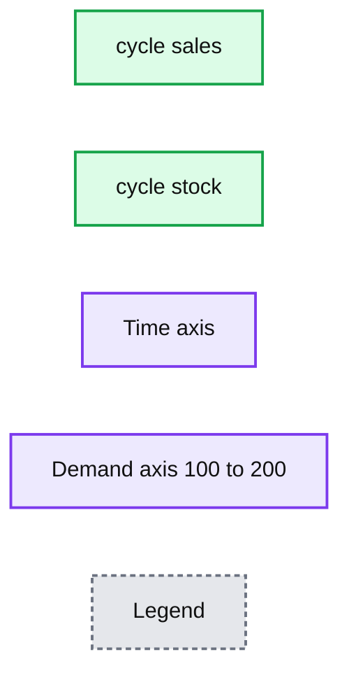
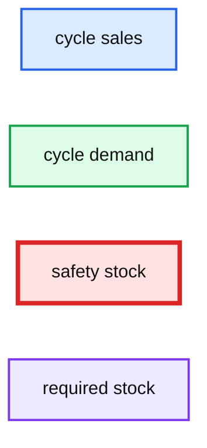
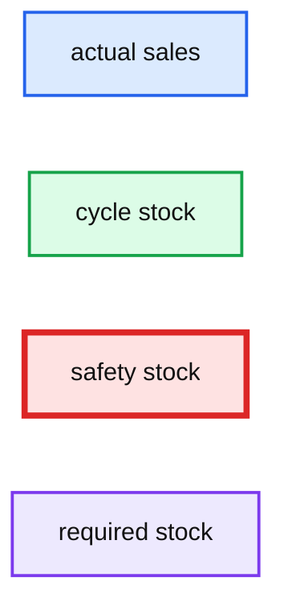

# How a Fresh Approach to Safety Stock Analysis Can Optimize Inventory

- Source: https://www.databricks.com/blog/2020/04/22/how-a-fresh-approach-to-safety-stock-analysis-can-optimize-inventory.html
- Published: 2020-04-22
- Authors: Bryan Smith, Rob Saker
- Categories: engineering, solution-accelerators, data-science-machine-learning
- Images: 3 total, 3 extracted as architecture

>  [Check out the solution accelerator for the accompanying notebook](https://notebooks.databricks.com/notebooks/RCG/Safety_Stock/index.html)

A manufacturer is working on an order for a customer only to find that the delivery of a critical part is delayed by a supplier. A retailer experiences a spike in demand for beer thanks to an unforeseen reason, and they lose sales because of their lack of supply. Customers have a negative experience because of your inability to meet demand. These companies lose immediate revenue and your reputation is damaged. Does this sound familiar?

In an ideal world, demand for goods would be easily predictable. In practice, even the best forecasts are impacted by unexpected events. Disruptions happen due to raw material supply, freight and logistics, manufacturing breakdowns, unexpected demand and more. Retailers, distributors, manufacturers and suppliers all must wrestle with these challenges to ensure they are able to reliably meet their customers' needs while also not carrying excessive inventory. This is where an improved method of safety stock analysis can help your business.

Organizations constantly work on allocating resources where they are needed to meet anticipated demand. The immediate focus is often in improving the accuracy of their forecasts. To achieve this goal, organizations are investing in scalable platforms, in-house expertise, sophisticated new models.

Even the best forecasts do not perfectly predict the future, and sudden shifts in demand can leave shelves bare. This was highlighted in early 2020 when concerns about the virus that causes COVID-19 led to [widespread toilet paper stockouts](https://www.forbes.com/sites/brucelee/2020/03/06/how-covid-19-coronavirus-is-leading-to-toilet-paper-shortages/#9b204777a8dd). As Craig Boyan, the president of H-E-B [commented](https://foxsanantonio.com/news/local/h-e-b-president-talks-toilet-paper-shortage-reassures-customers-there-will-be-enough), "We sold in two weeks what we normally sell in two months."

Scaling up production is not a simple solution to the problem. Georgia-Pacific, a leading manufacturer of toilet paper, [estimated](https://www.usatoday.com/story/money/2020/04/08/coronavirus-shortage-where-has-all-the-toilet-paper-gone/2964143001/) that the average American household would consume 40% more toilet paper as people stayed home during the pandemic. In response, the company was able to boost production by 20% across its 14 facilities configured for the production of toilet paper. Most mills already run operations 24 hours a day, seven days a week with fixed capacity, so any further increase in production would require an expansion in capacity enabled through the purchase of additional equipment or the building of new plants.

This bump in production output can have upstream consequences. Suppliers may struggle to provide the resources required by newly scaled and expanded manufacturing capacity. Toilet paper is a simple product, but its production depends on pulp shipped from forested regions of the U.S., Canada, Scandinavia and Russia as well as more locally sourced recycled paper fiber. It takes time for suppliers to harvest, process and ship the materials needed by manufacturers once initial reserves are exhausted.

A supply chain concept called the [bullwhip effect](https://sloanreview.mit.edu/article/the-bullwhip-effect-in-supply-chains/) underpins all this uncertainty. Distorted information throughout the supply chain can cause large inefficiencies in inventory, increased freight and logistics costs, inaccurate capacity planning and more. Manufacturers or retailers eager to return stocks to normal may trigger their suppliers to ramp production which in turn triggers upstream suppliers to ramp theirs. If not carefully managed, retailers and suppliers may find themselves with excess inventory and production capacity when demand returns to normal or even encounters a slight dip below normal as consumers work through a backlog of their own personal inventories. [Careful consideration](https://www.kinaxis.com/en/blog/preparing-covid-19-and-bullwhip-effect-what-happens-supply-chain-when-you-buy-100-rolls-toilet) of the dynamics of demand along with scrutiny of the uncertainty around the demand we forecast is needed to mitigate this bullwhip effect.

## Managing Uncertainty with Safety Stock Analysis

The kinds of shifts in consumer demand surrounding the COVID-19 pandemic are hard to predict, but they highlight an extreme example of the concept of uncertainty that every organization managing a supply chain must address. Even in periods of relatively normal consumer activity, demand for products and services varies and must be considered and actively managed against.

**Summary:** The chart compares predicted cycle sales with cycle stock over time.

**Components:**

- cycle_sales: predicted sales series
- cycle_stock: cycle stock series
- Time axis: monthly timeline
- Demand axis: values from 100 to 200

**Flows:**

- none

**Numbers:** 100, 120, 140, 160, 180, 200, 2017; April, July, October, January

source image: https://www.databricks.com/wp-content/uploads/2020/04/blog-safety-stock-1.png

Modern demand forecasting tools predict a mean value for demand, taking into consideration the effects of weekly and annual seasonality, long-term trends, holidays and events, and external influencers such as weather, promotions, the economy, and additional factors. They produce a singular value for forecasted demand that can be misleading, as half the time we expect to see demand below this value and the other half we expect to see demand above it.

The mean forecasted value is important to understand, but just as critical is an understanding of the uncertainty on either side of it. We can think of this uncertainty as providing a range of potential demand values, each of which has a quantifiable probability of being encountered. And by thinking of our forecasts this way, we can begin to have a conversation about what parts of this range we should attempt to address.

Statistically speaking, the full range of potential demand is infinite and, therefore, never 100% fully addressable. But long before we need to engage in any kind of theoretical dialogue, we can recognize that each incremental improvement in our ability to address the range of potential demand comes with a sizable (actually exponential) increase in inventory requirements. This leads us to pursue a targeted [service level](https://en.wikipedia.org/wiki/Service_level) at which we attempt to address a specific proportion of the full range of possible demand that balances the revenue goals of our organization with the cost of inventory.

The consequence of defining this service level expectation is that we must carry a certain amount of extra inventory, above the volume required to address our mean forecasted demand, to serve as a buffer against uncertainty. This safety stock, when added to the cycle stock required to meet mean periodic demand, gives us the ability to address most (though not all) fluctuations in actual demand while balancing our overall organizational goals.

**Summary:** Line chart showing cycle sales, cycle demand, safety stock, and required stock over time.

**Components:**

- Cycle sales - technology not shown
- Cycle demand - technology not shown
- Safety stock - technology not shown
- Required stock - technology not shown

**Flows:**

- none

**Numbers:** 100, 150, 200, 2017

source image: https://www.databricks.com/wp-content/uploads/2020/04/blog-safety-stock-2.png

## Calculating the Required Safety Stock Levels

In the classic Supply Chain literature, safety stock is calculated using one of [two formulas](https://www.ascm.org/ascm-insights/) that address uncertainty in demand and uncertainty in delivery. As our focus in this article is on demand uncertainty, we could eliminate the consideration of uncertain lead times, leaving us with a single, simplified safety stock formula to consider:

>  Safety Stock = Ζ * √PC⁄T * σD

In a nutshell, this formula explains that safety stock is calculated as the average uncertainty in demand around the mean forecasted value (σD) multiplied by the square root of the duration of the (performance) cycle for which we are stocking (√PC⁄T) multiplied by a value associated with the portion of the range of uncertainty we wish to address (Ζ). Each component of this formula deserves a little explanation to ensure it is fully understood.

In the previous section of this article, we explained that demand exists as a range of potential values around a mean value which is what our forecast generates. If we assume this range is evenly distributed around this mean, we can calculate an average of this range on either side of the mean value. This is known as a standard deviation. The value σD, also known as the standard deviation of demand, provides us with a measure of the range of values around the mean.

Because we have assumed this range is balanced around the mean, it turns out that we can derive the proportion of the values in this range that exist some number of standard deviations from that mean. If we use our service level expectation to represent the proportion of potential demand we wish to address, we can back into the number of standard deviations in demand that we need to consider as part of our planning for safety stock. The actual math behind the calculation of the required number of standard deviations (known as z-scores as represented in the formula as Ζ) required to capture a percentage of the range of values gets a little complex, but luckily z-score tables are widely published and online calculators are available. With that said, here are some z-score values that correspond to some commonly employed service level expectations:

| Service Level Expectation | Ζ (z-score) |
|---|---|
| 80.00% | 0.8416 |
| 85.00% | 1.0364 |
| 90.00% | 1.2816 |
| 95.00% | 1.6449 |
| 97.00% | 1.8808 |
| 98.00% | 2.0537 |
| 99.00% | 2.3263 |
| 99.90% | 3.0902 |
| 99.99% | 3.7190 |

Finally, we get to the term that addresses the duration of the cycle for which we are calculating safety stock (√PC⁄T). Putting aside why it is we need the square root calculation, this is the simplest element of the formula to understand. The PC⁄T value represents the duration of the cycle for which we are calculating our safety stock. The division by T is simply a reminder that we need to express this duration in the same units as those used to calculate our standard deviation value. For example, if we were planning safety stock for a 7-day cycle, we can take the square root of 7 for this term so long as we have calculated the standard deviation of demand leveraging daily demand values.

## Demand Variance Is Hard to Estimate

On the surface, the calculation of safety stock analysis requirements is fairly straightforward. In Supply Chain Management classes, students are often provided historical values for demand from which they can calculate the standard deviation component of the formula. Given a service level expectation, they can then quickly derive a z-score and pull together the safety stock requirements to meet that target level. But these numbers are wrong, or at least they are wrong outside a critical assumption that is almost never valid.

The sticking point in any safety stock calculation is the standard deviation of demand. The standard formula depends on knowing the variation associated with demand in the future period for which we are planning. It is extremely rare that variation in a time series is stable. Instead, it often changes with trends and seasonal patterns in the data. Events and external regressors exert their own influences as well.

To overcome this problem, supply chain software packages often substitute measures of forecast error such as the root mean squared error (RMSE) or mean absolute error (MAE) for the standard deviation of demand, but these values represent different (though related concepts). This often leads to an underestimation of safety stock requirements as is illustrated in this chart within which a 92.7% service level is achieved despite the setting of a 95% expectation.

**Summary:** The chart compares actual sales with cycle stock, safety stock, and required stock across time.

**Components:**

- actual_sales - technology not shown
- cycle_stock - technology not shown
- safety_stock - technology not shown
- required_stock - technology not shown

**Flows:**

- none

**Numbers:** 50, 100, 150, 200, 2017

source image: https://www.databricks.com/wp-content/uploads/2020/04/blog-safety-stock-3.png

And as most forecasting models work to minimize error while calculating a forecast mean, the irony is that improvements in model performance often exacerbate the problem of underestimation. It's very likely this is behind the [growing recognition](https://medium.com/focal-systems/because-of-click-and-pick-retailers-now-realize-their-on-shelf-availability-scores-are-incorrect-1e21c94247ab) that although many retailers work toward published service level expectations, most of them fall short of these goals.

## Where Do We Go from Here and How Does Databricks Help?

An important first step in addressing the problem is recognizing the shortcomings in our safety stock analysis calculations. Recognition alone is seldom satisfying.

A few researchers are working to define [techniques](https://www.sciencedirect.com/science/article/abs/pii/S0377221716304568) that better estimate demand variance for the explicit purpose of improving safety stock estimation, but there isn't consensus as to how this should be performed. And software to make these techniques easier to implement isn't widely available.

For now, we would strongly encourage supply chain managers to carefully examine their historical service level performance to see whether stated targets are being met. This requires the careful combination of past forecasts as well as historical actuals. Because of the cost of preserving data in traditional database platforms, many organizations do not keep past forecasts or atomic-level source data, but the use of cloud-based storage with data stored in high-performance, compressed formats accessed through on-demand computational technology — provided through platforms such as Databricks — can make this cost effective and provide improved query performance for many organizations.

As automated or digitally-enabled fulfillment systems are deployed — required for many buy online pick up in-store (BOPIS) models — and begin generating real-time data on order fulfillment, companies will wish to use this data to detect out-of-stock issues that indicate the need to reassess service level expectations as well as in-store inventory management practices. Manufacturers that were limited to running these analyses on a daily routine may want to analyze and make adjustments per shift. Databricks' streaming ingestion capabilities provide a solution, enabling companies to perform safety stock analysis with near real-time data.

Finally, consider exploring new methods of generating forecasts that provide better inputs into your inventory planning processes. The combination of using Facebook Prophet with parallelization and autoscaling platforms such as Databricks has allowed organizations to make timely, fine-grained forecasting a reality for many enterprises. Still other forecasting techniques, such as [Generalized Autoregressive Conditional Heteroskedastic (GARCH)](https://www.researchgate.net/publication/286867762_Forecasting_and_Risk_Analysis_in_Supply_Chain_Management_GARCH_Proof_of_Concept) models, may allow you to examine shifts in demand variability that could prove very fruitful in designing a safety stock strategy.

The resolution of the safety stock challenge has significant potential benefits for organizations willing to undertake the journey, but as the path to the end state is not readily defined, flexibility is going to be the key to your success. We believe that Databricks is uniquely positioned to be the vehicle for this journey, and we look forward to working with our customers in navigating it together.

*Databricks thanks Professor [Sreekumar Bhaskaran](https://www.smu.edu/cox/Our-People-and-Community/Faculty/Sreekumar-Bhaskaran) at the Southern Methodist University Cox School of Business for his insights on this important topic.*
