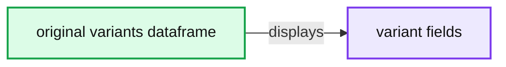
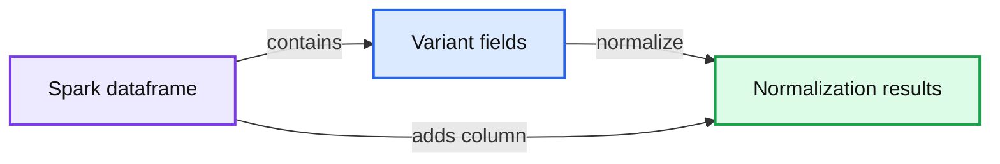

# Glow 0.3.0 Introduces New Large-Scale Genomic Analysis Features

- Source: https://www.databricks.com/blog/2020/04/23/glow-0-3-0-introduces-new-large-scale-genomic-analysis-features.html
- Published: 2020-04-23
- Authors: Kiavash Kianfar
- Categories: engineering, data-science-machine-learning, platform, solutions
- Images: 5 total, 3 extracted as architecture

In October of last year, Databricks and the [Regeneron Genetics Center](https://www.regeneron.com/science/genetics-center)® [partnered together](https://www.databricks.com/blog/2019/10/18/introducing-glow-an-open-source-toolkit-for-large-scale-genomic-analysis.html) to introduce [Project Glow](http://projectglow.io/), an open-source analysis tool aimed at empowering genetics researchers to work on genomics projects at the scale of millions of samples. Since we introduced Glow, we have been busy at work adding new high-quality algorithms, improving performance, and making Glow’s APIs easier to use. Glow 0.3.0 was released on February 21, 2020 and improves Glow’s power and ease of use in performing large-scale, high-throughput genomic analysis. In this blog, we highlight features and improvements introduced in the 0.3.0 release.

## Python and Scala APIs for Glow SQL functions

In this release, native Python and Scala APIs were introduced for all Glow SQL functions, similar to what is available for Spark SQL functions. In addition to improved simplicity, this provides enhanced compile-time safety. The SQL functions and their Python and Scala clients are generated from the same source so any new functionality in the future will always appear in all three languages. Please refer to [Glow PySpark Functions](https://glow.readthedocs.io/en/latest/api-docs/pyspark-functions.html#pyspark-functions) for more information on Python APIs for these functions. A code example showing Python and Scala APIs for the function normalize_variant is presented at the end of the next section.

## Improved variant normalization

The variant normalizer received a major performance improvement in this release. It still behaves like [bcftools norm](https://www.htslib.org/doc/bcftools.html#norm) and [vt normalize](https://genome.sph.umich.edu/wiki/Vt#Normalization), but is about 2.5x faster and has a more flexible API. Moreover, the new normalizer is implemented as a function in addition to a transformer.

**normalize_variants transformer**: The improved transformer preserves the columns of the input dataframe, adds the normalization status to the dataframe, and has the option of adding the normalization results (including the normalized coordinates and alleles) to the dataframe as a new column. To start, we use the following command to read the original_variants_df dataframe. Figure 1 shows the variants in this dataframe.

**Summary:** A Spark SQL dataframe displays original genomic variants before normalization.

**Components:**

- `original_variants_df` - PySpark SQL DataFrame
- Variant columns - contig names, coordinates, alleles, quality, filters, annotations, and genotypes

**Flows:**

- none

**Numbers:** 2 Spark jobs; 11 more fields; coordinates 1259781, 1259782, 1928548, 1928549, 1928550, 1988334, 1988335, 1983388, 1983392, 1983396, 1983400, 1983411, 1983412, 19885710, 19885717, 63669972, 63669973, 64012186, 64012482, 8405578, 8405579, 10382394, 10382395, 10388248, 10388252, 10804283, 10804284, 13255295, 13255296, 13255300, 13255303, 39584005, 39584051; quality 30.0; INFO values 1.0, 0.25, 0.5, 2, 4, 3, 0, 1; genotype values 0 and 1

source image: https://www.databricks.com/wp-content/uploads/2020/04/blog-glow-1.png

 Figure 1: The variant dataframe `original_variants_df`

The improved normalizer transformer can be applied on this dataframe using the following command. This uses the transformer syntax used by the previous version of the normalizer:

**Summary:** A Spark dataframe display shows normalized genomic variants with updated coordinates, alleles, genotype information, and normalization status.

**Components:**

- Spark Jobs - Apache Spark execution indicator
- normalized_variants_df - PySpark DataFrame
- Variant fields - genomic coordinates, alleles, quality, filters, INFO, genotypes, and normalization status

**Flows:**

- none

**Numbers:**

1, 12, 1259649, 1259650, 19285476, 19285480, 19285499, 19285500, 19883344, 19883345, 19883344, 19883345, 19883389, 19883392, 19883396, 19883399, 19883411, 19883412, 19885701, 19885707, 63669643, 63669647, 64011804, 64012100, 8405572, 8405573, 10382388, 10382389, 10388232, 10388236, 10804283, 10804284, 13255295, 13255296, 13255288, 13255291, 39583816, 39583821, 30.0, 4, 2, 1.0, 0.5, 0.25, 0, 1

```mermaid
%% Shows a normalized genomic variants Spark dataframe
flowchart LR
    A[Spark Jobs] -->|displays| B[normalized variants dataframe]
    B -->|contains| C[variant fields]
    C -->|includes| D[normalization status]

    classDef client   fill:#dbeafe,stroke:#2563eb,stroke-width:2px,color:#111
    classDef service  fill:#dcfce7,stroke:#16a34a,stroke-width:2px,color:#111
    classDef store    fill:#ede9fe,stroke:#7c3aed,stroke-width:2px,color:#111
    classDef cache    fill:#fef3c7,stroke:#d97706,stroke-width:2px,color:#111
    classDef queue    fill:#cffafe,stroke:#0891b2,stroke-width:2px,color:#111
    classDef critical fill:#fee2e2,stroke:#dc2626,stroke-width:4px,color:#111
    classDef external fill:#e5e7eb,stroke:#6b7280,stroke-width:2px,color:#111,stroke-dasharray:4 3
    classDef decision fill:#fce7f3,stroke:#db2777,stroke-width:2px,color:#111

    class A client
    class B service
    class C store
    class D decision
```

source image: https://www.databricks.com/wp-content/uploads/2020/04/blog-glow-2.png

 Figure 2: The normalized dataframe `normalized_variants_df`

Figure 2 shows the dataframe generated by the improved normalizer. The `start`, `end`, `referenceAllele`, and `alternateAlleles` fields are updated with the normalized values and a `normalizationStatus` column is added to the dataframe. This column contains a `changed` subfield that indicates whether normalization changed the variant, and an `errorMessage` subfield containing the error message, if an error occurred.

The newly introduced `replace_columns` option can be used to add the normalization results as a new column to the dataframe instead of replacing the original `start`, `end`, `referenceAllele`, and `alternateAlleles` fields:

**Summary:** A Databricks Spark dataframe table displays genomic variants with original fields and an added `normalizationResults` column.

**Components:**

- `normalized_noreplace_variants_df` - Apache Spark DataFrame
- Variant identity fields - `contigName`, `start`, `end`, `names`
- Allele fields - `referenceAllele`, `alternateAlleles`
- Annotation fields - `qual`, `filters`, `splitFromMultiAllelic`, `INFO_AN`, `INFO_AF`, `INFO_AC`
- Genotype data - `genotypes`
- Normalization output - `normalizationResults`
- Spark job indicator - `Spark Jobs`

**Flows:**

- Variant fields -> `normalizationResults`: normalized status and normalized variant coordinates and alleles

**Numbers:**

- `0.3.0`
- `1` Spark Job
- `12` more fields
- Visible chromosome values: `chr20`, `chr21`
- Visible positions: `1259781`, `1259782`, `19285486`, `19285490`, `19285499`, `19285500`, `19883344`, `19883345`, `19883388`, `19883392`, `19883396`, `1983400`, `1983411`, `1983412`, `19885710`, `19885717`, `636696972`, `63669973`, `64012186`, `64012482`, `8405578`, `8405579`, `10382394`, `10382395`, `10388248`, `10388252`, `10804283`, `10804284`, `13255295`, `13255296`, `13255500`, `13255503`, `39584005`, `39584051`
- Visible quality values: `30.0`
- Visible allele frequencies: `1.0`, `0.25`, `0.5`
- Visible allele counts: `1`, `2`, `4`
- Visible genotype values include `0` and `1`

source image: https://www.databricks.com/wp-content/uploads/2020/04/blog-glow-3.png

 Figure 3: The normalized dataframe `normalized_noreplace_variants_df` with normalization results added as a new column

Figure 3 shows the resulting dataframe. A `normalizationResults` column is added to the dataframe. This column contains the normalization status, along with normalized `start`, `end`, `referenceAllele`, and `alternateAlleles` subfields.

Since the multiallelic variant splitter is implemented as a separate transformer in this release, the `mode` option of the `normalize_variants` transformer is deprecated. Refer to the [Variant Normalization documentation](https://glow.readthedocs.io/en/latest/etl/variant-normalization.html#variantnormalization) for more details on the normalize_variants transformer.

**normalize_variant function**: As mentioned [above](https://glow.readthedocs.io/en/latest/blogs/release-0-3-0-blog/release-0-3-0-blog.html#improved-normalizer), this release introduces the normalize_variant SQL expression:

 As discussed in the previous [section](https://glow.readthedocs.io/en/latest/blogs/release-0-3-0-blog/release-0-3-0-blog.html#python-scala-apis), this SQL expression function has Python and Scala APIs as well. Therefore, we can rewrite the previous code example as follows:

 This example can also be easily ported to Scala:

 The result of any of the above commands will be the same as Figure 3.

## A new transformer for splitting multiallelic variants

This release also introduced a new dataframe transformer called `split_multiallelics`. This transformer splits multiallelic variants into biallelic variants, and behaves similarly to [vt decompose](https://genome.sph.umich.edu/wiki/Vt#Decompose) with -s option. This behavior is more powerful than the behavior of the previous splitter, which behaved like GATK’s [LeftAlignAndTrimVariants](https://gatk.broadinstitute.org/hc/en-us/articles/360037225872-LeftAlignAndTrimVariants) with --split-multi-allelics. In particular, the array-type INFO and genotype fields with elements corresponding to reference and alternate alleles are split into biallelic rows (see -s option of [vt decompose](https://genome.sph.umich.edu/wiki/Vt#Decompose)). So are the array-type genotype fields with elements sorted in colex order of genotype calls, e.g., the `GL`, `PL`, and `GP` fields in the VCF format. Moreover, an `OLD_MULTIALLELIC` INFO field is added to the dataframe to store the original multiallelic form of the split variants.

The following is an example of using the `split_multiallelic` transformer on the `original_variants_df`. Figure 4 contains the result of this transformation.

 Figure 4: The split dataframe `split_variants_df`

Please note that the new splitter is implemented as a separate transformer from the `normalize_variants` transformer. Previously, splitting could only be done as one of the operation modes of the `normalize_variants` transformer using the now-deprecated mode option. Please refer to the [documentation of the `split_multiallelics` transformer](https://glow.readthedocs.io/en/latest/etl/variant-splitter.html#split-multiallelics) for complete details on the behavior of this new transformer.

## Parsing of Annotation Fields

The VCF reader and pipe transformer now parse variant annotations from tools such as [SnpEff](http://snpeff.sourceforge.net/index.html) and [VEP](https://www.ensembl.org/info/docs/tools/vep/index.html). This flattens the `ANN` and `CSQ` INFO fields, which simplifies and accelerates queries on annotations. Figure 5 shows the output of the code below, which queries the annotated consequences in a VCF annotated using the [LOFTEE VEP plugin](https://github.com/konradjk/loftee).

 Figure 5: The annotated dataframe `annotated_variants_df` with expanded subfields of the exploded `INFO_CSQ`

## Other Data Analysis Improvements

Glow 0.3.0 also includes optimized implementations of the linear and logistic regression functions, resulting in ~50% performance improvements. See the documentation at [Linear regression](https://glow.readthedocs.io/en/latest/tertiary/regression-tests.html#linear-regression) and [Logistic regression](https://glow.readthedocs.io/en/latest/tertiary/regression-tests.html#logistic-regression).

Furthermore, the new release supports Scala 2.12 in addition to Scala 2.11. The Maven artifacts for both Scala versions are available on [Maven Central](https://search.maven.org/search?q=g:io.projectglow).

## Try Glow 3.0!

Glow 0.3 is installed in the Databricks Genomics Runtime ([Azure](https://docs.microsoft.com/en-us/azure/databricks/runtime/genomicsruntime#dbr-genomics) | [AWS](https://docs.databricks.com/runtime/genomicsruntime.html#dbr-genomics)) and is optimized for improved performance when using cloud computing to analyze large genomics datasets. Learn more about our genomics solutions and how we’re helping to further human and agricultural genome research and enable advances like population-scale next-generation sequencing in the [Databricks Unified Analytics Platform for Genomics](https://www.databricks.com/product/genomics) and [try out a preview today](https://pages.databricks.com/genomics-preview.html).
