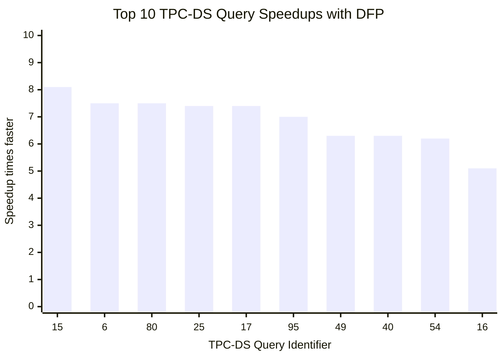
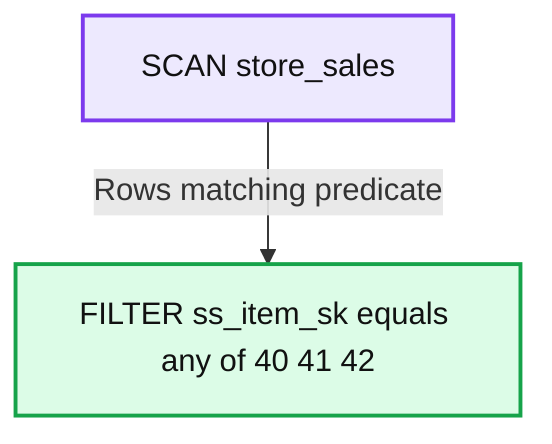
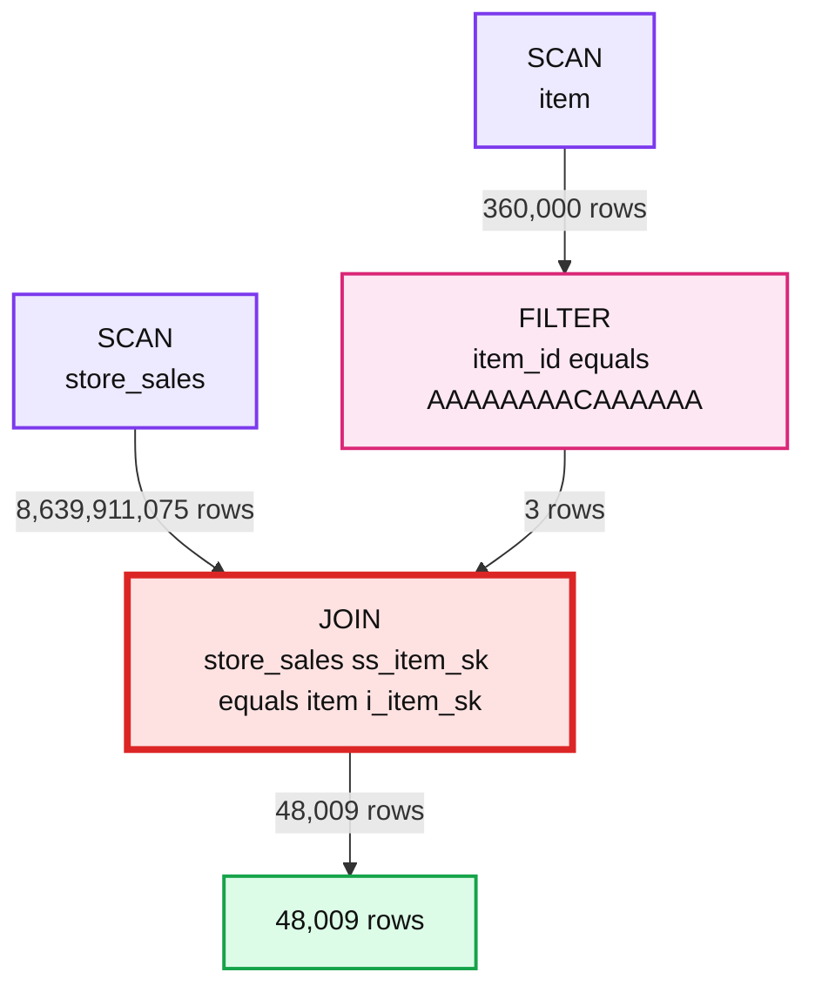
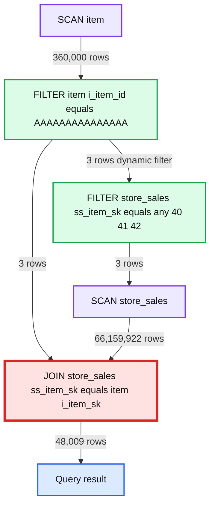
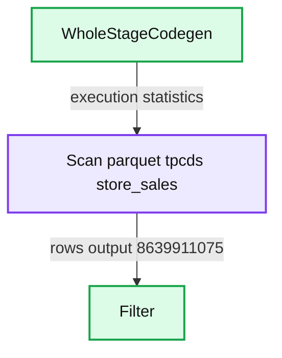
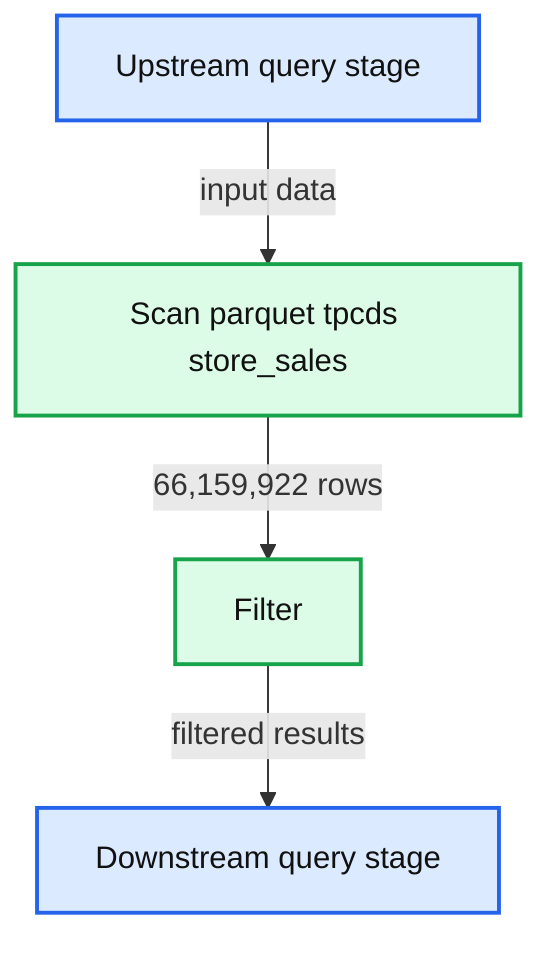
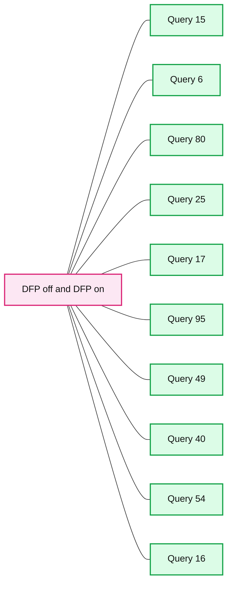

# Faster SQL Queries on Delta Lake with Dynamic File Pruning

- Source: https://www.databricks.com/blog/2020/04/30/faster-sql-queries-on-delta-lake-with-dynamic-file-pruning.html
- Published: 2020-04-30
- Authors: Ali Afroozeh, Bogdan Ghit, Greg Rahn
- Categories: platform, engineering, open-source
- Images: 7 total, 7 extracted as architecture

There are two time-honored optimization techniques for making queries run faster in data systems: process data at a faster rate or simply process less data by skipping non-relevant data. This blog post introduces Dynamic File Pruning (DFP), a new data-skipping technique, which can significantly improve queries with selective joins on non-partition columns on tables in Delta Lake, now enabled by default in Databricks Runtime."

---

 Check out the [Why the Data Lakehouse is Your Next Data Warehouse ebook](https://www.databricks.com/resources/ebook/bring-data-warehousing-data-lakes?itm_data=sqlqueriesdlfilepruning-blog-whylakehouseisnextdw) to discover the inner workings of the Databricks Lakehouse Platform.

---

In our experiments using TPC-DS data and queries with Dynamic File Pruning, we observed up to an 8x speedup in query performance and 36 queries had a 2x or larger speedup.

**Summary:** Benchmark chart showing the top 10 TPC-DS query speedups achieved with Dynamic File Pruning.

**Components:**

- TPC-DS Query Identifier axis
- Speedup axis measured in times faster
- Ten query result bars
- Dynamic File Pruning benchmark

**Flows:**

- none

**Numbers:** 10 queries; y-axis ticks 0.00, 2.00, 4.00, 6.00, 8.00, 10.00; query identifiers 15, 6, 80, 25, 17, 95, 49, 40, 54, 16; approximate speedups 8.1, 7.5, 7.5, 7.4, 7.4, 7.0, 6.3, 6.3, 6.2, 5.1 times faster.

source image: https://www.databricks.com/wp-content/uploads/2020/04/blog-dynamic-file-pruning-1.png

## The Benefits of Dynamic File Pruning

Data engineers frequently choose a [partitioning strategy](https://docs.databricks.com/delta/best-practices.html#choose-the-right-partition-column) for large Delta Lake tables that allows the queries and jobs accessing those tables to skip considerable amounts of data thus significantly speeding up query execution times. Partition pruning can take place at query compilation time when queries include an explicit literal predicate on the partition key column or it can take place at runtime via [Dynamic Partition Pruning](https://www.databricks.com/session_eu19/dynamic-partition-pruning-in-apache-spark).

### Delta Lake on Databricks Performance Tuning

In addition to eliminating data at partition granularity, Delta Lake on Databricks dynamically [skips unnecessary files](https://docs.databricks.com/delta/optimizations/file-mgmt.html#data-skipping) when possible. This can be achieved because Delta Lake automatically collects metadata about data files managed by Delta Lake and so, data can be skipped without data file access. Prior to Dynamic File Pruning, file pruning only took place when queries contained a literal value in the predicate but now this works for both literal filters as well as join filters. This means that Dynamic File Pruning now allows star schema queries to take advantage of data skipping at file granularity.

|  | Per Partition | Per File (Delta Lake on Databricks only) |
|---|---|---|
| Static (based on filters) | Partition Pruning | File Pruning |
| Dynamic (based on joins) | *Dynamic* Partition Pruning | *Dynamic* File Pruning (NEW!) |

## How Does Dynamic File Pruning Work?

Before we dive into the details of how Dynamic File Pruning works, let's briefly present how file pruning works with literal predicates.

### Example 1 - Static File Pruning

For simplicity, let's consider the following query derived from the TPC-DS schema to explain how file pruning can reduce the size of the **SCAN** operation.

Delta Lake stores the minimum and maximum values for each column on a per file basis. Therefore, files in which the filtered values (40, 41, 42) fall outside the min-max range of the ss_item_sk column can be skipped entirely. We can reduce the length of value ranges per file by using data clustering techniques such as [Z-Ordering](https://docs.databricks.com/delta/optimizations/file-mgmt.html#delta-zorder). This is very attractive for Dynamic File Pruning because having tighter ranges per file results in better skipping effectiveness. Therefore, we have Z-ordered the store_sales table by the ss_item_sk column.

In query Q1 the predicate pushdown takes place and thus file pruning happens as a metadata-operation as part of the **SCAN** operator but is also followed by a **FILTER** operation to remove any remaining non-matching rows.

**Summary:** The query plan scans the `store_sales` table with dynamic filtering and passes results to a filter on `ss_item_sk`.

**Components:**

- SCAN: `store_sales` table
- FILTER: Predicate on `ss_item_sk`

**Flows:**

- SCAN -> FILTER: Rows matching dynamic predicate values

**Numbers:** 40, 41, 42

source image: https://www.databricks.com/sites/default/files/inline-images/dynamic-file-pruning-img.png

When the filter contains literal predicates, the query compiler can embed these literal values in the query plan. However, when predicates are specified as part of a join, as is commonly found in most data warehouse queries (e.g., star schema join), a different approach is needed. In such cases, the join filters on the fact table are unknown at query compilation time.

### Example 2 - Star Schema Join without DFP

Below is an example of a query with a typical star schema join.

Query Q2 returns the same results as Q1, however, it specifies the predicate on the dimension table (item), not the fact table (store_sales). This means that filtering of rows for store_sales would typically be done as part of the **JOIN** operation since the values of ss_item_sk are not known until after the **SCAN** and **FILTER** operations take place on the item table.

Below is a logical query execution plan for Q2.

**Summary:** Logical query plan showing scans and filtering on `item` feeding a join with `store_sales`.

**Components:**

- `SCAN store_sales`: Delta Lake table scan.
- `SCAN item`: Delta Lake table scan.
- `FILTER item_id`: SQL predicate filter.
- `JOIN`: SQL join on `store_sales.ss_item_sk = item.i_item_sk`.

**Flows:**

- `SCAN item -> FILTER`: 360,000 rows.
- `FILTER -> JOIN`: 3 rows.
- `SCAN store_sales -> JOIN`: 8,639,911,075 rows.
- `JOIN -> Output`: 48,009 rows.

**Numbers:** 48,009 rows; 8,639,911,075 rows; 3 rows; 360,000 rows; `item_id = AAAAAAAACAAAAAA`

source image: https://www.databricks.com/wp-content/uploads/2020/04/blog-dynamic-file-pruning-3.png

As you can see in the query plan for Q2, only 48K rows meet the **JOIN** criteria yet over 8.6B records had to be read from the store_sales table. This means that the query runtime can be significantly reduced as well as the amount of data scanned if there was a way to push down the **JOIN** filter into the **SCAN** of store_sales.

### Example 3 - Star Schema Join with Dynamic File Pruning

If we take Q2 and enable Dynamic File Pruning we can see that a dynamic filter is created from the build side of the join and passed into the **SCAN** operation for store_sales. The below logical plan diagram represents this optimization.

**Summary:** Dynamic File Pruning creates a filter from the item scan and pushes it into the store_sales scan before joining.

**Components:**

- JOIN on store_sales ss_item_sk equals item i_item_sk
- SCAN store_sales
- FILTER store_sales ss_item_sk equals any of 40, 41, 42
- FILTER item i_item_id equals AAAAAAAAAAAAAAA
- SCAN item

**Flows:**

- SCAN item -> FILTER item: item rows
- FILTER item -> JOIN: filtered item rows
- FILTER item -> FILTER store_sales: dynamic filter
- FILTER store_sales -> SCAN store_sales: pushed filter
- SCAN store_sales -> JOIN: filtered store_sales rows

**Numbers:** 48,009 rows; 66,159,922 rows; 3 rows; 3 rows; 3 rows; 360,000 rows; 40, 41, 42

source image: https://www.databricks.com/wp-content/uploads/2020/04/blog-dynamic-file-pruning-4.png

The result of applying Dynamic File Pruning in the **SCAN** operation for store_sales is that the number of scanned rows has been reduced from 8.6 billion to 66 million rows. Whereas the improvement is significant, we still read more data than needed because DFP operates at the granularity of files instead of rows.

We can observe the impact of Dynamic File Pruning by looking at the DAG from the Spark UI (snippets below) for this query and expanding the **SCAN** operation for the store_sales table. In particular, using Dynamic File Pruning in this query eliminates more than 99% of the input data which improves the query runtime from 10s to less than 1s.

**Summary:** The image shows Spark UI statistics for a WholeStageCodegen scan of the Delta table `tpcds.store_sales`, followed by a filter.

**Components:**

- WholeStageCodegen using Spark SQL execution
- Scan parquet `tpcds.store_sales`
- Filter operation

**Flows:**

- Scan parquet `tpcds.store_sales` -> Filter: rows output

**Numbers:**

- WholeStageCodegen: 3.1 m
- WholeStageCodegen timing: 15 ms, 38 ms, 610 ms
- Number of files read: 531
- Cache writes size uncompressed total: 3.1 MB
- Cache locality manager time: 54 ms
- Filesystem read data size total: 3.2 MB
- Cache async file status fetch waiting time: 6.2 s
- Scan time total: 2.2 m
- Estimated repeated reads high size total: 19.0 GB
- Filesystem read data size sampled total: 3.2 MB
- Filesystem read time sampled total: 522 ms
- Metadata time: 4
- Size of files read total: 535.5 GB
- Cache hits size total: 19.0 GB
- Cache hits size uncompressed total: 19.2 GB
- Estimated repeated reads low size total: 19.0 GB
- Cache writes size total: 3.0 MB
- Rows output: 8,639,911,075
- Filter rows output: 8,639,911,075

source image: https://www.databricks.com/wp-content/uploads/2020/04/blog-dynamic-file-pruning-5.png

Without dynamic file pruning

**Summary:** Query execution statistics show dynamic file pruning scanning 4 files and reading 4.1 GB to produce 66,159,922 rows before filtering.

**Components:**

- Scan parquet tpcds.store_sales execution node
- Filter query execution node

**Flows:**

- Upstream query stage -> Scan parquet tpcds.store_sales: input data
- Scan parquet tpcds.store_sales -> Filter: 66,159,922 rows

**Numbers:**

- Number of files read: 4
- Cache writes size: 0.0 B
- Cache locality manager time: 1 ms
- Filesystem read data size: 0.0 B
- Cache async file status fetch waiting time: 21 ms, 0 ms minimum, 0 ms median, 12 ms maximum
- Scan time: 1.8 s, 7 ms minimum, 53 ms median, 83 ms maximum
- Estimated repeated reads high size: 149.5 MB, 2.2 MB minimum, 4.5 MB median, 5.5 MB maximum
- Filesystem read data size sampled: 0.0 B
- Filesystem read time sampled: 0 ms
- Dynamic partition pruning time: 90 ms
- Metadata time: 87
- Size of files read: 4.1 GB
- Cache hits size: 149.5 MB, 2.2 MB minimum, 4.5 MB median, 5.5 MB maximum
- Cache hits size uncompressed: 151.1 MB, 2.2 MB minimum, 4.5 MB median, 5.6 MB maximum
- Estimated repeated reads low size: 149.5 MB, 2.2 MB minimum, 4.5 MB median, 5.5 MB maximum
- Rows output: 66,159,922

source image: https://www.databricks.com/wp-content/uploads/2020/04/blog-dynamic-file-pruning-6.png

With dynamic file pruning

## Enabling Dynamic File Pruning

DFP is automatically enabled in Databricks Runtime 6.1 and higher, and applies if a query meets the following criteria:

- The inner table (probe side) being joined is in Delta Lake format
- The join type is INNER or LEFT-SEMI
- The join strategy is BROADCAST HASH JOIN
- The number of files in the inner table is greater than the value for spark.databricks.optimizer.deltaTableFilesThreshold

DFP can be controlled by the following configuration parameters:

- spark.databricks.optimizer.dynamicFilePruning (default is true) is the main flag that enables the optimizer to push down DFP filters.
- spark.databricks.optimizer.deltaTableSizeThreshold (default is 10GB) This parameter represents the minimum size in bytes of the Delta table on the probe side of the join required to trigger dynamic file pruning.
- spark.databricks.optimizer.deltaTableFilesThreshold (default is 1000) This parameter represents the number of files of the Delta table on the probe side of the join required to trigger dynamic file pruning.

Note: In the experiments reported in this article we set spark.databricks.optimizer.deltaTableFilesThreshold to 100 in order to trigger DFP because the store_sales table has less than 1000 files

## Experiments and Results with TPC-DS

To understand the impact of Dynamic File Pruning on SQL workloads we compared the performance of TPC-DS queries on unpartitioned schemas from a 1TB dataset. We used Z-Ordering to cluster the joined fact tables on the date and item key columns. DFP delivers good performance in nearly every query. In 36 out of 103 queries we observed a speedup of over 2x with the largest speedup achieved for a single query of roughly 8x. The chart below highlights the impact of DFP by showing the top 10 most improved queries.

**Summary:** The chart compares the number of files read with Dynamic File Pruning off and on across the top 10 TPC-DS queries.

**Components:**

- Number of Files Read axis
- TPC-DS Query Identifier axis
- DFP off series
- DFP on series
- Ten query identifiers: 15, 6, 80, 25, 17, 95, 49, 40, 54, and 16

**Flows:**

- none

**Numbers:** 0, 500, 1000, 1500, 2000, 15, 6, 80, 25, 17, 95, 49, 40, 54, 16

source image: https://www.databricks.com/wp-content/uploads/2020/04/Number-of-Files-Read-with-and-without-DFP-1-1024x538.png

Many TPC-DS queries use a typical star schema join between a date dimension table and a fact table (or multiple fact tables) to filter date ranges which makes it a great workload to showcase the impact of DFP. The data presented in the above chart explains why DFP is so effective for this set of queries -- they are now able to reduce a significant amount of data read. Each query has a join filter on the fact tables limiting the period of time to a range between 30 and 90 days (fact tables store 5 years of data). DFP is very attractive for this workload as some of the queries may access up to three fact tables.

## Getting Started with Dynamic File Pruning

Dynamic File Pruning (DFP), a new feature now enabled by default in Databricks Runtime, can significantly improve the performance of many queries on Delta Lake. DFP is especially efficient when running join queries on non-partitioned tables. The better performance provided by DFP is often correlated to the clustering of data and so, users may consider using Z-Ordering to maximize the benefit of DFP. To leverage these latest performance optimizations, sign up for a [Databricks account today!](https://www.databricks.com/try-databricks)
