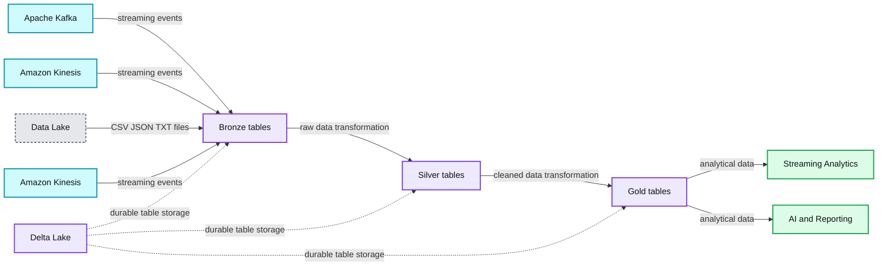
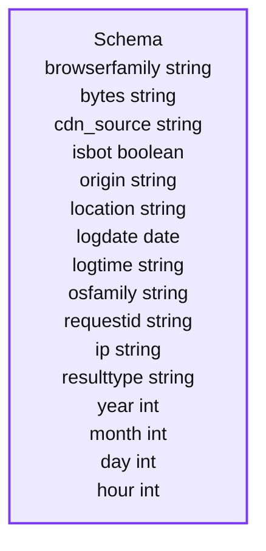
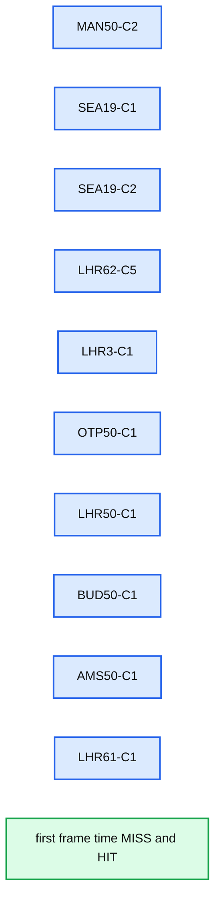
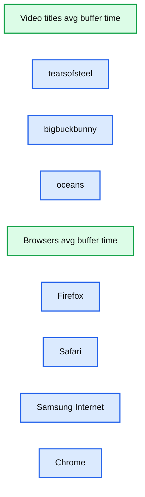
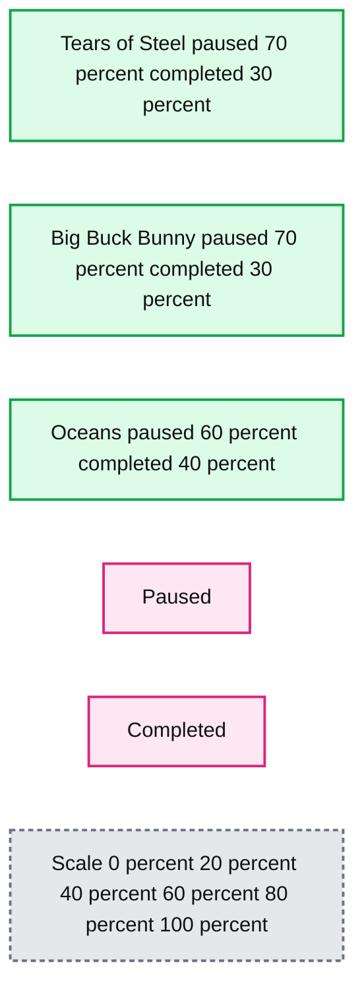
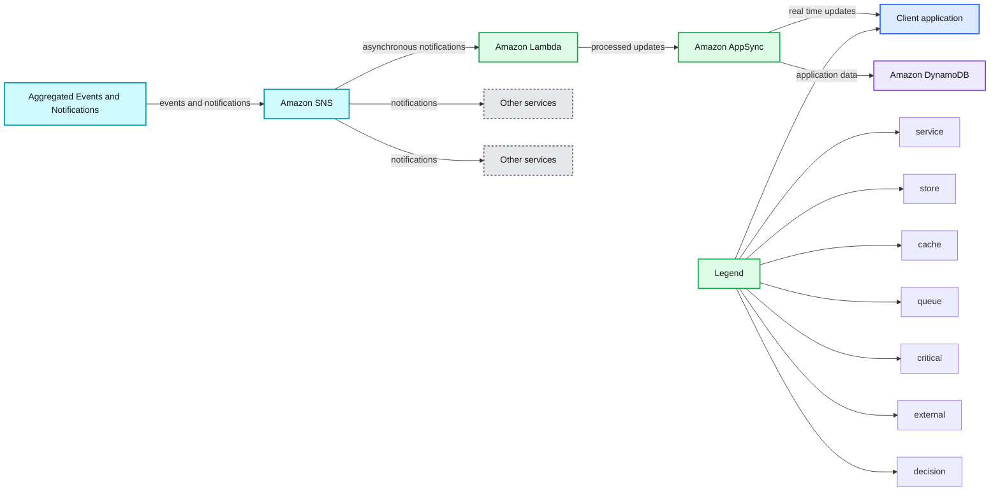

# How to build a Quality of Service (QoS) analytics solution for streaming video services

- Source: https://www.databricks.com/blog/2020/05/06/how-to-build-a-quality-of-service-qos-analytics-solution-for-streaming-video-services.html
- Published: 2020-05-06
- Authors: Andrei Avramescu, Hector Leano
- Categories: platform, engineering, open-source, data-engineering, data-streaming, solution-accelerators
- Images: 12 total, 9 extracted as architecture

#### Click on the following link to view and download the [QoS notebooks](https://www.databricks.com/solutions/accelerators/qos) discussed below in this article.

## Contents

- The Importance of Quality to Streaming Video Services
- Databricks QoS Solution Overview
- Video QoS Solution Architecture
- Making Your Data Ready for Analytics
- Creating the Dashboard / Virtual Network Operations Center
- Creating (Near) Real Time Alerts
- Next steps: Machine learning
- Getting Started with the Databricks Streaming Video Solution

## The Importance of Quality to Streaming Video Services

As traditional pay TV continues to stagnate, content owners have embraced direct-to-consumer (D2C) subscription and ad-supported streaming for monetizing their libraries of content. For companies whose entire business model revolved around producing great content which they then licensed to distributors, the shift to now owning the entire glass-to-glass experience has required new capabilities such as building media supply chains for content delivery to consumers, supporting apps for a myriad of devices and operating systems, and performing customer relationship functions like billing and customer service.

With most vMVPD (virtual multichannel video programming distributor) and SVOD (streaming video on demand) services renewing on a monthly basis, subscription service operators need to prove value to their subscribers every month/week/day (the barriers to a viewer for leaving AVOD (ad-supported video on demand) are even lower - simply opening a different app or channel). General quality of streaming video issues (encompassing buffering, latency, pixelation, jitter, packet loss, and the blank screen) have significant business impacts, whether it’s increased [subscriber churn](https://www.streamingmedia.com/Articles/ReadArticle.aspx?ArticleID=112209) or [decreased video engagement](https://www.tvtechnology.com/opinions/why-buffering-remains-every-video-providers-worst-nightmare).

When you start streaming you realize there are so many places where breaks can happen and the viewer experience can suffer, whether it be an issue at the source in the servers on-prem or in the cloud; in transit at either the CDN level or ISP level or the viewer’s home network; or at the playout level with player/client issues. What breaks at n x 104 concurrent streamers is different from what breaks at n x 105 or n x 106. There is no pre-release testing that can quite replicate real-world users and their ability to push even the most redundant systems to their breaking point as they channel surf, click in and out of the app, sign on from different devices simultaneously, and so on. And because of the nature of TV, things will go wrong during the most important, high profile events drawing the largest audiences. If you start [receiving complaints on social media](https://downdetector.com/), how can you tell if they are unique to that one user or rather regional or a national issue? If national, is it across all devices or only certain types (e.g., possibly the OEM updated the OS on an older device type which ended up causing compatibility issues with the client)?

>Identifying, remediating, and preventing viewer quality of experience issues becomes a big data problem when you consider the number of users, the number of actions they are taking, and the number of handoffs in the experience (servers to CDN to ISP to home network to client). Quality of Service (QoS) helps make sense of these streams of data so you can understand what is going wrong, where, and why. Eventually you can get into predictive analytics around what could go wrong and how to remediate it before anything breaks.

## Databricks QoS Solution Overview

The aim of this solution is to provide the core for any streaming video platform that wants to improve their QoS system. It is based on the [AWS Streaming Media Analytics Solution](https://github.com/awslabs/aws-streaming-media-analytics) provided by AWS Labs which we then built on top of to add Databricks as a unified data analytics platform for both the real time insights and the advanced analytics capabilities.

[By using Databricks](https://www.databricks.com/customers), streaming platforms can **get faster insights** leveraging always the most complete and recent datasets powered by robust and reliable data pipelines, **decreased time to market** for new features by accelerating data science using a collaborative environment with support for managing the end-to-end machine learning lifecycle, **reduced operational costs** across all cycles of software development by having a unified platform for both data engineering and data science.

## Video QoS Solution Architecture

With complexities like low-latency monitoring alerts and highly scalable infrastructure required for peak video traffic hours, the straightforward architectural choice was the Delta Architecture - both standard big data architectures like Lambda and Kappa Architectures having disadvantages around operational effort required to maintain multiple types of pipelines (streaming and batch) and lack of support for unified Data Engineering & Data Science approach.

The Delta Architecture is the next generation paradigm that enables all the types of Data Personas in your organisation to be more productive:

- **Data Engineers** can develop data pipelines in a cost efficient manner continuously without having to choose between batch and streaming
- **Data Analysts** can get near real-time insights and faster answers to their BI queries
- **Data Scientists** can develop better machine learning models using more reliable datasets with support for time travel that facilitates reproducible experiments and reports

**Summary:** Delta Lake uses a multi-hop architecture to ingest streaming and batch data, progressively transform it, and serve streaming analytics plus AI and reporting.

**Components:**

- Apache Kafka: streaming event source
- Amazon Kinesis: streaming event source
- Data Lake: CSV, JSON, and TXT batch source
- Bronze tables: raw ingestion data
- Silver tables: cleaned and transformed data
- Gold tables: curated analytical data
- Delta Lake: storage and transaction layer across the pipeline
- Streaming Analytics: near-real-time analytics
- AI and Reporting: downstream analysis and reporting

**Flows:**

- Apache Kafka -> Bronze tables: streaming events
- Amazon Kinesis -> Bronze tables: streaming events
- Data Lake -> Bronze tables: batch files
- Amazon Kinesis -> Bronze tables: streaming events
- Bronze tables -> Silver tables: raw data transformation
- Silver tables -> Silver tables: multi-hop transformation and consolidation
- Silver tables -> Gold tables: curated data preparation
- Gold tables -> Streaming Analytics: analytical data
- Gold tables -> AI and Reporting: analytical data
- Delta Lake -> Pipeline tables: durable storage and table management

**Numbers:** none



<sub>source image: https://www.databricks.com/wp-content/uploads/2020/05/blog-qos-solutions-1.png</sub>

Fig. 1 Delta Architecture using the “multi-hop” approach for data pipelines

Writing data pipelines using the Delta Architecture follows the best practices of having a multi-layer “multi-hop” approach where we progressively add structure to data: “Bronze” tables or Ingestion tables are usually raw datasets in the native format (JSON, CSV or txt), “Silver” Tables represent cleaned/transformed datasets ready for reporting or data science and “Gold” tables are the final presentation layer.

For the pure streaming use cases, the option of materializing the Dataframes in intermediate Delta tables is basically just a tradeoff between latency/SLAs and cost (an example being real time monitoring alerts vs updates of the recommender system based on new content).

**Summary:** The diagram shows streaming data processed through sequential transformations, materialized in an intermediate Delta table, and then branched into multiple downstream transformation paths and output tables.

**Components:**

- Source table, technology not specified
- T1 transformation, technology not specified
- T2 transformation, technology not specified
- T3 transformation, technology not specified
- Unlabeled transformation, technology not specified
- Intermediate Table, Delta table
- T4 transformation, technology not specified
- T5 transformation, technology not specified
- T6 transformation, technology not specified
- T7 transformation, technology not specified
- Unlabeled upper transformation, technology not specified
- Unlabeled lower transformation, technology not specified
- Two output tables, technology not specified

**Flows:**

- Source table -> T1: data
- T1 -> T2: transformed data
- T2 -> T3: transformed data
- T3 -> Unlabeled transformation: transformed data
- Unlabeled transformation -> Intermediate Table: materialized data
- Intermediate Table -> T4: data
- Intermediate Table -> T5: data
- T4 -> T6: transformed data
- T6 -> Unlabeled upper transformation: transformed data
- T5 -> T7: transformed data
- T7 -> Unlabeled lower transformation: transformed data
- Unlabeled upper transformation -> Upper output table: processed data
- Unlabeled lower transformation -> Upper output table: processed data
- Unlabeled upper transformation -> Right output table: processed data

**Numbers:** 1, 2, 3, 4, 5, 6, 7

```mermaid
%% Streaming transformations materialize data in an intermediate table and branch to outputs
flowchart LR
    A[Source table] -->|data| B[T1]
    B -->|transformed data| C[T2]
    C -->|transformed data| D[T3]
    D -->|transformed data| E[Transformation]
    E -->|materialized data| F[Intermediate Table]
    F -->|data| G[T4]
    F -->|data| H[T5]
    G -->|transformed data| I[T6]
    I -->|transformed data| J[Upper transformation]
    H -->|transformed data| K[T7]
    K -->|transformed data| L[Lower transformation]
    J -->|processed data| M[Upper output table]
    L -->|processed data| M
    J -->|processed data| N[Right output table]

    classDef client   fill:#dbeafe,stroke:#2563eb,stroke-width:2px,color:#111
    classDef service  fill:#dcfce7,stroke:#16a34a,stroke-width:2px,color:#111
    classDef store    fill:#ede9fe,stroke:#7c3aed,stroke-width:2px,color:#111
    classDef cache    fill:#fef3c7,stroke:#d97706,stroke-width:2px,color:#111
    classDef queue    fill:#cffafe,stroke:#0891b2,stroke-width:2px,color:#111
    classDef critical fill:#fee2e2,stroke:#dc2626,stroke-width:4px,color:#111
    classDef external fill:#e5e7eb,stroke:#6b7280,stroke-width:2px,color:#111,stroke-dasharray:4 3
    classDef decision fill:#fce7f3,stroke:#db2777,stroke-width:2px,color:#111

    class A,M,N store
    class B,C,D,E,G,H,I,K,J,L service
    class F critical
``

<sub>source image: https://www.databricks.com/wp-content/uploads/2020/05/blog-qos-solutions-2.png</sub>

Fig. 2 A streaming architecture can still be achieved while materializing dataframes in Delta tables

The number of “hops” in this approach is directly impacted by the number of consumers downstream, complexity of the aggregations ( e.g. structured streaming enforces certain limitations around chaining multiple aggregations) and the maximisation of operational efficiency.

The QoS solution architecture is focused around best practices for data processing and is not a full VOD (video-on-demand) solution - some standard components like the “front door” service Amazon API Gateway being avoided from the high level architecture in order to keep the focus on data and analytics.

**Summary:** High-level QoS analytics architecture connecting application and CDN data sources to Databricks for processing, machine learning, reporting, and downstream AWS services.

**Components:**

- Client devices
- Amazon CloudFront for CDN delivery
- Amazon S3 for CDN logs
- Amazon Kinesis for application events
- Amazon Cognito for user authentication
- Databricks Unified Data Analytics Platform using Delta Lake, Spark, and MLflow
- Machine Learning
- Reporting and Analytics
- Amazon SNS for notifications
- AWS Lambda for event processing
- Amazon AppSync for application data access
- Amazon DynamoDB for storage
- Other services

**Flows:**

- Client devices -> Amazon CloudFront: content requests and delivery
- Amazon CloudFront -> Amazon S3: CloudFront logs
- Client devices -> Amazon Kinesis: app events
- Amazon Cognito -> Client devices: authentication integration
- Amazon S3 -> Databricks: CDN log data
- Amazon Kinesis -> Databricks: unified application event data
- Databricks -> Machine Learning: analytics data
- Databricks -> Reporting and Analytics: processed QoS insights
- Databricks -> Amazon SNS: aggregated events and notifications
- Amazon SNS -> AWS Lambda: notification events
- AWS Lambda -> Amazon AppSync: processed events
- Amazon AppSync -> Amazon DynamoDB: application data
- Amazon SNS -> Other services: notifications

**Numbers:** none

```mermaid
%% High-level QoS analytics architecture and data flows
flowchart LR
    C[Client devices]
    CF[Amazon CloudFront]
    S3[Amazon S3]
    K[Amazon Kinesis]
    COG[Amazon Cognito]
    DBX[Databricks platform]
    ML[Machine Learning]
    RA[Reporting and Analytics]
    SNS[Amazon SNS]
    L[AWS Lambda]
    AS[Amazon AppSync]
    DDB[Amazon DynamoDB]
    OS[Other services]

    C -->|content requests| CF
    CF -->|CloudFront logs| S3
    C -->|app events| K
    COG -->|authentication| C
    S3 -->|CDN log data| DBX
    K -->|unified events| DBX
    DBX -->|analytics data| ML
    DBX -->|QoS insights| RA
    DBX -->|aggregated events and notifications| SNS
    SNS -->|notification events| L
    L -->|processed events| AS
    AS -->|application data| DDB
    SNS -->|notifications| OS

    classDef client   fill:#dbeafe,stroke:#2563eb,stroke-width:2px,color:#111
    classDef service  fill:#dcfce7,stroke:#16a34a,stroke-width:2px,color:#111
    classDef store    fill:#ede9fe,stroke:#7c3aed,stroke-width:2px,color:#111
    classDef cache    fill:#fef3c7,stroke:#d97706,stroke-width:2px,color:#111
    classDef queue    fill:#cffafe,stroke:#0891b2,stroke-width:2px,color:#111
    classDef critical fill:#fee2e2,stroke:#dc2626,stroke-width:4px,color:#111
    classDef external fill:#e5e7eb,stroke:#6b7280,stroke-width:2px,stroke-dasharray:4 3,color:#111
    classDef decision fill:#fce7f3,stroke:#db2777,stroke-width:2px,color:#111

    class C client
    class CF,COG,L,AS,ML,RA service
    class S3,DDB store
    class K,SNS queue
    class DBX critical
    class OS external
```

<sub>source image: https://www.databricks.com/wp-content/uploads/2020/05/blog-qos-solutions-3.png</sub>

Fig. 3 High-Level Architecture for the QoS platform

## Making your data ready for analytics

Both sources of data included in the QoS Solution ( application events and CDN logs ) are using the JSON format, great for data exchange - allowing you to represent complex nested structures, but not scalable and difficult to maintain as a storage format for your data lake / analytics system.

In order to make the data directly queryable across the entire organisation, the Bronze to Silver pipeline (the “make your data available to everyone” pipeline) should transform any raw formats into Delta and include all the quality checks or data masking required by any regulatory agencies.

**Video Applications Events**

Based on the architecture, the video application events are pushed directly to Kinesis Streams and then just ingested to a Delta append only table without any changes to the schema.

Fig. 4 Raw format of the app events

Using this pattern allows a high number of consumers downstream to process the data in a streaming paradigm without having to scale the throughput of the Kinesis stream. As a side effect of using a Delta table as a sink ( which supports [optimize](https://docs.databricks.com/spark/latest/spark-sql/language-manual/delta-optimize.html)! ), we don’t have to worry about the way the size of the processing window will impact the number of files in your target table - known as the “small files” issue in the big data world.

Both the timestamp and the type of message are being extracted from the JSON event in order to be able to partition the data and allow consumers to choose the type of events they want to process. Again combining a single Kinesis stream for the events with a Delta “Events” table reduces the operational complexity while making things easier for scaling during peak hours.

**Summary:** The schema lists fields extracted from CDN log JSON for the Silver table, including browser, network, request, result, and time attributes.

**Components:**

- browserfamily: string
- bytes: string
- cdn_source: string
- isbot: boolean
- origin: string
- location: string
- logdate: date
- logtime: string
- osfamily: string
- requestid: string
- ip: string
- resulttype: string
- year: int
- month: int
- day: int
- hour: int

**Flows:**

- none

**Numbers:** none



<sub>source image: https://www.databricks.com/wp-content/uploads/2020/05/blog-qos-solutions-5.png</sub>

Fig. 5 All the details are extracted from JSON for the Silver table

**CDN Logs**

The CDN Logs are delivered to S3, so the easiest way to process them is the Databricks Auto Loader, which incrementally and efficiently processes new data files as they arrive in S3 without any additional setup.

As the logs contain IPs - considered personal data under the GDPR regulations - the “make your data available to everyone” pipeline has to include an anonymisation step. Different techniques can be used but we decided to just strip the last octet from IPv4 and the last 80 bits from IPv6. On top, the dataset is also enriched with information around the origin country and the ISP provider which will be used later in the Network Operation Centers for localisation.

## Creating the dashboard / virtual Network Operation Centers

Streaming companies need to monitor network performance and the user experience as near real time as possible, tracking down to the individual level with the ability to abstract at the segment level, easily defining new segments such as those defined by geos, devices, networks, and/or current and historical viewing behavior. For streaming companies that has meant adopting the concept of Network Operation Centers (NOC) from telco networks for monitoring the health of the streaming experience for their users at a macro level, flagging and responding to any issues early on. At their most basic, NOCs should have dashboards that compare the current experience for users against a performance baseline so that the product teams can quickly and easily identify and attend to any service anomalies.

In the QoS Solution we have incorporated a [Databricks dashboard](https://docs.databricks.com/notebooks/dashboards.html). BI Tools can also be effortlessly connected in order to build more complex visualisations, but based on customer feedback, built-in dashboards are most of the time the fastest way to present the insights to business users.

The aggregated tables for the NoC will basically be the Gold layer of our Delta Architecture - a combination of CDN logs and the application events.

Fig.6 Example of Network Operations Center Dashboard

The dashboard is just a way to visually package the results of SQL queries or Python / R transformation - each Notebook supports multiple Dashboards so in case of multiple end users with different requirements we don’t have to duplicate the code - as a bonus the refresh can also be scheduled as a Databricks job.

Fig.7 Visualization of the results of a SQL query

Loading time for videos (time to first frame) allows better understanding of the performance for individual locations of your CDN - in this case the AWS CloudFront Edge nodes - which has a direct impact in your strategy for improving this KPI - either by spreading the user traffic over multi-CDNs or maybe just implementing a dynamic origin selection in case of AWS CloudFront using Lambda@Edge.

**Summary:** Bar chart comparing MISS and HIT time to first frame across ten CDN edge locations.

**Components:**

- CDN edge locations: MAN50-C2, SEA19-C1, SEA19-C2, LHR62-C5, LHR3-C1, OTP50-C1, LHR50-C1, BUD50-C1, AMS50-C1, and LHR61-C1
- MISS series
- HIT series
- first_frame_time metric
- resulttype legend

**Flows:**

- none

**Numbers:** Y-axis values 0.00, 0.50, 1.00, 1.50, 2.00, 2.50, 3.00, 3.50, and 4.0. Edge labels contain 50, 2, 19, 1, C2, C1, 62, C5, 3, 0, 5, 61, and 50.



<sub>source image: https://www.databricks.com/wp-content/uploads/2020/05/blog-qos-solutions-8.png</sub>

Failure to understand the reasons for high levels of buffering - and the poor video quality experience that it brings - has a significant impact on subscriber churn rate. On top of that, advertisers are not willing to spend money on ads responsible for reducing the viewer engagement - as they add extra buffering on top, so the profits on the advertising business usually are impacted too. In this context, collecting as much information as possible from the application side is crucial to allow the analysis to be done not only at video level but also browser or even type / version of application.

**Summary:** Two bar charts compare average buffer time by video title and browser.

**Components:**

- Video title chart using avg_buffer_time
- tearsofsteel
- bigbuckbunny
- oceans
- Browser chart using avg_buffer_time
- Firefox
- Safari
- Samsung Internet
- Chrome

**Flows:**

- none

**Numbers:** 0.00, 5.0, 10, 15, 20, 25, 30, 2.0, 4.0, 6.0, 8.0, 10, 12, 14, 16



<sub>source image: https://www.databricks.com/wp-content/uploads/2020/05/blog-qos-solutions-9.png</sub>

On the content side, events for the application can provide useful information about user behaviour and overall quality of experience. How many people that paused a video have actually finished watching that episode / video? Is the cause for stopping the quality of the content or are there delivery issues ? Of course further analyses can be done by linking all the sources together (user behaviour, performance of CDNs / ISPs) to not only create a user profile but also to forecast churn.

**Summary:** Stacked percentage bars compare paused and completed viewing behavior for three videos.

**Components:**

- Tears of Steel viewing outcomes
- Big Buck Bunny viewing outcomes
- Oceans viewing outcomes
- Paused category
- Completed category
- Percentage scale from 0% to 100%

**Flows:**

- none

**Numbers:** 0%, 20%, 40%, 60%, 80%, 100%; Tears of Steel paused 70% and completed 30%; Big Buck Bunny paused 70% and completed 30%; Oceans paused 60% and completed 40%



<sub>source image: https://www.databricks.com/wp-content/uploads/2020/05/blog-qos-solutions-10.png</sub>

## Creating (Near) Real Time Alerts

When dealing with the velocity, volume, and variety of data generated in video streaming from millions of concurrent users, dashboard complexity can make it harder for human operators in the NOC to focus on the most important data at the moment and zero in on root cause issues. With this solution, you can easily set up automated alerts when performance crosses certain thresholds that can help the human operators of the network as well as set off automatic remediation protocols via a Lambda function. For example:

- If a CDN is having latency much higher than baseline (e.g., if it’s more than 10% latency versus baseline average), initiate automatic CDN traffic shifts.
- If more than [some threshold e.g., 5%] of clients report playback errors, alert the product team that there is likely a client issue for a specific device.
- If viewers on a certain ISP are having higher than average buffering and pixelation issues, alert frontline customer representatives on responses and ways to decrease issues (e.g., set stream quality lower).

From a technical perspective generating real-time alerts requires a streaming engine capable of processing data real time and publish-subscribe service to push notifications.

**Summary:** The diagram shows an important event flowing from a producer service through Amazon SNS and a topic to separate Amazon SQS queues consumed by two services.

**Components:**

- Producer Service: event-producing microservice
- Amazon SNS: publish-subscribe notification service
- Topic: SNS topic for event distribution
- Amazon SQS: asynchronous message queue service
- Queue: consumer queue
- Consumer Service A: event-consuming microservice
- Consumer Service B: event-consuming microservice

**Flows:**

- Producer Service -> Amazon SNS: important event
- Amazon SNS -> Topic: published event
- Topic -> Amazon SQS A: important event
- Topic -> Amazon SQS B: important event
- Amazon SQS A -> Queue A: queued message
- Amazon SQS B -> Queue B: queued message
- Queue A -> Consumer Service A: message
- Queue B -> Consumer Service B: message

**Numbers:** none



<sub>source image: https://www.databricks.com/wp-content/uploads/2020/05/blog-qos-solutions-11.png</sub>

```mermaid
%% Shows event distribution using Amazon SNS and Amazon SQS
flowchart LR
    P[Producer Service]
    SNS[Amazon SNS]
    T[Topic]
    SQA[Amazon SQS A]
    SQB[Amazon SQS B]
    QA[Queue A]
    QB[Queue B]
    CA[Consumer Service A]
    CB[Consumer Service B]

    P -->|Important event| SNS
    SNS -->|Published event| T
    T -->|Important event| SQA
    T -->|Important event| SQB
    SQA -->|Queued message| QA
    SQB -->|Queued message| QB
    QA -->|Message| CA
    QB -->|Message| CB

    classDef client   fill:#dbeafe,stroke:#2563eb,stroke-width:2px,color:#111
    classDef service  fill:#dcfce7,stroke:#16a34a,stroke-width:2px,color:#111
    classDef store    fill:#ede9fe,stroke:#7c3aed,stroke-width:2px,color:#111
    classDef cache    fill:#fef3c7,stroke:#d97706,stroke-width:2px,color:#111
    classDef queue    fill:#cffafe,stroke:#0891b2,stroke-width:2px,color:#111
    classDef critical fill:#fee2e2,stroke:#dc2626,stroke-width:4px,color:#111
    classDef external fill:#e5e7eb,stroke:#6b7280,stroke-width:2px,color:#111,stroke-dasharray:4 3
    classDef decision fill:#fce7f3,stroke:#db2777,stroke-width:2px,color:#111

    class P,CA,CB service
    class SNS,T service
    class SQA,SQB,QA,QB queue
```

Fig.8 Integrating microservices using Amazon SNS and Amazon SQS

The QoS solution implements the [AWS best practices for integrating microservices](https://docs.aws.amazon.com/whitepapers/latest/microservices-on-aws/microservices-on-aws.html) by using Amazon SNS and its integrations with Amazon Lambda ( see below the updates of web applications ) or Amazon SQS for other consumers. The [custom foreach writer](https://docs.databricks.com/spark/latest/structured-streaming/foreach.html) option makes the writing of a pipeline to send email notifications based on a rule based engine ( e.g validating the percentage of errors for each individual type of app over a period of time) really straightforward.

Fig.9 Sending email notifications using AWS SNS

On top of the basic email use case, the Demo Player includes three widgets updated real time using AWS AppSync: number of active users, most popular videos, number of users watching concurrently a video.

**Summary:** The diagram shows aggregated events and notifications flowing through Amazon SNS and Lambda to Amazon AppSync, DynamoDB, client applications, and other services.

**Components:**

- Client application
- Amazon AppSync
- Amazon DynamoDB
- Amazon Lambda
- Amazon SNS
- Other services
- Aggregated events and notifications

**Flows:**

- Aggregated events and notifications -> Amazon SNS: events and notifications
- Amazon SNS -> Amazon Lambda: asynchronous notifications
- Amazon Lambda -> Amazon AppSync: processed updates
- Amazon AppSync -> Client application: real-time updates
- Amazon AppSync -> Amazon DynamoDB: application data
- Amazon SNS -> Other services: notifications
- Amazon SNS -> Other services: notifications

**Numbers:** none



<sub>source image: https://www.databricks.com/wp-content/uploads/2020/05/blog-qos-solutions-12.png</sub>

 

Fig.10 Updating the application with the results of real-time aggregations

The QoS Solution is applying a similar approach - Structured Streaming and Amazon SNS - to update all the values allowing for extra consumers to be plugged in using AWS SQS - a common pattern when huge volumes of events have to be enhanced and analysed - pre-aggregate data once and allow each service (consumer) to make its own decision downstream.

## Next Steps: Machine Learning

Manually making sense of the historical data is important but is also very slow - if we want to be able to make automated decisions in the future, we have to integrate machine learning algorithms.

As a Unified Data Analytics Platform, Databricks empowers Data Scientists to build better Data Science products using features like the ML Runtime with the built-in support for [Hyperopt](https://docs.databricks.com/applications/machine-learning/automl-hyperparam-tuning/index.html) / [Horvod](https://docs.databricks.com/applications/machine-learning/train-model/distributed-training/horovod-runner.html) / [AutoML](https://www.databricks.com/product/automl) or the integration with MLFlow, the end-to-end machine learning lifecycle management tool.

We have already explored a few important use cases across our customers base while focusing on the possible extensions to the QoS Solution.

**Point-of-failure prediction & remediation**

As D2C streamers reach more users, the costs of even momentary loss of service increases. ML can help operators move from reporting to prevention by forecasting where issues could come up and remediating before anything goes wrong (e.g., a spike in concurrent viewers leads to switching CDNs to one with more capacity automatically).

**Customer Churn**

Critical to growing subscription services is keeping the subscribers you have. By understanding the quality of service at the individual level, you can add QoS as a variable in churn and customer lifetime value models. Additionally, you can create customer cohorts for those who have had video quality issues in order to test proactive messaging and save offers.

## Getting Started with the Databricks Streaming Video QoS Solution

Providing consistent quality in the streaming video experience is table stakes at this point to keep fickle audiences with ample entertainment options to stay on your platform. With this solution we have sought to create a quick start for most streaming video platform environments to embed this QoS real-time streaming analytics solution in a way that:

- Scales to any audience size
- Quickly flags quality performance issues at key parts of the distribution workflow
- Is flexible and modular enough to easily customize for your audience and your needs such as creating new automated alerts or enabling data scientists to test and roll-out predictive analytics and machine learning.

To get started, download the notebooks for the [Databricks streaming video QoS solution](https://www.databricks.com/solutions/accelerators/qos). For more guidance on how to unify batch and streaming data into a single system, [view the Delta Architecture webinar.](https://www.databricks.com/p/webinar/delta-lake-architecture)
