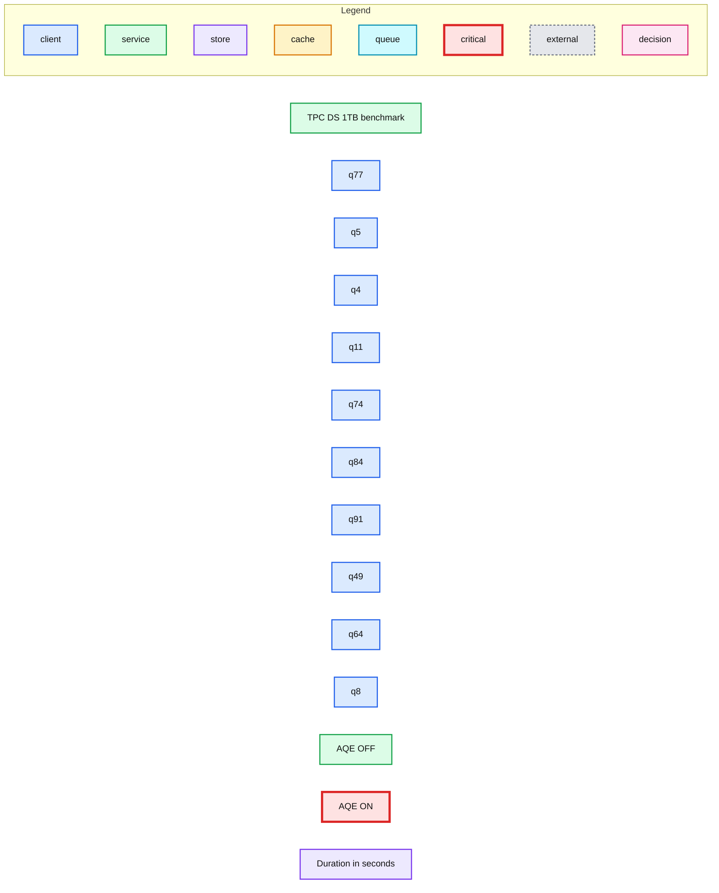
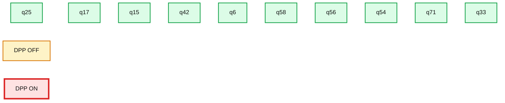
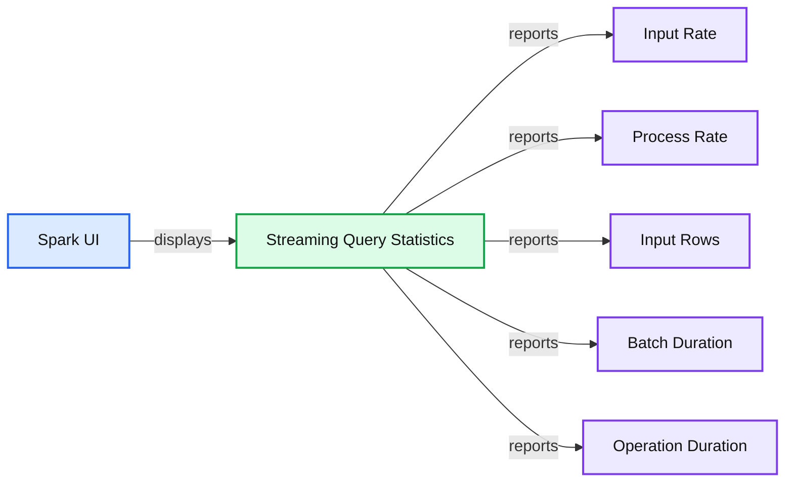

# Now on Databricks: A Technical Preview of Databricks Runtime 7 Including a Preview of Apache Spark 3.0

- Source: https://www.databricks.com/blog/2020/05/13/now-on-databricks-a-technical-preview-of-databricks-runtime-7-including-a-preview-of-apache-spark-3-0.html
- Published: 2020-05-13
- Authors: Yin Huai, Wenchen Fan, Xiao Li
- Categories: platform, solutions, engineering, open-source
- Images: 4 total, 3 extracted as architecture

## Introducing Databricks Runtime 7.0 Beta

We’re excited to announce that the Apache SparkTM 3.0.0-preview2 release is available on Databricks as part of our new Databricks Runtime 7.0 Beta. The 3.0.0-preview2 release is the culmination of tremendous contributions from the open-source community to deliver new capabilities, performance gains and expanded compatibility for the Spark ecosystem. Using the preview is as simple as selecting the version “7.0 Beta” when launching a cluster.

The upcoming release of Apache Spark 3.0 builds on many of the innovations from Spark 2.0, bringing new ideas as well as continuing long-term projects that have been in development. Our vision has always been to unify data and AI, and we’ve continued to invest in making Spark powerful enough to solve your toughest big data problems but also easy to use so that you’d actually be able to. And this is not just for data engineers and data scientists, but also for anyone who does SQL workloads with Spark SQL. Over 3,000 Jira tickets are resolved with this new release of Spark and, while we won’t be able to cover all these new capabilities in depth in this post, we’d like to highlight some of the items in this release.

## Adaptive SQL query optimization

Spark SQL is the engine for Spark. With the Catalyst optimizer, the Spark applications built on DataFrame, Dataset, SQL, Structured Streaming, MLlib and other third-party libraries are all optimized. To generate good query plans, the query optimizer needs to understand the data characteristics. In most scenarios, data statistics are commonly absent, especially when statistics collection is even more expensive than the data processing itself. Even if the statistics are available, the statistics are likely out of date. Because of the storage and compute separation in Spark, the characteristic of data arrival is unpredictable. For all these reasons, runtime adaptivity becomes more critical for Spark than for traditional systems. This release introduces a new **Adaptive Query Execution** (AQE) framework and new runtime filtering for **Dynamic Partition Pruning** (DPP):

- The AQE framework is built with three major features: 1) dynamically coalescing shuffle partitions, 2) dynamically switching join strategies and 3) dynamically optimizing skew joins. Based on a 1TB TPC-DS benchmark without statistics, Spark 3.0 can yield 8x speedup for q77, 2x speedup for q5 and more than 1.1x speedup for another 26 queries. AQE can be enabled by setting SQL config `spark.sql.adaptive.enabled` to `true` (default `false` in Spark 3.0).

**Summary:** The chart compares TPC-DS 1TB query durations with Adaptive Query Execution disabled versus enabled.

**Components:**

- TPC-DS benchmark using Spark 3.0
- Query workloads q77, q5, q4, q11, q74, q84, q91, q49, q64, and q8
- AQE OFF measurements
- AQE ON measurements
- Duration axis measured in seconds

**Flows:**

- none

**Numbers:** 1TB; 3.0; q77; q5; q4; q11; q74; q84; q91; q49; q64; q8; 0; 125; 250; 375; 500; 8x; 2x; 1.1x; 26; `spark.sql.adaptive.enabled`; `false`; `true`

source image: https://www.databricks.com/wp-content/uploads/2020/05/blog-technical-preview-spark-2.png

- DPP occurs when the optimizer is unable to identify at compile time the partitions it can skip. This is not uncommon in star schema, which consists of one or multiple fact tables referencing any number of dimension tables. In such join operations, we can prune the partitions the join reads from a fact table by identifying those partitions that result from filtering the dimension tables. In the TPC-DS benchmark, 60 out of 102 queries show a significant speedup between 2x and 18x.

**Summary:** Benchmark chart comparing TPC-DS 1 TB query durations with Dynamic Partition Pruning disabled and enabled.

**Components:**

- TPC-DS 1 TB benchmark
- Queries q25, q17, q15, q42, q6, q58, q56, q54, q71, and q33
- DPP OFF series
- DPP ON series
- Duration axis in seconds

**Flows:**

- none

**Numbers:** 1 TB; 0, 100, 200, 300, 400 seconds; intermediate gridlines at 50, 150, 250, and 350 seconds; queries q25, q17, q15, q42, q6, q58, q56, q54, q71, q33

source image: https://www.databricks.com/wp-content/uploads/2020/05/blog-technical-preview-spark-3.png

## Richer APIs and functionalities

To enable new use cases and simplify the Spark application development, this release delivers new capabilities and enhances existing features.

- **Enhanced pandas UDFs**. Pandas UDFs were initially introduced in Spark 2.3 for scaling the user-defined functions in PySpark and integrating pandas APIs into PySpark applications. However, the existing interface is difficult to understand when more UDF types are added. This release introduces the new pandas UDF interface with Python-type hints. This release adds two new pandas UDF types, *iterator of series to iterator of series* and *iterator of multiple series to iterator of series*, and three new pandas-function APIs, *grouped map, map* and *co-grouped map*.
- **A complete set of join hints**. While we keep making the compiler smarter, there’s no guarantee that the compiler can always make the optimal decision for every case. Join algorithm selection is based on statistics and heuristics. When the compiler is unable to make the best choice, users still can use the join hints for influencing the optimizer to choose a better plan. This release extended the existing join hints by adding the new hints: SHUFFLE_MERGE, SHUFFLE_HASH and SHUFFLE_REPLICATE_NL.
- **New built-in functions**: There are 32 new built-in functions and higher-order functions are added in Scala APIs. Among these built-in functions, a set of MAP-specific built-in functions [*transform_key, transform_value, map_entries, map_filter, map_zip_with*] are added for simplifying the handling of data type MAP.

## Enhanced monitoring capabilities

This release includes many enhancements that make monitoring more comprehensive and stable. The efficient enhancements do not have a high impact on the performance.

- **New UI for structured streaming:** Structured streaming was initially introduced in Spark 2.0. This release adds the dedicated new Spark UI for inspection of these streaming jobs. This new UI offers two sets of statistics: 1) aggregate information of a streaming query job completed and 2) detailed statistics information about the streaming query, including Input Rate, Process Rate, Input Rows, Batch Duration, Operation Duration, etc.

**Summary:** Spark 3.0.0-SNAPSHOT Spark UI displays detailed streaming query statistics across five monitoring panels.

**Components:**

- Spark 3.0.0-SNAPSHOT UI
- Structured Streaming monitoring view
- Input Rate timeline and histogram
- Process Rate timeline and histogram
- Input Rows timeline and histogram
- Batch Duration timeline and histogram
- Operation Duration stacked timeline

**Flows:**

- Structured Streaming UI -> Streaming Query Statistics: displays query metrics
- Streaming query -> Input Rate: reports records per second
- Streaming query -> Process Rate: reports processed records per second
- Streaming query -> Input Rows: reports input records
- Streaming query -> Batch Duration: reports batch time
- Streaming query -> Operation Duration: reports operation timing breakdown

**Numbers:** 54 seconds 795 ms; 2020/01/29 13:37:06; 56 completed batches; 0ea91be2-91ec-4fe4-ad75-503257cdc505; f274daa1-2c8b-4f79-b689-90d471683fbb; 100.00, 80.00, 60.00, 40.00, 20.00, 0.00 records/sec; 13:37:12; 13:38:01; histogram ticks 0, 10, 20, 30, 40, 50 batches; 8.00, 6.00, 4.00, 2.00, 0.00 records/sec; 1.00, 0.80, 0.60, 0.40, 0.20, 0.00 records; 200.00, 150.00, 100.00, 50.00, 0.00 ms; 120, 100, 80, 60, 40, 20, 0 ms; 13:37:12.082; 13:38:01.055; addBatch 46.0; getBatch 0.0; latestOffset 0.0; queryPlanning 6.0; walCommit 48.0; 13:37:36.935; Spark 2.0; Spark 3.0

source image: https://www.databricks.com/wp-content/uploads/2020/05/blog-technical-preview-spark-4.png

- **Enhanced EXPLAIN command:** Reading plans is critical for understanding and tuning queries. The existing solution looks cluttered and each operator’s string representation can be very wide or even truncated. This release enhanced it with a new FORMATTED mode and also provided a capability to dump the plans to the files.

- **Observable metrics:** Continuously monitoring the changes of the data quality is a highly desirable feature for managing a data pipeline. This release introduced such a capability for both batch and streaming applications. Observable metrics are named arbitrary aggregate functions that can be defined on a query (dataframe). As soon as the execution of a dataframe reaches a completion point (e.g., finishes batch query or reaches streaming epoch), a named event is emitted that contains the metrics for the data processed since the last completion point.

## Try the Spark 3.0 Preview in the Runtime 7.0 Beta

The upcoming Apache Spark 3.0 release brings many new feature capabilities, performance improvements and expanded compatibility to the Spark ecosystem. Aside from core functional and performance improvements for data engineering, data science, data analytics, and machine learning workloads on Apache Spark, these improvements also deliver a significantly improved SQL analyst experience with Spark, including for reporting jobs and interactive queries. Once again, we appreciate all the contributions from the Spark community to make this possible.

This blog post only summarizes some of the salient features in this release. Stay tuned as we will be publishing a series of technical blogs explaining some of these features in more depth.

Learn more about Spark 3.0 in our [preview webinar.](https://www.databricks.com/p/webinar/apache-spark-3-0)  If you want to try the upcoming Apache Spark 3.0 preview in Databricks Runtime 7.0, sign up for a [free trial account](https://www.databricks.com/try-databricks).
