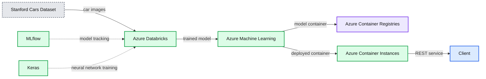

# A Convolutional Neural Network Implementation For Car Classification

- Source: https://www.databricks.com/blog/2020/05/14/a-convolutional-neural-network-implementation-for-car-classification.html
- Published: 2020-05-14
- Authors: Dr. Evan Eames, Henning Kropp
- Categories: platform, engineering, data-science-machine-learning
- Images: 9 total, 4 extracted as architecture

[Convolutional Neural Networks (CNN)](https://en.wikipedia.org/wiki/Convolutional_neural_network) are state-of-the-art Neural Network architectures that are primarily used for computer vision tasks. CNN can be applied to a number of different tasks, such as image recognition, object localization, and change detection. Recently, our partner [Data Insights](https://datainsights.de/) received a challenging request from a major car company: Develop a Computer Vision application which could identify the car model in a given image. Considering that different car models can appear quite similar and any car can look very different depending on their surroundings and the angle at which they are photographed, such a task was, until quite recently, simply impossible.

However, starting around 2012, the *‘[Deep Learning Revolution](https://mitpress.mit.edu/books/deep-learning-revolution)’* made it possible to handle such a problem. Instead of being explained the concept of a car, computers could instead repeatedly study pictures and learn such concepts themselves. In the past few years, additional Artificial Neural Network innovations have resulted in AI that can perform image classification tasks with human-level accuracy. Building on such developments we were able to train a Deep CNN to classify cars by their model. The Neural Network was trained on the Stanford Cars Dataset, which contains over 16,000 pictures of cars, comprising 196 different models. Over time we could see the accuracy of predictions began to improve, as the neural network learned the concept of a car, and how to distinguish between different models.

*Example artificial neural network, with multiple layers between the input and output layers, where the input is an image and the output is a car model classification.*

**Summary:** The diagram shows an image passing through feature learning and classification layers to produce a car model prediction.

**Components:**

- Input image
- Feature learning using lines, curves, and shapes
- Classification neural network
- Car model output

**Flows:**

- Input image -> Feature learning: image features
- Feature learning -> Classification: learned features
- Classification -> Car model: predicted car model

**Numbers:** none

```mermaid
%% Image classification flow from input image to car model output
flowchart LR
    A[Input image] -->|image features| B[Feature learning]
    B -->|learned features| C[Classification]
    C -->|predicted model| D[Car model]

    classDef client   fill:#dbeafe,stroke:#2563eb,stroke-width:2px,color:#111
    classDef service  fill:#dcfce7,stroke:#16a34a,stroke-width:2px,color:#111
    classDef store    fill:#ede9fe,stroke:#7c3aed,stroke-width:2px,color:#111
    classDef cache    fill:#fef3c7,stroke:#d97706,stroke-width:2px,color:#111
    classDef queue    fill:#cffafe,stroke:#0891b2,stroke-width:2px,color:#111
    classDef critical fill:#fee2e2,stroke:#dc2626,stroke-width:4px,color:#111
    classDef external fill:#e5e7eb,stroke:#6b7280,stroke-width:2px,color:#111,stroke-dasharray:4 3
    classDef decision fill:#fce7f3,stroke:#db2777,stroke-width:2px,color:#111

    class A client
    class B,C service
    class D decision
```



<sub>source image: https://www.databricks.com/sites/default/files/inline-images/blog-convolutional-neural-network-image-2.png</sub>

Example artificial neural network, with multiple layers between the input and output layers, where the input is an image and the output is a car model classification.

Together with our partner we build an end-to-end machine learning pipeline using Apache Spark™ and [Koalas](https://github.com/databricks/koalas) for the data preprocessing, [Keras](https://keras.io/) with [Tensorflow](https://www.tensorflow.org/) for the model training, [MLflow](https://mlflow.org/) for the tracking of models and results, and [Azure ML](https://azure.microsoft.com/en-us/services/machine-learning/) for the deployment of a REST service. This setup within Azure Databricks is optimized to train networks fast and efficiently, and also helps to try many different CNN configurations much more quickly. Even after only a few practice attempts, the CNN's accuracy reached around 85%.

**Summary:** The diagram shows a car image classification workflow from the Stanford Cars Dataset through Azure Databricks training and Azure Machine Learning model serving.

**Components:**

- Stanford Cars Dataset with 16,000 car pictures and 196 models
- Azure Databricks for preprocessing and model training
- MLflow for model tracking
- Keras for neural network development
- Azure Machine Learning for deployment
- Azure Container Registries for model containers
- Azure Container Instances for serving containers
- Client for accessing the served model

**Flows:**

- Stanford Cars Dataset -> Azure Databricks: car images
- Azure Databricks -> Azure Machine Learning: trained model
- Azure Machine Learning -> Azure Container Registries: model container
- Azure Machine Learning -> Azure Container Instances: deployed container
- Azure Container Instances -> Client: REST service

**Numbers:** 16,000; 196



<sub>source image: https://www.databricks.com//wp-content/uploads/2020/05/blog-convolutional-neural-network-3.png</sub>

## Setting up  an Artificial Neural Network to Classify Images

In this article we are outlining some of the main techniques used in getting a Neural Network up into production. If you’d like to attempt to get the Neural Network running yourself, the full notebooks with a meticulous step-by-step guide included, can be found below.

This demo uses the publicly available Stanford Cars Dataset which is one of the more comprehensive public data sets, although a little outdated, so you won’t find car models post 2012 (although, once trained, transfer learning could easily allow a new dataset to be substituted). The data is provided through an ADLS Gen2 storage account that you can mount to your workspace.

For the first step of data preprocessing the images are compressed into [hdf5](https://www.neonscience.org/resources/learning-hub/tutorials/about-hdf5) files (one for training and one for testing). This can then be read in by the neural network. This step can be omitted completely, if you like, as the hdf5 files are part of the ADLS Gen2 storage provided as part of the here provided notebooks.

- [Load Stanford Cars dataset into HDF5 files](https://www.databricks.com/notebooks/cnn-car-class/load-images-in-hdf5.html)
- [Use Koalas for image augmentation](https://www.databricks.com/notebooks/cnn-car-class/koalas-augmentation.html)
- [Train the CNN with Keras](https://www.databricks.com/notebooks/cnn-car-class/keras-resnet150-for-image-classification.html)
- [Deploy model as REST service to Azure ML](https://www.databricks.com/notebooks/cnn-car-class/azure-ml-deployment.html)

## Image Augmentation with Koalas

The quantity and diversity of data gathered has a large impact on the results one can achieve with deep learning models. Data augmentation is a strategy that can significantly improve learning results without the need to actually collect new data. With different techniques like cropping, padding, and horizontal flipping, which are commonly used to train large neural networks, the data sets can be artificially inflated by increasing the number of images for training and testing.

Applying augmentation to a large corpus of training data can be very expensive, especially when comparing the results of different approaches. With [Koalas](https://github.com/databricks/koalas) it becomes easy to try existing frameworks for image augmentation in Python, and scaling the process out on a cluster with multiple nodes using the to data science familiar Pandas API.

## Coding a ResNet in Keras

When you break apart a CNN, they comprise different *‘blocks’*, with each block simply representing a group of operations to be applied to some input data. These blocks can be broadly categorized into:

- **Identity Block:** A series of operations which keep the shape of the data the same.
- **Convolution Block:** A series of operations which reduce the shape of the input data to a smaller shape.

A CNN is a series of both Identity Blocks and Convolution Blocks (or ConvBlocks) which reduce an input image to a compact group of numbers. Each of these resulting numbers (if trained correctly) should eventually tell you something useful towards classifying the image. A Residual CNN adds an additional step for each block. The data is saved as a temporary variable before the operations that constitute the block are applied, and then this temporary data is added to the output data. Generally, this additional step is applied to each block. As an example the below figure demonstrates a simplified CNN for detecting handwritten numbers:

**Summary:** The diagram shows a CNN processing a handwritten digit through feature extraction and classification.

**Components:**

- Input handwritten digit image
- Convolution layer with 32 filters
- Convolution layer with 64 filters
- Subsampling layer with stride 2 by 2
- Dropout layer
- Fully connected layer
- Dropout layer
- Output classes for digits 0 through 9

**Flows:**

- Input image -> First convolution: handwritten digit pixels
- First convolution -> Second convolution: extracted feature maps
- Second convolution -> Subsampling: deeper feature maps
- Subsampling -> Dropout: reduced feature maps
- Dropout -> Fully connected: regularized features
- Fully connected -> Dropout: class representations
- Dropout -> Output classes: digit predictions

**Numbers:** 28 x 28, 28 x 28, 14 x 14, 32 filters, 64 filters, stride 2 by 2, 0, 1, 8, 9


<sub>source image: https://www.databricks.com//wp-content/uploads/2020/05/blog-convolutional-neural-network-6.png</sub>

 

There are many different methods of implementing a Neural Network. One of the more intuitive ways is via [Keras](https://keras.io/). Keras provides a simple front-end library for executing the individual steps which comprise a neural network. Keras can be configured to work with a [Tensorflow](https://www.tensorflow.org/) back-end, or a Theano back-end. Here, we will be using a Tensorflow back-end. A Keras network is broken up into multiple layers as seen below. For our network we are also defining our customer implementation of a layer.

**Summary:** The diagram shows a Keras convolutional residual network that progressively reduces a 224 by 224 RGB-D image through convolution, pooling, residual blocks, average pooling, and fully connected layers for car classification.

**Components:**

- RGB-D image input
- 7x7 convolution with 64 kernels and stride 2
- Max pooling layer
- Residual blocks with 64-channel convolutions
- Residual blocks with 128-channel convolutions
- Residual blocks with 256-channel convolutions
- Residual blocks with 512-channel convolutions
- Average pooling layer
- Fully connected layers with 256, 64, 64, and 2 neurons
- Linear light-direction output with phi and theta

**Flows:**

- RGB-D image -> 7x7 convolution: image data
- 7x7 convolution -> max pool: feature maps
- Max pool -> 64-channel residual blocks: downsampled feature maps
- 64-channel residual blocks -> 128-channel residual blocks: reduced-resolution features
- 128-channel residual blocks -> 256-channel residual blocks: reduced-resolution features
- 256-channel residual blocks -> 512-channel residual blocks: reduced-resolution features
- 512-channel residual blocks -> average pool: learned feature maps
- Average pool -> fully connected 256: pooled features
- Fully connected 256 -> fully connected 64: learned representation
- Fully connected 64 -> fully connected 64: learned representation
- Fully connected 64 -> fully connected 2: prediction features
- Fully connected 2 -> linear output: light-direction prediction

**Numbers:** 224 x 224 x 4, RGB-D, 7 x 7, 64, 2, 3 x 3, 1 x 1, 2 residual blocks, 16 residual blocks, 48 convolutional layers, 256, 512, 1024, 128, 2048, 4 fully connected layers, 2 output values, phi, theta

```text
%% mermaid failed to render; kept as text
%% Shows the convolutional residual network flow from RGB-D input to light direction output
flowchart LR
    A[RGB-D image 224 x 224 x 4] -->|image data| B[7 x 7 convolution 64 stride 2]
    B -->|feature maps| C[Max pooling]
    C -->|downsampled features| D[64 channel residual blocks]
    D -->|reduced resolution| E[128 channel residual blocks]
    E -->|reduced resolution| F[256 channel residual blocks]
    F -->|reduced resolution| G[512 channel residual blocks]
    G -->|feature maps| H[Average pooling]
    H -->|pooled features| I[Fully connected 256]
    I -->|representation| J[Fully connected 64]
    J -->|representation| K[Fully connected 64]
    K -->|prediction features| L[Fully connected 2]
    L -->|light direction| M[Linear output phi theta]

    classDef client   fill:#dbeafe,stroke:#2563eb,stroke-width:2px,color:#111
    classDef service  fill:#dcfce7,stroke:#16a34a,stroke-width:2px,color:#111
    classDef store    fill:#ede9fe,stroke:#7c3aed,stroke-width:2px,color:#111
    classDef cache    fill:#fef3c7,stroke:#d97706,stroke-width:2px,color:#111
    classDef queue    fill:#cffafe,stroke:#0891b2,stroke-width:2px,color:#111
    classDef critical fill:#fee2e2,stroke:#dc2626,stroke-width:4px,color:#111
    classDef external fill:#e5e7eb,stroke:#6b7280,stroke-width:2px,color:#111,stroke-dasharray:4 3
    classDef decision fill:#fce7f3,stroke:#db2777,stroke-width:2px,color:#111
    client = clients/edge/gateway/LB, service = stateless compute, store = databases/durable storage, cache = Redis/CDN/anything losable, queue = Kafka/streams/async pipes, critical = the bottleneck or SPOF, external = third-party, decision = a trade-off point

    class A client
    class B,C,D,E,F,G,H,I,J,K,L,M service
```

<sub>source image: https://www.databricks.com//wp-content/uploads/2020/05/blog-convolutional-neural-network-7.png</sub>

## The Scale Layer

For any custom operation that has trainable weights Keras allows you to [implement your own layer](https://keras.io/guides/making_new_layers_and_models_via_subclassing/). When dealing with huge amounts of image data, one can run into memory issues. Initially, RGB images contain integer data (0-255). When running gradient descent as part of the optimisation during backpropagation, one will find that integer gradients do not allow for sufficient accuracy to properly adjust network weights. Therefore, it is necessary to change to float precision. This is where issues can arise. Even when images are scaled down to 224x224x3, when we use ten thousand training images, we are looking at over 1 billion floating point entries. As opposed to turning an entire dataset to float precision, better practice is to use a ‘Scale Layer’, which scales the input data one image at a time, and only when it is needed. This should be applied after Batch Normalization in the model. The parameters of this Scale Layer are also parameters that can be learned through training.

To use this custom layer also during scoring we have to package the class together with our model. With MLflow we can achieve this with a Keras custom_objects dictionary mapping names (strings) to custom classes or functions associated with the Keras model. MLflow saves these custom layers using CloudPickle and restores them automatically when the model is loaded with [mlflow.keras.load_model()](https://www.mlflow.org/docs/latest/python_api/mlflow.keras.html#mlflow.keras.load_model) and [mlflow.pyfunc.load_model()](https://www.mlflow.org/docs/latest/python_api/mlflow.pyfunc.html#mlflow.pyfunc.load_model).

## Tracking Results with MLflow and Azure Machine Learning

Machine learning development involves additional complexities beyond software development. That there are a myriad of tools and frameworks makes it hard to track experiments, reproduce results and deploy machine learning models. Together with Azure Machine Learning one can accelerate and manage the end-to-end machine learning lifecycle using MLflow to reliably build, share and deploy machine learning applications using Azure Databricks.

In order to automatically track results, an existing or new Azure ML workspace can be linked to your Azure Databricks workspace. Additionally, MLflow supports auto-logging for Keras models (mlflow.keras.autolog()), making the experience almost effortless.

While MLflow’s built-in model persistence utilities are convenient for packaging models from various popular ML libraries such as Keras, they do not cover every use case. For example, you may want to use a model from an ML library that is not explicitly supported by MLflow’s built-in flavours. Alternatively, you may want to package custom inference code and data to create an MLflow Model. Fortunately, MLflow provides two solutions that can be used to accomplish these tasks: [Custom Python Models](https://www.mlflow.org/docs/latest/models.html#custom-python-models) and [Custom Flavors](https://www.mlflow.org/docs/latest/models.html#custom-flavors).

In this scenario we want to make sure we can use a model inference engine that supports serving requests from a REST API client. For this we are using a custom model based on the previously built Keras model to accept a JSON Dataframe object that has a Base64-encoded image inside.

In the next step we can use this py_model and deploy it to an [Azure Container Instances](https://azure.microsoft.com/en-us/services/container-instances/) server which can be achieved through [MLflow’s Azure ML integration](https://www.mlflow.org/docs/latest/python_api/mlflow.azureml.html).

## Deploy an Image Classification Model in Azure Container Instances

By now we have a trained machine learning model, and have registered a model in our workspace with MLflow in the cloud. As a final step we would like to deploy the model as a web service on Azure Container Instances.

A web service is an image, in this case a Docker image. It encapsulates the scoring logic and the model itself. In this case we are using our custom MLflow model representation which gives us control over how the scoring logic takes in care images from a REST client and how the response is shaped.

Container Instances is a great solution for testing and understanding the workflow. For scalable production deployments, consider using Azure Kubernetes Service. For more information, see [how to deploy and where](https://docs.microsoft.com/en-us/azure/machine-learning/how-to-deploy-and-where).

## Getting Started with CNN Image Classification

This article and notebooks demonstrate the main techniques used in setting up an end-to-end workflow training and deploying a Neural Network in production on Azure. The exercises of the linked notebook will walk you through the required steps of creating this inside your own [Azure Databricks](https://azure.microsoft.com/en-us/services/databricks/) environment using tools like Keras, [Databricks Koalas](https://github.com/databricks/koalas), [MLflow](https://mlflow.org/), and [Azure ML](https://azure.microsoft.com/en-us/services/machine-learning/).

### Developer Resources

- **Notebooks:**
  - [Load Stanford Cars dataset into HDF5 files](https://www.databricks.com/notebooks/cnn-car-class/load-images-in-hdf5.html)
  - [Use Koalas for image augmentation](https://www.databricks.com/notebooks/cnn-car-class/koalas-augmentation.html)
  - [Train the CNN with Keras](https://www.databricks.com/notebooks/cnn-car-class/keras-resnet150-for-image-classification.html)
  - [Deploy model as REST service to Azure ML](https://www.databricks.com/notebooks/cnn-car-class/azure-ml-deployment.html)
- **Video:** [https://www.youtube.com/watch?v=mxEqcIbPqPs](https://www.youtube.com/watch?v=mxEqcIbPqPs)
- **GitHub:** [https://github.com/EvanEames/Cars](https://github.com/EvanEames/Cars)
- **Slides:** [https://www.slideshare.net/jonbros/deep-learning-with-databricks](https://www.slideshare.net/jonbros/deep-learning-with-databricks)
- **PDF:** [https://github.com/EvanEames/Cars/blob/master/CNN_howto.pdf](https://github.com/EvanEames/Cars/blob/master/CNN_howto.pdf)
