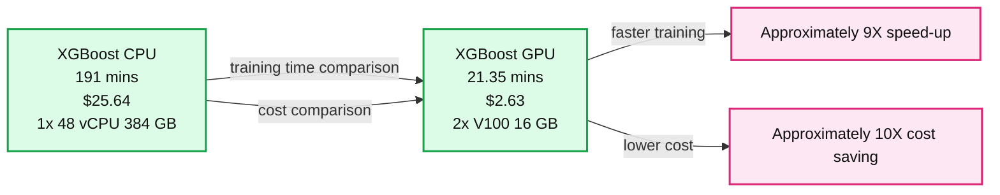

# Shrink Training Time and Cost Using NVIDIA GPU-Accelerated XGBoost and Apache Spark™ on Databricks

- Source: https://www.databricks.com/blog/2020/05/15/shrink-training-time-and-cost-using-nvidia-gpu-accelerated-xgboost-and-apache-spark-on-databricks.html
- Published: 2020-05-15
- Authors: Niranjan Nataraja, Karthikeyan Rajendran
- Categories: solutions, partners, engineering, open-source, data-science-machine-learning
- Images: 1 total, 1 extracted as architecture

>  Guest Blog by Niranjan Nataraja and Karthikeyan Rajendran of Nvidia. Niranjan Nataraja is a lead data scientist at Nvidia and specializes in building big data pipelines for data science tasks and creating mathematical models for data center operations and cloud gaming services. Karthikeyan Rajendran is the lead product manager for NVIDIA’s Spark team.

This blog will show how to utilize XGBoost and Spark from Databricks notebooks and the setup steps necessary to take advantage of NVIDIA GPUs to significantly reduce training time and cost. We illustrate the benefits of GPU-acceleration with a real-world use case from NVIDIA’s GeForce NOW team and show you how to enable it in your own notebooks.

## About XGBoost

[XGBoost](https://xgboost.ai/) is an open source library that provides a gradient boosting framework usable from many programming languages (Python, Java, R, Scala, C++ and more). XGBoost can run on a single machine or on multiple machines under several different distributed processing frameworks (Apache Hadoop, Apache Spark, Apache Flink). XGBoost models can be trained on both CPUs and GPUs. However, data scientists on the GeForce NOW team run into significant challenges with cost and training time when using CPU-based XGBoost.

## GeForce NOW Use Case

[GeForce NOW](https://www.nvidia.com/en-eu/geforce-now/) is NVIDIA’s cloud-based, game-streaming service, delivering real-time gameplay straight from the cloud to laptops, desktops, SHIELD TVs, or Android devices. Network traffic latency issues can affect a gamer’s user experience. GeForce NOW uses an XGBoost model to predict the network quality of multiple internet transit providers so a gamer’s network traffic can be routed through a transit vendor with the highest predicted network quality. XGBoost models are trained using gaming session network metrics for each internet service provider. GeForce NOW generates billions of events per day for network traffic, consisting of structured and unstructured data. NVIDIA’s big data platform merges data from multiple sources and generates a network traffic data record for each gaming session which is used as training data.

As network traffic varies dramatically over the course of a day, the prediction model needs to be re-trained frequently with the latest GeForce NOW data. Given a myriad of features and large datasets, NVIDIA GeForce NOW data scientists rely upon hyperparameter searches to build highly accurate models. For a dataset of tens of million rows and a non-trivial number of features, CPU model training with Hyperopt takes more than 20 hours on a single AWS [r5.4xlarge](https://aws.amazon.com/ec2/instance-types/r5/) CPU instance. Even with a scale-out approach using 2 CPU server instances, the training latency requires 6 hours with spiraling infrastructure costs.

## Unleashing the Power of NVIDIA GPU-accelerated XGBoost

A recent [NVIDIA developer blog](https://developer.nvidia.com/blog/gpu-accelerated-spark-xgboost/) illustrated the significant benefits of GPU-accelerated XGBoost model training. NVIDIA data scientists followed a similar approach to achieve a 22x speed-up and 8x cost savings compared to CPU-based XGBoost. As illustrated in Figure 1, a GeForce NOW production network traffic data dataset with 40 million rows and 32 features took only 18 minutes on GPU for training when compared to 3.2 hours (191 minutes) on CPU. In addition, the right hand side of Figure 1 compares CPU cluster costs and GPU cluster costs that include both AWS instances and Databricks runtime costs.

**Summary:** Benchmark comparing XGBoost CPU and GPU training time and cost on Databricks.

**Components:**

- XGBoost CPU using 1x 48 vCPU 384 GB cluster
- XGBoost GPU using 2x V100 16 GB GPUs
- Databricks Runtime 6.3 CPU cluster
- Databricks Runtime 6.3 GPU cluster
- AWS r5a.4xlarge driver and 2 r5.12xlarge workers
- AWS p2.xlarge driver and 2 p3.16xlarge workers

**Flows:**

- XGBoost CPU -> XGBoost GPU: training comparison, 9X speed-up
- XGBoost CPU -> XGBoost GPU: cost comparison, approximately 10X cost saving

**Numbers:**

- 191 mins
- 21.35 mins
- 9X speed-up
- $25.64
- $2.63
- 10X cost saving
- 1x 48 vCPU
- 384 GB
- 2x V100
- 16 GB
- Databricks Runtime 6.3
- 1 driver
- 2 workers
- r5a.4xlarge
- r5.12xlarge
- p2.xlarge
- p3.16xlarge

source image: https://www.databricks.com/wp-content/uploads/2020/05/blog-spark-xgboost-nvidia-1.png

Figure 1: Network quality prediction training on GPU vs. CPU

As for model performance, the trained XGBoost models were compared on four different metrics.

- Root mean squared error
- Mean absolute error
- Mean absolute percentage error
- Correlation coefficient

The NVIDIA GPU-based XGBoost model has similar accuracy in all these metrics.

Now that we have seen the performance and cost savings, next we will discuss the setup and best practices to run a sample XGBoost notebook on a Databricks GPU cluster.

## Quick Start on NVIDIA GPU-accelerated XGBoost on Databricks

Databricks supports XGBoost on several ML runtimes. Here is a well-written user guide for running XGBoost on single node and multiple nodes.

To run XGBoost on GPU, you only need to make the following adjustments:

1. Set up a Spark cluster with GPU instances (instead of CPU instances)
2. Modify your XGBoost training code to switch `tree_method` parameter from `hist` to `gpu_hist`
3. Set up data loading

## Set Up NVIDIA GPU Cluster for XGBoost Training

To conduct NVIDIA GPU-based XGBoost training, you need to set up your Spark cluster with GPUs and the proper Databricks ML runtime.

- We used a p2.xlarge (61.0 GB memory, 1 GPU, 1.22 DBU) instance for the driver node and two p3.2xlarge (61.0 GB memory, 1 GPU, 4.15 DBU) instances for the worker nodes.
- We chose 6.3 ML (includes Apache Spark 2.4.4, GPU, Scala 2.11) as our Databricks runtime version. Any Databricks ML runtime with GPUs should work for running XGBoost on Databricks.

## Code Change on `tree_method` Parameter

After starting the cluster, in your XGBoost notebook you need to change the treemethod parameter from `hist` to `gpu_hist`.

For CPU-based training:

For GPU-based training:

## Getting Started with GPU Model Training

NVIDIA’s GPU-accelerated XGBoost helped GeForce NOW meet the service-level objective of training the model every eight hours, and reduced costs significantly. Switching from CPU-based XGBoost to a GPU-accelerated version was very straightforward. If you’re also struggling with accelerating your training time or reducing your training costs, we encourage you to try it!

Watch this space to learn about new Data Science use-cases to leverage GPUs and Apache Spark 3.0 version on Databrick 7.x ML runtimes.

You can find the [GeForce NOW PySpark notebook hosted on GitHub](https://github.com/rapidsai/spark-examples/blob/master/getting-started-guides/csp/databricks/xgb_python_gpu_perf_blog.ipynb). The notebook uses hyperopt for hyperparameter search and DBFS's local file interface to load onto worker nodes.
