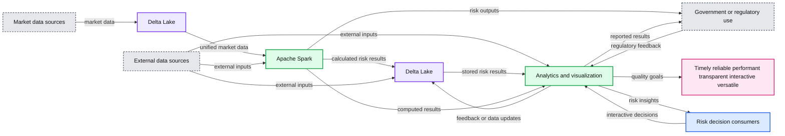
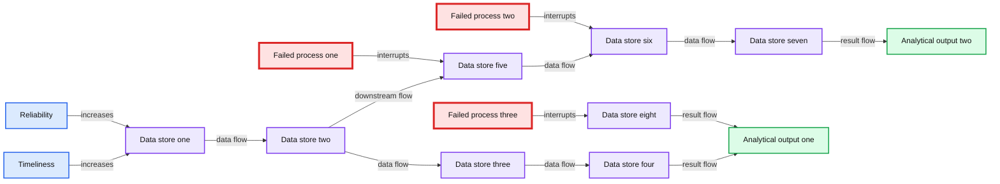
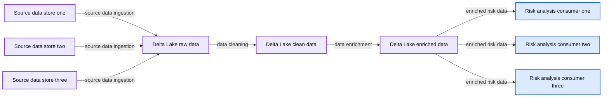
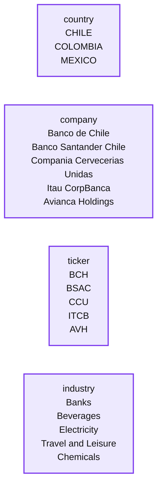
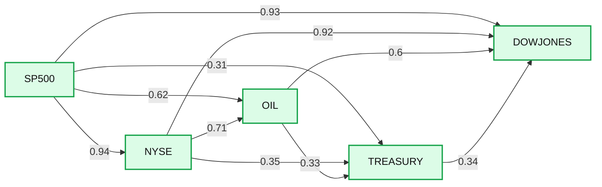
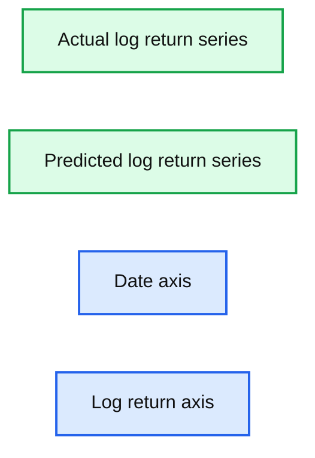
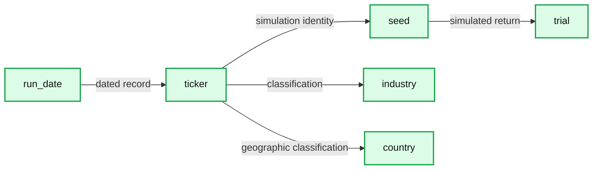

# Modernizing Risk Management Part 1: Streaming data-ingestion, rapid model development and Monte-Carlo Simulations at Scale

- Source: https://www.databricks.com/blog/2020/05/27/modernizing-risk-management-part-1-streaming-data-ingestion-rapid-model-development-and-monte-carlo-simulations-at-scale.html
- Published: 2020-05-27
- Authors: Antoine Amend
- Categories: platform, engineering, solution-accelerators, open-source, data-science-machine-learning, data-streaming
- Images: 8 total, 8 extracted as architecture

Part 2 of this accelerator [here](https://www.databricks.com/blog/2020/06/05/modernizing-risk-management-part-2-aggregations-backtesting-at-scale-and-introducing-alternative-data.html).

[Managing risk within the financial services](https://www.databricks.com/discover/pages/modernizing-risk-management), especially within the banking sector, has increased in complexity over the past several years. First, new frameworks (such as FRTB) are being introduced that potentially require tremendous computing power and an ability to analyze years of historical data. At the same, regulators are demanding more transparency and explainability from the banks they oversee. Finally, the introduction of new technologies and business models means the need for sound risk governance is at an all time high. However, the ability for the banking industry to effectively meet these demands has not been an easy undertaking. Traditional banks relying on on-premises infrastructure can no longer effectively manage risk. Banks must abandon the computational inefficiencies of legacy technologies and build an agile Modern Risk Management practice capable of rapidly responding to market and economic volatility through the use of data and advanced analytics. Recent experience shows that as new threats emerge, historical data and aggregated risk models lose their predictive values quickly. Risk analysts must augment traditional data with alternative datasets in order to explore new ways of identifying and quantifying the risks facing their business, both at scale and in real-time.

In this blog, we will demonstrate how to modernize traditional value-at-risk (VaR) calculation through the use of various components of the Databricks Unified Data Analytics Platform — Delta Lake, Apache SparkTM and MLflow — in order to enable a more agile and forward looking approach to risk management.

**Summary:** Databricks architecture modernizes value-at-risk calculations using Delta Lake, Apache Spark, and MLflow for timely, reliable, performant, transparent, interactive, and versatile risk management.

**Components:**

- Market data sources
- Delta Lake for unified market data
- Apache Spark for distributed computation
- MLflow for model development and deployment
- Delta Lake for output storage
- External data sources
- Analytics and visualization
- Risk decision consumers
- Government or regulatory use
- Timely
- Reliable
- Performant
- Transparent
- Interactive
- Versatile

**Flows:**

- Market data sources -> Delta Lake: market data
- Delta Lake -> Apache Spark: unified market data
- Apache Spark -> Delta Lake: calculated risk results
- Apache Spark -> Government or regulatory use: risk outputs
- External data sources -> Apache Spark: external inputs
- External data sources -> Delta Lake: external inputs
- External data sources -> Analytics and visualization: external inputs
- Delta Lake -> Analytics and visualization: stored risk results
- Analytics and visualization -> Delta Lake: feedback or data updates
- Analytics and visualization -> Risk decision consumers: risk insights
- Apache Spark -> Analytics and visualization: computed results
- Analytics and visualization -> Government or regulatory use: reported results
- Risk decision consumers -> Analytics and visualization: interactive decisions
- Government or regulatory use -> Analytics and visualization: regulatory feedback

**Numbers:** none

source image: https://www.databricks.com/wp-content/uploads/2020/05/blog-modernizing-risk-management-1.png

This first series of notebooks will cover the multiple data engineering and data science challenges that must be addressed to effectively modernize risk management practices:

- Using Delta Lake to have a unified view of your market data
- Leveraging MLflow as a delivery vehicle for model development and deployment
- Using Apache Spark for distributing Monte Carlo simulations at scale

The ability to efficiently slice and dice your Monte Carlo simulations in order to have a more agile and forward-looking approach to risk management will be covered in a second blog post, focused more on a risk analyst persona.

## Modernizing data management with Delta Lake

With the rise of big data and cloud based-technologies, the IT landscape has drastically changed in the last decade. Yet, most FSIs still rely on mainframes and non-distributed databases for core risk operations such as VaR calculations and move only some of their downstream processes to modern data lakes and cloud infrastructure. As a result, banks are falling behind the technology curve and their current risk management practices are no longer sufficient for the modern economy. Modernizing risk management starts with the data. Specifically, by shifting the lense in which data is viewed: not as a cost, but as an asset.

**Old Approach: When data is considered as a cost**, FSIs limit the capacity of risk analysts to explore "what if" scenarios and restrict their aggregated data silos to only satisfy predefined risk strategies. Over time, the rigidity of maintaining silos has led engineers to branch new processes and create new aggregated views on the basis of already fragile workflows in order to adapt to evolving requirements. Paradoxically, the constant struggle to keep data as a low cost commodity on-premises has led to a more fragile and therefore more expensive ecosystem to maintain overall. Failed processes (annotated as X symbol below) have far too many downstream impacts in order to guarantee both timeliness and reliability of your data. Consequently, having an intra-day (and reliable)  view of market risk has become increasingly complex and cost prohibitive to achieve given all the moving components and inter-dependencies as schematised in below diagram.

**Summary:** The diagram shows a failure-prone network of interconnected data stores and outputs, constrained by timeliness and reliability requirements.

**Components:**

- Timeliness direction
- Reliability direction
- Unlabeled data store nodes
- Unlabeled analytical output nodes
- Failed process markers

**Flows:**

- Data store -> data store: horizontal data flow
- Data store -> data store: vertical and cross-connected data flow
- Data store -> analytical output: downstream result flow
- Failed process -> downstream data stores: interrupted propagation
- Failed process -> analytical outputs: impacted result flow

**Numbers:** none

source image: https://www.databricks.com/wp-content/uploads/2020/05/blog-modernizing-risk-management-2.png

**Modern Approach: When data is considered as an asset**, organizations embrace the versatile nature of the data, serving multiple use cases (such as value-at-risk and expected shortfall) and enabling a variety of ad-hoc analysis (such as understanding risk exposure to a specific country). Risk analysts are no longer restricted to a narrow view of the risk and can adopt a more agile approach to risk management. By unifying streaming and batch ETL, ensuring ACID compliance and schema enforcement, **Delta Lake** brings performance and reliability to your data lake, gradually increasing the quality and relevance of your data through its bronze, silver and gold layers and bridging the gap between operation processes and analytics data.

**Summary:** A risk management data platform ingests source data into Delta Lake, where it is stored as raw, clean, and enriched data for downstream risk analysis.

**Components:**

- Source data stores: technology not specified
- Delta Lake raw data: Delta Lake
- Delta Lake clean data: Delta Lake
- Delta Lake enriched data: Delta Lake
- Downstream risk analysis consumers: technology not specified

**Flows:**

- Source data stores -> Delta Lake raw data: source data ingestion
- Delta Lake raw data -> Delta Lake clean data: data cleaning
- Delta Lake clean data -> Delta Lake enriched data: data enrichment
- Delta Lake enriched data -> downstream risk analysis consumers: enriched risk data

**Numbers:** none

source image: https://www.databricks.com/wp-content/uploads/2020/05/blog-modernizing-risk-management-3.png

In this demo, we evaluate the level of risk of various investments in a Latin America equity portfolio composed of 40 instruments across multiple industries, storing all returns in a centralized Delta Lake table that will drive all our value-at-risk calculations (covered in our part 2 demo).

**Summary:** A tabular sample risk portfolio containing Latin American companies, stock tickers, countries, and industries.

**Components:**

- country: portfolio country field, technology not shown
- company: portfolio company field, technology not shown
- ticker: stock ticker field, technology not shown
- industry: industry classification field, technology not shown

**Flows:**

- none shown

**Numbers:** Row indices 0 through 16

source image: https://www.databricks.com/wp-content/uploads/2020/05/blog-modernizing-risk-management-4.png

For the purpose of this demo, we access daily close prices from Yahoo finance using python yfinance library. In real life, one may acquire market data from source systems directly (such as change data capture from mainframes) to a Delta Lake table, storing raw information on Bronze and curated / validated data on a Silver table, in real-time.

With our core data available on Delta Lake, we apply a simple window function to compute daily log returns and output results back to a gold table ready for risk modelling and analysis.

In the example below, we show a specific slice of our investment data for AVAL (Grupo Aval Acciones y Valores S.A), a financial services company operating in Columbia. Given the expected drop in its stock price post march 2020, we can evaluate its impact on our overall risk portfolio.

**Summary:** AVAL closing stock price over time, showing a sharp decline in March 2020.

**Components:**

- AVAL close price series
- Date axis from Jul 2018 to May 2020
- Close value axis from 4 to 9

**Flows:**

- none

**Numbers:** 4, 5, 6, 7, 8, 9, Jul 2018, Sep 2018, Nov 2018, Jan 2019, Mar 2019, May 2019, Jul 2019, Sep 2019, Nov 2019, Jan 2020, Mar 2020, May 2020

source image: https://www.databricks.com/wp-content/uploads/2020/05/blog-modernizing-risk-management-5.png

## Streamlining model development with MLFlow

Although quantitative analysis is not a new concept, the recent rise of data science and the explosion of data volumes has uncovered major inefficiencies in the way banks operate models. Without any industry standard, data scientists often operate on a best effort basis. This often means training models against data samples on single nodes and manually tracking models throughout the development process, resulting in long release cycles (it may take between 6 to 12 months to deliver a model to production). The long model development cycle hinders the ability for them to quickly adapt to emerging threats and to dynamically mitigate the associated risks. The major challenge FSIs face in this paradigm is reducing model development-to-production time without doing so at the expense of governance and regulations or contributing to an even more fragile data science ecosystem.** **

**MLflow** is the de facto standard for managing the machine learning lifecycle by bringing immutability and transparency to model development, but is not restricted to AI. A bank's definition of a model is usually quite broad and includes any financial models from Excel macros to rule-based systems or state-of-the art machine learning, all of them that could benefit from having a central model registry provided by MLflow within Databricks Unified Data Analytics Platform.

### Reproducing model development

In this example, we want to train a new model that predicts stock returns given market indicators (such as S&P 500, crude oil and treasury bonds). We can retrieve "AS OF" data in order to ensure full model reproducibility and audit compliance. This capability of Delta Lake is commonly referred to as "time travel". The resulting data set will remain consistent throughout all experiments and can be accessed as-is for audit purposes.

In order to select the right features in their models, quantitative analysts often navigate between Spark and [Pandas dataframes](https://www.databricks.com/glossary/pandas-dataframe). We show here how to switch from a pyspark to python context in order to extract correlations of our market factors. The Databricks interactive notebooks come with built-in visualisations and also fully support the use of Matplotlib, seaborn (or ggplot2 for R).

**Summary:** Correlation matrix showing relationships among SP500, NYSE, OIL, TREASURY, and DOWJONES market factors.

**Components:**

- SP500 market factor
- NYSE market factor
- OIL market factor
- TREASURY market factor
- DOWJONES market factor
- Correlation color scale

**Flows:**

- SP500 -> NYSE: correlation 0.94
- SP500 -> OIL: correlation 0.62
- SP500 -> TREASURY: correlation 0.31
- SP500 -> DOWJONES: correlation 0.93
- NYSE -> OIL: correlation 0.71
- NYSE -> TREASURY: correlation 0.35
- NYSE -> DOWJONES: correlation 0.92
- OIL -> TREASURY: correlation 0.33
- OIL -> DOWJONES: correlation 0.6
- TREASURY -> DOWJONES: correlation 0.34
- Each factor -> itself: correlation 1

**Numbers:** 1, 0.94, 0.62, 0.31, 0.93, 0.71, 0.35, 0.92, 0.33, 0.6, 0.34, 0.90, 0.75, 0.60, 0.45

source image: https://www.databricks.com/wp-content/uploads/2020/05/blog-modernizing-risk-management-6.png

Assuming our indicators are not correlated (they are) and predictive of our portfolio returns (they may), we  want to log this graph as evidence to our successful experiment. This shows internal audit, model validation functions  as well as regulators that model exploration was conducted with highest quality standards and its development was led with empirical results.

### Training models in parallel

As  the number of instruments in our portfolio increases, we may want to train models in parallel. This can be achieved through a simple Pandas UDF function as follows. For convenience (models may be more complex in real life), we want to train a simple linear regression model and aggregate all model coefficients as a n x m matrix (n being the number of instruments and m the number of features derived from our market factors).

The resulting dataset (weight for each model) can be easily collected back to memory and logged to MLflow as our model candidate for the rest of the experiment. In the below graph, we report the predicted vs actual stock return derived from our model for Ecopetrol S.A., an oil and gas producer in Columbia.

**Summary:** Plot of predicted and actual log returns for Ecopetrol S.A. across time.

**Components:**

- Actual log return series, technology not shown
- Predicted log return series, technology not shown
- Date axis
- Log return axis

**Flows:**

- none

**Numbers:** 0.100, 0.075, 0.050, 0.025, 0.000, -0.025, -0.050, -0.075; 2018-05, 2018-07, 2018-09, 2018-11, 2019-01, 2019-03, 2019-05

source image: https://www.databricks.com/wp-content/uploads/2020/05/blog-modernizing-risk-management-7.png

Our experiment is now stored on MLflow alongside all evidence required for an independent validation unit (IVU) submission which is likely a part of your [model risk management](https://www.databricks.com/glossary/model-risk-management) framework. It is key to note that this experiment is not only linked to our notebook, but to the exact revision of it, bringing independent experts and regulators the full traceability of our model as well all the necessary context required for model validation.

## Monte Carlo simulations at scale with Apache Spark

Value-at-risk is the process of simulating random walks that cover possible outcomes as well as worst case (n) scenarios. A 95% value-at-risk for a period of (t) days is the best case scenario out of the worst 5% trials. We therefore want to generate enough simulations to cover a range of possible outcomes given a 90 days historical market volatility observed across all the instruments in our portfolio. Given the number of simulations required for each instrument, this system must be designed with a high degree of parallelism in mind, making value-at-risk the perfect workload to execute in a cloud based environment. Risk management is the number one reason top tier banks evaluate cloud compute for analytics today and accelerate value through the Databricks runtime.

### Creating a multivariate distribution

Whilst the industry recommends generating between 20 to 30 thousands simulations, the main complexity of calculating value-at-risk for a mixed portfolio is not to measure individual assets returns, but the correlations between them. At a portfolio level, market indicators can be elegantly manipulated within native python without having to shift complex matrix computation to a distributed framework. As it is common to operate with multiple books and portfolios, this same process can easily scale out by distributing matrix calculation in parallel. We use the last 90 days of market returns in order to compute todays' volatility (extracting both average and covariance).

### Generating consistent and independent trials at scale

Another complexity of simulating value-at-risk is to avoid auto-correlation by carefully fixing random numbers using a 'seed'. We want each trial to be independent albeit consistent across instruments (market conditions are identical for each simulated position). See below an example of creating an independent and consistent trial set - running this same block twice will result in the exact same set of generated market vectors.

In a distributed environment, we want each executor in our cluster to be responsible for multiple simulations across multiple instruments. We define our seed strategy so that each executor will be responsible for num_instruments x ( num_simulations / num_executors ) trials. Given 100,000 Monte Carlo simulations, a parallelism of 50 executors and 10 instruments in our portfolio, each executor will run 20,000 instrument returns.

We group our set of seeds per executor and generate trials for each of our models through the use of a Pandas UDF. Note that there may be multiple ways to achieve the same, but this approach has the benefit to fully control the level of parallelism in order to ensure no hotspot occurs and no executor will be left idle waiting for other tasks to finish.

We append our trials partitioned by day onto a Delta Lake table so that analysts can easily access a day's worth of simulations and group individual returns by a trial Id (i.e. the seed) in order to access the daily distribution of returns and its respective value-at-risk.

**Summary:** A Latin American equity portfolio dataset lists run date, ticker, simulation seed, trial return, industry, and country for 21 visible records.

**Components:**

- run_date: portfolio simulation date
- ticker: equity ticker symbol
- seed: Monte Carlo simulation seed
- trial: simulated return
- industry: portfolio industry classification
- country: equity country classification

**Flows:**

- run_date -> ticker: identifies each dated equity record
- ticker -> seed: associates each equity with a simulation seed
- seed -> trial: produces a simulated return
- ticker -> industry: assigns an industry classification
- ticker -> country: assigns a country classification

**Numbers:** Row indices 0 through 20; run date 2019-10-06; seed 1570321566; trial values -0.005298, -0.000960, -0.001780, 0.008373, -0.008877, 0.012647, 0.007909, -0.024844, 0.009431, 0.012186, 0.003603, 0.005399, 0.022189, 0.005714, -0.003790, 0.007732, 0.012013, -0.003082, 0.001443, 0.006275, 0.004296

source image: https://www.databricks.com/wp-content/uploads/2020/05/blog-modernizing-risk-management-8.png

With respect to our original definition of data being a core asset (as opposition to being a cost), we store all our trials enriched with our portfolio taxonomy (such as industry type and country of operation), enabling a more holistic and on-demand view of the risk facing our investment strategies. These concepts of slicing and dicing value-at-risk data efficiently and easily (through the use of SQL) will be covered in our part 2 blog post, focused more towards a risk analyst persona.

## Getting started with a modern approach to VaR and risk management

In this article, we have demonstrated how banks can modernize their risk management practices by efficiently scaling their Monte Carlo simulations from tens of thousands up to millions by leveraging both the flexibility of cloud compute and the robustness of Apache Spark.  We also demonstrated how Databricks, as the only Unified Data Analytics Platform, helps accelerate model development lifecycle by bringing both the transparency of your experiment and the reliability in your data, bridging the gap between science and engineering and enabling banks to have a more robust yet agile approach to risk management.

Check out [Part 2](https://www.databricks.com/blog/2020/06/05/modernizing-risk-management-part-2-aggregations-backtesting-at-scale-and-introducing-alternative-data.html)of this series.

Try the below  on Databricks today! And if you want to learn how unified data analytics can bring data science, business analytics and engineering together to accelerate your data and ML efforts, check out the on-demand workshop - [*Unifying Data Pipelines, Business Analytics and Machine Learning with Apache Spark™*](https://pages.databricks.com/202005-US-EV-VIRTUALWORKSHOP-FINSERV-OD-thank-you-webinar.html?_ga=2.136922233.878683226.1589772301-106254719.1587572290)*. *

VaR and Risk Management Notebooks:

[Get the notebook](https://notebooks.databricks.com/notebooks/FSI/value_at_risk/index.html)

[Contact us](https://www.databricks.com/company/contact) to learn more about how we assist customers with market risk use cases.
