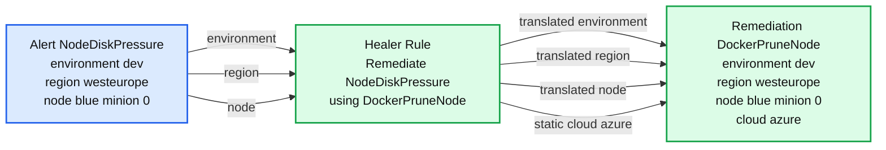

# Automating away engineering on-call workflows at Databricks

- Source: https://www.databricks.com/blog/2020/05/28/automating-away-engineering-on-call-workflows-at-databricks.html
- Published: 2020-05-28
- Authors: Andrew Nitu
- Categories: engineering, platform
- Images: 2 total, 2 extracted as architecture

## A Summer of Self-healing

This summer I interned with the Cloud Infrastructure team. The team is responsible for building scalable infrastructure to support Databricks’s multi-cloud product, while using cloud-agnostic technologies like Terraform and Kubernetes. My main focus was developing a new auto-remediation service, *Healer*, which automatically repairs our Kubernetes infrastructure to improve our service availability and reduce on-call burden.

## Automatically Reducing Outages and Downtime

The Cloud Infra team at Databricks is responsible for underlying compute infrastructure for all of Databricks, managing thousands of VMs and database instances across clouds and regions. As components in a distributed system, these cloud-managed resources are expected to fail from time to time. On-call engineers sometimes perform repetitive tasks to fix these expected incidents. When a PagerDuty alert fires, the on-call engineer manually addresses the problem by following a documented playbook.

Though ideally we'd like to track down and fix the root cause of every issue, to do so would be prohibitively expensive. For this long tail of issues, we instead rely on playbooks that address the symptoms and keep them in check. And in some cases, the root cause is a known issue with one of the many open-source projects we work with (like Kubernetes, Prometheus, Envoy, Consul, Hashicorp Vault), so a workaround is the only feasible option.

On-call pages require careful attention from our engineers. Databricks engineering categorizes issues based on priority. Lower-priority issues will only page during business hours (i.e. engineers won't be woken up at night!). For example, if a Kubernetes node is corrupt in our dev environment, the on-call engineer will only be alerted the following morning to triage the issue. Since Databricks engineering is distributed worldwide (with offices in San Francisco, Toronto, and Amsterdam) and most teams are based out of a single office, an issue with the dev environment can impede certain engineers for hours, decreasing developer productivity.

We are always looking for ways to reduce our keeping-the-lights-on (KTLO) burden, so designing a system that responds to alerts without human intervention by executing engineer-defined playbooks makes a lot of sense to manage resources at our scale. We set out to design a system that would help us address these systemic concerns.

## Self-healing Architecture

*The Healer architecture is composed of input events (Prometheus/Alertmanager), execution (Healer endpoint, worker queue/threads), and actions (Jenkins, Kubernetes, Spinnaker jobs).*

**Summary:** The diagram shows Healer processing Prometheus alerts through remediation workers and triggering Jenkins, Kubernetes, or Spinnaker actions with Slack and Jira notifications.

**Components:**

- Prometheus Alertmanager - alert source
- Healer rules - engineer-defined remediation rules
- Healer endpoint - alert ingestion endpoint
- Remediation queue - asynchronous remediation queue
- Worker Thread 0 - remediation worker
- Jenkins - job execution system
- Kubernetes - infrastructure action target
- Spinnaker - deployment action system
- Notification Slack Jira - notification destinations

**Flows:**

- Prometheus Alertmanager -> Healer endpoint: alert payload
- Healer rules -> Healer endpoint: healer rules
- Healer endpoint -> Remediation queue: remediation request
- Remediation queue -> Worker Thread 0: queued remediation
- Worker Thread 0 -> Jenkins: action request
- Worker Thread 0 -> Kubernetes: action request
- Worker Thread 0 -> Spinnaker: action request
- Jenkins -> Notification Slack Jira: notification
- Kubernetes -> Notification Slack Jira: notification
- Spinnaker -> Notification Slack Jira: notification

**Numbers:** 0

```mermaid
%% Healer processes alerts through remediation workers and action systems
flowchart LR
    PA[Prometheus Alertmanager] -->|alert payload| HE[Healer endpoint]
    HR[Healer rules] -->|rules| HE
    HE -->|remediation request| RQ[Remediation queue]
    RQ -->|queued remediation| WT[Worker Thread 0]
    WT -->|action request| J[Jenkins]
    WT -->|action request| K[Kubernetes]
    WT -->|action request| S[Spinnaker]
    J -->|notification| N[Notification Slack Jira]
    K -->|notification| N
    S -->|notification| N

    classDef client fill:#dbeafe,stroke:#2563eb,stroke-width:2px,color:#111
    classDef service fill:#dcfce7,stroke:#16a34a,stroke-width:2px,color:#111
    classDef store fill:#ede9fe,stroke:#7c3aed,stroke-width:2px,color:#111
    classDef cache fill:#fef3c7,stroke:#d97706,stroke-width:2px,color:#111
    classDef queue fill:#cffafe,stroke:#0891b2,stroke-width:2px,color:#111
    classDef critical fill:#fee2e2,stroke:#dc2626,stroke-width:4px,color:#111
    classDef external fill:#e5e7eb,stroke:#6b7280,stroke-width:2px,stroke-dasharray:4 3,color:#111
    classDef decision fill:#fce7f3,stroke:#db2777,stroke-width:2px,color:#111

    class PA,J,K,S,N external
    class HR,HE,WT service
    class RQ queue

    %% Legend
    %% client = clients edge gateway or load balancer
    %% service = stateless compute
    %% store = databases or durable storage
    %% cache = Redis CDN or losable data
    %% queue = Kafka streams or asynchronous pipes
    %% critical = bottleneck or single point of failure
    %% external = third party
    %% decision = trade off point
```

source image: https://www.databricks.com/wp-content/uploads/2020/05/blog-self-healing-architecture-og.png

 The Healer architecture is composed of input events (Prometheus/Alertmanager), execution (Healer endpoint, worker queue/threads), and actions (Jenkins, Kubernetes, Spinnaker jobs).

Healer is designed using an event-driven architecture that autonomously repairs the Kubernetes infrastructure. Our alerting system ([Prometheus](https://prometheus.io/), [Alertmanager](https://prometheus.io/docs/alerting/latest/alertmanager/)) monitors our production infrastructure and fires alerts based on defined expressions. Healer runs as a backend service listening to HTTP requests from Alertmanager with alert payloads.

Using the alert metadata, Healer constructs the appropriate remediation based on the alert type and the alert labels. A remediation dictates what the remediation action will be as well as any parameters needed.

Each remediation is scheduled onto a worker execution thread pool. The worker thread will run the respective remediation by making calls to the appropriate service and then monitor the remediation for completion. In practice, this could be kicking off a Jenkins, Kubernetes, or Spinnaker job that automates the manual script workflow. We choose to support these frameworks, because they provide Databricks engineers with a wide ability to customize actions in reaction to the alerts.

Once the remediation completes, JIRA and Slack notifications are sent to the corresponding team confirming remediation task completion.

Healer can be easily extended with new kinds of remediations. Engineering teams outside of Cloud Infra can onboard remediations jobs that integrate with their service alerts, taking needed actions to recover from incidents, reducing on-call load generally across engineering.

## Example Use Case

One use case for Healer is for remediating low disk space on our Kubernetes nodes. The on-call engineer is notified of this problem by an alert called “NodeDiskPressure”. To remedy NodeDiskPressure, an on-call engineer would connect to the appropriate node and execute a `docker image prune` command.

To automate this, we first develop an action to be triggered by Healer; we define a Jenkins job called DockerPruneNode, which automates the manual steps equivalent to connecting to a node and executing `docker image prune`. We then configure a Healer remediation to resolve NodeDiskPressure alerts automatically by defining a Healer rule that binds an exact remedy (DockerPruneNode) given an alert and its parameters.

Below is an example of how a NodeDiskPressure alert gets translated into a specific remediation including the job to be run and all the needed parameters. The final remediation object has three “translated” params taken from the alert as well as one “static” hard-coded param.

*Example repair initiated by the Databricks auto-remediation service Healer for a NodeDiskPressure alert.*

**Summary:** Healer translates a NodeDiskPressure alert into a DockerPruneNode remediation using alert parameters plus a static cloud parameter.

**Components:**

- Alert NodeDiskPressure with environment, region, and node parameters
- Healer Rule that invokes DockerPruneNode
- Remediation DockerPruneNode with translated parameters and static cloud value

**Flows:**

- Alert NodeDiskPressure -> Healer Rule: environment, region, and node parameters
- Healer Rule -> Remediation DockerPruneNode: translated environment, region, and node parameters
- Healer Rule -> Remediation DockerPruneNode: static cloud parameter set to azure

**Numbers:** none

source image: https://www.databricks.com/wp-content/uploads/2020/05/blog-self-healing-architecture-2.png

 Example repair initiated by the Databricks auto-remediation service Healer for a NodeDiskPressure alert.

The configuration also has a few other parameters which engineers can configure to tune the exact behavior of the remediation. They are omitted here for brevity.

After defining this rule, the underlying issue is fully automated away, allowing on-call engineers can focus on other more important matters!

## Future Steps

Currently Healer is up, running, and improving availability of our development infrastructure. What do next steps for the service look like?

Initially, we plan to onboard more of the Cloud Infra team’s use cases. Specifically, we are looking at the following use cases:

- Support fine-grained auto-scaling to our clusters by leveraging existing system usage alerts (CPU, memory) to trigger a remediation that will increase cluster capacity.
- Terminate and reprovision Kubernetes nodes that are identified as unhealthy.
- Rotate service TLS certifications when they are close to expiring.

Furthermore, we want to continue to push adoption of this tool within the engineering organization and help other teams to onboard their use cases. This general framework can be extended to other teams to reduce their on-call load as well.

I am looking forward to seeing what other incidents Healer can help remediate for Databricks in the future!

Special thanks for a great internship experience to my mentor Ziheng Liao, managers Nanxi Kang and Eric Wang, as well as the rest of the cloud team here at Databricks!

I really enjoyed my summer at Databricks and encourage anyone looking for a challenging and rewarding career in platform engineering to join the team. If you are interested in contributing to our self-healing architecture, check out our [open job opportunities](https://www.databricks.com/company/careers/open-positions?department=engineering&location=all)!
