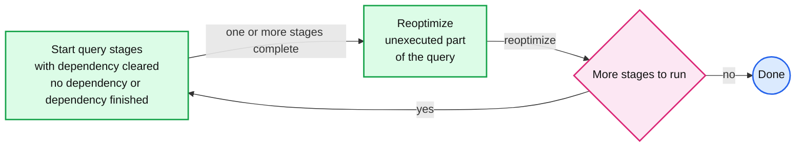
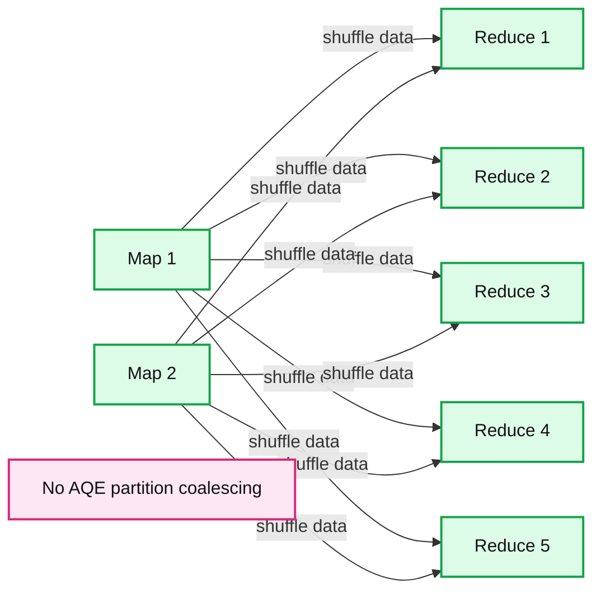
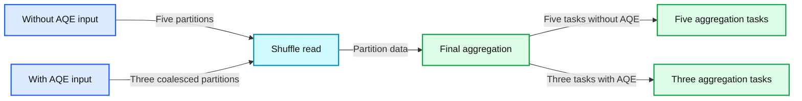
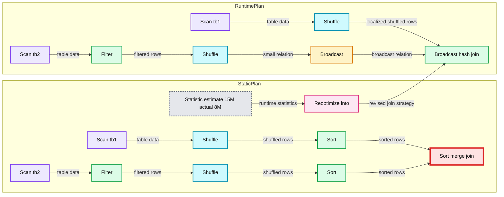
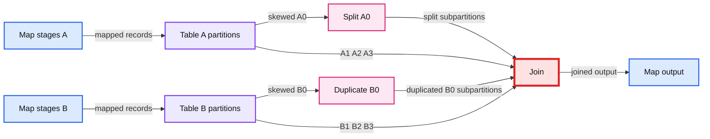
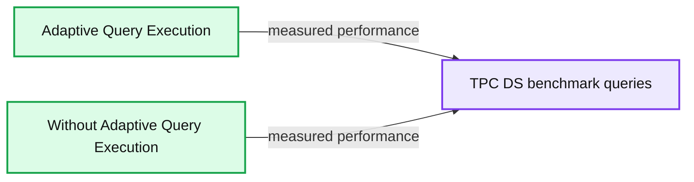

# Adaptive Query Execution: Speeding Up Spark SQL at Runtime

- Source: https://www.databricks.com/blog/2020/05/29/adaptive-query-execution-speeding-up-spark-sql-at-runtime.html
- Published: 2020-05-29
- Authors: Wenchen Fan, Herman van Hövell, MaryAnn Xue
- Categories: solutions, engineering, open-source
- Images: 7 total, 7 extracted as architecture

[Read Rise of the Data Lakehouse](https://www.databricks.com/resources/ebook/rise-data-lakehouse?itm_data=adaptivequeryexecutionspeedingup-blog-riselakehousebook) to explore why lakehouses are the data architecture of the future with the father of the data warehouse, Bill Inmon.

---

>  This is a joint engineering effort between the Databricks Apache Spark engineering team — Wenchen Fan, Herman van Hovell and MaryAnn Xue — and the Intel engineering team —Ke Jia, Haifeng Chen and Carson Wang.

[See the AQE notebook to demo the solution covered below](https://docs.databricks.com/_static/notebooks/aqe-demo.html) or [dive deeper into the inner workings of the Databricks Lakehouse Platform](https://www.databricks.com/resources/ebook/bring-data-warehousing-data-lakes?itm_data=speedingupsparksql-blog-whylakehouseisnextdw )

Over the years, there's been an extensive and continuous effort to improve Spark SQL's query optimizer and planner in order to generate high-quality query execution plans. One of the biggest improvements is the cost-based optimization framework that collects and leverages a variety of data statistics (e.g., row count, number of distinct values, NULL values, max/min values, etc.) to help Spark choose better plans. Examples of these cost-based optimization techniques include choosing the right join type (broadcast hash join vs. sort merge join), selecting the correct build side in a hash-join, or adjusting the join order in a multi-way join. However, outdated statistics and imperfect cardinality estimates can lead to suboptimal query plans. Adaptive Query Execution, new in the upcoming Apache SparkTM 3.0 release and available in the Databricks Runtime 7.0, now looks to tackle such issues by reoptimizing and adjusting query plans based on runtime statistics collected in the process of query execution.

## The Adaptive Query Execution (AQE) framework

One of the most important questions for Adaptive Query Execution is when to reoptimize. Spark operators are often pipelined and executed in parallel processes. However, a shuffle or broadcast exchange breaks this pipeline. We call them materialization points and use the term "query stages" to denote subsections bounded by these materialization points in a query. Each query stage materializes its intermediate result and the following stage can only proceed if all the parallel processes running the materialization have completed. This provides a natural opportunity for reoptimization, for it is when data statistics on all partitions are available and successive operations have not started yet.

**Summary:** The diagram shows the Adaptive Query Execution workflow for starting query stages, reoptimizing unfinished work, and completing when no stages remain.

**Components:**

- Start query stages with dependency cleared: Spark SQL Adaptive Query Execution
- Reoptimize unexecuted part of the query: Spark SQL Adaptive Query Execution
- More stages to run: Adaptive Query Execution decision point
- Done: Query completion state

**Flows:**

- Start query stages -> Reoptimize unexecuted part: one or more stages complete
- Reoptimize unexecuted part -> More stages to run: reoptimization
- More stages to run -> Start query stages: yes
- More stages to run -> Done: no

**Numbers:** none

source image: https://www.databricks.com/wp-content/uploads/2020/05/blog-adaptive-query-execution-1.png

When the query starts, the Adaptive Query Execution framework first kicks off all the leaf stages — the stages that do not depend on any other stages. As soon as one or more of these stages finish materialization, the framework marks them complete in the physical query plan and updates the logical query plan accordingly, with the runtime statistics retrieved from completed stages. Based on these new statistics, the framework then runs the optimizer (with a selected list of logical optimization rules), the physical planner, as well as the physical optimization rules, which include the regular physical rules and the adaptive-execution-specific rules, such as coalescing partitions, skew join handling, etc. Now that we've got a newly optimized query plan with some completed stages, the adaptive execution framework will search for and execute new query stages whose child stages have all been materialized, and repeat the above execute-reoptimize-execute process until the entire query is done.

In Spark 3.0, the AQE framework is shipped with three features:

- Dynamically coalescing shuffle partitions
- Dynamically switching join strategies
- Dynamically optimizing skew joins

The following sections will talk about these three features in detail.

## Dynamically coalescing shuffle partitions

When running queries in Spark to deal with very large data, shuffle usually has a very important impact on query performance among many other things. Shuffle is an expensive operator as it needs to move data across the network, so that data is redistributed in a way required by downstream operators.

One key property of shuffle is the number of partitions. The best number of partitions is data dependent, yet data sizes may differ vastly from stage to stage, query to query, making this number hard to tune:

1. If there are too few partitions, then the data size of each partition may be very large, and the tasks to process these large partitions may need to spill data to disk (e.g., when sort or aggregate is involved) and, as a result, slow down the query.
2. If there are too many partitions, then the data size of each partition may be very small, and there will be a lot of small network data fetches to read the shuffle blocks, which can also slow down the query because of the inefficient I/O pattern. Having a large number of tasks also puts more burden on the Spark task scheduler.

To solve this problem, we can set a relatively large number of shuffle partitions at the beginning, then combine adjacent small partitions into bigger partitions at runtime by looking at the shuffle file statistics.

For example, let's say we are running the query SELECT max(i)FROM tbl GROUP BY j. The input data tbl is rather small so there are only two partitions before grouping. The initial shuffle partition number is set to five, so after local grouping, the partially grouped data is shuffled into five partitions. Without AQE, Spark will start five tasks to do the final aggregation. However, there are three very small partitions here, and it would be a waste to start a separate task for each of them.

**Summary:** Spark shuffle without AQE partition coalescing sends partially grouped data from two map partitions to five separate reduce partitions.

**Components:**

- Map 1 - Spark SQL map task
- Map 2 - Spark SQL map task
- Reduce 1 - Spark SQL reduce task
- Reduce 2 - Spark SQL reduce task
- Reduce 3 - Spark SQL reduce task
- Reduce 4 - Spark SQL reduce task
- Reduce 5 - Spark SQL reduce task
- No AQE partition coalescing - Spark configuration state

**Flows:**

- Map 1 -> Reduce 1: partially grouped shuffle data
- Map 1 -> Reduce 2: partially grouped shuffle data
- Map 1 -> Reduce 3: partially grouped shuffle data
- Map 1 -> Reduce 4: partially grouped shuffle data
- Map 1 -> Reduce 5: partially grouped shuffle data
- Map 2 -> Reduce 1: partially grouped shuffle data
- Map 2 -> Reduce 2: partially grouped shuffle data
- Map 2 -> Reduce 3: partially grouped shuffle data
- Map 2 -> Reduce 4: partially grouped shuffle data
- Map 2 -> Reduce 5: partially grouped shuffle data

**Numbers:** 1, 2, 3, 4, 5

source image: https://www.databricks.com/wp-content/uploads/2020/05/blog-adaptive-query-execution-2.png

Instead, AQE coalesces these three small partitions into one and, as a result, the final aggregation now only needs to perform three tasks rather than five.

**Summary:** The diagram shows Spark shuffle data being processed with and without AQE partition coalescing before final aggregation.

**Components:**

- Without AQE input with five shuffle partitions
- With AQE input with three coalesced shuffle partitions
- Shuffle read
- Final aggregation with five tasks without AQE
- Final aggregation with three tasks with AQE

**Flows:**

- Without AQE input -> Final aggregation: Five shuffle partitions processed as five tasks
- With AQE input -> Final aggregation: Three small partitions coalesced and processed as three tasks
- Shuffle read -> Final aggregation: Shuffled partition data

**Numbers:** 3, 5

source image: https://www.databricks.com/wp-content/uploads/2020/05/blog-adaptive-query-execution-3.png

## Dynamically switching join strategies

Spark supports a number of join strategies, among which broadcast hash join is usually the most performant if one side of the join can fit well in memory. And for this reason, Spark plans a broadcast hash join if the estimated size of a join relation is lower than the broadcast-size threshold. But a number of things can make this size estimation go wrong — such as the presence of a very selective filter — or the join relation being a series of complex operators other than just a scan.

To solve this problem, AQE now replans the join strategy at runtime based on the most accurate join relation size. As can be seen in the following example, the right side of the join is found to be way smaller than the estimate and also small enough to be broadcast, so after the AQE reoptimization the statically planned sort merge join is now converted to a broadcast hash join.

**Summary:** The diagram shows Adaptive Query Execution reoptimizing a static sort merge join into a broadcast hash join when runtime statistics reveal a smaller relation.

**Components:**

- Sort merge join: Spark SQL sort merge join
- Broadcast hash join: Spark SQL broadcast hash join
- Sort: Spark SQL sorting operators
- Shuffle: Spark SQL shuffle exchange
- Filter: Spark SQL filter operator
- Scan tb1: table scan
- Scan tb2: table scan
- Running Stage: active execution stage
- Complete Stage: completed execution stage
- Reoptimize into: AQE runtime replanning
- Statistic estimate 15M actual 8M: runtime statistics

**Flows:**

- Scan tb1 -> Shuffle: table data
- Shuffle -> Sort: shuffled rows
- Sort -> Sort merge join: sorted rows
- Scan tb2 -> Filter: table data
- Filter -> Shuffle: filtered rows
- Shuffle -> Sort: shuffled rows
- Sort -> Sort merge join: sorted rows
- Statistic estimate 15M actual 8M -> Reoptimize into: runtime size statistics
- Reoptimize into -> Broadcast hash join: revised join strategy
- Scan tb1 -> Shuffle: table data
- Shuffle -> Broadcast hash join: localized shuffled rows
- Scan tb2 -> Filter: table data
- Filter -> Shuffle: filtered rows
- Shuffle -> Broadcast: small relation
- Broadcast -> Broadcast hash join: broadcast relation

**Numbers:** 15M, 8M

source image: https://www.databricks.com/wp-content/uploads/2020/05/blog-adaptive-query-execution-4.png

For the broadcast hash join converted at runtime, we may further optimize the regular shuffle to a localized shuffle (i.e., shuffle that reads on a per mapper basis instead of a per reducer basis) to reduce the network traffic.

## Dynamically optimizing skew joins

Data skew occurs when data is unevenly distributed among partitions in the cluster. Severe skew can significantly downgrade query performance, especially with joins. AQE skew join optimization detects such skew automatically from shuffle file statistics. It then splits the skewed partitions into smaller subpartitions, which will be joined to the corresponding partition from the other side respectively.

Let's take this example of table A join table B, in which table A has a partition A0 significantly bigger than its other partitions.

**Summary:** The diagram shows a skewed table A partition joining table B partitions without AQE skew join optimization.

**Components:**

- Table A with Map 0, Map 2, and Map 3 outputs
- A0, A1, A2, and A3 partitions
- Join stage
- B0, B1, B2, and B3 partitions
- Table B with Map 0 and Map 2 outputs
- No AQE skew join label

**Flows:**

- Map 0 -> A0: partitioned table A data
- Map 2 -> A1: partitioned table A data
- Map 3 -> A2: partitioned table A data
- Map 3 -> A3: partitioned table A data
- A0 -> Join: partition A0
- A1 -> Join: partition A1
- A2 -> Join: partition A2
- A3 -> Join: partition A3
- Join -> B0: join alignment
- Join -> B1: join alignment
- Join -> B2: join alignment
- Join -> B3: join alignment
- B0 -> Map 0: joined partition data
- B1 -> Map 0: joined partition data
- B2 -> Map 2: joined partition data
- B3 -> Map 2: joined partition data

**Numbers:** 0, 1, 2, 3

```mermaid
%% Shows table A and table B partitions joining without AQE skew join optimization
flowchart LR
    TA[Table A] --> MA[Map outputs]
    MA --> AP[A partitions A0 A1 A2 A3]
    AP --> J[Join]
    J --> BP[B partitions B0 B1 B2 B3]
    BP --> TB[Table B]
    TB --> MB[Map outputs]
    MB --> OUT[Map results]
    N[No AQE skew join]

    TA -->|partitioned data| MA
    MA -->|shuffle data| AP
    AP -->|join inputs| J
    J -->|partition alignment| BP
    BP -->|joined data| TB
    TB -->|partitioned data| MB
    MB -->|results| OUT

    classDef client fill:#dbeafe,stroke:#2563eb,stroke-width:2px,color:#111
    classDef service fill:#dcfce7,stroke:#16a34a,stroke-width:2px,color:#111
    classDef store fill:#ede9fe,stroke:#7c3aed,stroke-width:2px,color:#111
    classDef cache fill:#fef3c7,stroke:#d97706,stroke-width:2px,color:#111
    classDef queue fill:#cffafe,stroke:#0891b2,stroke-width:2px,color:#111
    classDef critical fill:#fee2e2,stroke:#dc2626,stroke-width:4px,color:#111
    classDef external fill:#e5e7eb,stroke:#6b7280,stroke-width:2px,color:#111,stroke-dasharray:4 3
    classDef decision fill:#fce7f3,stroke:#db2777,stroke-width:2px,color:#111

    class TA,TB store
    class MA,AP,BP,MB,OUT service
    class J critical
    class N decision
```

source image: https://www.databricks.com/wp-content/uploads/2020/05/blog-adaptive-query-execution-5.png

**Summary:** AQE skew join optimization splits oversized partition A0 and duplicates matching partition B0 so the join executes across balanced subtasks.

**Components:**

- Table A using Spark SQL shuffle partitions A0, A1, A2, and A3
- Map stages Map 1, Map 2, and Map 3 on Table A
- Split A0 using AQE skew partition splitting
- Join using Spark SQL sort merge join
- Duplicate B0 using AQE skew join optimization
- Table B using Spark SQL shuffle partitions B0, B1, B2, and B3
- Map stages Map 0, Map 2, and Map 3 on Table B

**Flows:**

- Map 1 -> Table A partitions: mapped records
- Map 2 -> Table A partitions: mapped records
- Map 3 -> Table A partitions: mapped records
- Table A partition A0 -> Split A0: skewed shuffle partition
- Split A0 -> Join: split subpartitions A0
- Table A partition A1 -> Join: partition A1
- Table A partition A2 -> Join: partition A2
- Table A partition A3 -> Join: partition A3
- Map 0 -> Table B partitions: mapped records
- Map 2 -> Table B partitions: mapped records
- Map 3 -> Table B partitions: mapped records
- Table B partition B0 -> Duplicate B0: matching partition for skew handling
- Duplicate B0 -> Join: duplicated B0 subpartitions
- Table B partition B1 -> Join: partition B1
- Table B partition B2 -> Join: partition B2
- Table B partition B3 -> Join: partition B3
- Join -> Map 0: joined output
- Join -> Map 2: joined output
- Join -> Map 3: joined output

**Numbers:**

- Map 0
- Map 1
- Map 2
- Map 3
- A0
- A1
- A2
- A3
- B0
- B1
- B2
- B3

source image: https://www.databricks.com/wp-content/uploads/2020/05/blog-adaptive-query-execution-6.png

Without this optimization, there would be four tasks running the sort merge join with one task taking a much longer time. After this optimization, there will be five tasks running the join, but each task will take roughly the same amount of time, resulting in an overall better performance.

## TPC-DS performance gains from AQE

In our experiments using TPC-DS data and queries, Adaptive Query Execution yielded up to an 8x speedup in query performance and 32 queries had more than 1.1x speedup Below is a chart of the 10 TPC-DS queries having the most performance improvement by AQE.

**Summary:** The chart compares Adaptive Query Execution performance with performance without AQE across the ten most improved TPC-DS queries.

**Components:**

- Adaptive Query Execution
- Without Adaptive Query Execution
- Ten TPC-DS benchmark queries

**Flows:**

- Adaptive Query Execution -> TPC-DS queries: measured query performance
- Without Adaptive Query Execution -> TPC-DS queries: measured query performance

**Numbers:** none

source image: https://www.databricks.com/wp-content/uploads/2020/05/aqe-comparison.png

Most of these improvements have come from dynamic partition coalescing and dynamic join strategy switching since randomly generated TPC-DS data do not have skew. Yet we've seen even greater improvements in production workload in which all three features of AQE are leveraged.

## Enabling AQE

AQE can be enabled by setting SQL config spark.sql.adaptive.enabled to true (default false in Spark 3.0), and applies if the query meets the following criteria:

- It is not a streaming query
- It contains at least one exchange (usually when there's a join, aggregate or window operator) or one subquery

By making query optimization less dependent on static statistics, AQE has solved one of the greatest struggles of Spark cost-based optimization — the balance between the stats collection overhead and the estimation accuracy. To achieve the best estimation accuracy and planning outcome, it is usually required to maintain detailed, up-to-date statistics and some of them are expensive to collect, such as column histograms, which can be used to improve selectivity and cardinality estimation or to detect data skew. AQE has largely eliminated the need for such statistics as well as for the manual tuning effort. On top of that, AQE has also made SQL query optimization more resilient to the presence of arbitrary UDFs and unpredictable data set changes, e.g., sudden increase or decrease in data size, frequent and random data skew, etc. There's no need to "know" your data in advance any more. AQE will figure out the data and improve the query plan as the query runs, increasing query performance for faster analytics and system performance.

Learn more about Spark 3.0 in our [preview webinar.](https://www.databricks.com/p/webinar/apache-spark-3-0)  Try out AQE in Spark 3.0 today for [free on Databricks](https://www.databricks.com/try-databricks) as part of our Databricks Runtime 7.0.
