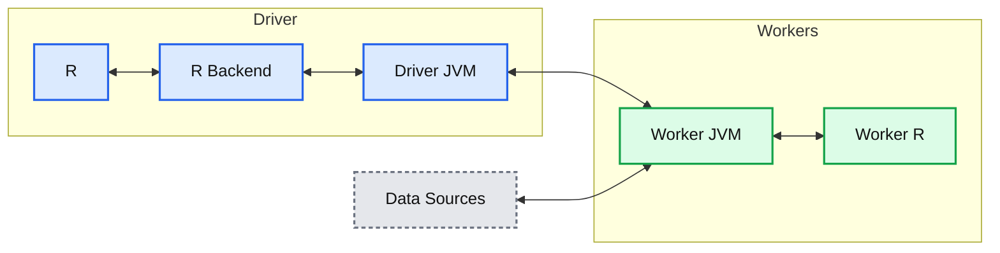
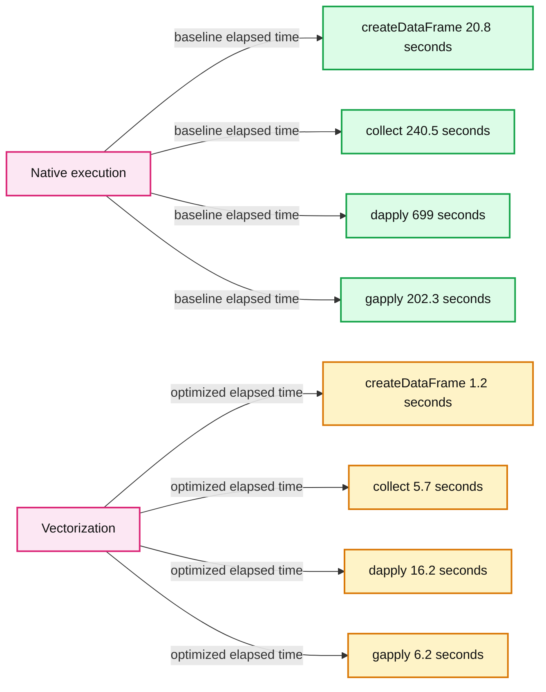

# Vectorized R I/O in Upcoming Apache Spark 3.0

- Source: https://www.databricks.com/blog/2020/06/01/vectorized-r-i-o-in-upcoming-apache-spark-3-0.html
- Published: 2020-06-01
- Authors: Hyukjin Kwon
- Categories: platform, solutions, engineering, open-source
- Images: 3 total, 3 extracted as architecture

R is one of the most popular computer languages in data science, specifically dedicated to statistical analysis with a number of extensions, such as RStudio addins and other R packages, for data processing and machine learning tasks. Moreover, it enables data scientists to easily visualize their data set.

By using SparkR in [Apache SparkTM](https://spark.apache.org/), R code can easily be scaled. To interactively run jobs, you can easily run the distributed computation by running an R shell.

When SparkR does not require interaction with the R process, [the performance is virtually identical to other language APIs such as Scala, Java and Python](https://www.databricks.com/blog/2015/02/17/introducing-dataframes-in-spark-for-large-scale-data-science.html). However, significant performance degradation happens when SparkR jobs interact with native R functions or data types.

[Databricks Runtime introduced vectorization in SparkR](https://www.databricks.com/blog/2018/08/15/100x-faster-bridge-between-spark-and-r-with-user-defined-functions-on-databricks.html) to improve the performance of data I/O between Spark and R. We are excited to announce that using the R APIs from [Apache Arrow](https://arrow.apache.org/) 0.15.1, the vectorization is now available in the upcoming Apache Spark 3.0 with the substantial performance improvements.

This blog post outlines Spark and R interaction inside SparkR, the current native implementation and the vectorized implementation in SparkR with benchmark results.

## **Spark**** and R interaction**

SparkR supports not only a rich set of ML and SQL-like APIs but also a set of APIs commonly used to directly interact with R code — for example, the seamless conversion of Spark DataFrame from/to R DataFrame, and the execution of R native functions on Spark DataFrame in a distributed manner.

In most cases, the performance is virtually consistent across other language APIs in Spark — for example, when user code relies on Spark UDFs and/or SQL APIs, the execution happens entirely inside the JVM with no performance penalty in I/O. See the cases below which take ~1 second similarly.

However, in cases where it requires to execute the R native function or convert it from/to R native types, the performance is hugely different as below.

- `createDataFrame()`
- `collect()`
- `dapply()`
- `dapplyCollect()`
- `gapply()`
- `gapplyCollect()`

In short, `createDataFrame()` and `collect()` require to (de)serialize and convert the data from JVM from/to R driver side. For example, `String` in Java becomes `character` in R. For `dapply()` and `gapply()`, the conversion between JVM and R executors is required because it needs to (de)serialize both R native function and the data. In case of `dapplyCollect()` and `gapplyCollect()`, it requires the overhead at both driver and executors between JVM and R.

## **Native implementation**

**Summary:** The diagram shows SparkR communication between the driver, worker JVMs, R processes, and data sources, with serialization overhead between JVM and R components.

**Components:**

- Driver: R process, R Backend, and JVM
- Worker(s): JVM and R processes
- Data Sources
- Serialization boundary: data and functions crossing JVM and R processes

**Flows:**

- R -> R Backend: serialized data exchange
- R Backend -> R: serialized data exchange
- Driver JVM -> Worker JVM: distributed computation and data
- Worker JVM -> Driver JVM: distributed computation results
- Data Sources -> Worker JVM: source data
- Worker JVM -> Data Sources: data access
- Worker JVM -> R processes: deserialization and data exchange
- R processes -> Worker JVM: serialization and data exchange

**Numbers:** none

```text
%% mermaid failed to render; kept as text
%% Shows SparkR communication between driver and worker components
flowchart LR
    RDriver[R]
    Backend[R Backend]
    DriverJVM[Driver JVM]
    WorkerJVM[Worker JVM]
    RWorkers[Worker R processes]
    Sources[Data Sources]

    RDriver <--> |serialization| Backend
    Backend <--> |JVM and R communication| DriverJVM
    DriverJVM <--> |distributed computation| WorkerJVM
    Sources <--> |data access| WorkerJVM
    WorkerJVM <--> |serialization and data| RWorkers

    classDef client fill:#dbeafe,stroke:#2563eb,stroke-width:2px,color:#111
    classDef service fill:#dcfce7,stroke:#16a34a,stroke-width:2px,color:#111
    classDef store fill:#ede9fe,stroke:#7c3aed,stroke-width:2px,color:#111
    classDef cache fill:#fef3c7,stroke:#d97706,stroke-width:2px,color:#111
    classDef queue fill:#cffafe,stroke:#0891b2,stroke-width:2px,color:#111
    classDef critical fill:#fee2e2,stroke:#dc2626,stroke-width:4px,color:#111
    classDef external fill:#e5e7eb,stroke:#6b7280,stroke-width:2px,color:#111,stroke-dasharray:4 3
    classDef decision fill:#fce7f3,stroke:#db2777,stroke-width:2px,color:#111
    RDriver,RWorkers client
    Backend,DriverJVM,WorkerJVM service
    Sources store
```

<sub>source image: https://www.databricks.com/wp-content/uploads/2020/05/blog-vectorization-in-sparkr-1.png</sub>

The computation on SparkR DataFrame gets distributed across all the nodes available on the Spark cluster. There’s no communication with the R processes above in driver or executor sides if it does not need to collect data as R `data.frame` or to execute R native functions. When it requires R `data.frame` or the execution of R native function, they communicate using sockets between JVM and R driver/executors.

It (de)serializes and transfers data row by row between JVM and R with an inefficient encoding format, which does not take the modern CPU design into account such as CPU pipelining.

## **Vectorized implementation**

In Apache Spark 3.0, a new vectorized implementation is introduced in SparkR by leveraging Apache Arrow to exchange data directly between JVM and R driver/executors with minimal (de)serialization cost.

**Summary:** The diagram shows vectorized data exchange between R and JVM processes on the Spark driver and workers, with data sources connected to worker JVMs.

**Components:**

- Driver: hosts R, the R Backend, and a JVM.
- R: driver-side R process.
- R Backend: driver-side R integration layer.
- JVM: driver-side Java Virtual Machine.
- Workers: Spark worker processes.
- JVM: worker-side Java Virtual Machine.
- R: worker-side R process.
- Data Sources: external data sources.
- De serialization: data conversion boundary between R and JVM.

**Flows:**

- R -> R Backend: vectorized data exchange across a de serialization boundary.
- R Backend -> R: vectorized data exchange across a de serialization boundary.
- Driver JVM -> Worker JVM: Spark communication.
- Worker JVM -> Driver JVM: Spark communication.
- Data Sources -> Worker JVM: data input.
- Worker JVM -> Data Sources: data access.
- Worker JVM -> Worker R: vectorized data across a de serialization boundary.
- Worker R -> Worker JVM: vectorized data across a de serialization boundary.

**Numbers:** none



<sub>source image: https://www.databricks.com/wp-content/uploads/2020/05/blog-vectorization-in-sparkr-2.png</sub>

Instead of (de)serializing the data row by row using an inefficient format between JVM and R, the new implementation leverages Apache Arrow to allow pipelining and Single Instruction Multiple Data (SIMD) with an efficient columnar format.

The new vectorized SparkR APIs are not enabled by default but can be enabled by setting `spark.sql.execution.arrow.sparkr.enabled` to `true` in the upcoming Apache Spark 3.0. Note that vectorized `dapplyCollect()` and `gapplyCollect()` are not implemented yet. It is encouraged for users to use `dapply()` and `gapply()` instead.

## **Benchmark results**

The benchmarks were performed with a simple data set of [500,000 records](https://eforexcel.com/wp/downloads-16-sample-csv-files-data-sets-for-testing/)by executing the same code and comparing the total elapsed times when the vectorization is enabled and disabled. Our code, dataset and notebooks are available [here on GitHub](https://github.com/HyukjinKwon/spark-notebooks/blob/master/SAIS-2019.ipynb).

**Summary:** Benchmark comparison showing vectorized SparkR operations completing much faster than native execution.

**Components:**

- createDataFrame operation using Native and Vectorization
- collect operation using Native and Vectorization
- dapply operation using Native and Vectorization
- gapply operation using Native and Vectorization
- Time axis measured in seconds

**Flows:**

- Native execution -> Operation benchmarks: baseline elapsed time
- Vectorization -> Operation benchmarks: optimized elapsed time

**Numbers:** 0, 100, 200, 300, 400, 500, 600, 700, 800 seconds; createDataFrame native 20.8 seconds; createDataFrame vectorization 1.2 seconds; 1733% faster; collect native 240.5 seconds; collect vectorization 5.7 seconds; 4219% faster; dapply native 699 seconds; dapply vectorization 16.2 seconds; 4314% faster; gapply native 202.3 seconds; gapply vectorization 6.2 seconds; 3262% faster.



<sub>source image: https://www.databricks.com/wp-content/uploads/2020/05/blog-vectorization-in-sparkr-3.png</sub>

In case of `collect()` and `createDataFrame()` with R DataFrame, it became approximately 17x and 42x faster when the vectorization was enabled. For `dapply()` and `gapply()`, it was 43x and 33x faster than when the vectorization is disabled, respectively.

There was a performance improvement of up to 17x–43x when the optimization was enabled by `spark.sql.execution.arrow.sparkr.enabled` to `true`. The larger the data was, the higher performance expected. For details, see [the benchmark performed previously for Databricks Runtime](https://www.databricks.com/blog/2018/08/15/100x-faster-bridge-between-spark-and-r-with-user-defined-functions-on-databricks.html).

## **Conclusion**

The upcoming Apache Spark 3.0, supports the vectorized APIs, `dapply()`, `gapply()`, `collect()` and `createDataFrame()` with R DataFrame by leveraging Apache Arrow. Enabling vectorization in SparkR improved the performance up to 43x faster, and more boost is expected when the size of data is larger.

As for future work, there is an ongoing issue in Apache Arrow, [ARROW-4512](https://issues.apache.org/jira/browse/ARROW-4512). The communication between JVM and R is not fully in a streaming manner currently. It has to (de)serialize in batch because Arrow R API does not support this out of the box. In addition, `dapplyCollect()` and `gapplyCollect()` will be supported in Apache Spark 3.x releases. Users can work around via `dapply()` and `collect()`, and `gapply()` and `collect()` individually in the meantime.

Try out these new [capabilities today on Databricks](https://www.databricks.com/try-databricks), through our DBR 7.0 Beta, which includes a preview of the upcoming Spark 3.0 release. Learn more about Spark 3.0 in our [preview webinar.](https://www.databricks.com/p/webinar/apache-spark-3-0)
