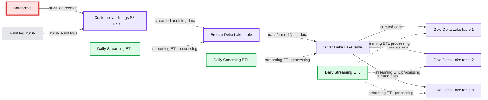
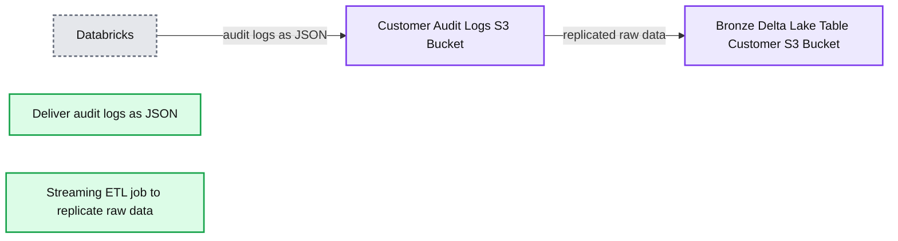
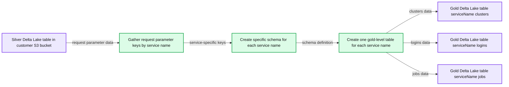
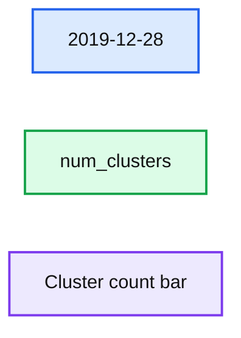
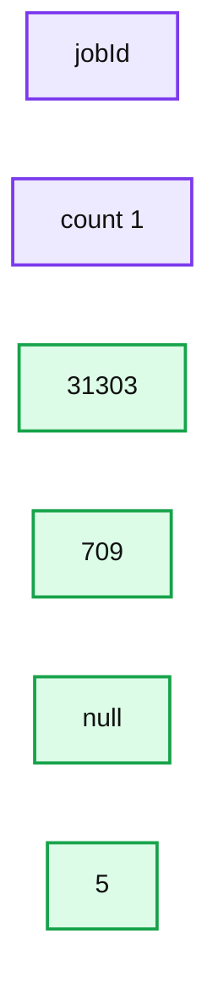

# Monitor Your Databricks Workspace with Audit Logs

- Source: https://www.databricks.com/blog/2020/06/02/monitor-your-databricks-workspace-with-audit-logs.html
- Published: 2020-06-02
- Authors: Craig Ng, Miklos Christine
- Categories: platform, engineering, open-source, data-science-machine-learning, data-engineering
- Images: 12 total, 10 extracted as architecture

Cloud computing has fundamentally changed how companies operate - users are no longer subject to the restrictions of on-premises hardware deployments such as physical limits of resources and onerous environment upgrade processes. With the convenience and flexibility of cloud services comes challenges on how to properly monitor how your users utilize these conveniently available resources. Failure to do so could result in problematic and costly anti-patterns (with both cloud provider core resources and a PaaS like Databricks). Databricks is cloud-native by design and thus tightly coupled with the public cloud providers, such as Microsoft and Amazon Web Services, fully taking advantage of this new paradigm, and the [audit logs](https://docs.databricks.com/administration-guide/account-settings/audit-logs.html) capability provides administrators a centralized way to understand and govern activity happening on the platform. Administrators could use Databricks audit logs to monitor patterns like the number of clusters or jobs in a given day, the users who performed those actions, and any users who were denied authorization into the workspace.

In the first blog post of the series, [Trust but Verify with Databricks](https://www.databricks.com/blog/2020/03/25/trust-but-verify-with-databricks.html), we covered how Databricks admins could use Databricks audit logs and other cloud provider logs as complementary solutions for their cloud monitoring scenarios. The main purpose of Databricks audit logs is to allow enterprise security teams and platform administrators to track access to data and workspace resources using the various interfaces available in the Databricks platform. In this article, we will cover, in detail, how those personas could process and analyze the audit logs to track resource usage and identify potentially costly anti-patterns.

## Audit Logs ETL Design

**Summary:** The diagram shows an ETL workflow that moves Databricks audit log JSON through an S3 bucket and Bronze and Silver Delta Lake layers into multiple Gold Delta Lake tables.

**Components:**

- Databricks platform
- Audit log JSON
- Customer audit logs S3 bucket using Amazon S3
- Daily Streaming ETL using streaming data processing
- Bronze Delta Lake table in the customer S3 bucket
- Daily Streaming ETL using streaming data processing
- Silver Delta Lake table in the customer S3 bucket
- Daily Streaming ETL using streaming data processing
- Gold Delta Lake table 1 using Delta Lake
- Gold Delta Lake table 2 using Delta Lake
- Gold Delta Lake table n using Delta Lake

**Flows:**

- Databricks -> Customer audit logs S3 bucket: audit log records
- Audit log JSON -> Customer audit logs S3 bucket: JSON audit logs
- Customer audit logs S3 bucket -> Bronze Delta Lake table: streamed audit log data
- Daily Streaming ETL -> Bronze Delta Lake table: streaming ETL processing
- Bronze Delta Lake table -> Silver Delta Lake table: transformed Delta data
- Daily Streaming ETL -> Silver Delta Lake table: streaming ETL processing
- Silver Delta Lake table -> Gold Delta Lake table 1: curated data
- Silver Delta Lake table -> Gold Delta Lake table 2: curated data
- Silver Delta Lake table -> Gold Delta Lake table n: curated data
- Daily Streaming ETL -> Gold Delta Lake tables: streaming ETL processing

**Numbers:** 1, 2, n



<sub>source image: https://www.databricks.com/wp-content/uploads/2020/06/audit-logs-overall-etl-diagram-v1-052920.png</sub>

Databricks delivers audit logs for all enabled workspaces as per delivery SLA in JSON format to a customer-owned AWS S3 bucket. These audit logs contain events for specific actions related to primary resources like clusters, jobs, and the workspace. To simplify delivery and further analysis by the customers, Databricks logs each event for every action as a separate record and stores all the relevant parameters into a sparse StructType called requestParams.

In order to make this information more accessible, we recommend an ETL process based on [Structured Streaming](https://www.databricks.com/blog/2017/08/24/anthology-of-technical-assets-on-apache-sparks-structured-streaming.html) and [Delta Lake](https://www.databricks.com/blog/2019/10/16/delta-lake-now-hosted-by-the-linux-foundation-to-become-the-open-standard-for-data-lakes.html).

**Summary:** The diagram shows an ETL pipeline that transforms Databricks audit logs in S3 into Bronze, Silver, and service-specific Gold Delta Lake tables for monitoring questions.

**Components:**

- Databricks audit logs: JSON audit logs sent to a customer-specified S3 bucket.
- File-based daily structured streaming job: TriggerOnce Structured Streaming ingestion.
- Bronze Delta Lake table: Exact copy of raw data for replay.
- Silver Delta Lake table: Cleans request parameters, parses user mail, and converts Unix epoch to UTC.
- Separate Gold Delta Lake tables: Service-specific Delta Lake tables.
- Clusters table: Stores records for the clusters service.
- Logins table: Stores records for the logins service.
- Jobs table: Stores records for the jobs service.
- Interactive clusters question: Checks for clusters without autotermination.
- User login question: Identifies typical login times.
- Job activity question: Counts jobs run during the past week.

**Flows:**

- Databricks audit logs -> File-based daily structured streaming job: JSON audit log files.
- File-based daily structured streaming job -> Bronze Delta Lake table: Newly added raw records.
- Bronze Delta Lake table -> Silver Delta Lake table: Raw audit records for cleaning and parsing.
- Silver Delta Lake table -> Separate Gold Delta Lake tables: Normalized audit records grouped by service.
- Separate Gold Delta Lake tables -> Clusters table: Cluster service records.
- Separate Gold Delta Lake tables -> Logins table: Login service records.
- Separate Gold Delta Lake tables -> Jobs table: Job service records.
- Clusters table -> Interactive clusters question: Cluster data for autotermination analysis.
- Logins table -> User login question: Login data for time-of-day analysis.
- Jobs table -> Job activity question: Job data for weekly counting.

**Numbers:** none



<sub>source image: https://www.databricks.com/wp-content/uploads/2020/06/audit-logs-diagram-v1-052920.png</sub>

```mermaid
%% Audit log ETL pipeline from S3 to service-specific monitoring questions
flowchart LR
    A[Databricks audit logs] -->|JSON files| B[File based daily structured streaming job]
    B -->|New raw records| C[Bronze Delta Lake table]
    C -->|Raw audit records| D[Silver Delta Lake table]
    D -->|Normalized records by service| E[Separate Gold Delta Lake tables]
    E -->|Cluster records| F[Clusters table]
    E -->|Login records| G[Logins table]
    E -->|Job records| H[Jobs table]
    F -->|Cluster data| I[Interactive clusters question]
    G -->|Login data| J[User login question]
    H -->|Job data| K[Job activity question]

    classDef client fill:#dbeafe,stroke:#2563eb,stroke-width:2px,color:#111
    classDef service fill:#dcfce7,stroke:#16a34a,stroke-width:2px,color:#111
    classDef store fill:#ede9fe,stroke:#7c3aed,stroke-width:2px,color:#111
    classDef cache fill:#fef3c7,stroke:#d97706,stroke-width:2px,color:#111
    classDef queue fill:#cffafe,stroke:#0891b2,stroke-width:2px,color:#111
    classDef critical fill:#fee2e2,stroke:#dc2626,stroke-width:4px,color:#111
    classDef external fill:#e5e7eb,stroke:#6b7280,stroke-width:2px,color:#111,stroke-dasharray:4 3
    classDef decision fill:#fce7f3,stroke:#db2777,stroke-width:2px,color:#111

    class A external
    class B service
    class C,D,E,F,G,H store
    class I,J,K decision
```

- Utilizing Structured Streaming allows us to:
  - Leave state management to a construct that’s purpose built for state management. Rather than having to reason about how much time has elapsed since our previous run to ensure that we’re only adding the proper records, we can utilize Structured Streaming’s checkpoints and write-ahead log to ensure that we’re only processing the newly added audit log files. We can design our streaming queries as [triggerOnce](https://www.databricks.com/blog/2017/05/22/running-streaming-jobs-day-10x-cost-savings.html) daily jobs which are like pseudo-batch jobs
- Utilizing Delta Lake allows us to do the following:
  - Gracefully handle [schema evolution](https://www.databricks.com/blog/2019/09/24/diving-into-delta-lake-schema-enforcement-evolution.html), specifically with regards to the requestParams field, which may have new StructField based on new actions tracked in the audit logs
  - Easily utilize table to table streams
  - Take advantage of specific [performance optimizations](https://docs.databricks.com/delta/optimizations/index.html) like OPTIMIZE to maximize read performance

For reference, this is the medallion reference architecture that Databricks recommends:

**Summary:** The diagram shows a medallion ETL architecture that moves raw data through Bronze, Silver, and Gold layers to streaming analytics and reporting.

**Components:**

- Apache Kafka for event streaming
- Amazon Kinesis for event streaming
- Data Lake for CSV, JSON, and TXT data
- Apache Spark for data processing
- Bronze layer for raw integration
- Silver layer for filtered, cleaned, and augmented data
- Gold layer for business-level aggregates
- Streaming Analytics for analytical consumption
- Reporting for business reporting
- Improve Data Quality as the guiding pipeline objective

**Flows:**

- Kafka, Amazon Kinesis, Data Lake, and Apache Spark -> Bronze: raw data and event ingestion
- Bronze -> Silver: filtering, cleansing, and augmentation
- Silver -> Gold: creation of business-level aggregates
- Gold -> Streaming Analytics: aggregated data
- Gold -> Reporting: aggregated data

**Numbers:** none



<sub>source image: https://www.databricks.com/wp-content/uploads/2020/06/audit-logs-quality-diagram-v1-052920.png</sub>

```mermaid
%% Medallion ETL architecture from ingestion through analytics and reporting
flowchart LR
    sources[Kafka Kinesis Data Lake Spark] -->|Raw data ingestion| bronze[Bronze Raw Integration]
    bronze -->|Filtered and cleaned data| silver[Silver Filtered Cleaned Augmented]
    silver -->|Business transformations| gold[Gold Business Level Aggregates]
    gold -->|Aggregated data| analytics[Streaming Analytics]
    gold -->|Aggregated data| reporting[Reporting]
    quality[Improve Data Quality]

    classDef client   fill:#dbeafe,stroke:#2563eb,stroke-width:2px,color:#111
    classDef service  fill:#dcfce7,stroke:#16a34a,stroke-width:2px,color:#111
    classDef store    fill:#ede9fe,stroke:#7c3aed,stroke-width:2px,color:#111
    classDef cache    fill:#fef3c7,stroke:#d97706,stroke-width:2px,color:#111
    classDef queue    fill:#cffafe,stroke:#0891b2,stroke-width:2px,color:#111
    classDef critical fill:#fee2e2,stroke:#dc2626,stroke-width:4px,color:#111
    classDef external fill:#e5e7eb,stroke:#6b7280,stroke-width:2px,color:#111,stroke-dasharray:4 3
    classDef decision fill:#fce7f3,stroke:#db2777,stroke-width:2px,color:#111

    class sources external
    class bronze,silver,gold store
    class analytics,reporting service
    class quality decision
```

**Bronze:** the initial landing zone for the pipeline. We recommend copying data that’s as close to its raw form as possible to easily replay the whole pipeline from the beginning, if needed

**Silver:** the raw data get cleansed (think data quality checks), transformed and potentially enriched with external data sets

**Gold:** production-grade data that your entire company can rely on for business intelligence, descriptive statistics, and data science / machine learning

Following our own medallion architecture, we break it out as follows for our audit logs ETL design:

### Raw Data to Bronze Table

Stream from the raw JSON files that Databricks delivers using a file-based Structured Stream to a bronze Delta Lake table. This creates a durable copy of the raw data that allows us to replay our ETL, should we find any issues in downstream tables.

**Summary:** Databricks delivers audit logs as JSON to a customer S3 bucket, where a streaming ETL job replicates them into a bronze Delta Lake table.

**Components:**

- Databricks: audit log source
- Deliver audit logs as JSON: JSON delivery format
- Customer Audit Logs S3 Bucket: AWS S3 raw data storage
- Streaming ETL job to replicate raw data: Structured Streaming ETL
- Bronze Delta Lake Table Customer S3 Bucket: durable Delta Lake storage

**Flows:**

- Databricks -> Customer Audit Logs S3 Bucket: audit logs as JSON
- Customer Audit Logs S3 Bucket -> Bronze Delta Lake Table Customer S3 Bucket: replicated raw data through a streaming ETL job

**Numbers:** none



<sub>source image: https://www.databricks.com/wp-content/uploads/2020/06/audit-logs-raw-to-bronze-diagram-v1-052920.png</sub>

Databricks delivers audit logs to a customer-specified AWS S3 bucket in the form of JSON. Rather than writing logic to determine the state of our [Delta Lake](https://docs.databricks.com/delta/index.html) tables, we're going to utilize [Structured Streaming](https://docs.databricks.com/spark/latest/structured-streaming/index.html)'s write-ahead logs and checkpoints to maintain the state of our tables. In this case, we've designed our ETL to run once per day, so we're using a `file source` with `triggerOnce` to simulate a batch workload with a streaming framework. Since Structured Streaming requires that we explicitly define the schema, we'll read the raw JSON files once to build it.

We’ll then instantiate our `StreamReader` using the schema we inferred and the path to the raw audit logs.

We then instantiate our `StreamWriter` and write out the raw audit logs into a bronze Delta Lake table that's partitioned by date.

Now that we've created the table on an AWS S3 bucket, we'll need to register the table to the Databricks Hive metastore to make access to the data easier for end users. We'll create the logical database `audit_logs`, before creating the Bronze table.

If you update your Delta Lake tables in batch or pseudo-batch fashion, it's best practice to run `OPTIMIZE` immediately following an update.

### Bronze to Silver Table

Stream from a bronze Delta Lake table to a silver Delta Lake table such that it takes the sparse requestParams StructType and strips out all empty keys for every record, along with performing some other basic transformations like parsing email address from a nested field and parsing UNIX epoch to UTC timestamp.

**Summary:** Bronze audit-log records flow through transformations into a silver Delta Lake table.

**Components:**

- Bronze Delta Lake Table on Customer S3 Bucket
- Parse email address from userIdentity
- Parse UNIX epoch to UTC timestamp
- Strip nulls from requestParams for each record
- Silver Delta Lake Table on Customer S3 Bucket

**Flows:**

- Bronze Delta Lake Table on Customer S3 Bucket -> Parse email address from userIdentity: audit-log records
- Parse email address from userIdentity -> Parse UNIX epoch to UTC timestamp: transformed records
- Parse UNIX epoch to UTC timestamp -> Strip nulls from requestParams for each record: transformed records
- Strip nulls from requestParams for each record -> Silver Delta Lake Table on Customer S3 Bucket: cleaned records

**Numbers:** none



<sub>source image: https://www.databricks.com/wp-content/uploads/2020/06/audit-logs-bronze-to-silver-diagram-v1-052920.png</sub>

```mermaid
%% Bronze to silver audit-log transformation flow
flowchart LR
    A[Bronze Delta Lake Table on Customer S3 Bucket] -->|audit log records| B[Parse email address from userIdentity]
    B -->|transformed records| C[Parse UNIX epoch to UTC timestamp]
    C -->|transformed records| D[Strip nulls from requestParams for each record]
    D -->|cleaned records| E[Silver Delta Lake Table on Customer S3 Bucket]

    classDef client fill:#dbeafe,stroke:#2563eb,stroke-width:2px,color:#111
    classDef service fill:#dcfce7,stroke:#16a34a,stroke-width:2px,color:#111
    classDef store fill:#ede9fe,stroke:#7c3aed,stroke-width:2px,color:#111
    classDef cache fill:#fef3c7,stroke:#d97706,stroke-width:2px,color:#111
    classDef queue fill:#cffafe,stroke:#0891b2,stroke-width:2px,color:#111
    classDef critical fill:#fee2e2,stroke:#dc2626,stroke-width:4px,color:#111
    classDef external fill:#e5e7eb,stroke:#6b7280,stroke-width:2px,color:#111,stroke-dasharray:4 3
    classDef decision fill:#fce7f3,stroke:#db2777,stroke-width:2px,color:#111

    class A,E store
    class B,C,D service
```

Since we ship audit logs for all Databricks resource types in a common JSON format, we've defined a canonical struct called `requestParams` which contains a union of the keys for all resource types. Eventually, we're going to create individual tables for each service, so we want to strip down the `requestParams` field for each table so that it contains only the relevant keys for the resource type. To accomplish this, we define a [user-defined function (UDF)](https://docs.databricks.com/spark/latest/spark-sql/udf-python.html) to strip away all such keys in `requestParams` that have `null` values.

We instantiate a `StreamReader` from our bronze Delta Lake table:

We then apply the following transformations to the streaming data from the bronze Delta Lake table:

1. strip the `null` keys from `requestParams` and store the output as a string
2. parse `email` from `userIdentity`
3. parse an actual timestamp / timestamp datatype from the `timestamp` field and store it in `date_time`
4. drop the raw `requestParams` and `userIdentity`

We then stream those transformed records into the SIlver Delta Lake table:

Again, since we’ve created a table based on an AWS S3 bucket, we’ll want to register it with the vive Metastore for easier access.

Although Structured Streaming guarantees exactly once processing, we can still add an assertion to check the counts of the Bronze Delta Lake table to the SIlver Delta Lake table.

As for the bronze table earlier, we’ll run `OPTIMIZE` after this update for the silver table as well.

### Silver to Gold Tables

Stream to individual gold Delta Lake tables for each Databricks service tracked in the audit logs

**Summary:** The diagram shows an ETL flow from a Silver Delta Lake table to service-specific Gold Delta Lake tables.

**Components:**

- Silver Delta Lake table in a customer S3 bucket
- Request parameter key gathering by service name
- Service-specific schema creation
- Gold-level table creation for each service
- Gold Delta Lake table for clusters
- Gold Delta Lake table for logins
- Gold Delta Lake table for jobs

**Flows:**

- Silver Delta Lake table -> Gather request parameter keys: request parameter data
- Gather request parameter keys -> Create specific schema: service-specific keys
- Create specific schema -> Create one gold-level table: schema definition
- Create one gold-level table -> Gold clusters table: clusters data
- Create one gold-level table -> Gold logins table: logins data
- Create one gold-level table -> Gold jobs table: jobs data

**Numbers:** none



<sub>source image: https://www.databricks.com/wp-content/uploads/2020/06/audit-logs-silver-to-gold-diagram-v1-052920.png</sub>

The gold audit log tables are what the Databricks administrators will utilize for their analyses. With the requestParams field pared down at the service level, it’s now much easier to get a handle on the analysis and what’s pertinent. With Delta Lake’s ability to handle schema evolution gracefully, as Databricks tracks additional actions for each resource type, the gold tables will seamlessly change, eliminating the need to hardcode schemas or babysit for errors.

In the final step of our ETL process, we first define a UDF to parse the keys from the stripped down version of the original `requestParams` field.

For the next large chunk of our ETL, we’ll define a function which accomplishes the following:

1. gathers the keys for each record for a given `serviceName` (resource type)
2. creates a set of those keys (to remove duplicates)
3. creates a schema from those keys to apply to a given `serviceName` (if the serviceName does not have any keys in `requestParams`, we give it one key schema called `placeholder`)
4. write out to individual gold Delta Lake tables for each `serviceName` in the silver Delta Lake table

We extract a list of all unique values in `serviceName` to use for iteration and run above function for each value of `serviceName`:

As before, register each Gold Delta Lake table to the Hive Metastore:

Then run `OPTIMIZE` on each table:

Again as before, asserting that the counts are equal is not necessary, but we do it nonetheless:

We now have a gold Delta Lake table for each `serviceName` (resource type) that Databricks tracks in the audit logs, which we can now use for monitoring and analysis.

## Audit Log Analysis

In the above section, we process the raw audit logs using ETL and include some tips on how to make data access easier and more performant for your end users. The first notebook included in this article pertains to that ETL process.

The second notebook we’ve included goes into more detailed analysis on the audit log events themselves. For the purpose of this blog post, we’ll focus on just one of the resource types - *clusters*, but we’ve included analysis on *logins* as another example of what administrators could do with the information stored in the audit logs.

It may be obvious to some as to why a Databricks administrator may want to monitor clusters, but it bears repeating: cluster uptime is the biggest driver of cost and we want to ensure that our customers get maximum value while they’re utilizing Databricks clusters.

A major portion of the cluster uptime equation is the number of clusters created on the platform and we can use audit logs to determine the number of Databricks clusters created on a given day.

By querying the clusters’ gold Delta Lake table, we can filter where actionName is `create` and perform a count by date.

**Summary:** Bar chart showing the number of clusters created on 2019-12-28.

**Components:**

- `date` axis: calendar date dimension
- `num_clusters` axis: cluster count metric
- Single bar: clusters created on the displayed date

**Flows:**

- none

**Numbers:** 0.00, 100, 200, 300, 400, 500, 600, 700, 800, 2019-12-28



<sub>source image: https://www.databricks.com/wp-content/uploads/2020/05/blog-monitor-workspace-audit-logs-7.png</sub>

There’s not much context in the above chart because we don’t have data from other days. But for the sake of simplicity, let’s assume that the number of clusters more than tripled compared to normal usage patterns and the number of users did not change meaningfully during that time period. If this were truly the case, then one of the reasonable explanations would be that the clusters were created programmatically using jobs. Additionally, 12/28/19 was a Saturday, so we don't expect there to be many interactive clusters created anyways.

Inspecting the requestParam StructType for the clusters table, we see that there’s a `cluster_creator` field, which should tell us who created it.

**Summary:** Table showing cluster actions grouped by cluster creator with their occurrence counts.

**Components:**

- `cluster_creator` field
- `actionName` field
- `count 1` aggregation
- Cluster creator values `null` and `JOB_LAUNCHER`
- Action values `deleteResult`, `createResult`, `create`, `resizeResult`, `start`, `startResult`, `delete`, and `changeClusterAcl`

**Flows:**

- none

**Numbers:** 732, 714, 709, 19, 18, 17, 7, 5

```text
%% mermaid failed to render; kept as text
%% Cluster usage table grouped by creator and action
flowchart LR
    A[cluster_creator]
    B[actionName]
    C[count 1]
    D[null]
    E[JOB_LAUNCHER]
    F[deleteResult 732]
    G[createResult 714]
    H[create 709]
    I[resizeResult 19]
    J[start 18]
    K[startResult 17]
    L[delete 7]
    M[changeClusterAcl 5]

    classDef client fill:#dbeafe,stroke:#2563eb,stroke-width:2px,color:#111
    classDef service fill:#dcfce7,stroke:#16a34a,stroke-width:2px,color:#111
    classDef store fill:#ede9fe,stroke:#7c3aed,stroke-width:2px,color:#111
    classDef cache fill:#fef3c7,stroke:#d97706,stroke-width:2px,color:#111
    classDef queue fill:#cffafe,stroke:#0891b2,stroke-width:2px,color:#111
    classDef critical fill:#fee2e2,stroke:#dc2626,stroke-width:4px,color:#111
    classDef external fill:#e5e7eb,stroke:#6b7280,stroke-width:2px,color:#111,stroke-dasharray:4 3
    classDef decision fill:#fce7f3,stroke:#db2777,stroke-width:2px,color:#111
    A,B,C,D,E,F,G,H,I,J,K,L,M store
```

<sub>source image: https://www.databricks.com/wp-content/uploads/2020/05/blog-monitor-workspace-audit-logs-8.png</sub>

Based on the results above, we notice that `JOB_LAUNCHER` created 709 clusters, out of 714 total clusters created on 12/28/19, which confirms our intuition.

Our next step is to figure out which particular jobs created these clusters, which we could extract from the cluster names. Databricks job clusters follow this naming convention `job--run-`, so we can parse the `jobId` from the cluster name.

**Summary:** A table shows job IDs and their corresponding cluster creation counts.

**Components:**

- `jobId` column
- `count(1)` column
- Job ID `31303`
- Null job ID

**Flows:**

- none

**Numbers:** 31303, 709, 5



<sub>source image: https://www.databricks.com/wp-content/uploads/2020/05/blog-monitor-workspace-audit-logs-9.png</sub>

Here we see that jobId “31303” is the culprit for the vast majority of clusters created on 12/28/19. Another piece of information that the audit logs store in `requestParams` is the `user_id` of the user who created the job. Since the creator of a job is immutable, we can just take the first record.

Now that we have the `user_id` of the user who created the job, we can utilize the [SCIM API](https://docs.databricks.com/dev-tools/api/latest/scim/scim-users.html#get-user-by-id) to get the user’s identity and ask them directly about what may have happened here.

In addition to monitoring the total number of clusters overall, we encourage Databricks administrators to pay special attention to all purpose compute clusters that do not have [autotermination](https://docs.databricks.com/clusters/clusters-manage.html#automatic-termination-1) enabled. The reason is because such clusters will keep running until manually terminated, regardless of whether they’re idle or not. You can identify these clusters using the following query:

If you're utilizing our example data, you'll notice that there are 5 clusters whose `cluster_creator` is **null** which means that they were created by users and not by jobs.

**Summary:** The report associates cluster creator email addresses with cluster names.

**Components:**

- email column: creator email addresses, technology not shown
- cluster_name column: cluster names, technology not shown

**Flows:**

- user3@domain.com -> testRangePartitions2: row association
- user9@domain.com -> test1: row association
- user3@domain.com -> testRangePartitions: row association
- user9@domain.com -> test: row association

**Numbers:** none

```text
%% mermaid failed to render; kept as text
%% Shows email addresses associated with cluster names
flowchart LR
  E[email] --> C[cluster_name]
  E1[user3@domain.com] --> C1[testRangePartitions2]
  E2[user9@domain.com] --> C2[test1]
  E3[user3@domain.com] --> C3[testRangePartitions]
  E4[user9@domain.com] --> C4[test]

  classDef client   fill:#dbeafe,stroke:#2563eb,stroke-width:2px,color:#111
  classDef service  fill:#dcfce7,stroke:#16a34a,stroke-width:2px,color:#111
  classDef store    fill:#ede9fe,stroke:#7c3aed,stroke-width:2px,color:#111
  classDef cache    fill:#fef3c7,stroke:#d97706,stroke-width:2px,color:#111
  classDef queue    fill:#cffafe,stroke:#0891b2,stroke-width:2px,color:#111
  classDef critical fill:#fee2e2,stroke:#dc2626,stroke-width:4px,color:#111
  classDef external fill:#e5e7eb,stroke:#6b7280,stroke-width:2px,color:#111,stroke-dasharray:4 3
  classDef decision fill:#fce7f3,stroke:#db2777,stroke-width:2px,color:#111

  class E,E1,E2,E3,E4 client
  class C,C1,C2,C3,C4 store
```

<sub>source image: https://www.databricks.com/wp-content/uploads/2020/05/blog-monitor-workspace-audit-logs-11.png</sub>

By selecting the creator's email address and the cluster's name, we can identify which clusters we need to terminate and which users we need to discuss the best practices for Databricks resource management.

## How to start processing Databricks Audit Logs

With a flexible ETL process that follows the best practice medallion architecture with Structured Streaming and Delta Lake, we’ve simplified Databricks audit logs analysis by creating individual tables for each Databricks resource type. Our cluster analysis example is just one of the many ways that analyzing audit logs helps to identify a problematic anti-pattern that could lead to unnecessary costs. Please use the following notebooks for the exact steps we’ve included in this post to try it out at your end:

- [ETL Notebook](https://www.databricks.com/notebooks/Audit-Logs-ETL.html)
- [Analysis Notebook](https://www.databricks.com/notebooks/Audit-Logs-Example-Queries.html)

For more information, you can also watch the recent tech talk: [Best Practices on How to Process and Analyze Audit Logs with Delta Lake and Structured Streaming](https://www.youtube.com/watch?v=hngJDSxQyjY).

For a slightly different architecture that processes the audit logs as soon as they’re available, consider evaluating the new [Auto Loader](https://docs.databricks.com/spark/latest/structured-streaming/auto-loader.html) capability that we discuss in detail in this [blog post](https://www.databricks.com/blog/2020/02/24/introducing-databricks-ingest-easy-data-ingestion-into-delta-lake.html).

We want our customers to maximize the value they get from our platform, so please reach out to your Databricks account team if you have any questions.
