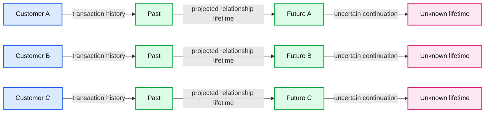
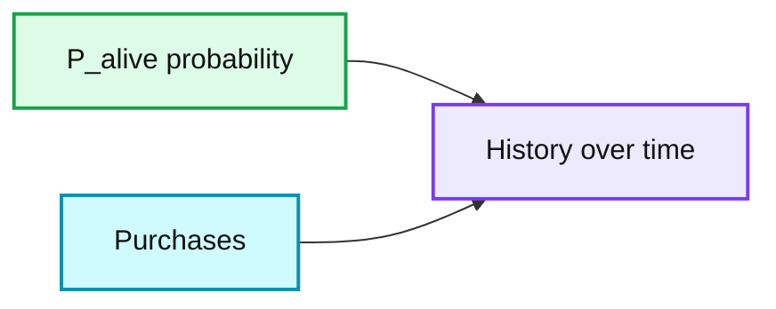
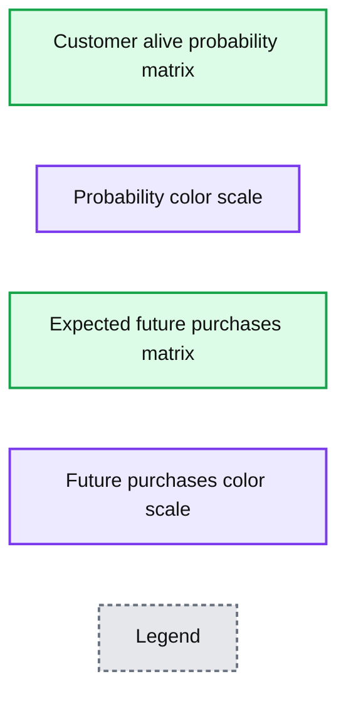

# Customer Lifetime Value Part 1: Estimating Customer Lifetimes

- Source: https://www.databricks.com/blog/2020/06/03/customer-lifetime-value-part-1-estimating-customer-lifetimes.html
- Published: 2020-06-03
- Authors: Rob Saker, Bryan Smith, Bilal Obeidat, Chris Robison
- Categories: solutions, engineering, solution-accelerators, open-source, data-science-machine-learning
- Images: 3 total, 3 extracted as architecture

>  Download the [Customer Lifetimes Part 1 notebook](https://notebooks.databricks.com/notebooks/RCG/Customer_Lifetime_Value/index.html)to demo the solution covered below, and [watch the on-demand virtual workshop](https://pages.databricks.com/202005-US-EV-VIRTUALWORKSHOP-RETAIL-ME-OD-thank-you-webinar.html) to learn more. You can also go to [Part 2](https://www.databricks.com/blog/2020/06/17/customer-lifetime-value-part-2-estimating-future-spend.html) to learn how to estimate future customer spend.

 
 The biggest challenge every marketer faces is how to best spend money to profitably grow their brand. We want to spend our marketing dollars on activities that attract the best customers, while avoiding spending on unprofitable customers or on activities that erode brand equity.
  
 Too often, marketers just look at spending efficiency. What is the least I can spend on advertising and promotions to generate revenue? Focusing solely on ROI metrics can weaken your brand equity and make you more dependent on price promotion as a way to generate sales.
  
 Within your existing set of customers are people ranging from brand loyalists to brand transients. Brand loyalists are highly engaged with your brand, are willing to share their experience with others, and are the most likely to purchase again. Brand transients have no loyalty to your brand and shop based on price. Your marketing spend ideally would focus on growing the group of brand loyalists, while minimizing the exposure to brand transients.
  
 So how can you identify these brand loyalists and best use your marketing dollars to prolong their relationship with you?
  
 Today's customer has no shortage of options. To stand out, businesses need to speak directly to the needs and wants of the individual on the other side of the monitor, phone, or station, often in a manner that recognizes not only the individual customer but the context that brings them to the exchange. When done properly, [personalized engagement](https://www.databricks.com/session_eu19/ai-powered-streaming-analytics-for-real-time-customer-experience) can drive higher revenues, marketing efficiency and customer retention, and as capabilities mature and customer expectations rise, getting personalization right will become ever more important. As [McKinsey & Company](https://www.mckinsey.com/business-functions/marketing-and-sales/our-insights/the-future-of-personalization-and-how-to-get-ready-for-it) puts it, personalization will be "the prime driver of marketing success within the next five years."
  
 But one critical aspect of personalization is understanding that not every customer carries with him or her the same potential for profitability. Not only do different customers derive different value from our products and services but this directly translates into differences in the overall amount of value we might expect in return. If the relationship between us and our customers is to be mutually beneficial, we must carefully align customer acquisition cost (CAC) and retention rates with the total revenue or [customer lifetime value (CLV)](https://www.databricks.com/blog/2019/08/05/using-ml-and-azure-to-improve-customer-lifetime-value-on-demand-webinar-and-faq-now-available.html) we might reasonably receive over that relationship's lifetime.
  
 This is the central motivation behind the customer lifetime value calculation. By calculating the amount of revenue we might receive from a given customer over the lifetime of our relationship with them, we might better tailor our investments to maximize the value of our relationship for both parties. We might further seek to understand why some customers value our products and services more than others and orient our messaging to attract more higher potential individuals. We might also use CLV in aggregate to assess the overall effectiveness in our marketing practices in building equity and monitor [how innovation and changes in the marketplace affect it over time](https://hbr.org/2017/04/what-most-companies-miss-about-customer-lifetime-value).
  
 But as powerful as CLV is, it's important we appreciate it's [derived from two separate and independent estimates](https://knowledge.wharton.upenn.edu/article/160811b_kwradio_fader-mariychin-mp3-zodiac/). The first of these is the per-transaction spend (or average order value) we may expect to see from a given customer. The second is the estimated number of transactions we may expect from that customer over a given time horizon. This second estimate is often seen as a means to an end, but as organizations [shift their marketing spend](https://knowledge.wharton.upenn.edu/article/omni-channel-personalization-future-marketing/) from acquiring new customers towards retention, it becomes incredibly valuable in its own right.

## How Customers Signal Their Lifetime Intent

In the non-contractual scenarios within which most retailers engage, customers may come and go as they please. Retailers attempting to assess the remaining lifetime in a customer relationship must carefully examine the transactional signals previously generated by customers in terms of the frequency and recency of their engagement. For example, a frequent purchaser who slows their pattern of purchases or simply fails to reappear for an extended period of time may signal they are approaching the end of their relationship lifetime. Another purchaser who infrequently engages may continue to be in a viable relationship even when absent for a similar duration.

**Summary:** The diagram compares three customers with equal transaction counts but different past purchase patterns and uncertain future relationship lifetimes.

**Components:**

- Customer A, technology not shown
- Customer B, technology not shown
- Customer C, technology not shown
- Past timeline
- Future timeline
- Unknown future lifetime markers

**Flows:**

- Customer A -> Past: transaction history
- Customer B -> Past: transaction history
- Customer C -> Past: transaction history
- Past -> Future: projected relationship lifetime
- Future -> Unknown future lifetime markers: uncertain continuation

**Numbers:** none

source image: https://www.databricks.com/wp-content/uploads/2020/06/clv-1.png

 Different customers with the same number of transactions but signaling different lifetime intent

Understanding where a customer is in the lifespan of their relationship with us can be critical to delivering the right messages at the right time. Customers signaling their intent to be in a long-term relationship with our brand, may respond positively to higher-investment offers which deepen and strengthen their relationship with us and which maximize the long-term potential of the relationship even while sacrificing short-term revenues. Customers signaling their intent for a short-term relationship may be pushed away by similar offers or worse may accept those offers with no hope of us ever recovering the investment.
  
 Leveraging [mlflow](https://www.databricks.com/product/managed-mlflow), a Machine Learning model management and deployment platform, we can easily map our model to standardized application program interfaces. While mlflow does not natively support the models generated by lifetimes, it is easily extended for this purpose. The end result of this is that we can quickly turn our trained models into functions and applications enabling periodic, real-time and interactive customer scoring of life expectancy metrics.
  
 Similarly, we may recognize shifts in relationship signals such as when long-lived customers approach the end of their relationship lifetime and promote alternative products and services which transition them into a new, potentially profitable relationship with ourselves or a partner. Even with our short-lived customers, we might consider how best to deliver products and services which maximize revenues during their time-limited engagement and which may allow them to recommend us to others seeking similar offerings.
  
 As Peter Fader and Sarah Toms write in The Customer Centricity Playbook, in an effective customer-centric strategy "opportunities to make maximum financial gains are identified and fully taken advantage of, but these high-risk bets must be weighted out and distributed across lower-risk categories of assets as well." Finding the right balance and tailoring our interactions starts with a careful estimate of where customers are in their lifetime journey with us.

## Estimating Customer Lifetime from Transactional Signals

As previously mentioned, in non-subscription models, we cannot know a customer's exact lifetime or where he or she resides in it, but we can leverage the transactional signals they generate to estimate the probability the customer is active and likely to return in the future. Popularized as the Buy 'til You Die (BTYD) models, a customer's frequency and recency of engagement relative to patterns of the same across a retailer's customer population can be used to derive survivorship curves which provide us these values.

**Summary:** The chart shows customer re-engagement probability P_alive over time, with purchase events marked by red dashed lines.

**Components:**

- P_alive probability time series
- Purchases event markers
- Time axis from 2011-01 to 2012-01
- Probability axis from 0.0 to 1.0

**Flows:**

- none

**Numbers:** 0.0, 0.1, 0.2, 0.3, 0.4, 0.5, 0.6, 0.7, 0.8, 0.9, 1.0, 2011-01, 2011-03, 2011-05, 2011-07, 2011-09, 2011-11, 2012-01

source image: https://www.databricks.com/wp-content/uploads/2020/06/clv-2.png

 Figure 2. The probability of re-engagement (P_alive) relative to a customer's history of purchases

The mathematics behind these predictive CLV models is quite complex. The original BTYD model proposed by [Schmittlein et al](https://www.jstor.org/stable/2631608?seq=1). in the late 1980s (and today known as the Pareto/Negative Binomial Distribution or Pareto/NBD model) didn't take off in adoption until [Fader et al](http://brucehardie.com/papers/018/fader_et_al_mksc_05.pdf). simplified the calculation logic (producing the Beta-Geometrical/Negative Binomial Distribution or BG/NBD model) in the mid-2000s. Even then, the math of the simplified model gets pretty gnarly pretty fast. Thankfully, the logic behind both of these models is accessible to us through a popular Python library named lifetimes to which we can provide simple summary metrics in order to derive customer-specific lifetime estimates.

## Delivering Customer Lifetime Estimates to the Business

While highly accessible, the use of the lifetimes library to calculate customer-specific probabilities in a manner aligned with the needs of a large enterprise can be challenging. First, a large volume of transaction data must be processed in order to generate the per-customer metrics required by the models. Next, curves must be derived from this data, fitting it to expected patterns of value distribution, the process of which is regulated by a parameter which cannot be predetermined and instead must be evaluated iteratively across a large range of potential values. Finally, the lifetimes models, once fitted, must be integrated into the marketing and customer engagement functions of our business for the predictions it generates to have any meaningful impact. It is our intent in this blog and the associated notebook to demonstrate how each of the challenges may be addressed.

### Metrics Calculations

The BTYD models depend on three key per-customer metrics:

- Frequency – the number of time units within a given time period on which a non-initial (repeat) transaction is observed. If calculated at a daily level, this is simply the number of unique dates on which a transaction occurred minus 1 for the initial transaction that indicates the start of a customer relationship.
- Age – the number of time units from the occurrence of an initial transaction until the end of a given time period. Again, if transactions are observed at a daily level, this is simply the number of days since a customer's initial transaction to the end of the dataset.
- Recency – the age of a customer (as previously defined) at the time of their latest non-initial (repeat) transaction.

 
 The metrics themselves are pretty straightforward. The challenge is deriving these values for each customer from transaction histories which may record each line item of each transaction occurring over a multi-year period. By leveraging a data processing platform such as [Apache Spark](https://www.databricks.com/spark/about) which natively distributes this work across the capacity of a multi-server environment, this challenge can be easily addressed and metrics computed in a timely manner. As more transactional data arrives and these metrics must be recomputed across a growing transactional dataset, the elastic nature of Spark allows additional resources to be enlisted to keep processing times within business-defined bounds.

### Model Fitting

With per-customer metrics calculated, the lifetimes library can be used to train one of multiple BTYD models which may be applicable in a given retail scenario. (The two most widely applicable are the Pareto/NBD and BG/NBD models but there are others.) While computationally complex, each model is trained with a simple method call, making the process highly accessible.
  
 Still, a regularization parameter is employed during the training process of each model to avoid overfitting it to the training data. What value is best for this parameter in a given training exercise is difficult to know in advance so that the common practice is to train and evaluate model fit against a range of potential values until an optimal value can be determined.
  
 This process often involves hundreds or even thousands of training/evaluation runs. When performed one at a time, the process of determining an optimal value, which is typically repeated as new transactional data arrives, can become very time consuming.
  
 By using a specialized library named [hyperopt](http://hyperopt.github.io/hyperopt/), we can tap into the infrastructure behind our Apache Spark environment and distribute the model training/evaluation work in a parallelized manner. This allows the parameter tuning exercise to be performed efficiently, returning to us the optimal model type and regularization parameter settings.

### Solution Deployment

Once properly trained, our model has the capability of not only determining the probability a customer will re-engage but the number of engagements expected over future periods. Matrices illustrating the relationship between recency and frequency metrics and these predicted outcomes provide powerful visual representations of the knowledge encapsulated in the now fitted models. But the real challenge is putting these predictive capabilities into the hands of those that determine customer engagement.

**Summary:** Matrices show customer alive probability and expected future purchases over 30 units of time based on historical frequency and recency.

**Components:**

- Customer alive probability matrix
- Probability color scale
- Expected future purchases matrix
- Future purchases color scale

**Flows:**

- none

**Numbers:** 30 units of time; x-axis ticks 0, 20, 40, 60, 80; y-axis ticks 0, 50, 100, 150, 200, 250; left color scale 0.0, 0.2, 0.4, 0.6, 0.8, 1.0; right color scale 0, 2, 4, 6, 8

source image: https://www.databricks.com/wp-content/uploads/2020/06/clv-3.png

 Figure 3. Matrices illustrating the probability a customer is alive (left) and the number of future purchases in a 30-day window given a customer's frequency and recency metrics (right)

Leveraging mlflow, a Machine Learning model management and deployment platform, we can easily map our model to standardized application program interfaces. While mlflow does not natively support the models generated by lifetimes, it is easily extended for this purpose. The end result of this is that we can quickly turn our trained models into functions and applications enabling periodic, real-time and interactive customer scoring of life expectancy metrics.

## Bringing It All Together with Databricks

The predictive capability of the BYTD models combined with the ease of implementation provided by the lifetimes library make widespread adoption of customer lifetime prediction feasible. Still, there are several technical challenges which must be overcome in doing so. But whether it's scaling the calculation of customer metrics from large volumes of transaction history, performing optimized hyperparameter tuning across a large search space or the deployment of an optimal model as a solution enabling customer scoring, the capabilities needed to overcome each of these challenges is available. Still, integrating these capabilities into a single environment can be challenging and time consuming. Thankfully, Databricks has done this work for us. And by delivering these as a cloud-native platform, retailers and manufacturers needing access to these can develop and deploy solutions in a highly-scalable environment with limited upfront cost.

Download the [Notebook](https://notebooks.databricks.com/notebooks/RCG/Customer_Lifetime_Value/index.html) to get started.
