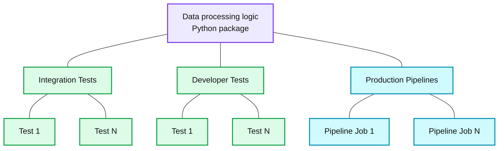

# Automate continuous integration and continuous delivery on Databricks using Databricks Labs CI/CD Templates

- Source: https://www.databricks.com/blog/2020/06/05/automate-continuous-integration-and-continuous-delivery-on-databricks-using-databricks-labs-ci-cd-templates.html
- Published: 2020-06-05
- Authors: Michael Shtelma, Thunder Shiviah
- Categories: platform, engineering
- Images: 3 total, 3 extracted as architecture

## CONTENTS

- Overview
- Why do we need yet another deployment framework?
- Simplifying CI/CD on Databricks via reusable templates
- Development lifecycle using Databricks Deployments
- How to create and deploy a new data project with Databricks Labs CI/CD Templates in 10 minutes?
  - Create a new project using the Databricks Labs CI/CD Templates  project template
  - Let’s deploy our project to target Databricks workspace
  - Test Automation using Databricks Labs CI/CD Templates
  - Deploying production pipelines using Databricks Deployments
  - Dependency and configuration management

- How to learn more
- Outlook and next steps
- How to contribute?

## Overview

*Databricks Labs continuous integration and continuous deployment (CI/CD) Templates are an open source tool that makes it easy for software development teams to use existing CI tooling with Databricks Jobs. Furthermore, it includes pipeline templates with Databricks’ best practices baked in that run on both Azure and AWS so developers can focus on writing code that matters instead of having to set up full testing, integration and deployment systems from scratch.*

CI/CD Templates in 3 steps:

1. `pip install cookiecutter`
2. `cookiecutter https://github.com/databrickslabs/cicd-templates.git`
  - Answer the interactive questions in the terminal such as which cloud you would like to use and you have a full working pipeline.
  - `pip install databricks_cli && databricks configure --token`
  - Start pipeline on Databricks by running `./run_pipeline.py pipelines` in your project main directory
3. Add your databricks token and workspace URL to github secrets and commit your pipeline to a github repo.

Your Databricks Labs CI/CD pipeline will now automatically run tests against databricks whenever you make a new commit into the repo. When you are ready to deploy your code, make a github release and templates will automatically package and deploy your pipeline to databricks as a job.

That’s it! You now have a scalable working pipeline which your development team can use and develop off of. Additionally, you can always modify the template to be more specific to your team or use-case to ensure future projects can be set up with ease.

 For the remainder of this post, we’ll go into depth about why we decided to create Databricks Labs CI/CD templates, what is planned for the future of the project, and how to contribute.

## Why do we need yet another deployment framework?

As projects on Databricks grow larger, Databricks users may find themselves struggling to keep up with the numerous notebooks containing the ETL, data science experimentation, dashboards etc. While there are various short term workarounds such as using the %run command to call other notebooks from within your current notebook, it’s useful to follow traditional software engineering best practices of separating reusable code from pipelines calling that code. Additionally, building tests around your pipelines to verify that the pipelines are also working is another important step towards production-grade development processes.

Finally, being able to run jobs automatically upon new code changes without having to manually trigger the job or manually install libraries on clusters is important for achieving scalability and stability of your overall pipeline. In summary, to scale and stabilize our production pipelines, we want to move away from running code manually in a notebook and move towards automatically packaging, testing, and deploying our code using traditional software engineering tools such as IDEs and continuous integrationI tools.

Indeed, more and more data teams are using Databricks as a runtime for their workloads preferring to develop their pipelines using traditional software engineering practices: using IDEs, GIT and traditional CI/CD pipelines. These teams usually would like to cover their data processing logic with unit tests and perform integration tests after each change in their version control system.

 The release process is also managed using a version control system: after a PR is merged into the release branch, integration tests can be performed and in a case of positive results  deployment pipelines can be also updated. Bringing a new version of pipelines to production workspace is also a complex process since they can have different dependencies, like configuration artifacts, python and/or maven libraries and other dependencies. In most cases, different pipelines can depend on different versions of the same artifact(s).

## Simplifying CI/CD on Databricks via reusable templates

Many organizations have invested many resources into building their own CI/CD pipelines for different projects. All those pipelines have a lot in common: basically they build, deploy and test some artifacts. In the past, developers were also investing long hours in developing different scripts for building, testing and deploying of applications before CI tools made most of those tasks obsolete: conventions introduced by CI tools made it possible to provide developers with the frameworks which can implement most of those tasks in an abstract way so that they can be applied to any project which follows these conventions. For example Maven has introduced such conventions in Java development, which made it possible to automate most of the build process, which were implemented in huge ant scripts.

Databricks Labs CI/CD Templates makes it easy to use existing CI/CD tooling, such as Jenkins,  with Databricks; Templates contain pre-made code pipelines created according to Databricks best practices. Furthermore, Templates allow teams to package up their CI/CD pipelines into reusable code to ease the creation and deployment of future projects. Databricks Labs CI/CD Templates introduces similar conventions for Data Engineering and Data Science projects which provide data practitioners using Databricks with abstract tools for implementing CI/CD pipelines for their data applications.

 Let us go deeper into the conventions we have introduced. Most of the data processing logic including data transformations, feature generation logic, model training, etc should be developed in the python package. This logic can be utilized in a number of production pipelines that can be scheduled as jobs. The aforementioned logic can be also tested using local unit tests that test individual transformation functions and integration tests. Integration tests are run on Databricks workspace and can test the data pipelines as a whole.

## Development lifecycle using Databricks Deployments

Data Engineers and Data Scientists can rely on Databricks Labs CI/CD Templates for testing and deploying the code they develop in their IDEs locally in Databricks. Databricks Labs CI/CD Templates provides users with the reusable data project template that can be used to jumpstart the development of a new data use case. This project will have the following structure:

**Summary:** The diagram shows a reusable Python data-processing package supporting integration tests, developer tests, and production pipelines or jobs.

**Components:**

- Data processing logic: Python package
- Integration Tests: test suite
- Test 1 and Test N: integration tests
- Developer Tests: test suite
- Test 1 and Test N: developer tests
- Production Pipelines: Databricks production pipelines
- Pipeline/Job 1 and Pipeline/Job N: Databricks jobs

**Flows:**

- None visibly shown.

**Numbers:** 1, N

source image: https://www.databricks.com/wp-content/uploads/2020/05/ImageCICD-og.png

Data ingestion, validation, and transformation logic, together with feature engineering and machine learning models, can be developed in the python package. This logic can be utilized by production pipelines and be tested using developer and integration tests.** Databricks Labs CI/CD Templates can deploy production pipelines as Databricks Jobs, *including all dependencies, automatically*. **These pipelines must be placed in the ‘pipelines’ directory and can have their own set of dependencies, including different libraries and configuration artifacts. Developers can utilize a local mode of Apache Spark or Databricks Connect to test the code while developing in IDE installed on their laptop. In case they would like to run these pipelines on Databricks, they can use the Databricks Labs CI/CD Templates CLI. Developers can also utilize the CLI to kick off integration tests for the current state of the project on Databricks.

After that, users can push changes to GitHub, where they will be automatically tested on Databricks using GitHub Actions configuration. After each push, GitHub Actions starts a VM that checks out the code of the project and runs the local pytest tests in this VM. If these tests were successful, it will build the python wheel and deploy it along all other dependencies to Databricks and run developer tests on Databricks.

 At the end of the development cycle, the whole project can be deployed to production by creating a GitHub release, which will kick off integration tests in Databricks and deployment of production pipelines as Databricks Jobs. In this case the CI/CD pipeline will look similarly to the previous one, but instead of developer tests, integration tests will be run on Databricks and if they are successful, the production job specification on Databricks will be updated.

## How to create and deploy a new data project with Databricks Labs CI/CD Templates in 10 minutes?

### Create a new project using the Databricks Labs CI/CD Templates  project template

- Install Cookiecutter python package: `pip install cookiecutter`
- Create your project using our cookiecutter template: `cookiecutter  https://github.com/databrickslabs/cicd-templates.git`
- Answer the questions…

After that, the new project will be created for you. It will have the following structure:

The name of the project we have created is ‘cicd_demo’, so the python package name is also ‘cicd_demo’, so our transformation logic will be developed in the ‘cicd_demo’ directory. It can be used from the pipelines that will be placed in ‘pipelines’ directory. In ‘pipelines’ directory we can develop  a number of pipelines, each of them in its own directory.

Each pipeline must have an entry point python script, which must be named ‘pipeline_runner.py’. In this project, we can see two sample pipelines created. Each of these pipelines has python script and job specification json file for each supported cloud. These files can be used to define cluster specification (e.g., number of nodes, instance type, etc.), job scheduling settings, etc.

 ‘Dev-tests’ and ‘integration-tests’ directories are used to define integration tests that test pipelines in Databricks. They should also utilize the logic developed in the python package and evaluate the results of the transformations.

## Let’s deploy our project to target Databricks workspace

Databricks Deployments is tightly integrated with GitHub Actions. We will need to create a new GitHub repository where we can push our code and where we can utilize GitHub Actions to test and deploy our pipelines automatically. In order to integrate GitHub repository with the Databricks workspace, workspace URL and Personal Authentication token (PAT) must be configured as GitHub secrets. Workspace URL must be configured as DATABRICKS_HOST secret and token as DATABRICKS_TOKEN.

Now we can initialize a new git repository in the project directory. After that, we can add all files to git and push them to the remote GitHub repository. After we have configured our tokens and proceeded with our first push GitHub Actions will run dev-test automatically on target Databricks Workspace and our first commit will be marked green if the tests are successful.

 It is possible to initiate run of production pipelines or individual tests on Databricks from the local environment by running run_pipeline.py script:

This command will run test_pipeline from the pipelines folder on Databricks.

 

## Test Automation  using Databricks Deployments

The newly created projects are preconfigured with two standard CI/CD pipelines: one of them is executed for each push and runs dev-tests on Databricks workspace.

**Summary:** Push-based CI/CD flow where GitHub runs local tests, builds and logs artifacts, then triggers a Databricks development test job.

**Components:**

- Data Scientists/Data Engineer: updates code on Databricks Projects.
- GitHub: runs local tests, builds wheels, logs artifacts, and evaluates results.
- MLflow: stores logged artifacts.
- Databricks: runs the development test pipeline and returns the run result.
- Test success decisions: determine whether the build succeeds or fails.
- Build status: reports build success or failure.

**Flows:**

- Data Scientists/Data Engineer -> Run local tests: code update on Databricks Projects.
- Run local tests -> Tests were successful: test result.
- Tests were successful -> Build failed: unsuccessful test status.
- Tests were successful -> Build Wheel: successful test status.
- Build Wheel -> Log artifacts to MLflow: built wheel.
- Log artifacts to MLflow -> Logging MLflow Artifacts: artifacts.
- Log artifacts to MLflow -> Start DEV TEST Job on Databricks: workflow continuation.
- Start DEV TEST Job on Databricks -> Databricks runs DEV TEST pipeline: development test request.
- Databricks runs DEV TEST pipeline -> Return Run Result: pipeline execution result.
- Return Run Result -> DEV TEST was successful: returned test result.
- DEV TEST was successful -> Build failed: unsuccessful development test status.
- DEV TEST was successful -> Build was successful: successful development test status.

**Numbers:** none

source image: https://www.databricks.com/wp-content/uploads/2020/05/CICD4ML-PushFlow-og.png

```mermaid
%% Shows the push based CI CD process across data engineering, GitHub, and Databricks
flowchart LR
    A[Code update on Databricks Projects] -->|code update| B[Run local tests]
    B -->|test result| C{Tests were successful}
    C -->|NO| D[Build failed]
    C -->|YES| E[Build Wheel]
    E -->|built wheel| F[Log artifacts to MLflow]
    F -->|artifact logging| G[Logging MLflow Artifacts]
    F -->|start development test| H[Start DEV TEST Job on Databricks]
    H -->|test request| I[Databricks runs DEV TEST pipeline]
    I -->|run result| J[Return Run Result]
    J -->|returned result| K{DEV TEST was successful}
    K -->|NO| L[Build failed]
    K -->|YES| M[Build was successful]

    classDef client   fill:#dbeafe,stroke:#2563eb,stroke-width:2px,color:#111
    classDef service  fill:#dcfce7,stroke:#16a34a,stroke-width:2px,color:#111
    classDef store    fill:#ede9fe,stroke:#7c3aed,stroke-width:2px,color:#111
    classDef cache    fill:#fef3c7,stroke:#d97706,stroke-width:2px,color:#111
    classDef queue    fill:#cffafe,stroke:#0891b2,stroke-width:2px,color:#111
    classDef critical fill:#fee2e2,stroke:#dc2626,stroke-width:4px,color:#111
    classDef external fill:#e5e7eb,stroke:#6b7280,stroke-width:2px,color:#111,stroke-dasharray:4 3
    classDef decision fill:#fce7f3,stroke:#db2777,stroke-width:2px,color:#111

    class A client
    class B,E,F,H,J service
    class G store
    class I external
    class C,K decision
    class D,L,M critical
```

Another one is run for each created GitHub release and runs integration-tests on Databricks workspace. In the case of a positive result of integration tests, the production pipelines are deployed as jobs to the Databricks workspace.

**Summary:** The diagram shows the GitHub release flow for Databricks CI/CD, from local testing through integration testing and production job deployment.

**Components:**

- Data Scientist or Data Engineer: creates a release on GitHub
- GitHub: runs local tests
- GitHub: evaluates test success
- GitHub: builds a wheel
- GitHub: logs artifacts to MLflow
- Databricks: logs MLflow artifacts
- GitHub: starts the integration test job
- Databricks: runs the integration test pipeline
- Databricks: returns the run result
- GitHub: evaluates integration test success
- GitHub: reports release failed
- GitHub: reports build failed
- GitHub: updates production job definitions
- Databricks: updates the job definition

**Flows:**

- Data Scientist or Data Engineer -> Run local tests: creates a GitHub release
- Run local tests -> Tests were successful: test result
- Tests were successful -> Release failed: unsuccessful test result
- Tests were successful -> Build Wheel: successful test result
- Build Wheel -> Log artifacts to MLflow: built package
- Log artifacts to MLflow -> Logging MLflow Artifacts: artifact logging
- Log artifacts to MLflow -> Start INT TEST Job on Databricks: starts integration test job
- Start INT TEST Job on Databricks -> Databricks runs INT TEST pipeline: integration test request
- Databricks runs INT TEST pipeline -> Return Run Result: integration test result
- Return Run Result -> INT TEST was successful: returned run status
- INT TEST was successful -> Build failed: unsuccessful integration test result
- INT TEST was successful -> Update PROD Job Definitions: successful integration test result
- Update PROD Job Definitions -> Update Job Definition on Databricks: production job update

**Numbers:** none

source image: https://www.databricks.com/wp-content/uploads/2020/05/CICD4ML-ReleaseFlow-og.png

```mermaid
%% GitHub release flow for integration testing and production deployment on Databricks
flowchart LR
    A[Creates release on GitHub] -->|release event| B[Run local tests]
    B -->|test result| C{Tests were successful}
    C -->|NO| D[Release failed]
    C -->|YES| E[Build Wheel]
    E -->|built package| F[Log artifacts to MLflow]
    F -->|artifact logging| G[Logging MLflow Artifacts]
    F -->|start job| H[Start INT TEST Job on Databricks]
    H -->|test request| I[Databricks runs INT TEST pipeline]
    I -->|run result| J[Return Run Result]
    J -->|status| K{INT TEST was successful}
    K -->|NO| L[Build failed]
    K -->|YES| M[Update PROD Job Definitions]
    M -->|job update| N[Update Job Definition on Databricks]

    classDef client   fill:#dbeafe,stroke:#2563eb,stroke-width:2px,color:#111
    classDef service  fill:#dcfce7,stroke:#16a34a,stroke-width:2px,color:#111
    classDef store    fill:#ede9fe,stroke:#7c3aed,stroke-width:2px,color:#111
    classDef cache    fill:#fef3c7,stroke:#d97706,stroke-width:2px,color:#111
    classDef queue    fill:#cffafe,stroke:#0891b2,stroke-width:2px,color:#111
    classDef critical fill:#fee2e2,stroke:#dc2626,stroke-width:4px,color:#111
    classDef external fill:#e5e7eb,stroke:#6b7280,stroke-width:2px,color:#111,stroke-dasharray:4 3
    classDef decision fill:#fce7f3,stroke:#db2777,stroke-width:2px,color:#111

    class A client
    class B,E,F,H,M service
    class G,I,J,N store
    class C,K decision
    class D,L critical
```

## Deploying production pipelines using Databricks Deployments

In order to deploy pipelines to production workspace, GitHub release can be created. It will automatically start integration tests and if they are positive, the production pipelines are deployed as jobs to the Databricks workspace. During the first run, the jobs will be created in Databricks workspace. During the subsequent release, the definition of existing jobs will be updated.

## Dependency and configuration management

Databricks Deployments supports dependency management on two levels:

- Project level:
  - project level python package dependencies, which are needed during production runtime, can be placed in runtime_requiremnets.txt
  - It is also possible to use project level JAR or Python Whl dependencies. They can be placed in dependencies/jars and dependencies/wheels directories.
- Pipeline dependencies:
  - Pipeline level python/maven/other dependencies can be specified in job specification json directly in libraries section
  - Jars and wheels can be placed in dependencies/jars and dependencies/wheels directories respectively in pipeline folder

Configuration files can be placed in the pipeline directory. They will be logged to MLflow together with python script. During execution in Databricks the job script will receive the path to the pipeline folder as first parameter. This parameter can be used to open any files that were present in the pipeline directory.

Let’s discuss how we can manage dependencies using Databricks Deployments using the following example:

This pipeline has two dependencies on pipeline level: one jar file and one wheel. Train_config.yaml file contains configuration parameters that pipeline can read using the following code:

## Outlook and next steps

There are different directions of the further development of Databricks Deployments. We are thinking of extending a set of CI/CD tools we provide the templates for. As of now it is just GitHub Actions, but we can add a template that integrates with CircleCI or  Azure DevOps.

Another direction can be supporting development of pipelines developed in Scala.

## How to contribute?

Databricks Labs CI/CD Templates is an open source tool and we happily welcome contributions to it. You are welcome to submit a PR!
