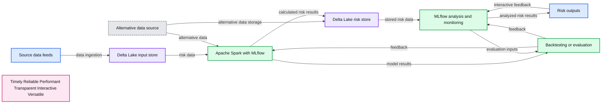
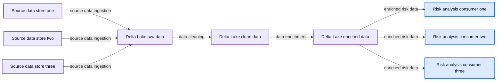
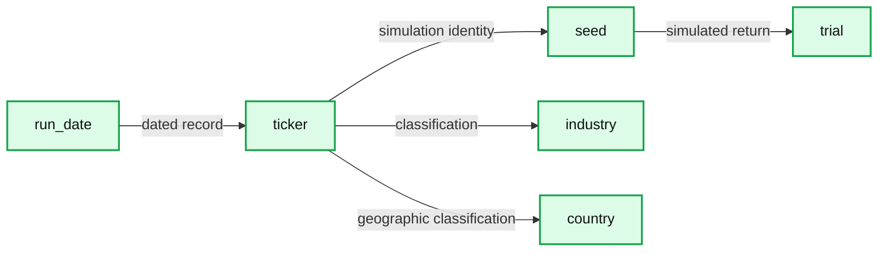
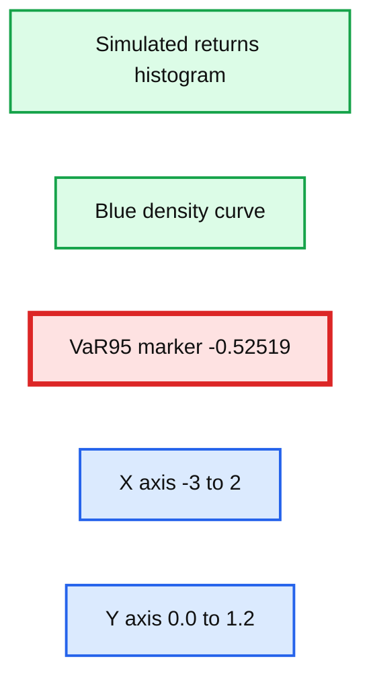
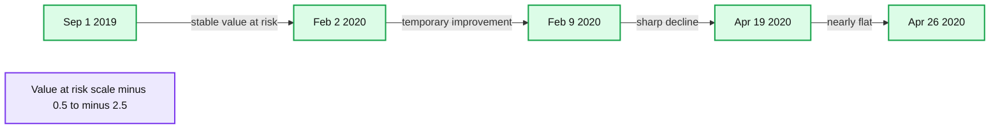
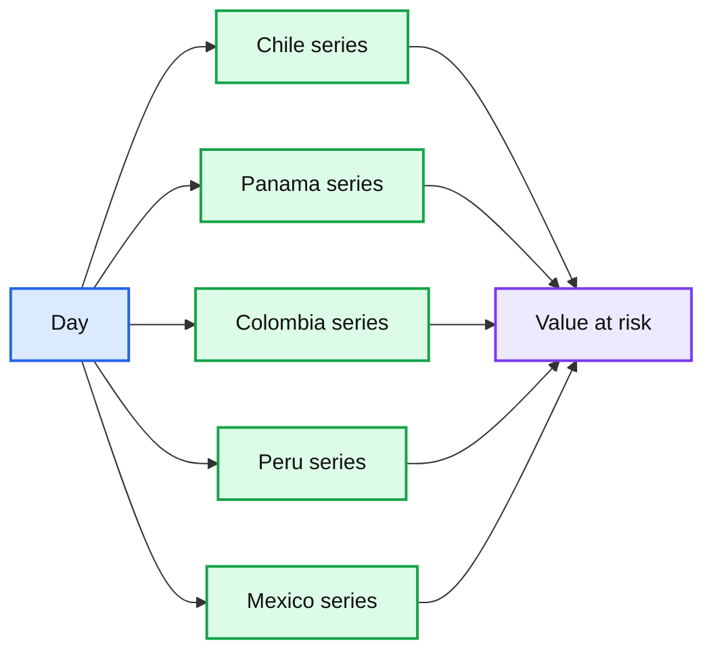
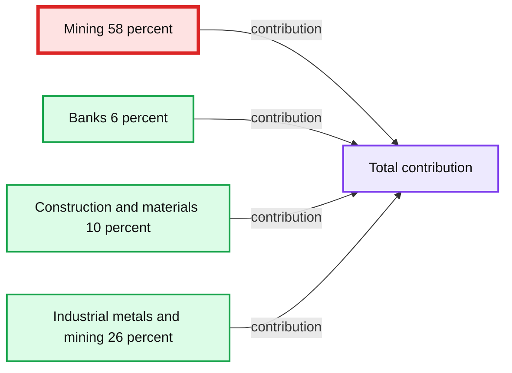
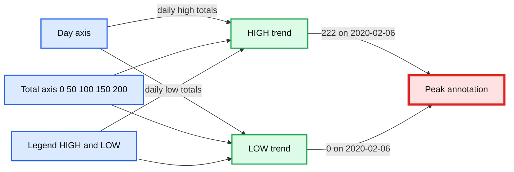

# Modernizing Risk Management Part 2: Aggregations, Backtesting at Scale and Introducing Alternative Data

- Source: https://www.databricks.com/blog/2020/06/05/modernizing-risk-management-part-2-aggregations-backtesting-at-scale-and-introducing-alternative-data.html
- Published: 2020-06-05
- Authors: Antoine Amend
- Categories: platform, engineering, open-source, data-science-machine-learning
- Images: 8 total, 8 extracted as architecture

Understanding and mitigating risk is at the forefront of any financial services institution. However, as previously discussed in the first blog of this two-part series, banks today are still struggling to keep up with the emerging risks and threats facing their business. Plagued by the limitations of  on-premises infrastructure and legacy technologies, banks until recently have not had the tools to effectively build a modern risk management practice. Luckily, a better alternative exists today based on open-source technologies powered by cloud-native infrastructure. This [Modern Risk Management](https://www.databricks.com/discover/pages/modernizing-risk-management) framework  enables intraday views, aggregations on demand and an ability to future proof/scale risk management. In this two-part blog series, we demonstrate how to modernize traditional value-at-risk calculation through the use of **Delta Lake**, **Apache SparkTM** and **MLflow** in order to enable a more agile and forward looking approach to  risk management.

**Summary:** The diagram shows a risk management architecture using Delta Lake, Apache Spark, and MLflow to ingest data, run simulations, support backtesting, and explore alternative data.

**Components:**

- Source data feeds
- Delta Lake input store
- Apache Spark with MLflow
- Alternative data source
- Delta Lake risk store
- MLflow analysis and monitoring
- Risk outputs
- Backtesting or evaluation process
- Timely, Reliable, Performant, Transparent, Interactive, and Versatile qualities

**Flows:**

- Source data feeds -> Delta Lake input store: data ingestion
- Delta Lake input store -> Apache Spark with MLflow: risk data
- Alternative data source -> Apache Spark with MLflow: alternative data
- Alternative data source -> Delta Lake risk store: alternative data storage
- Apache Spark with MLflow -> Delta Lake risk store: calculated risk results
- Apache Spark with MLflow -> Backtesting or evaluation process: model results
- Delta Lake risk store -> MLflow analysis and monitoring: stored risk data
- MLflow analysis and monitoring -> Risk outputs: analyzed risk results
- MLflow analysis and monitoring -> Backtesting or evaluation process: evaluation inputs
- Backtesting or evaluation process -> Apache Spark with MLflow: feedback
- Backtesting or evaluation process -> MLflow analysis and monitoring: feedback
- Risk outputs -> MLflow analysis and monitoring: interactive feedback

**Numbers:** none

source image: https://www.databricks.com/wp-content/uploads/2020/06/blog-modernizing-risk-management-pt2-1-og.png

The first [demo](https://www.databricks.com/blog/2020/05/27/modernizing-risk-management-part-1-streaming-data-ingestion-rapid-model-development-and-monte-carlo-simulations-at-scale.html) addressed the technical challenges related to modernizing risk management practices with data and advanced analytics, covering the concepts of risk modelling and Monte Carlo simulations using MLflow and Apache SparkTM. **This article focuses on the risk analyst persona and their requirements to efficiently slice and dice risks simulations (on demand) in order to better understand portfolio risks as new threats emerge, in real time.** We will cover the following topics:

- Using Delta Lake and SQL for aggregating value-at-risk on demand
- Using Apache SparkTM and MLflow to backtest models and report breaches to regulators
- Exploring the use of alternative data to better assess your risk exposure

## Slicing and dicing value-at-risk with Delta Lake

In [part one](https://www.databricks.com/blog/2020/05/27/modernizing-risk-management-part-1-streaming-data-ingestion-rapid-model-development-and-monte-carlo-simulations-at-scale.html) of this two-part blog series, we unveiled what a modern risk management platform looks like and the need for FSIs to shift the lense in which data is viewed: not as a cost, but as an asset. We demonstrated the versatile nature of data, and how storing Monte Carlo data in its most granular form would enable multiple use-cases along with providing analysts with the flexibility to run ad-hoc analysis, contributing to a more robust and agile view of the risks banks are facing.

**Summary:** A risk management data platform ingests source data into Delta Lake, where it is stored as raw, clean, and enriched data for downstream risk analysis.

**Components:**

- Source data stores: technology not specified
- Delta Lake raw data: Delta Lake
- Delta Lake clean data: Delta Lake
- Delta Lake enriched data: Delta Lake
- Downstream risk analysis consumers: technology not specified

**Flows:**

- Source data stores -> Delta Lake raw data: source data ingestion
- Delta Lake raw data -> Delta Lake clean data: data cleaning
- Delta Lake clean data -> Delta Lake enriched data: data enrichment
- Delta Lake enriched data -> downstream risk analysis consumers: enriched risk data

**Numbers:** none

source image: https://www.databricks.com/wp-content/uploads/2020/06/blog-modernizing-risk-management-pt2-2.png

In this blog and demo, we uncover the risk of various investments in a Latin America equity portfolio composed of 40 instruments across multiple industries. For that purpose, we leverage the vast amount of data we were able to generate through Monte Carlo simulations (40 instruments x 50,000 simulations x 52 weeks = 100 million records), partitioned by day and enriched with our portfolio taxonomy as follows.

**Summary:** A Latin American equity portfolio dataset lists run date, ticker, simulation seed, trial return, industry, and country for 21 visible records.

**Components:**

- run_date: portfolio simulation date
- ticker: equity ticker symbol
- seed: Monte Carlo simulation seed
- trial: simulated return
- industry: portfolio industry classification
- country: equity country classification

**Flows:**

- run_date -> ticker: identifies each dated equity record
- ticker -> seed: associates each equity with a simulation seed
- seed -> trial: produces a simulated return
- ticker -> industry: assigns an industry classification
- ticker -> country: assigns a country classification

**Numbers:** Row indices 0 through 20; run date 2019-10-06; seed 1570321566; trial values -0.005298, -0.000960, -0.001780, 0.008373, -0.008877, 0.012647, 0.007909, -0.024844, 0.009431, 0.012186, 0.003603, 0.005399, 0.022189, 0.005714, -0.003790, 0.007732, 0.012013, -0.003082, 0.001443, 0.006275, 0.004296

source image: https://www.databricks.com/wp-content/uploads/2020/06/blog-modernizing-risk-management-pt2-3.png

## Value-at-risk

Value-at-risk is the process of simulating random walks that cover possible outcomes as well as worst case (n) scenarios. A 95% value-at-risk for a period of (t) days is the best case scenario out of the worst 5% trials.

As our trials were partitioned by day, analysts can easily access a day’s worth of simulations data and group individual returns by a trial Id (i.e. the seed used to generate financial market conditions) in order to access the daily distribution of our investment returns and its respective value-at-risk.  Our first approach is to use Spark SQL to aggregate our simulated returns for a given day (50,000 records) and use in-memory python to compute the 5% quantile through a simple numpy operation.

Provided an initial $10,000 investment across all our Latin American equity instruments, the 95% value-at-risk - at that specific point in time - would have been $3,000. This is how much our business would be ready to lose (at least) in the worst 5% of all the possible events.

**Summary:** The chart shows a simulated return distribution with a density curve and a 95% value-at-risk threshold.

**Components:**

- Simulated returns histogram
- Blue density curve
- Red dashed VaR95 marker at -0.52519
- X axis from -3 to 2
- Y axis from 0.0 to 1.2

**Flows:**

- none

**Numbers:** -3, -2, -1, 0, 1, 2, 0.0, 0.2, 0.4, 0.6, 0.8, 1.0, 1.2, 95%, -0.52519

source image: https://www.databricks.com/wp-content/uploads/2020/06/blog-modernizing-risk-management-pt2-4.png

The downside of this approach is that we first need to collect all daily trials in memory in order to compute the 5% quantile. While this process can be performed easily when using 1 day worth of data, it quickly becomes a bottleneck when aggregating value-at-risk over a longer period of time.

## A pragmatic and scalable approach to problem solving

Extracting percentile from a large dataset is a known challenge for any distributed computing environment. A common (albeit inefficient) practice is to 1) sort all of your data and 2) cherry pick a specific row using takeOrdered or to find an approximation through the approxQuantile method. Our challenge is slightly different since our data does not constitute a single dataset but spans across multiple days, industries and countries, where each bucket may be too big to be efficiently collected and processed in memory.

In practice, we leverage the nature of value-at-risk and only focus on the worst n events (n small). Given 50,000 simulations for each instrument and a 99% VaR, we are interested in finding the best of the worst 500 experiments only. For that purpose, we create a user defined aggregate function (UDAF) that only returns the best of the worst n events. This approach will drastically reduce the memory footprint and network constraints that may arise when computing large scale VaR aggregation.

By registering our UADF through spark.udf.register method, we expose that functionality to all of our users, **democratizing risk analysis to everyone without an advanced knowledge of scala / python / spark.** One simply has to group by trial Id (i.e. seed) in order to apply the above and extract the relevant value-at-risk using plain old SQL capabilities across all their data.

We can easily uncover the effect of COVID-19 on our market risk calculation. A 90-day period of economic volatility resulted in a much lower value-at-risk and therefore a much higher risk exposure overall since early March 2020.

**Summary:** Time-series chart showing value-at-risk declining sharply after early March 2020 during COVID-19 volatility.

**Components:**

- Day axis: calendar dates from September 2019 through April 2020
- Value-at-risk axis: risk metric scale
- Value-at-risk series: plotted line tracking risk exposure over time

**Flows:**

- Sep 1 2019 -> Feb 2 2020: value-at-risk remains relatively stable
- Feb 2 2020 -> Feb 9 2020: value-at-risk improves
- Feb 9 2020 -> Apr 19 2020: value-at-risk declines sharply
- Apr 19 2020 -> Apr 26 2020: value-at-risk remains nearly flat

**Numbers:** -0.5, -1, -1.5, -2, -2.5; Sep 1 2019, Sep 15, Sep 29, Oct 13, Oct 27, Nov 10, Nov 24, Dec 8, Dec 22, Jan 5 2020, Jan 19, Feb 2, Feb 16, Mar 1, Mar 15, Mar 29, Apr 12, Apr 26; 90-day

source image: https://www.databricks.com/wp-content/uploads/2020/06/blog-modernizing-risk-management-pt2-5.png

## Holistic view of our risk exposure

In most cases, understanding overall value-at-risk is not enough. Analysts need to understand the risk exposure to different books, asset classes, different industries or different countries of operations. In addition to Delta Lake capabilities such as time travel and ACID transactions discussed earlier, Delta Lake and Apache SparkTM have been highly optimised on Databricks runtime to provide fast aggregations at read. High performance can be achieved using our native partitioning logic (by date) alongside a z-order indexing applied to both country and industry. This additional indexing will be fully exploited when selecting a specific slice of your data at a country or industry level, drastically reducing the amount of data that needs to be read prior to your VaR aggregation.

We can easily adapt the above SQL code by using country and industry as our grouping parameter for VALUE_AT_RISK method in order to have a more granular and descriptive view of our risk exposure. The resulting data set can be visualised “as-is” using Databricks notebook and can be further refined to understand the exact contribution each of these countries have to our overall value-at-risk.

**Summary:** Line chart showing value-at-risk by country over time, with Peru exhibiting the largest decline.

**Components:**

- Chile series
- Panama series
- Colombia series
- Peru series
- Mexico series
- Day axis
- Value at risk axis
- Country legend

**Flows:**

- Day -> Country series: time progression
- Country series -> Value at risk axis: plotted risk values

**Numbers:** 0, -0.5, -1, -1.5, -2, 2019, 2020, Aug 18, Sep 1, Sep 15, Sep 29, Oct 13, Oct 27, Nov 10, Nov 24, Dec 8, Dec 22, Jan 5, Jan 19, Feb 2, Feb 16, Mar 1, Mar 15, Mar 29, Apr 12, Apr 26, May 10, -0.4996852, -0.7015106, -0.7932851, -0.7961757, -1.85483, Apr 19, 2020, 60%, March 2020

source image: https://www.databricks.com/wp-content/uploads/2020/06/blog-modernizing-risk-management-pt2-6.png

In this example, Peru seems to have the biggest contribution to our overall risk exposure. Looking at the same SQL code at an industry level in Peru, we can investigate the contribution of the risk across industries.

**Summary:** Stacked bar chart showing Peru’s in-country portfolio value-at-risk contribution by industry over time.

**Components:**

- Mining industry contribution
- Banks industry contribution
- Construction and materials contribution
- Industrial metals and mining contribution
- Day axis
- Contribution percentage axis

**Flows:**

- none

**Numbers:**

- 0%, 20%, 40%, 60%, 80%, 100%
- 2019-09-01
- 2019-09-15
- 2019-09-29
- 2019-10-13
- 2019-10-27
- 2019-11-10
- 2019-11-24
- 2019-12-08
- 2019-12-22
- 2020-01-05
- 2020-01-19
- 2020-02-02
- 2020-02-16
- 2020-03-01
- 2020-03-15
- 2020-03-29
- 2020-04-12
- 2020-04-26
- 58%
- 6%
- 10%
- 26%

source image: https://www.databricks.com/wp-content/uploads/2020/06/blog-modernizing-risk-management-pt2-7.png

With a contribution close to 60% in March 2020, the main risk exposure in Peru seems to be related to the mining industry. An increasingly severe lockdown in response to the COVID virus has been impacting mining projects in Peru, centre for copper, gold and silver production ([source](https://www.miningmagazine.com/covid-19/news/1383191/covid-19-lock-down-affects-miners-in-peru)).

Stretching the scope of this article, we may wonder if we could have identified this trend earlier using alternative data and specifically the global database of events, locations and tone ([GDELT](https://www.gdeltproject.org/)). We report in below graph the media coverage for the mining industry in Peru, color coding positive and negative trends through a simple moving average.

**Summary:** The chart compares daily HIGH and LOW financial risk totals from January 9 through March 4, 2020, highlighting a peak HIGH value of 222 on February 6.

**Components:**

- Day axis
- Total axis
- HIGH trend series
- LOW trend series
- Peak annotation

**Flows:**

- Day axis -> HIGH trend series: daily high totals
- Day axis -> LOW trend series: daily low totals
- HIGH trend series -> Peak annotation: value 222 on 2020-02-06
- LOW trend series -> Peak annotation: value 0 on 2020-02-06

**Numbers:** 0, 50, 100, 150, 200, 222; dates 2020-01-09, 2020-01-13, 2020-01-16, 2020-01-19, 2020-01-22, 2020-01-25, 2020-01-28, 2020-01-31, 2020-02-03, 2020-02-06, 2020-02-09, 2020-02-12, 2020-02-15, 2020-02-18, 2020-02-21, 2020-02-24, 2020-02-27, 2020-03-01, 2020-03-04

source image: https://www.databricks.com/wp-content/uploads/2020/06/blog-modernizing-risk-management-pt2-8.png

This clearly exhibits a positive trend in early February, i.e. 15 days prior to the observed stock volatility, which could have been an early indication of mounting risks. This analysis stresses the importance of modernizing value-at-risk calculations, augmenting historical data with external factors derived from alternative data.

## Model backtesting

In response to the 2008 financial crisis, an additional set of measures were developed by the Basel committee on banking supervision. The 1 day VaR 99 results are to be compared against daily P&Ls. Backtests are to be performed quarterly using the most recent 250 days of data. Based on the number of exceedances experienced during that period, the VaR measure is categorized as falling into one of three colored zones.

| Level | Threshold | Results |
|---|---|---|
| Green | Up to 4 exceedances | No particular concerns raised |
| Yellow | Up to 9 exceedances | Monitoring required |
| Red | More than 10 exceedances | VaR measure to be improved |

## AS-OF value-at-risk

Given the aggregated function we defined earlier, we can extract daily value-at-risk across our entire investment portfolio. As our aggregated value-at-risk dataset is small (contains 2 years of history, i.e. 365 x 2 data points), our strategy is to collect daily VaR and broadcast it to our larger set in order to avoid unnecessary shuffles. More details on AS-OF functionalities can be found in an earlier [blog post* Democratizing Financial Time Series Analysis*](https://www.databricks.com/blog/2019/10/09/democratizing-financial-time-series-analysis-with-databricks.html)*.*

We retrieve the closest value-at-risk to our actual returns via a simple user defined function and perform a 250-day sliding window to extract continuous daily breaches.

## Stressed VaR

Introducing a “stressed VaR“ helps mitigate the risk we face today by including worst-ever trading days as part of our ongoing calculation. However, this wouldn’t change the fact that this whole approach is solely based on historical data and unable to cope with actual volatility driven by new emerging threats. In fact, despite complex “stressed VaR” models, banks are no longer equipped to operate in so-called “unprecedented times“ where history no longer repeats itself. As a consequence, most of the top tier banks are currently reporting severe breaches in their value-at-risk calculations as reported in the Financial Times article below.

> St banks’ trading risk surges to highest since 2011 [...] The top five Wall St banks’ aggregate “value-at-risk”, which measures their potential daily trading losses, soared to its highest level in 34 quarters during the first three months of the year, according to Financial Times analysis of the quarterly VaR high disclosed in banks’ regulatory filings [https://www.ft.com/content/7e64bfbc-1309-41ee-8d97-97d7d79e3f57?shareType=nongift](https://www.ft.com/content/7e64bfbc-1309-41ee-8d97-97d7d79e3f57?shareType=nongift)

## A forward looking approach

As demonstrated earlier, a modern risk and portfolio management practice should not be solely based on historical returns but also must embrace the variety of information available today, introducing shocks to Monte Carlo simulations augmented with real-life news events, as they unfold. For example, a [white paper](https://eprints.soton.ac.uk/417880/1/manuscript2_2.pdf) from Atkins et al describes how *financial news can be used to predict stock market volatility better than close price*. As indicated via the Peru example above, the use of alternative data can dramatically augment the intelligence for risk analysts to have a more descriptive lense of modern economy, enabling them to better understand and react to exogenous shocks in real time.   In this series of articles, we have demonstrated how Apache SparkTM, Delta Lake and MLflow can be used for value-at-risk calculation, and how banks can modernize their risk management practices by moving to the cloud and adopting a unified approach to data analytics with Databricks. In addition, we show how banks can take back control of their data (consider data as an asset, not a cost) and enrich the view they have on the modern economy through the use of alternative data in order to move towards a forward looking and a more agile approach to risk management and investment decisions.

## Modernizing Your Approach to Risk Management: Next Steps

Try the below  on Databricks today! And if you want to learn how unified data analytics can bring data science, business analytics and engineering together to accelerate your data and ML efforts, check out the on-demand workshop - [*Unifying Data Pipelines, Business Analytics and Machine Learning with Apache SparkTM*](https://pages.databricks.com/202005-US-EV-VIRTUALWORKSHOP-FINSERV-OD-thank-you-webinar.html?_ga=2.136922233.878683226.1589772301-106254719.1587572290)*. * VaR and Risk Management Notebooks: [Get the notebook](https://d1r5llqwmkrl74.cloudfront.net/notebooks/FSI/value_at_risk/index.html) [Contact us](https://www.databricks.com/company/contact) to learn more about how we assist customers with market risk use cases.
