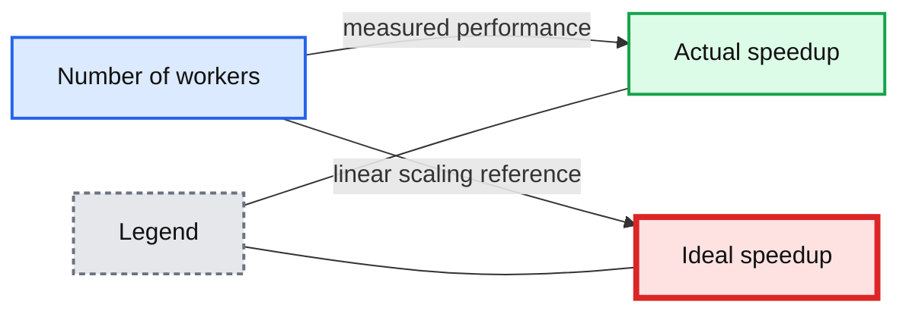

# Accelerating Somatic Variant Calling with the Databricks TNSeq Pipeline

- Source: https://www.databricks.com/blog/2020/06/15/accelerating-somatic-variant-calling-with-the-databricks-tnseq-pipeline.html
- Published: 2020-06-15
- Authors: Henry Davidge, Frank Nofthaft
- Categories: engineering, data-science-machine-learning, platform, open-source
- Images: 3 total, 2 extracted as architecture

Genetic analyses are a critical tool in revolutionizing how we treat cancer. By understanding the mutations present in tumor cells, researchers can [gain clues that lead to drug targets](https://www.nature.com/articles/s41588-018-0086-z?error=cookies_not_supported&code=678458b1-d89e-4687-8b99-2b98aeef90d2) and eventually new therapies. At the same time, genetic characterizations of individual tumors enables [physicians to tailor treatments](https://misuse.ncbi.nlm.nih.gov/error/abuse.shtml) to individual patients and improve outcomes while reducing side effects.

However, the full promise of genetic data for cancer therapeutic development has not been realized. There are a lack of robust, scalable, or standardized approaches to process and analyze cancer genome sequencing data. In a typical research setting, each scientist picks their own set of algorithms and stitches them together with custom glue code. This creates analytics workflows that are hard to manage, scale or reproduce. Moving from ad hoc analytics to robust, reproducible and well engineered genomics data pipelines is critical to take cancer research and treatment to the next level.

## Identifying Genetic Variants Responsible for Cancer

The first step in this process is identifying the genetic variations in tumor cells compared to the non-tumor cells in an individual. This process is called somatic variant calling.

**Summary:** The diagram shows a Databricks Delta Lake pipeline that processes germline and tumor samples into analysis-ready mutations through parallelized genomic-region variant calling.

**Components:**

- Germline sample
- Tumor sample
- Align reads
- Clean-up duplicated read and base quality errors
- DNA reads from germline using Delta Lake
- DNA reads from tumor using Delta Lake
- Call mutations, parallelized by genomic region
- Analysis-ready mutations using Delta Lake

**Flows:**

- Germline sample -> Align reads: germline sequencing reads
- Align reads -> Clean-up duplicated read and base quality errors: aligned reads
- Clean-up duplicated read and base quality errors -> DNA reads from germline: cleaned germline DNA reads
- Tumor sample -> Align reads: tumor sequencing reads
- Align reads -> Clean-up duplicated read and base quality errors: aligned reads
- Clean-up duplicated read and base quality errors -> DNA reads from tumor: cleaned tumor DNA reads
- DNA reads from germline -> Call mutations: germline DNA reads
- DNA reads from tumor -> Call mutations: tumor DNA reads
- Call mutations -> Analysis-ready mutations: called mutations

**Numbers:** none

```mermaid
%% Databricks TNSeq pipeline from samples to analysis-ready mutations
flowchart LR
    G[Germline sample] -->|sequencing reads| AG[Align reads]
    T[Tumor sample] -->|sequencing reads| AT[Align reads]
    AG -->|aligned reads| CG[Clean-up duplicated read and base quality errors]
    AT -->|aligned reads| CT[Clean-up duplicated read and base quality errors]
    CG -->|cleaned germline DNA reads| DG[DNA reads from germline Delta Lake]
    CT -->|cleaned tumor DNA reads| DT[DNA reads from tumor Delta Lake]
    DG -->|germline DNA reads| CM[Call mutations parallelized by genomic region]
    DT -->|tumor DNA reads| CM
    CM -->|called mutations| AM[Analysis-ready mutations Delta Lake]

    classDef client fill:#dbeafe,stroke:#2563eb,stroke-width:2px,color:#111
    classDef service fill:#dcfce7,stroke:#16a34a,stroke-width:2px,color:#111
    classDef store fill:#ede9fe,stroke:#7c3aed,stroke-width:2px,color:#111
    classDef cache fill:#fef3c7,stroke:#d97706,stroke-width:2px,color:#111
    classDef queue fill:#cffafe,stroke:#0891b2,stroke-width:2px,color:#111
    classDef critical fill:#fee2e2,stroke:#dc2626,stroke-width:4px,color:#111
    classDef external fill:#e5e7eb,stroke:#6b7280,stroke-width:2px,color:#111,stroke-dasharray:4 3
    classDef decision fill:#fce7f3,stroke:#db2777,stroke-width:2px,color:#111

    class G,T external
    class AG,AT,CG,CT,CM service
    class DG,DT,AM store
```

source image: https://www.databricks.com/wp-content/uploads/2020/06/svc-architecture-og-2.png

In industry, most researchers  have standardized these data analytics workflows on the [GATK's best practice pipeline for somatic variant calling](https://gatk.broadinstitute.org/hc/en-us/articles/360035894731-Somatic-short-variant-discovery-SNVs-Indels-), known as MuTect2. While MuTect2 offers high accuracy, it can take hours to days to run, and the mutations are output in a textual file format that is cumbersome for data scientists to analyze. Combining the mutation calls with clinical or imaging data requires additional complex integrations of distinct systems, slowing down the process of generating clinical reports or population-scale analyses of cancer mutations.

Fortunately, there’s a path forward with [Databricks Unified Data Analytics Platform for Genomics](https://www.databricks.com/product/genomics). More specifically, to address the problems outlined above, we are excited to announce our TNSeq pipeline ([AWS](https://docs.databricks.com/applications/genomics/secondary/tumor-normal-pipeline.html) | [Azure](https://docs.microsoft.com/en-us/azure/databricks/applications/genomics/secondary/tumor-normal-pipeline)) which builds on top of our [DNASeq pipeline](https://www.databricks.com/blog/2018/09/10/building-the-fastest-dnaseq-pipeline-at-scale.html). The TNSeq pipeline enables oncology teams to build and scale rapid data analysis pipelines that flow directly into downstream tertiary analyses for critical cancer research. Initially, the sequenced DNA from the tumor and germline samples are processed equivalently to our [DNASeq pipeline](https://www.databricks.com/blog/2018/09/10/building-the-fastest-dnaseq-pipeline-at-scale.html): the reads are mapped to a reference genome and then common sequencing errors (like PCR duplicates or biased base quality scores) are corrected. Once aligned and preprocessed, somatic mutations are identified by pooling the tumor and germline reads together, and looking for genomic locations where different alleles are seen between the tumor and germline data. Ultimately, our pipeline reduces pipeline latency by 6x and total cost by 20%, while producing equivalent somatic variant calls. We output our mutation calls directly into [Delta Lake](http://delta.io) tables, formatted using the [Glow](http://projectglow.io) schemas. This allows for pipelines to feed directly into [reports](https://www.databricks.com/blog/2019/03/07/simplifying-genomics-pipelines-at-scale-with-databricks-delta.html), annotation pipelines ([AWS](https://docs.databricks.com/applications/genomics/secondary/snpeff-pipeline.html) | [Azure](https://docs.microsoft.com/en-us/azure/databricks/applications/genomics/secondary/snpeff-pipeline)), and [statistical genetics analyses](https://www.databricks.com/blog/2019/09/20/engineering-population-scale-genome-wide-association-studies-with-apache-spark-delta-lake-and-mlflow.html).

By building on top of the [Databricks Unified Data Analytics Platform for Genomics](https://www.databricks.com/product/genomics), our open source project [Glow](https://github.com/projectglow/glow), and existing single node tools, our pipeline allows researchers and clinicians to seamlessly blend genomic data engineering and data science pipelines, while reducing pipeline latency, computational cost, and infrastructure complexity. By unifying cancer genomic data with both machine learning techniques and clinical/imaging data, Databricks customers are identifying genes that drive cancer progression, developing [more sensitive algorithms for the early detection of cancer](https://cancerres.aacrjournals.org/content/79/13_Supplement/916.short), and building the next generation of [clinical reports that blend genomics with imaging](https://www.databricks.com/discover/fighting-dementia-with-deep-learning??itm_data=blog-promo-detectingdementia) and other patient data to provide clinicians with a full portrait of the patient’s cancer status.

## Accelerating Somatic Variant Calling in the Genomics Runtime

Our pipeline uses Apache Spark™ and [Glow](https://projectglow.io/) to parallelize [BWA-MEM](https://github.com/lh3/bwa/tree/master/bwakit) for alignment and GATK’s [MuTect2](https://gatk.broadinstitute.org/hc/en-us/articles/360037593851-Mutect2) tool for variant calling. Alignment is embarrassingly parallel over reads, so we can map each read fragment individually for the tumor and normal samples. We then use Spark to group all reads that are relevant for a given region of the genome into the same partition, duplicating reads across partitions as necessary. This technique allows our pipeline to produce concordant results with the single node MuTect2 tool while still achieving parallelism.

The pipeline operates as a Databricks job, so users can trigger new runs using the UI or programmatically with the [Databricks CLI](https://docs.databricks.com/dev-tools/cli/index.html). In addition to producing standard output files like a BAM for aligned reads and a VCF for called variants, our pipeline writes results to a Delta Lake table. This format simplifies organization of thousands of cancer samples and allows for scalable analysis with Glow using the built-in regression tests or by integrating with single node tools, such as Samtools, using the [Pipe Transformer](https://glow.readthedocs.io/en/latest/tertiary/pipe-transformer.html).

## Evaluating our Somatic Variant Calling Pipeline

We benchmarked the accuracy and performance of our pipeline using whole exome sequencing data from the [Texas Cancer Research Biobank](https://www.nature.com/articles/sdata201610?error=cookies_not_supported&code=b60e170d-0d17-4b81-8aad-1b4297c360c0). The normal sample was sequenced at an average coverage of 95x resulting in 6GB of bzip compressed FASTQ files, while the tumor sample was sequenced at an average coverage of 99x for 6.4GB of bzip compressed FASTQ files.

### Accuracy

We compared the end-to-end results of our pipeline against command line BWA-MEM and MuTect2. We used [som.py](https://github.com/Illumina/hap.py/blob/master/doc/sompy.md) to produce concordance metrics.

| **Variant type** | **Precision** | **Recall** |
|---|---|---|
| **SNV** | 0.9998 | 0.9994 |
| **indel** | 0.9963 | 0.9968 |
| **all** | 0.9977 | 0.9978 |

Since somatic variant calling tools like MuTect2 emphasize sensitivity to variations that may be supported by few reads, these tools are highly sensitive to slight variations in the alignments produced by BWA-MEM. However, [BWA-MEM uses the index of a read within a batch to choose between equally good alignments](https://www.biostars.org/p/238628/#238817). Because the index is not stable in a distributed setting, our distributed version of BWA-MEM can report different, although equally likely, alignments than the command line version.

To verify that all discrepancies between the two variant callsets derive from randomness during alignment, we also ran command line MuTect2 against the aligned BAM files produced by our pipeline. These results were identical to the variant calls produced by the Databricks pipeline.

| **Variant type** | **Precision** | **Recall** |
|---|---|---|
| **SNV** | 1 | 1 |
| **indel** | 1 | 1 |
| **all** | 1 | 1 |

Alignments produced by our pipeline differ from command line BWA-MEM because of nondeterminism in the underlying tool. Forcing our pipeline to run alignment for all reads in a single Spark partition produced identical alignments to command line BWA-MEM.

### Performance

To evaluate the efficiency of our pipeline against standalone command line tools, we compared the runtime on one c5.9xlarge instance against command line MuTect2 and BWA-MEM. Since there is limited parallelism available in the single-node MuTect2 pipeline, we ran it on an i3.2xlarge instance with 8 cores. This analysis excludes cluster initialization time, which is amortized across all samples run in a single batch.

| **Pipeline** | **Runtime (minutes)** | **Cores** | **Core-hours** |
|---|---|---|---|
| **Command line** | 259.2 | 8 | 32.4 |
| **Databricks** | 54.27 | 36 | 32.56 |

The speedup primarily derives from the limited multithreading capabilities in command line MuTect2. By efficiently utilizing cluster resources, our pipeline matches the per-core performance of single node tools while significantly reducing overall runtime.

However, unlike the open-source GATK somatic variant calling pipeline, the Databricks TNSeq pipeline is designed to scale across multiple nodes. To demonstrate the scalability of our pipeline, we ran an experiment where we added additional worker nodes. In all experiments, each worker node used an AWS c5.9xlarge instance with 36 cores and 72GB of memory.

**Summary:** The chart compares actual and ideal speedup as the number of workers increases.

**Components:**

- Actual speedup series, technology not specified
- Ideal speedup series, technology not specified
- Number of workers axis
- Speedup axis

**Flows:**

- Number of workers -> Actual speedup: measured performance
- Number of workers -> Ideal speedup: linear scaling reference

**Numbers:** 0, 2, 4, 6, 8

source image: https://www.databricks.com/wp-content/uploads/2020/06/blog-somatic-3.png

The runtime scaled nearly linearly with the number of workers in the cluster, although beyond six workers the benefit begins to decrease. The point of diminishing returns depends on the total data size. For this dataset, the total runtime of the pipeline with six workers was only 9.95 minutes.

## Try it!

The TNSeq pipeline offers industry-leading latency and allows mutational data to flow directly from a pipeline into advanced ML and population-scale analyses. This pipeline is available in the Databricks Genomics Runtime ([Azure](https://docs.microsoft.com/en-us/azure/databricks/runtime/genomicsruntime#dbr-genomics) | [AWS](https://docs.databricks.com/runtime/genomicsruntime.html#dbr-genomics)) and is generally available for all Databricks users. Learn more about our genomics solutions in the [Databricks Unified Analytics Platform for Genomics](https://www.databricks.com/product/genomics) and [try out a preview today](https://pages.databricks.com/genomics-preview.html).
