# Customer Lifetime Value Part 2: Estimating Future Spend

- Source: https://www.databricks.com/blog/2020/06/17/customer-lifetime-value-part-2-estimating-future-spend.html
- Published: 2020-06-17
- Authors: Rob Saker, Bryan Smith, Bilal Obeidat, Chris Robison
- Categories: platform, engineering, open-source, data-science-machine-learning
- Images: 5 total, 3 extracted as architecture

>  Check out the [notebook](https://notebooks.databricks.com/notebooks/RCG/Customer_Lifetime_Value/index.html?#Customer_Lifetime_Value_2.html) referred throughout the blog and [watch the on-demand virtual workshop](https://pages.databricks.com/202005-US-EV-VIRTUALWORKSHOP-RETAIL-ME-OD-thank-you-webinar.html) to learn more. You can also go to [Part 1](https://www.databricks.com/blog/2020/06/03/customer-lifetime-value-part-1-estimating-customer-lifetimes.html)to learn how to estimate customer lifetime duration.

20% of your customers account for 200% of your profits.

You read that correctly. This seems a mathematical impossibility at first glance, but as Harvard Business School professor Sunil Gupta points out in Driving Digital Strategy, this calculation works when you realize that many of your customers are unprofitable.

While the exact ratio may vary by business, it is crucial that each business identifies its high-value customers, cultivates long-term relationships with them, and attracts more customers of this caliber.

While some companies may go to the extent of firing unprofitable customers, at a minimum, firms should identify unprofitable customers and minimize additional investment in them. Bain & Company 1 is famous for its analysis that shows increasing customer retention rates by 5% increases profitability by 25-to-95%, but the critical lesson is that this is achieved when we retain the *right* customers.

The potential profitability of any given customer is not always apparent, and the development of long-term, high-value relationships often requires a significant upfront investment. In non-subscription models where customers can come and go as they please, the best we can do is interpret the signals generated by individual customers in terms of the frequency, recency, and monetary value of their transactional interactions and from these estimate future revenue potential.

**Figure 1.** Three different customers indicating three different potentials for future profits

## WHY CLV IS SO IMPORTANT

Customer Lifetime Value (CLV) is a cornerstone metric in modern marketing. Whether you are selling men's fashion [2](https://www.glossy.co/fashion/the-future-of-loyalty-how-to-create-evolve-and-measure-a-successful-loyalty-program/), craft spirits 3 or rideshare services [4](https://martech.org/impact-of-in-house-lifetime-value-ltv-model-based-on-learnings-from-lyft/), the net present value of future spend by a customer helps guide investments in customer retention and provides a measuring stick for overall marketing effectiveness. When calculated at the individual level, CLV can help us separate our best customers from our worst and position every customer in between.

This recognition of the differing potential of various customers, coupled with an understanding of their personal preferences, provides us a basis for effective personalization. In a 2019 survey [5](https://www.retaildive.com/news/study-93-of-companies-with-a-personalization-strategy-boost-revenue/550568/) of 600 senior marketers in the retail, travel, and hospitality industries, companies reporting the highest ROI from personalization were twice as likely to name customer lifetime value as a primary business objective compared to those who achieved lower returns. CLV is foundational to customer-centric engagement. That said, CLV is a tricky metric to calculate correctly [6](https://www.cmswire.com/customer-experience/calculating-customer-lifetime-value-is-tricky/).

## Deriving Customer Lifetime Value

The simplest CLV formulas multiply average annual revenue (or profit) by average customer lifetime to arrive at the total potential profit or revenue we may obtain from a typical customer.  Formulations of CLV, which operate on these simple averages, are helpful in orienting us to the two key levers which drive CLV, namely customer lifespan and customer spend. But if you've read the [first part](https://www.databricks.com/blog/2020/06/03/customer-lifetime-value-part-1-estimating-customer-lifetimes.html) of this two-part blog series (or watched this entertaining presentation by Peter Fader [7](https://www.youtube.com/watch?v=guj2gVEEx4s)), you know that simple averages with their assumptions of a balanced (normal) distribution of values do not reflect the reality of these measures. While this sounds a little esoteric, what's important to understand is that in failing to account for the skewed range of frequencies and spend surrounding customer transactions, these formulas can severely misrepresent the real CLV of our customer base.

**Summary:** Histogram showing the density of per-customer daily spend totals, with a long right-hand tail.

**Components:**

- Daily spend total bars
- Density y-axis
- Spend x-axis

**Flows:**

- none

**Numbers:** Density ticks: 0.05, 0.10, 0.15, 0.20, 0.25. Spend ticks: -100, 0, 100, 200, 300, 400, 500, 600, 700, 800, 900, 1.0k, 1.1k, 1.2k, 1.3k, 1.4k, 1.5k, 1.6k, 1.7k, 1.8k, 1.9k, 2.0k, 2.1k, 2.2k, 2.3k, 2.4k, 2.5k, 2.6k, 2.7k.

source image: https://www.databricks.com/wp-content/uploads/2020/06/blog-clv-pt2-2.png

**Figure 2.**  Averaging customer spend ignores a long tail of higher spenders

In addition, these averages articulate something about the general state of the overall customer population and not the individual customers we are attempting to serve in a more personalized manner.  Many organizations attempt to correct for this by segmenting their customers and deriving segment-specific CLVs.  While a bit more tailored to the customers in a segment, such approaches miss shifts in individual customer behavior that may indicate their lowered or elevated potential for returns.

A proper formulation of CLV examines individual customers' patterns of engagement relative to patterns observed across the customer population.  Popular models for such emerged in the late 1980s but were underutilized due to the mathematical complexity involved with them. These Buy 'til You Die (BYTD) models experienced a renaissance in the mid-2000s when revisions allowed the math to be greatly simplified.  Still, to call the BTYD models easy to calculate for most practitioners would be an overstatement.  Thankfully, the logic behind these models has been encapsulated in popular libraries that make the calculations far more accessible to traditional enterprises.

## Bringing CLV to the Enterprise

As discussed in the previous blog, the use of these libraries makes the proper calculation of individualized CLV much easier, but there are still several technical hurdles that need to be overcome. These challenges are well addressed through a collection of capabilities popular with Data Engineering and Data Science practitioners and available through the Databricks platform. (You can read more about these challenges and see how they are addressed by reviewing the [previous blog post](https://www.databricks.com/blog/2020/06/03/customer-lifetime-value-part-1-estimating-customer-lifetimes.html) and its associated notebook.)

**Summary:** A table shows twelve-month customer lifetime value estimates for individual customers.

**Components:**

- customerid column - technology not visible
- clv column - technology not visible
- Customer data rows - technology not visible

**Flows:**

- none visible

**Numbers:** 12347, £3,497.65; 12348, £1,018.13; 12352, £1,484.73; 12356, £744.70; 12358, £2,437.28; 12359, £6,238.66; 12360, £3,337.84; 12362, £5,213.74; 12363, £592.81; 12364, £2,135.04; 12370, £2,180.14; 12371, £2,543.82; 1000 rows

```mermaid
%% Shows customer identifiers and their customer lifetime values
flowchart LR
    A[customerid and clv table]

    classDef client fill:#dbeafe,stroke:#2563eb,stroke-width:2px,color:#111
    classDef service fill:#dcfce7,stroke:#16a34a,stroke-width:2px,color:#111
    classDef store fill:#ede9fe,stroke:#7c3aed,stroke-width:2px,color:#111
    classDef cache fill:#fef3c7,stroke:#d97706,stroke-width:2px,color:#111
    classDef queue fill:#cffafe,stroke:#0891b2,stroke-width:2px,color:#111
    classDef critical fill:#fee2e2,stroke:#dc2626,stroke-width:4px,color:#111
    classDef external fill:#e5e7eb,stroke:#6b7280,stroke-width:2px,color:#111,stroke-dasharray:4 3
    classDef decision fill:#fce7f3,stroke:#db2777,stroke-width:2px,color:#111

    class A store
```

source image: https://www.databricks.com/wp-content/uploads/2020/06/blog-clv-pt2-3.png

**Figure 3. **Twelve-month CLV for individual customers calculated using a 1% monthly discount rate

So if the technical challenge is largely addressed, how then might we bring these per-customer CLV calculations into our day-to-day processes?   First, we need to recognize that CLV is never a given.  Product innovation, shifts in customer needs and preferences, and changes in the competitive marketplace can alter individual patterns of engagement and estimated CLV.  As such, aggregate CLV (both in total and normalized for the size of our customer base) is a metric that should be monitored on an ongoing basis to assess shifts in customer equity.

**Summary:** Five-year aggregate customer lifetime value projections increase at six-month intervals from month 6 through month 60.

**Components:**

- Aggregate CLV projection bars
- Month intervals from 6 to 60
- CLV scale in millions from 0 to 35M

**Flows:**

- none

**Numbers:** 0.00, 5M, 10M, 15M, 20M, 25M, 30M, 35M, 6, 12, 18, 24, 30, 36, 42, 48, 54, 60, five-year, Figure 4

```mermaid
%% Shows aggregate CLV projections at six-month intervals
flowchart LR
  M6[Month 6] --- M12[Month 12] --- M18[Month 18] --- M24[Month 24] --- M30[Month 30] --- M36[Month 36] --- M42[Month 42] --- M48[Month 48] --- M54[Month 54] --- M60[Month 60]

  classDef client fill:#dbeafe,stroke:#2563eb,stroke-width:2px,color:#111
  classDef service fill:#dcfce7,stroke:#16a34a,stroke-width:2px,color:#111
  classDef store fill:#ede9fe,stroke:#7c3aed,stroke-width:2px,color:#111
  classDef cache fill:#fef3c7,stroke:#d97706,stroke-width:2px,color:#111
  classDef queue fill:#cffafe,stroke:#0891b2,stroke-width:2px,color:#111
  classDef critical fill:#fee2e2,stroke:#dc2626,stroke-width:4px,color:#111
  classDef external fill:#e5e7eb,stroke:#6b7280,stroke-width:2px,color:#111,stroke-dasharray:4 3
  classDef decision fill:#fce7f3,stroke:#db2777,stroke-width:2px,color:#111

  class M6,M12,M18,M24,M30,M36,M42,M48,M54,M60 service
```

source image: https://www.databricks.com/wp-content/uploads/2020/06/blog-clv-pt2-4.png

**Figure 4.** Five-year projections of aggregate CLV presented in 6-month intervals

In addition, we should seek to understand what separates our higher valued customers from our lower valued ones. Differences in customer characteristics and behaviors may illuminate how different customers value our offerings and allow us to steer these in directions that maximize profitability. Similarly, we may be able to enhance our customer acquisition strategy, targeting new, look-alike customers that are likely to join our pool of high-valued customers.

Investments in capabilities and experiences may also be assessed in terms of which resonate with which customer tiers.  Higher investment offerings such as loyalty programs, mobile applications, or personalized services that lengthen customer relationship lifetimes or increase per-transaction spend may justify on-going investments.  Failure to move the needle on CLV may justify changes or abandonment of such offerings.

Finally, we need to bring CLV to the forefront of our customer engagements.  When deciding which offers or promotions to present to customers via advertisements, mailings, or banners, CLV can be used to better ensure we invest the right way in customer relationships. When handling an issue of customer satisfaction, CLV may similarly inform us of the lengths we may go to  preserve a healthy relationship with a specific customer.

No relationship need ever be managed as if it were governed by pure calculus, but, still, we might carefully consider that not every customer has the same potential for return and meter our investments appropriately. The technical barriers to process integration are largely a non-concern.  Today, it's a matter of shifting our practices to deliver valued products and services to customers while also maintaining a healthy, profitable relationship.

## Getting Started

### Watch the On-Demand Virtual Workshop

### Download the Notebook

[Customer Lifetimes Part 2 notebook](https://notebooks.databricks.com/notebooks/RCG/Customer_Lifetime_Value/index.html?#Customer_Lifetime_Value_2.html)
