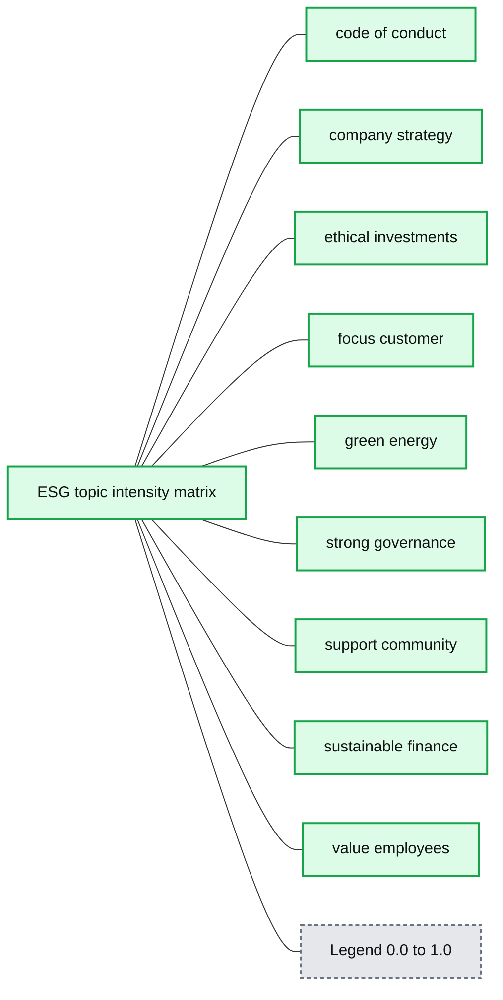
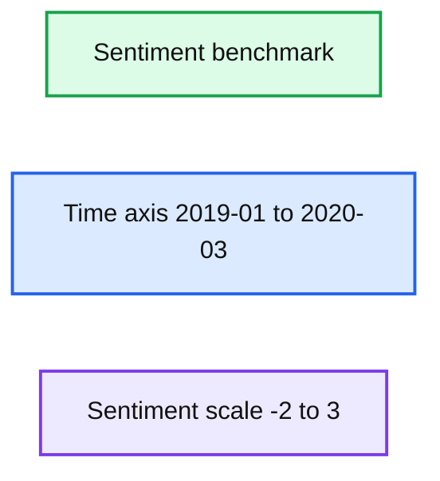
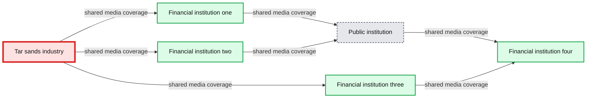
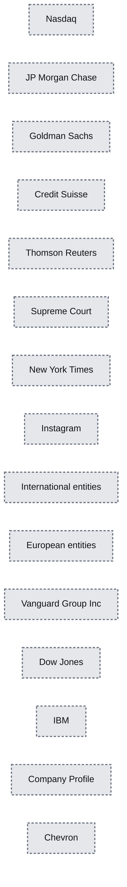
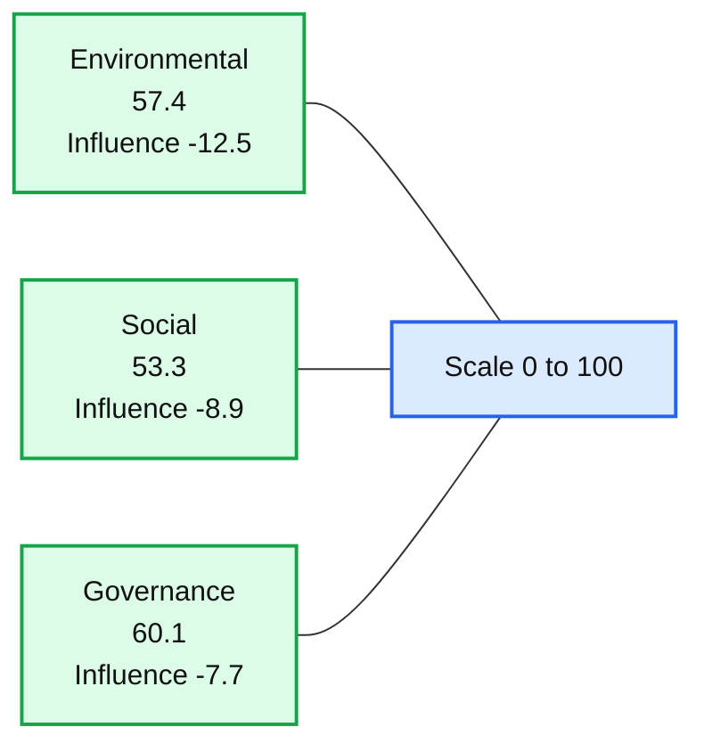
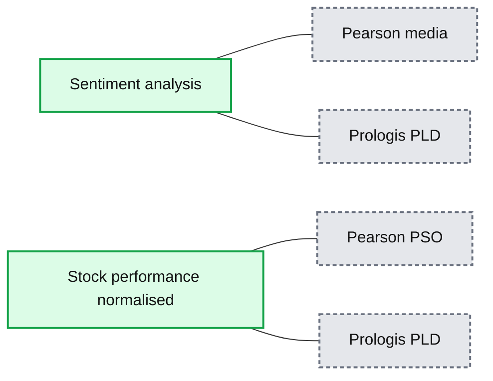
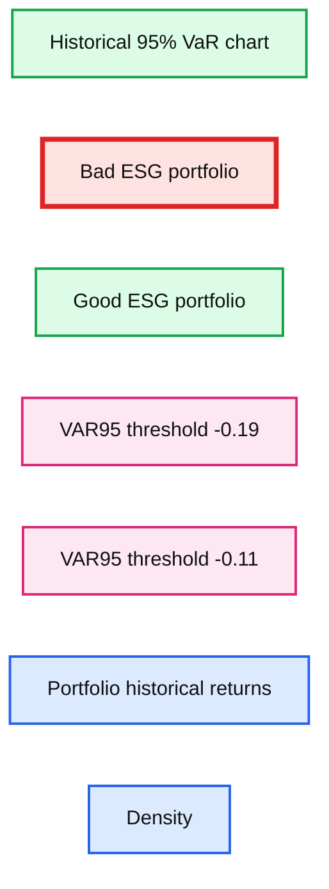

# A Data-driven Approach to Environmental, Social and Governance

- Source: https://www.databricks.com/blog/2020/07/10/a-data-driven-approach-to-environmental-social-and-governance.html
- Published: 2020-07-10
- Authors: Antoine Amend
- Categories: engineering, solution-accelerators, open-source, data-science-machine-learning
- Images: 9 total, 8 extracted as architecture

The future of finance goes hand in hand with social responsibility, environmental stewardship and corporate ethics. In order to stay competitive, Financial Services Institutions (FSI) are increasingly disclosing more information about their environmental, social and governance (ESG) performance. By better understanding and quantifying the sustainability and societal impact of any investment in a company or business, FSIs can mitigate reputation risk and maintain the trust with both their clients and shareholders. At Databricks, we increasingly hear from our customers that ESG has become a C-suite priority. This is not solely driven by altruism but also by economics: [Higher ESG ratings are generally positively correlated with valuation and profitability while negatively correlated with volatility.](https://corpgov.law.harvard.edu/2020/01/14/esg-matters/) In this blog post, we offer a novel approach to sustainable investing by combining natural language processing (NLP) techniques and graph analytics to extract key strategic ESG initiatives and learn companies' relationships in a global market and their impact to market risk calculations.

Using the Databricks Unified Data Analytics Platform, we will demonstrate how **Apache SparkTM**, **Delta Lake** and **MLflow **can enable asset managers to assess the sustainability of their investments and empower their business with a holistic and data-driven view to their environmental, social and corporate governance strategies. Specifically, we will extract the key ESG initiatives as communicated in yearly PDF reports and compare these with the actual media coverage from news analytics data.

**Summary:** The diagram shows ESG initiatives extracted from PDF reports and ESG sentiment derived from financial news, processed with MLflow and Apache Spark, then stored in Delta Lake to compare communicated and perceived ESG.

**Components:**

- ESG reports: source reports
- ESG initiatives: PDF documents
- MLflow: machine learning lifecycle platform
- Financial News: news data source
- ESG sentiment: sentiment analysis output
- Apache Spark: distributed data processing
- Delta Lake: analytical data storage
- Communicated vs. Perceived: comparison outcome

**Flows:**

- ESG reports -> ESG initiatives: ESG report content
- ESG initiatives -> MLflow: PDF inputs
- MLflow -> Delta Lake: processed communicated ESG data
- Financial News -> ESG sentiment: news content
- ESG sentiment -> Apache Spark: sentiment analysis data
- Apache Spark -> Delta Lake: processed perceived ESG data
- Delta Lake -> Communicated vs. Perceived: ESG comparison

**Numbers:** none

source image: https://www.databricks.com/wp-content/uploads/2020/07/blog-data-driven-approach-1.png

```mermaid
%% ESG data flows from reports and financial news into Delta Lake for comparison
flowchart LR
    reports[ESG reports] -->|report content| initiatives[ESG initiatives]
    initiatives -->|PDF inputs| mlflow[MLflow]
    mlflow -->|communicated ESG data| lake[Delta Lake]

    news[Financial News] -->|news content| sentiment[ESG sentiment]
    sentiment -->|sentiment data| spark[Apache Spark]
    spark -->|perceived ESG data| lake

    lake -->|ESG comparison| comparison[Communicated vs Perceived]

    classDef client fill:#dbeafe,stroke:#2563eb,stroke-width:2px,color:#111
    classDef service fill:#dcfce7,stroke:#16a34a,stroke-width:2px,color:#111
    classDef store fill:#ede9fe,stroke:#7c3aed,stroke-width:2px,color:#111
    classDef cache fill:#fef3c7,stroke:#d97706,stroke-width:2px,color:#111
    classDef queue fill:#cffafe,stroke:#0891b2,stroke-width:2px,color:#111
    classDef critical fill:#fee2e2,stroke:#dc2626,stroke-width:4px,color:#111
    classDef external fill:#e5e7eb,stroke:#6b7280,stroke-width:2px,color:#111,stroke-dasharray:4 3
    classDef decision fill:#fce7f3,stroke:#db2777,stroke-width:2px,color:#111
    class reports,news external
    class initiatives,sentiment service
    class mlflow,spark service
    class lake store
    class comparison decision
```

In the second part of this blog, we will learn the connections between companies and understand the positive or negative ESG consequences these connections may have to your business. While this blog will focus on asset managers to illustrate the modern approach to ESG and socially responsible investing, this framework is broadly applicable across all sectors in the economy from Consumer Staples and Energy to Media and Healthcare.

## Extracting key ESG initiatives

Financial services organisations are now facing more and more pressure from their shareholders to disclose more information about their environmental, social and governance strategies. Typically released on their websites on a yearly basis as a form of a PDF document, companies communicate their key ESG initiatives across multiple themes such as how they value their employees, clients or customers, how they positively contribute back to society or even how they mitigate climate change by, for example, reducing  (or committing to reduce) their carbon emissions. Consumed by third-party agencies (such as [msci](https://www.msci.com/our-solutions/esg-investing/esg-ratings) or [csrhub](https://www.csrhub.com/)), these reports are usually consolidated and benchmarked across industries to create ESG metrics.

### Extracting statements from ESG reports

In this example, we would like to programmatically access 40+ ESG reports from top tier financial services institutions (some are reported in the below table) and learn key initiatives across different topics. However, with no standard schema nor regulatory guidelines, communication in these PDF documents can be varied, making this approach a perfect candidate for the use of machine learning (ML).

| Barclays | https://home.barclays/content/dam/home-barclays/documents/citizenship/ESG/Barclays-PLC-ESG-Report-2019.pdf |
|---|---|
| JP Morgan Chase | https://www.jpmorganchase.com/content/dam/jpmc/jpmorgan-chase-and-co/documents/jpmc-cr-esg-report-2019.pdf |
| Morgan Stanley | https://www.morganstanley.com/pub/content/dam/msdotcom/sustainability/Morgan-Stanley_2019-Sustainability-Report_Final.pdf |
| Goldman Sachs | https://www.goldmansachs.com/our-commitments/sustainability/sustainable-finance/documents/reports/2019-sustainability-report.pdf |

Although our data set is relatively small, we show how one could distribute the scraping process using a user defined function (UDF), assuming the third-party library `PyPDF2` is available across your Spark environment.

Beyond regular expressions and fairly complex data cleansing  (reported in the attached notebooks), we also want to leverage more advanced NLP capabilities to tokenise content into grammatically valid sentences. Given the time it takes to load trained NLP pipelines in memory (such as the `spacy` library below), we ensure our model is loaded only once per Spark executor using a PandasUDF strategy as follows.

With this approach, we were able to convert raw PDF documents into well defined sentences (some are reported in the table below) for each of our 40+ ESG reports. As part of this process, we also lemmatised our content - that is, to transform a word into its simpler grammatical form, such as past tenses transformed to present form or plural form converted to singular. This extra process will pay off in the modeling phase by reducing the number of words to learn topics from.

| Goldman Sachs | we established a new policy to only take public those companies in the us and europe with at least one diverse board director (starting next year, we will increase our target to two) |
|---|---|
| Barclays | it is important to us that all of our stakeholders can clearly understand how we manage our business for good. |
| Morgan Stanley | in 2019, two of our financings helped create almost 80 affordable apartment units for low-and moderate-income families in sonoma county, at a time of extreme shortage. |
| Riverstone | in the last four years, the fund has conserved over 15,000 acres of bottomland hardwood forests, on track to meeting the 35,000-acre goal established at the start of the fund |

Although it is relatively easy for the human eye to infer the themes around each of these statements (in this case diversity, transparency, social, environmental), doing so programmatically and at scale is of a different complexity and requires advanced use of data science.

### Classifying ESG statements

In this section, we want to automatically classify each of our 8,000 sentences we extracted from 40+ ESG reports. Together with non matrix factorisation, [Latent Dirichlet Allocation](https://www.jmlr.org/papers/volume3/blei03a/blei03a.pdf) (LDA) is one of the core models in the topic modeling arsenal, using either its distributed version on Spark ML or its in-memory sklearn equivalent as follows. We compute our term frequencies and capture our LDA model and hyperparameters using MLflow experiments tracking.

Following multiple experiments, we found that 9 topics would summarise our corpus best. By looking deeper at the importance of each keyword learned from our model, we try to describe our 9 topics into 9 specific categories, as reported in the table below.

| **Suggested name** | **LDA descriptive keywords** |
|---|---|
| company strategy | *board, company, corporate, governance, management, executive, director, shareholder, global, engagement, vote, term, responsibility, business, team* |
| green energy | *energy, emission, million, renewable, use, project, reduce, carbon, water, billion, power, green, total, gas, source* |
| customer focus | *customer, provide, business, improve, financial, support, investment, service, year, sustainability, nancial, global, include, help, initiative* |
| support community | *community, people, business, support, new, small, income, real, woman, launch, estate, access, customer, uk, include* |
| ethical investments | *investment, climate, company, change, portfolio, risk, responsible, sector, transition, equity, investor, sustainable, business, opportunity, market* |
| sustainable finance | *sustainable, impact, sustainability, asset, management, environmental, social, investing, company, billion, waste, client, datum, investment, provide* |
| code of conduct | *include, policy, information, risk, review, management, investment, company, portfolio, process, environmental, governance, scope, conduct, datum* |
| strong governance | *risk, business, management, environmental, customer, manage, human, social, climate, approach, conduct, page, client, impact, strategic* |
| value employees | *employee, work, people, support, value, client, company, help, include, provide, community, program, diverse, customer, service* |

With our 9 machine learned topics, we can easily compare each of our FSI's ESG reports side by side to better understand the key priority focus for each of them.

**Summary:** Heatmap comparing the relative emphasis of 9 ESG topics across organizations ORG-0 through ORG-28.

**Components:**

- Organizations ORG-0 through ORG-28 - technology not specified
- ESG topics: code of conduct, company strategy, ethical investments, focus customer, green energy, strong governance, support community, sustainable finance, value employees - technology not specified
- Topic intensity scale from 0.0 to 1.0 - color encoding

**Flows:**

- none

**Numbers:** ORG-0 through ORG-28; 9 topics; scale values 0.0, 0.2, 0.4, 0.6, 0.8, 1.0; 30 financial services organizations stated in the surrounding text

source image: https://www.databricks.com/wp-content/uploads/2020/07/blog-data-driven-approach-2.png

Using seaborn visualisation, we can easily flag key differences across our companies (organisations' names redacted). When some organisations would put more focus on valuing employees and promoting diversity and inclusion (such as ORG-21), some seem to be more focused towards ethical investments (ORG-14). As the output of LDA is a probability distribution across our 9 topics instead of one specific theme, we easily unveil the most descriptive ESG initiative for any given organisation using a simple SQL statement and a partitioning function that captures the highest probability for each theme.

This SQL statement provides us with a NLP generated executive summary for Goldman Sachs (see original report), summarising a complex 70+ pages long document into 9 ESG initiatives / actions.

| **Topic** | **Statement** |
|---|---|
| support community | Called the Women Entrepreneurs Opportunity Facility (WEOF), the program aims to address unmet financing needs of women-owned businesses in developing countries, recognizing the significant obstacles that women entrepreneurs face in accessing the capital needed to grow their businesses. |
| strong governance | The ERM framework employs a comprehensive, integrated approach to risk management, and it is designed to enable robust risk management processes through which we identify, assess, monitor and manage the risks we assume in conducting our business activities. |
| sustainable finance | In addition to the Swedish primary facility, Northvolt also formed a joint venture with the Volkswagen Group to establish a 16 GWh battery cell gigafactory in Germany, which will bring Volkswagens total investment in Northvolt to around $1 billion. |
| green energy | Besides reducing JFKs greenhouse gas emissions by approximately 7,000 tons annually (equivalent to taking about 1,400 cars off the road), the project is expected to lower the Port Authority's greenhouse gas emissions at the airport by around 10 percent The GSAM Renewable Power Group will hold the power purchase agreement for the project, while SunPower will develop and construct the infrastructure at JFK. |
| customer focus | Program alumni can also join the 10KW Ambassadors Program, an advanced course launched in 2019 that enables the entrepreneurs to further scale their businesses.10,000 Women Measures Impacts in China In Beijing, 10,000 Women held a 10-year alumni summit at Tsinghua University School of Economics and Management. |
| ethical investments | We were one of the first US companies to commit to the White House American Business Act on Climate Pledge in 2015; we signed an open letter alongside 29 other CEOs in 2017 to support the US staying in the Paris Agreement; and more recently, we were part of a group of 80+ CEOs and labour leaders reiterating our support that staying in the Paris Agreement will strengthen US competitiveness in global markets. |
| value employee | Other key initiatives that enhance our diversity of perspectives include: Returnship Initiative, which helps professionals restart their careers after an extended absence from the workforce The strength of our culture, our ability to execute our strategy, and our relevance to clients all depend on a diverse workforce and an inclusive environment that encourages a wide range of perspectives. |
| company strategy | Underscoring our conviction that diverse perspectives can have a strong impact on company performance, we have prioritized board diversity in our stewardship efforts. |
| code of conduct | 13%Please see page 96 of our 2019 Form 10-K for further of approach to incorporation of environmental, social and governance (ESG) factors in credit analysisDiscussion and AnalysisFN-CB-410a.2Environmental Policy Framework |

Although we may observe some misclassification (mainly related to how we have named each topic) and may have to tune our model more, we have demonstrated how NLP techniques can be used to efficiently extract well defined initiatives from complex PDF documents. These, however, may not always reflect companies' core priorities nor does it capture every initiative for each theme. This can be further addressed using techniques borrowed from anomaly detection, grouping corpus into broader clusters and extracting sentences that deviate the most from the norm (i.e. sentences specific to an organisation and not mainstream). This approach, using K-Means, is discussed in our notebooks attached.

## Create a data-driven ESG score

As covered in the previous section, we were able to compare businesses side by side across 9 different ESG initiatives. Although we could attempt to derive an ESG score (the approach many third-party organisations would use), we want our score not to be subjective but truly data-driven. In other terms, we do not want to solely base our assumptions on companies' official disclosures but rather on how companies' reputations are perceived in the media, across all 3 environmental, social and governance variables. For that purpose, we use [GDELT](https://www.gdeltproject.org/), the global database of event location and tones.

### Data acquisition

Given the volume of data available in GDELT (100 million records for the last 18 months only), we leverage the [lakehouse](https://www.databricks.com/blog/2020/01/30/what-is-a-data-lakehouse.html) paradigm by moving data from raw, to filtered and enriched, respectively from Bronze, to Silver and Gold layers, and extend our process to operate in near real time (GDELT files are published every 15mn). For that purpose, we use a Structured Streaming approach that we `trigger` in batch mode with each batch operating on data increment only. By unifying Streaming and Batch, Spark is the de-facto standard for data manipulation and ETL processes in modern data lake infrastructures.

From the variety of dimensions available in GDELT, we only focus on sentiment analysis (using the tone variable) for financial news related articles only. We assume financial news articles to be well captured by the GDELT taxonomy starting with ECON_*. Furthermore, we assume all environmental articles to be captured as ENV_* and social articles to be captured by UNGP_* taxonomies ([UN guiding principles on human rights](https://en.wikipedia.org/wiki/United_Nations_Guiding_Principles_on_Business_and_Human_Rights)).

### Sentiment analysis as proxy for ESG

Without any industry standard nor existing models to define environmental, social and governance metrics, and without any ground truth available to us at the time of this study, we assume that the overall tone captured from financial news articles is a good proxy for companies' ESG scores. For instance, a series of bad press articles related to maritime disasters and oil spills would strongly affect a company's environmental performance. On the opposite, news articles about [...] *financing needs of women-owned businesses in developing countries* [[source](https://www.bloomberg.com/tosv2.html?vid=&uuid=d3a0b7bb-90aa-11ec-b475-46526d66537a&url=L25ld3MvYXJ0aWNsZXMvMjAxOS0xMC0wOC9nb2xkbWFuLXNhY2hzLWhlbHBzLWxvYW4tMS00NS1iaWxsaW9uLXRvLXdvbWVuLWVudHJlcHJlbmV1cnM=)] with a more positive tone would positively contribute to a better ESG score. Our approach is to look at the difference between a company sentiment and its industry average; how much more "positive" or "negative" a company is perceived across all its financial services news articles, over time.

In the example below, we show that difference in sentiment (using a 15 days moving average) between one of our key FSIs and its industry average. Apart from a specific time window around COVID-19 virus outbreak in March 2020, this company has been constantly performing better than the industry average, indicating a good environmental score overall.

**Summary:** Time-series chart showing sentiment benchmark values from January 2019 to March 2020.

**Components:**

- Sentiment benchmark series, technology not specified
- Time axis, dates from 2019-01 through 2020-03
- Sentiment scale, ranging approximately from -2 to 3

**Flows:**

- none

**Numbers:** -2, -1, 0, 1, 2, 3, 2019-01, 2019-03, 2019-05, 2019-07, 2019-09, 2019-11, 2020-01, 2020-03, 15 days

source image: https://www.databricks.com/wp-content/uploads/2020/07/blog-data-driven-approach-3.png

Generalising this approach to every entity mentioned in our GDELT dataset, we are no longer limited to the few FSIs we have an official ESG report for and are able to create an internal score for each and every single company across their environmental, social and governance dimensions. In other words, we have started to shift our ESG lense from being subjective to being data-driven.

## Introducing a propagated weighted ESG metrics

In a global market, companies and businesses are inter-connected, and the ESG performance of one (e.g. seller) may affect the reputation of another (e.g. buyer). As an example, if a firm keeps investing in companies directly or indirectly related to environmental issues, this risk should be quantified and must be reflected back on companies' reports as part of their ethical investment strategy. We could cite the example of Barclays' reputation being impacted in late 2018 because of its indirect connections to tar sand projects ([source](https://www.theguardian.com/business/2018/dec/05/barclays-customers-threaten-leave-en-masse-tar-sands-investment-greenpeace)).

### Identifying influencing factors

Democratised by Google for web indexing, [Page Rank](https://en.wikipedia.org/wiki/PageRank) is a common technique used to identify nodes' influence in large networks. In our approach, we use a variant of Page Rank, Personalised Page Rank, to identify influential organisations relative to our key financial services institutions. The more influential these connections are, the more likely they will contribute (positively or negatively) to our ESG score. An illustration of this approach is reported below where indirect connections to tar sand industry may negatively contribute to a company ESG score proportional to its personalised page rank influence.

**Summary:** The diagram shows a tar sands industry node connected through shared-media relationships to financial institutions and a public institution.

**Components:**

- Tar sands industry node - technology not specified
- Financial institution nodes - technology not specified
- Public institution node - technology not specified

**Flows:**

- Tar sands industry -> Financial institution one: shared media coverage
- Tar sands industry -> Financial institution two: shared media coverage
- Tar sands industry -> Financial institution three: shared media coverage
- Financial institution one -> Public institution: shared media coverage
- Financial institution two -> Public institution: shared media coverage
- Public institution -> Financial institution four: shared media coverage
- Financial institution three -> Financial institution four: shared media coverage

**Numbers:** none

source image: https://www.databricks.com/wp-content/uploads/2020/07/blog-data-driven-approach-4.png

Using [Graphframes](https://graphframes.github.io/graphframes/docs/_site/index.html), we can easily create a network of companies sharing a common media coverage. Our assumption is that the more companies are mentioned together in news articles, the stronger their link will be (edge weight). Although this assumption may also infer wrong connections because of random co-occurrence in news articles (see later), this undirected weighted graph will help us find companies' importance relative to our core FSIs we would like to assess.

By studying this graph further, we observe a power of law distribution of its edge weights: 90% of the connected businesses share a very few connections. We drastically reduce the graph size from 51,679,930 down to 61,143 connections by filtering edges for a weight of 200 or above (empirically led threshold). Prior to running Page Rank, we also optimise our graph by further reducing the number of connections through a [Shortest Path](https://en.wikipedia.org/wiki/Shortest_path_problem) algorithm and compute the maximum number of hops a node needs to follow to reach any of our core FSIs vertices (captured in `landmarks` array). The depth of a graph is the maximum of every shortest path possible, or the number of connections it takes for any random node to reach any others (the smaller the depth is, denser is our network).

We can directly visualise the top 100 influential nodes to a specific business (in this case Barclays PLC) as per below graph. Without any surprise, Barclays is well connected with most of our core FSIs (such as the institutional investors JP Morgan Chase, Goldman Sachs or Credit Suisse), but also to the Security Exchange Commission, Federal Reserve and International Monetary Fund.

**Summary:** Ranked bar chart showing the importance of Barclays PLC’s connected entities to its ESG score.

**Components:**

- Nasdaq - technology not specified
- JP Morgan Chase - technology not specified
- Goldman Sachs - technology not specified
- Credit Suisse - technology not specified
- Thomson Reuters - technology not specified
- Supreme Court - technology not specified
- New York Times - technology not specified
- Instagram - technology not specified
- International entities - technology not specified
- European entities - technology not specified
- Vanguard Group Inc - technology not specified
- Dow Jones - technology not specified
- IBM - technology not specified
- Company Profile - technology not specified
- Intel - technology not specified
- Chevron - technology not specified
- Drug Administration - technology not specified
- Johnson Johnson - technology not specified

**Flows:**

- none

**Numbers:** Importance axis values 0, 0.002, 0.004, 0.006, 0.008, 0.01, 0.012, 0.014, 0.016

source image: https://www.databricks.com/wp-content/uploads/2020/07/blog-data-driven-approach-5.png

Further down this distribution, we find public and private companies such as Chevron, Starbucks or Johnson and Johnson. Strongly or loosely related, directly or indirectly connected, all these businesses (or entities from an NLP standpoint) could theoretically affect Barclays ESG performance, either positively or negatively, and as such impact Barclays' reputation.

### ESG as a propagated metric

By combining our ESG score captured earlier with the importance of each of these entities, it becomes easy to apply a weighted average on the "Barclays network" where each business contributes to Barclays' ESG score proportionally to its relative importance. We call this approach a **propagated weighted ESG score** (PW-ESG).

We observe the negative or positive influence of any company's network using a word cloud visualisation. In the picture below, we show the negative influence (entities contributing negatively to ESG) for a specific organisation (name redacted).

Due to the nature of news analytics, it is not surprising to observe news publishing companies (such as Thomson Reuters or Bloomberg) or social networks (Facebook, Twitter) as strongly connected organisations. Not reflecting the true connections of a given business but rather explained by a simple co-occurrence in news articles, we should consider filtering them out prior to our page rank process by removing nodes with a high degree of connections. However, this additional noise seems constant across our FSIs and as such does not seem to disadvantage one organisation over another. An alternative approach would be to build our graph using established connections as extracted from advanced uses of NLP on raw text content. This, however, would drastically increase the complexity of this project and the costs associated with news scraping processes.

Finally, we represent the original ESG score as computed in the previous section, and how much of these scores were reduced (or increased) using our PW-ESG approach across its environmental, social and governance dimensions. In the example below, for a given company, the initial scores of 69, 62 and 67 have been reduced to 57, 53 and 60, with the most negative influence of PW-ESG being on its environmental coverage (-20%).

**Summary:** Environmental, Social, and Governance gauges show reduced scores and PW-ESG influence values.

**Components:**

- Environmental gauge, technology not specified
- Social gauge, technology not specified
- Governance gauge, technology not specified

**Flows:**

- No arrows are visible.

**Numbers:** 0, 50, 100, 57.4, -12.5, 53.3, -8.9, 60.1, -7.7

source image: https://www.databricks.com/wp-content/uploads/2020/07/blog-data-driven-approach-7.png

Using the agility of [Redash](https://www.databricks.com/blog/2020/06/24/welcoming-redash-to-databricks.html) coupled with the efficiency of Databricks' runtime, this series of insights can be rapidly packaged up as a BI/MI report, bringing ESG as-a-service to your organisation for asset managers to better invest in sustainable and responsible finance.

It is worth mentioning that this new framework is generic enough to accommodate multiple use cases. Whilst core FSIs may consider their own company as a landmark to Page Rank in order to better evaluate reputational risks, asset managers could consider all their positions as landmarks to better assess the sustainability relative to each of their investment decisions.

### ESG applied to market risk

In order to validate our initial assumption that [...] [higher ESG ratings are generally positively correlated with valuation and profitability while negatively correlated with volatility](https://corpgov.law.harvard.edu/2020/01/14/esg-matters/), we create a synthetic portfolio made of random equities that we run through our PW-ESG framework and combine with actual stock information retrieved from Yahoo Finance. As reported in the graph below, despite an evident lack of data to draw scientific conclusions, it would appear that our highest and lowest ESG rated companies (we report the sentiment analysis as a proxy of ESG in the top graph) are respectively the best or worst profitable instruments in our portfolio over the last 18 months.

**Summary:** The chart compares sentiment analysis and normalized stock performance for Pearson and Prologis from January 2019 to March 2020.

**Components:**

- Sentiment analysis panel - technology not shown
- Stock performance panel - technology not shown
- Pearson media series
- Prologis PLD series

**Flows:**

- none

**Numbers:** 2.0, 1.5, 1.0, 0.5, 0.0, -0.5, -1.0, -1.5, -2.0, 160, 140, 120, 100, 80, 60, 2019-01, 2019-03, 2019-05, 2019-07, 2019-09, 2019-11, 2020-01, 2020-03, 18 months

source image: https://www.databricks.com/wp-content/uploads/2020/07/blog-data-driven-approach-8.png

Interestingly, CSRHub reports the exact opposite, Pearson (media) being 10 points above Prologis (property leasing) in terms of ESG scores, highlighting the subjectivity of ESG scoring and its inconsistency between what is communicated and what is actually observed.

Following up on our recent blog post about [modernizing risk management](https://www.databricks.com/blog/2020/05/27/modernizing-risk-management-part-1-streaming-data-ingestion-rapid-model-development-and-monte-carlo-simulations-at-scale.html), we can use this new information available to us to drive better risk calculations. Splitting our portfolio into 2 distinct books, composed of the best and worst 10% of our ESG rated instruments, we report in the graph below the historical returns and its corresponding 95% value-at-risk (historical VaR).

**Summary:** Historical return distributions compare bad and good ESG portfolios, with 95% VaR thresholds showing greater risk for the bad ESG portfolio.

**Components:**

- Historical 95% VaR chart
- Bad ESG portfolio distribution
- Good ESG portfolio distribution
- VAR95 threshold at -0.19
- VAR95 threshold at -0.11
- Portfolio historical returns axis
- Density axis

**Flows:**

- none

**Numbers:** 95%, -0.19, -0.11, -0.4, -0.2, 0.0, 0.2, 0.4, 0.0, 2.5, 5.0, 7.5, 10.0, 12.5, 15.0, 17.5

source image: https://www.databricks.com/wp-content/uploads/2020/07/blog-data-driven-approach-9.png

Without any prior knowledge of our instruments beyond the metrics we extracted through our framework, we can observe a risk exposure to be 2 times higher for a portfolio made of poor ESG rated companies, supporting the assumptions found in the literature that "poor ESG [...] correlates with higher market volatility", hence to a greater value-at-risk.

As covered in our previous blog, the future of risk management lies with agility and interactivity. Risk analysts must augment traditional data with alternative data and alternative insights in order to explore new ways of identifying and quantifying the risks facing their business. Using the flexibility and scale of cloud compute and the level of interactivity in your data enabled through our Databricks runtime, risk analysts can better understand the risks facing their business by slicing and dicing market risk calculations at different industries, countries, segments, and now at different ESG ratings. This data-driven ESG framework enables businesses to ask new questions such as: how much of your risk would be decreased by bringing the environmental rating of this company up 10 points? How much more exposure would you face by investing in these instruments given their low PW-ESG scores?

## Transforming your ESG strategy

In this blog, we have demonstrated how complex documents can be quickly summarised into key ESG initiatives to better understand the sustainability aspect of each of your investments. Using graph analytics, we introduced a novel approach to ESG by better identifying the influence a global market has to both your organisation strategy and reputational risk. Finally, we showed the economic impact of ESG factors  on market risk calculation. As a starting point to a data-driven ESG journey, this approach can be further improved by bringing the internal data you hold about your various investments and the additional metrics you could bring from third-party data, propagating the risks through our PW-ESG framework to keep driving more sustainable finance and profitable investments.

Try the following [notebooks](https://notebooks.databricks.com/notebooks/fsi/esg_scoring/index.html)on Databricks to accelerate your ESG development strategy today and [contact us](https://www.databricks.com/company/contact) to learn more about how we assist customers with similar use cases.
