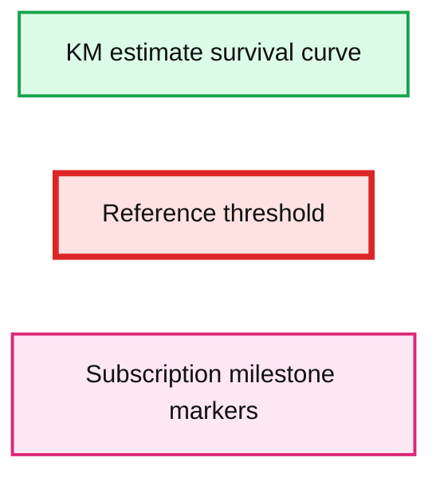
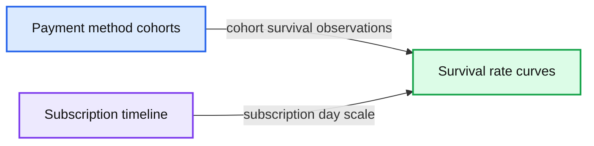
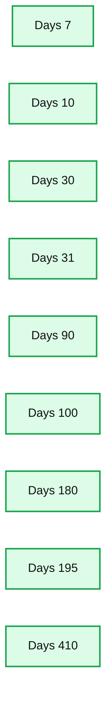
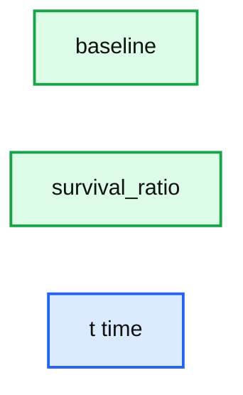

# Analyzing Customer Attrition in Subscription Models

- Source: https://www.databricks.com/blog/2020/07/15/analyzing-customer-attrition-in-subscription-models.html
- Published: 2020-07-15
- Authors: Rob Saker, Bryan Smith
- Categories: engineering, solution-accelerators, open-source, data-science-machine-learning, data-engineering
- Images: 5 total, 5 extracted as architecture

[Download the notebooks to demo the solution covered below](https://notebooks.databricks.com/notebooks/RCG/Survival/index.html?_gl=1*1739h6r*_ga*NDc2MjY3NC4xNjYwODU3NDMw*_ga_PQSEQ3RZQC*MTY2OTEzOTM0OS4yMjguMS4xNjY5MTM5NjMwLjAuMC4w#Survival_1.html)

The subscription model is experiencing a renaissance.  Gone are the days of the penny music CD clubs, replaced by an ever-increasing assortment of digital streaming services delivering music, videos and more directly to consumers' devices in exchange for a modest recurring fee. Today, 70% of US households subscribe to [at least one subscription streaming service](https://www.forbes.com/sites/tonifitzgerald/2019/03/29/how-many-streaming-video-services-does-the-average-person-subscribe-to/#238213c16301) with an average of 3.4 such subscriptions per subscriber household.

The success of these services combined with increasing consumer demand for convenience has pushed more and more [retailers](https://www.theatlantic.com/health/archive/2019/05/how-amazon-helped-turn-daily-life-subscription/588526/) and [consumer goods companies](https://www.mckinsey.com/industries/consumer-packaged-goods/our-insights/should-cpg-manufacturers-go-direct-to-consumer-and-if-so-how) in on the act.  Between 2014 and 2017, the subscription box market grew 890% with a disproportionate share of consumer interest focused on Food, Beauty and Apparel.  By the end of this period, [approximately 15%](https://www.mckinsey.com/industries/technology-media-and-telecommunications/our-insights/thinking-inside-the-subscription-box-new-research-on-ecommerce-consumers) of online shoppers had signed up for such services.  By late 2019, that rate had grown to [over 50%](https://clutch.co/logistics/resources/subscription-box-service-statistics) with registrations extending[well beyond](https://www.forbes.com/sites/gregpetro/2019/04/12/why-subscription-boxes-are-here-to-stay/#27c45dbf7037) the millennial consumers that fed the rapid growth in this space.  And as consumers rethink past spending patterns in light of ongoing health and safety concerns, the offer of reliable, doorstep-delivery of essential goods is promoting even [further growth](https://retailtouchpoints.com/resources/covid-19-boosts-subscription-enrollments-40) in the subscription market.

For both retailers, this new model represents an opportunity to reach new customers and secure recurring revenue streams.  For consumer goods manufacturers, this model provides the [additional benefit](https://www.supplychainquarterly.com/articles/1811-delivering-on-direct-to-consumer-in-the-cpg-industry) of connecting directly with consumers - something consumers are increasingly [coming to expect](https://www.iab.com/wp-content/uploads/2018/04/The-Direct-Brand-Economy-Master-Deck-v17.pdf) - that would otherwise be hidden behind retailers. It also opens up additional avenues for promoting brands and delivering product to the customer via routes [fully in control](https://www.fool.com/the-blueprint/power-direct-consumer-model/) of the manufacturer.  At the same time, these models provide retailers the ability to introduce their own[private labels](https://www.glossy.co/beauty/birchbox-rethinks-private-label-beauty-strategy) in a manner that overcomes some of the past barriers to consumer adoption. The potential of the direct-to-consumer subscription market is huge, but it's yet to be determined exactly who the winners and the losers in this space will ultimately be.

## There are no guarantees of success

Success in the subscription space [does not come easy](https://www.mckinsey.com/industries/technology-media-and-telecommunications/our-insights/thinking-inside-the-subscription-box-new-research-on-ecommerce-consumers) as "consumers do not have an inherent love of subscriptions." Services often have to drive awareness through increasingly expensive advertising buys and entice subscribers with free or discounted trials that very frequently fail to convert to full-priced subscriptions. Should a subscriber convert, keeping them engaged is an on-going challenge as fatigue sets in or product simply stacks up.  Quick exit policies intended to ease subscribers' concerns surrounding long-term commitments to new service providers, make it simple for customers to [leave](https://www.pymnts.com/digital-payments/2019/subscription-commerces-fear-of-commitment-moment/) a service with relatively short notice, putting the promises of steady revenues at risk.

One [recent analysis](https://info.recurly.com/annual-subscription-billling-metrics-report?submissionGuid=3c21cde7-5f58-4d86-9218-332d697e7b3e) of consumer-oriented subscription services estimated a segment average 7.2% monthly rate of churn.  When narrowed to services focused on consumer goods, that rate jumped to 10.0%. This figure translates to a lifetime 10 months for the average subscription box service, leaving businesses little time to recover acquisition costs and bring subscribers to net profitability.

## Balancing customer acquisition & retention is critical

And this is the central challenge to the long-term success of any subscription service. High profile services such as [Blue Apron](https://www.inc.com/erik-sherman/blue-apron-has-a-very-big-problem-that-can-plague-any-entrepreneur.html) have provided very public case studies on the consequences of high customer acquisition costs coupled with low customer lifetime value, but [every subscription service](https://hbr.org/2017/12/subscription-businesses-are-booming-heres-how-to-value-them) must struggle with their own balance between customer acquisition and customer retention.

This is particularly challenging in that successful customer acquisition strategies needed to get services to scale tend to be followed by service disruptions or declines in quality and customer experience, accelerating subscription abandonment. To replenish lost subscribers, the acquisition engine continues to grind and expenses mount. As services reach for customers beyond the core segments they may have initially targeted, the service offerings may not resonate with new subscribers over the same durations of time or may overwhelm the ability of these subscribers to consume, reinforcing the [overall problem of subscriber churn](https://www.retaildive.com/news/nearly-40-of-subscribers-ultimately-cancel-services/517937/).

At some point, it becomes critical for organizations to take a cold, hard look at the cost of acquisition relative to the subscriber lifetime value (LTV) earned. These figures need to be brought into a healthy balance, and retention needs to be actively managed, not as a point-in-time problem to be solved, but as a "chronic condition" which [needs to be managed](https://retailtouchpoints.com/features/trend-watch/can-subscription-retail-solve-its-customer-retention-problem) for the ongoing health of the business.

Headroom for continued acquisition-driven growth can be created by carefully examining why some customers leave and some customers stay.  When centered on factors known at the time of acquisition, businesses may have the opportunity to rethink key aspects of their acquisition strategy that promote higher average retention rates and profitability.

## Examining retention based on acquisition variables

Public data for subscription services is extremely hard to come by, but one service, KKBox, a Taiwan-based music streaming service, recently made 2+ years of anonymized [subscription data](https://www.kaggle.com/c/kkbox-churn-prediction-challenge) available for the examination of customer churn. While not a retail or CPG subscription service, the customer dynamics found in the data should resonate with any subscription provider.

The vast majority of subscribers join the KKBox service under an initial 30-day trial offering.  Customers then appear to enlist in 1-year subscriptions which provide the service with a steady flow of revenue.  Within the 30-day trial and at regular one-year intervals, subscribers have the opportunity to churn as shown in Figure 1 where Survival Rate reflects the proportion of the initial (Day 1) subscriber population that is retained over time, first at the roll-to-pay milestone, and then at the renewal milestone.

**Summary:** The chart shows customer survival declining by subscription day, with milestone markers and a reference threshold.

**Components:**

- KM_estimate survival curve
- Red dotted reference line
- Vertical dotted milestone markers

**Flows:**

- none

**Numbers:** none

source image: https://www.databricks.com/wp-content/uploads/2020/07/blog-model-subscription-1.png

Figure 1. Customer attrition by subscription day on the KKBox streaming service

This pattern of high initial drop-off, followed by a period of slower but continuing  drop-off cycles makes intuitive sense. What's striking is that if we consider the registration channel (Figure 2), initial payment method and initial payment terms/days (Figure 3) for these subscriptions, we find vastly different patterns of customer churn, not just in the transition from the first renewal window window but over the two-year duration for which customer data was made available.

source image: https://www.databricks.com/wp-content/uploads/2020/07/blog-model-subscription-2.png

Figure 2. Customer attrition by subscription day on the KKBox streaming service for customers registering via different channels

**Summary:** Survival-rate curves over the subscription timeline for customers grouped by initial payment method.

**Components:**

- Method 20 through Method 41: customer cohorts grouped by initial payment method

**Flows:**

- none

**Numbers:** Payment methods 20, 22, 28, 29, 30, 31, 32, 33, 34, 35, 36, 37, 38, 39, 40, 41; timeline values 0 through 750; survival-rate values 0.00 through 0.55.

source image: https://www.databricks.com/wp-content/uploads/2020/07/blog-model-subscription-3.png

**Summary:** The chart shows customer attrition over subscription days for customers with different payment terms.

**Components:**

- Days 7
- Days 10
- Days 30
- Days 31
- Days 90
- Days 100
- Days 180
- Days 195
- Days 410

**Flows:**

- none

**Numbers:** 7, 10, 30, 31, 90, 100, 180, 195, 410

source image: https://www.databricks.com/wp-content/uploads/2020/07/blog-model-subscription-4.png

Figure 3. Customer attrition by subscription day on the KKBox streaming service for customers selecting different initial payment methods and terms/days

These patterns seem to indicate that KKBox could actually differentiate between customers based on their lifetime potential using information known at the time of subscriber acquisition. This information might help inform or steer specific discounts or promotions to customers as they register for a trial. This information might also inform KKBox of which offerings or capabilities to discontinue as some, *e.g.* Initial Payment Method 35 or the 7-day payment plan as shown in Figure 3, align with exceptionally high churn rates in the first 30-days with little long-term survivorship.

Of course, there are relationships between these factors so that we should be careful in viewing them in isolation. By deriving a baseline risk (hazard) of customer churn (Figure 4), we can calculate the influence of different factors on the baseline in such a manner that each factor may be considered an independent hazard multiplier (Table 1).  When combined with the baseline, we can plot  a specific customer's chances of abandoning a subscription by a given point in time.

**Summary:** The chart compares baseline and survival ratio over time in a subscription lifespan.

**Components:**

- baseline series
- survival_ratio series
- t time axis

**Flows:**

- none

**Numbers:** 0, 0.2, 0.4, 0.6, 0.8, 1, 50, 100, 150, 200, 250, 300, 350, 400, 450, 500, 550, 600, 650, 700, 750, 800

source image: https://www.databricks.com/wp-content/uploads/2020/07/blog-model-subscription-5.png

Figure 4. The baseline risk of customer attrition over a subscription lifespan

| **Category** | **Feature** | **Factor** |
|---|---|---|
| Registration Channel | channel_3 | 0.96 |
| channel_4 | 1.20 |  |
| channel_7 | 1.00 |  |
| channel_9 | 0.92 |  |
| Initial Payment Method | method_20 | 5.15 |
| method_22 | 3.00 |  |
| method_28 | 5.31 |  |
| method_29 | 2.50 |  |
| method_30 | 2.27 |  |
| method_31 | 0.94 |  |
| method_32 | 2.89 |  |
| method_33 | 1.53 |  |
| method_34 | 0.57 |  |
| method_35 | 4.43 |  |
| method_36 | 2.30 |  |
| method_37 | 1.10 |  |
| method_38 | 3.32 |  |
| method_39 | 1.19 |  |
| method_40 | 1.32 |  |
| method_41 | 1.00 |  |

Table 1. The channel and payment method multipliers that combine to explain a customer's risk of attrition at various points in time. The higher the value, the higher the proportional risk of churn in the associated period.

## Applying churn analytics  to your data

The exciting part of this analysis is that not only does it help to quantify the risk of customer churn but it paints a quantitative picture of exactly which factors explain that risk.  It's important that we not draw too rash of a conclusion with regards to the causal linkage between a particular attribute and its associated hazard, but it's an excellent starting point for identifying where an organization needs to focus its attention for further investigation.

The hard part in this analysis is not the analytic techniques.  The Kaplan-Meier curves and Cox Proportional Hazard models used to perform the analysis above are well established and widely supported across analytics platforms.  The principal challenge is organizing the input data.

The vast majority of subscription services are fairly new as businesses.  As such, the data required to examine customer attrition may be scattered across multiple systems, making an integrated analysis more difficult. Data Lakes are a starting point for solving this problem, but complex transformations required to cleanse and restructure data that has evolved as the business itself has (often rapidly) evolved requires considerable processing power.  This is certainly the case with the KKBox information assets and is a point noted by the data provider in their public challenge.

The key to successfully completing this work is the establishment of transparent, maintainable data processing pipelines executed on an elastically-scalable (and therefore cost-efficient) infrastructure, a key driver behind the [Delta Lake pattern](https://www.databricks.com/blog/2019/08/14/productionizing-machine-learning-with-delta-lake.html). While most organizations may not be overly cost-conscious in their initial approach, it's important to remember the point made above that churn is a chronic condition to be managed.  As such, this is an analysis that should be periodically revisited to ensure acquisition and retention practices are aligned.

To support this, we are making the code behind our analysis available for download and review.  If you have any questions about how this solution can be deployed in your environment, please don't hesitate to [reach out](https://www.databricks.com/company/contact) to us.

 

[Get the notebooks](https://notebooks.databricks.com/notebooks/RCG/Survival/index.html)
